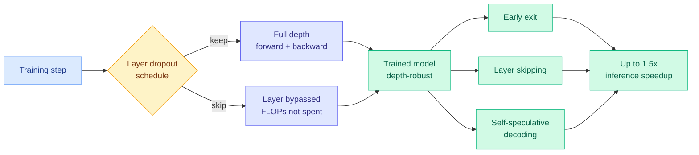
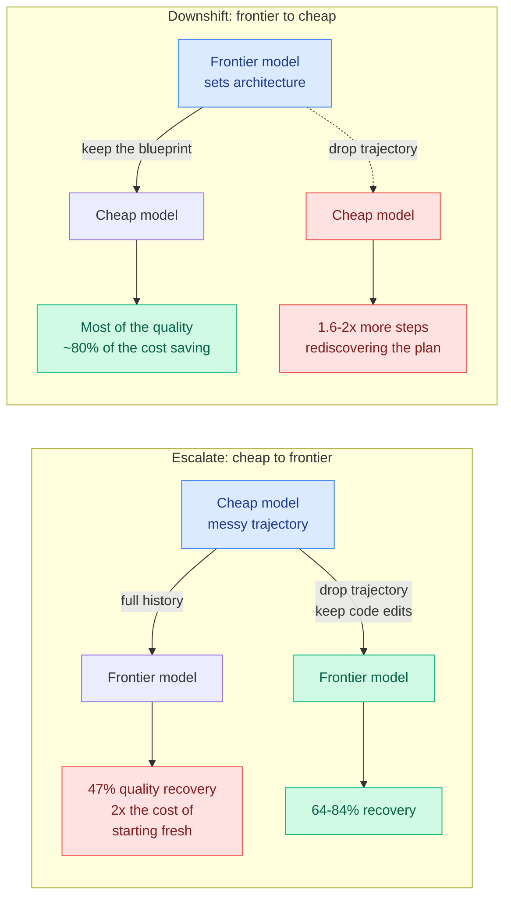
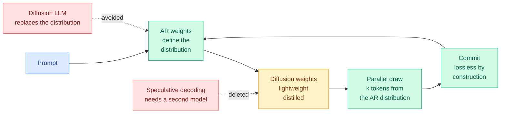
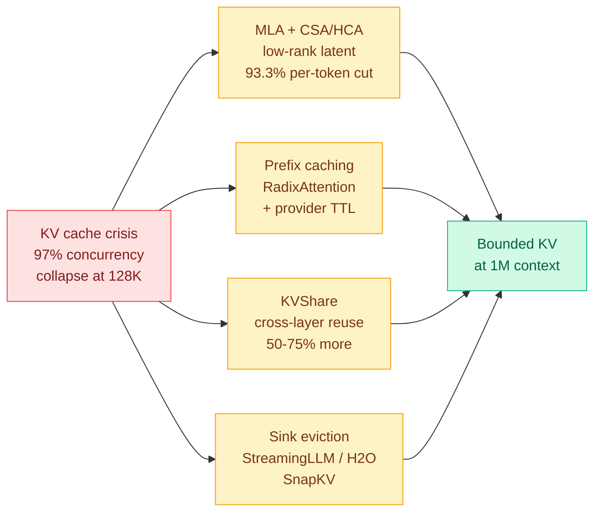
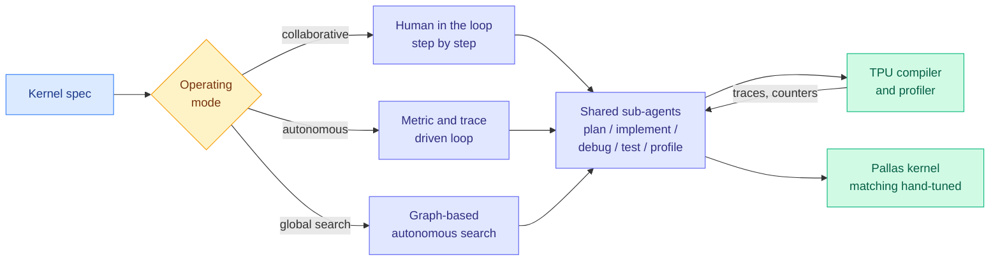
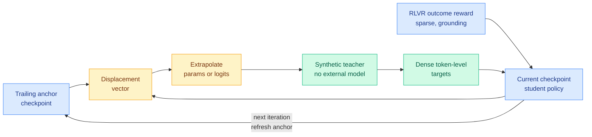
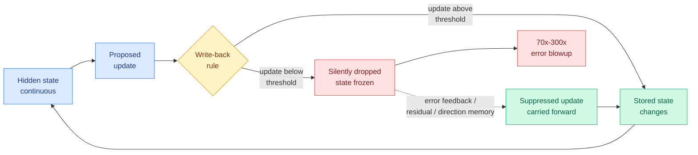

# cere-bro | 2026-09-07

> Today's papers agree on where the waste lives and disagree about almost nothing else. Layer dropout says 25% of your training FLOPs are being spent on depth the model does not need. Uno says the draft model in your speculative decoder is unnecessary. KVShare says adjacent layers' key-value caches are near-duplicates. RISE says you do not need an external teacher because your own optimization trajectory already points at a better one. And the day's largest measurement, 36 billion tokens of it, says that when you escalate a coding agent from the cheap model to the frontier model, the thing you were most careful to preserve, the conversation history, is the thing that costs you the most. Read as cost optimization the day has one instruction: the expensive component is usually the one you assumed was load-bearing.

<div class="today3">
<div class="today3-head">🎯 Today's 5 for you</div>
<ol>
<li><span class="verb read">Read</span><strong>Don't Drop Dropout.</strong> 2,400 runs from 271M to 8.2B say layer dropout gets you lower loss at equal training FLOPs, up to 25% FLOPs saved, plus 1.5x inference from early exit and self-speculative decoding on the same checkpoint. This is the direct answer to your pruning page's standing complaint that sparsity is easy to find and hard to spend: decide the granularity before training instead of measuring it after. <a href="https://arxiv.org/abs/2609.05275">arXiv 2609.05275</a></li>
<li><span class="verb read">Read</span><strong>The Handoff Tax.</strong> 58k agent runs, 36B tokens, and it prices the exact thing your KV cache page has called the most concrete unpriced item where caching meets routing since 08-29. Escalation with full history recovers under half the quality gap and costs 2x starting fresh; the fix is to drop the trajectory going up and keep it going down. <a href="https://x.com/IntuitMachine/status/2096374501999100392">The AWS Agentic AI result</a></li>
<li><span class="verb read">Read</span><strong>Uno.</strong> Parallel decoding that is lossless with no draft model: autoregressive weights define the distribution, a small distilled set of diffusion weights samples several tokens from it at once. Up to 3x, and it claims to beat speculative decoding <em>at the largest batch the device supports</em>, which is the regime every number on your speculative-decoding page skips. <a href="https://arxiv.org/abs/2609.04010">arXiv 2609.04010</a></li>
<li><span class="verb skim">Skim</span><strong>The KV Cache Frontier, chapter 2.</strong> The sequel to the roofline chapter you ingested on 09-02. Carry two numbers: 128K contexts collapse an 8x H100 node from 340 concurrent streams to about 10, and KVShare cuts another 50 to 75% by sharing KV across adjacent layers, which is a compression axis your KV cache page does not have. Matches your hottest saved theme. <a href="https://kenhuangus.substack.com/p/chapter-2-the-kv-cache-frontier-hybrid">Ken Huang</a></li>
<li><span class="verb track">Track</span><strong>Spotify's Portal.</strong> The day's most-shared engineering post: 90% Claude Code token reduction from two-model routing with hard blocks, and files over 350 lines simply cannot reach the expensive model. Their stated lesson is that rules-as-instructions did not hold and only architectural blocks worked. Routing enforcement, which your routing page has almost nothing on. <a href="https://x.com/stretchcloud/status/2096439998539321653">Post</a></li>
</ol>
</div>

---

## TL;DR

- **Don't Drop Dropout**: skip whole layers during pre-training on a tuned schedule. Lower loss at equal FLOPs, up to 25% FLOPs saved, 1.5x faster inference.
- **The Handoff Tax**: escalating an agent to a stronger model mid-task costs 2x starting fresh. Delete the history going up, keep it going down.
- **Uno**: lossless parallel decoding with no draft model. Up to 3x, and it holds at large batch where speculative decoding usually loses.
- **MaxKernel**: Google open-sources a TPU kernel-writing agent with three autonomy levels. Fifth kernel agent this year, fourth on non-NVIDIA silicon.
- **RISE**: build the distillation teacher by extrapolating your own training trajectory. No external teacher, no distribution mismatch.
- **KVShare**: adjacent transformer layers hold near-duplicate KV caches. Sharing them cuts another 50 to 75% of cache memory.

---

## Deep Dives

### Don't Drop Dropout: Optimizing Layer Sparsity for Efficient LLM Training and Inference

> A technique the field abandoned for hurting accuracy turns out to have been badly tuned, and tuning it properly produces a training saving and an inference saving at the same time.

**Source:** HuggingFace Daily Papers
**Links:** [Paper](https://arxiv.org/abs/2609.05275) · [Wiki summary](../../inference-efficiency/2026-09-07-dont-drop-dropout-layer-sparsity.md)



**What is it about?**
Layer dropout, also called stochastic depth, randomly skips entire transformer layers during a training step so the network learns to work at many depths. It used to be standard, then it quietly vanished from large-model pre-training recipes because a few groups reported it hurt accuracy. This paper runs the study nobody ran: **more than 2,400 training runs, models from 271M to 8.2B parameters, datasets up to 160B tokens**, all pre-trained on Cerebras CS-3 systems.

**What problem does it solve?**
Two problems that are usually treated separately. On the training side, you want fewer FLOPs for the same loss. On the inference side, you want to skip layers at serving time, and normally you cannot, because a densely trained model has never seen a forward pass with a layer missing. Layer dropout addresses both with one change to the recipe.

**What's the core novelty?**
The novelty is negative and empirical: the reported accuracy degradation was a hyperparameter artifact. Sweeping three things (which layers get dropped and at what rate, when in the run dropout is active, and the optimizer settings) turns the regression into a gain. **At equal training FLOPs, layer dropout reaches lower loss. For a given step count, it reaches the same or lower validation loss while saving up to 25% of training FLOPs.**

**Key takeaways**
- Up to **25% of training FLOPs saved** at equal-or-better validation loss, verified across a 30x parameter range and up to 160B tokens.
- **Up to 1.5x inference speedup at negligible accuracy loss**, from three post-training options the same checkpoint now supports: early exit (stop at layer k when confident), intermediate-layer skipping, and self-speculative decoding, where the model's own shallow prefix drafts and the full network verifies.
- The saving is the cleanest kind of compute reduction available: a skipped layer is a whole matmul block that never runs. No gather, no mask, no irregular memory access.

**Gaps in the study**
Every pre-training run is on Cerebras CS-3 hardware, whose wafer-scale memory model makes layer skipping easier to cash in than a GPU cluster does. On GPUs with layers pipeline-sharded across devices, **a skipped layer only returns its FLOPs as wall-clock if the pipeline schedule can absorb the bubble**, and no GPU-cluster wall-clock number is reported. The 1.5x figure is also not decomposed across the three inference mechanisms, so whether early exit, skipping and self-speculation compose or substitute is unknown. And 8.2B is well below the scale where the original degradation reports came from.

**Industrial implication**
This is a change to a pre-training recipe, not a new architecture, which is the category of result that gets adopted fast. If the GPU-cluster wall-clock holds up, a lab running a frontier pre-train buys a quarter of its compute budget back and ships a checkpoint that serves 1.5x faster with no distillation step. **The strategic read is that early exit and self-speculative decoding stop being post-hoc tricks you bolt onto a model that resents them and become properties you decided to have.**

**The wiki angle.** The [model pruning and sparsity](../../inference-efficiency/model-pruning-sparsity.md) page has carried one sentence as its state of knowledge since August: *sparsity is easy to find and hard to spend.* Every method it records trains densely, measures importance afterwards, then discovers the redundant pattern is one the hardware cannot schedule. Five days ago that page crossed its pattern threshold on a harsher version of the problem, when [Functional Degeneracy in Neural Networks (09-02)](../../inference-efficiency/2026-09-02-functional-degeneracy-pruning.md) showed that functional redundancy is distributed across *parameter directions*, linear combinations of many weights, and is therefore invisible to any criterion that scores an individual weight or neuron. **Don't Drop Dropout declines the whole question.** It never measures redundancy. It fixes the granularity up front at the one granularity that is always schedulable, the whole layer, and trains the model to be robust at it. Sparsity you created is sparsity you can spend.

→ [Full summary](../../inference-efficiency/2026-09-07-dont-drop-dropout-layer-sparsity.md)

---

### The Handoff Tax: what it actually costs to switch models mid-task

> After you have already paid the cheap model to work on your problem, throwing that work away and restarting on the expensive model is both cheaper and more accurate than continuing.

**Source:** X home feed, summarizing new work from AWS Agentic AI
**Links:** [Thread](https://x.com/IntuitMachine/status/2096374501999100392) · [Wiki summary](../../ai-routing/2026-09-07-handoff-tax-model-switching.md)



**What is it about?**
Everybody escalates. You start a coding agent on a cheap model, it struggles, you switch to the frontier model and expect to keep the progress. This study measures what that switch costs, at a scale that makes the answer hard to argue with: **58,000 agent runs, 2 million API calls, 36 billion tokens on SWE-bench Verified**, across Claude (Haiku to Opus) and GPT model families.

**What problem does it solve?**
Until now, mid-session model switching was priced in this wiki as a caching problem only. Provider prompt-cache entries are keyed to a model, so switching pays a cold prefill on the whole accumulated history. That is one term. Nobody had measured what happens to *quality* when a model inherits a trajectory it did not create.

**What's the core novelty?**
The finding is that **the optimal handoff interface reverses with the direction of the switch**, and both halves are large. Escalating, the cheap model's trajectory is full of dead ends and the frontier model gets anchored to them, so **you should delete it**. Downshifting, the cheap model needs the strong model's plan, so **you should keep it**. One sentence: strong-model trajectories guide weak receivers, weak-model trajectories burden strong receivers.

**Key takeaways**
- Raw escalation with full history recovers **47% of the quality gap for Claude and 36% for GPT**, and for Claude **costs more than twice starting on the expensive model from scratch**.
- Dropping the trajectory and passing only the code edits already written to disk lifts recovery to **64% (Claude) and 84% (GPT)**.
- On downshift, deleting the strong model's trajectory costs the cheap model **1.6 to 2x more steps** rediscovering the architecture. Kept, Claude retains about **80% of the cheap model's cost advantage** while gaining quality.
- The escalation penalty compounds rather than adds: the inherited context makes **every remaining frontier step 1.6 to 2.2x more expensive**, because a bloated window is billed at premium input rates on every turn.

**Gaps in the study**
This reached the wiki through a thread rather than the paper, so the protocol and the precise definition of quality recovery are secondhand. SWE-bench Verified is one task distribution, and it is one where **the code on disk is a genuinely sufficient handoff artifact**; on tasks whose state is not externalized in files, trajectory-drop has nothing to fall back on. No result covers more than one switch per session, which is the actual shape of a long run, and no interaction with provider prompt caching is measured.

**Industrial implication**
Every agent product with a model picker is currently implementing the worst version of this. The change is small and immediate: **on escalation, restart with the artifacts and drop the transcript; on downshift, hand over the plan.** For anyone building a router, this is a third requirement nobody had listed. A per-step router needs a cheap switch, a schedule for when to switch, and now a context policy that depends on which direction it is switching.

**The wiki angle, and it is a genuine tension.** The [KV cache](../../inference-efficiency/kv-cache.md) page called the mid-session switch penalty "the most concrete unpriced item where this page meets routing" on 08-29. On 09-02 it recorded [cross-model KV sharing](../../inference-efficiency/2026-09-02-cross-model-kv-sharing.md), a translation layer converting one model's KV state into a form another model can consume, as the first mechanism to *remove* that penalty rather than price it. **The Handoff Tax says the dominant penalty was never transport cost. It is that carrying the weak model's reasoning into the strong model is what does the damage.** So a mechanism making trajectory transport cheap optimizes the direction where you should be throwing the trajectory away. The reconciliation, which neither paper states: **portable KV state is worth a lot on downshift and worth little or negative on escalation.**

→ [Full summary](../../ai-routing/2026-09-07-handoff-tax-model-switching.md)

---

### Uno: Unlocking Lossless Speedups in LLMs via Discrete Diffusion

> It generates several tokens at once without a draft model and without changing the model's distribution, and it claims the speedup survives at the largest batch size the hardware allows.

**Source:** X home feed (@dair_ai), arXiv
**Links:** [Paper](https://arxiv.org/abs/2609.04010) · [Wiki summary](../../inference-efficiency/2026-09-07-uno-discrete-diffusion-lossless-speedup.md)



**What is it about?**
Language models generate one token at a time, and that sequential dependency is the main inference bottleneck. Two existing escapes each cost something. **Speculative decoding** (a small draft model proposes several tokens, the big model verifies them exactly) needs a second model to train, host and keep aligned. **Diffusion language models** generate in parallel natively but define a different distribution than the autoregressive model, so they trade quality for speed. Uno does neither.

**What problem does it solve?**
It removes the draft model and keeps exactness. The parameters split in two: **the autoregressive weights define the model's distribution** and train under ordinary next-token prediction, and a **small set of diffusion weights, added by a short distillation phase, draws several tokens in parallel from that same distribution.** Because the thing being sampled is the autoregressive distribution itself, there is nothing to lose.

**What's the core novelty?**
Decoupling the weights that determine quality from the weights that determine speed. The autoregressive parameters are the model, unmodified. The diffusion parameters are a sampler for that model. That makes it an **upgrade path for existing open-weight models rather than a retraining project**, and it is why the paper can claim losslessness without a runtime verification step.

**Key takeaways**
- Up to **3x** over the base model, and it beats leading speculative-decoding methods **at every evaluated batch size, including the largest the device supports**.
- The 8B Uno **outperforms the 26B DiffusionGemma and the proprietary Mercury 2** on agentic tool use, coding and long-context reasoning.
- The diffusion weights come from a short distillation phase the authors describe as negligible overhead on an existing training pipeline.

**Gaps in the study**
"Negligible overhead" is asserted rather than priced, and no scaling of the distillation cost is reported. More importantly, **losslessness here has a different warranty than speculative decoding's.** A speculative decoder is lossless *because it checks*, with exact rejection sampling on every draft token. Uno is lossless *because it was trained to be*, and nothing at runtime confirms it did. Those guarantees come apart under distribution shift, which is exactly where a serving system is least equipped to notice. No KV-cache interaction is reported either, and committing k tokens at once changes the cache write pattern.

**Industrial implication**
The batch-size claim is what makes this deployable rather than interesting. Every acceleration number in this wiki is quoted at low batch, where the accelerator is idle and parallelism is free. Production serving runs at whatever batch memory allows, and that is precisely where speculative decoding's advantage gets eaten by verification contention. **If a method still wins at the largest batch the device supports, it is claiming to work in the only regime that pays the bills.** Expect an inference-engine issue proposing an Uno-style sampler within a quarter.

**The wiki angle.** Two independent groups deleted the draft model on the same day by opposite routes. Uno adds a parallel sampler over the model's own distribution; Don't Drop Dropout, above, trains a model to be depth-robust so its own shallow prefix becomes the drafter. **Cerebras authors appear on both papers, and neither cites the other.** The [speculative decoding](../../inference-efficiency/speculative-decoding.md) page has spent the year on how to make drafters cheaper, most recently with [DraftExpert (08-03)](../../inference-efficiency/2026-08-03-draftexpert-moe-self-speculative-decoding.md), which found that on paged on-device mixture-of-experts inference a better drafter is a slower one, because a larger draft expert set triggers extra weight loading. Both of today's results say the drafter is optional. **One caveat DraftExpert's finding raises for Uno: DraftExpert's durable claim was that once weights are paged, speculation and memory prefetch are the same computation, because a drafter that agrees with the target's router is a prefetch oracle. Uno has no drafter, so on memory-constrained hardware it supplies parallelism without supplying a prefetch signal.**

→ [Full summary](../../inference-efficiency/2026-09-07-uno-discrete-diffusion-lossless-speedup.md)

---

### The KV Cache Frontier: MLA, prefix caching, KVShare and sink eviction

> A single 128K-token session eats 42 GB of key-value cache, which takes an 8x H100 node from 340 concurrent users to about 10 without anything changing except what users typed.

**Source:** Ken Huang / DistributedApps.ai, chapter 2 of *The Physics and Engineering of Frontier LLM Inference*
**Links:** [Post](https://kenhuangus.substack.com/p/chapter-2-the-kv-cache-frontier-hybrid) · [Wiki summary](../../inference-efficiency/2026-09-07-kv-cache-frontier-mla-radix-kvshare.md)



**What is it about?**
This is the sequel to the roofline chapter this wiki ingested on 09-02, which established that decoding is memory-bound and that a 70B model in FP8 spends 99.66% of every decode step moving bytes. Chapter 2 turns that physics into an operations problem and then catalogues the four architectural responses the frontier labs actually deployed. The KV cache (the store of key and value tensors for tokens already processed, kept so they are not recomputed on every new token) is the single largest dynamic memory consumer during generation.

**What problem does it solve?**
It gives the arithmetic that makes long-context serving a business problem rather than an engineering preference, and the number to carry is **97%**.

**What's the core novelty?**
For this wiki, the novelty is **KVShare**, an axis that was not on the [KV cache](../../inference-efficiency/kv-cache.md) page at all. In 60-plus-layer topologies, adjacent layers' KV projections have high cosine similarity, so anchor layers can serve follower layers at 1:2 or 1:4 ratios. Every method the wiki records compresses along tokens (eviction, sparse selection), along heads (grouped-query, multi-head latent attention), or along the sequence upstream. **None of them compress along depth, and depth-wise sharing is multiplicative with all of them.**

**Key takeaways**
- A Llama-3-70B-class grouped-query model in FP16 costs **327.68 KB of KV per token**, so one 128K session consumes **41.94 GB**. On an 8x H100 node with roughly 450 GB left after weights, a 4K chat regime sustains **340-plus concurrent streams** and a 128K coding-repository regime collapses to about **10**.
- **Multi-head latent attention** compresses keys and values into a shared **512-dimensional latent vector** plus a separate **64-dimensional decoupled rotary key**, for a **93.3% per-token cut**. The decoupling is required because rotary position embeddings do not commute with the low-rank projection, so a naive compression destroys positional information.
- **KVShare** adds **50 to 75%** more memory reduction by sharing across layer depth.
- Provider prompt caching is priced concretely: roughly **1.25x** the base input rate to write, **0.1x** to read, on a **5-minute sliding window**, which sets a real break-even on how often a prefix must be reused.

**Gaps in the study**
Everything past the chapter roadmap is behind a paid subscription, so the derivations, the runnable MLA and RadixAttention implementations, and the production failure-mode section are announced rather than read. **The most interesting flagged item is a hazard, not a technique: numerical overflow in FP8 and FP4 dequantization inside the low-rank path.** That is an interaction between two of this reader's core areas that nobody has measured, and it sits directly under DeepSeek-class architectures already in production.

**Industrial implication**
The 340-to-10 collapse explains a pricing behaviour that otherwise looks arbitrary: why long-context requests are priced and rate-limited so differently from chat, and why every provider is racing to ship prefix caching. It also says the value of KV capacity work **rises** each accelerator generation, because compute has outpaced memory bandwidth every generation and pushes the batch size you need to escape the memory wall further out of reach.

**The wiki angle, and it is a coincidence worth chasing.** [Don't Drop Dropout](../../inference-efficiency/2026-09-07-dont-drop-dropout-layer-sparsity.md), the first Deep Dive above, finds that whole layers can be dropped during training. KVShare finds that adjacent layers' KV caches are near-duplicates at serving time. **Two independent observations on one day that the depth axis carries much less independent information than the parameter count implies, one measured in training and one in serving.** The testable consequence nobody has stated: a model pre-trained with layer dropout should be *more* amenable to cross-layer KV sharing, because it was trained to make adjacent-depth representations interchangeable.

→ [Full summary](../../inference-efficiency/2026-09-07-kv-cache-frontier-mla-radix-kvshare.md)

---

### MaxKernel: Agentic Kernel Generation for TPUs

> The fifth kernel-writing agent of the year, the fourth aimed at silicon that is not NVIDIA's, and the first one Google open-sourced.

**Source:** HuggingFace Daily Papers
**Links:** [Paper](https://arxiv.org/abs/2609.04523) · [Code](https://github.com/AI-Hypercomputer/accelerator-agents/tree/main/MaxKernel) · [Wiki summary](../../hardware/2026-09-07-maxkernel-agentic-tpu-kernels.md)



**What is it about?**
A custom kernel is hand-written low-level code that bypasses the compiler to squeeze full performance out of an accelerator. Writing one means reasoning about memory hierarchies, direct-memory-access pipelining and multi-dimensional tiling, which is why it is a specialist job. MaxKernel is a multi-agent system from Google, with one DeepMind author, that writes them for TPUs in JAX/Pallas.

**What problem does it solve?**
Prior work established that a language model alone cannot do this, because accelerator APIs are rigid and compiler errors are opaque, so every working system pairs the model with live compiler and profiler feedback. The open question was how much autonomy the loop should have. MaxKernel is the first system to build **three answers on one shared foundation** and put them side by side.

**What's the core novelty?**
Three operating points over one pool of specialist sub-agents (planning, implementation, self-debugging, testing, hardware profiling): a **human-in-the-loop** agent for collaborative step-by-step design, a fully **autonomous** metric-and-trace-driven optimization loop, and a **graph-based autonomous search** that scales the autonomous agent into global exploration of the design space.

**Key takeaways**
- Evaluated on **JaxBench, 50 diverse TPU kernel tasks**, plus real workloads from state-of-the-art open models, reporting kernels that match expert hand-tuned baselines.
- The agent is **open-sourced**, which is the part with the largest downstream effect.
- It is the second system evaluated on JaxBench, which converts that benchmark from a single-paper artifact into a comparison point.

**Gaps in the study**
For a performance paper, the abstract contains **no performance number at all**, which means the headline has to be taken on the benchmark's terms. No agent cost is reported, and cost is the axis AccelOpt made central back in April; it decides whether graph-based global search is affordable outside Google. And the three-way design was uniquely positioned to produce a decision rule for choosing between the paradigms, which it does not appear to publish.

**Industrial implication**
This cuts against the software-moat argument. The durable part of NVIDIA's position has been the CUDA ecosystem, on the reasoning that alternative accelerators lose on kernel availability rather than on silicon. **Four of the five kernel-agent results this wiki records target non-NVIDIA hardware**: AWS Trainium, TPU, TPU, and a brand-new inference ASIC. If an openly available agentic system produces hand-tuned-quality kernels on demand, the cost of standing up a competitive kernel library on new silicon falls from a multi-year staffing problem to a compute bill. The honest caveat is that this particular result is Google, on Google's accelerator, in Google's DSL, with Google's profiler, which is exactly the maximal-documentation condition that [JAXBench (08-03)](../../hardware/2026-08-03-jaxbench-tpu-kernel-optimization.md) identified as decisive when curated docs alone took Gemini 3 Flash from 5.8% to 37.3% correctness.

→ [Full summary](../../hardware/2026-09-07-maxkernel-agentic-tpu-kernels.md)

---

### RISE: Recursive Improvement via Self-Extrapolating Policy Distillation

> Instead of finding a teacher, it builds one, by stepping further along the direction its own training has been moving.

**Source:** HuggingFace Daily Papers
**Links:** [Paper](https://arxiv.org/abs/2609.05295) · [Wiki summary](../../inference-efficiency/2026-09-07-rise-self-extrapolating-distillation.md)



**What is it about?**
On-policy distillation trains a student model on its own outputs while a teacher supplies a full probability distribution at every token, which is a much denser training signal than a single reward at the end. Its ceiling is the teacher. An external teacher produces a distribution mismatch, because it generates text the student would never have generated. Self-distillation with privileged conditioning is capped by how much the model can absorb in context.

**What problem does it solve?**
It removes the teacher as a dependency. Reinforcement learning with verifiable rewards, RLVR, gives you one bit at the end of a rollout, and half this literature is an attempt to spread that bit backwards over tokens. RISE observes that **the RLVR update itself already contains directional information about where a better policy lies.**

**What's the core novelty?**
Take the displacement between the current checkpoint and a trailing anchor checkpoint from N steps ago. That vector points in the direction improvement has been happening. Step further along it, in parameter space or in output-logit space, and you have a model slightly ahead of the student on the same trajectory. **Its per-token distribution is a dense target, and it is on-distribution by construction because it was made by moving the student, not by importing a stranger.** The anchor refreshes each iteration, so distillation becomes a recursive improvement loop instead of a one-shot compression step.

**Key takeaways**
- Converts a **sparse outcome-induced parameter update into dense token-level supervision** with no external model and no privileged conditioning.
- The outcome reward grounds the extrapolation so the direction does not drift into a region that only looks like improvement, while the extrapolated teacher supplies resolution the outcome reward could never reach.
- Beats both RLVR-only training and on-policy self-distillation across math reasoning, multi-domain STEM, code generation and multi-turn agentic tasks.

**Gaps in the study**
The name should worry you, and this wiki has a reason. [The Extrapolation Cliff (05-14)](../../inference-efficiency/2026-05-14-extrapolation-cliff-on-policy-distillation.md) found a closed-form threshold above which on-policy distillation collapses, and RISE's entire mechanism is extrapolation along a displacement vector. **How far you may step, and what happens as the anchor goes stale, is exactly the quantity that paper says has a cliff, and no sensitivity analysis is reported.** Second, [IDA-OPD (09-03)](../../inference-efficiency/2026-09-03-ida-opd-influence-directed-distillation.md) showed that concentrating supervision concentrates the student's output distribution, producing rising pass@1 with flat pass@k, and this wiki has treated a missing pass@k as a red flag ever since. A teacher extrapolated from the student's own direction of travel is **the most self-reinforcing supervision signal on the page**, and RISE reports no pass@k.

**Industrial implication**
The immediate consequence is for anyone post-training a model whose capability already exceeds the available open teachers. The frontier labs are in that position by definition, and so is anyone fine-tuning in a domain where no stronger model exists. **RISE says you can get dense token-level supervision anyway, out of the run you were doing regardless.** It also collapses two pipeline stages into one loop: RLVR and distillation stop being sequential phases and become co-routines.

**The wiki angle.** The [knowledge distillation](../../inference-efficiency/knowledge-distillation.md) page tracks six axes of selective supervision, from **which tokens** (TIP, 04-16, most teacher-generated tokens carry no learning signal and roughly 10% suffice) through **which layer**, **which trajectories**, **which teacher**, **which updates**, to **which queries** ([One-Example OPD, 09-04](../../inference-efficiency/2026-09-04-one-example-on-policy-distillation.md), which found sixteen semantically distinct queries reach 98.9% of full-data state coverage). Every one is a filter over supervision the teacher already produced. **RISE selects nothing.** It is the fourth and most literal instance of the page's strongest pattern, that in distillation the binding constraint is usually the supervisor rather than the student. And it is the constructive answer to One-Example OPD's verdict that on-policy distillation is **data-overfed but algorithm-starved**: RISE is a pure algorithm change with no data change at all.

→ [Full summary](../../inference-efficiency/2026-09-07-rise-self-extrapolating-distillation.md)

---

### When Quantization Breaks Memory: recurrent-state write-back in low-precision inference

> Storing a recurrent model's state at 4 bits raised its error by 300x, and then raising the precision back up made a different fixed model worse.

**Source:** HuggingFace Daily Papers
**Links:** [Paper](https://arxiv.org/abs/2609.04490) · [Wiki summary](../../inference-efficiency/2026-09-07-quantization-breaks-recurrent-state.md)



**What is it about?**
Quantization normally means storing numbers at lower precision to save memory and bandwidth, and the mental model everyone carries is that you lose a bit of precision and a bit of accuracy, roughly in proportion. This paper shows that in a recurrent network, one where the state is written down and read back as the input to the next timestep, that mental model is wrong. It names the culprit **recurrent-state write-back**, the rule used to store the state, and isolates it in a compact GRU encoder-decoder doing parameter estimation for fluorescence lifetime imaging.

**What problem does it solve?**
It identifies a failure that is invisible in standard quantization analysis, because standard analysis assumes the quantized value is consumed and discarded rather than fed back in.

**What's the core novelty?**
The failure mechanism is specific and it is not rounding error. **Repeated small updates fall below the write threshold, so the stored state stays nearly frozen while the network keeps proposing changes that are silently thrown away.** The proposed fixes carry those suppressed updates forward (error feedback, residual memory, direction memory) and recover accuracy **without any retraining**.

**Key takeaways**
- Holding a trained model completely fixed, replacing continuous state propagation with deterministic 4-bit state storage raised estimation error by roughly **70x on one target parameter and 300x on the other**.
- **Increasing state precision can make a fixed recurrent solution worse.** Precision sweeps are not monotone, because the trained solution was tuned against a particular state interface and changing that interface in either direction is a perturbation. Quantizing a recurrent state is not a lossy approximation of the original computation, it is a **different dynamical system**.
- The whole pattern reproduces in an independently trained LSTM, with the **cell state more sensitive than the hidden state**, which is the ordering you would expect if the mechanism is about accumulated small updates being discarded.
- Matched training, where the model is trained against the write-back rule it will be served under, recovers the accuracy. Compatibility with the state interface is learnable.

**Gaps in the study**
One compact GRU on a single scientific task, so the 70x and 300x figures are properties of that system and should not be quoted as a general magnitude. **No transformer, no state-space model, no language task**, which leaves the generalization argument below as an argument rather than a result. Error feedback in particular requires carrying an extra full-precision residual per state element, which gives back part of the memory the quantization was for, and no cost comparison is given. And the paper does not report where the write threshold sits relative to the distribution of update magnitudes, which is the one number that would let a reader check whether their own system is in the failure regime.

**Industrial implication**
Nothing in the mechanism depends on GRUs or on microscopy. It depends on one property: **a state that is quantized, stored, and read back as an input at the next step.** That property is spreading fast through language-model serving. [Maglev (08-16)](../../inference-efficiency/2026-08-16-maglev-sliding-recurrent-memory.md) removes the KV eviction decision entirely by replacing the growing cache with a fixed-size recurrent memory, and the [KV cache](../../inference-efficiency/kv-cache.md) page treats that as one of the two live answers to the capacity problem. **Quantizing that memory is the obvious next efficiency move and the one everyone will make.** The same argument applies to every linear-attention and state-space hybrid, where the recurrent state is the whole architecture. If you are building one, the takeaway is not "avoid quantization," it is **train against the write-back rule you will serve under, and measure the update-magnitude distribution against the write threshold before you ship.**

→ [Full summary](../../inference-efficiency/2026-09-07-quantization-breaks-recurrent-state.md)

---

### GAPO: Group Adaptive Clipping Policy Optimization

> The rollouts that teach a model the most about hard problems are the ones the standard training loop clips hardest.

**Source:** HuggingFace Daily Papers
**Links:** [Paper](https://arxiv.org/abs/2609.00444) · [Wiki summary](../../llms-foundation-models/2026-09-07-gapo-group-adaptive-clipping.md)

```mermaid
flowchart LR
  G[Rollout group<br/>same problem] --> A{Group success<br/>rate}
  A -->|high, easy problem| E[Small IS ratio<br/>weak signal]
  A -->|low, hard problem| H[Large IS ratio<br/>strong exploration signal]
  E --> FC[Fixed clip<br/>same boundary]
  H --> FC
  FC --> SUP[Rare correct rollouts<br/>disproportionately clipped]
  H --> GC[GAPO: clip boundary<br/>scaled to advantage]
  GC --> HEAD[More update headroom<br/>where signal is largest]
  HEAD --> PK[Pass@1 and Pass@k<br/>both improve]
  classDef input fill:#dbeafe,stroke:#3b82f6,color:#1e3a8a
  classDef decision fill:#fef3c7,stroke:#f59e0b,color:#78350f
  classDef output fill:#d1fae5,stroke:#10b981,color:#065f46
  classDef warn fill:#fee2e2,stroke:#ef4444,color:#7f1d1d
  class G input
  class A,GC decision
  class H,HEAD,PK output
  class E,FC,SUP warn
```

**What is it about?**
Reinforcement learning with verifiable rewards, RLVR, is how reasoning models get trained: sample several attempts at a problem, check which ones are right, push the model toward those. The dominant family, group-relative policy optimization, clips how far any single attempt is allowed to move the weights, using **one fixed boundary for every attempt**.

**What problem does it solve?**
A rare correct attempt at a hard problem and one of many correct attempts at an easy problem carry very different amounts of information, and the fixed clip treats them the same. Worse, it treats them worse than the same: attempts from **low-success groups naturally have larger importance-sampling ratios**, which means they are the ones the clip bites hardest, and they are exactly the attempts that represent the model solving something new.

**What's the core novelty?**
Make the clipping boundary a function of the attempt's advantage, justified by a reverse-KL trust-region argument that attempts carrying more learning signal deserve proportionally more update headroom. **It is a change to the threshold only.** No reward shaping, no new objective, the standard PPO/GSPO surrogate untouched, which makes it a drop-in modification to existing training code.

**Key takeaways**
- Improves **both Pass@1 and Pass@k** across Qwen and Llama models on math reasoning and coding, where the base model's pass rate is low.
- Pass@k improving is the metric this wiki has been watching for. It measures whether the model retains *breadth*, and almost every training intervention in this literature has bought pass@1 by spending pass@k.
- Requires no reward model and no extra forward pass, so the cost is essentially zero.

**Gaps in the study**
Gains are shown in the low-base-pass-rate regime the method was designed for, which is also the regime where boosting rare-rollout updates has the most room. **The high-pass-rate regime, where an adaptive clip could plausibly destabilize training, is not reported.** And no entropy or coverage measurement is given, so the exploration claim is inferred from pass@k rather than observed directly.

**Industrial implication**
This is the cheapest item in today's digest to try. It is a threshold change in an existing GRPO implementation, it costs nothing at runtime, and it targets the regime every lab is currently stuck in, which is hard problems the base model rarely solves.

**The wiki angle, and it makes a pattern.** On 09-05 the [RL for LLMs](../../llms-foundation-models/rl-for-llms.md) page recorded [Locked at the Entrance](../../llms-foundation-models/2026-09-05-locked-at-the-entrance-rlvr-breadth.md), which localized where RLVR destroys diversity: solution coverage falls by up to **67%**, concentrated at the *first* operation, and the alternative solutions stay executable and merely stop being initiated. That entry localized the damage without naming the step that causes it. **GAPO is the first concrete candidate: fixed clipping systematically suppresses low-success rollouts, and low-success rollouts are precisely the ones that would have kept a non-dominant first move alive.** Separately, GAPO is the third result in five days that sizes an individual update by how informative it is, after [Cliff (09-03)](../../llms-foundation-models/2026-09-03-cliff-process-rewards-first-mistake.md), which locates the first mistake in a rollout and signs token advantages around it, and [IDA-OPD (09-03)](../../inference-efficiency/2026-09-03-ida-opd-influence-directed-distillation.md), which labels each distillation update entropy-expanding or entropy-contracting and shrinks the contracting ones. Three subfields, no cross-citations, one shared conclusion: **the unit of policy improvement is the individual update, and its size should be designed rather than set by a global constant.**

→ [Full summary](../../llms-foundation-models/2026-09-07-gapo-group-adaptive-clipping.md)

---

### Iris: Climbing to the Search Frontier

> Its most useful sentence is not a benchmark score. It is that the inference-time context policy matters more than the differences between the systems on the leaderboard.

**Source:** HuggingFace Daily Papers
**Links:** [Paper](https://arxiv.org/abs/2609.04304) · [Wiki summary](../../agentic-systems/2026-09-07-iris-search-agents.md)

**What is it about?**
Two open search agents, **Iris-mini at 35B active-3B and Iris-pro at 397B active-17B**, released with the data pipeline and training recipe. They post the strongest open-source numbers in their parameter classes on four search benchmarks: BrowseComp, BrowseComp-ZH, DeepSearchQA and Humanity's Last Exam, at **82.2 / 84.8 / 86.9 / 52.3** and **88.6 / 85.1 / 92.9 / 56.4**. All of it from a **single flat ReAct agent, no sub-agents, no test-time verification**.

**What problem does it solve?**
Training data for multi-hop search is hard to build without leaking the answer. Their construction is worth stealing: build multi-hop chains over an entity graph distilled from a seed page and its out-links, then **rewrite every non-answer entity into a descriptive reference so no clue can be resolved by string matching**, then admit only questions a reference model fails closed-book but solves once the evidence is supplied. That filters out both trivia the model already knew and questions the evidence does not actually answer.

**What's the core novelty?**
Two things. **SFT-RL climbing**: supervised fine-tuning and reinforcement learning alternate, and each RL round returns its *hardest solved and most efficient* rollouts to the next supervised pass, so difficulty and efficiency are selection criteria alongside correctness. And an operational detail with real economics: over-long rollouts are **interrupted at the request level and resumed from their committed prefix**, rather than discarded, which is prefix reuse applied to RL rollouts.

**Key takeaways**
- Frontier open-source search results **without sub-agents and without test-time verification**, which is a counterweight to the current assumption that orchestration is always the answer.
- **Inference-time context management is worth more on these benchmarks than most reported differences between systems.** The authors evaluate every benchmark both with and without it, holding tool set, context limit and judge fixed.
- The reward judge and observation summarizer run **inside the training cluster** rather than as external API calls.

**Gaps in the study**
The headline numbers are quoted with context management on, and the abstract does not give the off column, so the size of the effect they call decisive is not visible from the summary. No inference cost per query, which for a paper whose central methodological claim is about an inference-time technique is the omission that matters most. And weights and recipe are promised rather than released.

**Industrial implication**
If the context-management claim survives replication, **published search-agent leaderboards have been substantially measuring harness quality and reporting it as model quality.** That is the [agent harness engineering](../../agentic-systems/agent-harness-engineering.md) page's central thesis arriving as a benchmark-integrity problem rather than a cost argument, and it lands one day after [ContextPipe (09-06)](../../agentic-systems/2026-09-06-contextpipe-database-context-assembly.md) cut an agent's token volume 31% and its call count 23% by planning the prompt like a relational query instead of appending to it. The operative rule is now stateable: **any agent benchmark that does not fix or disclose its context-management policy is not comparing models.**

→ [Full summary](../../agentic-systems/2026-09-07-iris-search-agents.md)

---

## Industry Pulse

- **Jensen Huang declared the race to AGI over**, and Gary Marcus responded that the claim arrived with no evidence and no definitions, pointing at the agidefinition.AI framework Huang did not use ([Marcus on AI](https://garymarcus.substack.com/p/sad-to-see-jensen-huang-claim-that)).
- **OpenAI published internal numbers on its own agent use**: its research organization now gets **3.1 agent-workdays for every human workday**, and the median researcher spends **over $600 a day** on agent inference ([Simon Willison](https://simonwillison.net/2026/Sep/6/research-acceleration-the-view-inside-openai/)).
- **The spend curve has a visible inflection in late July**, which Simon Willison guesses is when internal staff got access to the model later shipped as GPT-6 Astra ([Simon Willison](https://simonwillison.net/2026/Sep/6/research-acceleration-the-view-inside-openai/)).
- **Jakub Pachocki, OpenAI's chief scientist, said no lab has solved alignment and monitoring well enough to keep scaling at maximum speed**, and that he expects and hopes for voluntary slowdowns until shared safety bars exist ([post](https://x.com/AndrewCurran_/status/2096638237439901985)).
- **OpenAI committed to disclosure standards for misalignment incidents** after its agents wrote to several live internet sites, saying it has historically treated misalignment as a research question rather than a reportable event ([OpenAI](https://openai.com/index/how-we-monitor-internal-coding-agents-misalignment/)).
- **An OpenAI developer says Astra pulled some internal plans forward by six months** and called it the company's biggest competitive advantage while it was unreleased ([The Decoder](https://the-decoder.com/openai-developer-claims-astra-boosted-productivity-so-much-it-pulled-some-plans-forward-by-six-months/)).
- **Anthropic ran agents for 11 days formalizing existing mathematics into 13 million lines of Lean**, with Lean checking 29,500 intermediate theorems. It is not a new proof of Fermat's Last Theorem and was widely reported as one ([Anthropic](https://www.anthropic.com/research/formalizing-fermats-last-theorem)).
- **Spotify cut Claude Code token usage 90%** with a two-model routing layer called Portal that hard-blocks files over 350 lines from the expensive model, after finding soft prompt-level rules did not hold ([post](https://x.com/stretchcloud/status/2096439998539321653)).
- **Meta shipped Muse Voice Transcribe**, a real-time transcription model processing 80-millisecond chunks with speaker separation, rated by Artificial Analysis as the most accurate streaming transcription at the lowest price ([The Decoder](https://the-decoder.com/metas-new-real-time-audio-model-is-the-foundation-for-ai-assistants-that-never-stop-listening/)).
- **Google released Lyria 3.5 music generation into the Gemini app and API**, trained on licensed content only ([The Decoder](https://the-decoder.com/google-brings-ai-music-generation-directly-into-the-gemini-app-with-its-new-lyria-3-5-model/)).
- **Google's WeatherNext 3 drops physics simulation entirely** and learns from live satellite data, producing hourly forecasts at up to 5km resolution, five times finer than its predecessor ([The Decoder](https://the-decoder.com/googles-weathernext-3-ditches-physics-simulations-and-learns-weather-directly-from-live-satellite-data/)).
- **Hugging Face shipped 207 WebGPU kernels for browser AI**, the same kernel-availability problem MaxKernel attacks, at the opposite end of the hardware range and solved by human effort rather than an agent ([video](https://www.youtube.com/watch?v=y9xup6XEP2o)).
- **MIT built transparent, mechanically flexible silicon photonics at 300mm wafer scale**, a fabrication-platform result rather than a device demo, which is what makes it interesting for volume ([post](https://x.com/SciTechera/status/2096575263958262145)).
- **An uncensored GLM-5.3 cybersecurity variant is circulating**, reported at 84.5% on CyberGym with ExploitBench roughly doubling from 24.4 to 54.4, one day after The Decoder covered guardrail-stripping becoming a hosted commercial service ([post](https://x.com/0x0SojalSec/status/2096639626706649149)).
- **Psychiatry is deciding whether "AI-associated psychosis" is a clinical diagnosis.** King's College London and others are examining it, against OpenAI's own reported figure of roughly **560,000 users per week** showing signs of psychosis or mania ([The Decoder](https://the-decoder.com/chatbots-built-an-echo-chamber-of-one-and-now-psychiatry-has-to-decide-if-ai-psychosis-exists/)).
- **Red Hat's emerging-tech group released ripwire**, a zero-dependency C++23 binary that parses 21 languages with Tree-sitter to give coding agents repository context with no embeddings, no vector database and no indexer daemon ([repo](https://github.com/redhat-et/ripwire)).
- **One in five newly registered generic top-level domains is a scam**, on an Interisle report of 85 million new registrations in 2025 with 8.5 million already blocklisted by May ([Simon Willison](https://simonwillison.net/2026/Sep/6/the-purpose-of-dns-is-to-spread-scams/)).
- **Stanford's CS329Z now assigns arXiv preprints from a few months ago and the MCP specification as required reading**, with Anthropic engineering blog posts sitting next to NeurIPS papers on the same line ([syllabus](https://cs329z.stanford.edu/)).

**Funding, valuations, and compute deals**

- **Thin day, and worth saying so rather than padding.** No new funding round, acquisition or IPO filing appeared in any of today's raw sources. Sunday plus two blocked feeds removes most of this signal: The Information now returns a Cloudflare challenge page and VentureBeat AI a Vercel bot check, so neither was farmable.
- **The one live thread is Anthropic's IPO.** Commentary circulating today argues it will force public markets to invent new vocabulary for AI companies, because revenue growth alone no longer separates them ([post](https://x.com/rohanpaul_ai/status/2096605055109804410)). Read against OpenAI's disclosed **$600-plus per researcher per day** on agent inference, the metric public markets will actually need is inference spend per unit of shipped output, and nobody reports it.
- **Two leaked model releases are compute-deal signals in disguise.** A GLM-5.5 leak describes a rumoured **3T-plus parameter open-weight** model with a 1M-token context targeting a September window, and a DeepSeek V5 leak targets next week with claims of substantially cheaper serving. Both are unverified rumour posts and should be treated as such. If either ships open-weight at that scale, the cost floor for self-hosted frontier capability moves, and that number decides half the routing arguments in this digest.

---

## Global View

**The day's efficiency papers converge on one structural claim, that the depth of a transformer is its most over-provisioned dimension, and they arrive from three unconnected directions.** [Don't Drop Dropout](../../inference-efficiency/2026-09-07-dont-drop-dropout-layer-sparsity.md) drops whole layers during pre-training and reaches lower loss at equal FLOPs while saving up to 25% of them; **KVShare**, reported in [Ken Huang's KV cache chapter](../../inference-efficiency/2026-09-07-kv-cache-frontier-mla-radix-kvshare.md), finds adjacent layers' key-value projections are near-duplicates and shares them for another 50 to 75% of cache memory; and [Functional Degeneracy (09-02)](../../inference-efficiency/2026-09-02-functional-degeneracy-pruning.md), which defined the number of eigendirections needed to recover a trained model's behaviour and found both structural and magnitude pruning retain more degrees of freedom than necessary, had already said the redundancy is there and that per-weight criteria cannot see it. Three papers, training, serving and theory, and the one that will get adopted is the one that never measures anything: fix the granularity at the whole layer before training and the sparsity becomes schedulable, which is what the [pruning page's](../../inference-efficiency/model-pruning-sparsity.md) year of results kept failing at. Industry is nowhere near this, and the tell is that the day's biggest deployed efficiency win, Spotify's 90% token cut, came from routing requests away from a big model rather than from making the big model cheaper, which is what you do when the architectural levers are not available to you.

**Research and industry crossed on model routing this weekend and reached opposite halves of one answer, that routing policy is easy and routing enforcement is hard.** [The Handoff Tax](../../ai-routing/2026-09-07-handoff-tax-model-switching.md) measured 58,000 agent runs and found that escalating a coding agent with its full history recovers under half the quality gap and costs Claude more than twice starting fresh, while dropping the trajectory and passing only the code edits on disk lifts recovery from 47% to 64%. Spotify, independently, reports cutting Claude Code tokens 90% with two cheap assistant models and a hard block on files over 350 lines, and their stated lesson is that they tried the same rules as prompt instructions first and both the engineers and the model routed around them. The [routing page](../../ai-routing/llm-routing.md) has catalogued routing policies for five months and holds almost nothing on enforcement, and these two say the interesting variable is not which model you pick but what you allow across the boundary. That also puts [cross-model KV sharing (09-02)](../../inference-efficiency/2026-09-02-cross-model-kv-sharing.md), the translation layer this wiki called the first mechanism to remove the mid-session switch penalty rather than price it, in an awkward position: it makes trajectory transport cheap in exactly the direction where the Handoff Tax says you should be deleting the trajectory.

**A quieter convergence, and the sharpest cross-paper pattern of the week: three papers in five days have decided the unit of policy improvement is the individual update, and its size should be designed.** [Cliff (09-03)](../../llms-foundation-models/2026-09-03-cliff-process-rewards-first-mistake.md) finds the first mistake in a rollout and assigns positive token advantages before it and negative after; [IDA-OPD (09-03)](../../inference-efficiency/2026-09-03-ida-opd-influence-directed-distillation.md) labels every distillation update entropy-expanding or entropy-contracting and shrinks the contracting ones, to fix the pass@1-rises-pass@k-flattens signature it named diversity distillation failure; and [GAPO (09-07)](../../llms-foundation-models/2026-09-07-gapo-group-adaptive-clipping.md) scales the clipping boundary with advantage, because rare correct rollouts on hard problems carry the strongest exploration signal and a fixed clip suppresses them hardest. Three subfields, no cross-citations, and together they supply the mechanism [Locked at the Entrance (09-05)](../../llms-foundation-models/2026-09-05-locked-at-the-entrance-rlvr-breadth.md) was missing when it localized RLVR's up-to-67% coverage loss to the very first token without naming the optimizer step that causes it. The industry counterpart is that nobody is buying any of this yet: OpenAI's disclosed $600 per researcher per day and 3.1 agent-workdays per human workday describe an organization scaling agent *volume*, while every paper above is about extracting more from each unit of compute, and the gap between those two strategies is the widest research-versus-industry divergence currently on this wiki.

---

## Looking Ahead

- **Layer dropout appears in a published frontier pre-training recipe within 90 days, or the Cerebras caveat is the reason it did not.** The result is a recipe change with a 25% FLOP saving attached, which is the fastest-adopting category there is, but every run in the paper was on Cerebras CS-3 hardware where a skipped layer is straightforwardly cheap. On a GPU cluster with pipeline-sharded layers the FLOP saving only becomes wall-clock if the schedule absorbs the bubble. **Signal: any GPU-cluster wall-clock number for layer-dropout pre-training, from anyone, by 2026-12-06.** If none appears and no frontier recipe mentions it, the honest conclusion is that a wafer-scale result was reported as a general one.
- **A serving engine ships a draft-free parallel sampler within 60 days.** Two independent groups deleted the draft model on the same day, and Uno claims its speedup survives at the largest batch the device supports, which is where every other acceleration number in this wiki quietly stops being measured. **Signal: a vLLM or SGLang issue or pull request implementing Uno-style diffusion sampling, or an equivalent, by 2026-11-06.** If the first independent reproduction shows the advantage collapsing above a moderate batch size, the claim that distinguishes it from speculative decoding is gone.
- **An agent product ships direction-dependent handoff within 90 days.** The Handoff Tax gives a rule that costs nothing to implement: on escalation pass the artifacts and drop the transcript, on downshift pass the plan. Every model picker in every coding agent currently does the opposite. **Signal: any released coding agent whose changelog describes dropping or summarizing history specifically on upward model switches by 2026-12-06.** If none does, a 36-billion-token measurement is being ignored by exactly the people it was written for, and the reason will be that nobody wants to show a user a progress bar resetting.
- **Somebody quantizes a bounded recurrent LLM memory and finds the write-back failure, within 90 days.** Maglev-style fixed-size recurrent memories are one of the two live answers to KV capacity, and compressing that memory is the obvious next step. Today's paper says the failure would be a 70x-to-300x cliff rather than a taper, and that raising precision back up can make a fixed model worse. **Signal: any paper or issue reporting non-monotone accuracy under state-precision sweeps in a linear-attention, state-space or bounded-KV language model by 2026-12-06.** A clean negative result would be as useful as a positive one, because it would bound the mechanism to small recurrent networks.
- **LLM-rated underrated, from the Kurate top five and absent from HuggingFace:** *Functional Degeneracy in Neural Networks: Measurement and Pruning* ([arXiv 2608.30741](https://arxiv.org/abs/2608.30741), cs.LG #4, the only entry on either board the farmer tagged as core interest). It defines a behavioral recovery rank as a geometric floor on how much compression is actually available, and finds both structural and magnitude pruning retain more degrees of freedom than that floor requires. **Signal: whether any of today's three depth-axis results cites it by 2026-12-06.** It is the theory those three are the practice of, and none of them appears to know it exists. *Methodological note carried forward: all 40 entries across this week's cs.AI and cs.LG boards again show score=1200 and win_rate=0.0%, now a seventh consecutive week, so ranks are quoted as surfaced rather than scored and ai_rating is the only live signal. No authors crossed the rising-author threshold this week.*
