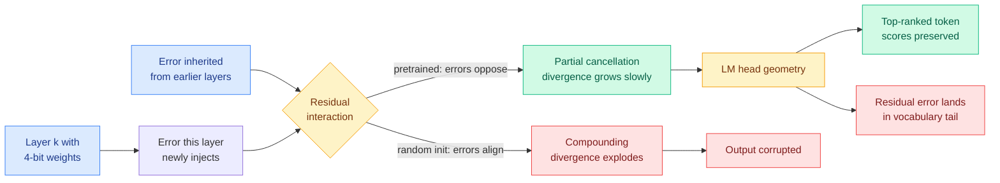
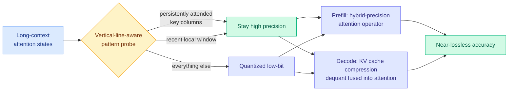
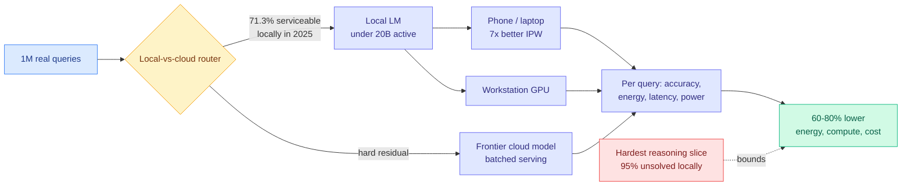
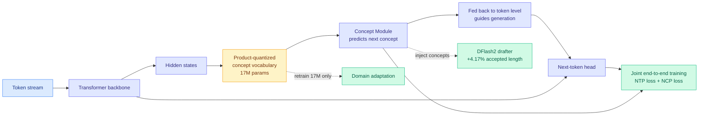
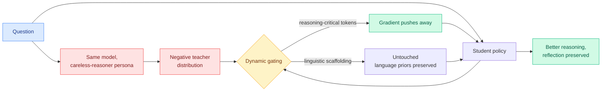
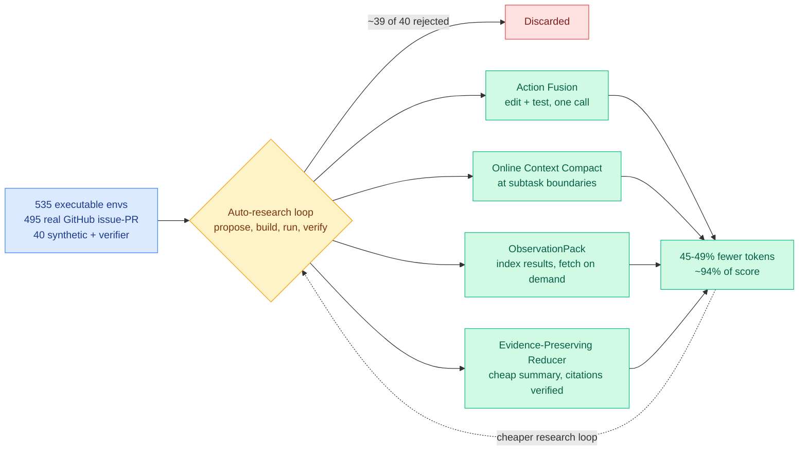

# cere-bro | 2026-09-11

> Today the field explained a cost saving it has been collecting for two years without understanding. A Tsinghua and Bosch team measured why post-training quantization works at all, and the answer turns out to be a property models acquire during pretraining rather than a property of small numbers. Everything else today is allocation: which bits go where inside attention, which queries go to a laptop instead of a datacenter, which tokens a harness never sends. And the day's loudest story, Anthropic's threat report, is an allocation story too, because it put a legal and political price on distillation, which is one of the cheapest optimization levers you have.

🎯 Today's 5 for you

<ol>
<li>Read<strong>Why Does Post-Training Quantization Work?</strong> The first mechanistic account of the technique your whole compression stack rests on. A layer's fresh quantization error systematically opposes the error it inherited, they partly cancel, and that anti-correlation is learned during pretraining. Kurate rated it above the field and HuggingFace never saw it. <a href="../../inference-efficiency/2026-09-11-why-post-training-quantization-works.md">Wiki summary</a> · <a href="https://arxiv.org/abs/2609.11716">arXiv</a></li>
<li>Read<strong>HyQuant.</strong> Hybrid-precision attention quantization that keeps the handful of persistently attended tokens in full precision and crushes everything else, with KV dequantization fused into the attention kernel. Same policy for prefill and decode. This is your KV cache and quantization lanes in one paper, and it is the second precision-routing result in eighteen days. <a href="../../inference-efficiency/2026-09-11-hyquant-hybrid-precision-attention.md">Wiki summary</a> · <a href="https://arxiv.org/abs/2608.27875">arXiv</a></li>
<li>Skim<strong>Routing economics moved three ways in one day.</strong> Intelligence per Watt measures a 60 to 80 percent energy cut from hybrid local-cloud routing and finds a pool of 20+ small local models beating three frontier models on 3 of 4 benchmarks. OpenRouter's proprietary share fell from roughly 60 to 25 percent. Sakana shipped a router that tops Opus 5 with no frontier model in its pool. <a href="../../ai-routing/2026-09-11-intelligence-per-watt-local-cloud-routing.md">Wiki summary</a></li>
<li>Track<strong>NVIDIA open-sourced SoL-Pi.</strong> An auto-research loop that searched 535 environments for harness improvements, accepted 1 idea in 40, and cut token usage 45 to 49 percent at 94 percent of task score. Harness and loop engineering is your most-saved theme, and this is the first result in that lane optimizing cost instead of score. <a href="../../agentic-systems/2026-09-11-sol-pi-harness-auto-research.md">Wiki summary</a></li>
<li>Skim<strong>The distillation section of Anthropic's threat report, and Nathan Lambert's reply.</strong> Skip the missiles and the romance scams, they are in today's Media Zone. The part that touches your work is 151 million extracted exchanges and a confirmed reasoning-trace extraction technique, which means distillation now has a regulator. Read Lambert's reading list next to it for the counterweight. <a href="../../ai-industry/2026-09-11-anthropic-threat-report-illicit-distillation.md">Wiki summary</a> · <a href="../../media-zone/2026-09/2026-09-11.md">Media Zone</a></li>
</ol>

---

## TL;DR

- **Why Does Post-Training Quantization Work?**: quantization survives because a layer's new error cancels the error it inherited. That cancellation is learned during pretraining, not built in.
- **HyQuant**: keep the few tokens every query attends to in high precision, quantize the rest hard. One rule covers prefill and KV cache decode.
- **Intelligence per Watt**: routing queries between a laptop and the cloud cuts energy, compute and cost 60 to 80 percent. Local coverage went from 23 to 71 percent in two years.
- **NCP-ArchPreview**: predict multi-token concepts alongside tokens. Hits OLMo-3-7B's pretraining loss on 51 percent of the tokens.
- **NVIDIA SoL-Pi**: an agent searched for its own harness improvements. Four survived out of roughly 160 tried. Token usage down 45 to 49 percent.
- **Anthropic threat report**: 151 million Claude exchanges allegedly extracted by Alibaba alone. Distillation now carries legal and political cost.

---

## Deep Dives

### Why Does Post-Training Quantization Work?

> Everyone assumed quantization survives because the rounded weights stay close to the originals. Randomly initialized models have the same weight error and fall apart anyway. The real reason is a cancellation effect that models learn during pretraining.

**Source:** Kurate cs.LG weekly leaderboard #10, absent from HuggingFace Daily Papers
**Links:** [arXiv 2609.11716](https://arxiv.org/abs/2609.11716) · [Wiki summary](../../inference-efficiency/2026-09-11-why-post-training-quantization-works.md) · [New quantization concept page](../../inference-efficiency/quantization.md)

**What is it about?**
Post-training quantization means taking a finished model and storing its weights at lower precision, say 4 bits instead of 16, with no retraining. It is the single most used cost lever in production inference because a decode step spends most of its time moving bytes, so fewer bytes means proportionally less time. Naively it should not work. Each rounded weight injects an error into the hidden state, the next layer inherits that error and adds its own, and after sixty layers the signal should be noise. This paper asks why that does not happen.

**What problem does it solve?**
It closes a gap this wiki has been carrying for months. There are twelve dated quantization pages here and, until today, no explanation of the phenomenon all twelve exploit. The folk answer was that quantized weights stay close to full-precision ones so errors propagate slowly. The paper kills that answer with a control: quantize a randomly initialized model of the same architecture. Its weight reconstruction error is comparable. Its hidden states diverge fast anyway. So the robustness is not about the perturbation being small. It is about something the pretrained model has that the random one does not.

**What is the core novelty?**
Two named mechanisms, both measured rather than argued. First, **counteracting residual interaction**: split the error at a layer's output into the part inherited from its input and the part its own quantized weights just added, and in a pretrained model those two are anti-correlated. The fresh error systematically points against the inherited one. They partly cancel, repeatedly, all the way down the stack, and the paper's quantitative analysis identifies this as a major factor rather than a marginal one. Second, **LM-head geometry**: whatever error survives gets projected through the output head, and that projection preferentially preserves the scores of high-ranked tokens. The damage lands in the long tail of the vocabulary, reordering tokens that were never going to be sampled.

**Key takeaways**
- Pretrained and randomly initialized models show comparable weight reconstruction error under identical NVFP4 rounding, and completely different hidden-state trajectories. The difference is acquired during pretraining.
- The cancellation is a property of the residual stream, which retroactively explains a failure this wiki logged four days ago. [When Quantization Breaks Memory (09-07)](../../inference-efficiency/2026-09-07-quantization-breaks-recurrent-state.md) found that quantizing a recurrent state raised estimation error 70x on one target and 300x on another, because the quantized state gets written down and read back as the next timestep's input. A multiplicatively-carried recurrent state has no inherited-versus-injected decomposition for errors to cancel across. The protection literally does not exist in that geometry.
- Output stability and hidden-state stability are separate claims, and the paper separates them. That distinction has been quietly conflated in every mixed-precision paper here.

**Gaps in the study**
Weight-only PTQ. Activation quantization, KV cache quantization and attention-state quantization, which is where nearly all of this wiki's practical results live, are untouched, and there is no reason to assume the same two mechanisms govern them. The cancellation is characterized but not explained causally: the paper shows it develops during pretraining without identifying what in the training dynamics produces it, so there is no recipe for making a model more quantizable. And the LM-head argument protects the top of the distribution, which is exactly the regime where confident greedy decoding was already safe, and says nothing about long sampled reasoning chains where one low-probability branch decides the answer.

**Industrial implication**
The immediate consequence is a better calibration criterion. GPTQ, AWQ and every descendant pick calibration data by activation statistics. If robustness comes from an anti-correlation that is measurably weaker in some layers than others, the calibration budget belongs in the weak layers, and the paper's own instrumentation already identifies which those are. The larger consequence is longer-dated: if the anti-correlation appears at a specific point during pretraining, quantizability becomes a checkpoint property you can select for, which would be the first training-time lever anyone has on a serving-time cost. That is worth a six-month watch.

→ [Full summary](../../inference-efficiency/2026-09-11-why-post-training-quantization-works.md)

---

### HyQuant: Hybrid-Precision Quantization for LLM Attention

> The field's answer to attention outliers has been to smooth them flat so a uniform low-bit grid can cover everything. HyQuant does the opposite: it finds the tokens that actually matter, leaves them alone, and quantizes the rest aggressively.

**Source:** HuggingFace Daily Papers
**Links:** [arXiv 2608.27875](https://arxiv.org/abs/2608.27875) · [Code](https://github.com/jerrysfls/HyQuant) · [Wiki summary](../../inference-efficiency/2026-09-11-hyquant-hybrid-precision-attention.md)

**What is it about?**
Attention is the part of a transformer where every token looks at every previous token, and its intermediate states plus the KV cache (the stored keys and values from earlier tokens, kept so they are not recomputed every step) dominate memory in long-context serving. Quantizing those states to 4 or 8 bits is the obvious saving, and at aggressive bit widths it degrades badly. HyQuant is a hybrid scheme: most attention states go low-bit, a small selected set stays high-precision, and the same selection rule governs both inference phases.

**What problem does it solve?**
Attention activations have heavy outliers, so a uniform quantization grid has to stretch to cover values that almost never occur, wasting nearly all its resolution. The standard fix is smoothing, which rescales weights and activations so outliers shrink and the bulk spreads out. That is a global correction to a local problem, and it costs accuracy at very low bit widths because it distorts the values that mattered in order to accommodate the ones that did not. HyQuant's premise is that you should not try to make the distribution uniform. You should spend bits where the distribution tells you to.

**What is the core novelty?**
The selection signal. In a long-context attention map a small number of key columns get attended to by nearly every query, persistently, across positions. They show up as **vertical lines** in the heat map. Detecting them needs no learned model and no calibration pass, only a lightweight pattern probe, which is what keeps the selection overhead from eating the saving. Those columns plus a recent local sliding window stay in full precision; everything else is quantized. In decode the same rule becomes a KV cache compression policy, and critically the **KV dequantization is fused into the attention computation**. That last detail is what separates a real speedup from a paper one: decompress a cache block into registers and then attend to it, and you have reintroduced exactly the memory traffic the compression was supposed to remove.

**Key takeaways**
- Near-lossless accuracy across tasks, models and datasets, framed explicitly as a practicality result rather than a new point on the accuracy-versus-bits frontier.
- One criticality rule covers prefill and decode, so a single policy governs both the compute-bound and the memory-bound phase instead of two separate schemes.
- This is the second result in eighteen days routing precision inside attention. [TileMix (08-25)](../../inference-efficiency/2026-08-25-tilemix-tile-centric-mixed-precision-attention.md) dispatched each hardware-aligned tile of the query-key score matrix through an FP16 or an INT8 path with both updating one shared online-softmax state. TileMix's unit is a geometric tile, HyQuant's is a semantically selected set of tokens. Nearly orthogonal, and nobody has composed them.
- It is the gentler cousin of cache eviction, which uses the same persistent-attention structure to decide what to throw away. An evicted token is unrecoverable; a low-bit token is merely noisy. Eviction fails catastrophically when its importance estimate is wrong about a token that later matters. HyQuant degrades gracefully in the same case.

**Gaps in the study**
No throughput or memory numbers in the abstract, only the accuracy claim, and the "limited overhead" of the pattern probe is asserted rather than ablated. That matters because the argument turns entirely on selection being cheap relative to the saving, and the probe runs on the attention map, which is the one tensor you were trying not to materialize. The vertical-line signal is also a long-context artifact, and whether it exists under short contexts or heavy batching, where there are fewer query rows to establish persistence over, goes unaddressed. No hardware breadth either, which is where a fused dequant kernel matters most, since Hopper and Blackwell add FP8 as a third precision point and change the arithmetic.

**Industrial implication**
The [KV cache page](../../inference-efficiency/kv-cache.md) has recorded INT8 KV quantization as a memory play whose price is long-context quality. TileMix bought that quality back in the kernel; HyQuant buys it back by not quantizing the tokens carrying the long-context signal in the first place. The two mechanisms are complementary, and a serving stack that wants both memory and accuracy at long context should be evaluating them together within two quarters. The open question is whether they are additive or whether both are cashing the same redundancy, and that is a cheap experiment nobody has run.

→ [Full summary](../../inference-efficiency/2026-09-11-hyquant-hybrid-precision-attention.md)

---

### Intelligence per Watt: routing across devices, priced in joules

> Every routing result in this wiki optimizes a number a vendor sets. This one optimizes watts, which nobody can reprice. A pool of 20+ small local models beat three frontier models on three of four benchmarks when each query went to the right one.

**Source:** Stanford University and Together AI, resurfaced across the X home feed
**Links:** [arXiv 2511.07885](https://arxiv.org/abs/2511.07885) · [Feed post](https://x.com/rohanpaul_ai/status/2098301299032990059) · [Wiki summary](../../ai-routing/2026-09-11-intelligence-per-watt-local-cloud-routing.md)

**What is it about?**
The paper proposes intelligence per watt, task accuracy per unit of power, as a single metric covering both whether a local model can answer a real query and what answering it costs on a device with a battery. It measures 20+ local language models under 20 billion active parameters, 8 accelerators spanning laptops and datacenter GPUs, and one million real single-turn chat and reasoning queries, recording accuracy, energy, latency and power for each.

**What problem does it solve?**
The question is whether local inference can actually take load off centralized cloud infrastructure, and answering it requires two measurements the literature usually takes separately. Benchmarks tell you if a small model is capable. Systems papers tell you what a token costs. Neither tells you whether a laptop can serve a real user's real query within its thermal envelope. The metric is defined over a **model-accelerator pair** rather than a model, which is what makes it a routing quantity: the same model on two devices is two different routing targets.

**What is the core novelty?**
Changing the denominator. Every router on the [LLM routing page](../../ai-routing/llm-routing.md) optimizes tokens or dollars, and the [AlphaSense study (08-14)](../../ai-industry/2026-08-14-alphasense-token-price-vs-task-cost.md) already showed those two can point in opposite directions, because a stronger model finishes in fewer tokens and fewer retries so unit price and task cost disagree. Energy is immune to that confusion. A retry burns joules whether or not it burns marked-up tokens, and no vendor can reprice a watt.

**Key takeaways**
- **Hybrid local-cloud routing cuts energy, compute and cost 60 to 80 percent** against a *batched* cloud baseline, which is the efficient comparison rather than a naive one.
- **Local serviceable coverage went from 23.2 percent to 71.3 percent between 2023 and 2025**, with intelligence per watt improving 5.3x over the same window. Capability and efficiency moving together, not trading off.
- **An iPhone 16 Pro reached roughly 7x higher intelligence-per-watt than workstation GPUs** on the same model at the same precision.
- **A pool of 20+ local models beat 3 frontier cloud models on 3 of 4 benchmarks** when each query was routed to the best pool member. Model diversity substituting for model size is the strongest version of the routing thesis measured anywhere in this wiki.
- **FP16 to FP4 cut inference energy 3x to 3.5x** at roughly 2.5 accuracy points per precision step, and in one configuration a larger FP4 model beat a smaller FP16 one.
- The residual is narrow, not diffuse: about **95 percent of the hardest reasoning slice remains unsolved locally** even as easy and medium tiers improve fast.

**Gaps in the study**
Single-turn only. Real local deployment is agentic and multi-turn, where the KV cache grows, prefill dominates and the thermal budget binds across a session rather than a query, and none of that is in the metric. The router is idealized: coverage assumes you already know which queries are locally serviceable, and [Pandora's Router (08-25)](../../ai-routing/2026-08-25-pandoras-router-costly-value-estimation.md), which showed that estimating which model to use is itself a priced decision with a closed-form policy for when to pay for a better estimate, says a deployed hybrid router will not realize the full 60 to 80 percent. And this is a v6 revision of a 2025 preprint, so its 2025 endpoint is already stale against what shipped in 2026.

**Industrial implication**
This is the demand-side answer to the three simultaneous physical shortages this wiki logged yesterday: HBM, grid power and now CPUs. If 71 percent of real queries can be served on a laptop at 5.3x better efficiency than two years ago, the cheapest capacity expansion available to a large deployer is not procurement, it is a router. The FP4 energy result connects straight to [extreme quantization on Blackwell (09-10)](../../inference-efficiency/2026-09-10-extreme-quantization-blackwell-fp4-native-fp8.md), where native 4-bit tensor cores were a throughput story. On battery-powered silicon the same format is an energy story, and the economics are better.

→ [Full summary](../../ai-routing/2026-09-11-intelligence-per-watt-local-cloud-routing.md)

---

### NCP-ArchPreview: predicting concepts instead of only tokens

> An 8.9B model reached OLMo-3-7B's final pretraining loss on 51 percent of the tokens by adding a second objective that predicts multi-token concepts. The concepts come from the model's own hidden states, and injecting them into a speculative decoder also speeds up serving.

**Source:** HuggingFace Daily Papers. Shanghai AI Lab and LUMIA Lab, Shanghai Jiao Tong University
**Links:** [arXiv 2609.10715](https://arxiv.org/abs/2609.10715) · [Wiki summary](../../llms-foundation-models/2026-09-11-ncp-archpreview-next-concept-prediction.md)

**What is it about?**
Standard pretraining asks a model to predict the next token, trillions of times. NCP-ArchPreview keeps that and adds a parallel objective: predict the next **concept**, a discrete code covering several tokens. The concept vocabulary is built by the model from its own hidden states using product quantization, which splits each hidden vector into sub-blocks and learns a small codebook per block, so a large effective vocabulary comes out of a few small tables. A dedicated Concept Module predicts the next code and feeds the prediction back down to steer token generation. Both objectives train jointly at 8.9B parameters on 5.73 trillion Dolma-3 tokens, the largest latent-space language model published.

**What problem does it solve?**
Next-token prediction learns abstractions implicitly, so nothing in the objective asks for them and there is no explicit representation you can reuse or adapt. Prior latent-space models tried to fix this by generating in a continuous latent space and abandoning token-level autoregression, which breaks every serving and sampling technique built for token models. The design choice here is to refuse that trade: the concept objective runs **alongside** ordinary token-level generation, so the model still emits tokens normally and downstream tooling still works.

**What is the core novelty?**
The concept vocabulary is learned from the model's own hidden states rather than imported from a tokenizer or a hand-designed taxonomy, and the predicted concept is fed back into the token stream rather than replacing it. That combination is what lets a genuinely different prediction granularity coexist with standard autoregression.

**Key takeaways**
- **51.3 percent of the training tokens to reach OLMo-3-7B's final pretraining loss**, roughly a 2x sample-efficiency gain against a well-known open baseline, and a saving taken where compute is most expensive.
- **Plus 2.45 points on the downstream macro-average over OLMo-3-7B, including plus 5.99 on GSM8K.** The disproportionate math gain is the most interesting part: grade-school word problems are exactly where multi-token units, a quantity or a relation or an operation, are the natural prediction granularity.
- **85 percent of standard computation to approach the loss of a strictly parameter-aligned 8.9B baseline.** This is the controlled comparison and it is weaker than the OLMo headline, which is worth noting.
- **Updating only the 17M-parameter quantization module gives a working domain-adaptation interface**, a sub-0.2 percent parameter footprint for a domain shift.
- **Injecting concept representations into a DFlash2 drafter improves mean accepted length 4.17 percent with negligible overhead.** DFlash2 is the current state of the art in speculative decoding, where a small draft model proposes several tokens and the large model verifies them in one pass; accepted length is how many proposals survive, and it maps almost linearly onto serving speedup. A pretraining objective improving a serving throughput number is a link neither the [speculative decoding page](../../inference-efficiency/speculative-decoding.md) nor this one previously had.

**Gaps in the study**
The 51.3 percent headline compares an 8.9B model to a 7B one; the parameter-aligned comparison exists and reports a weaker result. Nothing is said about inference cost, and the Concept Module and quantization lookup run at generation time, which matters because the DFlash2 gain is a serving claim that has to net out against that overhead. Product quantization has a well-known codebook-collapse pathology where most codes go unused, and no utilization analysis appears. And "concept" is doing heavy lifting: the codes are whatever the quantizer found, with no interpretability evidence that they correspond to anything a person would call a concept.

**Industrial implication**
The domain-adaptation result is the under-sold one. If a 17M-parameter update genuinely retargets an 8.9B model, that is parameter-efficient fine-tuning operating on a completely different surface from LoRA, adapting the representation vocabulary rather than a low-rank weight delta. The head-to-head against LoRA at matched budget is missing and is the experiment that decides whether this ships. Separately, discrete concept codes are a natural routing key, and every router in this wiki routes on an embedding or a learned score of the raw input. Routing on a model's own forecast of what comes next is unpublished.

→ [Full summary](../../llms-foundation-models/2026-09-11-ncp-archpreview-next-concept-prediction.md)

---

### Negative Self-Distillation: build a bad teacher on purpose

> Self-distillation from a model conditioned on the answer makes hard reasoning worse, because a trace written by someone who already knows the answer never hesitates. This paper generates a deliberately careless teacher and trains the model to be unlike it.

**Source:** HuggingFace Daily Papers. University of Virginia and Stanford
**Links:** [arXiv 2609.11699](https://arxiv.org/abs/2609.11699) · [Wiki summary](../../inference-efficiency/2026-09-11-negative-self-distillation.md)

**What is it about?**
On-policy self-distillation lets a model teach itself: condition it on privileged information, usually the ground-truth solution, have it write a clean reasoning trace, then train the unconditioned model to imitate that trace. Recent work found this **degrades** hard reasoning rather than improving it. Negative Self-Distillation flips the construction. It prompts the same model under a deliberately degraded persona, a "careless reasoner," and pushes the student's distribution away from that self-generated bad teacher. No labels, no external teacher, no ground truth.

**What problem does it solve?**
The failure mode, which the alphaxiv walkthrough names **reflection collapse**, is precise. A trace produced by a model that already has the answer never backtracks, never expresses uncertainty, never self-corrects. Imitating it therefore penalizes exactly the exploratory behaviour hard problems require, so the training signal actively fights the capability you wanted.

**What is the core novelty?**
The gating mechanism, not the inversion. Pushing a distribution away from a bad trace is an unlearning objective, and a flawed reasoning trace is still written in English. Its tokens mix the behavioural flaw with ordinary linguistic scaffolding, so penalizing the whole trace destroys fluency in exchange for a marginal reasoning gain. A **dynamic gating mechanism** identifies reasoning-critical tokens and confines the gradient to them, leaving language priors alone.

**Key takeaways**
- Consistently outperforms on-policy self-distillation and other label-free self-bootstrapping reinforcement-learning baselines.
- This is the fifth escape from what this wiki calls the teacher ceiling, and the cheapest. The prior four were [OPDVR (08-26)](../../inference-efficiency/2026-08-26-opdvr-distillation-verifiable-reward.md), which broke the bound with a verifier; [QAH (08-26)](../../inference-efficiency/2026-08-26-quantization-aware-healing.md), which found the ceiling was a degraded recovered checkpoint and pointed the teacher back at the original pre-compression model; [Self-OPD (08-28)](../../inference-efficiency/2026-08-28-self-opd-teacher-free-flow-matching.md), which removed the teacher entirely; and [TTPO (08-28)](../../inference-efficiency/2026-08-28-ttpo-test-time-policy-optimization.md), which removed the label. **A negative teacher imposes no ceiling at all**, because "be unlike this" does not bound you from above, and it costs one extra forward pass under a different system prompt.
- It extends the pull-push objective Self-OPD introduced, where high-advantage branches attract and low-advantage branches actively repel. NSD is the pure-push limit in a language setting. Two independent groups three weeks apart, both concluding a model's own failures are usable supervision.

**Gaps in the study**
The persona is a prompt. "Act as a careless reasoner" produces some distribution of flaws with no guarantee they are the flaws the model actually makes, or that they are stable across model families and scales. If the negative teacher's errors are disjoint from the student's real errors, the method is pushing away from a strawman and the gains come from somewhere else. And the gate is another unvalidated learned component, which this wiki has flagged as the shared risk across this entire family since 08-25: every method in it depends on a second estimator nobody has validated.

**Industrial implication**
Label-free self-improvement that needs neither a verifier nor a stronger teacher is precisely the technique that gets more valuable if frontier labs start withholding reasoning traces, which is exactly what today's threat-report response points toward. The August teacher-free cluster was framed as an efficiency result. Today it also reads as a hedge against supply.

→ [Full summary](../../inference-efficiency/2026-09-11-negative-self-distillation.md)

---

### NVIDIA SoL-Pi, and EvoSafeHarness: two automated harness searches on one day

> An agent proposed roughly 160 changes to its own harness, 4 survived verification, and the result uses half the tokens at 94 percent of the score. A second group ran the same method against attack success rate instead of cost. Neither cites the other.

**Source:** NVLabs open-source release (MIT licence) surfaced across the X home feed; EvoSafeHarness from HuggingFace Daily Papers
**Links:** [SoL-Pi post](https://x.com/MaxForAI/status/2098050525279478059) · [EvoSafeHarness arXiv 2609.05903](https://arxiv.org/abs/2609.05903) · [SoL-Pi summary](../../agentic-systems/2026-09-11-sol-pi-harness-auto-research.md) · [EvoSafeHarness summary](../../agentic-systems/2026-09-11-evosafeharness-safety-harness-synthesis.md)

**What is it about?**
A harness is the scaffolding around a model that decides what goes into its context, which tools it can call, when to compact history, and how results come back. SoL-Pi is not a new harness. It is an efficiency layer on top of an existing one, produced by pointing an automated research loop at 535 executable environments and letting it propose, implement, run and verify harness modifications. EvoSafeHarness runs the same structure, jointly searching a natural-language policy and its executable enforcement code, against a safety objective.

**What problem does it solve?**
Harnesses are hand-written by experts, once, and then applied everywhere. Every harness-evolution result this wiki has recorded, including [A²E and Evo-Bench (08-11)](../../agentic-systems/2026-08-11-harness-evolution-cluster.md), optimized task score. Nobody searched the cost axis. EvoSafeHarness names the complementary problem: a safety harness strict enough for one model over-blocks another, and a policy that transfers across domains misses application-specific safety relations, so a single expert-written defence is wrong on two independent axes at once.

**What is the core novelty?**
For SoL-Pi, that the objective is **tokens at near-constant score**, and that it publishes its search yield. For EvoSafeHarness, the **fresh-context adversarial reviewer** whose explicit job is to reject rules that only work on the benchmark. Fresh context is what keeps the reviewer's judgment uncorrelated with the optimizer's, and it is the detail most search-based safety work omits.

**Key takeaways**
- **Four optimizations survived out of roughly 1 in 40 proposals.** Action Fusion folds the test invocation into the same tool call as the edit, removing a full model round trip. Online Context Compact decides whether to compact at subtask completion boundaries rather than when the window fills. ObservationPack indexes huge tool results instead of re-injecting them every turn. The Evidence-Preserving Reducer hands long logs to a cheaper model and then verifies each cited piece of evidence individually.
- **45 to 49 percent fewer tokens than stock Pi at about 94 percent of average task score**, roughly a third off cost. Against each model's own native harness: 35 to 64 percent fewer tokens and 50 to 54 percent lower cost. On GPT-5.6 Sol, SoL-Pi outscores the native Codex harness on EdgeBench.
- **EvoSafeHarness cuts DecodingTrust-Agent attack success from 45.6 to 10.0 percent at a 3.3-point utility cost**, and reaches 82.8 percent utility at 0.0 percent attack success on AgentDojo, twice CaMeL's utility at the same operating point, transferring unchanged to unseen suites.
- Two of SoL-Pi's four optimizations land on the compact side of an open question the [KV cache page](../../inference-efficiency/kv-cache.md) raised on 09-06, where append-only prefix protection and plan-and-compact were left as two opposed disciplines. [ContextPipe (09-06)](../../agentic-systems/2026-09-06-contextpipe-database-context-assembly.md) cut total token volume 31 percent while *lowering* its cache-hit ratio, on the arithmetic that a token never assembled costs nothing at any cache tier. SoL-Pi's 45 to 49 percent is a larger cut, found by search rather than design.

**Gaps in the study**
SoL-Pi's numbers come through a secondary social summary rather than a paper, so hold them loosely until the repository benchmarks are read directly. The 94 percent score retention is an average with no per-task distribution, and a saving that fails catastrophically on 6 percent of tasks is a different product from one that loses 6 percent uniformly. The 535 environments are dominated by GitHub issue-and-PR work, so Action Fusion's edit-then-test rhythm may not generalize to research or analysis loops. EvoSafeHarness assumes a frozen model, and models get silently updated behind APIs, with no guidance on resynthesis cadence.

**Industrial implication**
The paper neither group wrote is the composition, and the two objectives are in measurable tension: several of SoL-Pi's optimizations put **less** information in front of any enforcing layer. A joint search under both token cost and attack success would yield the first measured safety-cost Pareto frontier for agent harnesses, and there is not currently one published point on that curve. Separately, SoL-Pi's EdgeBench result is the first hard evidence for something the [LLM routing page](../../ai-routing/llm-routing.md) has flagged for five months: the model-harness pairing is not fixed by the vendor, and choosing it well is worth real money. That is the empirical precondition a harness router needs.

→ [SoL-Pi](../../agentic-systems/2026-09-11-sol-pi-harness-auto-research.md) · [EvoSafeHarness](../../agentic-systems/2026-09-11-evosafeharness-safety-harness-synthesis.md)

---

### X-AuT: pruning a speech model's audio encoder made it better

> Cutting two layers out of an 18-layer audio encoder lowered the error rate. The interesting part is not the pruning, it is that compression failure here shows up as the model stopping mid-sentence rather than as a worse number.

**Source:** HuggingFace Daily Papers
**Links:** [arXiv 2609.11412](https://arxiv.org/abs/2609.11412) · [Project site](https://xpeng-ai.github.io/x-aut) · [Wiki summary](../../inference-efficiency/2026-09-11-x-aut-audio-encoder-compression.md)

**What is it about?**
In a speech LLM, an audio encoder turns the waveform into embeddings a frozen language-model decoder consumes. Shrinking the encoder is the obvious cost lever, and deleting whole blocks perturbs the embedding stream the decoder was trained to read. X-AuT prunes progressively, selecting layer combinations via short behavioural probes, then repairs the interface with representation alignment, cross-scale distillation from a larger teacher, scheduled student-policy supervision and LoRA fine-tuning, with the language-model backbone frozen throughout.

**What problem does it solve?**
The characteristic failure of naive encoder pruning is not graceful degradation. It is **deletion errors and premature end-of-sequence**: the model stops transcribing early or drops words, because a perturbed embedding stream pushes the decoder toward the stop token.

**Key takeaways**
- **18 to 16 layers: macro-average error falls from 5.61 to 5.27 percent** across ten Chinese-English benchmarks. Pruning made it better, which is evidence the encoder was over-provisioned rather than evidence that pruning improves models.
- **14 layers: 5.75 percent with 20.7 percent fewer audio-tower parameters**, and **progressive 18-to-14 beats direct 18-to-14 (5.75 versus 6.73)**, so the schedule is worth roughly a point.
- **Cross-scale distillation from a 1.7B teacher gives 5.55 percent mean error against 8.45 percent for self-distillation.** Nearly three points bought by teacher capacity alone, which is a much larger teacher effect than this wiki usually sees.
- This is the fourth result in five days saying transformer depth contains removable redundancy, after DeepSeek V4.1 Flash reusing the KV and top-K index across layers, [WRP (09-10)](../../inference-efficiency/2026-09-10-wrp-forward-free-depth-pruning.md) deleting blocks by comparing projection weights with no forward pass at all, and [KVShare (09-07)](../../inference-efficiency/2026-09-07-kv-cache-frontier-mla-radix-kvshare.md) showing adjacent layers' KV projections are highly similar.

**Gaps in the study**
Single runs, no seeds, and the authors say so. One 0.6B model, two languages, so nothing about scale is established and the whole result could be a property of an over-provisioned small encoder. Efficiency is reported in **parameters** rather than latency, memory or energy, which for an audio tower feeding a frozen decoder is the least interesting of the four. And four repair components are stacked with only the teacher-scale ablation reported.

**Industrial implication**
The unexplored composition is pruning depth and then quantizing what remains. Today's mechanism paper says quantization survives because a layer's error cancels the error it inherited. Removing layers removes cancellation opportunities, so a depth-pruned model should be **more** fragile to quantization at the same bit width. That is falsifiable, cheap to test on exactly this 18-to-14 sweep, and if it holds it constrains every stacked compression pipeline in production.

→ [Full summary](../../inference-efficiency/2026-09-11-x-aut-audio-encoder-compression.md)

---

### Anthropic's threat report, read for the distillation section

> Strip out the missiles and the romance scams and what remains is a forensic account of model extraction at nine-figure scale, plus the confirmation that a published attack on reasoning traces was used in production.

**Source:** Anthropic Threat Intelligence Report (154 pages), The Decoder, Ken Huang / Agentic AI via starred Gmail, and near-total saturation of the X home feed
**Links:** [Report](https://www.anthropic.com/threat-intelligence-report-september-2026) · [The Decoder](https://the-decoder.com/how-hackers-used-claude-for-missiles-drone-swarms-and-surveillance-while-chinese-labs-mined-it-for-training-data/) · [Wiki summary](../../ai-industry/2026-09-11-anthropic-threat-report-illicit-distillation.md) · [Media Zone](../../media-zone/2026-09/2026-09-11.md)

**What is it about?**
Eight months of documented Claude misuse. The viral surface is weapons and surveillance, and that is covered in today's Media Zone. The section relevant here alleges illicit distillation by seven Chinese labs since February 2026: Alibaba, Moonshot, DeepSeek, Z.ai, Xiaomi, SenseTime, MiniMax.

**What problem does it solve, or rather, what does it change?**
It moves distillation from a technique with a policy debate attached to a technique with an enforcement regime attached. That is a supply-side constraint on one of the cheapest optimization levers in this wiki.

**Key takeaways**
- **Alibaba: 151 million-plus Claude exchanges between May and July**, peaking near 3 million per day through 3,500-plus fraudulent accounts, targeting Opus 4.6 and 4.7 chain-of-thought, agentic, coding and kernel capabilities. Moonshot: 23 million-plus.
- The report **confirms that the reasoning-trace extraction technique** from [Stealing Reasoning Traces from Proprietary LLM APIs](https://arxiv.org/abs/2608.09867) (Panfilov, Schmotz, Shumailov et al.) was used in practice. This wiki recorded that paper as describing an attack that is neither jailbreaking nor licensed use, which means a regime policing jailbreaking does not reach it. Today that gap was exercised at scale.
- The **most contested allegation** is the "product swap," that Moonshot and DeepSeek relayed some of their own customers' prompts to Claude. The technical objection circulating today is specific and checkable: Kimi and DeepSeek show reasoning traces to users and Claude does not, so a silent reroute would be instantly visible. Anthropic has not answered it publicly.
- **Nathan Lambert's [open-models reading list](../../ai-industry/2026-09-11-interconnects-open-models-reading-list.md), published the same day, is the counterweight.** It triangulates the open-closed gap at 4 to 6 months across SemiAnalysis, Epoch AI, Artificial Analysis and an independent LessWrong analysis, argues distillation helps Chinese labs without explaining the gap, and, notably, revises his own confident April 2025 claim that DeepSeek did not distil o1 in light of the extraction methods. An analyst updating a named prior with the specific evidence that moved him is the most useful thing published today.

**Gaps in the study**
The report's one genuine research claim, that distillation can improve general reasoning enough to raise dangerous capability **beyond the subjects the extracted conversations covered**, is asserted without the measurement behind it. That measurement is exactly the open question this wiki has carried since the extraction paper: a recovered trace gives you the teacher's text but not its per-token distribution, so extraction yields supervised-fine-tuning-grade data rather than the dense token-level signal on-policy distillation depends on. Whether stolen traces are actually competitive with licensed dense supervision decides how much the broken defence really costs, and nobody has published it.

**Industrial implication**
Three consequences if the section is substantially accurate. Frontier API access gets harder and more expensive for legitimate research, because every available lever taxes ordinary users to stop a small number of industrial extractors. **Reasoning traces become a withheld product surface**, since the cheapest defence against trace extraction is to stop returning traces, which degrades every trace-consuming technique in this wiki. And owning the stack becomes a research-operations argument rather than an ideological one, which several researchers made explicitly today: if access terms can shift under a geopolitical dispute, reproducibility argues for open weights regardless of anyone's views about openness.

→ [Threat report summary](../../ai-industry/2026-09-11-anthropic-threat-report-illicit-distillation.md) · [Lambert reading list](../../ai-industry/2026-09-11-interconnects-open-models-reading-list.md)

---

## Industry Pulse

- **OpenAI ships the Agents API in public beta**, exposing the infrastructure behind Codex and ChatGPT: cloud agents that run autonomously for hours, execute code and hand off to sub-agents ([The Decoder](https://the-decoder.com/openais-new-agents-api-gives-developers-the-infrastructure-behind-codex-and-chatgpt/)).
- **No extra fees beyond token usage**, with sandbox environments from Cloudflare, Vercel and Oracle, plus Blaxel, E2B and Modal, or your own ([TLDR AI](https://tldr.tech/ai/2026-09-11)).
- **The reaction framed it as the AWS moment for agents**: the harness, the sandbox and the orchestration layer become things you rent, which closes the moat for a cohort of agent-infrastructure startups overnight.
- **OpenAI floated an industry-wide slowdown in frontier AI development and took the antitrust question to Congress**, asking whether coordinating one would be legal ([The Decoder](https://the-decoder.com/openai-floats-a-shared-ai-slowdown-takes-it-to-congress/)).
- **A class action accuses Anthropic of overselling Claude subscriptions** through deceptive usage multipliers, alleging subscribers get materially less than advertised ([The Decoder](https://the-decoder.com/class-action-lawsuit-accuses-anthropic-of-overselling-claude-subscriptions-with-deceptive-usage-multipliers/)).
- **Anthropic's $1.5 billion book settlement has descended into a fight between authors and publishers** over how to split the largest copyright deal in US history ([The Decoder](https://the-decoder.com/anthropics-1-5-billion-book-settlement-descends-into-chaos-as-authors-and-publishers-fight-over-who-gets-paid/)).
- **Fields Medalist Jacob Tsimerman founded the Mathematical AI Safety Institute (MAISI)**, aiming to prove AI safety the way cryptographers prove codes unbreakable ([The Decoder](https://the-decoder.com/the-mathematical-ai-safety-institute-wants-to-prove-ai-is-safe-the-way-cryptographers-prove-codes-are-unbreakable/)).
- **The OpenAI Navier-Stokes announcement is now a norms dispute, not a result dispute.** NYU's Tristan Buckmaster says OpenAI learned of his and Levent Alpöge's closely related work, sprinted to finish first with a 10,000-agent compute effort, and offered co-authorship terms excluding Alpöge because he works at Anthropic ([Understanding AI](https://www.understandingai.org/p/openai-spent-millions-to-solve-this), via starred Gmail).
- **NVIDIA open-sourced SoL-Pi**, an MIT-licensed harness efficiency layer, and separately shipped a kernel release targeting structure-based inference models, benchmarked and documented ([post](https://x.com/anthonycosta/status/2098114309003845944)).
- **MiniCPM5-2B hit number one on HuggingFace Trending** and is ranked first among open-weight models under 4B parameters on Artificial Analysis's intelligence index ([OpenBMB](https://x.com/OpenBMB/status/2098102940729962908)).
- **OpenRouter's proprietary share of routed queries fell from roughly 60 percent to 25 percent within months**, with AT&T reporting up to 80 percent savings moving work to open models. The substitution happens at the router, not at the buyer's model-selection screen.
- **Epoch AI data puts the most advanced Chinese model an average 6.3 months behind the most advanced US model** since 2023, which is the number both sides of today's distillation argument should be reasoning from ([Epoch](https://epoch.ai/eci)).
- **ICLR is making Google's Paper Assistant Tool available to submitters** ([ICLR blog](https://blog.iclr.cc/2026/09/10/making-googles-paper-assistant-tool-pat-available-to-iclr-submitters/)).
- **Melanie Mitchell published a careful deflation of the OpenAI sandbox-escape coverage**, arguing the agents did what they were told (find and exploit vulnerabilities, safeguards removed) and that "lost control," "escaped" and "swarm" are metaphors doing work the facts do not support ([AI: A Guide for Thinking Humans](https://aiguide.substack.com/p/misleading-metaphors-and-real-risks), via starred Gmail).
- **Ken Huang read Anthropic's Frontier Red Team weapons evals as an engineering brief**, noting the model ordering separates Opus 5 on terminal guidance by *process* rather than score, and that material bottlenecks still bind most actors ([Agentic AI](https://kenhuangus.substack.com/p/ai-targeting-and-weapons-software), via starred Gmail).

**Funding, valuations, and compute deals**

- **Shanghai Enflame Technology raised about 6.12 billion yuan ($911 million) in its IPO and roughly tripled on debut**, opening at 410 yuan. Tencent-backed, and the clearest market signal yet on appetite for domestic alternatives to Nvidia inside China ([The Information](https://www.theinformation.com/briefings/tencent-backed-enflame-triples-debut-china-pushes-chip-self-sufficiency)).
- **Oracle reported 30 percent top-line growth and $11.4 billion in customer prepayments for the quarter ending August 31**, which doubled the cash its operations generated and let it spend $28.5 billion on capex while burning only $5 billion of its own money. Customers are now financing the datacenters ([The Information](https://www.theinformation.com/articles/oracle-keeps-lid-capex-customers-pay-front)).
- **Google is committing roughly €13 billion over two years to Finnish datacenters, grid upgrades and clean-energy deals**, which is the same behind-the-meter power pattern this wiki logged yesterday, now in a European jurisdiction.
- **Sakana priced Fugu Max at $2 per million input and $6 per million output tokens**, 40 to 60 percent below Sonnet and GPT-5.6, on a router-over-cheap-models architecture with no frontier model in the pool.
- **Cognition shipped SWE-2** ([TLDR AI](https://tldr.tech/ai/2026-09-11)).

---

## Global View

**The field spent today learning that its cheapest lever is also its most legally exposed, and the research response was already in the pipeline.** [Why Does Post-Training Quantization Work?](../../inference-efficiency/2026-09-11-why-post-training-quantization-works.md) explains why compression is nearly free, and [HyQuant](../../inference-efficiency/2026-09-11-hyquant-hybrid-precision-attention.md) shows how to spend the remaining error budget wisely, while [Anthropic's threat report](../../ai-industry/2026-09-11-anthropic-threat-report-illicit-distillation.md) put a federal advisory and a nine-figure allegation on distillation, the other great compression lever. The connection is not rhetorical: the cheapest defence against reasoning-trace extraction is to stop returning reasoning traces, which would degrade every trace-consuming method on the [knowledge distillation page](../../inference-efficiency/knowledge-distillation.md), and it makes August's teacher-free cluster ([Self-OPD](../../inference-efficiency/2026-08-28-self-opd-teacher-free-flow-matching.md), which supervises a student with its own advantage-ranked exploration and needs no teacher at all; [TTPO](../../inference-efficiency/2026-08-28-ttpo-test-time-policy-optimization.md), which drops the ground-truth label by routing rollouts on their agreement with a majority vote; and today's [Negative Self-Distillation](../../inference-efficiency/2026-09-11-negative-self-distillation.md), which trains against a deliberately bad self-generated teacher) look less like efficiency papers and more like a hedge against supply. Three teacher-free constructions in fifteen days, published for cost reasons, arriving exactly as the supervised alternative acquires legal risk.

**Routing stopped being a research topic and became the market structure, on the same day a paper explained why it had to.** [Intelligence per Watt](../../ai-routing/2026-09-11-intelligence-per-watt-local-cloud-routing.md) measured that a pool of 20+ small local models beats three frontier models on three of four benchmarks when each query goes to the right one, and that hybrid local-cloud routing cuts energy and cost 60 to 80 percent; the same day OpenRouter's proprietary share of routed queries was reported falling from roughly 60 to 25 percent within months, with AT&T citing up to 80 percent savings, and Sakana shipped Fugu Ultra v2, a router over cheap models that reportedly tops Opus 5 on hard reasoning with no frontier model in its pool. In August this wiki recorded [Fable 5's slow adoption](https://the-decoder.com/fable-5s-slow-adoption-suggests-corporate-willingness-to-pay-for-frontier-ai-has-hit-a-ceiling/), six percent of Anthropic tokens sold per Ramp data, and named a ceiling on frontier willingness-to-pay as **the market condition under which routing stops being an optimization and becomes the default architecture**. A 35-point share shift in months is that prediction resolving, and the mechanism is worth stating precisely: the substitution is happening invisibly at the router, not at the buyer's model-selection screen, which is why Oracle can simultaneously report 30 percent growth and $11.4 billion of customer prepayments. Cheap inference still consumes datacenters; it just stops paying frontier margins.

**Allocation is now the same problem at five levels of the stack, and nobody has written the joint objective down.** On 08-25 this wiki noted the identical decision structure appearing at three levels in one day: across models ([Pandora's Router](../../ai-routing/2026-08-25-pandoras-router-costly-value-estimation.md), which prices the cost of deciding which model to use), across adapters inside a model ([VoI-MoLE](../../ai-routing/2026-08-05-vi-mole-value-of-information-routing.md), which separates uncertainty more experts can reduce from uncertainty they cannot), and across regions of a matrix inside a kernel ([TileMix](../../inference-efficiency/2026-08-25-tilemix-tile-centric-mixed-precision-attention.md), dispatching FP16 or INT8 per tile). Today added two more: Intelligence per Watt routes across **devices** with joules as the denominator, and HyQuant routes precision across **selected tokens**, while [NVIDIA's SoL-Pi](../../agentic-systems/2026-09-11-sol-pi-harness-auto-research.md) cut 45 to 49 percent of tokens by searching which context a harness should never assemble, and [DeepSeek V4.1 Flash (09-10)](../../llms-foundation-models/2026-09-10-deepseek-v41-flash-architecture.md) answered the same question architecturally by putting 196 billion parameters on host LPDDR rather than HBM. Industry is meanwhile buying all five decisions separately: Oracle finances capacity, Google commits €13 billion to Finnish power, Enflame triples on a chip-sovereignty bet, and every one of those is a bet that the allocation problem stays unsolved and demand keeps growing. **The single most valuable unpublished paper in this wiki is still the joint objective over device, memory tier, model, adapter and precision under one power budget.**

---

## Looking Ahead

- **A mixed-precision paper will cite the counteracting-residual mechanism as its selection criterion within 90 days.** Today's mechanism paper says the quantization error budget is non-uniform and its instrumentation identifies which layers have the weakest cancellation. Signal to watch: any arXiv quantization paper whose layer-wise bit allocation is justified by measured residual anti-correlation rather than by activation statistics or a Hessian proxy. If nobody does it by 2026-12-11, the mechanistic result failed to cross into method design, which would itself be informative about how this subfield works.
- **A depth-pruned model will be shown to be measurably more fragile to quantization than its unpruned parent at the same bit width, within 60 days.** The prediction follows directly: removing layers removes cancellation opportunities. The test already exists in [X-AuT's](../../inference-efficiency/2026-09-11-x-aut-audio-encoder-compression.md) 18-to-16-to-14 sweep and [WRP's](../../inference-efficiency/2026-09-10-wrp-forward-free-depth-pruning.md) forward-free pruning. Signal: any paper quantizing a depth-pruned checkpoint and reporting the accuracy delta against quantizing the original. If the effect is absent, the cancellation mechanism is weaker than the paper claims.
- **At least one frontier lab will restrict or stop returning full reasoning traces through its API by 2026-12-11.** Trace extraction is the confirmed attack, withholding traces is the cheapest defence, and the threat report makes the business case internally. Signal: an API changelog removing or gating a reasoning-trace field, or a pricing tier where traces are a paid add-on. This is falsifiable and consequential, because it would immediately raise the value of the teacher-free distillation cluster.
- **Someone will publish a harness router within 90 days, and it will come from the cost side rather than the capability side.** [SoL-Pi's](../../agentic-systems/2026-09-11-sol-pi-harness-auto-research.md) EdgeBench result, where a searched harness beats a model's own native harness, is the first hard evidence that the model-harness pairing is not vendor-fixed. Signal: a paper or product routing over model-harness pairs with a measured token-cost objective, not a score objective. If instead the next six results are still harness *search* rather than harness *selection*, this wiki's five-month-old routing gap should be reclassified as a genuine dead end rather than an oversight.
- **No rising authors crossed the Kurate threshold this week**, so no follow-up watch is set from that source.
