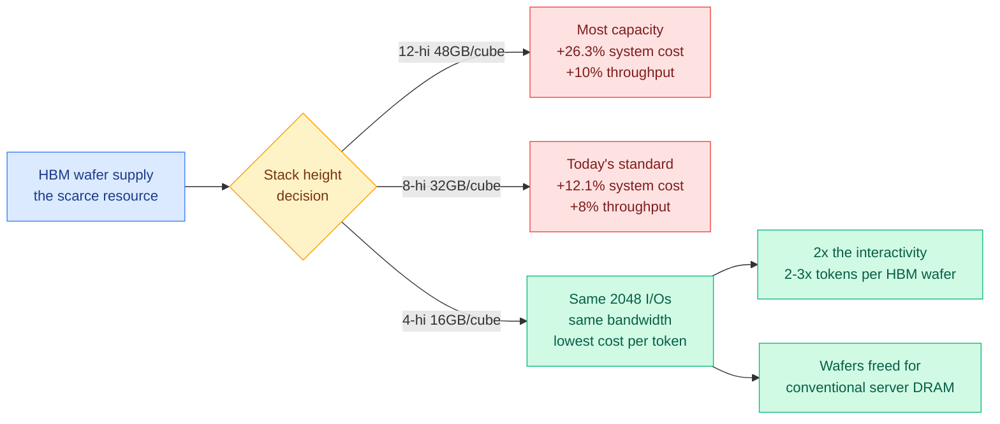
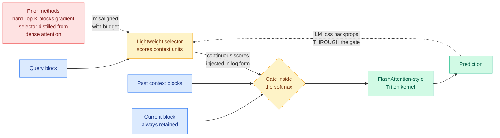
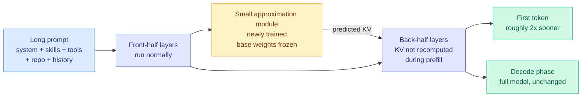
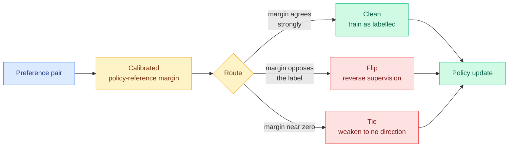

# cere-bro | 2026-09-14

> Today's throughline is cost optimization, and it lands at three different layers of the same stack on the same morning. At the silicon layer, SemiAnalysis argues the industry has been buying the wrong HBM: bandwidth per memory cube does not depend on how tall the stack is, but price does, so short stacks are the cheapest tokens and Nvidia's Rubin Ultra capacity cut is the beginning rather than the end. At the architecture layer, a paper argues that every trainable sparse-attention method has been training its selector against the wrong target, and fixes it by removing a workaround rather than adding a mechanism. And at the checkpoint layer, someone bolted a small external module onto an unmodified Qwen3-8B and halved its prefill. Three results, one shape: the saving was already sitting there, and what was missing was the willingness to stop doing something.

🎯 Today's 5 for you

<ol>
<li>Read<strong>Short HBM stacks win, and the numbers are not close.</strong> An HBM4 cube exposes 2,048 data I/Os no matter how many dies are in it, and one die can drive at most 512, so 4-hi is the shortest stack that harvests full bandwidth while price tracks gigabytes. SemiAnalysis models it out: 12-hi costs 26.3% more system-wide and buys 10% more throughput. This is your memory-hierarchy thread getting its first supply-side argument in five months, and it reads through to DeepSeek V4.1 Flash's KV cuts. <a href="https://newsletter.semianalysis.com/p/long-live-the-short-king-why-4-hi">Essay</a> · <a href="../../hardware/2026-09-14-semianalysis-4hi-hbm-bandwidth-over-capacity.md">Wiki</a></li>
<li>Read<strong>Sparse attention has been optimizing the wrong ranking.</strong> Every trainable method distills the dense attention distribution because hard Top-K blocks the gradient. SAS says that target is misaligned with a fixed budget, injects the selector's continuous scores into the attention logits so the real loss trains it, and wins hardest exactly where the budget is tightest. It ships a Triton kernel, which by now is the tell for whether a sparsity paper is a result or a hypothesis. <a href="https://arxiv.org/abs/2609.13141">Paper</a> · <a href="../../inference-efficiency/2026-09-14-sas-attention-sparsification-end-to-end.md">Wiki</a></li>
<li>Read<strong>Prefill halved on a frozen Qwen3-8B, no retraining.</strong> Someone trained one small module to predict the back-half layers' KV states from the front half, and skipped computing them during prefill. This is the fourth result in eight days saying Transformer depth contains repeated work, and the first that harvests it from a checkpoint that already exists. Evidence is one unverified social post, so read the mechanism and discount the number. <a href="https://x.com/wei_wang/status/2098962121715302542">Thread</a> · <a href="../../inference-efficiency/2026-09-14-external-kv-approximation-retrofit-prefill.md">Wiki</a></li>
<li>Skim<strong>The KV offload cliff finally has a number.</strong> Buried in the same SemiAnalysis piece: a production run on Kimi K3 with the KV budget cut 36-44% tracked full-memory throughput invisibly until concurrency hit about 70, then dropped ~30% at once when occupancy saturated, with 10x the DRAM reads. Every eviction, compression and placement policy on your KV page is operating on the flat part of that curve and none of them report where their own cliff is. <a href="../../inference-efficiency/kv-cache.md">KV cache page</a></li>
<li>Track<strong>The harness thesis got stated in four registers in one week, and routing is now a middleware slot.</strong> LangChain published the engineering form (middleware as the harness primitive, with model-swap-by-task-complexity as runtime control rather than a prompt), Nadella the executive form, and the venture layer the market form. Your most-saved theme all quarter. The gap: none of the research-found harness optimizations map onto a named middleware hook, and byte-stable prefix construction cannot have one. <a href="https://langchain.com/blog/how-to-build-a-custom-agent-harness">Guide</a> · <a href="../../agentic-systems/2026-09-14-langchain-custom-agent-harness-middleware.md">Wiki</a></li>
</ol>

---

## TL;DR

- **SemiAnalysis on HBM**: taller memory stacks add capacity and cost but no bandwidth. 4-hi gives the lowest cost per token.
- **SAS**: train the sparse-attention selector on the actual loss instead of on dense attention. Biggest wins at the tightest budgets.
- **Qwen3-8B retrofit**: a small bolt-on module predicts deep-layer KV states and cuts prefill time roughly in half. Weights untouched.
- **KV offload has a cliff**: throughput holds under a 36-44% memory cut, then falls about 30% the moment occupancy saturates.
- **PLC-DPO**: route noisy preference pairs as clean, flipped or tied instead of deleting them. 60.5% win rate against DPO.
- **Anthropic buys more compute**: $13.7B over six years from a politically connected newcomer, on top of roughly $517B committed.
- **Vibe coding study**: computer-science knowledge predicts success twice as strongly as writing skill, and heavy LLM users did worse.

---

## Deep Dives

*Note on sourcing: HuggingFace published six Daily Papers today. All eight Reddit subreddits returned nothing past their score gates, as they have every day this month. Today's X signal comes entirely from the home feed, since the public Nitter scrape has been dead for two weeks and the bookmark feed captured zero new saves. The Kurate cs.AI and cs.LG boards again show every entry tied at score 1200 with 0% win rate, meaning the weekly 3-LLM tournament had not run at scrape time, and the three efficiency papers on the cs.LG board (post-training quantization theory, KV-concatenation-aware fine-tuning, forward-free depth pruning) were already ingested on 09-10 and 09-11.*

### Long Live the Short King: Why 4-hi HBM Wins

> For four generations the rule was "more memory per chip, every time." That rule just broke, and the reason is that you have been paying for gigabytes while buying bandwidth, and the two stopped coming in the same package.

**Source:** SemiAnalysis (Gmail starred + RSS)
**Links:** [Essay](https://newsletter.semianalysis.com/p/long-live-the-short-king-why-4-hi) · [Wiki summary](../../hardware/2026-09-14-semianalysis-4hi-hbm-bandwidth-over-capacity.md)

**What is it about?**
High Bandwidth Memory, or HBM, is the stack of DRAM dies sitting next to an AI accelerator that holds model weights and the KV cache (the stored attention state for tokens already processed, so they are not recomputed on every step). Chips have carried more of it every generation. This essay argues that trend just reversed and is going to reverse much harder, and that the optimal configuration for inference is a **4-hi stack**, meaning four memory dies rather than today's eight or twelve.

**What problem does it solve?**
HBM has been eating an increasing share of all DRAM wafer capacity, which is the direct cause of the memory shortage this wiki has tracked since July. Until now the industry's only answers were demand-side: quantize the model, move parameters to cheaper memory, share states across layers. This is the first argument that a big share of the shortage comes from buying the wrong product.

**What's the core novelty?**
One physical fact does all the work. **An HBM4 or HBM4E cube exposes 2,048 data I/Os regardless of stack height, and a single core die can drive at most 512 of them.** Four times 512 is 2,048, so 4-hi is the *shortest* stack that harvests full bandwidth. Every die above the fourth adds gigabytes and adds cost and adds zero bandwidth. Price tracks gigabytes; value, for inference, tracks bandwidth. Shortening the stack is close to a free lunch on dollars per unit of bandwidth. The supporting argument is a workload shift: inference decode is bandwidth-bound because every generated token reads all active parameters plus that user's KV cache, while pretraining is capacity-bound, and pretraining's share of total compute has collapsed as post-training became the main scaling vector.

**Key takeaways**
- Nvidia's Rubin Ultra already cut to **192GB per GPU from 288GB** on standard Rubin and Blackwell Ultra, making 8-hi the new standard less than a year after the industry planned for 16-hi and beyond.
- On a Rubin Ultra NVL576 serving Kimi K3, **12-hi buys no throughput over 8-hi above 105 tokens/s/user, and nothing beats 4-hi above 213 tokens/s/user.** Peak throughput gains are +8% for 8-hi and +10% for 12-hi, against all-in system cost premiums of **12.1% and 26.3%**. Both premiums exceed both gains.
- Aggregate capacity has outrun model size: a GB300 NVL72 rack holds **18x the HBM of an H200 HGX** against roughly 7x growth in the largest open model, and one MXFP4 copy of Kimi K3's 2.8T parameters is 1,561GB, **under 8% of the rack's ~21TB.**
- A real production run, not a model: restricting HBM utilization from 92% to 85% cut the GPU KV budget 36% for aggregate serving and 44% for disaggregated pairs, and throughput **tracked the full-memory run until concurrency passed about 70**, then fell roughly 30% when occupancy hit 100%, with over 10x the reads to DRAM-resident KV.
- New metric worth adopting: **tokens per HBM wafer**, alongside tokens per watt and tokens per dollar. A wafer spent on 4-hi harvests roughly triple the bandwidth of the same wafer spent on 12-hi.

**Gaps in the study**
Every quantitative result is SemiAnalysis's own roofline or its own benchmark, and the supplier-impact half sits behind a paywall. The future-proofing sensitivity, a hypothetical model 3x Kimi K3's size where 12-hi does deliver 47% more tokens, is a single scenario rather than a sweep, and it is exactly the scenario the five-year-server-lifespan objection turns on. The claim that GPT-6 Astra is "effectively confirmed" to use looped transformers, which is load-bearing for the depth-beats-width rebuttal, is unsourced in the free portion.

**Industrial implication**
If frontier-lab hardware teams get 4-hi into their ASIC programs from HBM4 onward, the HBM shortage loosens from a direction nobody's supply model contains, because it comes from packaging rather than fab capacity. That matters immediately for the contracts described in Industry Pulse below, which commit hundreds of billions against memory delivery through 2029. The second-order effect is the one to watch: more than doubling harvestable cubes moves the bottleneck onto logic wafers, substrates, integration capacity and power, and frees wafers for conventional server DRAM, which is the input the CPU shortage from agentic tool use has been starving on since 09-10.

→ [Full summary](../../hardware/2026-09-14-semianalysis-4hi-hbm-bandwidth-over-capacity.md)

---

### SAS: Simple Attention Sparsification via End-to-End Optimization of Context Ranking

> Every trainable sparse-attention method trains its selector to imitate what full attention would have done. This paper's claim is that under a budget, imitating full attention is the wrong thing to want.

**Source:** HuggingFace Daily Papers
**Links:** [Paper](https://arxiv.org/abs/2609.13141) · [Wiki summary](../../inference-efficiency/2026-09-14-sas-attention-sparsification-end-to-end.md)

**What is it about?**
Sparse attention makes a long-context model cheaper by having each query attend to a small chosen set of past context blocks instead of all of them. A small learned component, the selector, picks which blocks. The catch is that "pick the top K" is a discrete operation, so no gradient from the model's actual training loss can reach the selector. Everyone works around this by training the selector to copy the model's own full-attention weights, layer by layer.

**What problem does it solve?**
That workaround has a hidden assumption: that a block which received a lot of attention mass when the model could read everything is also a block worth one of your K slots when it cannot. SAS argues those are different orderings. A block can carry real attention weight and still be redundant once a few similar blocks are already selected, and the copying objective has no way to say so. **The budget gets spent on blocks that look important alone rather than blocks that are irreplaceable together.**

**What's the core novelty?**
Stop blocking the gradient instead of building a better imitation target. SAS injects the selector's **continuous** scores directly into the attention logits during training, so the language-modeling loss flows back into the selector by ordinary backpropagation. No distillation target, no straight-through estimator, no auxiliary loss. Three details make the simple version work: the gate goes **inside** the softmax in log form, so it biases the attention energy rather than rescaling an already-normalized distribution; gates are normalized against the current block, which is never dropped and therefore supplies a stable reference scale; and scores stay continuous rather than binary, so the model learns relative priority rather than in-or-out. A memory-efficient Triton kernel folds the gate into FlashAttention-style tiled computation, without which you would have to materialize the full score matrix to differentiate through it.

**Key takeaways**
- Beats trainable sparse-attention baselines across reasoning, long-context understanding and agentic tasks, at every attention budget tested.
- **Gains are largest under tight budgets**, which is the direct prediction of the paper's own thesis: at generous budgets the two orderings mostly agree because there is room for merely-useful blocks.
- The contribution is one training change plus one kernel, not a new architecture. Nothing about the base model changes.

**Gaps in the study**
No absolute throughput, latency or memory numbers, so the speedup half of the sparse-attention bargain goes unquantified. No ablation isolating the three design choices, which matters precisely because the paper's framing is that the naive version fails and the details rescue it. Model scales, sequence lengths and budget levels are absent from the abstract. And no training-cost comparison against the distillation baselines, which is the fair comparison, since SAS moves work out of a cheap auxiliary loss and into the main loop.

**Industrial implication**
If the result holds, every deployed sparse-attention serving path built on a distilled selector is leaving accuracy on the table at the budgets people actually run in production, which are the tight ones. Retrofitting is cheap because the base model is unchanged and the kernel is the only infrastructure. Expect this to show up in inference engines faster than most research results, for the same reason the Sakana sparsity kernels will: the paper ships the hard part.

→ [Full summary](../../inference-efficiency/2026-09-14-sas-attention-sparsification-end-to-end.md)

---

### Retrofitting the causal encoder-decoder: an external module halves Qwen3-8B prefill

> DeepSeek V4.1 Flash bought its prefill savings with a pretraining run. Someone tested whether you can bolt the same trick onto a model that already exists, without touching a single weight.

**Source:** X home feed ([@wei_wang](https://x.com/wei_wang/status/2098962121715302542)), reporting a third-party experiment
**Links:** [Thread](https://x.com/wei_wang/status/2098962121715302542) · [Wiki summary](../../inference-efficiency/2026-09-14-external-kv-approximation-retrofit-prefill.md)

**What is it about?**
Prefill is the phase where a model pushes your entire prompt through every layer to build the KV cache before it can emit one token. On a local agent it is usually the worst part of the experience: not slow generation, but the wait before anything appears when a coding agent loads a repository, a computer-use agent carries its action history, or a multi-agent system re-sends tool definitions and memory on every hop. **All of those pay the prefill bill again and again.** [DeepSeek V4.1 Flash (09-10)](../../llms-foundation-models/2026-09-10-deepseek-v41-flash-architecture.md) attacked this architecturally: 20 causal-encoder layers then 20 decoder layers, with the decoder's input-phase KV projected from the encoder's final state rather than computed layer by layer, giving about 8B active parameters while reading against 16B while writing. This experiment asks whether that shape can be added to a model that was not designed for it.

**What problem does it solve?**
The assumption, including on this wiki, was that you buy those savings with a full pretraining run. If the retrofit works, the addressable set is every Llama, Qwen, DeepSeek distillation and already-fine-tuned vertical model in deployment, none of which is going to be retrained.

**What's the core novelty?**
Freeze the base model completely, and train **one small external module** that predicts what the back-half layers' KV states would have been, using the hidden states the front half already produced. During prefill, skip computing them. The base model keeps doing generation; the added module absorbs the ingestion cost. That is a different bargain from every other local-inference lever: quantization, pruning and speculative decoding all modify or approximate the component that generates, while this one changes only how input is read.

**Key takeaways**
- Reported prefill time down by **close to half** on Qwen3-8B, with final output preserved and zero changes to the model's weights.
- The underlying claim is that a Transformer does not need to store a full independent KV set for every layer. Deep-layer states can be projected, shared or approximated, and if error stays bounded a large share of assumed-mandatory storage is optional.
- This matters most for machines with generous memory capacity but much lower bandwidth than a datacenter GPU, where an architectural saving is worth more than added arithmetic.

**Gaps in the study**
There is no study. No paper, no repository, no independent reproduction. Test scale, context lengths, task coverage and the criterion for "output preserved" are all unpublished, and the failure mode of a bad KV approximation is a quiet quality regression rather than a crash, so "output consistent" is exactly the claim that needs a metric. The poster is explicit that halved prefill is not doubled speed, and that this does nothing to make a 552B-parameter model fit on a workstation. **Read the mechanism as sound and the magnitude as one unverified number.**

**Industrial implication**
If it replicates, the interesting consequence is not faster local models, it is that **a model's prefill cost stops being fixed at training time.** That would make external KV approximation a serving-stack component rather than an architecture choice, and it would change the calculus for anyone deciding whether to wait for a vendor's next release or improve the checkpoint they already run.

→ [Full summary](../../inference-efficiency/2026-09-14-external-kv-approximation-retrofit-prefill.md)

---

### PLC-DPO: Posterior Label Correction in Noisy and Ambiguous Preference Optimization

> The standard defense against bad preference labels is to throw them away. This paper argues that a reversed label is more useful than a deleted one, because a reversed label tells you which way to go.

**Source:** HuggingFace Daily Papers
**Links:** [Paper](https://arxiv.org/abs/2608.30597) · [Wiki summary](../../responsible-ai/2026-09-14-plc-dpo-posterior-label-correction.md)

**What is it about?**
Direct Preference Optimization, or DPO, is the alignment method that trains a model directly on pairs of "this answer was preferred over that one," without fitting a separate reward model first. It assumes every comparison in the dataset is correct. Real preference data is not: labels get reversed, some pairs are barely different, and many are genuine ties that a forced binary choice misrepresents. Each of those produces a confident gradient in a direction nobody intended.

**What problem does it solve?**
The standard mitigation is filtering, dropping pairs that look suspicious. Filtering throws away the information in the mistake and cannot distinguish a pair that is flipped from a pair that is merely weak.

**What's the core novelty?**
Route each pair rather than delete it. PLC-DPO classifies each comparison online as **clean, flipped, or tied**, using the calibrated policy-reference margin as the evidence: how much more the current policy prefers the chosen answer relative to the frozen reference, compared with the rejected one. If the policy points firmly the other way, the label is probably reversed. If the margin sits near zero, it is probably a tie. The reframing is that noisy preference learning becomes a problem of correcting the **direction and strength** of supervision, not of deciding what to discard.

**Key takeaways**
- Across **57 dataset-model-benchmark cells**, a 60.5% mean win rate against DPO, versus 55.5 for the next-best method.
- Holds under injected-noise and tie stress tests, and the routing separates genuinely flipped pairs from weakly-directional ones, which a filter cannot.
- The obvious objection, that using the policy to judge its own training labels invites self-confirmation, is addressed with explicit self-confirmation diagnostics rather than ignored.

**Gaps in the study**
The 57-cell breadth is a strength but no per-cell variance is reported, so it is unclear whether the five-point advantage is uniform or driven by a noisy subset. No cost comparison against plain DPO, and the margin computation adds a reference-model forward pass per step. Most importantly, the abstract says the routing stays stable but never names the regime where it breaks, and every method in this family has one.

**Industrial implication**
Preference datasets at production scale are annotated by a mix of humans and models and are known to be noisy. A drop-in change that raises win rate five points without new data is the cheapest alignment improvement available, and it matters most for teams whose preference data comes from real user feedback rather than curated comparisons, which is where ties and reversals are densest.

→ [Full summary](../../responsible-ai/2026-09-14-plc-dpo-posterior-label-correction.md)

---

### How to Build a Custom Agent Harness: middleware as the primitive

> The useful thing in this post is not the framework. It is the sentence "policy enforcement does not belong in a prompt," and the fact that model selection by task complexity is listed as runtime control rather than as an instruction.

**Source:** LangChain blog (Sydney Runkle), resurfaced on the X home feed
**Links:** [Guide](https://langchain.com/blog/how-to-build-a-custom-agent-harness) · [Wiki summary](../../agentic-systems/2026-09-14-langchain-custom-agent-harness-middleware.md)

**What is it about?**
A harness is the scaffolding around a model that turns it into an agent. This post's definition is narrower and better than the usual one: `agent = model + harness`, where **the harness is whatever gets the right context to the model at every step**. Not the loop, the tools and the memory as three separate concerns, but the single job all three serve.

**What problem does it solve?**
Pre-assembled harnesses like Deep Agents or the Claude Agent SDK ship an opinionated stack and get you to production fast, but many real agents need finer control: custom prompting, business logic, guardrails. The post's answer is a deliberately minimal core loop plus **middleware** as the extension point.

**What's the core novelty?**
Middleware hooks the loop at fixed points, before and after each model call, before and after each tool call, at startup and teardown, with each unit handling one concern and composing freely. The published capability-to-middleware table is effectively a taxonomy of what a production harness must do: prevent context overflow, load and write memory, act in an environment, delegate to subagents, survive transient failures, and enforce policy. Two claims are load-bearing and both are about where logic must *not* live. **Policy enforcement must be deterministic middleware, because a prompt cannot guarantee it fires.** And **model swapping by task complexity is runtime control**, which makes routing a harness hook rather than a separate system.

**Key takeaways**
- The case for giving an agent shell and filesystem access is framed as **token efficiency**, not capability: one command often replaces thousands of tokens of reasoning and retrieval.
- Middleware can rewrite the agent's own message history, which is how compaction is implemented, and that is exactly the operation that breaks a cached prefix.
- Because each unit is isolated, the same middleware is reusable across every agent in an organization, so new agents inherit behavior that has already been debugged.

**Gaps in the study**
No numbers of any kind. No token-cost comparison between a minimal harness and a pre-assembled one, no measurement of what any middleware costs or saves, no evaluation. It is a design document from a vendor selling in the category.

**Industrial implication**
The gap this exposes is the interesting part. None of the harness optimizations that research has found map onto a named middleware slot. [SoL-Pi's (09-11)](../../agentic-systems/2026-09-11-sol-pi-harness-auto-research.md) Online Context Compact maps to summarization middleware, its ObservationPack maps to nothing, and byte-stable prefix construction, which [Ken Huang showed on 09-13](../../inference-efficiency/2026-09-13-prefix-stable-kv-caching-claude-md.md) can silently destroy KV cache reuse when one line ending changes, **has no middleware and arguably cannot have one**, because it is a property of how the prompt is built rather than of anything the loop does. The abstraction the industry is standardizing on has no hook for the cheapest optimization available to it.

→ [Full summary](../../agentic-systems/2026-09-14-langchain-custom-agent-harness-middleware.md)

---

### Benchmark Radar: a living database and search engine for AI benchmarks

> A catalog of benchmarks is boring. A catalog that plots benchmark score against how much the benchmark is actually used is not, because it separates "hard" from "obscure."

**Source:** HuggingFace Daily Papers
**Links:** [Paper](https://arxiv.org/abs/2609.11115) · [Wiki summary](../../agentic-systems/2026-09-14-benchmark-radar.md)

**What is it about?**
A continuously-updated searchable catalog of AI benchmarks that also tracks where each benchmark has been used and what was scored on it, across LLM evaluation, agentic and tool-use benchmarks, coding, reasoning, safety and domain evaluations.

**What problem does it solve?**
Finding the right evaluation, locating its dataset and code, and understanding the settings behind a reported score are all currently manual archaeology. And cross-paper score comparison silently assumes prompt format, decoding settings, harness, shot count and eval-code version all match, which they rarely do.

**What's the core novelty?**
Daily discovery across **37 sources** (13 direct connectors, 24 first-party research and engineering feeds), feeding a catalog of **1,283 source records from 4 benchmark catalogs and 12,916 numeric observations across 790 records**, with source identity and citation retained so the evidence behind any number is inspectable. The shipped views include a leaderboard, a **Pareto frontier of score against measured use**, saturation and trend analyses, daily feeds, downloadable evidence and a CLI for offline queries.

**Key takeaways**
- Benchmark saturation and adoption are things the field asserts constantly and measures almost never. This is the first published attempt to do either at catalog scale.
- The Pareto-of-score-against-usage view is the primitive worth stealing: it distinguishes a benchmark nobody has beaten from a benchmark nobody has run.
- A worked prior-art search is included, which is the actual use case for most readers.

**Gaps in the study**
Coverage is a function of the 37 sources, and no recall figure against any independent list is reported, so the fraction of the space the catalog sees is unknown. 12,916 observations across 790 records averages about 16 scores per benchmark, which is thin for per-benchmark trend claims. And a living database's value depends on staying live, which no paper can establish.

**Industrial implication**
This lands on the same day that [the open-versus-frontier analysis](../../ai-routing/2026-09-14-route-by-task-open-vs-frontier.md) cited an August 2026 Morph study finding essentially all open-model benchmark scores are vendor self-reported, with none of the tracked SWE-bench Verified entries independently verified. **A benchmark index and an independent-verification gap surfacing the same day from unrelated sources is the field noticing that its scoreboard is unaudited.** Whether anyone uses the index that way is the open question.

→ [Full summary](../../agentic-systems/2026-09-14-benchmark-radar.md)

---

### What actually predicts success at vibe coding

> Preregistered, N=100, code fully hidden. Computer-science knowledge predicted performance twice as strongly as writing skill, and the people who reported using LLMs most were the worst at it.

**Source:** Thorgeirsson, Weidmann and Su, CHI '26, via the X home feed
**Links:** [Thread](https://x.com/IntuitMachine/status/2099268716521226718) · [Wiki summary](../../responsible-ai/2026-09-14-vibe-coding-skill-predictors-eth.md)

**What is it about?**
"Vibe coding" is Karpathy's term for pure natural-language programming: you never see or touch the source, you only write prompts and judge the running app. The industry story attached to it is that programming knowledge stops mattering and communication takes over. ETH Zürich tested that directly, in a purpose-built environment where the code really was hidden, on expert-vetted tasks (replicate a working app, add features, build a deliberately decontextualized toy app with no recognizable name), with participants also taking established instruments for CS achievement, writing skill and general cognitive ability.

**What problem does it solve?**
The democratization claim has been argued from anecdote in both directions. This is the first preregistered measurement with a mediation model attached.

**What's the core novelty?**
Separating the *direct* effect of writing skill from its *indirect* effect through prompt quality. That separation is what turns a correlation into an actionable finding.

**Key takeaways**
- **CS achievement contributes roughly twice the unique variance of writing skill** (standardized betas 0.356 against 0.244; zero-order r = .39 and r = .29), and survives controlling for general cognitive ability at partial r = .281 while writing's direct link weakens.
- **Prompt quality mediated 52% of the writing-to-performance link.** Clearer, better-organized, more lexically diverse prompts produced measurably better applications. Writing helps by producing a better specification, which is requirements engineering relocated into a chat box.
- **Self-reported LLM-use frequency correlated negatively** with vibe-coding performance (r = -.258) and with writing skill (r = -.282), and not at all with CS knowledge. Heavy casual users were worse at the exact skill the tools claim to democratize.

**Gaps in the study**
Student population, single institution, GUI-app tasks, short time horizon. The negative usage correlation rests on self-report, a weak instrument, and the causal direction is genuinely ambiguous between over-reliance and selection. And it measures task performance, not whether the resulting system survives maintenance.

**Industrial implication**
Read alongside [the two-year law-school study reported 09-13](https://the-decoder.com/two-year-university-study-finds-banning-ai-from-classrooms-leaves-students-worse-off/), where the group banned from using AI finished last both years and the researcher wrote "I was wrong," the two results say one thing rather than two: **banning the tool loses, using it casually loses, and what wins is fundamentals plus deliberate specification practice.** For anyone running an internal AI-enablement program, "give everyone a licence and encourage usage" is the strategy both studies contradict.

→ [Full summary](../../responsible-ai/2026-09-14-vibe-coding-skill-predictors-eth.md)

---

## Industry Pulse

- **Trump publicly rejects the frontier slowdown**, saying in Ireland the US cannot risk losing its lead over China and dismissing parts of the safety push as "negative forces" ([The Information](https://www.theinformation.com/articles/ais-pacing-obsession-misses-real-political-problem)).
- **Altman, Musk and Hassabis all back Amodei's call for independent oversight**, at least partially, within hours of the essay ([The Decoder](https://the-decoder.com/altman-musk-and-hassabis-back-amodeis-call-to-add-independent-oversight/)).
- **Altman pushes OpenAI's IPO to 2027** citing safety concerns, though CFO Sarah Friar has reportedly been telling people 2027 since last October ([The Decoder](https://the-decoder.com/altman-musk-and-hassabis-back-amodeis-call-to-add-independent-oversight/)).
- **Anthropic, OpenAI and Google were quietly discussing an industry standards body** before Amodei's essay, with Altman telling staff the labs would have to build it without US government support ([The Information](https://www.theinformation.com/articles/inside-ai-industrys-behind-scenes-push-police)).
- **Gary Marcus gives Amodei "two cheers out of three"**, praising the transparency commitment while calling the METR endorsement a form of regulatory capture and the China framing counterproductive to any actual deal ([Marcus on AI](https://garymarcus.substack.com/p/two-cheers-out-of-three-for-dario)).
- **GPT-6 Astra earns nearly three times as much as Claude Fable 5.1** on Andon Labs' Vending-Bench agent benchmark, refuses illegal price-fixing deals that Fable accepts, and is the first model to beat the human baseline on all five drone-control subtasks ([The Decoder](https://the-decoder.com/gpt-6-astra-pilots-a-surveillance-drone-and-runs-a-business-on-its-own/)).
- **Iris-mini and Iris-pro ship from the AllSpark team**, open-weight search agents built on Qwen that lead their size classes and improved on tasks they were never trained for, including general tool use ([The Decoder](https://the-decoder.com/iris-mini-and-iris-pro-are-the-strongest-open-weight-search-agents-in-their-class/)).
- **Nadella argues the enterprise moat is a company-owned "hill-climbing machine"** of private evals, traces and rewards, not the model you rent ([Ken Huang](https://kenhuangus.substack.com/p/nadellas-ai-moat-is-the-learning)).
- **Nathan Lambert published an open-models reading list**, a curated survey of the best writing on open weights covering strategy, US-China competition, safety and adoption data ([Interconnects](https://www.interconnects.ai/p/open-source-ai-reading-list)).
- **A two-year law-school study found banning AI leaves students worse off**, with the no-AI group finishing last both years and the researcher publicly reversing his prior ([The Decoder](https://the-decoder.com/two-year-university-study-finds-banning-ai-from-classrooms-leaves-students-worse-off/)).
- **DAIR.AI's paper of the week roundup leads with Google's Procedural Graphs**, which stores procedure-relation-procedure triplets so a long-horizon agent can ask what to do next rather than what is true ([LinkedIn](https://www.linkedin.com/pulse/top-ai-papers-week-dair-ai-vrk6c)).
- **Microsoft's FrogNano trains a competitive 4B coding agent with no frontier teacher at any point**, post-trained purely with RL on about 1,500 synthetic software-engineering environments calibrated to the current checkpoint ([DAIR.AI](https://www.linkedin.com/pulse/top-ai-papers-week-dair-ai-vrk6c)).
- **Google DeepMind and MIT maintain a performance-modeling library whose main branch contains almost no code**: engineers edit natural-language design docs and coding sub-agents regenerate the implementation, reproducing hand-audited reference models to round-off precision ([DAIR.AI](https://www.linkedin.com/pulse/top-ai-papers-week-dair-ai-vrk6c)).
- **ElevenLabs shipped Music v2.5** via app and API, preferred over its predecessor in a blind test of nearly 48,000 comparison pairs, trained on licensed music only ([The Decoder](https://the-decoder.com/elevenlabs-makes-music-v2-5-available-via-app-and-api-with-free-and-pro-tier-options/)).
- **Simon Willison released commit-rewriter 0.1**, a small web app for stripping coding-agent cruft and private issue IDs out of commit messages before publication ([simonwillison.net](https://simonwillison.net/2026/Sep/14/commit-rewriter/)).

**Funding, valuations, and compute deals**

- **Anthropic signed a six-year, $13.7B compute deal with Rum Group**, a social-media company with long-standing ties to the Trump administration, on top of commitments already totaling at least 14.8 GW and as much as $517B over the next decade ([The Information](https://www.theinformation.com/articles/anthropic-strikes-13-7-billion-compute-deal-trump-linked-rum-group)).
- **Nvidia's customer concentration keeps tightening**: three customers accounted for 44% of sales in the first half of the fiscal year ending July, up from two at 36% last year, against zero above the 10% threshold as recently as fiscal 2023 ([The Information](https://www.theinformation.com/articles/nvidias-growing-dependence-big-customers)).
- **Nvidia is discussing up to $10B into Anthropic's IPO** at a roughly $2T valuation, most of which would likely return as chip orders, reported over the weekend and still unconfirmed by either party.
- **Amazon, Microsoft and Oracle are sweetening offers to municipalities** and siding with residents against utilities that want the public to fund new electricity loads for datacenters ([The Information](https://www.theinformation.com/articles/amazon-microsoft-taking-communities-side-utilities)).
- **Rubin Ultra's HBM cut is a procurement event, not just a spec change**: 192GB per GPU down from 288GB, driven in large part by there simply not being enough HBM wafers to supply the 12-hi cubes Nvidia's secured N3 logic and CoWoS capacity would need ([SemiAnalysis](https://newsletter.semianalysis.com/p/long-live-the-short-king-why-4-hi)).

---

## Global View

**Three results today say the same structural thing at three layers of the stack, and the shared move is subtraction rather than invention.** SemiAnalysis argues that HBM stack height was buying gigabytes nobody's workload needed, since an HBM4 cube exposes the same 2,048 data I/Os and therefore the same bandwidth whether it has four dies or twelve, while cost tracks dies. SAS argues that trainable sparse attention was optimizing its selector against dense attention weight, a target inherited purely because hard Top-K blocked the gradient, and fixes it by removing the blockage rather than improving the proxy. The Qwen3-8B retrofit argues that a pretrained model's deep-layer KV states were being recomputed when they could be predicted, and harvests that with one added module and zero weight changes. **This is the fourth depth-redundancy result in eight days, after DeepSeek V4.1 Flash's reuse mode, WRP's forward-free block deletion and KVShare's finding that adjacent layers' KV projections are near-identical, and it is the first that works on checkpoints already in production.** The industry read-through is immediate and slightly uncomfortable: Rubin Ultra's capacity cut was forced by HBM wafer scarcity, and the architectures cutting capacity demand arrived in the same fortnight, so **the shortage is being solved from both ends at once by parties who are not coordinating and whose contracts do not price each other's progress.**

**Today supplied the failure curve for the offload thesis this wiki has been building for five weeks, and it is a cliff rather than a slope.** The placement line has run from [the 09-09 argument that KV blocks belong in tiers](../../inference-efficiency/2026-09-07-kv-cache-frontier-mla-radix-kvshare.md) through [kimi-k3-in-c streaming experts off NVMe (09-12)](../../inference-efficiency/2026-09-12-kimi-k3-in-c-nvme-expert-streaming.md), all of it demonstrating that memory pressure can be relieved by moving data down the hierarchy, none of it characterizing where that stops working. SemiAnalysis ran the production version: restrict HBM utilization from 92% to 85%, cutting the KV budget 36% for aggregate serving and 44% for disaggregated pairs, and throughput is **indistinguishable from the full-memory run until concurrency crosses roughly 70, then drops about 30% at once** when occupancy saturates and preemption starts, with over 10x the reads to DRAM-resident cache. **Every eviction, compression and placement result on the KV cache page is measured on the flat part of that curve and none of them report their own cliff position**, which means the reported savings are real and the reported safety margins are unknown. The commercial half of the same story is that KV offload is already routine in AgentX benchmarking, with many workloads' Pareto-optimal configurations now including it, so this is a deployed practice whose discontinuity was characterized after adoption rather than before.

**The harness thesis was stated in four registers this week and the one thing all four agree on is the one thing none of them can implement.** Research supplied the numbers: [Ecdysis (09-12)](../../agentic-systems/2026-09-12-ecdysis-harness-training.md) trained the harness instead of the model, [SoL-Pi (09-11)](../../agentic-systems/2026-09-11-sol-pi-harness-auto-research.md) found harness optimizations worth 45-49% of tokens, [COBRA-Skills (09-13)](../../agentic-systems/2026-09-13-cobra-skills-robustsgpo-harness-search.md) cut skill-optimization cost 55-58% with a bandit over candidate skills. Today LangChain supplied the engineering form, middleware as the harness primitive with model-swapping-by-complexity listed as runtime control; Nadella supplied the executive form, arguing the enterprise moat is a company-owned learning loop of private evals and traces whose real test is **model-swap survival**; and the venture layer supplied the market form, that a harness is a router and therefore model-independent. **All four independently identify model-independence as the property that makes the harness the durable asset, which crosses this wiki's three-instance threshold for naming a pattern.** But the cheapest optimization on the whole thread has no home in the abstraction: byte-stable prefix construction, which [Ken Huang showed on 09-13](../../inference-efficiency/2026-09-13-prefix-stable-kv-caching-claude-md.md) can silently destroy KV cache reuse when a line ending or an unsorted file glob changes one byte, is a property of how the prompt is *built*, upstream of every hook the loop exposes. And the layer underneath is consolidating while the layer above becomes portable: Anthropic added $13.7B to roughly $517B of compute commitments today, and three customers now account for 44% of Nvidia's sales. **The loop is portable, the silicon is not, and the margin is accruing to the part nobody is arguing about.**

---

## Looking Ahead

- **Someone publishes an independent reproduction of external KV approximation on a public checkpoint within 60 days.** The mechanism is now described publicly, the base model is frozen so the experiment is cheap, and the addressable set is every deployed open-weight model. Signal: an arXiv paper or GitHub repo reporting time-to-first-token before and after adding a KV-prediction module to a named checkpoint, with a stated output-fidelity metric. If nobody reproduces it by mid-November, treat the halved-prefill claim as folklore.
- **A serving stack ships a configurable KV-occupancy guardrail within 90 days.** SemiAnalysis just published a cliff at ~100% KV occupancy costing 30% of throughput, and the obvious mitigation is admission control that caps concurrency before occupancy saturates rather than after. Signal: a vLLM, SGLang or TensorRT-LLM release note exposing a KV-occupancy threshold or a concurrency limiter keyed on cache pressure.
- **At least one frontier lab confirms a 4-hi HBM SKU in a custom accelerator by Q1 2027.** SemiAnalysis states that frontier-lab hardware teams are the loudest advocates for it from HBM4 onward, and the argument is a cost-per-token calculation rather than a research bet. Signal: any ASIC announcement or supply-chain report naming 4-hi HBM4/4E, or an HBM supplier guiding to 4-hi volume. If 12-hi remains standard through 2027 the thesis was wrong and the capacity headroom mattered more than the roofline suggested.
- **The rank correlation between dense attention weight and budget-conditional contribution gets published within 90 days.** SAS's argument implies that curve exists and collapses at small K, and it runs on an existing checkpoint in an afternoon. Signal: any sparse-attention or KV-eviction paper reporting selection quality as a function of budget against a dense-attention baseline ranking. That single plot would tell every eviction and compression method on the KV cache page where its importance heuristic stops being trustworthy.
- **No Kurate rising authors crossed threshold this week**, and for the second consecutive scrape both the cs.AI and cs.LG boards show every entry tied at score 1200 with 0% win rate, meaning the 3-LLM tournament had not run. The three efficiency papers on the cs.LG board this week (post-training quantization theory, KV-concatenation-aware fine-tuning, forward-free depth pruning) were all ingested on 09-10 and 09-11, so Kurate contributed no new signal today. If the tournament has still not run by the 09-21 scrape, the leaderboard's quality signal should be downweighted in the digest until it recovers.
