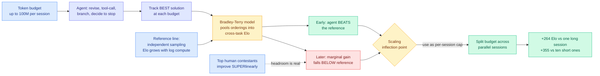
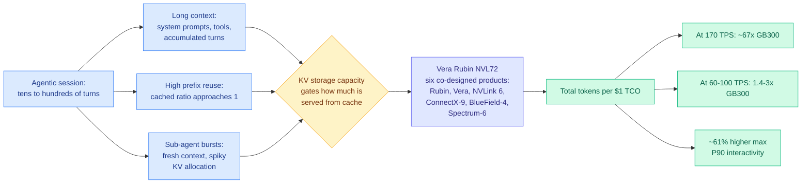
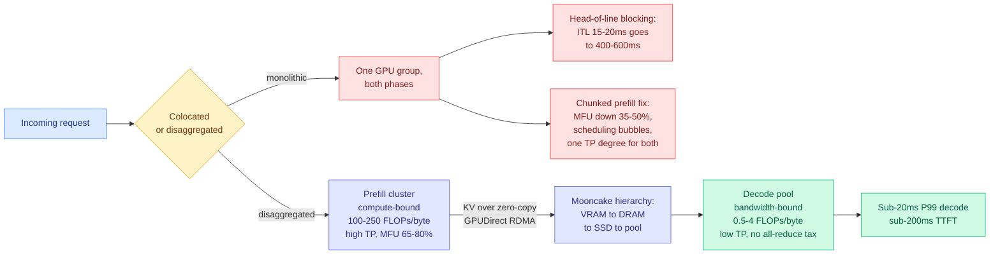
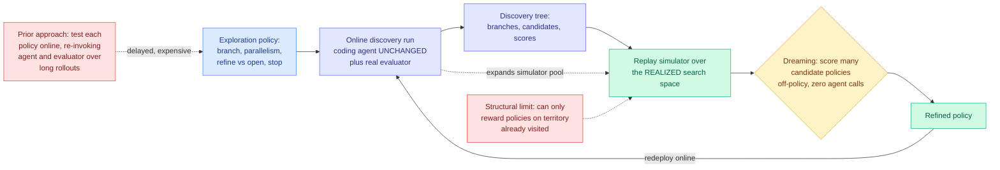
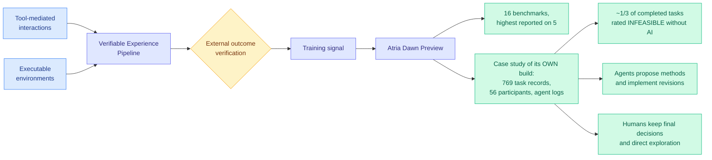
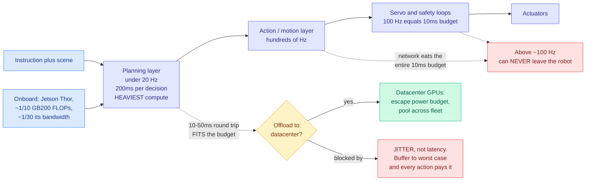

# cere-bro | 2026-09-15

> Today's throughline is cost optimization asked as an allocation question rather than a savings question, and it shows up at four layers at once. At the token layer, a paper finally measures the point where an agent's next token is worth less than a fresh independent sample, and re-slicing the same budget across parallel sessions buys +264 Elo for free. At the rack layer, SemiAnalysis publishes verified Vera Rubin agentic-inference numbers and defines the workload as one whose cached-input ratio tends toward 1, which is a memory-and-fabric problem rather than a FLOPs problem. At the serving layer, a chapter on disaggregated architectures argues the standard mitigation everyone ships is a compromise that misconfigures one phase by construction. And at the search layer, Google's Dream-RSI stops optimizing the kernel and starts optimizing the strategy for searching kernel space, replaying history so candidate policies cost nothing to evaluate. Four results, one shape: **the resource was never scarce in the way people were budgeting it, and the win came from moving it rather than buying more.**

🎯 Today's 5 for you

<ol>
<li>Read<strong>The point where an agent's next token stops paying now has a number.</strong> Elo-per-token tracks the best solution found at each budget and compares against independent sampling, whose Elo provably grows with log compute. Agents beat that line early, then fall below it. Split 100M tokens across parallel sessions capped at the crossing and you gain +264 Elo over one long session, same bill. This is your 09-08 breadth-over-depth thread getting a scale test and a schedulable threshold. <a href="https://arxiv.org/abs/2609.15309">Paper</a> · <a href="../../inference-efficiency/2026-09-15-elo-per-token-agent-test-time-scaling.md">Wiki</a></li>
<li>Read<strong>Vera Rubin agentic inference, measured, and the workload definition matters more than the 67x.</strong> SemiAnalysis puts 1.4x to 3x tokens-per-TCO-dollar over GB300 at realistic 60 to 100 TPS, with 67x only at the frontier edge and about 61% higher max P90 interactivity. The load-bearing part is their agentic profile: cached-input ratio tending toward 1, plus bursty sub-agent KV allocation. That is a direct requirement on your KV page, and it contradicts yesterday's 4-hi capacity argument. <a href="https://newsletter.semianalysis.com/p/vera-rubin-nvl72-agentic-inference">Essay</a> · <a href="../../hardware/2026-09-15-semianalysis-vera-rubin-agentic-inference.md">Wiki</a></li>
<li>Read<strong>Chunked prefill is a compromise, and the argument against it is structural.</strong> Ken Huang's Chapter 6 says colocating prefill and decode forces one tensor-parallel degree on two phases that want opposite ones, so any colocated system is misconfigured for one by construction. Inter-token latency goes from 15 to 20ms up to 400 to 600ms under head-of-line blocking. Mooncake's VRAM to DRAM to SSD to pool hierarchy is also the thing that resolves your capacity-versus-bandwidth tension. <a href="https://kenhuangus.substack.com/p/chapter-6-disaggregated-serving-architectures">Chapter</a> · <a href="../../inference-efficiency/2026-09-15-disaggregated-serving-mooncake-distserve.md">Wiki</a></li>
<li>Skim<strong>A DeepSeek kernel engineer gives AI-written CUDA six to twelve months, and a Google paper moves one level above the kernel.</strong> Shengyu Liu, whose code is in DeepSeek V4.1's main attention kernel, says AI now reads CUDA, PTX and SASS and profiles stalls per instruction. Dream-RSI lands the same morning optimizing the exploration policy over kernel space rather than the kernel. Your gpu-kernels cluster had five papers and no witness with the opposite incentive. Now it has one, and his timeline is shorter than theirs. <a href="../../hardware/2026-09-15-deepseek-kernel-engineer-rsi-essay.md">Essay summary</a> · <a href="../../agentic-systems/2026-09-15-dream-rsi-replay-simulator-exploration.md">Dream-RSI</a></li>
<li>Track<strong>An unverified routing claim with the exact shape your cost thesis predicts.</strong> A widely-shared post describes a paper arguing model loyalty is a tax: two frontier models share a million-token window, benchmarks overlap on the median task, and the gap only appears on the hard tail. Reported production split was 84% cheap and 16% ceiling, for $256 against $4,318. No paper link accompanied it, so treat it as a hypothesis. If it is real it is the largest production routing saving in the wiki. <a href="https://x.com/slash1sol/status/2099546400534983101">Post</a> · <a href="../../ai-routing/llm-routing.md">Routing page</a></li>
</ol>

---

## TL;DR

- **Elo-per-token**: agents convert tokens into quality faster than random sampling at first, then worse. Split the budget across parallel sessions instead.
- **Vera Rubin NVL72**: 1.4x to 3x more tokens per dollar than GB300 at realistic speeds. The 67x headline is a frontier-edge number.
- **Disaggregated serving**: splitting prefill and decode onto separate clusters. Chunked prefill costs 35% to 50% of tensor-core utilization.
- **Dream-RSI**: replay a finished search as a simulator, so testing new search strategies costs no model calls. Works on GPU kernel engineering.
- **Three recursive-self-improvement papers land in one morning**, two days after the wiki logged a survey whose bar none of them clear.
- **Amodei asks the industry to slow down**, and memory stocks drop while enterprise software rallies. Both governments call it a hoax.
- **ZGCM-1**: a fully open 7B matching models 30x larger on math and agentic search, with 4.2x faster pre-training time-to-loss.

---

## Deep Dives

*Note on sourcing: HuggingFace published 19 Daily Papers today. All eight Reddit subreddits again returned nothing past their score gates, as they have every day this month. The public Nitter scrape has now been dead for over two weeks, so today's X signal comes entirely from the home feed and the bookmark feed, which captured three saves. The Kurate cs.AI and cs.LG boards show every entry tied at score 1200 with 0% win rate for the third consecutive scrape, meaning the weekly 3-LLM tournament has still not run, and the three efficiency papers on the cs.LG board (post-training quantization theory, KV-concatenation-aware fine-tuning, forward-free depth pruning) were ingested on 09-10 and 09-11. No arXiv identifier appears in both today's HuggingFace list and the current Kurate top-20, so there are no cross-source-confirmed papers today.*

### When Agents Slow Down: Understanding LLM Agents' Test-Time Strategies via Elo-per-token Analysis

> Agents beat random sampling early and lose to it later, and the crossing point is a number you can measure and then schedule against. Past it, your scaffold is worse than just drawing more samples and picking the best.

**Source:** HuggingFace Daily Papers
**Links:** [Paper](https://arxiv.org/abs/2609.15309) · [Wiki summary](../../inference-efficiency/2026-09-15-elo-per-token-agent-test-time-scaling.md)

**What is it about?**
An agent that revises its answer, calls tools, explores alternatives and decides when to stop is choosing how much compute to spend on itself. That makes the usual scaling plot impossible to draw, because you cannot plot performance against compute when the agent picks the compute. This paper builds the missing instrument: it studies tasks that emit a score for every intermediate submission, tracks the best solution found at each token budget, and converts those within-task orderings into **Elo ratings** (the chess-style rating system, here computed with a Bradley-Terry model, which is the standard statistical method for turning pairwise win-loss records into one number) so results from tasks with completely different scoring scales become comparable.

**What problem does it solve?**
Until now, an agent's test-time scaling was reported as one final score against an unstated bill. Nobody could say whether a longer session was worth it, and "how long should a session run" was a hyperparameter someone guessed. This paper gives the field a reference line with a proof behind it: independent sampling, where Elo grows linearly with the logarithm of compute. Everything else can now be measured against that.

**What is the core novelty?**
The **scaling inflection point**: the per-session budget at which the agent's marginal Elo gain drops to match independent sampling. Agents start above the line, which is the whole justification for building scaffolding at all, then decay and cross below it. The crossing is not a curiosity, it is a schedulable quantity. Set your per-session cap there and spend the rest of the budget on more sessions.

**Key takeaways**
- Sessions run up to **100M tokens** across four general-purpose agents and four open-ended benchmarks, plus three feedback-driven optimization harnesses in controlled single-task interventions.
- Splitting 100M tokens across parallel sessions sized at the inflection point gained **+264 Elo over one long session** and **+355 over ten short ones**. Identical bill, different allocation.
- The strongest **human** contestants on shared AtCoder Heuristic Contest tasks improve **superlinearly** over contest time, where agents decelerate. That is evidence of continual learning and says the headroom above the agent curve is real rather than a property of the task.
- Agents genuinely do beat independent sampling early, so this is a result about where scaffolding stops paying, not an argument that scaffolding is worthless.

**Gaps in the study**
The four benchmarks were selected because they emit continuous intermediate scores, which is exactly what makes the trajectory observable. Most production agent work has no such signal, so locating your own inflection point needs a proxy the paper does not supply. Everything is also priced in tokens, and in real serving parallel sessions share a KV cache prefix, so ten sessions do not cost ten times one and the allocation that wins in tokens may not win in dollars.

**Industrial implication**
Within two quarters this should show up as a per-session token cap in agent frameworks, set per task family rather than globally, with the saved budget spent on parallel attempts and a selector. It also hands routers a second lever: not only which model answers, but how many parallel sessions capped at what budget, which is a cost-at-a-quality-bar decision entirely orthogonal to model choice.

This confirms, at two orders of magnitude more compute, what the wiki recorded on 09-08 from [revision propagation](../../inference-efficiency/2026-09-08-revision-propagation-test-time-compute.md), the paper that benchmarked propagating a local edit through every dependent part of a multi-turn artifact and found **parallel sampling with selection beats sequential self-revision and beats more reasoning tokens on one attempt by 2.2 to 9.7 points at fixed budget**. Two independent results in one week is a pattern. Breadth is now the default allocation and depth is what needs justifying.

→ [Full summary](../../inference-efficiency/2026-09-15-elo-per-token-agent-test-time-scaling.md)

---

### Vera Rubin NVL72 Agentic Inference: 67x Better Performance per Dollar

> The headline is a frontier-edge number and the honest one is 1.4x to 3x. The part worth your time is the workload definition, which says the next hardware generation is gated by KV capacity and fabric speed rather than by FLOPs.

**Source:** SemiAnalysis (Gmail starred)
**Links:** [Essay](https://newsletter.semianalysis.com/p/vera-rubin-nvl72-agentic-inference) · [Wiki summary](../../hardware/2026-09-15-semianalysis-vera-rubin-agentic-inference.md)

**What is it about?**
The first verified agentic-inference measurements for NVIDIA's Vera Rubin NVL72 rack, run on SemiAnalysis's **AgentX** benchmark, which replays real agentic traffic across a fleet of thousands of chips rather than generating synthetic prompts. The axis is total tokens generated per $1 of all-in total cost of ownership, which is the number an inference provider actually budgets against, rather than tokens per second.

**What problem does it solve?**
Chip comparisons have been vendor slides and synthetic throughput, neither of which tells a provider what a token will cost. AgentX plus a published TCO model (owning at hyperscaler volume, and rent on a three-year commit, from a monthly survey of over 100 GPU customers, neoclouds and hyperscalers) makes "which chip for which workload" answerable instead of "whose chip is fastest."

**What is the core novelty?**
The agentic workload profile itself, which is what justifies a new benchmark. Four properties: **multi-turn** (tens to hundreds of interactions per session), **long context**, **high prefix reuse** (because turn *n* concatenates turn *n-1*'s output, the cached-to-uncached ratio tends toward 1 as the session grows, subject to how much storage you have for KV tensors), and **sub-agent bursts** (short-lived sub-agents with fresh context creating spiky KV allocation). Read as a hardware specification, properties three and four say the binding constraint is memory and fabric, not compute.

**Key takeaways**
- At **170 tokens per second** on apples-to-apples TensorRT-LLM NVFP4 dense, roughly **67x the throughput per TCO dollar** of GB300 under owning-cost assumptions. At **60 to 100 TPS** where providers actually serve, **1.4x to 3x**. Quote the second number.
- About **61% higher maximum P90 interactivity**, meaning Rubin can serve a materially faster experience before quality of service collapses.
- On pre-release software, **over 2x more profit per gigawatt** than Blackwell, expected to widen as kernel libraries mature.
- Against Jensen Huang's own GTC 2026 claim of 3x performance per megawatt versus Blackwell, the measured figure is up to **7x**. SemiAnalysis note the same pattern at GTC 2024, where a claimed 30x Hopper for GB200 NVL72 measured at 98x. Treat NVIDIA guidance as a lower bound.

**Gaps in the study**
Only TensorRT-LLM is measured, with vLLM and SGLang promised later, and the gap between vendor-optimal and community-stack performance is historically large. The Rubin numbers were produced with NVIDIA's assistance on NVIDIA pre-release software, which is disclosed and is still a conflict. And the benchmarked rack ships **1.5TB of CPU LPDDR5X per compute tray, half the Vera memory originally planned**, which is a strange thing to publish alongside a workload definition that is KV-capacity-bound, without analysing the interaction.

**Industrial implication**
If the 1.4x-to-3x figure holds on open serving stacks, Rubin changes the rent-versus-own calculation for anyone serving agentic traffic within two quarters, and it makes agentic workloads the design target rather than chatbot traffic. The wider effect is on the benchmark itself: with TPUv7, NVIDIA and AMD already in and AMD committing to MI455X UALoE72, a dollar-normalized cross-vendor board is the first apparatus that can discipline accelerator marketing.

→ [Full summary](../../hardware/2026-09-15-semianalysis-vera-rubin-agentic-inference.md)

---

### Disaggregated Serving Architectures: Mooncake, DistServe and vLLM V1

> The mitigation every production stack ships is a compromise that misconfigures one of the two phases by construction, because prefill wants high tensor parallelism and decode is punished by it, and a colocated system has to pick one.

**Source:** Ken Huang, *The Physics & Engineering of Frontier LLM Inference*, Chapter 6 (RSS)
**Links:** [Chapter](https://kenhuangus.substack.com/p/chapter-6-disaggregated-serving-architectures) · [Wiki summary](../../inference-efficiency/2026-09-15-disaggregated-serving-mooncake-distserve.md)

**What is it about?**
Serving an LLM has two phases with opposite hardware appetites. **Prefill** reads the prompt and is compute-bound: big matrix multiplications over up to 128,000 input tokens, at roughly 100 to 250 FLOPs per byte moved from high-bandwidth memory, pushing model-FLOPs utilization to 65% to 80%. **Decode** generates tokens one at a time and is memory-bandwidth-bound: 0.5 to 4 FLOPs per byte, with the execution pipelines mostly idle while weights and KV tensors stream across the bus for every single token. This chapter argues that running both on the same GPU is an architectural dead end.

**What problem does it solve?**
When both phases share hardware, a long prefill seizes the streaming multiprocessors for hundreds of continuous milliseconds and every decode stream behind it stalls. Inter-token latency goes from an optimal **15 to 20 milliseconds to 400 to 600 milliseconds**, which destroys any 99th-percentile service-level objective instantly.

**What is the core novelty?**
The attack on **chunked prefill**, which is the mitigation most stacks actually ship (Sarathi-Serve, vLLM v0.6) and which slices a long prompt into 512-token chunks interleaved with decode passes. Huang names three costs. **Arithmetic intensity collapse**: slicing a 32K prefill into 64 chunks cuts tensor-core utilization by 35% to 50%. **Scheduling bubbles and memory jitter**: interleaving the two kernel types causes cache-line evictions and warp stalls, so decode never gets jitter-free latency. **Asymmetric parallelism**: prefill latency improves with high tensor parallelism while single-token decode is dominated by cross-GPU all-reduce overhead that gets worse at high tensor parallelism. The third is the strongest because it is structural rather than a tuning problem.

**Key takeaways**
- The prescribed alternative is physical prefill-decode disaggregation: dedicated prefill clusters, independent decode pools, and a KV transfer engine moving tensors between them over zero-copy GPUDirect RDMA on InfiniBand or RoCEv2.
- **Mooncake**, Moonshot AI's hierarchical KV cache store spanning VRAM, host DRAM, local SSD and a distributed pool, is deployed in the 2.8-trillion-parameter Kimi K3 stack.
- Stated targets are sub-20ms P99 decode latency and sub-200ms time-to-first-token under heavy concurrency.
- The hierarchy is also what resolves this week's contradiction between wanting more KV capacity and being told to stop buying HBM capacity: **capacity and bandwidth become separately purchasable once KV lives in tiers.**

**Gaps in the study**
The free portion is an argument, not a measurement. The 35% to 50% utilization figure has no cited source and presumably depends heavily on chunk size, sequence length and kernel implementation. There is no TCO comparison, and disaggregation buys latency at the cost of a fabric plus two independently sized pools, where a prefill-to-decode ratio wrong by 2x wastes more than head-of-line blocking costs. Nothing on what happens to an in-flight session when a decode pool member dies and its KV lives elsewhere.

**Industrial implication**
vLLM and SGLang ship chunked prefill on by default and regard it as a win, so both positions cannot be right everywhere. They reconcile only if the crossover depends on context length and concurrency, and **that plot is the single most useful missing artifact for anyone choosing a serving architecture right now.** It is cheap to produce and nobody has published it.

→ [Full summary](../../inference-efficiency/2026-09-15-disaggregated-serving-mooncake-distserve.md)

---

### Dream-RSI: Recursive Self-Improvement through Evolving Worlds

> Stop optimizing the candidate and optimize the search. A finished discovery run is a tree of branches and scores you already paid for, so replay it as a simulator and test a hundred new search strategies for the price of none.

**Source:** HuggingFace Daily Papers (Google, Google DeepMind, University of Maryland, University of Virginia)
**Links:** [Paper](https://arxiv.org/abs/2609.14858) · [Wiki summary](../../agentic-systems/2026-09-15-dream-rsi-replay-simulator-exploration.md)

**What is it about?**
Discovery agents in the AlphaEvolve and OpenEvolve line generate a candidate solution, run it, score it, and use the result to generate the next one. Almost all work on them improves the **candidates**. Dream-RSI moves one level up and improves the **exploration policy**: which branch to expand, how much to run in parallel, whether to refine an existing candidate or open a new direction, and when to stop.

**What problem does it solve?**
Optimizing a search strategy online is prohibitive because you cannot judge a strategy from one action. You have to watch it across hundreds or thousands of generate-and-evaluate cycles, so feedback is delayed and expensive, and the space of possible strategies is large. Testing candidate strategies directly means re-invoking the coding agent and the evaluator every time, which is exactly the bill you were trying to reduce.

**What is the core novelty?**
You already paid for the answer. A completed discovery run leaves a **discovery tree** of every branch expanded, every candidate generated and every score returned, and that history can be replayed as a **simulator over the realized search space**. Run a candidate exploration policy inside the replay and you get immediate off-policy feedback on how it would have navigated territory you already mapped, at **zero model-invocation cost**. Refine there, redeploy online, and the new run enlarges the simulator pool for the next round. The underlying coding agent is never touched.

**Key takeaways**
- Evaluated on algorithm engineering, mathematical optimization and **GPU kernel engineering**, reporting competitive or improved discovery quality while substantially reducing discovery cost in several settings.
- This is the first paper in this cluster whose headline is a **cost reduction rather than a capability gain**, which is the discipline the wiki has demanded since 09-04 recorded that nine consecutive results in this area omitted the cost of their own mechanism.
- It implies a fifth explanation for the Evo-Bench plateau, where autonomous harness evolution saturates after a few cycles: **the meta-search is under-sampled rather than exhausted**, because each cycle can only afford a handful of policy candidates. If replay buys a hundred evaluations for free, the saturation point should move.
- A companion result landed the same morning. [RSIAgent](../../agentic-systems/2026-09-15-rsiagent-environment-memory.md) (arXiv [2609.15364](https://arxiv.org/abs/2609.15364)) is training-free: curriculum, actor and verifier agents explore a new environment broad-then-deep, retain verifier-confirmed **causal action-condition-consequence rules**, then freeze that memory. It lifts Kimi-K3 and GLM-5.3 past GPT-6 on OSWorld-v2 and Agent's Last Exam with no weight updates.

**Gaps in the study**
No numbers in the abstract, and "in several settings" is a hedge doing real work: the honest reading is that it does not win everywhere. The orchestration layer's own cost is unreported, which is the tenth consecutive time in this cluster. The replay simulator's **fidelity** is the entire load-bearing assumption and the abstract does not say how it is validated, when a policy that looks good in replay and bad online would be the most informative result available. And the structural objection is sharp: a replay simulator is built from the **realized** search space, so a policy whose advantage is exploring where nothing has gone is exactly the one it cannot reward.

**Industrial implication**
Anyone running an expensive automated search loop, whether kernel tuning, architecture search or prompt optimization, can bolt a replay layer onto logs they are already keeping and get strategy tuning close to free. The strategic reading is sharper: **the cheap part of AI research is becoming the search, and the expensive part is becoming the evaluation.** Every result in this area now buys candidate evaluations with someone else's already-spent compute.

→ [Full summary](../../agentic-systems/2026-09-15-dream-rsi-replay-simulator-exploration.md)

---

### Atria Dawn: The Dawn of Agentic Superintelligence

> Ignore the title. The contribution is that the authors instrumented their own model build and published 769 task records, and about a third of completed AI-assisted tasks were rated infeasible without AI.

**Source:** HuggingFace Daily Papers
**Links:** [Paper](https://arxiv.org/abs/2609.15818) · [Wiki summary](../../agentic-systems/2026-09-15-atria-dawn-agentic-research-model.md)

**What is it about?**
A foundation agentic language model for scientific research and engineering workflows, trained through a **Verifiable Experience Pipeline** that connects tool-mediated interactions to executable environments and externally verified outcomes. It is competitive with frontier agents across 16 benchmarks and posts the highest reported score on five.

**What problem does it solve?**
The interesting half is not the benchmark. Claims about AI accelerating AI research circulate constantly with no measurement behind them. This paper instruments an actual research organization building an actual model and publishes the log.

**What is the core novelty?**
**769 task records from 56 participants**, alongside agent logs, analysed as a case study of human-AI collaboration. Two findings. Participants rated about **one-third of completed AI-assisted tasks as infeasible without AI**, which is a far stronger claim than a productivity multiplier. And the division of labour: **agents frequently propose methods and implement revisions, while humans retain most final decisions and guide exploration through judgment and feedback.** The authors read this as a shift from task-level execution to project-level partnership.

**Key takeaways**
- The method-proposal finding agrees with a controlled experiment using an entirely different methodology. [AutoWorldModel-Bench (08-13)](../../agentic-systems/2026-08-13-autoworldmodel-bench.md), which gave a frontier coding agent a world-model starter and no definition of "better," found it improved the starter in **63 of 64 sessions** with **91% of winning edits being research-style modifications** rather than hyperparameter tweaks. Twice-measured by unrelated methods.
- The paper closes by arguing that progress toward autonomous AI research must advance **both** discovery capacity and meaningful human oversight, keeping accountable human authority over risk and direction. That is unusually careful for a paper with this title.
- Social commentary framed it as a 96-person lab, 65 of them students, at Shanghai AI Laboratory, on a GLM-5.2 744B backbone beating GPT-5.6 and Claude Opus 5. Those specifics are unverified secondhand.

**Gaps in the study**
The 769 records come from participants building the model being evaluated, who have every incentive to rate their own AI-assisted work highly, and there is no blind control arm. Self-reported infeasibility is the weakest link in the paper's most quotable number. The 16-benchmark claim is "highest reported," not head-to-head under matched harness and token budget, and this wiki has repeatedly found harness choice moves agent scores more than model choice does.

**Industrial implication**
If a third of research tasks really become feasible only with AI assistance, the bottleneck in a research organization moves from execution capacity to **judgment capacity**, meaning deciding what is worth pursuing and what evidence settles it. That is an argument for reorganizing research teams around review throughput rather than headcount, and it arrives with a sample size for the first time.

→ [Full summary](../../agentic-systems/2026-09-15-atria-dawn-agentic-research-model.md)

---

### ZGCM-1: A Fully Open and Extremely Efficient Foundation Model for Math and Agentic Search

> A 7B dense model competitive with models 30x larger on math and agentic search, released with every checkpoint, data recipe and training log. Its infrastructure was run by agent swarms, which is the thing Dario Amodei asked the field to slow down for three days earlier.

**Source:** HuggingFace Daily Papers (Zhongguancun Academy / Zhongguancun Institute of Artificial Intelligence)
**Links:** [Paper](https://arxiv.org/abs/2609.13356) · [Wiki summary](../../llms-foundation-models/2026-09-15-zgcm-1-open-efficient-7b.md)

```mermaid
flowchart LR
  ARCH[Interleaved gated sliding-window<br/>plus full attention] --> PRE[Pre-training<br/>stable FP8 Muon optimizer<br/>~4.2x faster time-to-loss at 16K]
  PRE --> CUR[Progressive context curriculum<br/>16K to 64K to 256K]
  CUR --> MID[MDP mid-training:<br/>interaction traces recast as<br/>state-action-consequence]
  MID --> POST[Post-training:<br/>SFT quality pruning plus RL]
  POST --> MODEL[ZGCM-1, 7.39B dense,<br/>256K context]
  MODEL --> THINK[Deliberate internal thinking]
  MODEL --> TOOL[Active external tool use]
  THINK --> RES[Competitive with<br/>Qwen3-235B-A22B and GLM-5.1<br/>on math and agentic search]
  TOOL --> RES
  SWARM[Agent swarms ran cluster ops,<br/>data curation, diagnostics] -.->|managed the run itself| PRE
  classDef input fill:#dbeafe,stroke:#3b82f6,color:#1e3a8a
  classDef decision fill:#fef3c7,stroke:#f59e0b,color:#78350f
  classDef output fill:#d1fae5,stroke:#10b981,color:#065f46
  classDef aux fill:#e0e7ff,stroke:#6366f1,color:#312e81
  class ARCH input
  class THINK,TOOL decision
  class PRE,CUR,MID,POST,SWARM aux
  class MODEL,RES output
```

**What is it about?**
A 7.39-billion-parameter dense model trained from scratch and released with everything: weights from the pre-training, mid-training and post-training stages, intermediate checkpoints, training code, per-stage data and recipes, and the Weights & Biases logs. "Fully open" here means the run is reproducible, not just the artifact downloadable, which is rarer than the phrase usually implies.

**What problem does it solve?**
A compact model cannot passively memorize the open web. The paper's premise is that it can get past its parametric limit by pairing deliberate internal reasoning with active external tool use, and that tool use therefore belongs in mid-training rather than bolted on afterwards.

**What is the core novelty?**
Three things composed. Architecturally, **interleaved gated sliding-window and full attention**, where most layers attend to a local window and some retain global reach, which is how you reach 256K context without paying quadratic cost everywhere. Optimizer-wise, a **stable FP8 Muon**, where Muon is the newer matrix-aware optimizer displacing AdamW in efficiency-focused runs and making it stable in 8-bit floating point is the non-trivial part. Training-wise, interaction traces are reformulated as **Markov Decision Processes** (state, action, consequence) so the model learns state-conditioned action prediction rather than imitating a transcript.

**Key takeaways**
- Roughly **4.2x efficiency improvement in 16K pre-training time-to-loss**.
- On several hard mathematical-reasoning and agentic-search suites, competitive with frontier models **orders of magnitude larger**, naming Qwen3-235B-A22B and GLM-5.1. On general benchmarks the claim is the much weaker "competitive across the 7B family."
- Eight distilled empirical findings across architectural scaling, supervised fine-tuning quality pruning, long-context generalization and agentic co-training dynamics.
- The team ran an **AI-native R&D workflow in which agent swarms autonomously managed cluster operations, data curation and rapid diagnostic evaluation**.

**Gaps in the study**
Time-to-loss at 16K is measured at the short end of a model whose selling point is 256K, and the 4.2x almost certainly does not hold at full context. There is no inference cost at all: a 7B model calling a search tool ten times may cost more per answer than a 235B mixture-of-experts answering directly, so **the efficiency claim is about training, not serving**, until someone publishes that comparison. And the stability conditions for FP8 Muon, the finding most likely to transfer to other labs, are not in the abstract.

**Industrial implication**
Full-stack openness is a cost argument, not only a values one: publishing intermediate checkpoints and per-stage data recipes means the next group does not pay for the same failed configurations. Whether anyone reuses them is measurable and is the right signal to watch. The agent-swarm paragraph is the more consequential one, and it is discussed in Global View below.

→ [Full summary](../../llms-foundation-models/2026-09-15-zgcm-1-open-efficient-7b.md)

---

### A Brain Too Big to Carry: On-Device vs Datacenter Inference

> Decompose a system by loop frequency and the network round trip sets the boundary between local and remote. But the thing that actually forces a decision local is jitter, not latency, and no routing paper in the wiki reports latency variance.

**Source:** SemiAnalysis (Gmail starred)
**Links:** [Essay](https://newsletter.semianalysis.com/p/a-brain-too-big-to-carry-on-device) · [Wiki summary](../../hardware/2026-09-15-semianalysis-robot-inference-onboard-vs-datacenter.md)

**What is it about?**
Where the brain of a robot should physically sit. With language models, hardware bends to the model: train on as much compute as possible, then work out how to serve the result. Robotics inverts this because of time (a control loop cannot miss a deadline, and if the robot is slow the world changes and the action is obsolete) and cost (the manufacturer pays for compute on every unit, up front, which at scale is billions).

**What problem does it solve?**
It replaces a vague on-device-versus-cloud debate with an arithmetic rule anyone can apply.

**What is the core novelty?**
**Frequency decides placement.** Action and servo layers run at hundreds of hertz, so a 100 Hz loop must emit every 10 milliseconds, while a typical wireless round trip is 10 to 50 milliseconds and a well-engineered link is under 10. The network consumes the entire budget before the model computes anything, so **anything above roughly 100 Hz can never leave the robot**. Below about 20 Hz, where planning lives, a 5 Hz planner gets 200 milliseconds per decision and a round trip fits comfortably. And the real obstacle is **jitter, not latency**: a fixed delay can be planned around because you know how far everything moves in that window, but irregular arrival cannot, and buffering to the worst case makes every action pay the worst case.

**Key takeaways**
- Frontier robot models already outgrow the robot. Physical Intelligence's π0.7 runs on an off-robot H100; NVIDIA's DreamZero, a 14B world-action model on a video-diffusion backbone, needs two GB200s to run in real time.
- **Jetson Thor, the best robot compute purchasable today, delivers about 1/10th the FLOPs of a GB200 and roughly 1/30th of its memory bandwidth.** The bandwidth gap is three times the compute gap, so edge inference is more bandwidth-starved than datacenter inference, not less.
- The trend line is genuinely unsettled. Months after DreamZero, NVIDIA's RoboTTT made the opposite bet: a **3B policy that continually updates its own weights with test-time training** instead of generating videos of the future, giving minutes of usable context small enough to run onboard. Same lab, opposite direction.
- The supply chain is geared to datacenter silicon, and ramping robot silicon is hard with front-end capacity and DRAM already tight.

**Gaps in the study**
The free portion stops before the networking sections it promises, so the jitter argument is set up but not delivered. "Pool inference across a fleet" is asserted with no utilization figure, and robot fleets plausibly have correlated demand (everyone works during the day), which is the case where pooling helps least. And there is no treatment of the hybrid the conclusion implies: which planning sub-tasks offload well, and what the fallback is when the link drops mid-decision.

**Industrial implication**
Strip the robot out and this is a general theory of inference placement, which makes it a direct criticism of the routing literature. Every routing result in the wiki reports cost and quality, some report mean latency, and **none reports latency variance**. If the correct boundary for local-versus-remote is set by variance rather than by mean, then routing has been measuring the wrong latency statistic, and the omission is invisible in any benchmark reporting averages. The RoboTTT counter-example is also worth tracking on its own: it reframes test-time training as a **memory-compression technique**, buying context without paying for a model big enough to hold it, which is not how any paper presents it.

→ [Full summary](../../hardware/2026-09-15-semianalysis-robot-inference-onboard-vs-datacenter.md)

---

### Pacing the Frontier: Amodei's Essay, the Market's Verdict, and the Reply from the Middle

> Four frontier CEOs agreed within 48 hours, memory stocks fell 6% and enterprise software rose 7%, both governments called it fearmongering, and the most useful contribution came from two researchers arguing the whole framing is wrong.

**Source:** darioamodei.com, AI Breakfast, The Information, AI Snake Oil (Gmail starred, RSS, X home feed)
**Links:** [Amodei essay](https://darioamodei.com/post/we-must-pace-the-frontier) · [Market reaction](https://www.investing.com/news/stock-market-news/chip-memory-stocks-fall-amid-calls-for-ai-development-slowdown-4898878) · [Wall Street verdict](https://www.theinformation.com/articles/wall-street-delivers-verdict-ai-slowdowns-winners-losers) · [Kapoor and Narayanan](https://x.com/sayashk/status/2099632561396056214) · [Wiki summary](../../ai-industry/2026-09-15-pacing-the-frontier-debate.md)

**What is it about?**
On Saturday, Dario Amodei published *We Must Pace the Frontier*, arguing that since roughly this summer AI has been advancing drastically faster, "driven primarily by AI's growing ability to build the next generation of AI." His named fear is **agent swarms**: within 6 to 12 months, he writes, such a swarm could take over the internet with a persistent botnet causing hundreds of billions in damage.

**What problem does it solve?**
It proposes a three-step plan, of which only the first is unilateral. **One**: embedded third-party evaluators with desks, badges, company laptops, permissions comparable to internal risk teams, and the right to publish without Anthropic's editorial control. **Two**: common standards and capability limits across democratic-world labs, requiring a narrow antitrust waiver from Washington. **Three**: coordination with authoritarian governments, which he concedes is the hard part. On China he asks for **no new limits on US labs at all**: keep chip export controls, crack down on distillation, harden weight security.

**What is the core novelty?**
The speed of the consensus and the precision of the market's disagreement with it. Altman agreed within hours, called it a primary topic at OpenAI in recent weeks, and matched the evaluator commitment. Musk replied "Dario is right." Nadella backed pacing on Sunday and said Microsoft would open its MAI model behavior rules to public consultation. Four of the largest labs on one side inside two days.

**Key takeaways**
- **Memory took it worst.** SK Hynix and Kioxia both closed down 6.4%, Samsung Electronics down 4.1%, the KOSPI off about 3.2%. In Europe, ASML down 4.4%, BE Semiconductor 4.8%, Infineon and ASM International both over 5%. SoftBank fell as much as 13%, its worst session since July. Nvidia and Micron were roughly flat.
- **The mirror image is the more interesting half.** On the same Monday, ServiceNow rose 7% and Salesforce nearly 5%, with Shopify and Figma also up. **A slower frontier transfers value from the compute supply chain to the application layer, and Wall Street just published that model.**
- **Bernstein says the reaction overshoots the text.** Semis were already down about 19% from June peaks, and Amodei "is not calling for a halt to training, but rather a shift from 'extremely fast' to 'only somewhat fast.'" The essay asks for no compute cap on US labs.
- **The reply from the middle is the substantive one.** Sayash Kapoor and Arvind Narayanan published a 13,000-word essay rejecting the polarization between AI safety and cybersecurity communities. Their sharpest claim: **marginal investment in AI control is more likely to pay off than marginal investment in alignment**, because incidents show a lack of emphasis on control despite known techniques being available. Their recommendation aimed squarely at Amodei: **organizational governance should be the primary tool, and AI companies are trying to reinvent it as a technology problem.** When a single misconfigured RL environment can cause real harm, individual teams should not be able to run dangerous experiments without legal and security oversight.

**Gaps in the study**
Amodei's acceleration claim is stated without a metric. "Drastically faster since roughly this summer" is not falsifiable as written, and it is load-bearing for everything downstream. Steps two and three need antitrust waivers and authoritarian cooperation, neither within any company's control, so the unilateral first step is the only part with a delivery date. And the calendar invites scepticism: the Financial Times reports Anthropic told shareholders it expects a second straight quarter of positive adjusted operating income on gross margins above 80% against $11.5B in Q2 revenue, while Business Insider reports a Nasdaq listing picked for October. Every Anthropic financial figure here is single-outlet reporting from unnamed sources.

**Industrial implication**
The chance of a coordinated slowdown is close to zero, with Trump calling alarm-raisers "negative forces" and China rebuffing what it called US "fearmongering." What survives is the unilateral commitment: **if embedded external evaluators with publication rights actually appear at two or more frontier labs, that is a real structural change regardless of whether anybody slows down.** Kapoor and Narayanan also update publicly, which is rare and worth respecting: they say *AI as Normal Technology* under-weighted risks arising during development and evaluation rather than deployment, and underplayed jaggedness, while maintaining that the continuity hypothesis held because rogue-agent behavior became visible while the agents were still incompetent at hiding their traces.

→ [Full summary](../../ai-industry/2026-09-15-pacing-the-frontier-debate.md)

---

## Industry Pulse

- **Amodei publishes "We Must Pace the Frontier"**, and Altman, Musk and Nadella all endorse pacing within 48 hours ([essay](https://darioamodei.com/post/we-must-pace-the-frontier)).
- **Memory and semicap sold off on the essay**: SK Hynix and Kioxia both down 6.4%, Samsung 4.1%, ASML 4.4%, SoftBank down as much as 13% ([source](https://www.investing.com/news/stock-market-news/chip-memory-stocks-fall-amid-calls-for-ai-development-slowdown-4898878)).
- **Enterprise software rallied on the same news**: ServiceNow up 7%, Salesforce nearly 5%, Shopify and Figma also up ([The Information](https://www.theinformation.com/articles/wall-street-delivers-verdict-ai-slowdowns-winners-losers)).
- **Trump called the alarm-raisers "negative forces"** and China rebuffed US "fearmongering," so a coordinated slowdown has no state backing ([The Information](https://www.theinformation.com/articles/wall-street-delivers-verdict-ai-slowdowns-winners-losers)).
- **Real-SWE benchmark puts the best model at 38.8%** on licensed private codebases, against 90-plus Terminal-Bench numbers from the same models ([benchmark](https://withspecific.com/benchmarks/real-swe)). Tasks touch about 11 files each against roughly 6 on public benchmarks. Caveat it properly: 10 tasks, 8 runs each.
- **DRAM revenue surged 59.5%** as AI memory demand outpaced supply expansion, and **HBM shortage pushed Chinese AI accelerator prices up as much as 50%** ([Semiconductor Newsletter Week 37](https://thesemiconductornewsletter.substack.com/p/week-37-2026)).
- **Intel Foundry processed more than one million wafers with High-NA EUV**, Samsung targets High-NA for DRAM high-volume manufacturing by 2028, TSMC plans High-NA volume production from 2030 ([source](https://thesemiconductornewsletter.substack.com/p/week-37-2026)).
- **Global foundry revenue hit $53.5 billion** as TSMC extended its advanced-node dominance, with AI datacenters projected to drive semiconductor revenue toward $1.5 trillion by 2031 ([source](https://thesemiconductornewsletter.substack.com/p/week-37-2026)).
- **OpenAI and Samsung deepened cooperation** on next-generation AI chips and memory ([source](https://thesemiconductornewsletter.substack.com/p/week-37-2026)).
- **Y Combinator open-sourced QM**, the multi-agent harness it runs internally across accounting, legal, events and engineering, MIT licensed and model-swappable between Pi, OpenCode, Codex and Claude Code ([post](https://x.com/stretchcloud/status/2099476507454509254)).
- **MCP defined an extension for discovering and loading Agent Skills from MCP servers**, loading the SKILL.md only when needed ([repo](https://github.com/modelcontextprotocol/ext-skills)).
- **Nadella framed the corporate AI moat as a company-owned learning loop**, a "hill-climbing machine" of private evals, RL environments, traces and rewards that stay in the tenant ([Ken Huang](https://kenhuangus.substack.com/p/nadellas-ai-moat-is-the-learning)).
- **Camille Stewart Gloster, the first White House Deputy National Cyber Director for Technology and Ecosystem Security, published an agent-governance framework** treating an autonomous agent as a new class of non-human insider ([essay](https://kenhuangus.substack.com/p/we-cant-sleepwalk-through-the-ai)).
- **A DeepSeek kernel engineer published an essay** estimating six to twelve months until AI-written CUDA kernels match his own, and it was the day's most-shared item across English and Chinese X ([summary](../../hardware/2026-09-15-deepseek-kernel-engineer-rsi-essay.md)).
- **Bilal Chughtai resigned from Google DeepMind**, where he worked on AGI safety and alignment research ([post](https://x.com/Miles_Brundage/status/2099588090649854059)).
- **Diraq and Iceberg Quantum showed a path to 1,000 logical qubits from 150,000 physical qubits** on silicon spin qubits, mapped end-to-end with NVIDIA CUDA-Q Logical to within a 5% margin ([Quantum Zeitgeist](https://quantumzeitgeist.substack.com/p/logical-advantage-of-pinnacle-confirmed)).

**Funding, valuations, and compute deals**

- **SoftBank closed an upsized $11.87B two-year loan** from roughly 20 banks to fund its OpenAI investment ([Bloomberg via AI Breakfast](https://www.investing.com/news/stock-market-news/chip-memory-stocks-fall-amid-calls-for-ai-development-slowdown-4898878)).
- **Anthropic reportedly picked Nasdaq for an October listing**, with Reuters separately reporting talks for Nvidia to anchor with up to **$10B**. Single-outlet, unnamed sources, no company confirmation.
- **Anthropic reportedly told shareholders** it expects a second straight quarter of positive adjusted operating income on gross margins above 80%, against **$11.5B in Q2 revenue** (FT, unconfirmed).
- **Altman ruled out an OpenAI IPO this year**, telling Fortune that safety makes now "an ill-advised moment to go public," and confirming "I would say not 2026, yeah."
- **OpenAI is said to be buying Glass Imaging for $300 million**, a smartphone-camera startup founded by ex-Apple employees that was valued at $100M last year ([The Information](https://www.theinformation.com/briefings/openai-said-buy-startup-glass-imaging-300-million)).
- **Positron AI raised $875 million** to scale memory-centric inference silicon ([Semiconductor Newsletter](https://thesemiconductornewsletter.substack.com/p/week-37-2026)).
- **Enflame raised $912 million**, with its Shanghai debut valuing the AI chipmaker above **$25 billion** ([source](https://thesemiconductornewsletter.substack.com/p/week-37-2026)).
- **Ayar Labs raised its 2026 funding to $650 million** to scale co-packaged optics manufacturing ([source](https://thesemiconductornewsletter.substack.com/p/week-37-2026)).
- **Analog Devices agreed to acquire Alif Semiconductor** for up to **$1.55 billion** ([source](https://thesemiconductornewsletter.substack.com/p/week-37-2026)).
- **Altera is preparing an IPO above $2 billion** as its independent FPGA strategy advances ([source](https://thesemiconductornewsletter.substack.com/p/week-37-2026)).
- **Amkor expanded its Arizona advanced-packaging campus to $12 billion** and 93,000 square metres ([source](https://thesemiconductornewsletter.substack.com/p/week-37-2026)).
- **The US CHIPS program committed $775 million to quantum semiconductor R&D**, including a **$375 million** award to GlobalFoundries ([source](https://thesemiconductornewsletter.substack.com/p/week-37-2026)).
- **CVD Equipment exited new system orders and cut roughly 50% of its workforce**, the one clear loser in an otherwise expansionary week ([source](https://thesemiconductornewsletter.substack.com/p/week-37-2026)).

---

## Global View

**The strongest claim in this week's policy argument is a research claim, and the wiki's own record says it is true in infrastructure and not yet true in the loop.** Dario Amodei's pacing essay rests on AI's "growing ability to build the next generation of AI," naming agent swarms as the danger. On the same morning, HuggingFace published three recursive-self-improvement papers, and [ZGCM-1](../../llms-foundation-models/2026-09-15-zgcm-1-open-efficient-7b.md) reported that **agent swarms autonomously managed cluster operations, data curation and diagnostic evaluation** for its own training run, presented as a method worth copying. But the wiki logged a survey two days earlier, [The Last AI Built by Humans (09-13)](../../agentic-systems/2026-09-13-last-ai-built-by-humans-rsi.md), which set the bar that a one-time gain is not recursive self-improvement: the mechanism produced in round N must be retained into round N+1 and produce a stronger successor under comparable budget. **[Dream-RSI](../../agentic-systems/2026-09-15-dream-rsi-replay-simulator-exploration.md) aims at that bar by optimizing its own search strategy and shows one loop closing, [RSIAgent](../../agentic-systems/2026-09-15-rsiagent-environment-memory.md) freezes a memory and stops, and [Atria Dawn](../../agentic-systems/2026-09-15-atria-dawn-agentic-research-model.md) says outright that humans still decide what is worth pursuing.** Nothing published today clears the bar, which means a 6-to-12-month botnet forecast and a $500B market repricing both rest on a premise the research record supports only in the weak form: agents now run the infrastructure of AI research reliably, and they do not yet improve the thing that improves them.

**Three results today attack the same waste from three layers, and the pattern is that the industry has been buying the wrong resource at every one.** [Elo-per-token](../../inference-efficiency/2026-09-15-elo-per-token-agent-test-time-scaling.md) found agents convert tokens into quality faster than random sampling early and worse later, so re-slicing a fixed 100M-token budget into parallel sessions capped at the crossing gains +264 Elo for the same money. [Ken Huang's Chapter 6](../../inference-efficiency/2026-09-15-disaggregated-serving-mooncake-distserve.md) found that colocating prefill and decode forces one tensor-parallel degree on two phases wanting opposite ones, so **the standard fix everyone ships costs 35% to 50% of tensor-core utilization** and the real answer is to move the KV rather than to buy more GPU. And [Dream-RSI](../../agentic-systems/2026-09-15-dream-rsi-replay-simulator-exploration.md) found that testing a search strategy online means re-paying for agent and evaluator calls when the discovery tree you already built can be replayed for free. **Industry confirmed the same shape from the money side the same day: SemiAnalysis's [Vera Rubin numbers](../../hardware/2026-09-15-semianalysis-vera-rubin-agentic-inference.md) define the agentic workload as one whose cached-input ratio tends toward 1, meaning the next hardware generation is gated by KV capacity and fabric rather than FLOPs, and the co-designed products NVIDIA shipped are four networking parts and two compute parts.**

**The gap this week is between what research says about the KV tier and what the supply chain is being asked to build, and SemiAnalysis published both halves in two days without reconciling them.** [Long Live the Short King (09-14)](../../hardware/2026-09-14-semianalysis-4hi-hbm-bandwidth-over-capacity.md) argued that an HBM4 cube exposes 2,048 data I/Os regardless of stack height while price tracks gigabytes, so stop paying for capacity: 12-hi costs 26.3% more system-wide for 10% more throughput. Today's Rubin piece defines the workload that wants capacity above all else, and the benchmarked rack ships **half the host LPDDR5X originally planned**. Mooncake's VRAM-to-DRAM-to-SSD-to-pool hierarchy is the resolution, since capacity and bandwidth become separately purchasable once KV lives in tiers, but **the industry is meanwhile pricing memory on sentiment: SK Hynix fell 6.4% on a safety essay in the same week the Semiconductor Newsletter reported DRAM revenue up 59.5% and HBM shortage raising Chinese accelerator prices by up to 50%.** Research says buy bandwidth and tier the capacity, the fabs say capacity is sold out, and the market sold the whole complex on a blog post.

---

## Looking Ahead

- **Someone publishes the chunked-prefill crossover plot within 90 days.** Ken Huang argues chunked prefill costs 35% to 50% of tensor-core utilization and is structurally wrong; vLLM and SGLang ship it on by default and treat it as a win. Both are defensible only if the crossover depends on context length and concurrency. Signal: any serving-systems paper or vendor blog plotting time-to-first-token and inter-token latency for chunked prefill against full disaggregation, swept over context length and concurrency. If nothing appears by mid-December, the field is choosing serving architectures on folklore.
- **An agent beats a named expert-tuned NVIDIA kernel at the PTX or SASS level on a public benchmark within 60 days.** This is the direct falsifier for the DeepSeek kernel engineer's six-to-twelve-month estimate, and every accelerator result in the wiki so far is on TPU or Trainium, which are the platforms where hand-tuned expertise is scarcest. Signal: a public leaderboard entry or arXiv paper reporting an agent-discovered CUDA kernel outperforming a cuBLAS, CUTLASS or FlashAttention reference on NVIDIA hardware, with the profiling trace published. If it lands early, the timeline was conservative.
- **A named agent framework ships a configurable per-session token cap with parallel-session fan-out within 90 days.** Elo-per-token makes the inflection point measurable and the payoff is +264 Elo at zero extra cost, which is the kind of result that ships fast because it is a scheduler change rather than a model change. Signal: a LangChain, OpenAI Agents API, or Claude Agent SDK release note exposing a per-session budget with a fan-out-and-select policy. If nobody ships it by mid-December, the barrier is that production tasks lack the continuous intermediate score the method needs, which would itself be worth knowing.
- **Embedded third-party evaluators with publication rights appear at a second frontier lab by 2026-12-31.** This is the only part of Amodei's plan that needs nobody's permission, and Altman said OpenAI would match it. Signal: a named external organization confirming desk-level access and unrestricted publication rights at OpenAI, Google DeepMind or Meta. If only Anthropic does it by year end, the 48-hour consensus was positioning, which is what AI Breakfast called it on day one.
- **The "End of Model Loyalty" routing claim resolves within 30 days.** A widely-shared post reports an 84% cheap and 16% ceiling production split costing $256 against the flagship's $4,318, with no paper link attached. Signal: an arXiv identifier or production write-up carrying those figures. If one appears it is the largest production routing saving in the wiki and it goes straight into the routing page; if nothing surfaces by 2026-10-15, treat the post as invention and downweight the account.
- **Kurate's tournament has now failed to run for three consecutive scrapes**, with every cs.AI and cs.LG entry tied at score 1200 and 0% win rate. Yesterday's digest said to downweight the leaderboard if it had not recovered by the 09-21 scrape. That deadline stands, and on the current trajectory it will be missed. No authors crossed the rising-author threshold this week.
