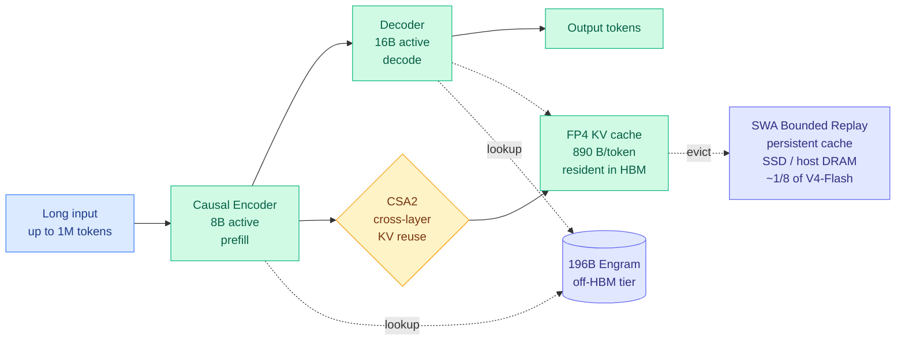
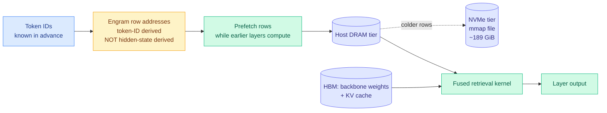
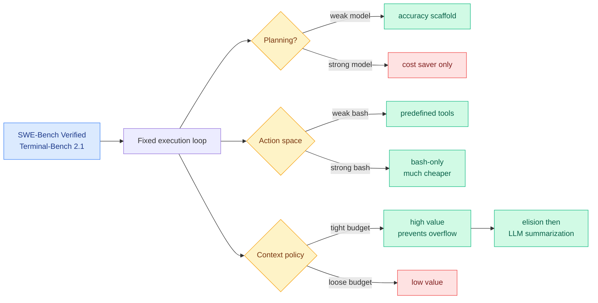
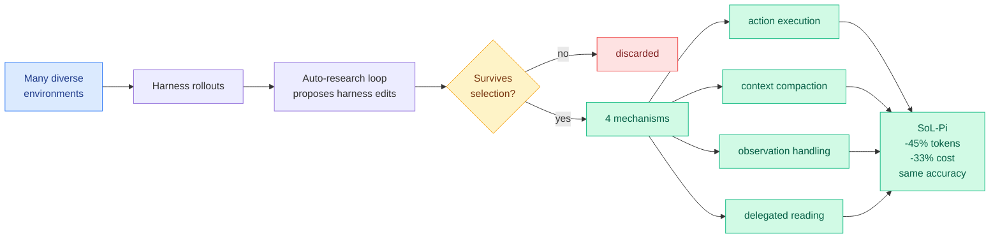
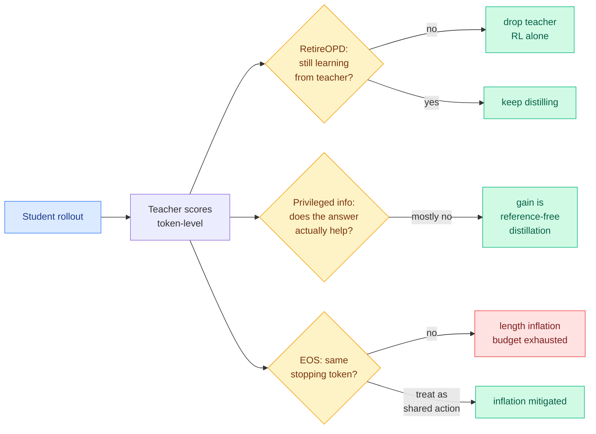
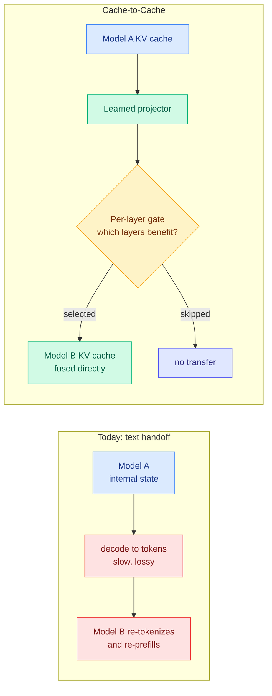
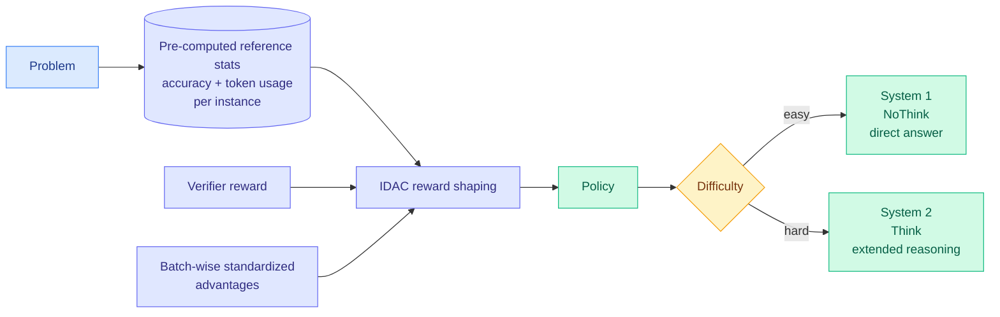
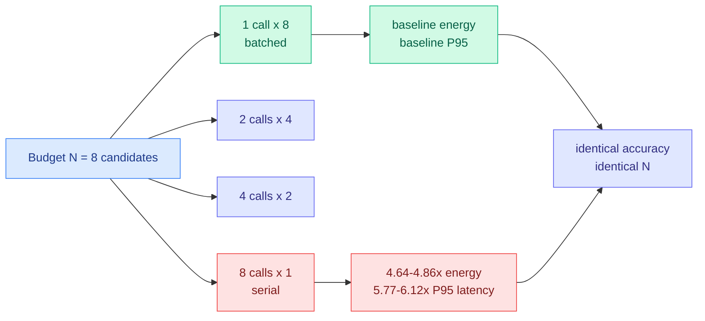
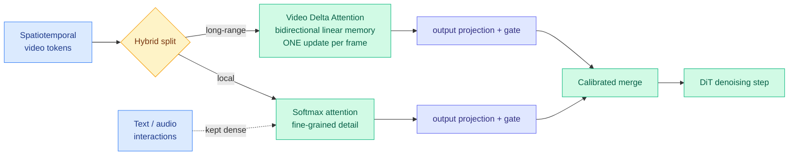

# cere-bro | 2026-09-18

> Today the price of a computation fell at five different layers at once: the cache byte, the harness token, the judgment call, the weight, and the message between two models. And the reason it had to is buried in one line of a newsletter about something else, where NVIDIA cut Rubin Ultra's HBM from 1024 GB to roughly 200 GB per chip.

🎯 Today's 5 for you

<ol>
<li>Read<strong>DeepSeek-V4.1-Flash, the actual paper.</strong> 890 bytes of KV cache per token, a quarter of the previous model, by compressing precision, tokens and layers at once. This is your core area and the wiki has been quoting that number second-hand for a week. <a href="https://arxiv.org/abs/2609.19969">arXiv 2609.19969</a></li>
<li>Read<strong>SemiAnalysis on Engram offloading, and the Rubin Ultra line inside it.</strong> Offloading a 189 GiB embedding table to DRAM beats keeping it in HBM even when you have the HBM, and NVIDIA just cut flagship HBM five-fold. Memory hierarchy and semiconductor supply in one piece, both squarely your areas. <a href="https://newsletter.semianalysis.com/p/engrams-embedding-entendre-codesign">SemiAnalysis</a></li>
<li>Skim<strong>Two harness papers, same day, agreeing.</strong> A 176-setting component ablation and an automated harness search both land on context management as the load-bearing piece, at a third off API cost. Loop and harness engineering is your most-saved theme by a wide margin. <a href="https://arxiv.org/abs/2609.20804">ablation</a> · <a href="https://arxiv.org/abs/2609.20519">SoL-Pi</a></li>
<li>Track<strong>Cache-to-Cache, the post you saved last night.</strong> Two models communicate by fusing KV caches instead of writing sentences, claiming 2.5x faster and better than text handoff. It is the first time this wiki has seen the KV cache treated as an asset rather than a cost. <a href="https://x.com/thesupermannx/status/2100636553576124595">the post</a></li>
<li>Skim<strong>Sample Count Is Not Enough.</strong> The same eight candidates cost 4.6 to 4.9 times the GPU energy depending on whether you batch them or run them serially. Cheapest actionable thing on this list, and it says a chunk of published efficiency comparisons are not comparable. <a href="https://arxiv.org/abs/2609.19499">arXiv 2609.19499</a></li>
</ol>

---

## TL;DR

- **DeepSeek-V4.1-Flash**: KV cache down to 890 bytes per token, a quarter of the last model. Better quality, not worse.
- **SemiAnalysis**: offloading DeepSeek's embedding table to DRAM beats keeping it in HBM. Also: Rubin Ultra loses 80% of its HBM.
- **Two harness papers agree**: context management is the component that matters, and automated search cuts agent API cost by a third.
- **Three distillation papers land together** and each demotes the teacher. One lets the student fire it outright.
- **When2Think**: allocate reasoning depth by measured difficulty. AIME24 accuracy up 10%, tokens down 28%.
- **Anthropic publishes RSI metrics**: Claude leads 26% of its own AI R&D, up from under 1% in February.

---

## Deep Dives

### DeepSeek-V4.1-Flash: Pushing the Limits of KV Cache Compression

> The cache is not one bill, it is three, and this is the first paper that pays down all three and says so.

**Source:** HuggingFace Daily Papers · **cross-source confirmed** (HuggingFace top + a same-day SemiAnalysis measurement study of this exact model)
**Links:** [Paper](https://arxiv.org/abs/2609.19969) · [Weights](https://huggingface.co/deepseek-ai/DeepSeek-V4.1-Flash) · [Wiki summary](../../inference-efficiency/2026-09-18-deepseek-v41-flash-kv-cache-compression.md)

**What is it about?**
DeepSeek published the formal paper behind the V4.1-Flash weights it shipped on 09-10. It is a 552B-backbone multimodal mixture-of-experts model (MoE, where each token routes through a small subset of specialized sub-networks) with a further 196B Engram parameters, a million tokens of context, and an unusual asymmetry: it activates 16B parameters when writing and only 8B when reading.

**What problem does it solve?**
Long-horizon agents make workloads input-heavy, because every tool call resubmits a long prompt. The KV cache (the stored attention keys and values that let a model avoid recomputing everything it has already read) then strains three separate resources: prefill compute, HBM capacity while serving, and SSD capacity plus transfer bandwidth for prefix caches held between turns. Until now, almost every compression paper improved one of those three and said nothing about the other two.

**What is the core novelty?**
Compressing the global cache along three orthogonal dimensions at once, and a new trick at the persistent tier. The three dimensions are values per entry (FP4, four bits), entries along the sequence (Compressed Sparse Attention 2 choosing which tokens to keep), and layers that hold an independent cache at all (CSA2's cross-layer reuse). Multiplying three independent reductions is how you reach a quarter of the footprint instead of the 20 or 30 percent one axis buys. The new trick is **SWA Bounded Replay**: sliding-window layers only ever look at a bounded local window, so their state is reconstructible by replaying a bounded amount of compute, which means you do not store it persistently at all. It is a deliberate compute-for-storage trade, made at the tier where storage and bandwidth bind rather than FLOPs.

**Key takeaways**
- Global KV cache, always resident in HBM: **890 bytes per token**, roughly a quarter of DeepSeek-V4-Flash.
- Persistent KV cache on SSD or host memory: roughly **one eighth** of the prior generation.
- Quality goes up, not down. The smaller cache is not paid for in benchmark points by the vendor's own measurement.
- A caller-set **reasoning-effort variable** makes inference cost a dial rather than a fixed property of the model.

**Gaps in the study**
No hallucination rate, two releases running, which matters because the [V4 paper back on 04-24](../../llms-foundation-models/2026-04-24-deepseek-v4-architecture.md) reported a 94% hallucination rate despite Engram's O(1) factual retrieval and asked whether Engram was retrieving correctly while the reasoning layers overrode it. V4.1-Flash now carries 196B Engram parameters and still reports nothing. More practically: no concurrency sweep. [SemiAnalysis measured on 09-14](../../hardware/2026-09-14-semianalysis-4hi-hbm-bandwidth-over-capacity.md) that KV offload absorbs a large capacity cut almost invisibly and then fails as a cliff past roughly 70 concurrent sessions, so a four-times-smaller cache moves that cliff without removing it, and nobody has said where V4.1-Flash's sits. FP4 is also a design choice rather than an ablation, so the 4x cannot be split between precision, sparsity and layer reuse.

**Industrial implication**
At 890 bytes per token, a million-token context is about 890 MB of resident state. That is the first point where million-token agent sessions are arithmetically plausible at scale on current parts rather than a demo. The more transferable thing is the three-bills framing: reporting all three, and admitting that a saving in one can be a cost in another, should become the default form for cache work, because most published numbers today are not comparable.

→ [Full summary](../../inference-efficiency/2026-09-18-deepseek-v41-flash-kv-cache-compression.md)

---

### SemiAnalysis: Engram offloading, and the model designed to be paged out

> Moving a 189 GiB table out of HBM makes the model faster even when you had the HBM to spare, because the freed memory buys batch size.

**Source:** SemiAnalysis (starred Gmail + RSS)
**Links:** [Post](https://newsletter.semianalysis.com/p/engrams-embedding-entendre-codesign) · [Wiki summary](../../hardware/2026-09-18-semianalysis-engram-dram-ssd-offloading.md)

**What is it about?**
SemiAnalysis replicated DeepSeek's Engram module, probed what it memorizes, ablated it, and benchmarked serving with the table offloaded off HBM. Engram is a learned lookup table: recurring multi-token patterns retrieve a vector directly instead of being reconstructed through attention and feed-forward layers.

**What problem does it solve?**
HBM is the scarce resource in inference, and this is the first rigorous measurement of whether moving a large chunk of a model's parameters off it actually works under real serving load. The [09-10 wiki page on V4.1-Flash](../../llms-foundation-models/2026-09-10-deepseek-v41-flash-architecture.md) named exactly this as its biggest gap: wall-clock serving numbers for the Engram host-memory path under concurrency, where a round trip to host memory either amortizes or does not. Eight days later, the answer.

**What is the core novelty?**
Naming the systems property that makes Engram offloadable at all: **its row addresses depend on token IDs, not on hidden states**. The runtime knows which rows it will need before computing anything, so it can prefetch them from host DRAM while earlier layers are still running. That is the criterion separating "offloadable by design" from "offloaded as a fallback," and it turns into a one-line architecture review question.

**Key takeaways**
- **Offloading beats residency even on high-capacity parts.** On most of the pareto, moving the table to DRAM outperforms keeping it in HBM, because the freed HBM buys larger batches and more concurrent sessions.
- **What Engram memorizes is not what you would pick**: names, code fragments, relational phrasing, licences, bibliography fragments, API scaffolding, website furniture. Learned memory optimizes the training objective, not a judgment about which facts deserve storage.
- **Gate scores do not identify cache-hot rows**, for a mechanical reason: computing the gate needs the retrieved key, so the read is already paid for. Skipping reads would need a usefulness predictor that runs *before* retrieval, which does not exist.
- **There is no clean "memory stores facts, experts reason" division.** Removing Engram raised CRUXEval answer loss from 0.2848 to 0.3093 bits per token, and forcing the ablated model to reuse the original expert routing made it *worse*, at 0.3375. The experts reroute to compensate.
- **NVIDIA despec'd Rubin Ultra from 1024 GB to roughly 200 GB of HBM per chip.** Stated in passing; it is the largest hardware fact of the day.

**Gaps in the study**
The Engram replication ran at roughly 6E18 FLOPs on fineweb-edu, small enough that the scaling reproduction is suggestive rather than settled. The serving numbers come from InferenceX, SemiAnalysis's own harness, widely reproduced but still one harness. And the experiment nobody has run: KV offload and Engram offload both target host DRAM, so they contend for the same bandwidth, and [the 09-14 study](../../hardware/2026-09-14-semianalysis-4hi-hbm-bandwidth-over-capacity.md) showed DRAM-tier offload fails as a cliff past roughly 70 concurrent sessions. Making both bets at once should move that cliff earlier, and nobody has measured it.

**Industrial implication**
Two things change. "Is this offloadable?" becomes a design review question with a crisp test: are the addresses derivable from input tokens or from hidden state? Token-derived means prefetchable means it can live on a cheaper tier for the rest of its life. And the Rubin Ultra cut turns architectural HBM reduction from a research nicety into a procurement input. If the next flagship carries a fifth of the memory the roadmap promised, models that need less resident state are not merely cheaper, they are the ones that fit.

→ [Full summary](../../hardware/2026-09-18-semianalysis-engram-dram-ssd-offloading.md)

---

### An Empirical Study of Harness Design for Coding Agents

> Three of the four findings are conditional on which model you are running, which means every hand-tuned harness in production is misconfigured for the model it now runs.

**Source:** HuggingFace Daily Papers (UMass Amherst, Emory, UNC Charlotte, Zoom)
**Links:** [Paper](https://arxiv.org/abs/2609.20804) · [Wiki summary](../../agentic-systems/2026-09-18-harness-design-component-ablation.md)

**What is it about?**
A coding harness is the software layer around the model: it runs the loop, exposes tools, manages conversation history, and structures the task. Every comparison until now has pitted whole harnesses against each other, so a difference between two systems could come from the planner, the tools, the context policy, or an interaction. This study fixes the loop and varies exactly three components.

**What problem does it solve?**
It makes harness findings attributable. 176 matched settings, four models, SWE-Bench Verified and Terminal-Bench 2.1, five context-management strategies, four context-window budgets.

**What is the core novelty?**
The trajectory-level analysis that gives each component a distinct causal signature. Context management extends trajectories without changing agent behaviour. Planning changes *where* trajectories stop. The action space changes *the granularity at which code gets written*. That is what makes the findings mechanistic rather than correlational.

**Key takeaways**
- **Context management's value rises as the budget tightens, and almost all of it is preventing context-overflow failures.** That reclassifies it from a quality technique to a reliability technique, with a different metric: overflow-failure rate, not accuracy delta.
- **Rule-based elision staged before LLM summarization wins, and recoverability is dead weight.** Making elided content recoverable "adds machinery that models rarely use and yields no accuracy gain."
- **Planning shifts role as models improve**: an accuracy scaffold for weaker models, a cost saver with little accuracy change for stronger ones.
- **Predefined tools are a crutch for weak bash proficiency.** Bash-capable models work fine on a bash-only interface at substantially lower cost.

**Gaps in the study**
Four models, two benchmarks, both software engineering, so nothing here says whether the conditional structure survives outside a bash-shaped action space. Five context strategies excludes retrieval and external-memory approaches, so "elision then summarization wins" is a win in a narrow field. No dollar figures, only relative claims, which makes the cheapest finding hard to act on. And by varying one component at a time against a fixed loop, the study cannot measure the interactions it set out to disentangle.

**Industrial implication**
Finding 4 is an argument against the layer most agent frameworks compete on: if your model is good at bash, every typed tool you wrapped around the shell is a tax you are paying for models you are not running. Finding 3 is the more important one long-term, because it says the harness does not become less relevant as models improve, its job migrates from compensating for capability to controlling cost. And the uncomfortable corollary of all four: three of these components change their optimal setting when you swap the model underneath, and nobody re-runs that tuning on upgrade.

→ [Full summary](../../agentic-systems/2026-09-18-harness-design-component-ablation.md)

---

### SoL-Pi: Recursively Scaling Auto-Research Loops for Efficient Agent Harness

> Halving token traffic does not only save money, it doubles how many self-improvement loops fit in the same budget.

**Source:** HuggingFace Daily Papers
**Links:** [Paper](https://arxiv.org/abs/2609.20519) · [Wiki summary](../../agentic-systems/2026-09-18-sol-pi-recursive-harness-research-loops.md)

**What is it about?**
Recursive self-improvement applied at the harness layer rather than the model layer. Instead of training a better agent, SoL-Pi runs automated research loops that propose and test harness changes across many deliberately diverse environments, keeping what survives selection.

**What problem does it solve?**
Automated harness tuning usually overfits: you get something excellent on the 20 tasks you searched over and mediocre everywhere else. The argument here is that **scaling the search across numerous and diverse environments is what converts local tuning into reusable improvement**, and the evidence is that the surviving mechanisms transfer beyond their development setting.

**What is the core novelty?**
Framing token efficiency as the enabler of recursion rather than the goal. As coding agents move to unattended around-the-clock exploration, their work becomes long trajectories of reasoning, tool use and feedback, so token efficiency gates how much self-improvement you can afford to run at all. That is a compounding argument, and it is more interesting than the saving itself.

**Key takeaways**
- Four mechanisms survived selection: **action execution, context compaction, observation handling, delegated reading**. Three of the four are context-budget mechanisms.
- On 51-task EdgeBench, matches the Pi harness across GPT-5.6 Sol and Opus 5 while cutting **recorded token traffic 44.7 to 49.0 percent and API cost about a third**.
- Estimated **$8.75 to $13.50 saved per hour** against native Codex and Claude Code harnesses, $4.36 to $5.71 against Pi.
- An open-ended automated search over harness design, with no prior pushing it there, converged on managing the context window.

**Gaps in the study**
One benchmark, 51 tasks. "Recorded token traffic" is not obviously billed tokens once cache-hit pricing applies, and the paper does not separate them. The dollar figures are estimates against list pricing, so they move with every provider price change. The auto-research loop's own compute cost is not netted against the savings, which matters given the paper's central argument is affordability of recursion. And no ablation splitting the 45 percent across the four mechanisms.

**Industrial implication**
Manual harness tuning, the craft that has dominated practitioner discussion for six months, now has a mechanical competitor with a published return. A third off API cost at matched accuracy, arrived at automatically, is the number to beat. The catch is that SoL-Pi's harness was discovered against Sol and Opus 5, and the ablation published the same day says three of four harness components change their optimal setting across models. **The durable asset is probably the search loop, not the harness it produced.**

→ [Full summary](../../agentic-systems/2026-09-18-sol-pi-recursive-harness-research-loops.md)

---

### Three on-policy distillation papers, and each one demotes the teacher

> One says the student should fire the teacher, one says the teacher's special knowledge was not what was helping, and one says the teacher has been corrupting a behaviour the student already had right.

**Source:** HuggingFace Daily Papers (three separate papers, same day)
**Links:** [RetireOPD](https://arxiv.org/abs/2609.20784) · [Privileged Information](https://arxiv.org/abs/2609.20612) · [EOS Tokens](https://arxiv.org/abs/2609.20511) · [Wiki summary](../../inference-efficiency/2026-09-18-on-policy-distillation-triple.md)

**What is it about?**
On-policy distillation is the technique where a student model generates its own responses and a teacher scores them token by token, so the student gets dense feedback on its own trajectory rather than on the teacher's. It is the main way people convert a sparse reward into usable training signal for agents.

**What problem does it solve?**
Each paper takes a different piece. **RetireOPD** attacks the schedule, on the finding that the benefit of teacher supervision is stage-dependent and that privileged information alone does not always make a teacher reliable. **What Does Privileged Information Add** attacks the premise that giving the teacher the answer is where the gain comes from. **When EOS Tokens Disagree** attacks the plumbing.

**What is the core novelty?**
RetireOPD's **Adaptive Retirement**: the student drops the teacher on its own once their discrepancy stops shrinking *and* it reaches a target fraction of the teacher's success rate, then continues with reinforcement learning alone. No predefined distillation schedule. The privileged-information paper's novelty is **AMPLE-Math**, 5,319 problems with six reasoning views sharing one answer, which lets you isolate what a reference adds beyond distillation itself. The EOS paper's novelty is the diagnosis: students and teachers place stopping probability on **different end-of-sequence tokens even when their declared stopping sets are identical**, so the loss suppresses the student's preferred way to stop without reliably transferring the teacher's.

**Key takeaways**
- **RetireOPD** improves ALFWorld success 14.1 to 18.8 percent and WebShop accuracy 11.8 to 19.0 percent over the RL baseline across Qwen2.5 1.5B to 7B, and **surpasses its own teacher in every setting**.
- **Reference-free distillation accounts for most of the gain.** Additional benefit from a privileged reference is modest, worth about two percentage points in SmolLM3-3B at step 50.
- **The benefit belongs to the student, not the method**: at a fixed checkpoint, swapping short direct-response rollouts for long thinking rollouts turns gains into losses in both model families with everything else held constant.
- **Aligning the decoding stopping set is not enough.** Treating functionally equivalent EOS tokens as one shared semantic stopping action substantially mitigates length inflation across Qwen3, Llama and Gemma.

**Gaps in the study**
RetireOPD tops out at 7B, and Adaptive Retirement has two thresholds whose sensitivity is unreported, which is exactly where a self-terminating schedule fails quietly. The privileged-information study is math-only across two small families, and its most interesting claim, that on-policy distillation improves *access* to capability the model already has rather than adding capability, is an interpretation of ablations rather than a direct measurement. The EOS paper admits a distinct late-training inflation persists after alignment and is unexplained. And none of the three reports compute cost, which is odd for a family whose main selling point over reinforcement learning is sample efficiency.

**Industrial implication**
Do the EOS canonicalization first, because it is nearly free and it is a correctness fix rather than a tuning choice. Anyone who added a length penalty to stop distilled students from rambling should check whether they paid a reward-shaping cost to paper over a token-identity bug. Then ask whether your privileged reference is earning its complexity, and replace fixed distillation schedules with a retirement rule. The through-line is a cost argument: **most of what teams currently spend on teacher infrastructure is buying less than they think.**

→ [Full summary](../../inference-efficiency/2026-09-18-on-policy-distillation-triple.md)

---

### Cache-to-Cache: two models talk by fusing KV caches instead of writing sentences

> Every other result this wiki has recorded treats the KV cache as a cost. This is the first one that treats it as something worth sending.

**Source:** X home feed and the reader's saved bookmark (Tsinghua and Infinigence, reported as ICLR 2026, code open-sourced)
**Links:** [Saved post](https://x.com/thesupermannx/status/2100636553576124595) · [Feed thread](https://x.com/AYi_AInotes/status/2100925284539076924) · [Wiki summary](../../inference-efficiency/2026-09-18-c2c-cache-to-cache-communication.md)

> **Evidence caveat, stated up front:** this is reconstructed from two social posts rather than the paper. The mechanism is coherent and the venue claim specific, but every number below is second-hand.

**What is it about?**
When two LLM agents cooperate, the first decodes its internal state into English and the second re-tokenizes and re-prefills that English. C2C deletes the round trip: a learned projector maps the source model's KV cache directly into the target model's, with a learnable gate selecting which layers actually benefit from the transfer.

**What problem does it solve?**
Text handoff between co-located models pays three taxes. Sequential decoding of the message, which is memory-bandwidth-bound and therefore the slowest thing a model does. Re-prefilling on the receiving side, which is compute-bound. And semantic loss, because a high-dimensional internal state is being squeezed through a vocabulary designed for humans.

**What is the core novelty?**
The per-layer gate, which is the part that suggests the authors understood the hard problem. A naive transfer would dump every layer's state across, which cannot work because the two models' layers are not in correspondence and early layers encode model-specific surface form. Learning which layers benefit converts the method from "share the cache" into "share the parts of the cache that transfer."

**Key takeaways**
- Accuracy reported up to **14.2 percent above the individual models**, and over **5 percent above text-based agent communication**.
- A **2.5x overall speedup**, from never generating the intermediate message at all.
- The gate is effectively a measurement of how much structure two independently trained models' caches share, which is a question nobody has asked.

**Gaps in the study**
No paper read and no arXiv ID captured, so treat the numbers as unverified. The claimed 14.2 percent has no named benchmark attached in either post. The decisive unknown is whether the projector must be trained per source-target model pair, which would make this a research result rather than an infrastructure primitive. Nothing captured on different tokenizers, different hidden dimensions, or projector training cost.

**Industrial implication**
If the projector generalizes, co-located multi-agent systems stop paying for language, and the win concentrates in exactly the workload growing fastest: long agent pipelines with many internal handoffs, where today every hop is a full decode plus a full prefill. But there is a property being removed that is not in anyone's cost accounting. **Text handoff is currently the only auditable point in a multi-agent system.** C2C replaces it with a tensor, and the framing in both posts treats "bypassing human language" as the feature. Track this one for what it does to oversight, not only for what it does to latency.

→ [Full summary](../../inference-efficiency/2026-09-18-c2c-cache-to-cache-communication.md)

---

### When2Think: Learning Difficulty-Aware Length Control

> Accuracy up ten points and tokens down twenty-eight percent at the same time, which says the efficiency tax everyone has been paying was avoidable.

**Source:** HuggingFace Daily Papers
**Links:** [Paper](https://arxiv.org/abs/2609.19671) · [Wiki summary](../../inference-efficiency/2026-09-18-when2think-difficulty-aware-length-control.md)

**What is it about?**
Reasoning models overthink easy problems and underthink hard ones. When2Think is a post-training framework that teaches a hybrid model when to answer directly and when to reason at length.

**What problem does it solve?**
The efficiency tax. Uniform length penalties and rigid routers both buy reduced computation on easy instances with accuracy loss on hard ones, so every prior result sits on a trade-off curve.

**What is the core novelty?**
**Instance-level Difficulty-Aware Control**, which shapes the reward using pre-computed reference statistics measured offline: how often the base model gets each training instance right and how many tokens it spends. That is the important design decision. Every other allocation method on this wiki depends on a signal the model estimates at inference time, usually its own confidence, and a model can be confidently wrong. Offline per-instance accuracy is not an estimate of difficulty, it is a sample of it.

**Key takeaways**
- On **AIME24, Pass@3 rises 10.0 percent while token usage falls 27.9 percent** against the base model. Both axes improving is a move inside the frontier, not along it.
- On AIME25 it reaches 40.0 percent Pass@3, beating both compression and routing-only baselines.
- **Critic-free optimization with no learned reward model and no online reference-model queries.** Each omission removes a cost competing approaches pay.
- The model learns when to use System 1 versus System 2 itself rather than being told by an external router.

**Gaps in the study**
Math only, and AIME specifically, where difficulty is unusually well-behaved and verifiers are exact. Whether pre-computed difficulty statistics transfer to open-ended domains with no verifier is the whole deployment question and is untouched. The cost of computing those statistics, which requires repeatedly sampling the base model per training instance, is not netted against the reported saving. Pass@3 is a generous metric for an efficiency claim and the token reduction should also be shown at Pass@1.

**Industrial implication**
The deployable idea is not the training recipe, it is the observation that difficulty is cheaply measurable offline and does not have to be inferred online. Any team with logs of which queries their model gets right and how many tokens it spent already has the raw material, and that is a far more solid routing signal than a confidence score. The near-term product form is a per-query reasoning-effort default derived from historical difficulty on similar queries, which is one step from the caller-set reasoning-effort dial [DeepSeek shipped](../../inference-efficiency/2026-09-18-deepseek-v41-flash-kv-cache-compression.md) the same day. The model now exposes the dial; this paper says the dial can be set from data.

→ [Full summary](../../inference-efficiency/2026-09-18-when2think-difficulty-aware-length-control.md)

---

### Sample Count Is Not Enough: the same N costs five times as much depending on how you run it

> Two papers can report the same inference budget and differ in energy by more than most methods differ in accuracy.

**Source:** HuggingFace Daily Papers
**Links:** [Paper](https://arxiv.org/abs/2609.19499) · [Wiki summary](../../hardware/2026-09-18-sample-count-generation-schedule-energy.md)

**What is it about?**
Test-time scaling means generating several candidate answers and combining them. Papers describe that budget as N, the candidate count. This one points out that N says how many candidates were produced, not how they were executed, and then measures what the omission costs.

**What problem does it solve?**
It makes a large hidden systems cost visible inside research evaluation, where everyone has been treating N as if it fully specified the compute.

**What is the core novelty?**
The experiment is deliberately boring and that is why it is persuasive. Hold N at 8, change only the schedule (one call of eight candidates, two of four, four of two, eight of one), and measure latency, throughput, GPU-hours and gross GPU-device energy.

**Key takeaways**
- **Eight serial calls consume 4.64 to 4.86 times the gross GPU energy and carry 5.77 to 6.12 times the P95 latency of one batched call of eight** on A100s. Same accuracy, same N.
- Replicated across **three independently scheduled A100 nodes per model**, and again in short-output SciQ experiments on V100s. Not one noisy machine, not a quirk of long generations.
- The baseline result holds too: going from N=1 to N=8 improves accuracy 8.4 points for Phi-3-mini and 18.4 points for Qwen2.5-1.5B on 500 GSM8K prompts.
- The rule, with its two load-bearing conditions: **when candidates are independent and memory allows, fewer calls with larger batches are more efficient.**

**Gaps in the study**
Small models only, where fixed per-call overhead is a larger share of total work than on a frontier MoE, so the 5x should shrink at scale and the paper does not estimate by how much. Gross board-level draw includes idle, which flatters the batched case. A100 and V100 only, nothing on H100 or B200 where batching and memory headroom differ. And in production the serving stack batches across users, so a single request's schedule is not really the operator's choice.

**Industrial implication**
For evaluation, report the generation schedule alongside N. A leaderboard entry claiming a win at N=16 is not comparable to another at N=16 run differently, and today nobody says which. That is a cheap fix to a real measurement problem and it should become a reviewer request. For practice, the place this bites hardest is offline evaluation and batch scoring jobs, where one team's loop genuinely does choose the schedule and those jobs run continuously.

→ [Full summary](../../hardware/2026-09-18-sample-count-generation-schedule-energy.md)

---

### Video DeltaNet: linear attention survives contact with video by not doing all the work

> The hardest modality for approximate attention just got a 14.5x speedup, and the reusable part is that it retrofits onto a pretrained model.

**Source:** HuggingFace Daily Papers
**Links:** [Paper](https://arxiv.org/abs/2609.20744) · [Wiki summary](../../llms-foundation-models/2026-09-18-video-deltanet-hybrid-attention.md)

**What is it about?**
Video diffusion models re-process very long sequences of space-and-time tokens at every denoising step, which makes attention the dominant cost. Linear attention, which replaces the quadratic all-pairs comparison with a running memory state, is the obvious fix but destroys the fine detail video quality depends on.

**What problem does it solve?**
It refuses the choice. Local Softmax attention keeps the fine-grained interactions, a bidirectional linear memory carries long-range context, and learnable gates with separate output projections calibrate the two branches.

**What is the core novelty?**
Two decisions. **Video Delta Attention updates its memory once per frame**, absorbing all of that frame's spatial tokens jointly, rather than once per token. A frame is the natural unit of temporal structure, and token-level updating both wastes updates and imposes a false ordering on tokens that are spatially simultaneous. And the hybrid is applied **only to video-to-video interactions**, keeping Softmax for anything involving text or audio, which is a deliberate admission that approximation is safe where signal is dense and redundant and unsafe where it is sparse and load-bearing.

**Key takeaways**
- On MiniMax H3 with eight-step distillation and an optimized SGLang serving stack: **a 14.3-second 768p video denoised in 6.70 seconds on eight NVIDIA B200 GPUs**, a **14.5x speedup** over the 50-step dense baseline on the same GPU count.
- That is faster than real time, which is the threshold separating a rendering product from an interactive one.
- A **staged teacher-alignment recipe** introduces the new pathway progressively into a pretrained model, so this is a retrofit rather than a new pretrain.

**Gaps in the study**
The 14.5x compares a 50-step dense baseline against eight-step distillation plus hybrid attention, so step-count reduction and attention change are bundled into one headline number and the abstract does not separate them. That is the ablation that matters, because distilling 50 steps to 8 works on dense models too. No quality metrics beyond an implicit preservation claim, and subtle degradation is exactly the failure mode of linear approximation in video. B200 only.

**Industrial implication**
The transferable asset is the retrofit recipe, not the video result. An exact local path plus a cheap global path, learned gates, staged teacher alignment onto an existing pretrained model, now demonstrated in the modality where approximate attention is hardest to get away with. And it belongs to a pattern worth naming: three systems in nine days whose core mechanism is a learned per-unit decision about how much computation this particular unit deserves, alongside DeepSeek's per-layer CSA2 mode choice and C2C's per-layer transfer gate.

→ [Full summary](../../llms-foundation-models/2026-09-18-video-deltanet-hybrid-attention.md)

---

## Industry Pulse

- **Anthropic published three internal AI-development metrics**: how much of its AI R&D is done by AI, how well agents are overseen, and how compute is allocated ([Anthropic](https://x.com/AnthropicAI/status/2100684274114699295)).
- **Claude "leads" 26% of Anthropic's own AI R&D**, up from under 1% in February, with over 90% at or above "AI collaborates" ([The Decoder](https://the-decoder.com/anthropic-wants-you-to-know-claude-leads-a-quarter-of-its-research-but-lead-doesnt-mean-what-you-think/)).
- **Roughly 30,000 agents run research and engineering inside Anthropic at any one time**, with over a billion agent decisions reviewed in August ([The Decoder](https://the-decoder.com/anthropic-wants-you-to-know-claude-leads-a-quarter-of-its-research-but-lead-doesnt-mean-what-you-think/)).
- **The Decoder's caveat is the story**: the scoring comes from Claude itself and "lead" means less than it sounds, so treat 26% as a self-reported metric ([The Decoder](https://the-decoder.com/anthropic-wants-you-to-know-claude-leads-a-quarter-of-its-research-but-lead-doesnt-mean-what-you-think/)).
- **OpenAI launched Astra for Law**, GPT-6 Astra pointed at 230 million URLs of US case law, scoring 54% fully correct on its own 200-question test ([The Decoder](https://the-decoder.com/openai-takes-aim-at-the-legal-market-with-astra-for-law/)).
- **Hacktron AI used Claude to hack OpenAI**, chaining an image-decoder heap overflow to remote code execution to an SSO flaw, reaching employee ChatGPT and Codex accounts and OpenAI's internal monorepo ([The Information](https://www.theinformation.com/briefings/bug-hunters-used-claude-hack-openai), [Hacktron](https://x.com/HacktronAI/status/2100795824812777893)).
- **Internal emails undercut the fair-use defence**: a Microsoft director called the practice the "largest theft of labor in human history," and OpenAI's head of ChatGPT wrote that the products "are largely substitutive, period" ([The Decoder](https://the-decoder.com/ai-training-built-on-fair-use-looks-shaky-when-the-companies-own-people-call-it-astonishing-theft/)).
- **42 Fellows of the Royal Society**, including Fields medallists Martin Hairer and Peter Scholze, signed an open letter calling AI existential risk real and urgent ([The Decoder](https://the-decoder.com/42-leading-mathematicians-warn-that-ai-existential-risk-is-real-and-urgent/)).
- **Amodei and Altman both promised to embed outside evaluators inside their companies**, and critics immediately questioned those watchdogs' independence ([The Information](https://www.theinformation.com/articles/ai-safety-push-sparks-demand-watchdog-groups-critics-doubt-independence)).
- **Ro Khanna wrote to Alibaba, DeepSeek and Moonshot** asking Chinese labs to join a binding international agreement to pace frontier development ([The Information](https://www.theinformation.com/briefings/u-s-lawmaker-ro-khanna-urges-chinese-labs-help-pace-frontier-ai)).
- **US and China experts jointly pushed for shared rules banning AI from autonomous nuclear decisions** ([The Decoder](https://the-decoder.com/us-and-china-experts-push-for-shared-rules-banning-ai-control-over-nuclear-weapons/)).
- **Google DeepMind warns visible chains of thought are a safety advantage that is slipping away** as models move reasoning out of readable text ([The Decoder](https://the-decoder.com/visible-chains-of-thought-are-a-safety-advantage-for-ai-but-that-transparency-is-slipping-away/)).
- **Uno claims a lossless decode speedup with no draft model**, shipping as an Apache-2.0 LoRA adapter over an existing 7B base ([paper](https://arxiv.org/abs/2609.04010), [weights](https://huggingface.co/IFM/K2-Horizon-7B-Uno)).
- **PrismML released Bonsai 2 27B**, a ternary-weight compression of Qwen3.8 27B at 5.95 GB against roughly 54 GB, claiming 98.2% of FP16 benchmarks and 55 tokens per second on an M5 Max ([@evaninwords](https://x.com/evaninwords/status/2100694716459188659)).
- **The Semiconductor Newsletter's 2027-2033 materials roadmap** puts the 2025 materials market at a record $73.2 billion, with packaging materials growing 9.3% against 5.4% for wafer-fab materials, a split driven by AI accelerators and HBM ([Semiconductor Newsletter](https://thesemiconductornewsletter.substack.com/p/semiconductor-materials-roadmap-2027)).
- **Ken Huang's Chapter 7 on serving mega-MoE at scale** covers auxiliary-loss-free bias routing, 4D parallelism, DeepSeek's DualPipe bidirectional overlap and 100k-GPU non-blocking Clos fabrics ([Agentic AI](https://kenhuangus.substack.com/p/chapter-7-serving-mega-moe-at-scale)).
- **Gary Marcus argued liability and regulation are not substitutes**, pushing back on the technolibertarian framing that holding AI companies liable makes regulation unnecessary ([Marcus on AI](https://garymarcus.substack.com/p/liability-regulation-and-ais-new)).
- **A single resignation tweet has been viewed over 170 million times** and pulled AI risk into TMZ, Joe Rogan and Instagram, though the House just began a seven-week recess ([Understanding AI](https://www.understandingai.org/p/how-a-single-tweet-transformed-the)).

**Funding, valuations, and compute deals**

- **CoreWeave priced $3.7 billion in convertible bonds**, more than it had targeted, due 2033 at a 2.875% coupon, at the top of the marketed range ([The Information](https://www.theinformation.com/briefings/coreweave-prices-3-7-billion-convertible-bond-offering)).
- **OpenAI is in early talks for a private round at $1.2 trillion or more**, after Altman said an IPO would not happen this year ([The Information](https://www.theinformation.com/articles/openais-next-round)).
- **Naive AI, a stealth startup founded in February by a Tsinghua professor, hit a $1.4 billion valuation** on $400 million raised across three rounds, with Tencent among the investors, and plans an open-weight first model this month ([The Information](https://www.theinformation.com/articles/tsinghua-professors-stealth-llm-startup-hits-1-4-billion-valuation)).
- **Sakana AI launched its Frontier Intelligence Group**, a research arm explicitly betting that the Transformer is not the end state ([Sakana AI](https://x.com/SakanaAILabs/status/2100780326737858715)).
- **The US House backed a data-centre grid bill 417 to 3**, and Z.ai reported 3x throughput on Chinese chips ([AI Weekly Espresso](https://aiweekly.co)).

---

## Global View

**The day's research and the day's hardware news are the same story told from two ends, and the causal arrow runs from the memory to the model.** [DeepSeek-V4.1-Flash](../../inference-efficiency/2026-09-18-deepseek-v41-flash-kv-cache-compression.md) compresses its KV cache to 890 bytes per token by attacking precision, token count and layer count simultaneously, and [SemiAnalysis](../../hardware/2026-09-18-semianalysis-engram-dram-ssd-offloading.md) shows the same model's 189 GiB embedding table runs *better* on host DRAM than in HBM because the freed memory buys batch size. Buried in that same piece is the reason both exist: **NVIDIA cut Rubin Ultra from 1024 GB to roughly 200 GB of HBM per chip**, which means the memory budget every architecture on this wiki is arguing about just shrank five-fold on the flagship roadmap. This is research and industry moving in lockstep rather than one leading, and it resolves an eight-day-old open question in the wiki's favour, since [the 09-10 page](../../llms-foundation-models/2026-09-10-deepseek-v41-flash-architecture.md) asked precisely for wall-clock serving numbers on the host-memory path under concurrency and got them.

**Three unrelated groups shipped the same mechanism in nine days, and the pattern is that the unit of routing has moved inside the model.** DeepSeek's CSA2 gives each layer a three-way choice between recomputing its cache and index, reusing the cache while re-picking tokens, or reusing both. [C2C](../../inference-efficiency/2026-09-18-c2c-cache-to-cache-communication.md) learns a per-layer gate deciding which layers benefit when one model's cache is projected into another's. [Video DeltaNet](../../llms-foundation-models/2026-09-18-video-deltanet-hybrid-attention.md) learns gates calibrating a cheap linear branch against an exact Softmax one, and applies the hybrid only to video-to-video interactions while keeping text and audio dense. **Three papers, three labs, one idea: a learned per-unit decision about how much computation this particular unit deserves.** That is the [routing page](../../ai-routing/llm-routing.md)'s subject matter at a granularity it has never catalogued, and the industry version arrived the same week. Practitioners spent the day wiring a decision-only model into model routing, tool pruning, cache admission and cache TTL prediction, which means the market is buying per-decision routing while the research is building per-layer routing, and neither has noticed it is the same bet.

**The wiki's most-saved theme got its first real ablation, and the finding is that the harness thesis was right but under-specified.** [The 176-setting component study](../../agentic-systems/2026-09-18-harness-design-component-ablation.md) and [SoL-Pi's automated search](../../agentic-systems/2026-09-18-sol-pi-recursive-harness-research-loops.md) independently converged on context management as the load-bearing component, one by hand and one by search, with SoL-Pi cutting agent API cost about a third. But the ablation's third finding is the one that reframes it: **planning is an accuracy scaffold for weak models and a pure cost saver for strong ones, so the harness does not become less important as models improve, its job migrates from capability compensation to cost control.** Anthropic's disclosure the same day that Claude now leads 26% of its own R&D with roughly 30,000 agents running at once is the industrial form of exactly that migration, since at that volume harness efficiency is not a research topic but a line item. The gap nobody is closing: three of four harness components change their optimal setting when the model changes, SoL-Pi's harness was discovered against Sol and Opus 5, and **nobody re-tunes their harness on model upgrade**, which means most production harnesses are currently misconfigured for the model they run.

---

## Looking Ahead

- **The KV-offload and Engram-offload cliff will be measured, and it will arrive earlier than either paper implies.** Both bets target host DRAM inside the same model, and [the 09-14 analysis](../../hardware/2026-09-14-semianalysis-4hi-hbm-bandwidth-over-capacity.md) already showed DRAM-tier KV offload fails as a cliff past roughly 70 concurrent sessions rather than degrading smoothly. **Signal, 60 days:** any published V4.1-Flash concurrency sweep showing throughput collapse below 70 concurrent sessions when both offloads are active. If it lands above 70, the two mechanisms are not contending and the compression story is cleaner than expected.
- **The Rubin Ultra HBM cut will show up as architecture announcements, not just procurement complaints.** A five-fold reduction in flagship HBM makes off-HBM parameter placement mandatory rather than clever. **Signal, 90 days:** at least two more frontier or near-frontier labs shipping a model that deliberately places a large parameter fraction off HBM, following LongCat 2 and Qwen-3.8-Flash-Next. Three or more and the Engram-style design has become the default response to the memory constraint.
- **Someone will run the Gavel-versus-Jev head-to-head, and the decision-only model will lose on skill selection while winning on cost.** [The routing page](../../ai-routing/llm-routing.md) has carried this as its most decision-relevant missing experiment since 09-16: Gavel reads the routing signal out of a frozen model's mid-layer hidden states for free, Jev buys it from a separate model that never generates text. **Signal, 60 days:** one skill-selection benchmark run both ways reporting accuracy, latency and dollars together. [C2C's](../../inference-efficiency/2026-09-18-c2c-cache-to-cache-communication.md) evidence that model-internal state is rich enough to be worth transmitting between models is a point for Gavel's side that did not exist two days ago.
- **The EOS canonicalization fix will be adopted faster than any other result today, because it is free.** [When EOS Tokens Disagree](https://arxiv.org/abs/2609.20511) released an implementation, and the fix is a correctness change rather than a tuning choice. **Signal, 30 days:** termination-set canonicalization appearing in a mainstream distillation library (TRL, Axolotl, or an equivalent). If it does not, the field's length-inflation problem is bigger than token identity and the paper's own admission of an unexplained late-training inflation is the more important half.
- **A harness discovered by automated search will be shown not to survive a model upgrade.** SoL-Pi searched against GPT-5.6 Sol and Opus 5; [the same-day ablation](../../agentic-systems/2026-09-18-harness-design-component-ablation.md) found three of four harness components change their optimal setting across models. **Signal, 90 days:** any replication running a discovered harness against a newer model generation and reporting the transfer gap. A gap under five percent makes the harness the asset; a larger gap makes the search loop the asset and turns harness tuning into a recurring cost centre.

**Note on today's sources:** Kurate's weekly leaderboards ran with the tournament unscored (every entry at the 1200 baseline with a 0% win rate), so no HuggingFace-versus-Kurate cross-confirmation was possible this week and no rising authors crossed threshold. All eight Reddit subreddits returned nothing past their filters, and the public X scrape captured no tweets, so the social signal in this digest comes from the ranked home feed and the reader's saved bookmarks.
