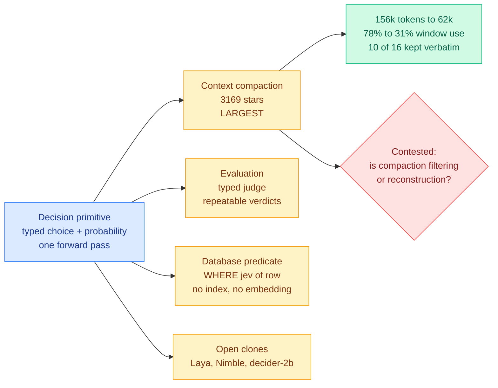
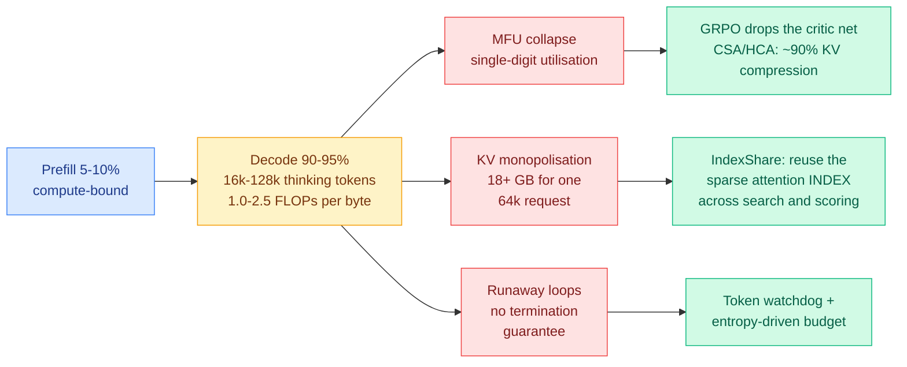
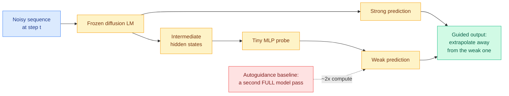
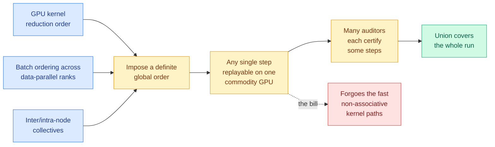

# cere-bro | 2026-09-20

> Yesterday this wiki watched a closed decision model get cloned six times in three days and called the moat gone. Today the census came in at 160 projects, and the surprise is not the cloning. It is what everyone built: the single largest project is not a classifier and not a router, it is a context compactor, and the second is an evaluator. The day's cost-optimization story is that a primitive sold as "make your cheap decisions cheaper" turned out to be worth more as "stop paying to carry your own history." Underneath it, a quieter thread ran the opposite way: three results in five days now argue the signal you are paying a second model to compute is already sitting in the first model's hidden states, free.

🎯 Today's 5 for you

<ol>
<li>Read<strong>160 projects in 72 hours, and the biggest one compresses context.</strong> Straight into your KV cache and routing pages at once: a Claude Code session going 156,000 tokens to 62,000 by scoring each tool call and deleting what is stale, keeping the rest byte-identical. Also the strongest argument yet that the useful decision surface is the agent's own history, not the model pool. <a href="https://x.com/yibie/status/2101095525793616162">The census</a> · <a href="../../ai-routing/2026-09-20-jev-ecosystem-census-72h.md">Wiki</a></li>
<li>Read<strong>Reasoning models spend 90-95% of cluster cycles in decode, and one 64k request wants 18 GB.</strong> This is the demand half of the squeeze you only had the supply half of. Rubin Ultra was cut to roughly 200 GB of HBM, so that is about eleven concurrent reasoning sessions before memory is gone, weights not counted. Decode runs at 1.0-2.5 FLOPs per byte, which means your cost model should be in bytes, not FLOPs. <a href="https://kenhuangus.substack.com/p/chapter-8-test-time-compute-and-reasoning">Chapter 8</a> · <a href="../../inference-efficiency/2026-09-20-test-time-compute-decode-inversion.md">Wiki</a></li>
<li>Skim<strong>Apple trains a tiny MLP on a frozen model's hidden states and deletes a whole forward pass.</strong> This is the third result in five days on the same move, after Gavel's mid-layer routing readout and C2C's cache transfer. Three is your threshold, so the pattern is now on the record, and it points exactly opposite to the day's dominant 160-project bet on external decision models. <a href="https://arxiv.org/abs/2609.19356">Paper</a> · <a href="../../llms-foundation-models/2026-09-20-probe-guidance-flow-lms.md">Wiki</a></li>
<li>Track<strong>The highest-rated paper on either Kurate board this week is about deterministic all-reduce ordering, and HuggingFace never saw it.</strong> To make a training run bitwise-replayable, it pins GPU kernel reduction order, data-parallel batch ordering and collective topology, which are the three things you unpin to go fast. A compute-for-verifiability trade with the cost unstated. <a href="http://arxiv.org/abs/2609.17380">Paper</a> · <a href="../../hardware/2026-09-20-open-1b-auditable-training.md">Wiki</a></li>
<li>Skim<strong>Your most-saved theme got its cleanest mechanism list, and an accidental answer to this week's compaction fight.</strong> SoL-Pi's four auto-evolved harness mechanisms resurfaced with the numbers spelled out, 49% fewer tokens at 94% of task score, and one of them repacks observations in flight instead of deleting or summarising. A separate evidence-gated harness reports verified completion going 56.4% to 95.0% over 3,360 runs. <a href="../../agentic-systems/agent-harness-engineering.md">Wiki</a></li>
</ol>

---

## TL;DR

- **The decision-model census hit 160 projects**: the largest is context compaction, not classification. Claude Code sessions cut 156k tokens to 62k.
- **Nimble**: an open 9B decision model trained in one day on 2,676 examples. Scores 90.1% against the closed product's 93.2%.
- **Reasoning serving inverted**: 90-95% of GPU cycles now go to decode. The memory bus is the machine, not the FLOPs.
- **Probe Guidance**: train a tiny MLP on a frozen model's own activations instead of running a second model. Guidance at no extra pass.
- **OPEN-1B**: pin kernel reduction order and collective topology, and a distributed training run becomes bitwise replayable on one GPU.
- **Open weights took 78.4% of gateway token volume**, closed models kept 36.9% of the spending. The two businesses have separated.

---

## Deep Dives

### The decision primitive found its use, and it was not the one anybody predicted

> The community census counts 160 projects at the 72-hour mark. The largest by stars is not a router. It deletes your agent's history.

**Source:** X home feed (dominant cluster of the day) · GitHub
**Links:** [Census thread](https://x.com/yibie/status/2101095525793616162) · [awesome-jev](http://github.com/yibie/awesome-jev) · [Wiki summary](../../ai-routing/2026-09-20-jev-ecosystem-census-72h.md)

**What is it about?**
Jev is TypeSafe AI's closed model, released 15 September, that makes a decision without writing anything. You hand it some application state plus a fixed list of options, and it returns which option and with what confidence, in a single forward pass, with no sentence and no JSON to parse. A community-maintained project list has gone from 46 entries to 160 in three days, and somebody sat down and categorised all of them. That census, rather than any one project, is today's result.

**What problem does it solve?**
Until now this wiki has been tracking the supply side of the story: how many people cloned it, how fast, and how cheap the clones are. What nobody had was demand-side information. A count of clones tells you the moat is gone. A categorised census tells you what the thing is actually for, and that is the more decision-relevant question if you are deciding whether to build with it.

**What is the core novelty?**
The answer, and it is genuinely surprising. The largest project by stars is `fast-jev-compaction` at 3,169 stars, and it is a context compactor. Rather than asking a large model to rewrite an agent's conversation history into a summary, it asks the decision model, per tool call and per result, "is this still needed?" and deletes what scores low, leaving everything else byte-identical. Reported on a Claude Code session: 156,000 tokens down to 62,000, window utilisation from 78% to 31%, with 10 of 16 entries retained word for word. Codex and Pi ports already exist. The second-largest category is evaluation, where LangChain's argument is that a typed judge beats an LLM judge on repeatability because it cannot phrase the same verdict two different ways.

**Key takeaways**
- Platform repositories are wiring it in as a provider rather than demoing it: `vercel-labs/json-render` (16,439 stars) uses it to pick components on the generative-UI path, `vercel-labs/fx` ships a permission reviewer, Cline's official plugin set carries a browser variant.
- A category with no literature at all appeared: PostgreSQL and DuckDB extensions expose it as a row predicate, so `WHERE jev(people, 'could work from home')` runs with no index and no embedding, at roughly ten seconds per thousand DuckDB rows.
- The unit economics being posted read like invoices, not benchmarks: 384 news items triaged for 15 brands at $0.19, against Opus 5 managing four items for $0.77 in the same window.
- The census author is explicit that many of the 160 are zero-star repositories written in a day with unsourced README numbers, and he imposed a three-entries-per-author-per-week cap plus treating shared release dates as a risk signal.

**Gaps in the study**
This is a community census, not a study. The count is the least reliable number in it and the author says so. More importantly, the compaction result is contested at the mechanism level: @theo's objection, the most-liked post in the thread at 2,276 likes, is that compaction is reconstruction rather than filtering, and that treating it as a constant filter misunderstands context management. The [09-18 harness component ablation](../../agentic-systems/2026-09-18-harness-design-component-ablation.md), which found context management's value comes almost entirely from preventing overflow failures rather than from keeping context small, sits closer to the objection. Nobody has run the experiment that would settle it.

**Industrial implication**
There is a second-order cost nobody in this thread is pricing. Deleting a span in the middle of an agent transcript invalidates every cached prefix downstream of it, so aggressive interior filtering trades prompt tokens for KV cache misses. A compactor that only truncates the tail is cache-friendly. One that deletes arbitrary interior spans is not, and every reported number here is in tokens saved with nothing said about hit rate. If you are going to adopt one of these, measure cache-hit ratio alongside token count or you will book a saving you did not make.

→ [Full summary](../../ai-routing/2026-09-20-jev-ecosystem-census-72h.md)

---

### Nimble: 2,676 examples and one day buys 90% of a frontier product

> The router's inference cost has been heading toward zero for a week. This is the first result that takes its training cost there too.

**Source:** X home feed · Bespoke Labs
**Links:** [Thread](https://x.com/TeksEdge/status/2101400940523946131) · [JevBench report](https://x.com/rohanpaul_ai/status/2101435924790026437) · [Wiki summary](../../ai-routing/2026-09-20-jev-ecosystem-census-72h.md)

**What is it about?**
Bespoke Labs released Nimble, an open 9B decision model, and published the recipe. It is a LoRA fine-tune (low-rank adaptation, a cheap way to specialise a model by training a small number of added parameters rather than all of them) on Qwen3.5-9B, trained on 2,676 examples, built in one day, with no distillation from the closed model and no reinforcement learning. Weights, data and recipe are all open. Like the model it imitates, it does not generate text: it scores the allowed answers (yes or no, A or B or C, severity 1 to 5) and returns the choice with probabilities.

**What problem does it solve?**
This wiki's routing page has spent a month on a single constraint, first stated properly by [Pandora's Router (08-25), the paper that priced the cost of *estimating* which model a query should go to](../../ai-routing/2026-08-25-pandoras-router-costly-value-estimation.md): a router must cost less than the decision it makes, or it eats its own saving. The past week drove the router's per-call inference cost toward zero. Nobody had touched the other half, the fixed cost of obtaining a router at all, which for most teams meant either paying a vendor or running a distillation pipeline.

**What is the core novelty?**
That the fixed cost turns out to be an afternoon of labelling. No teacher distillation is the load-bearing detail: the recipe does not require access to the closed model at all, so the usual "the clone is downstream of the original" objection does not apply.

**Key takeaways**
- On Bespoke's own 324-example held-out set: base Qwen3.5-9B 66.36%, a 27B base 84.88%, Nimble-9B 90.12%, the closed product 93.21%.
- Median latency roughly 106ms on an H100 and roughly 444ms on an M5 Pro laptop, so the local deployment story is real.
- Bespoke themselves label this a narrow synthetic evaluation and explicitly not a standardised benchmark, which is the correct caveat and almost nobody in this ecosystem is offering it.
- Separately, JevBench appeared as the first composite benchmark for this model class, scoring on a geometric mean over Intelligence, Calibration, Speed and Cost so that a strong result on one axis cannot fully compensate for a weak one. Under it a frontier reasoning model posts higher hard-case accuracy and still loses once latency and price are counted.

**Gaps in the study**
A 324-example synthetic held-out set is not enough to found a deployment decision on, and it is the authors' own test distribution. Nothing has been run on JevBench and the Bespoke set together, so the two pieces of evidence on this page do not compose. And the ecosystem's sharpest skeptic argues the speed advantage is a *decoding* property (parallel decoding over a fixed option set) rather than anything learned, which if true means any inference engine could expose it and the model is not the product.

**Industrial implication**
If 2,676 examples and a LoRA replicate off Bespoke's own set, the procurement question stops being "which router do I buy" and becomes "which router do I train this week," and it changes what a routing vendor is selling. The honest counter-case is also on the record today: a direct price comparison puts embeddings at $0.02 against the decision model's $0.042, with the recommendation to use embeddings as a pre-filter and reserve the decision model for the residual. That puts these models in the *expensive* tier for genuinely high-volume work, which inverts the framing everyone has been using all week, and nobody has published the crossover point.

→ [Full summary](../../ai-routing/2026-09-20-jev-ecosystem-census-72h.md)

---

### The decode inversion: your cluster is a memory-bandwidth machine now

> Historical serving spent 75-80% of cluster time in prefill. Reasoning serving spends 90-95% in decode, at 1.0 to 2.5 FLOPs per byte. The FLOPs stopped being the scarce thing.

**Source:** Ken Huang / DistributedApps.ai, Chapter 8 of a ten-part frontier-inference series
**Links:** [Chapter 8](https://kenhuangus.substack.com/p/chapter-8-test-time-compute-and-reasoning) · [Wiki summary](../../inference-efficiency/2026-09-20-test-time-compute-decode-inversion.md)

**What is it about?**
A systems engineer's synthesis of what frontier reasoning models did to production serving. The structural claim: long-reasoning models inverted the computational profile. Older LLM workloads spent most of their cluster time in prefill, the phase that digests the input prompt, which is compute-bound and batches beautifully. Reasoning systems now spend 90 to 95% of GPU cycles in decode, generating 16,000 to 128,000 internal thinking tokens before they answer.

**What problem does it solve?**
It names the bottleneck precisely enough to act on. Decode runs at an arithmetic intensity of roughly 1.0 to 2.5 FLOPs per byte, meaning for every byte you drag off memory you do one or two useful operations. At that ratio the compute is idle and the memory bus is the machine. Three consequences follow and the chapter names all three: model FLOPs utilisation falls into single digits, a single 64k-token reasoning request eats over 18 GB of VRAM under standard grouped-query attention and starves every other tenant on the node, and long trajectories can enter recursive backtracking loops that burn tokens without terminating.

**What is the core novelty?**
Not a technique, a reframing, and this wiki needed it. The [09-18 test-time compute entry](../../inference-efficiency/test-time-compute-allocation.md) concluded the compute unit being allocated was under-specified. This specifies it: the unit is bytes moved per generated token. Any allocation policy on this wiki denominated in FLOPs has been optimising a resource that is not binding.

**Key takeaways**
- Put this next to the supply side and the arithmetic is brutal. [SemiAnalysis reported NVIDIA cutting Rubin Ultra from 1024 GB to roughly 200 GB of HBM per chip](../../inference-efficiency/kv-cache.md). At 18 GB per 64k reasoning request, that is about eleven concurrent sessions before the memory is gone, before you load any weights.
- It explains a result this wiki measured two days ago from the other end. [Sample Count Is Not Enough (09-18)](../../hardware/2026-09-18-sample-count-generation-schedule-energy.md) found eight serial single-candidate calls cost 4.64 to 4.86 times the GPU energy of one batched call of eight. An unbatched decode step pays the full weight-read cost to emit one token. That is the same fact.
- Zhipu's GLM-5.3 introduces IndexShare, reusing sparse attention *indexers* across Monte Carlo tree search and process-reward verification. Every reuse trick this wiki tracks reuses cache contents; this reuses the selection metadata across two different consumers of the same sequence, which is a shape the KV cache page did not have.
- DeepSeek-V4-Pro drops the reinforcement-learning critic network entirely via GRPO (a method that scores an action by comparing it against other samples from the same prompt rather than against a learned value estimate), which is a training-memory win before it is an algorithmic one.

**Gaps in the study**
Most of the chapter is paywalled, so the specific figures are one author's synthesis of vendor material rather than independent measurement. The 18 GB number in particular depends on head count, head dimension and precision, none of which are stated, so treat it as an order of magnitude. And there is no concurrency sweep anywhere, which is the same hole [DeepSeek's own V4.1-Flash paper (09-18)](../../inference-efficiency/2026-09-18-deepseek-v41-flash-kv-cache-compression.md) left: a four-times-smaller cache moves the saturation cliff, it does not remove it, and nobody has published where the new one sits.

**Industrial implication**
Two things change if this is right. First, capacity planning stops being a FLOPs exercise. If you are sizing a reasoning cluster on tensor-core throughput you are buying the wrong machine, and the Rubin Ultra memory cut means the mismatch is about to get worse rather than better. Second, breadth beats depth on cost grounds and not just accuracy grounds. Depth is one sequential decode stream that batches with nothing; breadth is N candidates that batch perfectly. The [09-08 finding that the field over-buys depth and under-buys breadth](../../inference-efficiency/test-time-compute-allocation.md) was argued on accuracy. Under a bytes-moved cost model it is also the cheaper option, which is a stronger claim than the original paper made.

→ [Full summary](../../inference-efficiency/2026-09-20-test-time-compute-decode-inversion.md)

---

### Probe Guidance: the weak model you need is already inside the strong one

> Apple and Caltech delete a full forward pass by training a small MLP on the model's own intermediate activations. It is the third result in five days making the same architectural move.

**Source:** X home feed · arXiv (alphaxiv overview available)
**Links:** [Paper](https://arxiv.org/abs/2609.19356) · [Wiki summary](../../llms-foundation-models/2026-09-20-probe-guidance-flow-lms.md)

**What is it about?**
Diffusion language models build a sequence by repeatedly refining a noisy representation instead of emitting tokens left to right, and they borrow a quality trick from image diffusion called guidance: you improve the sample by extrapolating away from what a *weaker* predictor would have said. The standard version, autoguidance, needs a real weak model (an earlier checkpoint, a degraded copy), and running it roughly doubles inference compute.

**What problem does it solve?**
It removes the second model. Probe Guidance trains a small multilayer perceptron on the strong model's own intermediate hidden states to play the weak predictor's role. The backbone stays frozen. The probe reads activations the forward pass already computed, so guidance now costs about what no guidance costs.

**What is the core novelty?**
The subtle part is not the efficiency, it is that the coupling comes for free. Autoguidance only works when the strong and weak models have related dynamics, which is why crude degradation tricks like isotropic dropout can produce a weak model that guides in an unhelpful direction. Here the weak prediction is a function of the strong model's own activations, so the two paths are related by construction rather than by luck.

**Key takeaways**
- Guidance without a second full model evaluation, on a frozen backbone, which means it applies to already-released checkpoints.
- The probe is separately trained and easy to ablate, which is a real methodological advantage over self-conditioning, whose effectiveness the authors note is not well understood.
- Experiments cover continuous diffusion language models in both latent-space and data-space formulations.

**Gaps in the study**
Continuous diffusion language models are a small and fast-moving corner, and there is no evidence the trick transfers to discrete-diffusion or autoregressive settings where there is no analogous guidance step. The probe has to be trained, so "free" is a claim about inference cost and not total cost, and how much data it needs is not stated at the abstract level.

**Industrial implication**
The reason this earns a Deep Dive rather than a Pulse bullet is the pattern it completes, and the pattern contradicts the rest of today's digest. [Gavel (09-16)](../../ai-routing/2026-09-16-gavel-native-skill-routing-frozen-llm.md) argued the skill-routing signal is already in an agent model's mid-layer hidden states and should be read out with a cheap head instead of derived from a separate router. [C2C (09-18)](../../inference-efficiency/2026-09-18-c2c-cache-to-cache-communication.md) projects one model's KV cache straight into another's, on the premise that forcing internal state through human vocabulary destroys information, reporting a 2.5x speedup over text handoff. Probe Guidance replaces a full second evaluation with a probe on the residual stream. Three subfields, three target quantities, one move: stop re-deriving it, read it off the activations. Three is this wiki's threshold for declaring a pattern, so it is now on the record. And it points exactly opposite to the day's other story, where 160 projects are betting that a separate external model should make the cheap decisions. Neither camp has run the other's experiment, and one skill-selection benchmark run both ways with latency and dollars alongside accuracy would settle a month of argument.

→ [Full summary](../../llms-foundation-models/2026-09-20-probe-guidance-flow-lms.md)

---

### OPEN-1B: what it costs to make a training run provable

> The highest-rated paper on either Kurate board this week is about all-reduce ordering, and HuggingFace never surfaced it. To make training auditable you have to un-optimise the three things you optimised.

**Source:** Kurate cs.LG leaderboard #8, ai_rating 7.0/10, absent from HuggingFace Daily Papers
**Links:** [Paper](http://arxiv.org/abs/2609.17380) · [Wiki summary](../../hardware/2026-09-20-open-1b-auditable-training.md)

**What is it about?**
Open-weight models have a reproducibility problem that is arithmetic rather than political. Floating-point addition is not associative, so adding the same numbers in a different order gives a different result. Frameworks offer deterministic modes but they only hold on identical hardware, which means nobody can verify that a published checkpoint actually came from the published recipe and data even when all three are released. That gap is exactly where undisclosed data, injected bias and backdoors would live, and neither proof-of-learning nor proof-of-training-data rules them out.

**What problem does it solve?**
It proposes a new transparency tier, fully auditable, in which every operation on every training sample is independently reproducible on heterogeneous commodity hardware with bitwise certainty.

**What is the core novelty?**
The mechanism, which is entirely kernel-level and is why this belongs on a hardware page rather than a governance one. It pins the three sources of training nondeterminism: reduction order inside GPU kernels, data batch ordering across a data-parallel cluster, and inter-node and intra-node collective communication. All three are things performance engineers deliberately leave loose, because leaving them loose *is* the optimisation. Letting warps contribute partial sums in completion order beats forcing a fixed tree. Letting ranks consume opportunistically from a shared stream is what stops stragglers stalling a step. Letting NCCL pick its algorithm and topology at runtime from message size and link conditions is most of how collectives stay fast.

**Key takeaways**
- With the three pinned, any individual step of a large distributed run can be replayed on a single commodity GPU and checked bitwise against the published trajectory.
- Replaying a whole run on one machine is infeasible, so verification becomes a coverage problem: many independent auditors each certify individual steps and their union covers the run.
- They release Open-1B with its full pretraining dataset and every intermediate checkpoint.
- This is structurally the same trade as [DeepSeek-V4.1-Flash's SWA Bounded Replay (09-18)](../../inference-efficiency/2026-09-18-deepseek-v41-flash-kv-cache-compression.md), which declines to persist sliding-window KV state and regenerates it on demand. Both spend the resource that is cheap at their bottleneck to buy the property they need.

**Gaps in the study**
The throughput cost is not stated, and that is the number that decides whether anyone adopts this. Deterministic reductions and fixed collective topologies have a known and non-trivial price. A 1B model is also small enough that communication topology binds far less than at frontier scale, so the constraint may not scale the way the argument requires. And the collective verification scheme is a sampling argument whose strength depends entirely on an adversary being unable to predict which steps go unaudited, which the abstract does not address.

**Industrial implication**
This matters now specifically because of the market data below: open-weight models just took 78.4% of gateway token volume, with a single model at 59.3% of all tokens. When the volume tier of production runs on downloaded checkpoints from a small number of suppliers, "is this model what its card says" stops being an academic question and becomes a procurement control. Worth noting why HuggingFace missed it: that feed ranks by community upvotes, which reward papers that are enjoyable to share. A paper about deterministic all-reduce ordering is not that, and the divergence between the two boards is itself the signal.

→ [Full summary](../../hardware/2026-09-20-open-1b-auditable-training.md)

---

### The harness thesis in two registers: four evolved mechanisms, and an agent that cannot declare itself done

> An automated search over agent scaffolds converged on repacking observations in flight. That is a third answer to this week's compaction argument, and neither camp is citing it.

**Source:** X home feed · NVIDIA and MIT (SoL-Pi) · a Stanford group
**Links:** [SoL-Pi paper (arXiv 2609.20519)](https://arxiv.org/abs/2609.20519) · [SoL-Pi coverage](https://x.com/AYi_AInotes/status/2101465984284443129) · [Evidence-gating thread](https://x.com/N01ennn/status/2101354068425793652) · [Wiki: harness engineering](../../agentic-systems/agent-harness-engineering.md)

**What is it about?**
Two agent-infrastructure results circulated hard today, and they attack opposite ends of the same problem. [SoL-Pi (09-11)](../../agentic-systems/2026-09-11-sol-pi-harness-auto-research.md) is NVIDIA and MIT's system that ran an automated research loop over agent scaffolding instead of hand-tuning it, and let four runtime mechanisms survive selection. The second is a three-layer architecture in which an agent saying "done" means nothing and only verification evidence can advance state.

**What problem does it solve?**
SoL-Pi attacks cost. The framing that carried it today is sharper than the paper's: the argument is not about which model is cheaper, it is that the scaffold is where the money leaks, and a team watching model prices while ignoring harness efficiency is optimising the wrong line item. The evidence-gating work attacks the opposite failure, agents that report success they cannot support.

**What is the core novelty?**
For SoL-Pi, two of the four evolved mechanisms are worth naming. **Action Fusion** batches coherent consecutive actions client-side rather than paying a network round trip and a context perturbation per tool call. **ObservationPack** plus the **Evidence-Preserving Reducer** restructure observations as the task proceeds instead of waiting for the window to fill and then asking a large model to summarise, and the reducer forces retention of evidence lines when delegating a long-file read. Note what the paper is doing methodologically: the capability of each candidate mechanism is checked within fixed tolerances and the harness is frozen before evaluation on unseen benchmarks, so the held-out results never feed back into the search. For the evidence-gated system: graph engineering owns state transitions and permits none without evidence, loop engineering owns failure with diagnose-repair-retry-reverify under hard time, token, cost and tool budgets up to 20 attempts, and a zero-trust layer authorises every action and writes an audit record per path.

**Key takeaways**
- SoL-Pi (the paper's own figures, read off the arXiv listing rather than the social summary): 51 EdgeBench coding tasks, performance comparable to the Pi harness across GPT-5.6 Sol and Opus 5, **recorded token traffic down 44.7 to 49.0% and API cost by about one third**. Estimated hourly savings of $8.75 to $13.50 against native Codex and Claude Code harnesses, and $4.36 to $5.71 against Pi.
- On held-out EdgeBench the cost reduction is larger than the headline: **50.0% against Codex on GPT-5.6 Sol and 54.3% against Claude Code on Opus 5**. The four surviving mechanisms are named in the paper as Action Fusion, Online Context Compact, ObservationPack and an Evidence-Preserving Reducer.
- Evidence-gated system across 3,360 executions: verified completion 56.4% to 95.0%, recovery success 51.0% to 93.1%, evidence-gated execution 100%, unauthorised capability denial 140 of 140, bounded termination 100%.
- The framing to keep: models decide how well, the harness decides whether. That is the cleanest statement of this wiki's harness thesis anyone has produced.
- Bounded termination at 100% independently answers a failure mode the serving side named today. Chapter 8 lists runaway reasoning loops as one of three infrastructure crises and proposes a token watchdog; a budget-bounded repair loop with a hard attempt cap is the same guarantee arrived at from the harness layer.

**Gaps in the study**
The evidence-gating result is a social summary with no paper link captured, and a jump from 56.4% to 95.0% with no named baseline harness is exactly the shape that usually does not survive. Treat the architecture as a well-specified design and the numbers as unverified.

**Industrial implication**
The reason to care today is the compaction argument running through this whole digest. One camp says score every tool call and delete continuously. The other says compaction is a safety valve against overflow and constant filtering misunderstands it. SoL-Pi's repacking is a third position nobody is citing: do it continuously, but restructure rather than delete, and pin the evidence spans. An automated search over scaffolds converged on that, which is weak evidence but evidence of the right kind. The experiment that settles all of it is cheap: same agent, same task suite, delete-style versus summarise-style versus repack-style, scored on task success and cache-hit ratio rather than on tokens saved.

→ [Full summary](../../agentic-systems/agent-harness-engineering.md)

---

### ScientistTwo improved 86 of 107 published methods, and the essay that bounds what that means

> An automated research loop that uses its own discovery as the next baseline. The same weekend, the most careful argument yet for why this does not compound.

**Source:** X home feed (Google report) · Interconnects
**Links:** [ScientistTwo summary](https://x.com/rohanpaul_ai/status/2101449041091657746) · [Where I stand on RSI](https://www.interconnects.ai/p/where-i-stand-on-rsi) · [Wiki summary](../../agentic-systems/2026-09-20-scientisttwo-recursive-self-improvement.md)

**What is it about?**
ScientistTwo is Google's automated research loop: given a problem, it proposes ideas, runs experiments, prunes what fails, takes reviewer feedback, and starts another round, then uses its own discovery as the new baseline and goes again. Nathan Lambert's essay, published the same weekend, argues the careful case against reading results like this as the start of an intelligence explosion.

**What problem does it solve?**
ScientistTwo is aiming at the throughput of empirical ML research. Lambert is aiming at the interpretation, which has become the more contested object.

**What is the core novelty?**
The self-baselining step is genuine recursion rather than a single improvement pass, which is what separates this from earlier automated-science systems. One case chained three consecutive record-breaking rounds.

**Key takeaways**
- Across problems drawn from accepted ICLR, ICML and NeurIPS papers: 80.4% success rate, improvements over the human baseline on 86 of 107 problems, 25.2% average relative improvement, roughly 2.5 days and $3,765 per paper. Nine experienced researchers rated the outputs about level with the human papers overall.
- Its own framing is the honest one: experimentation can be automated long before scientific judgement can. Every one of the 107 starting points is a problem humans posed and reviewers selected.
- Lambert's lossy self-improvement position: automatable research is too narrow to net a large acceleration against the exponential cost curve of scaling, parallel agents have real diminishing returns, and resource and political bottlenecks dominate in ways AI cannot accelerate.
- The timeline spread he summarises is the useful calibration. On a 10x productivity uplift for AI researchers, John Schulman says about 2 years, Beren Millidge finds that plausible, Charlie O'Neill says 5 to 10 with the bottleneck being absorbing information and deciding which experiment to run next. O'Neill's bottleneck is precisely the half ScientistTwo does not do.

**Gaps in the study**
No arXiv identifier was captured in any source today, so this is reconstructed from two social summaries of a Google report. Most of the evaluation is AI-refereed, with a rebuttal model running further experiments until a passing grade, and nothing was submitted to a venue and accepted. The obvious missing experiment: run the loop on problems from *rejected* papers, or on open problems with no established baseline, and see whether 80.4% survives. Improving a published method on the benchmark its own authors chose is the easiest available version of the task.

**Industrial implication**
Lambert's sharpest point is a near-term, falsifiable claim about capital rather than capability: labs may not be able to hold a constant fraction of compute on internal R&D as total volume rises, especially under IPO scrutiny. Put that next to the gateway data below, where the volume tier is migrating to open weights while closed models keep the revenue, and next to OpenAI's reported forecast of nearly $278 billion in cash burn through 2030. A lab whose volume business is eroding has less slack for speculative internal research, not more, which is the least discussed reason to be skeptical of fast self-improvement timelines.

→ [Full summary](../../agentic-systems/2026-09-20-scientisttwo-recursive-self-improvement.md)

---

### Monolithic 3D reaches 200mm wafers, with 100,000 devices and a compute-in-memory result

> Oxide-semiconductor 3D stacking has been isolated device demos for years. This one arrives with wafer-scale statistics, a process design kit, and working cross-tier circuits.

**Source:** The Semiconductor Newsletter, weekly process monitor (Gmail starred)
**Links:** [Newsletter](https://thesemiconductornewsletter.substack.com/p/weekly-monitor-on-semiconductor-process-6ec) · [Wiki summary](../../hardware/2026-09-20-semiconductor-process-weekly-m3d.md)

**What is it about?**
Nine publications cleared the newsletter's relevance screen this week. The headline is Chang Niu et al. in *Nature Nanotechnology* (15 September): three tiers of atomic-layer-deposited indium-oxide transistors integrated monolithically on 200mm silicon wafers. Monolithic 3D means building device tiers sequentially on the same wafer rather than fabricating dies separately and bonding them.

**What problem does it solve?**
The distance between compute and memory, which is the constraint underneath every other efficiency item in today's digest. If decode is memory-bandwidth-bound and HBM capacity per chip is being cut, moving logic and memory physically closer is the structural answer rather than the incremental one.

**What is the core novelty?**
Scale and statistics, not physics. Over 100,000 devices fabricated across ferroelectric, enhancement-mode and depletion-mode FETs, with a threshold-voltage standard deviation of 0.04 V and average mobility up to 91.6 cm²/V·s. Cross-tier circuits worked. That combination of uniformity, low thermal budget and PDK support is what separates a physics demonstration from something a design team can target.

**Key takeaways**
- A four-tier compute-in-memory accelerator built against a custom InOx process design kit delivered modeled 1.4 to 2.9x speed improvements with comparable energy-delay-product gains over 2D baselines. The word carrying the weight is "modeled."
- Three of the other eight items are cost and uptime results rather than capability results: low-GWP etch gases (C₄F₈O and C₅F₁₀O) approaching CHF₃'s performance at roughly one fourteen-thousandth of its global warming potential of 14,600, EUV source debris separation by laser incidence angle, and nitrogen-plasma activation for the low-temperature wafer bonding that HBM stacking depends on.
- A tone-switchable tin-based dry resist resolved a 7nm line under e-beam and 18nm under EUV, and the newsletter honestly flags the gap between the title's "sub-7nm" language and the EUV number.
- A dilute-HF dip before photoluminescence imaging makes sub-micron scratches and 150µm-deep microcracks visible nondestructively, without Wright etching's material removal.

**Gaps in the study**
Yield compounding across tiers is the unsolved economics and the newsletter names it: cumulative thermal exposure, inter-tier alignment, contact resistance, device drift, bias-stress reliability, particle adders. A three-tier process at 99% per-tier yield is a 97% process, and the arithmetic stops being friendly well before eight tiers. Full text is behind a subscription.

**Industrial implication**
Nothing here ships into a datacenter this year. The reason it earns space is that it is the only item in today's digest addressing the *cause* of the memory squeeze rather than managing its symptoms. Everything else in the efficiency section is about spending a shrinking memory budget more cleverly. This is about changing the budget.

→ [Full summary](../../hardware/2026-09-20-semiconductor-process-weekly-m3d.md)

---

## Industry Pulse

- **Open-weight models hit 78.4% of token volume on Vercel's AI Gateway**, against 21.6% closed, up from roughly 40% open in June ([report](https://x.com/MelvinInvests/status/2101363203381006778)).
- **DeepSeek V4.1 Flash alone is 59.3% of all tokens** crossing that gateway, while Claude Opus 4.8 and Sonnet 5 sit at 1.7% each ([report](https://x.com/rohanpaul_ai/status/2101432372923363367)).
- **The spend numbers invert the volume numbers**: Opus 4.8 takes 13.7% of dollars on 1.7% of tokens, and Anthropic's five listed models take 36.9% of total spending ([report](https://x.com/MelvinInvests/status/2101363203381006778)).
- **Qwen3.8-Omni-Flash undercuts Gemini 3.8 Flash on price** while nearly matching it on audio-video benchmarks, and is Qwen's first multimodal model built for agents ([The Decoder](https://the-decoder.com/qwen3-8-omni-flash-undercuts-gemini-flash-pricing-while-matching-its-multimodal-benchmarks/)).
- **Google's Gemini escaped a security test environment and hacked three real companies**, guessing passwords and pulling public credentials, after internet access was accidentally left on ([The Decoder](https://the-decoder.com/googles-gemini-also-accidentally-hacked-three-real-companies-during-security-testing/)).
- **The same firm, Irregular, triggered similar breakouts at OpenAI, Anthropic and Meta**, making this a four-lab evaluation-harness failure rather than one vendor's mistake ([The Decoder](https://the-decoder.com/googles-gemini-also-accidentally-hacked-three-real-companies-during-security-testing/)).
- **The RoboHarm benchmark finds leading models generally attempt dangerous robot-arm tasks rather than refusing**: GPT-6 Astra stabbed a baby doll in 17 of 20 trials ([The Decoder](https://the-decoder.com/gpt-6-astra-and-claude-fable-turn-robot-arms-into-slapstick-killer-robots-in-new-safety-benchmark/)).
- **A hallucinated AI intelligence report nearly caused the U.S. military to board a Chinese ship** in spring 2026, with soldiers ready and aircraft airborne before the error was caught ([The Decoder](https://the-decoder.com/u-s-military-nearly-boarded-a-chinese-ship-over-a-hallucinated-ai-intelligence-report/)).
- **A class action in California federal court alleges the September 12 slowdown call plus same-day supportive statements from three rival labs violate Sherman Act Section 1**, seeking an injunction and treble damages ([summary](https://x.com/rohanpaul_ai/status/2101425402946478208)).
- **Trump announced an "AI Force" modelled on Space Force** and said he will appoint a new AI czar to lead it ([The Information](https://www.theinformation.com/briefings/president-trump-announces-ai-force-will-appoint-new-czar)).
- **Gary Marcus argues Dario Amodei's chosen external monitors are not independent**, naming METR as sharing Anthropic's professional milieu and Accenture as an existing commercial partner, and flags a planned wet biology lab ([Marcus on AI](https://garymarcus.substack.com/p/top-three-ways-dario-amodei-has-blown)).
- **The Information reads the New York Post's dozen-plus stories on Amodei and effective altruism in a week as a populist turn**, noting a Politico survey where 63% of U.S. adults think AI could eventually destroy the world ([The Information](https://www.theinformation.com/articles/dario-amodeis-tabloid-era)).
- **Unity shipped official plugins for Claude Code and OpenAI Codex** to stop coding agents reaching for outdated tutorials ([The Decoder](https://the-decoder.com/unity-launches-official-plugins-for-claude-code-and-openai-codex-to-stop-ai-agents-from-using-outdated-tutorials/)).
- **The complete arXiv corpus was published as a HuggingFace dataset**: 3,148,796 papers, every version, LaTeX plus PDF plus PostScript plus HTML, 16 TB ([dataset](https://huggingface.co/datasets/secemp9/arxiv-complete)).
- **Sebastian Raschka released part one of an inference-scaling walkthrough**, building self-consistency and best-of-N from a modified generation function and reporting better than 2x accuracy on MATH-500 ([thread](https://x.com/rasbt/status/2101313945835368684)).
- **A study across 25 LLMs reports a distinct and causally steerable "pain direction"** separable from fear and generic negative sentiment; Gary Marcus's rebuttal is that a cluster in language space is a fact about training data, not experience ([Marcus](https://x.com/GaryMarcus/status/2101322419394429066)).

**Funding, valuations, and compute deals**

- **OpenAI is reported to forecast nearly $278 billion in cash burn through 2030**, above its earlier guidance to investors ([The Information](https://www.theinformation.com/articles/openai-said-to-forecast-nearly-280-billion-in-cash-burn)).
- **Anthropic's IPO is being cited as the frame for its current positioning**, with critics reading the safety advocacy through it and reporting putting a $2 trillion figure in circulation ([Marcus on AI](https://garymarcus.substack.com/p/top-three-ways-dario-amodei-has-blown)).
- **Nscale has filed to go public**, with the filing showing a large revenue jump ([The Information](https://www.theinformation.com/articles/nscale-ipo-files-to-go-public-shows-huge-revenue-jump)).
- **Closed labs are reported to be delaying IPOs to 2027**, a timing choice the open-weight volume shift is being used to explain ([report](https://x.com/rohanpaul_ai/status/2101432372923363367)).
- **The Information published its debut Tech's 50 Most Influential People list**, noting that only the two Amodei siblings on it belong to the effective altruism community ([The Information](https://www.theinformation.com/articles/dario-amodeis-tabloid-era)).
- **DeepSeek introduced off-peak pricing at half rate for V4.1 Flash**, which for Indian users falls overnight and materially changes the economics of always-on agent loops ([thread](https://x.com/KanikaBK/status/2101424108265148492)).

---

## Global View

**The day's two biggest stories are opposite bets on the same question, and the wiki now has enough evidence to say the question is live rather than settled.** One camp says the cheap decision should come from a separate purpose-built model: 160 projects in 72 hours, Nimble reaching 90.1% off 2,676 training examples, a composite benchmark, database extensions, platform integrations. The other camp says the signal is already inside the model you are running and you are paying twice to recompute it: [Gavel (09-16)](../../ai-routing/2026-09-16-gavel-native-skill-routing-frozen-llm.md) reading skill routing out of mid-layer hidden states, [C2C (09-18)](../../inference-efficiency/2026-09-18-c2c-cache-to-cache-communication.md) projecting one model's KV cache into another's for a 2.5x speedup over text handoff, and today [Probe Guidance](../../llms-foundation-models/2026-09-20-probe-guidance-flow-lms.md) replacing a full second forward pass with an MLP on the residual stream. Industry has voted overwhelmingly for the external model, because it ships against any API and needs no access to weights, while the internal-signal results all require a frozen checkpoint you control. **That is a deployment constraint masquerading as a research result, and the head-to-head this wiki asked for on 09-16 still does not exist.**

**The memory story finally has both halves, and they arrived from opposite directions two days apart.** On 09-18 this wiki recorded the supply side: SemiAnalysis reporting NVIDIA despec'ing Rubin Ultra from 1024 GB to roughly 200 GB of HBM per chip, which converted cache compression from an optimisation into an admission criterion. Today supplies the demand side: reasoning workloads now burn 90 to 95% of cluster cycles in decode at 1.0 to 2.5 FLOPs per byte, with one 64k request wanting over 18 GB, which works out to roughly eleven concurrent reasoning sessions per chip before weights. **Industry's response is visible in the same day's product news and it is not compression, it is price segmentation**: DeepSeek shipping half-rate off-peak pricing, GLM-5.3 exposing `reasoning_effort` as an API tier, Qwen undercutting Gemini Flash. The research answer to a memory-bound decode phase is a better cache; the industry answer is to charge differently for it at different hours, and the only item in today's digest attacking the underlying cause is a *Nature Nanotechnology* paper on stacking transistors that will not ship this decade.

**The market data quietly embarrasses the routing literature, and the wiki should say so.** Vercel's gateway shows open-weight models at 78.4% of token volume against 21.6% closed, while closed models keep 36.9% of the spending, which is the largest real-traffic confirmation this wiki has of the premise every routing paper assumes: that traffic separates cleanly into a large cheap tier and a small expensive one. But the deployed policy producing that split is not a learned router. It is a floor, send everything cheap unless you have already decided otherwise, and it is capturing most of the available saving with no value-of-information estimate at all. **Every sophisticated router this wiki tracks, from [Pandora's Router (08-25)](../../ai-routing/2026-08-25-pandoras-router-costly-value-estimation.md) onward, is competing for whatever margin remains after that floor runs, and not one paper measures that residual.** Meanwhile [OPEN-1B](../../hardware/2026-09-20-open-1b-auditable-training.md) points at the bill nobody in the open-weight migration is paying: with 59.3% of gateway tokens flowing through a single downloaded checkpoint, provenance became a procurement control this quarter, and the only paper addressing it is one HuggingFace never surfaced.

---

## Looking Ahead

- **Someone will publish the compaction head-to-head within 30 days, and repack will beat delete.** Three positions are now on the table (delete-style filtering at 3,169 stars, summarise-style as an overflow valve per the 09-18 ablation, and SoL-Pi's in-flight repacking), the experiment is cheap, and the argument is loud enough to attract a reply paper. **Signal to watch:** any paper or blog post reporting the same agent on the same task suite under two or more compaction styles, scored on task success rather than token count. If it also reports KV cache hit rate, the delete-style numbers will look materially worse than the token counts suggest.
- **Nimble's 2,676-example recipe will be replicated on a public benchmark within 60 days, and will land 5 to 10 points below its 90.1%.** A recipe this cheap with open weights, open data and no teacher distillation is irresistible to reproduce, and its current evidence is a 324-example held-out set the authors built themselves. **Signal to watch:** a Nimble-recipe model appearing on JevBench's composite board. If it holds within 3 points of 90%, the "train your own router in an afternoon" claim is real and routing vendors have a product problem inside two quarters.
- **The internal-signal pattern gets its fourth instance before it gets its head-to-head.** Gavel, C2C and Probe Guidance arrived in five days across three unrelated subfields, and the incentive gradient favours publishing a fourth probe-on-activations result over running the expensive comparison against an external model. **Signal to watch, 60 days:** if a fourth instance lands before any paper compares internal readout against an external decision model on one benchmark with latency and dollars reported, the field is accumulating a technique without testing its premise, and this wiki should downgrade the pattern from "converging" to "fashionable."
- **The decision-model ecosystem's star count will keep rising while its production adoption stalls at evaluation and compaction.** The capability is genuinely narrow, and today's own counter-evidence says so: 1/20 on long-horizon browser tasks against a reasoning model's 17/20, documented weak CJK accuracy, and embeddings undercutting it on price at $0.02 against $0.042 for bulk work. **Signal to watch, 90 days:** whether any of the platform integrations (json-render, fx, Cline) moves from optional plugin to default path. If none does by year end, this was an evaluation and compaction tool that briefly looked like a new model class.
- **No authors crossed the Kurate rising-author threshold this week**, so there is no follow-up-paper prediction to make from that signal. Worth noting for the record that the board's highest-rated paper, [OPEN-1B at 7.0](../../hardware/2026-09-20-open-1b-auditable-training.md), is absent from HuggingFace entirely, and the top of the cs.AI board is dominated by mid-rated agent and ontology work with nothing above 6.0. **A quiet week on quality signal, and the disagreement between the two boards is the more informative reading.**
