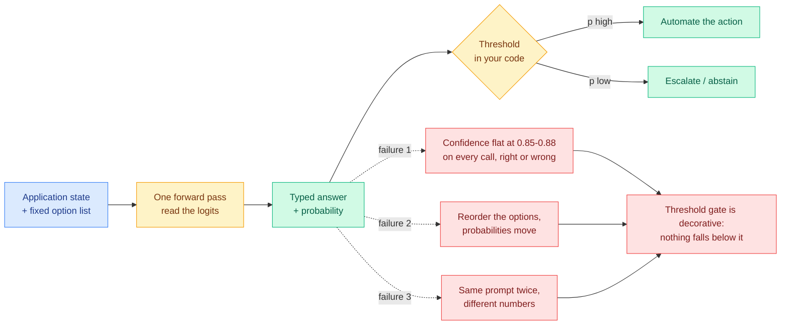
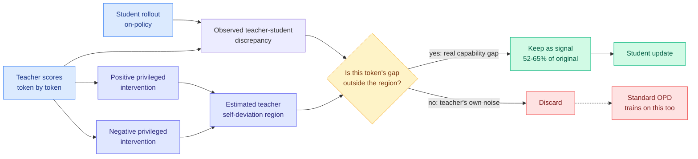
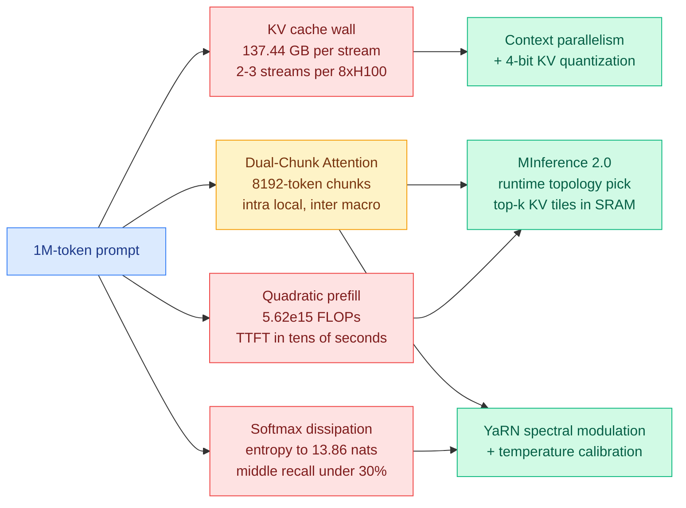
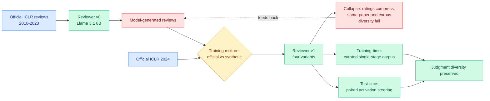
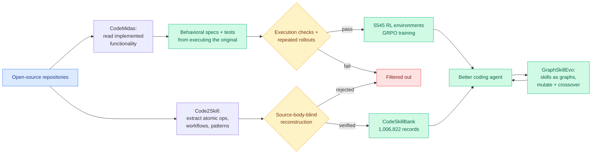
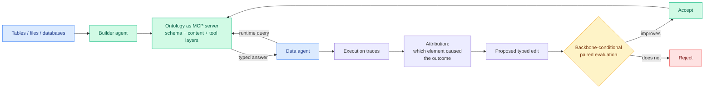
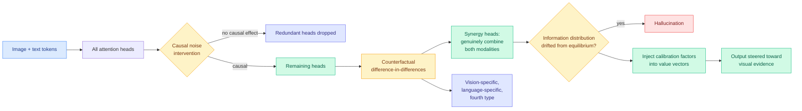
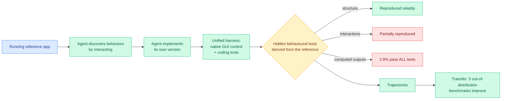

# cere-bro | 2026-09-21

> Everything that got cheap this week got cheap by discarding part of a signal, and today four independent results converged on the same bill: the part you discard determines whether the number that comes out still means anything. A decision model sold on cost reported 85 to 88 percent confidence on nearly every call while losing money. A distillation method got better by throwing away 40 percent of its training signal, but only because it worked out which 40 percent. An AI reviewer trained on AI reviews kept writing plausible reviews and quietly stopped disagreeing. Cost optimization is the day's dominant axis, and the lesson is that a saving is only real if the thing you kept is still a function of the input.

🎯 Today's 5 for you

<ol>
<li>Read<strong>The decision model's calibration bill came due.</strong> Directly on your routing axis: a live trading run put the typed-decision model on a real order book and it reported 85 to 88 percent confidence on nearly every one of 1,838 calls while finishing down 5.2 percent, plus independent reports that it is non-deterministic and that reordering the options moves the probabilities. This is the 09-19 calibration prediction landing 58 days early on the pessimistic branch. <a href="#day-six-of-the-decision-model-boom-the-probability-is-the-product-and-the-probability-is-broken">Deep Dive</a> · <a href="../../ai-routing/2026-09-21-jev-calibration-reckoning.md">full page</a></li>
<li>Read<strong>Cal-OPD: subtract the teacher's own error, keep 52 to 65 percent of the signal.</strong> Your distillation and compression axis, and a clean answer to a diagnosis this wiki logged six weeks ago. It estimates how much of a teacher-student gap is the teacher's own noise by perturbing what the teacher knows, then trains only on what is left. <a href="https://arxiv.org/abs/2609.21619">Paper</a> · <a href="../../inference-efficiency/2026-09-21-cal-opd-calibrated-discrepancy.md">full page</a></li>
<li>Skim<strong>137.44 GB of KV cache per user at one million tokens.</strong> Your KV-cache and GPU axis, and this is the denominator every compression ratio on the wiki has been quoted against without ever being written down. An 8-way H100 node holds two or three concurrent streams. Skim for the three numbers, skip the paywalled second half. <a href="https://kenhuangus.substack.com/p/chapter-9-ultra-long-context-mastery">Chapter 9</a> · <a href="../../inference-efficiency/2026-09-21-ultra-long-context-dca-yarn-minference.md">full page</a></li>
<li>Track<strong>Compute economics turned, in the debt market rather than the chip market.</strong> Your semiconductor and infrastructure axis: data-centre bonds on a Jane Street-leased build are yielding 11.3 percent, more than two points above where they sold in August and worse than comparable AI paper, while Nvidia says it now tracks every gigawatt of land and power on the planet and Anthropic pushed its IPO a month. Three separate signals that power and financing, not silicon, are the binding constraint. <a href="#industry-pulse">Industry Pulse</a></li>
<li>Skim<strong>Train a reviewer on AI reviews and the ratings compress.</strong> Not your core area, but it is the day's sharpest result and it is the same defect as item 1 in a different literature: the score stops being a function of the input. Worth five minutes because the ICLR submission count just tripled to over 60,000 with a flat reviewer pool, which makes this loop unavoidable rather than hypothetical. <a href="https://arxiv.org/abs/2609.20942">Paper</a> · <a href="../../responsible-ai/2026-09-21-scientific-judgment-collapse.md">full page</a></li>
</ol>

---

## TL;DR

- **Decision-model calibration broke in public**: 85 to 88 percent confidence on nearly every call, 1,838 trades, down 5.2 percent. Confidence never moved.
- **Cal-OPD**: work out which part of a teacher-student gap is the teacher's own noise, drop it, train on the other 52 to 65 percent. Beats standard distillation.
- **One million tokens costs 137.44 GB of KV cache per user** on a 70B model. Two or three concurrent streams per 8-GPU node.
- **Kev-8B and Open-Jev shipped open**, and both report the honest number: roughly six points behind the hosted product out of domain.
- **Train an AI reviewer on AI reviews and the ratings compress.** ICLR just logged over 60,000 submissions against 19,525 last year.
- **Source code became the agent training substrate**: 5,545 reinforcement-learning tasks from 3,185 repositories, and a million verified skills from 19,769 more.

---

## Deep Dives

### Day six of the decision-model boom: the probability is the product, and the probability is broken

> Somebody put the typed-decision model on a real order book with no option to abstain. It reported 85 to 88 percent confidence on nearly every one of 1,838 calls and finished down 5.2 percent, with the confidence flat and high the entire way down.

**Source:** X home feed (the dominant cluster, roughly 30 of 69 ranked posts) · Ken Huang / Substack
**Links:** [live run](https://x.com/adriancortexbt/status/2101750066801414250) · [non-determinism report](https://x.com/neural_avb/status/2101736546391244854) · [eight-project taxonomy](https://x.com/0xLogicrw/status/2101545266507551141) · [Kev family](https://x.com/jaredpalmer/status/2101715352258232539) · [Open-Jev](https://x.com/Zefan_Cai/status/2101782158658695388) · [Ken Huang's implementation record](https://kenhuangus.substack.com/p/jev-returns-typed-probabilities-at) · [Wiki summary](../../ai-routing/2026-09-21-jev-calibration-reckoning.md)

**What is it about?**
Jev is a closed model released on 15 September that never writes a sentence. You hand it some application state and a fixed list of options, and it returns which option, plus a probability, in a single forward pass. For five days the conversation was entirely about speed and price. On day six it turned, and it turned on the probability.

**What problem does it solve?**
The probability is what separates a router from a classifier. A classifier needs to be right. A router needs to know when it is not, so that it can escalate to the expensive model. That is the entire logic of a cascade, and it is the reason this wiki has treated a calibrated probability as the load-bearing property of the whole category rather than as a nice extra.

**What's the core novelty?**
There is no new method here. What arrived today is the first independent evidence about calibration, and it came from someone running the thing against money rather than against a benchmark. `jev-trader` places a buy or sell on a MON/USDC pair every block on Kuru, roughly 90 milliseconds per decision, with no abstain option. The reported run: 1,838 decisions in under ten minutes, ending down 5.2 percent, with the model at 85 to 88 percent confidence on nearly every call. A calibrated 86 percent means that of the calls made at 86 percent, about 86 percent are right. A model that reports 86 percent on essentially everything in a near-random domain is reporting a constant, not a probability. The operator's own fix is the tell: one rule, flatten under confidence 0.55, produced a 2,758-call run ending up 4.3 percent.

**Key takeaways**
- **Two mechanism-level defects were reported the same day.** The model is not deterministic, returning different probabilities for the same prompt across runs, and permuting the option list substantially changes the probabilities. The second is textbook position bias in multiple-choice scoring, and it is exactly what "prefill once, read the option logits" predicts.
- **The open clones report an honest out-of-domain gap of roughly six points.** Kev-8B (Apache-2.0, Qwen3 base, LoRA plus a pointer head) scores 79.6 percent against the hosted model's 85.7 percent on data it never trained on. Laya at 421M scores 42.5 percent against 87.0 percent on a 77-option choice. Two days ago Nimble reported 90.12 against 93.21. The mechanism is commoditized. The training data is not.
- **Training cost is now trivial and that is the real commoditization.** Kev-4B trains in 40 minutes on one H100, Kev-8B in 83 minutes, and it ships a drop-in API so switching is a `base_url` change. Open-Jev released 2B and 9B checkpoints with code and data.
- **A clone author independently identified the same two defects as the thing worth engineering against.** Verdict, at roughly 150M parameters, is built specifically around overconfident wrong answers and answers that flip when A and B swap places. That is stronger evidence than either bug report alone.
- **The naming fight is a measurement fight, and the classifier camp is right.** Hamel Husain and the OpenCode founding team both argued this week that this is a classifier and should be called one, because the classifier literature already contains the fixes for every defect above: reliability diagrams, expected calibration error, temperature and Platt scaling, abstention thresholds, position-bias correction. Calling it a new category detached it from the measurement apparatus it needs.

**Gaps in the study**
Six days, more than 160 public projects, and still not one reliability diagram or expected-calibration-error figure. Everything above is anecdote and bug report, which is directionally convincing and formally insufficient. The trading result is a single run in one domain by one operator, and the domain is close to random, which flatters the criticism. Nobody has reported whether averaging over two option permutations bounds the order effect, which would cost almost nothing to try.

**Industrial implication**
If you are building a cascade on any model in this class, the action today is to measure the distribution of returned confidences on your own traffic before you set a threshold. Ken Huang published an implementation record of 30 decision runners plus seven security-operations runners and set his action bands at 0.45, 0.72 and 0.88, stating plainly that he has not fitted them to labelled traffic. Given today's evidence that the model can sit at 0.85 to 0.88 on nearly everything in at least one domain, an 0.88 high-stakes floor may be admitting almost every request. His other line is the one to carry into any deployment: a schema-valid key can still be the wrong key, so type safety prevents malformed output, not incorrect judgment, and a schema-valid mistake refunds the wrong customer just as fast.

→ [Full summary](../../ai-routing/2026-09-21-jev-calibration-reckoning.md)

---

### Cal-OPD: subtract the teacher's own error from the training signal

> Standard on-policy distillation assumes the gap between teacher and student measures what the teacher knows and the student does not. It does not. Part of that gap is the teacher being wrong, and the student has been dutifully learning it.

**Source:** HuggingFace Daily Papers
**Links:** [Paper](https://arxiv.org/abs/2609.21619) · [Wiki summary](../../inference-efficiency/2026-09-21-cal-opd-calibrated-discrepancy.md)

**What is it about?**
On-policy distillation is the technique where a student model generates its own answers and a stronger teacher scores them token by token, so the student gets dense feedback on its own trajectory rather than on the teacher's. The method rests on one assumption: that the observed gap between teacher and student probabilities measures the capability gap. Cal-OPD's claim is that the gap is a sum of two things, and standard training cannot tell them apart.

**What problem does it solve?**
Six weeks ago this wiki recorded a Microsoft Research paper called Privileged, but Biased, which found that privileged self-distillation, where the teacher is shown the answer, reproduces its published gains on easy tasks and teaches nothing at all on hard ones, with the per-token loss falling steadily while validation accuracy stays flat or degrades. It traced the failure to what it named PI Bias: a teacher that has seen one particular reference solution is pulled toward that trajectory rather than toward correctness, so the student's penalty lands on stopwords and punctuation, and inside correct rollouts the highest penalty falls on exactly the exploratory tokens that multi-step reasoning requires. That paper quantified the problem and stopped. Cal-OPD is the fix it implied.

**What's the core novelty?**
Treating privileged information as a probe rather than as a crutch. Run the teacher three ways, plain, with a positive privileged intervention, and with a negative one, and take the spread of its token-level likelihoods as an estimate of the region attributable to the teacher's own conditioning rather than to the student's deficiency. Keep only the part of the discrepancy that lies outside that region.

**Key takeaways**
- **Retaining about 52 to 65 percent of the original signal beats training on all of it**, consistently, across model scales, on mathematical reasoning benchmarks.
- **The paper names privileged distillation as the worse case, not the better one.** Privileged information induces larger teacher-side likelihood shifts, so it encourages the student to absorb more of the teacher's own deviation. The setting the field adopted to strengthen supervision is the setting where the contamination is worst.
- **This is the fourth paper in this wiki's distillation lineage arguing most of the training signal should be discarded, and the first to cut on a causal criterion.** TIP (04-16) cut by token importance and found roughly 10 percent of teacher-generated tokens carry the signal. FIRE-OPD (06-04) filtered rollouts then reweighted the survivors. R2-OPD (08-25) cut by whether a step made reasoning progress. All three are heuristic proxies for importance. Cal-OPD asks the counterfactual question directly: is this gap the teacher's fault or the student's?
- **It composes with RetireOPD (09-18), which fires the teacher entirely once the discrepancy stops shrinking.** One is a temporal rule, one is a spatial one, and nobody has run the pair.

**Gaps in the study**
The evidence is mathematical reasoning only, which is the exact benchmark family the 08-10 negative result showed the gains are a difficulty artifact on. A fix validated where the failure was mildest is not yet a fix. And positive plus negative interventions mean at least three teacher passes per batch, so the paper buys signal quality with compute and reports the first without the second. For an efficiency reader the number that matters is accuracy per teacher-FLOP, and four consecutive entries on this wiki's distillation page have now improved the training signal without pricing it.

**Industrial implication**
Cheap to try: add two teacher passes, mask roughly 40 percent of your token-level loss, expect a better student. The more interesting consequence is for teacher selection. Everyone currently picks the strongest available teacher. Cal-OPD's framing says what you actually want is the teacher whose self-deviation region is smallest on your task, which is a different model, and which nobody measures because until today there was no estimator for it.

→ [Full summary](../../inference-efficiency/2026-09-21-cal-opd-calibrated-discrepancy.md)

---

### The million-token prefill, priced

> A one-million-token context costs 137.44 GB of KV cache for a single user on a 70B model. An eight-GPU H100 node with 640 GB of memory holds two or three concurrent streams before it is full.

**Source:** Ken Huang, *The Physics & Engineering of Frontier LLM Inference*, Chapter 9
**Links:** [Chapter 9](https://kenhuangus.substack.com/p/chapter-9-ultra-long-context-mastery) · [Wiki summary](../../inference-efficiency/2026-09-21-ultra-long-context-dca-yarn-minference.md)

**What is it about?**
The ninth instalment of an engineering series this wiki has tracked since Chapter 1, on what actually breaks when you scale a context window to a million tokens and what production systems in 2026 do about it. The value is that it puts hard arithmetic under a constraint everyone discusses qualitatively.

**What problem does it solve?**
Every KV-cache compression result this wiki has logged this quarter is reported as a ratio against an unstated baseline. This is the baseline, stated.

**What's the core novelty?**
Not novelty, arithmetic. Three numbers. A one-million-token prefill computes 1.0995 times ten to the twelfth query-key dot products per attention head per layer, which on an 80-layer 70B model is 5.62 times ten to the fifteenth floating-point operations for the attention core alone, pushing time-to-first-token from hundreds of milliseconds into tens of seconds. The KV cache, the memory store that saves previous attention computations so they are not recomputed, takes 137.44 GB in 16-bit for one stream at that length. And across a million keys the attention distribution spreads toward its maximum entropy of about 13.86 nats, which is the mechanical account of the lost-in-the-middle problem: recall holds at the edges of the prompt and drops below 30 percent across the middle 10 to 90 percent of the window.

**Key takeaways**
- **A 4x KV compression at long context is not an optimization, it is the difference between two concurrent users and eight.** There is no version of a million-token production service that keeps everything in high-bandwidth memory.
- **The field converged on three mitigations, one per failure mode.** YaRN interpolates the low-frequency rotary position channels while preserving the high-frequency ones that carry local syntax, and adds a softmax temperature term against the entropy spread. Dual-Chunk Attention, as shipped in Qwen 3.8-1M, slices into 8,192-token chunks and separates local attention inside a chunk from coarse coordinate routing between chunks. MInference 2.0 identifies at runtime which of three empirical attention topologies a head is exhibiting and evaluates only the top-k high-affinity tiles inside GPU SRAM through fused Triton kernels, claiming roughly 10x faster million-token prefill.
- **Two of those three are routing, and the wiki's routing page does not have the axis.** Dual-Chunk Attention routes across sequence positions. MInference makes a cheap per-head classification at inference that determines which expensive computation runs, which is a router in the strict sense.
- **The entropy figure has an unexplored implication.** If the middle of a long cache is already close to unread, eviction policies may be less lossy than their token counts suggest, and nobody has tested that framing.

**Gaps in the study**
The numbers that would settle things are paywalled: time-to-first-token benchmarks, 1M retrieval accuracy, and cluster sizing templates are subscriber-only. It is also a synthesis rather than a measurement, drawing on published work from DeepSeek, Moonshot, Zhipu, Alibaba, NVIDIA and Google DeepMind, so the arithmetic is checkable and correct while the performance claims are secondhand. And the three mitigations are asserted to be complementary without being shown to compose, which is the experiment a deployment actually needs.

**Industrial implication**
If you are sizing a long-context service, the planning number is two to three concurrent million-token streams per eight-GPU node before any compression. That is the figure that makes off-memory parameter and cache placement mandatory rather than clever, and it is why the SemiAnalysis offloading work and the DeepSeek-V4.1-Flash compression result from 09-18 are existential rather than incremental questions at this context length.

→ [Full summary](../../inference-efficiency/2026-09-21-ultra-long-context-dca-yarn-minference.md)

---

### When AI reviews train AI reviewers, the ratings compress

> The thing that collapses first is not accuracy and not fluency. It is variance. The reviews stay well-formed, on-topic and plausible, and they stop disagreeing with each other.

**Source:** HuggingFace Daily Papers
**Links:** [Paper](https://arxiv.org/abs/2609.20942) · [Fisher-Rao companion](https://arxiv.org/abs/2609.18878) · [ICLR submission report](https://x.com/mariyaivasileva/status/2101503396020887585) · [Wiki summary](../../responsible-ai/2026-09-21-scientific-judgment-collapse.md)

**What is it about?**
Models write peer reviews, those reviews enter public data, public data becomes training data, so later reviewers learn from earlier models' judgments. This paper runs one controlled step of that loop. Fine-tune a reviewer from Llama 3.1 8B on official ICLR reviews from 2018 to 2023, then train four successors on ICLR 2024 with systematically varied mixtures of official and model-generated reviews.

**What problem does it solve?**
Model collapse, the degradation that follows from training on generated data, is a known result usually measured on accuracy or perplexity. This identifies which statistic in a judgment task degrades first, and it is the one that matters.

**What's the core novelty?**
Naming and measuring scientific-judgment collapse specifically. Introducing synthetic reviews compresses the rating distribution and reduces semantic diversity both within a single paper's set of reviews and across the whole corpus. The mitigation, TrustReviewer, works at two points: a curated single-stage training corpus designed to exclude degenerate supervision, and paired activation steering at test time that corrects residual collapse with no retraining and no extra expert annotation.

**Key takeaways**
- **Variance is the mechanism, not a nuisance parameter.** The reason you assign three reviewers is that they disagree, and the disagreement is what a decision is made from. A reviewer population converging on a shared middling opinion has stopped producing information while continuing to produce text, and that is invisible to every quality metric the field would naturally apply.
- **This is structurally the same defect as the decision-model failure above.** A compressed rating distribution is a miscalibrated judge: it reports similar scores regardless of the input, so any threshold on it stops discriminating. Different systems, different literatures, one failure. The score stopped being a function of the input.
- **A theoretical companion arrived the same week and neither paper cites the other.** *Preventing Model Collapse: A Fisher-Rao Perspective on the Dynamics of Training with Synthetic Data* sits at number three on Kurate's machine-learning board and treats synthetic-data training as a dynamical system on a statistical manifold, which is the shape of result that would say when the diversity loss does and does not happen.
- **The volume argument arrived from social the same day.** An ICLR submitter reports over 60,000 submissions registered at this year's abstract deadline against 19,525 last year, with the reviewer pool roughly unchanged. On last year's rates that implies about 42,300 submissions reaching review.

**Gaps in the study**
One generation, one venue, one 8B model. Whether collapse compounds across generations, appears at the frontier scale where reviews are actually being written, or is specific to ICLR's rating scale is all open. More importantly, diversity falling is only bad if the lost variance was signal, and the paper does not show that collapsed reviewers make worse accept or reject decisions, which is the outcome that matters.

**Industrial implication**
Generalise past peer review and this is a statement about every automated evaluator in a production stack, including the LLM-as-judge rigs now standard in evaluation pipelines and the reward models in reinforcement-learning loops. The safety-relevant property of an automated judge is not its accuracy, it is whether its output still varies with its input, and almost nobody monitors that. A cheap operational fix available today: log the variance of your judge's scores over time and alert when it shrinks.

→ [Full summary](../../responsible-ai/2026-09-21-scientific-judgment-collapse.md)

---

### Source code became the agent training substrate, in four papers at once

> A working implementation is already an oracle. You do not need someone to have filed a bug, you need the code to run.

**Source:** HuggingFace Daily Papers (three) + Kurate cs.AI (one) · CodeMidas is **cross-source confirmed (HF + Kurate)**, with a caveat below
**Links:** [CodeMidas](https://arxiv.org/abs/2609.22068) · [Code2Skill](https://arxiv.org/abs/2609.05571) · [GraphSkillEvo](https://arxiv.org/abs/2609.21749) · [SkillAA](https://arxiv.org/abs/2609.20455) · [Wiki summary](../../agentic-systems/2026-09-21-code-as-agent-substrate.md)

**What is it about?**
Four papers landed today taking the same position from four directions: the bottleneck on agent capability is not the model, it is the supply of verified tasks and verified procedures, and the largest untapped supply of both is source code that already exists.

**What problem does it solve?**
Training a coding agent with reinforcement learning needs diverse tasks plus a verifier that reliably says whether the agent succeeded. The standard approach mines issues and commits, because an issue plus its fixing commit plus its test is a ready-made task with a ready-made verifier. That restricts you to work somebody already did and wrote down.

**What's the core novelty?**
CodeMidas takes the implemented functionality itself as input. An agent explores what a piece of code does, writes a behavioural specification, constructs tests by executing the original, and candidates are filtered by execution checks and repeated solution rollouts. Code2Skill contributes a verification protocol worth stealing: source-body-blind reconstruction, where you hide the implementation, rebuild it from the skill record alone, then compare against the original with the source available. A record that does not let you rebuild the thing it describes is rejected.

**Key takeaways**
- **CodeMidas: 5,545 tasks from 3,185 codebases across 23 languages.** Training MiMo-V2.5 with GRPO, the reinforcement-learning method that scores a batch of sampled answers against each other rather than against a learned value network, improves all five benchmarks: issue repair +11.7 percent, whole-program construction +17 percent, terminal work +8.5 percent.
- **Code2Skill: 1,006,822 verified records from 19,769 repositories**, worth +11.7 percent on average across 72 protocol-matched evaluations, winning 57 of 72, and beating trajectory-derived skill banks on all seven shared benchmarks. That last comparison inverts the field's ordering: repository-derived skills are better before an agent has accumulated experience, which makes them a cold-start asset.
- **GraphSkillEvo's gap size is the finding, not its headline.** Representing skills as graphs and evolving them beats the strong baseline by 4.01 percent on GPT-5.4-nano and 1.76 percent on GPT-5.4. The structure helps the weaker model roughly twice as much.
- **Spending agentic compute on environment construction is a cost claim in disguise.** It moves expensive model calls out of the per-episode training loop into a one-time dataset pass that amortises across every future run.

**Gaps in the study**
CodeMidas does not price the construction pass, and running agents over 3,185 codebases is a large bill, so the amortisation argument stays an argument. Code2Skill's verification judge is still a model, which makes it strictly weaker than CodeMidas's execution-grounded filter, and the two papers do not compare. None of the four reports retrieval cost at serving time, and choosing which of a million skills to retrieve for a given task is exactly the expensive estimation problem that Pandora's Router (08-25) formalised when it priced the cost of working out which option to use.

**Industrial implication**
Three results now say the same thing and it is time to state it as a rule: **scaffolding substitutes for capability, so its value is inversely proportional to the capability of the thing it scaffolds.** The 09-17 seven-model comparison found harness choice moves cost far more than success. The 09-18 component ablation found three of four harness components flip their optimal setting depending on which model is running. GraphSkillEvo finds structured skills help the smaller model twice as much. For anyone building agent infrastructure, the consequence is that a harness or a skill library is not an asset on the balance sheet, it is a recurring cost pinned to a model version, with a shelf life set by the next release.

→ [Full summary](../../agentic-systems/2026-09-21-code-as-agent-substrate.md)

---

### EvoOntology: serve the semantic layer, do not paste it

> Anything an agent needs occasionally should be a tool call, not a prompt prefix. That is the second paper in three days to make that move, and neither prices what it costs in cache misses.

**Source:** HuggingFace Daily Papers + Kurate cs.AI #2 (cross-source present, caveat below)
**Links:** [Paper](https://arxiv.org/abs/2609.15779) · [Code](https://github.com/ruc-datalab/EvoOntology) · [Wiki summary](../../agentic-systems/2026-09-21-evoontology-data-agent-semantic-layer.md)

**What is it about?**
Data agents answer natural-language questions over tables, files and databases. Their structural problem is that the data lives outside the agent, which only sees thin handles onto it, column names and file paths, through generic tools.

**What problem does it solve?**
The two existing answers both fail at scale. Let the agent explore raw sources and it burns context wandering. Inject a hand-written semantic layer into the prompt and you pay someone to write it, it stops fitting in the window past a certain size, and it does not adapt to how a particular agent behaves.

**What's the core novelty?**
Stop treating the semantic layer as prompt content and start treating it as a queryable service. The ontology is exposed as an MCP server with a schema layer, a content layer and a tool layer, so the agent asks it questions at runtime. A builder agent constructs it, and a self-evolution loop refines it through attribution-guided typed edits accepted only after a backbone-conditional paired evaluation.

**Key takeaways**
- **The token argument is clean.** A pasted layer costs its full size on every call whether or not the agent needs any of it. A queried one costs only what is asked for.
- **This is the same structural move as SKILL.state (09-19)**, which replaced an agent's growing transcript with a state object and cut cumulative token use 16x at 100 turns by making the context something you query rather than something you carry.
- **Backbone-conditional acceptance is an explicit admission that the optimal scaffold is model-dependent**, which is the same conclusion the harness literature reached independently and a fourth data point for the shelf-life rule above.
- Beats both strong baselines and existing semantic-layer approaches across three data-agent benchmarks and four model backbones.

**Gaps in the study**
The token saving is the whole argument and it is not measured against the added tool-call round trips or the lost prefix-cache reuse, which is precisely the trade the 09-13 prefix-stable caching work is about: a prompt prefix is cacheable, a tool call is a round trip. The builder-agent cost is unpriced, and the self-evolution loop makes it recurring. And there is no ablation of the MCP framing itself against the same ontology injected as prompt content, so the gain could be the ontology's quality rather than the delivery mechanism.

**Cross-source caveat, stated precisely.** EvoOntology and CodeMidas both appear in today's HuggingFace list and this week's Kurate cs.AI top 20, which under this wiki's rule would make them high conviction. They should be discounted. Every Kurate entry this week still carries a score of 1200 and a 0.0 percent win rate, meaning the three-LLM tournament has not run against this cohort, so the board is ordered by recency rather than by quality. Two recency feeds agreeing is real but it is not a popularity signal and a quality signal agreeing.

→ [Full summary](../../agentic-systems/2026-09-21-evoontology-data-agent-semantic-layer.md)

---

### HEAL: hallucination is drift inside the heads that combine modalities

> Everyone has been pushing more attention onto visual tokens. The paper's finding is that neither the number nor the strength of vision-specific heads correlates with hallucination at all.

**Source:** HuggingFace Daily Papers
**Links:** [Paper](https://arxiv.org/abs/2609.09206) · [Wiki summary](../../vision-audio-video/2026-09-21-heal-synergy-heads-hallucination.md)

**What is it about?**
Multimodal models hallucinate, meaning they describe things the image does not contain. The standard mitigation family assumes the cause is the model not looking at the image, so the fix is to amplify attention to visual tokens.

**What problem does it solve?**
HEAL argues that attention weights are an indirect signal that does not track the information shift accompanying a hallucination, so the whole mitigation family is optimizing a quantity that does not cause the outcome.

**What's the core novelty?**
The head-selection criterion. Rather than reading off attention weights, HEAL does causal noise intervention on multi-head outputs to drop heads that turn out to be causally redundant, then uses a counterfactual difference-in-differences estimator to sort the survivors into four types. The finding is that hallucinations occur when the information distribution inside the synergy heads, the ones that genuinely combine visual and textual information, drifts away from equilibrium, and that this is not correlated with the quantity or strength of modality-specific heads. The fix is to inject dynamic calibration factors into the value vectors of synergy heads at inference, with no retraining.

**Key takeaways**
- **It is a head-level router built on a causal criterion.** MISA (05-11) established the head axis as a routing axis by showing different heads want different sparsity patterns. Everything since has selected heads by correlational scores. This selects by intervening and checking whether the output changes, and the criticism transfers directly to head pruning and head-axis compression outside multimodal settings.
- **Four functional head types is a partition that a compression scheme needs.** If synergy heads carry the cross-modal binding, they are the heads a KV-cache quantizer should protect. Nobody has run that experiment.
- **This is the third result in five days pointing at the value path rather than the attention weights.** VC-Attention (09-17) found value outliers in video diffusion transformers are token-structured rather than channel-structured, which is why channel transforms never fixed them. Three papers is this wiki's threshold for a pattern, and the pattern is that the attention weights are the diagnostic everyone reads while the values are where the information is.
- **The fix is the same class of intervention as today's TrustReviewer**: a distributional correction applied to activations at inference rather than to weights by retraining.

**Gaps in the study**
Four head types are named and only the synergy category does any work; what the fourth is, and whether the partition is stable across models, is not established. No efficiency numbers: causal noise intervention across all heads is a sweep and the paper treats it as analysis rather than pricing it. And "drifts away from a healthy equilibrium" implies a reference distribution whose origin is unspecified, which decides whether this is a deployable detector or only a post-hoc explanation.

→ [Full summary](../../vision-audio-video/2026-09-21-heal-synergy-heads-hallucination.md)

---

### Computer-use agents get graded properly, and the score is 2.8 percent

> The leading model scores 58.1 percent overall and passes every programmatic test on 2.8 percent of tasks. The gap between those two numbers is the only honest measure of how much of an agentic benchmark is easy sub-parts.

**Source:** HuggingFace Daily Papers
**Links:** [RecreationWorld](https://arxiv.org/abs/2609.22000) · [MintAct](https://arxiv.org/abs/2609.22083) · [Wiki summary](../../agentic-systems/2026-09-21-computer-use-agents-graded.md)

**What is it about?**
Two papers on agents that operate a computer. RecreationWorld is the evaluation: give the agent a running reference application and require it to discover the behaviour and rebuild it, with no prescribed workflow, across Ubuntu, macOS, Windows, Android and Web. MintAct is the model: one vision-language family at 2B, 4B and 8B unifying interface grounding, multi-step navigation and visual tool use.

**What problem does it solve?**
Real digital work interleaves clicking around an interface with writing and running code. Existing benchmarks test those separately, and existing agents are per-domain specialists.

**What's the core novelty?**
RecreationWorld's design choice is that nobody writes the answer key. The running reference application is executed to generate hidden behavioural tests, so the oracle is the artifact itself. This is the same structural insight as CodeMidas above, arrived at independently on the same day, one for training and one for evaluation: a working artifact is already an oracle, and realising that is the expensive part of building an evaluation.

**Key takeaways**
- **GPT-6 Astra leads at 58.1 percent overall and passes all programmatic tests on 2.8 percent of tasks.** Agents reproduce static interface structure reliably, interactions less so, computed outputs least, and generated applications remain smaller and more monolithic than their references.
- **The 250-task held-out suite is validated twice before freezing**, on the reference and by human reviewers, which is stricter than most agentic benchmarks manage.
- **Training on the trajectories transfers.** Models improve across five out-of-distribution coding and hybrid benchmarks, and notably verify their own rendered outputs more often, which is a behaviour change rather than a score change.
- **MintAct reaches 48.9 on OSWorld-Verified at comparable size to per-domain specialists**, and attributes the unification to explicit control over the cross-domain training distribution under an asynchronous reinforcement-learning framework stable under off-policy drift. That is a routing claim at training time: the interesting parameter is which domain each batch is drawn from.

**Gaps in the study**
Recreation is a cleanly verifiable task precisely because a reference exists, and most real computer-use work has no reference, so the generalisation claim rests entirely on the transfer evidence. Neither paper reports dollars or tokens per task, which for the most expensive class of agent is a conspicuous omission. And "matches per-domain specialists" needs the specialists named.

**Industrial implication**
This is the first clean counterexample to the harness-dominates reading that three results built up over the last week. With a strong unified harness already in place, a 2.8 percent full-pass rate says the remaining headroom on this task class is in the model. Publishing the aggregate score and the all-tests-pass rate side by side should become the norm.

→ [Full summary](../../agentic-systems/2026-09-21-computer-use-agents-graded.md)

---

## Industry Pulse

- **Nvidia says it now tracks "every single gigawatt of land, power and shell around the world,"** treating power availability as the binding constraint on getting shipped chips online ([The Information](https://www.theinformation.com/articles/nvidia-trying-solve-data-center-power-bottleneck)).
- **Data-centre developers working with Google, Microsoft and Oracle fear a glut of unused chips** if power runs short before capacity lands ([The Information](https://www.theinformation.com/articles/nvidia-trying-solve-data-center-power-bottleneck)).
- **Daily AI use among US adults more than doubled in six months**, from 8 percent to 19 percent between March and August, while weekly-only use fell from 17 percent to 10 percent ([The Decoder](https://the-decoder.com/daily-ai-usage-in-the-u-s-has-more-than-doubled-in-just-six-months/)).
- **Trump announced an "AI Force" modelled on the Space Force plus an "AI czar,"** claiming AI could reach 25 percent of US economic output and rejecting new regulation ([The Decoder](https://the-decoder.com/trump-announces-ai-force-and-plans-for-an-ai-czar-as-he-pushes-unchecked-ai-growth/)).
- **The US and China discussed standing up a "U.S.-China AI dialogue"** to address potential threats, per Treasury Secretary Bessent after a day of talks ([The Information](https://www.theinformation.com/briefings/u-s-china-discussed-ai-safety-system-bessent-says)).
- **Alibaba released Qwen-Image-2.1**, an open-weight 7B image model claiming to beat closed systems, running on consumer GPUs with transparency support and up to ten reference images ([The Decoder](https://the-decoder.com/alibabas-open-weight-qwen-image-2-1-claims-to-beat-closed-models-in-image-generation-with-just-7-billion-parameters/)).
- **Tencent's Gander splits a voice agent into a "cerebellum" that keeps talking and a swappable "brain" that works in the background**, interrupting users in 8 percent of cases but trailing rivals on task accuracy ([The Decoder](https://the-decoder.com/tencents-gander-aims-to-keep-talking-while-it-works-in-the-background/)).
- **Runway wants to stream generated video frame by frame as you prompt it**, built on its GWM-1 world model, with robotics and driving as the stated non-creative use cases ([The Decoder](https://the-decoder.com/runway-wants-to-turn-ai-video-generation-into-a-live-stream-you-control-in-real-time/)).
- **Microsoft and the University of Illinois built StudentSim**, simulated students that make realistic mistakes so tutoring agents get fast cheap feedback, outperforming GPT-5.4 across 60 students in chess, English and maths ([The Decoder](https://the-decoder.com/simulated-students-that-make-realistic-mistakes-help-ai-tutors-learn-faster/)).
- **Ken Huang published an implementation record of 30 decision runners plus seven agentic security-operations runners**, with confidence bands at 0.45, 0.72 and 0.88 and money movement deliberately left in caller code ([Substack](https://kenhuangus.substack.com/p/jev-returns-typed-probabilities-at)).
- **Kev-0.6B, 4B and 8B shipped Apache-2.0**, trainable in 40 to 83 minutes on one H100, with a drop-in API so switching is a single `base_url` change ([announcement](https://x.com/jaredpalmer/status/2101715352258232539) · [repo](https://github.com/jaredpalmer/kev)).
- **Open-Jev released 2B and 9B decision models** with code, dataset and both checkpoints public ([announcement](https://x.com/Zefan_Cai/status/2101782158658695388) · [repo](https://github.com/Zefan-Cai/Open-Jev)).
- **A practitioner cookbook catalogued 20 working integrations of the decision primitive**, most of them gates inside somebody else's loop: a task-difficulty router that picks a model tier, a context garbage collector, a pre-review risk filter, a completion-claim checker that catches a coding agent asserting it is done ([thread](https://x.com/Pluvio9yte/status/2101831273224311035)).
- **Microsoft Research released LoopsBench**, 112 long-horizon software projects in 8 languages across 5,384 separately testable units, with Claude Opus plus an outer continuation loop topping it at 25.00 percent and a reported $178 of compute per feature branch. Circulating via social summary rather than a captured paper link, so treat the figures as unverified ([thread](https://x.com/marfinxx/status/2101806271464616143)).
- **A multi-agent study reports accuracy peaking around 16 agents and falling as the population grows.** Small swarms collapse onto one wrong belief; large ones polarize into two persistent camps. Mixed GPT-4o and GPT-5.4 teams beat homogeneous teams at similar individual accuracy because their error modes differ ([thread](https://x.com/vigram_void/status/2101647059564826974)).
- **Widely circulated but unsourced: a claim that Andrej Karpathy joined Anthropic** to run a team applying Claude to Anthropic's own pretraining research. The account sharing it states plainly that the accompanying quote has no source anywhere. Recorded as a rumour, not as news ([thread](https://x.com/AnnatarXBT/status/2101680189067411500)).
- **Simon Willison shipped [datasette-explain 0.2.2](https://simonwillison.net/2026/Sep/20/datasette-explain/) and [llm-keys-ui 0.1](https://simonwillison.net/2026/Sep/20/llm-keys-ui/)**, routine tooling releases noted for completeness.

**Funding, valuations, and compute deals**

- **Anthropic is reportedly delaying its IPO from October to November 2026** to present stronger Q3 results, with investors expecting a roughly **$2 trillion valuation** ([The Decoder](https://the-decoder.com/following-openai-anthropic-is-also-reportedly-postponing-its-ipo/)).
- **Anthropic's SpaceX compute deal alone runs about $1.25 billion a month**, cited as one of the infrastructure costs complicating the listing ([The Decoder](https://the-decoder.com/following-openai-anthropic-is-also-reportedly-postponing-its-ipo/)).
- **Debt on a Jane Street-leased data centre has soured fast**, with yields rising to around **11.3 percent, more than two percentage points above where the bonds sold in August**, a sharper deterioration than other recent AI data-centre paper ([The Information](https://www.theinformation.com/articles/jane-street-linked-data-center-debt-sours)).
- **Chamath Palihapitiya predicted the top three models will be open source within 12 months**, with the economic winners being the American serving clouds: Nebius, Iren, Baseten, Together and Fireworks ([post](https://x.com/chamath/status/2101406709231337710)).
- **Emad Mostaque argued US serving clouds will run Kimi K3 at one-tenth the cost of Chinese competitors** because of chip access, and that on Rubin-class hardware the operating cost could fall 10 to 100 times ([via](https://x.com/rohanpaul_ai/status/2101862190177481199)).
- **Apple is betting foldable iPhones will soften an expected drop in global smartphone shipments**, following double-digit growth for Huawei and Samsung outside North America ([The Information](https://www.theinformation.com/articles/apple-betting-foldable-iphones)).
- **Meta's Connect conference lands Wednesday** with a camera-free smart-glasses launch reported for October plus new AR glasses ([The Information](https://www.theinformation.com/articles/techs-new-trend-ugly-spectacles)).

---

## Global View

**The week's cheapest ideas all got cheap the same way, by discarding part of a signal, and today four results converged on the same bill: the discard is only safe if what remains still varies with the input.** Cal-OPD keeps 52 to 65 percent of a distillation signal and wins, because it worked out which part was the teacher's own noise rather than the student's deficiency, extending a diagnosis this wiki logged on 08-10 when Privileged, but Biased found that a teacher shown the reference solution pulls the student toward that one trajectory instead of toward correctness. The decision-model ecosystem discarded text generation entirely to get a probability in one forward pass, and today a live trading run reported that probability pinned at 85 to 88 percent through a losing streak, which is a constant wearing a label. The scientific-judgment collapse paper discarded human reviews for synthetic ones and found the rating variance went with them. **Three literatures, one property: a compressed output distribution looks healthy on every quality metric and has stopped carrying information, and the only defence is to monitor the variance of the score rather than its average.**

**Industry is simultaneously proving and ignoring this, and the gap is visible in the same week's numbers.** Gateway data from 09-20 put open-weight models at 78.4 percent of token volume against closed models' 21.6 percent while Anthropic's five models still take 36.9 percent of spending, which is the market executing the crudest possible routing policy, send everything cheap unless you already decided otherwise, and capturing most of the available saving without a learned router anywhere in the loop. Today's practitioner cookbook of 20 decision-primitive integrations is that same instinct one level down: nearly all of them are gates inside somebody else's loop, a task-difficulty router picking a model tier, a context garbage collector, a completion-claim checker. **Every one of those gates is a threshold on a probability, so today's calibration evidence says the deployed fleet is full of thresholds that may not discriminate, and the research literature has produced 160-plus projects in six days and not one reliability diagram.** Ken Huang's implementation record is the honest version of the gap, setting bands at 0.45, 0.72 and 0.88 while stating outright that he has not fitted them to labelled traffic.

**The other structural finding of the day is that scaffolding is a substitute for capability, and the compute market is quietly pricing the same thing.** GraphSkillEvo's structured skills helped GPT-5.4-nano roughly twice as much as GPT-5.4; the 09-18 harness ablation found three of four components flip their optimal setting across backbones; EvoOntology builds backbone-conditional evaluation into its acceptance rule. **So a harness or a skill library is not an asset, it is a recurring cost pinned to a model version.** Set that beside Chapter 9's arithmetic that a single million-token stream needs 137.44 GB of cache, Nvidia saying it now tracks every gigawatt on the planet, and data-centre bonds on a Jane Street-leased build yielding 11.3 percent against an August issue two points tighter, and the shape is consistent: the durable expenditures in this industry are power and memory, and everything built on top of a specific model generation depreciates on that model's schedule. RecreationWorld's 58.1 percent aggregate against a 2.8 percent all-tests-pass rate is the same lesson from the evaluation side, which is that the headroom people think they have bought with scaffolding is mostly measurement.

---

## Looking Ahead

- **A reliability diagram or expected-calibration-error figure for a typed-decision model appears within 45 days, and the curve will be worse than the accuracy numbers imply.** The [09-19 digest](2026-09-19.md) set this at 60 days, and today's evidence (85 to 88 percent confidence on nearly every call across 1,838 live decisions, non-determinism across identical prompts, substantial option-order sensitivity, and a 150M clone engineered specifically against overconfidence and order-flipping) resolves the *direction* 58 days early while leaving the *measurement* owed. **Signal:** any reliability diagram or ECE figure on Jev, Kev, Open-Jev, Laya, Verdict or Nimble. An ECE under 5 percent on out-of-domain data closes the question in the vendors' favour; anything above 15 percent means every threshold gate shipped this month is decorative and the 20-integration cookbook is a list of liabilities.
- **The out-of-domain gap between hosted and open decision models stays near six points through October, and it will be attributed to training data rather than to architecture.** Kev-8B reports 79.6 against 85.7, Nimble 90.12 against 93.21, Laya 42.5 against 87.0 on a 77-option choice. **Signal, 30 days:** any open clone closing to within two points out of domain, and what it changed to get there. If the closer is a data-scale change, the [09-19 commoditization claim](../../ai-routing/2026-09-19-jev-open-clones-commoditization.md) is right on a delay; if it is an architectural or calibration-objective change, the hosted model has a real property nobody has named.
- **Cal-OPD gets run on the hard agentic settings where Privileged, but Biased found total collapse, within 90 days, and the gains will shrink by more than half.** Today's result is mathematical reasoning only, which is precisely the benchmark family the 08-10 paper showed the privileged-distillation gains are a difficulty artifact on. **Signal:** any follow-up reporting Cal-OPD on ALFWorld, WebShop, multi-turn tool use or coding, with the retained-discrepancy fraction published alongside. If the 52-to-65 percent retention holds on hard tasks and the gains survive, the self-deviation estimator is a genuine contribution rather than a math-benchmark tuning knob.
- **Publishing the all-tests-pass rate next to the aggregate becomes standard in computer-use agent papers by year end.** RecreationWorld's 58.1 percent against 2.8 percent is too large a gap for reviewers to keep ignoring once it is on the record. **Signal, 90 days:** any new agentic benchmark release reporting both an aggregate and a full-pass rate in the same table. If nobody does, the field is still reporting a number dominated by easy sub-parts and every agentic leaderboard on this wiki should be read down accordingly.

**Rising authors from Kurate.** Three co-authors crossed the threshold this week on the same two papers: **Siyuan Li**, **Xinxin Song** and **Tingxiong Xiao**, each with four top-10 appearances across weeks 36 to 39 at a score of 21.2, on *CARE: Contrastive Anchor-based Rubric Evolution for Large Language Model Post-Training* ([2609.00892](https://arxiv.org/abs/2609.00892), cs.AI #9) and *Anchoring What Matters: A Dual-Level Learning Framework for Visually-Grounded Multimodal Reasoning* ([2609.18057](https://arxiv.org/abs/2609.18057), cs.AI #1 this week and last). The caveat matters: these are four appearances from **two distinct papers held over across consecutive unscored weeks**, so the counter is partly measuring the leaderboard's staleness rather than the authors' output. **Signal, 60 days:** a third distinct paper from this group appearing on either board. CARE's rubric-evolution work sits adjacent to the calibrated-judge thread running through today's digest, which makes them worth watching regardless. No X handles identified yet, so no `ai_handles` addition is proposed.

**Note on today's sources.** The 09-17 digest set a deadline of today's scrape for Kurate's three-LLM tournament to run, and **it was missed for a sixth consecutive week**: all 40 entries across cs.AI and cs.LG again carry `score=1200` and `win_rate=0.0%`, so both boards remain recency-ordered arXiv feeds carrying an AI rating rather than tournament rankings. Two papers do appear in both today's HuggingFace list and the Kurate top 20 (CodeMidas at cs.AI #6, EvoOntology at cs.AI #2), which is the first such overlap in a fortnight, but with the tournament unscored this is two recency feeds agreeing rather than a quality signal confirming a popularity signal, and **the cross-source-confirmation rule should now be treated as formally suspended until a scored board appears.** Separately: all eight Reddit subreddits returned nothing again, extending a run that has now covered essentially the whole month, and the farmer log gives the reason plainly, no OAuth credentials, so unauthenticated JSON is returning HTTP 403 and every sub is empty by construction rather than by filtering. Gmail had zero starred items, the public X scrape captured zero tweets for a twenty-fourth consecutive day, the bookmarks feed captured zero new saves, and LinkedIn and YouTube both returned empty. **Today's social and practitioner signal comes entirely from the ranked X home feed.**
