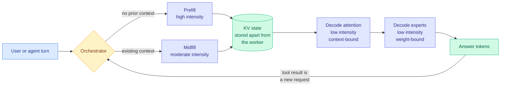
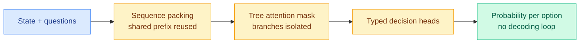
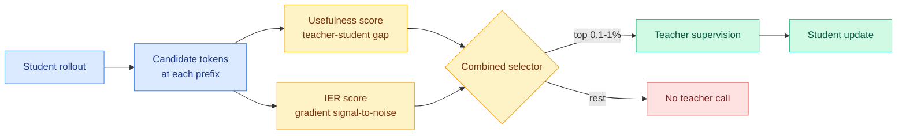
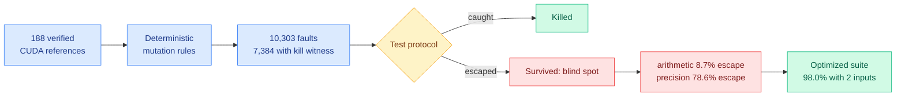
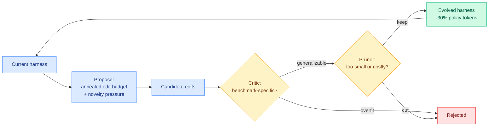
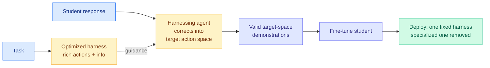
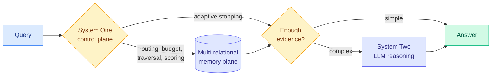

# cere-bro | 2026-09-22

> Four results landed on one day saying the same thing from four directions: the standing context an agent carries, not the model it calls, is the dominant recurring cost. And the week's cheap-decision story finally met a benchmark that a frontier model saturates.

🎯 Today's 5 for you

<ol>
<li>Read<strong>SemiAnalysis, Computation and Data Movement for Inference.</strong> The mechanism page behind every batching and KV-cache result you have been collecting: inference is four regimes, not two, and midfill is the one agentic work actually lives in. <a href="https://newsletter.semianalysis.com/p/computation-and-data-movement-for">Read it</a>.</li>
<li>Read<strong>The routing tax finally has a number.</strong> An Opus → Sonnet → Opus route costs 6.19 against 4.15 for pure Opus, because every hand-off reprocesses the context. This is the subtrahend missing from every routing result in the wiki. <a href="../../ai-routing/2026-09-22-decision-model-benchmark-ladder-and-routing-tax.md">Wiki summary</a>.</li>
<li>Read<strong>1% of Tokens Can Be Enough (IER-OPD).</strong> Compression and distillation: every sparse-distillation selector so far picked tokens by usefulness. This one says pick by whether the gradient can be measured there at all. <a href="https://arxiv.org/abs/2609.24432">Paper</a>.</li>
<li>Skim<strong>Measuring the Checker.</strong> GPU-kernel benchmarks miss 16.9% of injected faults deterministically, and 78.6% of precision faults. Those verdicts are feeding RL rewards right now. <a href="https://arxiv.org/abs/2609.22220">Paper</a>.</li>
<li>Track<strong>HarnessTax and RRSI.</strong> Your most-saved theme, harness engineering, got its pricing grid (21 combos, 2x cost spread for 1.1 points of accuracy) and its overfitting fix (30% fewer policy tokens) on the same day. <a href="../../agentic-systems/2026-09-22-harnesstax-cost-success-frontier.md">HarnessTax</a> · <a href="https://arxiv.org/abs/2609.24972">RRSI</a>.</li>
</ol>

---

## TL;DR

- **SemiAnalysis**: inference is four regimes, not two. Prefill, midfill, decode attention, decode experts. Each has different arithmetic intensity and batching value.
- **The routing tax**: switching models mid-task costs 6.19 against 4.15 for never switching, because each hand-off reprocesses the whole context.
- **IER-OPD**: pick distillation tokens by gradient reliability, not just teacher disagreement. Matches full distillation at 0.1% of tokens.
- **Measuring the Checker**: GPU-kernel benchmark oracles miss one in six faults, and 78.6% of precision faults. Two well-chosen inputs fix it.
- **HarnessTax**: across 21 model-harness combos, cost moved 2x while success moved 1.1 points. Nine of twelve beat the vendor default.
- **Open-Jev benchmark**: GPT-6 Astra scores 100% on the decision benchmark. The purpose-built decision model comes third.

---

## Deep Dives

### Computation and Data Movement for Inference

> Mixture-of-experts did not just make models bigger. It split inference into four workloads with different economics, and treating them as one gives away most of what MoE was supposed to buy.

**Source:** SemiAnalysis (via starred Gmail)
**Links:** [Essay](https://newsletter.semianalysis.com/p/computation-and-data-movement-for) · [Wiki summary](../../hardware/2026-09-22-semianalysis-inference-data-movement.md)

**What is it about?**
A system-level account of what a serving cluster actually does when it runs a mixture-of-experts model (MoE, where each token is routed through a small subset of specialized sub-networks rather than the whole network). The argument is that the familiar prefill-then-decode split is too coarse, and the right decomposition has four regimes.

**What problem does it solve?**
Until now, serving analysis treated inference as two phases with one set of batching rules. That framing cannot explain why batching helps enormously in some situations and barely at all in others, and it gives no vocabulary for the case that agentic workloads actually generate: appending a short new request to an already-enormous cached context, thousands of times per hour.

**What's the core novelty?**
Naming **midfill** as its own regime and deriving the four regimes from arithmetic intensity, the ratio of computation done per byte of data moved. Prefill is high intensity and waits on nothing. Midfill is moderate, because there are few new tokens and a lot of existing context to move. Decode attention is low intensity and bound by moving context. Decode experts is low intensity and bound by moving expert weights. The exploit that follows: within a regime the tensors are identical regardless of token value, so one read can be shared across every token queued to use it, including tokens from unrelated users' requests that happen to run concurrently.

**Key takeaways**
- KV state is emitted per layer by prefill workers and stored independently of the worker that created it, so it can be scheduled onto any decode worker. Sessions can pause and resume days later.
- Batching is worth very different amounts per regime, which is why a single batching policy leaves throughput on the table.
- KV-cache memory is the hard ceiling on concurrent sessions per worker, and it sets the decode batch limit.
- Agentic work generates thousands of turns per hour, because every tool result re-enters as a new request.

**Gaps in the study**
Architectural rather than empirical. No measured arithmetic-intensity figures per regime for a named model on named hardware, and no cost table showing what disaggregation buys over aggregation at a given traffic mix.

**Industrial implication**
Anyone running an inference stack with one batching policy across all four regimes is leaving throughput unclaimed, and the gap grows with how agentic the traffic is. Expect orchestration layers to expose per-regime scheduling as a first-class knob within two quarters.

→ [Full summary](../../hardware/2026-09-22-semianalysis-inference-data-movement.md)

---

### The decision-model benchmark ladder, and the routing tax

> A frontier generative model scores 100% on the benchmark built to showcase purpose-built decision models. And the first honest accounting of model routing says a three-hop route costs 49% more than never routing at all.

**Source:** X home feed (Open-Jev, Milvus, the vendor's harness blueprint), cross-referenced with Simon Willison
**Links:** [Simon Willison on decision models](https://simonwillison.net/2026/Sep/21/jev/) · [Open-Jev results](https://zefan-cai.github.io/open-jev/#jevbench) · [Wiki summary](../../ai-routing/2026-09-22-decision-model-benchmark-ladder-and-routing-tax.md)

**What is it about?**
Day seven of the decision-model wave. A decision model, marketed as a "System One model," takes unstructured input and returns a typed choice plus a probability over a predefined option set in one forward pass, never writing text. Jev is the hosted original. Today produced the first clean benchmark ladder, the first independent retrieval-quality number, and the mechanism explanation.

**What problem does it solve?**
Most LLM calls in an agent do not need new text written. Routing, classification, policy checks and ranking all have a known set of valid answers, and the only question is which one. Generating a sentence to express that choice is waste. The category's pitch is that a discriminative head removes the waste.

**What's the core novelty?**
The mechanism, finally explained publicly: the "parallel sampler" is sequence packing plus tree attention masks plus typed decision heads. One forward pass scores every candidate, shared prefixes are reused, branches are isolated by the mask, and there is no token-by-token decoding loop. Every component is a standard inference-engine feature, which is why four independent open schools reproduced it inside a week, and which also explains the option-order sensitivity practitioners keep hitting.

**Key takeaways**
- On JevBench's 231 public tasks: Open-Jev 2B 64.94%, Open-Jev 9B 77.49%, hosted Jev 86.58%, **GPT-5.6 Luna 89.18%, GPT-6 Astra 100%**. The purpose-built model places third, and a frontier model saturates the suite.
- Milvus tested it as a RAG reranker on 80 SciFact queries: best quality of the three tested (+0.0778 nDCG@10 against qwen3.7-text-rerank's +0.0446), but **P50 latency 10.2x higher and cost per run 6.7x higher**.
- Using the returned probability as a filter at threshold 0.5, top-5 precision hit 49.4% while **18.8% of gold-relevant documents were filtered out**. The probability ranks well and gates badly.
- **The routing tax:** an Opus → Sonnet → Opus route costs **6.19 against 4.15 for pure Opus**, because handing context back reprocesses it.
- Laya ported to CoreML runs **3.7 ms per decision** on an M5 Pro with 99.5% of ops on the Apple Neural Engine.

**Gaps in the study**
Still no reliability diagram or expected-calibration-error curve for any model in this class, seven days in. The Milvus false-negative rate is one operating point, not a curve. And JevBench's accuracy column is now saturated at the top, so it needs harder tasks before it means anything again.

**Industrial implication**
The honest deployment shape is narrower than the marketing: use it where the output is a ranking or an offline label, not where a threshold gates an action. The routing-tax number is the more consequential one. If a naive three-hop cascade already costs 49% more than the frontier model it was avoiding, a large share of published routing savings were measured against a baseline that does not exist in a cached serving stack.

→ [Full summary](../../ai-routing/2026-09-22-decision-model-benchmark-ladder-and-routing-tax.md)

---

### 1% of Tokens Can Be Enough: On Gradient Estimation in On-Policy Distillation

> Every sparse-distillation method so far asked which tokens carry signal. This one asks where the signal can actually be measured, and that turns out to be a different set of tokens.

**Source:** HuggingFace Daily Papers
**Links:** [Paper](https://arxiv.org/abs/2609.24432) · [Code](https://github.com/BruceSheng1202/IER-OPD) · [Wiki summary](../../inference-efficiency/2026-09-22-ier-one-percent-tokens-opd.md)

**What is it about?**
On-policy distillation trains a small student on text the student itself generated, while paying a large teacher model to supervise only some of those tokens. Choosing which tokens to pay for is the whole game. This paper adds a second criterion to that choice.

**What problem does it solve?**
Existing selectors pick tokens where the teacher disagrees most with the student, which is a statement about the *expected* gradient. But the update actually applied is estimated from a single sampled next token, so it carries variance. At a high-entropy prefix the disagreement can be large and the sampled estimate of it can still be near-pure noise. You pay the teacher and get an unusable measurement.

**What's the core novelty?**
An **information-efficiency ratio** derived from a signal-to-noise decomposition in information geometry, characterizing relative gradient-estimation error under an optimal scalar baseline. A candidate-set approximation makes it computable without extra teacher calls, and it composes with existing usefulness scores rather than replacing them, keeping the sampled reverse-KL objective intact.

**Key takeaways**
- Sparse configurations at **0.1% to 1% token budgets match or exceed full distillation** with no selection at all, on mathematical and medical reasoning.
- The ratio **improves existing selectors** rather than competing with them, so the gain is attributable to the estimation axis specifically.
- It is a re-ranking layer, not a new training algorithm, which makes adoption nearly free.

**Gaps in the study**
Mathematical and medical reasoning only, both verifiable short-horizon domains with well-behaved teacher distributions. The variance argument should matter *more* on agentic trajectories where entropy is higher, so that is the cheap and informative follow-up nobody has run. No wall-clock or dollar accounting either.

**Industrial implication**
Teacher API calls are the line item in every small-model distillation pipeline, and this drops the budget toward 0.1% with one extra score and no infrastructure change. Expect it inside open distillation stacks within a quarter.

→ [Full summary](../../inference-efficiency/2026-09-22-ier-one-percent-tokens-opd.md)

---

### Measuring the Checker: Mutation Analysis for GPU-Kernel Benchmark Oracles

> The benchmarks grading LLM-written GPU kernels miss 78.6% of precision faults, deterministically. Those grades are currently being used as reinforcement-learning rewards.

**Source:** HuggingFace Daily Papers
**Links:** [Paper](https://arxiv.org/abs/2609.22220) · [KernelBench-M dataset](https://huggingface.co/datasets/Elfsong/KernelBench-M) · [Wiki summary](../../hardware/2026-09-22-kernelbench-m-mutation-analysis.md)

**What is it about?**
Benchmarks that score LLM-generated GPU kernels decide correctness with a few random inputs and a loose floating-point tolerance. This paper measures how good that checker actually is, by injecting known faults and counting how many the checker catches.

**What problem does it solve?**
Everyone already agreed the checkers were weak, and the field's response was hand-patching: more input distributions, fuzzing recipes, tighter tolerances. There was no way to tell whether any patch was sufficient, or how much each part of a patch contributed. This supplies the meter.

**What's the core novelty?**
Importing **mutation analysis** from software testing and recognizing that a benchmark's correctness checker is a test suite and can be scored like one. Deterministic rules inject 10,303 compilable faults into verified CUDA implementations of 188 KernelBench problems, 7,384 with an independent kill witness, and any test protocol is scored by the fraction it detects.

**Key takeaways**
- The official checker **misses 16.9% of witnessed faults**, and the misses are wildly skewed: **8.7% of arithmetic faults escape but 78.6% of precision faults do**.
- Two causes identified: a tolerance blind band that grows with reduction size, and a measured ceiling on how aggressive inputs can get before they reject correct kernels.
- It decomposes the strongest existing patch into **+4.0 points from hidden inputs and +4.5 from tighter tolerance**, a split the patch's own authors could not compute, and catches a published fuzzing recipe that **rejects correct kernels 107 times**.
- Optimizing against the kill matrix reaches **98.0% detection with two inputs per problem** (94.8% held-out). Blindness grows with scale across 48 architectures, and two problems are unrefereeable because their official references violate the benchmark's own tolerance against fp64.

**Gaps in the study**
Mutation adequacy is a proxy: killing injected faults is not the same as catching faults an LLM actually writes, and the deterministic rules inherit their authors' blind spots. Nobody has yet demonstrated an RL run visibly reward-hacking through the precision blind band, which is the experiment that makes this urgent rather than merely correct.

**Industrial implication**
Anyone running reinforcement learning on kernel generation is optimizing against a reward with a known 16.9% miss rate concentrated in precision, which is exactly what you trade away when you fuse or drop dtype. The fix is a configuration change, not a research program: two well-chosen inputs per problem. Expect at least one published kernel-RL result to need a caveat.

→ [Full summary](../../hardware/2026-09-22-kernelbench-m-mutation-analysis.md)

---

### RRSI: Regularized Recursive Self-Improvement of Agent Harnesses

> Automated harness evolution works, and it also overfits. The in-distribution gain is roughly three times the out-of-distribution gain, and nobody was reporting the second number.

**Source:** HuggingFace Daily Papers (cross-source confirmed via social), Google Research
**Links:** [Paper](https://arxiv.org/abs/2609.24972) · [Code](https://github.com/google-research/rrsi) · [Wiki summary](../../agentic-systems/2026-09-22-rrsi-regularized-harness-evolution.md)

**What is it about?**
An agent harness is the external system around a frozen model: prompts, control flow, tooling, memory, context management. Harness evolution automates improving it by proposing and selecting edits, which is recursive self-improvement at the system level rather than the weight level. This paper finds that loop memorizes its training tasks.

**What problem does it solve?**
Published harness-evolution results report gains on the benchmark they evolved against. RRSI shows those gains shrink or vanish out of distribution, which means the literature's headline numbers have been measuring memorization.

**What's the core novelty?**
Applying classical regularization to the *search* rather than to a model. A temporally annealed edit budget limits how many changes a candidate can bundle and pushes toward unexplored trajectories. A critic screens proposals that look benchmark-specific, and a pruner removes edits that are too small, too expensive, or no longer earning their keep.

**Key takeaways**
- **Up to 14.1 points on the evolved split against up to 4.7 on five out-of-distribution benchmarks.** Read unregularized harness-evolution results with roughly that discount.
- The resulting harness runs on **30% fewer policy tokens**, because the pruner removes scaffolding that unregularized evolution accretes and never deletes.
- Eight benchmarks spanning coding, agentic workspace and engineering design.

**Gaps in the study**
Both headline numbers are "up to," so the average out-of-distribution gain is unstated and may be far below 4.7. The critic that screens for benchmark-specific proposals is itself a judge whose accuracy is not reported, and a bad generalization filter is the one component that could silently undo the method.

**Industrial implication**
Harness evolution already ships in commercial coding agents. The actionable version is narrow: hold out benchmarks you never evolve against, and prune aggressively. The token saving alone pays for the machinery, and it compounds because standing context is charged on every call of every session.

→ [Full summary](../../agentic-systems/2026-09-22-rrsi-regularized-harness-evolution.md)

---

### Harness-Zero: Harness Distillation via Agent-as-Harness

> The student trained with a specialized harness, then stripped of it, scores higher than the same student still running inside it.

**Source:** HuggingFace Daily Papers
**Links:** [Paper](https://arxiv.org/abs/2609.24974) · [Wiki summary](../../inference-efficiency/2026-09-22-harness-zero-harness-distillation.md)

**What is it about?**
Harnesses reliably improve agents, but the gain disappears when the harness does, and the best harness varies by domain, instance and model. So a general agent either settles for a mediocre shared harness or routes among many specialized ones. This paper proposes a third option: fold the harness into the weights and delete it at deployment.

**What problem does it solve?**
Ordinary distillation needs teacher and student to share an output space. Here they do not: the optimized harness and the target harness differ in action space and in available information, so a trajectory from the good harness is not valid supervision for the target one.

**What's the core novelty?**
**Agent-as-harness.** Rather than recording what the good harness did, a harnessing agent takes the student's proposed response and corrects it, before execution, into the target harness's action space, guided by the optimized harness. The corrected trajectories are valid target-space supervision. The harness becomes a teacher that speaks the student's language.

**Key takeaways**
- With the specialized harness **removed**, macro-average task success goes **23.3% → 44.3%**, above the **41.7%** the same model reaches with that harness still attached.
- For frontier models on the same evolved harness, **agent-as-harness beats code-as-harness**.
- **82.3% average recovery across 28 behavioral patterns** in knowledge work, tool use and science, where those patterns are absent from the base model.

**Gaps in the study**
No cost accounting for the harnessing agent, which runs a correction on every training response and is plausibly the method's dominant expense. And no out-of-distribution evaluation, which is a serious omission on the day RRSI showed harness-derived gains shrink roughly threefold off the evolved split.

**Industrial implication**
Beating the attached harness is not a paradox: a harness pays its cost on every call at inference while weights pay once at training, and the 44.3-versus-41.7 gap is about the size of that tax. If this holds, the multi-harness sprawl vendors are accumulating becomes a training asset instead of a deployment liability, and the harness explosion of 2026 looks transitional rather than permanent.

→ [Full summary](../../inference-efficiency/2026-09-22-harness-zero-harness-distillation.md)

---

### Jev-Mem: System-One-Controlled Agentic Memory

> The expensive model was being used for the decisions it is worst at. Take generation off the memory critical path and both accuracy and latency improve at once.

**Source:** HuggingFace Daily Papers (cross-source confirmed via social)
**Links:** [Paper](https://arxiv.org/abs/2609.23986) · [Wiki summary](../../agentic-systems/2026-09-22-jev-mem-system-one-agentic-memory.md)

**What is it about?**
Agentic memory systems use an autoregressive LLM to decide what to store, how to relate it, what to retrieve and when to stop. Jev-Mem argues most of those decisions need no generation, and splits the system into a fast control plane, a structured memory plane, and a reasoning plane invoked only for genuine synthesis.

**What problem does it solve?**
Putting generation on the critical path of every memory operation makes agentic memory too slow and too expensive to run over long histories, which is the only setting where it matters.

**What's the core novelty?**
The control plane's job list, which reads as a routing taxonomy: memory typing and relational organization at construction, then query routing, retrieval-budget allocation, graph traversal, candidate scoring and adaptive stopping at retrieval. All without emitting text.

**Key takeaways**
- LoCoMo LLM-as-a-Judge score **0.777, an 11.0% relative gain** over the strongest baseline.
- Memory construction down to **158 s, a 6.6x speedup** over the fastest competing system.
- Average query latency **0.93 s, a 36.7% reduction**. Accuracy and efficiency improved together, which is unusual.

**Gaps in the study**
One benchmark, and the friendly one for this design. No analysis of what happens when the control plane is wrong, which matters because a bad adaptive-stopping decision silently truncates evidence instead of raising an error. Given this week's finding that the model class reports near-constant confidence and gates badly, adaptive stopping is exactly where miscalibration does most damage. No ablation separates the control plane's contribution from the multi-relational memory structure's.

**Industrial implication**
The construction-time number is the one that changes deployments, because it scales with corpus size rather than query volume. The architectural lesson generalizes: any place an agent stack uses a large model to make a bounded choice is a candidate for the same split, and tool selection and compaction are the obvious next two.

→ [Full summary](../../agentic-systems/2026-09-22-jev-mem-system-one-agentic-memory.md)

---

### HarnessTax: the same model bills 5x more in a different harness

> Twenty-one model-harness combinations, sixty tasks. Cost moved 2x. Success moved 1.1 points.

**Source:** X home feed (@AlphaSignalAI reporting the study; co-author @melissapan quoted)
**Links:** [Wiki summary](../../agentic-systems/2026-09-22-harnesstax-cost-success-frontier.md)

**What is it about?**
A grid study pricing the model and the harness as one system, rather than benchmarking models and assuming the harness is neutral.

**What problem does it solve?**
Harness defaults are unmeasured folklore. The co-author's framing is the honest one: many harness choices run on tribal knowledge and word of mouth, so it is genuinely unclear which setup wins on accuracy or cost for a given workload.

**What's the core novelty?**
Reporting cost and success as **separate axes over a model×harness grid**, which is the shape a buying decision actually has, instead of a single blended score.

**Key takeaways**
- Cost per attempt spans **$0.67 to $1.33** while success spans **96.7% to 97.8%**. Roughly 2x cost for 1.1 points of accuracy.
- **Nine of twelve configurations beat vendor-default Claude Code.**
- The mechanism is standing context, not extra reasoning: Pi averaged **15 turns** yet the heavy setup carried **more than 10x the initial context**, because longer instructions and larger tool definitions ride along on every call.
- The lean four-tool setup (read, write, edit, bash) still holds the cost-success frontier.

**Gaps in the study**
Sixty tasks across a 21-cell grid is thin, and the 1.1-point success spread is plausibly inside noise, which would make the real finding "harness does not affect success at all." The task horizon distribution is not characterized, and harness overhead should matter far more on long tasks than short ones.

**Industrial implication**
Audit your standing context before you change models. If nine of twelve configurations beat the vendor default, the shipped default is optimized for demo breadth rather than cost, and this study makes that legible to buyers for the first time.

→ [Full summary](../../agentic-systems/2026-09-22-harnesstax-cost-success-frontier.md)

---

## Industry Pulse

- **Anthropic named Accenture's Faculty its first "embedded evaluator,"** with each side expecting to invest at least $1 billion over five years ([AI Breakfast](https://aibreakfast.beehiiv.com/), [Anthropic](https://www.anthropic.com/news/accenture-embedded-evaluation)).
- **Faculty's evaluators get access "comparable to an employee's,"** watching training and deployment decisions; METR is in talks to join ([TechCrunch](https://techcrunch.com/2026/09/18/anthropics-first-embedded-evaluator-is-accenture/)).
- **Four paid subscribers filed a proposed class action** against Anthropic, OpenAI, SpaceXAI and Google, arguing a rivals' agreement to slow progress is anticompetitive ([OPB](https://www.opb.org/article/2026/09/20/lawsuit-says-anthropic-openai-spacexai-and-google-made-illegal-agreement-on-ai-slowdown/)).
- **Trump called existential AI risk a "hoax,"** promising an "AI Force" modeled on the Space Force and a new AI czar ([Axios](https://www.axios.com/2026/09/19/trump-ai-czar-space-force-safety)).
- **Newsom signed executive order N-9-26** directing California toward independent onsite verifiers and an AI kill switch ([Governor's office](https://www.gov.ca.gov/2026/09/18/governor-newsom-issues-executive-order-to-accelerate-independent-oversight-and-advance-the-creation-of-an-ai-kill-switch/)).
- **The US proposed an AI incident notification mechanism to China** after eight hours of talks; chip export controls are not part of it ([ABC News](https://abcnews.com/Technology/wireStory/bessent-us-proposes-ai-incident-alert-system-talks-136609079)).
- **Treasury Secretary Bessent placed responsibility for the HuggingFace incident on OpenAI management**, pushing back on liability exemptions for frontier labs (X home feed).
- **Jensen Huang told CBS that CEOs calling for AI rules "must be doing it for ulterior reasons,"** backing the administration's line ([AOL/CBS](https://www.aol.com/articles/nvidias-jensen-huang-says-ai-191713000.html)).
- **Over 20 countries signed a UN call for action on AI** at the UNGA Digital Cooperation Event, drafted in the preceding week ([Marcus on AI](https://garymarcus.substack.com/p/big-news-at-the-un)).
- **xAI launched Grok 4.7 at bargain prices**, scoring 46 on the Artificial Analysis Intelligence Index against 53 for Claude Fable 5.1 and GPT-6 ([The Decoder](https://the-decoder.com/xai-launches-grok-4-7-at-bargain-prices-but-benchmarks-reveal-a-wide-gap-to-claude-and-gpt-6/)).
- **Xiaomi released MiMo-V2.6 Pro** with a technical report, roughly 15x cheaper than Kimi K3 and 6x cheaper than GLM 5.3, plus ~7K RL environments and the full RL framework (X home feed).
- **Amazon blocked Meta's AI agent Muse from shopping on Amazon.com** ([The Decoder](https://the-decoder.com/amazon-blocks-metas-ai-agent-muse-from-online-shopping/)).
- **Alibaba announced the Qwen4 family** at its Yunqi conference: Qwen4-Max, Flash, Plus and a 27B, with 5-10T-parameter training plans signalled (X home feed).
- **Qwen-Image-2.1 shipped as open weights**, reportedly beating several Nano Banana 2 benchmarks and running locally on a 32 GB Mac ([GitHub](https://github.com/QwenLM/Qwen-Image-2.1)).

**Funding, valuations, and compute deals**

- **SoftBank plans to borrow over $11 billion in high-yield bonds** to fund another payment toward its OpenAI stake ([The Decoder](https://the-decoder.com/softbank-to-borrow-over-11-billion-in-risky-bonds-for-openai-stake/)).
- **Anthropic and Accenture each committing at least $1 billion over five years** to the embedded-evaluation programme, currently paid by the audited party ([Anthropic](https://www.anthropic.com/news/accenture-embedded-evaluation)).
- **Harvey's $15.5B valuation drew public scrutiny** on the X feed as a frontier-model wrapper whose margins improve when seat-priced usage falls.

---

## Global View

**The day's four most important results are the same result, and it is not about models.** [RRSI](../../agentic-systems/2026-09-22-rrsi-regularized-harness-evolution.md) cut 30% of policy tokens by pruning scaffolding that harness evolution accretes and never deletes. [HarnessTax](../../agentic-systems/2026-09-22-harnesstax-cost-success-frontier.md) found a 2x cost spread across 21 model-harness combinations driven not by extra reasoning but by more than 10x the initial context riding along on every call. [Harness-Zero](../../inference-efficiency/2026-09-22-harness-zero-harness-distillation.md) removed the harness entirely at deployment and scored *higher* (44.3% against 41.7% with it attached), which is that same tax appearing as a performance penalty. And the vendor harness blueprint circulating on X spends three of its ten steps on tiered tool disclosure and conditional instruction loading, reporting that reading and searching consume 56.2% of tool turns while writing code is under 10%. **Four independent results in one day, from a frontier lab, an academic group, a benchmark study and a practitioner document, converging on the claim that an agent's standing context is its dominant recurring cost and nearly every shipped default carries too much of it.** That is well past this wiki's three-result threshold for declaring a pattern, and it closes the [09-19 prediction](2026-09-19.md) that harness-versus-backbone ablations would become standard by year end, three months early.

**Industry spent the day pricing a capability that research spent the day showing is mismeasured.** The [Open-Jev ladder](../../ai-routing/2026-09-22-decision-model-benchmark-ladder-and-routing-tax.md) put GPT-6 Astra at 100% and GPT-5.6 Luna at 89.18% on JevBench's 231 tasks, above hosted Jev's 86.58%, meaning a frontier generative model beats the purpose-built decision model on the decision benchmark and saturates the suite. Milvus independently found the returned probability ranks well but gates badly, filtering out 18.8% of gold-relevant documents at a 0.5 threshold, echoing [the 09-21 live trading failure](../../ai-routing/2026-09-21-jev-calibration-reckoning.md) where the model reported 85-88% confidence on nearly every one of 1,838 calls. Meanwhile the ecosystem kept compounding: `jev-ultrafast` at 15k stars, `fast-jev-compaction` up from 3,169 to 5,800 since [09-20](../../ai-routing/2026-09-20-jev-ecosystem-census-72h.md), Laya running at 3.7 ms on Apple's Neural Engine, and `jimothy` distilling saved queries into 15-45 MB classifiers that replace the thing that labelled them. **The [09-20 prediction](2026-09-20.md) that stars would keep rising while production adoption stalls at evaluation and compaction is holding exactly, and the day's most useful number is the one that undercuts the whole category's premise: an Opus → Sonnet → Opus route costs 6.19 against 4.15 for pure Opus, because every hand-off reprocesses the context that [SemiAnalysis](../../hardware/2026-09-22-semianalysis-inference-data-movement.md) spent an essay explaining is the expensive thing to move.**

**Two subfields with nothing in common concluded on the same day that the estimate's reliability, not its magnitude, is the binding constraint.** [IER-OPD](../../inference-efficiency/2026-09-22-ier-one-percent-tokens-opd.md) argues sparse distillation has been selecting tokens by teacher disagreement when it should also select by whether the gradient can be measured there at all, since a large disagreement estimated from one sampled token can be pure noise. [Measuring the Checker](../../hardware/2026-09-22-kernelbench-m-mutation-analysis.md) argues GPU-kernel benchmarks have been reporting pass rates from an oracle that deterministically misses 78.6% of precision faults, and those verdicts feed RL rewards. Both are the argument the routing page reached on 09-21 from the calibration failure: a confident answer is worthless when its confidence is a constant, and RL drives straight into whatever the judge rewards. **The kernel case is the most dangerous of the three because the exploit and the intended optimization are partly the same thing: dropping precision is both how you reward-hack the oracle and how you legitimately make a kernel fast.** Industry has not priced this at all. Nvidia's CEO spent the day arguing that calls for oversight are self-interested, while the measurement infrastructure underneath the compute buildout turns out to be unaudited.

---

## Looking Ahead

- **No reliability diagram or expected-calibration-error curve appears for any decision model by 2026-11-05, and the category ships to production on ranking tasks only.** The [09-21 digest](2026-09-21.md) gave this 45 days; seven days in, the closest thing to calibration evidence is a single operating point from Milvus (18.8% of gold-relevant documents filtered at threshold 0.5) plus a live trading failure. **Signal:** any reliability diagram or ECE figure on Jev, Kev, Open-Jev, Laya, Verdict or Nimble. The pattern to watch is that every new integration this week was a ranker or an offline labeller, never a gate, which suggests practitioners have already priced the miscalibration without measuring it.
- **The out-of-domain gap between hosted and open decision models does not close to six points; it widens past nine.** [The 09-21 prediction](2026-09-21.md) said it would hold near six through October. Open-Jev 9B at 77.49% against hosted 86.58% is 9.1 points, moving the wrong way. **Signal, 30 days:** any open model within three points of hosted on JevBench's public split. If none appears, the [09-19 commoditization claim](../../ai-routing/2026-09-19-jev-open-clones-commoditization.md) was drawn from an in-domain artifact and should be formally retracted on the concept page.
- **A routing paper subtracting destroyed prefix-cache value from its reported savings appears within 60 days, and at least one prior result inverts.** The 6.19-against-4.15 hand-off number is too simple and too damaging to stay unreplicated, and [SemiAnalysis's four-regime framing](../../hardware/2026-09-22-semianalysis-inference-data-movement.md) supplies the mechanism. **Signal:** any routing evaluation reporting cost with cache-hit rate alongside, rather than model list price alone. If the first one to do it finds its own baseline was never cached, every routing saving on the [routing page](../../ai-routing/llm-routing.md) needs re-reading.
- **Someone demonstrates an RL run reward-hacking through the GPU-kernel precision blind band within 90 days.** 78.6% of precision faults escape the official checker, and precision is exactly what kernel optimization trades away, so the reward gradient and the hack gradient point the same direction. **Signal:** any kernel-RL paper reporting results under both the official oracle and KernelBench-M, with the delta broken out. A gap above five points means published kernel-RL speedups are partly fictional.
- **Colla-Q stays absent from HuggingFace Daily Papers through October.** It is the only efficiency-tagged entry on either Kurate board ([2609.18131](https://arxiv.org/abs/2609.18131), cs.LG #19, MoE quantization via minimax precision balancing), and it was flagged on [09-19](2026-09-19.md) as a possible miss by the popularity signal. **Signal, 30 days:** whether it reaches HuggingFace or a scored Kurate top-5. Noting that its subject, precision allocation across experts, is the same axis the kernel-oracle paper says benchmarks cannot measure.

**Rising authors from Kurate.** The same three co-authors crossed the threshold again this week: **Siyuan Li**, **Xinxin Song** and **Tingxiong Xiao**, each at score 21.2 with four top-10 appearances across weeks 36 to 39, on *CARE: Contrastive Anchor-based Rubric Evolution* ([2609.00892](https://arxiv.org/abs/2609.00892)) and *Anchoring What Matters* ([2609.18057](https://arxiv.org/abs/2609.18057), cs.AI #1 for a second consecutive week). The same caveat as [09-21](2026-09-21.md) applies and has now hardened: these are four appearances from **two papers held over across consecutive unscored weeks**, so the counter is measuring leaderboard staleness rather than author output. **Signal, 60 days:** a third distinct paper from this group on either board. CARE's rubric-evolution work remains adjacent to the calibrated-judge thread, which is the reason to keep watching. No X handles identified, so no `ai_handles` addition is proposed.

**Note on today's sources.** Kurate's three-LLM tournament **failed to run for a seventh consecutive week**: all 40 entries across cs.AI and cs.LG again carry `score=1200` and `win_rate=0.0%`, so both boards are recency-ordered arXiv feeds with an AI rating attached, and the cross-source-confirmation rule stays formally suspended. No paper appears in both today's HuggingFace list and the Kurate top 20. All eight Reddit subreddits returned nothing for a further day, the farmer still lacking OAuth credentials, so there is no practitioner ground-truth section today by construction rather than by filtering. The public X scrape captured zero tweets for a twenty-fifth consecutive day, the bookmarks feed captured zero new saves across both runs, and LinkedIn returned empty. Today's RSS pull had not completed at digest time, so RSS items are drawn from the 2026-09-21 files, which is the documented fallback. **Today's social and practitioner signal comes from the ranked X home feed, and the day's single richest source was starred Gmail.**
