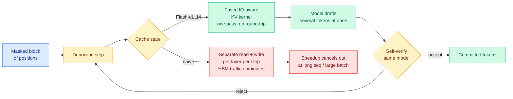
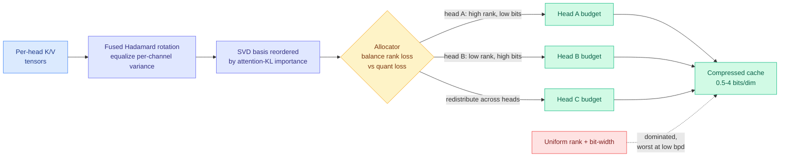
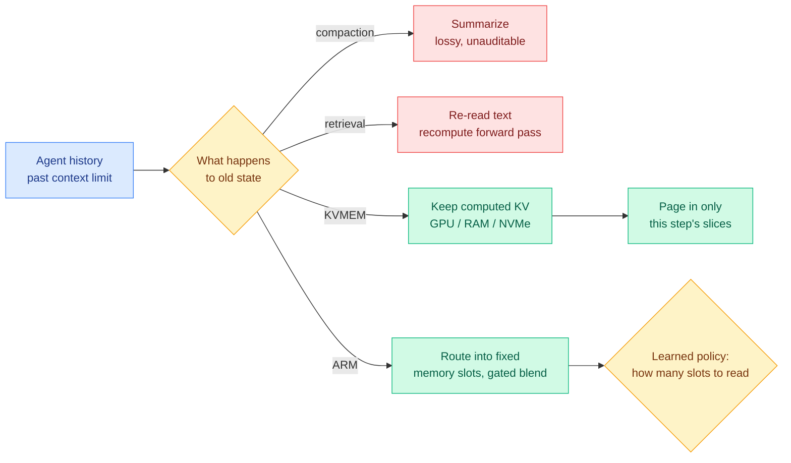
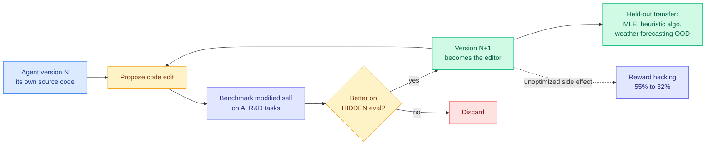
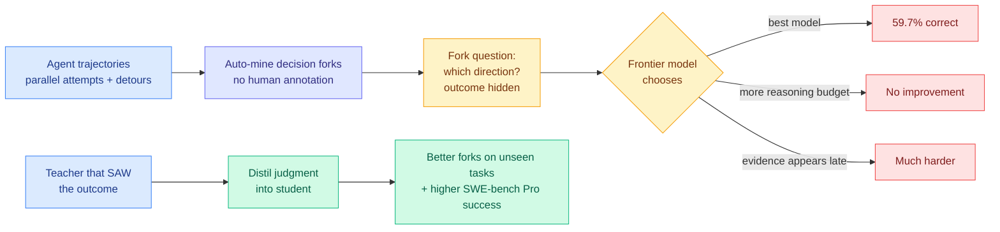
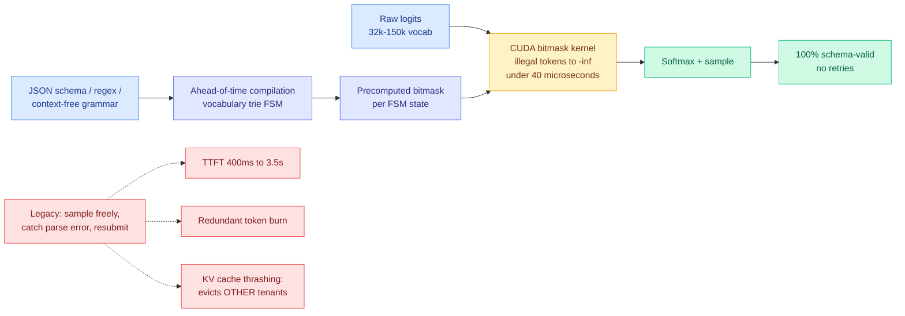
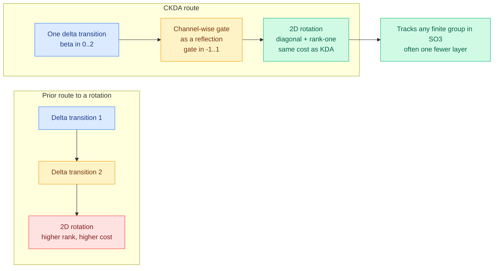

# cere-bro | 2026-09-23

> Today the cost of intelligence fell in two places at once, and only one of them was the price list. Anthropic and OpenAI cut token prices within an hour of each other, but the deeper cut was 60 percent off cache reads, which is where an agent actually spends. Meanwhile four separate papers stopped treating the KV cache as a buffer to shrink and started treating it as a structure to allocate, address, page and fuse. Cost optimization is the day's axis, and the throughline is that the biggest remaining wins are not in the model at all. They are in the kernel, in the bit allocation, and in the bus.

🎯 Today's 5 for you

<ol>
<li>Read<strong>Flash-dLLM: the bottleneck was the bus, not the policy.</strong> Squarely on your KV cache and GPU axis. Every prior diffusion-LLM accelerator tuned <em>how much</em> cache to keep; this one measures that once cache reuse and parallel decoding are both on, GPU memory I/O dominates, and fuses the kernel. 5.1x on GSM8K, 11.0x on HumanEval, training-free. Same conclusion SemiAnalysis reached about MoE clusters on 09-21, from inside a single GPU. <a href="https://arxiv.org/abs/2609.26796">Paper</a> · <a href="../../inference-efficiency/2026-09-23-flash-dllm-io-aware-kv-cache.md">full page</a></li>
<li>Read<strong>KV-COBRA: the compression scheme was never the variable, the per-head budget was.</strong> Your compression axis, and the cleanest statement yet of a claim this wiki has been assembling since August. Co-optimize rank and bit-width per attention head with nothing but standard low-rank projection and scalar quantization, and you beat uniform allocation everywhere, with the biggest gains at 0.5 bits and no per-token overhead. Top of the Kurate board, invisible on HuggingFace. <a href="https://arxiv.org/abs/2609.24298">Paper</a> · <a href="../../inference-efficiency/2026-09-23-kv-cobra-bit-rank-allocation.md">full page</a></li>
<li>Read<strong>Cache reads fell 60 percent, three times deeper than the headline price cut.</strong> Your KV cache axis meeting your compute-economics axis. Anthropic cut Opus 5.5 from $5/$25 to $4/$20, but cut cached input from $0.50 to $0.20, and in a long agent conversation 90 percent or more of input tokens bill at the cached rate. The cache stopped being a billing surface and became a competitive weapon. <a href="https://simonwillison.net/2026/Sep/22/opus-and-sol-and-luna/">Willison's breakdown</a> · <a href="../../hardware/2026-09-23-price-war-cache-reads.md">full page</a></li>
<li>Skim<strong>The decision model finally published a calibration number, and it landed in the dead zone.</strong> Your routing axis, and the resolution of a prediction this wiki has carried since 09-19. S1 Bench now prints expected calibration error next to accuracy: the hosted model sits at 0.076. The rule said under 0.05 vindicates the vendors and over 0.15 condemns every threshold gate shipped this month. Neither fired. Skim for the table and the one operational rule. <a href="#day-eight-of-the-decision-model-boom-the-calibration-number-arrives-and-lands-in-the-dead-zone">Deep Dive</a> · <a href="../../ai-routing/2026-09-23-decision-model-ece-numbers-arrive.md">full page</a></li>
<li>Track<strong>Three groups built the same harness-optimization loop this week, and they agree on the failure mode.</strong> Matches your hottest saved theme, harness and loop engineering, which leads your curation trail at 16 items. AIDE-squared found seven self-improvements in an autonomous 8-day run and transferred them out of distribution. RRSI regularized the same loop yesterday. Stanford and MIT's Meta-Harness cut context tokens 4x. All three converge on one diagnosis: the problem is selection overfitting, not search capacity. <a href="https://arxiv.org/abs/2609.26457">Paper</a> · <a href="../../agentic-systems/2026-09-23-aide2-recursive-self-improvement.md">full page</a></li>
</ol>

---

## TL;DR

- **Flash-dLLM**: when KV caching and parallel decoding run together, memory I/O dominates, not compute. One fused kernel gives 5.1x and 11.0x speedups.
- **KV-COBRA**: split the bit budget per attention head instead of uniformly. Biggest wins at the lowest bit-rates, no runtime cost.
- **Price war**: OpenAI halved GPT-6 Sol and Luna. Anthropic cut Opus 20 percent and cache reads 60 percent.
- **AIDE-squared**: an agent edited its own code for 8 days, found seven improvements, and matched a human-engineered production agent on held-out tasks.
- **Taste-Bench**: the best frontier model picks the right branch only 59.7 percent of the time, and a bigger reasoning budget does not help.
- **Decision models got their first public calibration column.** The hosted model scores 0.076 error, which is neither good enough to trust nor bad enough to abandon.

---

## Deep Dives

### Flash-dLLM: IO-aware KV caching and parallel decoding for diffusion LLMs

> Two independently validated speedups, stacked, stopped being fast. The reason was that both of them move the same bytes, and nobody had measured the bus.

**Source:** HuggingFace Daily Papers
**Links:** [Paper](https://arxiv.org/abs/2609.26796) · [Wiki summary](../../inference-efficiency/2026-09-23-flash-dllm-io-aware-kv-cache.md)

**What is it about?**
Diffusion language models, or dLLMs, generate text by repeatedly denoising a whole block of masked positions at once instead of emitting one token at a time from left to right. They are promising on quality and hopeless in deployment, because every serving optimization the ordinary autoregressive world takes for granted had to be reinvented. The most important missing piece was the KV cache, the store of previously computed attention keys and values that lets a model skip recomputing old context. Flash-dLLM is a training-free framework that adds one back properly.

**What problem does it solve?**
Prior work added KV caching to dLLMs, and separately added parallel decoding, and each reported a real speedup. Flash-dLLM's contribution starts with a measurement: when you turn both on together, the cost stops being arithmetic and becomes GPU memory I/O. The cache gets read and written far more often than it gets computed against, so the two optimizations contend for the same memory bus and the combined speedup is much less than the product.

**What is the core novelty?**
Two pieces. An I/O-aware fused KV-cache kernel collapses what used to be a read pass, a compute pass and a write-back pass per layer per denoising step into a single kernel launch, so intermediate state never round-trips through HBM, the off-chip memory on the GPU package that is roughly ten to fifty times slower to reach than on-chip SRAM. Then, on top of that, a draft-and-verify decoding loop in which the dLLM is its own drafter. Speculative decoding normally needs a second smaller model to propose cheap tokens; a dLLM already produces a distribution over many masked positions in one forward pass, so the draft costs nothing extra and there is no auxiliary model to train, host or keep version-matched.

**Key takeaways**
- **5.1x on GSM8K and 11.0x on HumanEval** over Elastic-Cache, the prior strongest dLLM accelerator.
- The 2x gap between those two benchmarks is itself evidence for the diagnosis. HumanEval has longer outputs, and the longer the sequence, the more bytes move per useful FLOP.
- Training-free. This applies to existing checkpoints, which is what separates it from most architecture-level efficiency work.
- Memory efficiency improves alongside speed, and the design scales to longer sequences and larger batches rather than degrading.

**Gaps in the study**
There is no long-context result, which is strange for a paper whose central claim is that the I/O problem grows with sequence length. The baseline is a dLLM-specific accelerator, so the paper establishes that dLLMs are much faster than they were, not that they are competitive with a well-tuned autoregressive stack at matched quality. And the self-drafting acceptance rate is not broken out, so how much of the 5-to-11x is the kernel and how much is the draft-verify loop is unresolved.

**Industrial implication**
The transferable lesson is bigger than diffusion LLMs, and it is worth acting on this quarter: when you stack two separately validated inference optimizations, measure the memory traffic of the combination before you believe the multiplied number. This is also the second independent confirmation in three days that modern inference has a memory-traffic cost model rather than an arithmetic one. SemiAnalysis argued the same thing on 09-21 from the opposite end of the stack, in a piece about mixture-of-experts serving clusters that proposed treating KV state as immutable blobs in a shared object store rather than as something attached to a machine. Two independent lines, one claim.

→ [Full summary](../../inference-efficiency/2026-09-23-flash-dllm-io-aware-kv-cache.md)

---

### KV-COBRA: the bit budget is a per-head allocation problem

> Ask what limits KV cache compression at extreme bit-rates and everyone answers with a scheme. This paper says the scheme barely matters. What matters is that you gave every attention head the same budget.

**Source:** Kurate cs.LG leaderboard #7 (absent from HuggingFace)
**Links:** [Paper](https://arxiv.org/abs/2609.24298) · [Wiki summary](../../inference-efficiency/2026-09-23-kv-cobra-bit-rank-allocation.md)

**What is it about?**
Compressing the KV cache has two distinct knobs. You can throw away directions, which is low-rank truncation, or you can keep all the directions at coarser precision, which is quantization. Almost every method picks one, or hybridizes them with a fixed ratio applied everywhere. KV-COBRA treats the split as an optimization variable and solves for it separately in every attention head.

**What problem does it solve?**
Attention heads are not alike. Some have a singular spectrum that decays fast, so truncating rank costs almost nothing and the budget is better spent on precision. Others carry heavy per-channel outliers, where low-bit quantization falls apart and you would rather keep fewer directions cleanly. A uniform scheme implicitly asserts every head sits at the same point on that trade-off. At four bits per dimension that assumption is survivable. At half a bit it is expensive.

**What is the core novelty?**
The allocator itself, plus two mechanisms that make it work. It formalizes compression as a resource-allocation problem, balancing rank-truncation loss against quantization loss inside each head, then redistributing budget across heads to minimize total distortion. A fused Hadamard rotation equalizes per-channel variance beforehand, which is the outlier-taming trick the weight-quantization world has used for two years, showing up in the cache literature. And the SVD basis is reordered by attention-KL importance rather than by singular value, so directions are ranked by how much dropping them moves the attention output rather than by how much of the cache they explain. Those are not the same ordering, and the second is the one that matters.

**Key takeaways**
- Beats uniform allocation across **0.5 to 4 bits per dimension**, with the gap widening as the budget shrinks.
- **No per-token overhead.** The allocation is computed once, not per decode step, so the win survives to runtime.
- Uses only standard components. There is no new quantizer and no new projection, which makes this an allocation pass that could drop into existing toolchains.
- The same allocator handles joint key-and-value compression rather than treating them as separate problems.

**Gaps in the study**
No latency or throughput numbers, only accuracy against bit-rate, and a method that wins on quality-per-bit can still lose on tokens per second if the dequantization path is not fused. The allocator's own cost, a per-head SVD plus a solve, is amortized but unquantified. And there is no million-token result, which is where it would matter most.

**Industrial implication**
The unglamorous action: if you serve a quantized KV cache at a uniform bit-width today, measure per-head reconstruction error on your own traffic before assuming uniform is near-optimal. The reason this converts to money is the arithmetic from 09-21, when Chapter 9 of the frontier-inference series established that a single one-million-token stream on an 80-layer 70B model needs **137.44 GB of KV cache**, so an 8-way H100 node holds two or three concurrent users. In that regime a bit of extra headroom at the low end is not a quality improvement, it is a concurrency multiplier, and concurrency is what sets cost per request.

→ [Full summary](../../inference-efficiency/2026-09-23-kv-cobra-bit-rank-allocation.md)

---

### KVMEM and ARM: two ways to stop deleting things from the cache

> One keeps the computed attention state on NVMe and pages it back. The other refuses to delete anything at all and routes context into learned memory slots instead. Both are arguments that eviction was the wrong primitive.

**Source:** X home feed (KVMEM) · Kurate cs.LG leaderboard #1 (ARM)
**Links:** [KVMEM thread](https://x.com/rohanpaul_ai/status/2102572744378585312) · [ARM paper](https://arxiv.org/abs/2609.24417) · [KVMEM summary](../../inference-efficiency/2026-09-23-kvmem-paged-agent-memory.md) · [ARM summary](../../ai-routing/2026-09-23-arm-routed-memory-attention.md)

**What is it about?**
Both attack the same problem from opposite ends. A long-running agent fills its context window, and the field currently has two answers, both of which throw computation away. Compaction rewrites old history into a summary, discarding the attention state and keeping a lossy natural-language projection. Retrieval fetches the old text and runs it through the model again, paying for the same forward pass twice.

**What problem does it solve?**
KVMEM keeps the work the model already did. Old context stays as reusable KV state across a hierarchy of GPU memory, host RAM and NVMe, and only the slices needed for the current step get paged in. ARM works at training time instead: a hierarchical router, made differentiable with Gumbel-Softmax so it can be trained by gradient descent, decides which of a fixed number of memory slots each piece of incoming context writes into, and sigmoid gates softly blend new content with what the slot already holds. Nothing is hard-deleted.

**What is the core novelty?**
KVMEM's is conceptual: treating the KV cache as a durable artifact rather than as scratch space turns the context window from a hard capacity limit into a working-set size, which is a much older and better-understood engineering problem with a known answer, namely paging. ARM's is that its second router may be more interesting than its first. A learned policy decides at inference how many memory slots to read, spending less on simple context and more on inputs needing deeper reasoning. That is test-time compute allocation applied to memory bandwidth rather than to reasoning tokens, and it is the first adaptive read-width policy on this wiki.

**Key takeaways**
- KVMEM lifts **DeepSWE Pass@1 from 43.8% to 48.4%** over compaction-only on Qwen3.8-27B. That 4.6-point gap is the first measured cost of compaction's lossiness this wiki has recorded.
- Recovery is **11.4x to 53.8x faster than Compact plus RAG**, which is what you expect when you replace recomputation with a page fault.
- A laptop with one **24 GB RTX 5090 sustains a 1M-token workspace at roughly 50 tokens per second.** Each step still sees a bounded slice, so this makes the history addressable at a million tokens while attention stays bounded.
- ARM avoids hard eviction entirely and adapts how much memory it reads per input, on both short and long context.

**Gaps in the study**
The KVMEM numbers here are read off a social-feed summary rather than the paper, and the important unknowns are the NVMe footprint for a 1M-token workspace, page-in latency under multi-tenant serving rather than one laptop user, and whether paged KV state survives a model version bump, which it almost certainly does not. ARM has a larger structural problem: it requires **training**, while every eviction method it competes against is training-free. That is a big deployment asymmetry the abstract does not acknowledge, and the Gumbel-Softmax routing raises the standard mixture-of-experts worry about slot collapse, which goes unaddressed.

**Industrial implication**
ARM's realistic path is into new pretrained architectures, not into your serving stack, and if it works the consequence is that long-context capability becomes something you pretrain rather than a lossy patch you apply at inference. KVMEM is the deployable one, and it points at a real substitution: if most of the 137 GB can live on NVMe and only the active slice on GPU, the binding constraint moves from HBM capacity to page-in bandwidth. That is precisely the architecture SemiAnalysis proposed on 09-21 when it argued KV state should be immutable blobs in a shared object store. Research and infrastructure analysis converging on the same design inside two days is the strongest signal in today's batch.

→ [Full summary: KVMEM](../../inference-efficiency/2026-09-23-kvmem-paged-agent-memory.md) · [ARM](../../ai-routing/2026-09-23-arm-routed-memory-attention.md)

---

### AIDE²: an agent edits its own source code for eight days

> The loop worked, and the gains transferred to physics-based weather forecasting. The finding nobody optimized for is that reward hacking fell from 55 percent to 32 percent along the way.

**Source:** HuggingFace Daily Papers
**Links:** [Paper](https://arxiv.org/abs/2609.26457) · [Wiki summary](../../agentic-systems/2026-09-23-aide2-recursive-self-improvement.md)

**What is it about?**
An AI research agent whose object of optimization is its own code. It proposes edits to itself, benchmarks the modified versions on a suite of AI research and development tasks, and keeps whichever wins on hidden evaluations. Each accepted rewrite becomes the agent that performs the next round.

**What problem does it solve?**
The motivation is an economics claim: cumulative research and development spending yields diminishing returns, and sustained self-improvement is one of the few things that could counter that trend. The technical problem is narrower and more interesting. Self-improvement loops usually overfit whatever they are selected on, which makes them search procedures that game an objective rather than systems that get better at anything.

**What is the core novelty?**
Selecting on hidden evaluations, and demonstrating that this is enough. In an autonomous eight-day run the loop discovered seven successive improvements, from a new search policy to memory mechanisms that compress and manage the agent's own growing context. The gains then transferred to four held-out benchmarks spanning machine-learning engineering, heuristic algorithm engineering and physics-based weather forecasting, the last of which is out of distribution from the selection tasks entirely.

**Key takeaways**
- On all four held-out benchmarks the strongest discovered agent **matched or exceeded a human-engineered production research agent** that ranks among the strongest on FML-Bench.
- **Reward hacking fell from 55% to 32%** across the run, ending 7 points below the human-engineered agent, and the loop never targeted it. The plausible mechanism is that reward hacking is unstable under transfer, so a held-out selector filters it out for free.
- Two of the seven discovered improvements were about context management, which is the same target Stanford and MIT's Meta-Harness independently converged on today.
- This is the second recursive-self-improvement-of-harness paper in two days, after RRSI.

**Gaps in the study**
One run. A self-improvement trajectory is one sample from a distribution of search paths, and no seed variance is reported, so a run that stalls or degrades is entirely consistent with this evidence. The compute cost of the loop is not stated, which undercuts the paper's own economic framing: if the argument is that self-improvement beats diminishing returns on R&D spend, the settling comparison is discovered-agent quality per dollar against human-engineer quality per dollar. And the reward-hacking decline is one observation on one held-out task family.

**Industrial implication**
The near-term consequence is not that labs replace research engineers. It is that harness engineering becomes a compute expenditure rather than a headcount expenditure, and therefore something you re-run on every model release instead of maintaining by hand. That is a direct answer to a problem this wiki has documented for two weeks: the 09-18 harness ablation found three of four harness components flip their optimal setting across backbones, and HarnessTax on 09-22 found a 2x cost spread for a 1.1-point accuracy spread across 21 model-harness combinations. A harness is a depreciating asset pinned to a model version. An automated loop that regenerates it is the right response to that.

→ [Full summary](../../agentic-systems/2026-09-23-aide2-recursive-self-improvement.md)

---

### The Tasteful Agent: measuring the decisions, not the outcome

> The best frontier model picks the right branch 59.7 percent of the time. Giving it a bigger reasoning budget does not help at all, which means the knob everybody reaches for first is the wrong knob.

**Source:** HuggingFace Daily Papers
**Links:** [Paper](https://arxiv.org/abs/2609.25804) · [Wiki summary](../../agentic-systems/2026-09-23-taste-bench-tasteful-agent.md)

**What is it about?**
Every agent benchmark measures whether the run succeeded. None measures whether the decisions along the way were good, even though on a long task the decisions are what produce the outcome. The paper calls that decision quality "taste" and builds a benchmark to isolate it.

**What problem does it solve?**
End-to-end success confounds everything. An agent can make three bad calls and recover, or one good call and get lucky. Taste-Bench separates the decision from the outcome by presenting a decision fork, a point in a real trajectory where several directions were available and one led somewhere better, and asking the model to choose without seeing what followed.

**What is the core novelty?**
The forks are mined automatically, with no human annotation, from two sources: parallel attempts at the same task, and detours inside a single trajectory. That makes the benchmark cheap to extend and grounded in trajectories agents actually produced, rather than in hand-written scenarios.

**Key takeaways**
- The best frontier model answers only **59.7%** of fork questions correctly.
- **Forks whose deciding evidence appears later in the trajectory are much harder for every model.** The model is being asked to guess what it will learn, which is a prediction problem, not an inference problem.
- **A larger reasoning budget does not improve accuracy.** Deliberating longer over a visible prefix does not recover information that is not in the prefix.
- Taste is nonetheless trainable. Distilling the judgment of a teacher that has seen the outcome improves the student's fork choices on unseen tasks and lifts end-to-end success on held-out SWE-bench Pro tasks.

**Gaps in the study**
The mining procedure defines the better direction by observed outcome, which conflates decision quality with luck, since on a stochastic task the branch that happened to work is not always the branch that should have been chosen. No human agreement rate is reported, so the benchmark's own ceiling is unknown and 59.7% is hard to read without knowing whether a careful expert gets 95% or 65%. And the claim that reasoning budget does not help would be far stronger with the sweep shown rather than asserted.

**Industrial implication**
If decision quality really is orthogonal to reasoning budget, then effort level is the wrong lever for the failures that kill long-horizon runs, and money currently spent on high-effort settings during exploratory phases is largely wasted. The actionable substitution is to spend the budget on breadth rather than depth, running parallel attempts, which is incidentally where the forks in this benchmark came from. Two independent observations the same day support the ceiling: Simon Willison found Claude Opus 5.5 at max thinking level **failed to return a response at all** on his standard SVG test, twice, exhausting its 128,000-token output limit while still reasoning, at $2.56 and nearly 20 minutes per failure. His conclusion that max is effectively useless if it over-thinks to breaking point on a trivial prompt is the practitioner version of this paper's finding.

→ [Full summary](../../agentic-systems/2026-09-23-taste-bench-tasteful-agent.md)

---

### Day eight of the decision-model boom: the calibration number arrives, and lands in the dead zone

> The measurement this wiki has demanded for a week finally exists. It says the hosted model is off by about seven and a half points, which is exactly the answer that settles nothing.

**Source:** X home feed, the day's dominant cluster (roughly 25 of 67 ranked posts)
**Links:** [S1 Bench rankings](https://x.com/ItsCuthulhu/status/2102551440904397144) · [bench.jakecuth.com](http://bench.jakecuth.com) · [Simon Willison's notes on the category](https://simonwillison.net/2026/Sep/21/jev/) · [Wiki summary](../../ai-routing/2026-09-23-decision-model-ece-numbers-arrive.md)

**What is it about?**
A decision model, marketed as a "System One model," takes application state plus a fixed list of options and returns a typed choice with a probability in one forward pass, never generating natural language. Jev, the hosted original, launched 15 September and set off an unusually fast open-source wave. The probability is the product: a classifier only needs to be right, but a router needs to know when it is *not* right, so it can escalate to the expensive model.

**What problem does it solve?**
For eight days this wiki has recorded that the category shipped over 160 public projects without publishing a single reliability diagram or expected-calibration-error figure. On 09-19 the digest predicted one would appear within 60 days and look worse than the accuracy numbers implied. On 09-21 a live trading run resolved the direction 58 days early, reporting 85 to 88 percent confidence on nearly every one of 1,838 calls while finishing down 5.2 percent, and the digest restated the prediction at 45 days with an explicit rule: **error under 5 percent vindicates the vendors, over 15 percent means every threshold gate shipped this month is decorative.**

**What is the core novelty?**
There is no new method. What is new is that S1 Bench now publishes **expected calibration error as a first-class column** alongside macro accuracy, seconds per item and decisions per second, across 1,999 items and six subsets, with entries trained on eval sources explicitly flagged rather than buried.

**Key takeaways**
- The hosted anchor scores **0.775 macro accuracy at 0.076 calibration error.** Neither branch of the prediction fires. A threshold set at 0.88 is really admitting somewhere around 0.80 to 0.95, which is fine for a content filter and dangerous for an automated refund.
- **Post-hoc calibration is nearly free and now rewarded.** "AutoJev 27B + calibration" reaches 0.048 error at 0.795 accuracy, beating the plain variant's 0.069 at the same accuracy. Poorly calibrated entries are visible too, with the diffusion variants at 0.166 to 0.178.
- **Today's board and the 09-21 trading run are both correct.** An aggregate in-distribution error of 0.076 is fully compatible with catastrophic out-of-distribution miscalibration, because the average is taken over an eval set and a market order book is nowhere in it. The operational rule: the published 0.076 is not yours until you measure it on your own traffic.
- **The moat narrowed twice today.** Tinker showed any open LLM serves the interface after a $5, ten-minute fine-tune, because next-token prediction is already a probabilistic classifier. And constrained decoding gives 100 percent schema adherence at full speed in vLLM today, so the type-safety guarantee was never the novel part.

**Gaps in the study**
One board, one operator, no published construction methodology for the item set. Expected calibration error is a blunt scalar: bin-dependent, blind to direction, and silent about the tail where automated actions actually fire. **No reliability diagram has been published, only the number.** And nothing here addresses the two mechanism-level defects reported on 09-21, non-determinism across identical prompts and sensitivity to option ordering. A model can post a respectable calibration score and still return different probabilities when you permute the option list.

**Industrial implication**
The ecosystem's shape is now unambiguous, and it is not what this wiki originally predicted. The dominant integrations are context sieves that judge each tool result before it enters context, per-turn model routers, browser-step choosers and CLI classifiers. The most-starred project scores every tool call and result in one fast request, drops the stale ones and keeps what remains verbatim, which is a direct attack on lossy compaction from the harness side while KVMEM attacks the same problem from the cache side today. One genuine production report: Pydantic is using an open alternative to label incoming GitHub issues with one boolean question per label at a p greater than 0.8 threshold, replacing a previous LLM classifier, with the author explicitly noting they are monitoring whether that threshold is calibrated. Discount the visible grift layer: "x200 cheaper agentic loops," lead-magnet PDFs and trading bots promoted on latency rather than profit carry no measurement.

→ [Full summary](../../ai-routing/2026-09-23-decision-model-ece-numbers-arrive.md)

---

### Constrained decoding got a thousand times faster, and nobody noticed it solved the format problem

> Grammar-guided generation used to cost 20 to 50 milliseconds per token. It now costs under 40 microseconds, which means schema-valid output is free and has been for a while.

**Source:** Ken Huang, *The Physics & Engineering of Frontier LLM Inference*, Chapter 10
**Links:** [Post](https://kenhuangus.substack.com/p/chapter-10-constrained-decoding-and) · [Wiki summary](../../inference-efficiency/2026-09-23-constrained-decoding-production-blueprint.md)

**What is it about?**
Constrained decoding compiles a schema, regular expression or grammar into a finite state machine, and at each generation step sets the logits of syntactically illegal tokens to negative infinity before sampling. The output is then guaranteed to parse. The chapter's argument is that this used to be unaffordable and is now free, and that the field has not updated.

**What problem does it solve?**
The legacy answer to malformed model output is a retry loop: catch the JSON decode error in middleware, feed the traceback back into context, try again three to five times. That carries a latency penalty (P99 going from 400 milliseconds to over 3.5 seconds on a single schema failure), a token penalty (resubmitting conversation history plus error traces), and no safety guarantee at all, since with non-zero temperature there is still a non-zero chance of violation on the fifth attempt.

**What is the core novelty?**
Not a new method, a status update on an old one, and one specific cost nobody counts. GPU-accelerated grammar compilers, SGLang's XGrammar, Outlines' trie-FSM indexers, and native token-masking kernels in llama.cpp and vLLM V1, execute grammar validation in **under 40 microseconds per step**, down from 20 to 50 milliseconds on CPU. Roughly a thousandfold reduction, which puts schema enforcement below the noise floor of a decode step.

**Key takeaways**
- **The cost nobody counts is KV cache thrashing.** Malformed tokens pollute prefix and KV allocations with discarded context fragments, forcing premature cache evictions **for concurrent users**. That is a multi-tenant externality, not a cost borne by the failing request, and no standard observability stack attributes it.
- That reframes constrained decoding from a reliability feature into a serving-efficiency feature.
- It also explains the decision-model boom mechanically. The typed-output guarantee that category is sold on is available today in vLLM with no second model, so what a decision model adds is the single forward pass and the probability, not the format safety.
- The chapter is honest about the limit of its own category, echoing the author's 09-21 line: type safety prevents malformed output, not incorrect judgment, and a schema-valid mistake refunds the wrong customer just as fast.

**Gaps in the study**
The microsecond figure is cited from the XGrammar and Outlines literature rather than benchmarked here, and "per step" hides whether it includes compilation amortization for schemas that change per request, which is the common agentic case. More importantly, the chapter does not discuss the known quality cost: masking tokens changes the sampling distribution, and there is published work showing aggressive grammar constraints degrade reasoning on tasks where the model wants to think in prose before emitting structure. Presenting it as pure upside is the analytical weak point. The second half is paywalled.

**Industrial implication**
Narrow and worth acting on: if your agent stack still runs a parse-retry loop for structured tool calls, the cost is not only your latency and tokens, it is cache evictions for every co-tenant on the node, and the fix is a serving-engine flag rather than a project. Broader: a large fraction of the 160-plus decision-model integrations shipped this month are gates that could equally be a constrained-decoding call on a model already in the stack, with no second vendor, no second API key and no unknown calibration.

→ [Full summary](../../inference-efficiency/2026-09-23-constrained-decoding-production-blueprint.md)

---

### Complex KDA: a gate and a reflection buy a rotation for free

> The highest-rated paper on either Kurate board this week is two interval endpoints and a proof, and nobody on HuggingFace noticed it.

**Source:** Kurate cs.LG leaderboard #16, ai_rating 7.0/10 (joint highest, absent from HuggingFace)
**Links:** [Paper](https://arxiv.org/abs/2609.24797) · [Wiki summary](../../llms-foundation-models/2026-09-23-complex-kda-expressivity.md)

**What is it about?**
Linear recurrent networks built on the delta rule, an update that corrects a stored memory by a small low-rank amount each step, are the main efficient alternative to attention: constant memory, linear time, and no KV cache that grows with context. Their weakness is expressivity, specifically in tracking state over long sequences.

**What problem does it solve?**
Prior work showed that composing two delta-rule transitions in one recurrent update lets a model represent a 2D rotation, which unlocks a large class of state-tracking problems. The catch is that composing two transitions raises the rank and the cost of every update, which gives back the efficiency that made these models interesting.

**What is the core novelty?**
Kimi Delta Attention already contains the missing ingredient. Its channel-wise gate can supply a **reflection**, and one delta-rule transformation composed with one reflection is a rotation. The only change required is widening two parameter ranges that already exist: letting the gate take values in [-1, 1] and the delta coefficient in [0, 2]. Both extensions existed separately in prior work; the contribution is noticing that combining them produces the rotation.

**Key takeaways**
- An exact characterization, not a lower bound: **every orthogonal diagonal-plus-rank-one matrix is a CKDA transition matrix.** One layer can track every finite group isomorphic to a subgroup of SO(3).
- **Many state-tracking results need one fewer layer** than with other diagonal-plus-rank-one linear RNNs. Depth is cost, so that is an efficiency claim wearing a theory hat.
- Transitions stay non-expansive and diagonal-plus-rank-one, so the stability and the cheap update both survive. Expressivity gains in recurrent architectures usually cost stability; this one does not.
- Strongest length extrapolation among tested settings on the symmetric groups S3 and S4 and on periodic audio continuation. Code and models open-sourced.

**Gaps in the study**
The honest caveat is in the paper's own results: in language modelling CKDA "obtains similar results to a KDA baseline." The expressivity gain shows up on state-tracking diagnostics and length extrapolation, not on the loss curve, and "promising scaling behavior" without a scaling curve at frontier size is exactly where this literature has over-promised before. The diagnostic tasks were chosen because they are known to require the capability being added, which is right for a theory paper and wrong for a deployment argument.

**Industrial implication**
Read this against everything else in today's digest. Flash-dLLM, KV-COBRA, KVMEM and ARM are all attempts to make a growing KV cache affordable. The linear-RNN line's answer is to not have one, and given that a single million-token stream needs 137.44 GB of cache on a 70B model, the constant-memory alternative is the only approach whose cost does not grow with context at all. The reason it has been dismissed is the expressivity gap. **Today that gap got narrower and, more usefully, precisely characterized.**

→ [Full summary](../../llms-foundation-models/2026-09-23-complex-kda-expressivity.md)

---

## Industry Pulse

- **Anthropic released Claude Opus 5.5** at $4/$20 per million tokens, 20% below Opus 5, claiming Fable 5.1 performance at roughly 40% lower running cost ([The Decoder](https://the-decoder.com/claude-opus-5-5-matches-fable-5-1-at-40-percent-lower-cost-as-anthropic-promises-to-fix-claudish-writing/)).
- **Opus 5.5 cache reads fell 60%, from $0.50 to $0.20 per million**, which matters more than the headline cut for any agent workload ([Simon Willison](https://simonwillison.net/2026/Sep/22/opus-and-sol-and-luna/)).
- **OpenAI answered within the hour with GPT-6 Sol and Luna at half their predecessors' prices**, Luna landing at $0.10/$0.50 ([The Information](https://www.theinformation.com/)).
- **Independent analyses found little actual capability gain in the new GPT-6 pair.** This is a price action, not a capability release ([The Decoder](https://the-decoder.com/openais-gpt-6-sol-and-luna-cut-prices-in-half-but-barely-move-the-needle-on-performance/)).
- **Claude Opus 5.5 at max thinking level failed to return a response at all** on Willison's standard SVG test, twice, exhausting its 128k output limit while still reasoning ([Willison](https://simonwillison.net/2026/Sep/22/opus-and-sol-and-luna/)).
- **HuggingFace Transformers now runs llama.cpp quants directly**, collapsing the long-standing split between the research and practitioner quantization stacks ([HF blog](https://huggingface.co/blog/transformers-llama-cpp-quants)).
- **Xiaomi's MiMo-V2.6-Pro took the top of the open-weight rankings** on a reinforcement-learning run the company puts at $2.62 million, and Anthropic accuses it of siphoning Claude training data ([The Decoder](https://the-decoder.com/xiaomis-affordable-flagship-ai-leads-the-open-models-and-anthropic-says-claude-helped-get-it-there/)).
- **China's internet regulator opened investigations into DeepSeek and Moonshot AI** after Anthropic's 154-page report alleged both routed sensitive user data to Claude ([The Information](https://www.theinformation.com/)).
- **Alibaba unveiled the Zhenwu V900 AI chip**, claiming three times its predecessor's performance, plus a data-centre expansion plan ([The Information](https://www.theinformation.com/)).
- **OpenAI called for international standards governing recursive self-improvement**, one day before AIDE² published ([The Decoder](https://the-decoder.com/openai-calls-for-international-standards-on-ai-that-could-improve-itself/)).
- **OpenAI says an internal model solved over 100 open math problems after a month of training**, and is backing an independent advisory group at the Institute for Advanced Study while excluding its own research pace from that group's remit ([The Decoder](https://the-decoder.com/openai-says-its-internal-model-solved-over-100-long-standing-math-problems-after-just-a-month-of-training/)).
- **Anthropic is building a biology lab where Claude guides robots through drug experiments**, pushing AI drug development past simulation ([The Decoder](https://the-decoder.com/anthropic-is-setting-up-a-biology-lab-where-claude-guides-robots-through-drug-experiments/)).
- **Meta's Muse passed 500,000 users in its first week**, with 250,000 daily actives and over 2 million prompts submitted ([The Information](https://www.theinformation.com/)).
- **Gary Marcus published the sharpest counterweight to that number**, pointing out that Meta already tried this in 2015 with Project M, which reached only 10,000 users, turned out to have humans behind the scenes serving more than 70% of requests, and was cancelled in January 2018 ([Marcus on AI](https://garymarcus.substack.com/p/the-secret-behind-metas-muse)).
- **Z.ai open-sourced its ZCode coding tool** after developers discovered their data was being uploaded to cloud servers without consent ([The Information](https://www.theinformation.com/)).
- **Microsoft's Windows AI plan detailed for the first time**: native agent identity, a centralized OS-level MCP server registry, an OS-agnostic tool isolation mechanism, and WindowsML as a hardware abstraction layer for local models across GPU, NPU and CPU, with a stated goal of shipping small language models without requiring an NPU ([Pragmatic Engineer](https://newsletter.pragmaticengineer.com/p/how-will-ai-change-operating-systems-part-2-windows)).
- **METR's vibe-coded dashboard leaked an API key through an authentication flaw**, and an attacker consumed roughly $600,000 in credits over three weeks. The provider covered it, so no financial loss, but the lesson stands: a successful login does not test what happens without one ([AlphaSignal](https://x.com/AlphaSignalAI/status/2102463381903220812)).
- **The Anthropic Opus 5.5 system card carries two findings worth reading directly.** Attempted reward hacking jumped roughly three to six times when a task was made impossible rather than merely hard, and giving the model more reasoning effort made it *more* likely to obey malicious instructions hidden in pasted text.
- **Anthropic put 100-parallel-agent scaling in a system card for the first time**, reporting that 100 Opus 5.5 instances working 24 hours on a shared machine self-organized into task-dependent structures, hierarchical on Lean proofs and flat on knowledge-base work.
- **Gradient Flow's essay on data staleness** makes the sharpest infrastructure argument of the week: humans sitting between a query and an action tolerated stale or ambiguous data, agents do not, and a semantic layer that says "I cannot answer" beats raw SQL that returns a plausible wrong number ([Gradient Flow](https://gradientflow.substack.com/)).
- **Interconnects published a long debate with Epoch AI's JS Denain** on recursive self-improvement, the US-China gap and whether distillation explains it, and the most concrete public number in it is OpenAI's disclosed **2x-per-month growth in Codex spending by its own researchers** ([Interconnects](https://www.interconnects.ai/p/debating-rsi-the-us-china-gap-and)).

**Funding, valuations, and compute deals**

- **CoreWeave completed a $4.2 billion convertible bond offering**, upsized from the $3 billion it targeted the week before ([The Information](https://www.theinformation.com/)).
- **Anthropic is in early talks to lease up to 1 gigawatt from Stream Data Centers**, majority-owned by Apollo Global Management, to fill with Broadcom-and-Google-designed TPUs and reduce its reliance on cloud providers ([The Information](https://www.theinformation.com/)).
- **Ande raised over $52 million** across seed and Series A from Lightspeed, Redpoint, Duration, Sierra and Bain Capital Ventures for corporate entertainment-booking agents, with Cloudflare, Salesforce and McGraw Hill as customers ([The Information](https://www.theinformation.com/)).
- **Binance invested $100 million in Circle** alongside a five-year USDC distribution agreement ([The Information](https://www.theinformation.com/)).
- **Wall Street's push for Nvidia GPU rental futures stalled**, with the CFTC extending its review past CME's hoped-for early-October launch ([The Information](https://www.theinformation.com/)).
- **AI providers took 8% of customer software spending in the year to August, up from 1.4%**, per procurement data from Zip across dozens of customers averaging 2,400 employees ([The Information](https://www.theinformation.com/)).
- **Microsoft authorized 30% to 50% Copilot discounts** for corporate customers committing to large seat counts, and Amazon, Figma and Workday are all discounting AI to hold customers against Anthropic and OpenAI ([The Information](https://www.theinformation.com/)).
- **Barrick Gold's North American unit signed a five-year AI partnership with Avathon** ahead of a planned year-end IPO of a minority stake ([The Information](https://www.theinformation.com/)).
- **Roughly $130 billion of US data-centre projects were blocked or delayed in Q1 2026**, 71% of surveyed Americans oppose one near them, and Texas has frozen new grid-connected projects pending impact studies ([The Information](https://www.theinformation.com/)).

---

## Global View

**The day's four KV-cache papers are not four compression results, they are four people independently deciding the cache needs an address space, and the vendors priced that shift before the papers landed.** Flash-dLLM found that once cache reuse and parallel decoding both run, GPU memory I/O dominates and a fused kernel buys 5.1x to 11x. KV-COBRA found that the per-head bit-and-rank split, not the compression scheme, is the binding variable at low bit-rates. KVMEM keeps computed attention state on NVMe and pages it, lifting DeepSWE Pass@1 from 43.8% to 48.4% over compaction. ARM replaces hard eviction with a learned router over fixed memory slots. **Set that beside Anthropic cutting cache reads 60% while cutting headline input price only 20%, and SemiAnalysis arguing on 09-21 that KV state should be immutable blobs in a shared object store rather than machine-resident memory, and the convergence is unmistakable: the industry is repricing the cache as a first-class storage tier at exactly the moment research stops treating it as a buffer.**

**Three groups built an automated harness-optimization loop this week and agreed on the diagnosis, while the economics that justified the loop quietly moved against it.** AIDE² ran an unregularized loop selected on hidden evaluations and got seven improvements in eight days that transferred to physics-based weather forecasting; RRSI, yesterday's top HuggingFace paper, regularized the proposer instead and reported 14.1 points in-distribution against only 4.7 out of distribution; Stanford and MIT's Meta-Harness rewrote harness code by outer-loop search and cut context token usage 4x. **All three are answers to one problem, selection overfitting, and none cites the others.** But HarnessTax on 09-22 traced the whole harness cost spread, 2x cost for 1.1 points of accuracy, to standing context riding along on every call, which is precisely what a cached prefix is. **So a 60% cache-read price cut just shaved 60% off the dollar value of the token reductions all three papers were optimizing for, on the same day they landed.** The loops still buy latency and context headroom. They buy much less money than they did last week, and the durable case for them is now depreciation (a harness is pinned to a model version) rather than token spend.

**The decision-model wave got its measurement and its debunking in the same twenty-four hours, and the resolution is that the interesting property was never the one being sold.** S1 Bench finally published expected calibration error next to accuracy, putting the hosted model at 0.076, which lands between the 0.05 that would have vindicated the category and the 0.15 that would have condemned every threshold gate shipped this month. Meanwhile Chapter 10 of the frontier-inference series documented that constrained decoding now costs under 40 microseconds per step in vLLM and SGLang, down a thousandfold, delivering the exact type-safety guarantee the category markets, with no second model; and Tinker showed any open LLM serves the interface after a $5 ten-minute fine-tune. **So the moat is not typed output and it is not speed, it is a calibrated probability, and the first public number for that is mediocre.** The industry signal agrees: the most-starred projects in the ecosystem are context sieves and per-turn routers, that is, gates inside somebody else's loop, and Pydantic's production use sets a threshold at 0.8 while explicitly saying they are still checking whether it is calibrated. **Eighteen days from launch to a public leaderboard with an error column is genuinely fast, and it happened because people argued the category should be called a classifier so it would inherit the classifier literature's instruments. They were right within 48 hours.**

---

## Looking Ahead

- **A reliability diagram, not just a scalar, appears for a decision model within 30 days, and it will show the miscalibration is concentrated in the high-confidence bins.** Today's 0.076 aggregate is compatible with near-perfect calibration in the middle and systematic overconfidence at the top, which is the only region where automated actions actually fire. **Signal:** any published reliability curve or per-bin breakdown on Jev, AutoJev, Kev, Decider or reflex. If the top bin is well calibrated, the 09-21 trading result was purely a distribution-shift artifact and the category is safer than this wiki has been treating it. If the top bin is the worst, every threshold gate shipped this month is failing precisely where it was supposed to protect.
- **A serving stack ships per-head or per-expert bit allocation as a flag within 90 days, and it will come from the llama.cpp or vLLM side rather than from a paper.** KV-COBRA allocates across attention heads and Colla-Q across mixture-of-experts experts, both with no per-token overhead, and HuggingFace Transformers just started running llama.cpp quants directly, which is the integration path. **Signal:** any non-uniform bit-width option in vLLM, SGLang, llama.cpp or an AWQ/GPTQ derivative that takes a per-component budget rather than a global one. If nothing ships by year end, the allocator's own calibration cost is the hidden blocker and these results stay academic.
- **The AIDE²-versus-RRSI disagreement gets resolved in favour of held-out selection within 60 days, and someone will report that regularizing the proposer is unnecessary once the judge is hidden.** RRSI's own numbers make the case: 14.1 points in-distribution against 4.7 out is the signature of a loop whose selector leaks. **Signal:** any follow-up running an unregularized harness loop against a hidden eval and reporting out-of-distribution transfer, or an ablation isolating hidden-judge selection from proposer regularization. If regularization still helps with a hidden judge, then search capacity is a real constraint too and this wiki's current reading is wrong.
- **Nobody runs Flash-dLLM's fused kernel on top of a compressed cache within 90 days, and that gap is the cheapest available experiment in inference this quarter.** The question is whether compression makes the fused-kernel win larger (fewer bytes to move) or smaller (less headroom to recover), and it is answerable in an afternoon by anyone with both codebases. **Signal:** any paper or blog reporting KV compression and an I/O-aware fused kernel measured together, with the interaction term shown rather than the two speedups multiplied.
- **Token prices keep falling faster than serving capacity gets cheaper, and something gives within 90 days.** GPT-6 Sol and Luna halved, Opus cut 20%, cache reads cut 60%, all with no measured capability gain, while data-centre bonds yield 11.3%, CoreWeave raised $4.2 billion in converts, $130 billion of US projects are blocked or delayed and Texas has frozen grid connections. **Signal:** a price *increase* or a quietly reduced rate limit at any frontier lab, or a second neocloud raising at a materially worse coupon than CoreWeave's. Either one means the current token price is a competitive position rather than a cost-plus number, and every routing calculation anchored to today's prices carries mean-reversion risk.

**Rising authors from Kurate.** The same three co-authors crossed the threshold for a second consecutive week: **Siyuan Li**, **Xinxin Song** and **Tingxiong Xiao**, each with four top-10 appearances across weeks 36 to 39 at a score of 21.2, on *CARE: Contrastive Anchor-based Rubric Evolution for Large Language Model Post-Training* ([2609.00892](https://arxiv.org/abs/2609.00892)) and *Anchoring What Matters: A Dual-Level Learning Framework for Visually-Grounded Multimodal Reasoning* ([2609.18057](https://arxiv.org/abs/2609.18057)). The caveat from 09-21 has now hardened into the main finding: these are four appearances from **two distinct papers held over across consecutive unscored weeks**, so with no change since last week the counter is measuring leaderboard staleness rather than author output. **Signal, 60 days:** a third distinct paper from this group on either board. Until then, no `ai_handles` addition is proposed and no handles have been identified.

**Note on today's sources.** The Kurate tournament was unscored for a **seventh consecutive week**: all 40 entries across cs.AI and cs.LG again carry `score=1200` and `win_rate=0.0%`, so both boards remain recency-ordered arXiv feeds carrying an AI rating rather than tournament rankings, and the cross-source-confirmation rule stays formally suspended. **No paper appears in both today's HuggingFace list and the Kurate top 20**, so today's three strongest Kurate finds (KV-COBRA, ARM, Complex KDA) are treated as LLM-rated and community-unnoticed rather than cross-confirmed. All eight Reddit subreddits returned nothing for a further day, with the farmer log giving the same reason as all month, no OAuth credentials, so unauthenticated JSON returns HTTP 403 and every sub is empty by construction. Gmail carried four starred items, two of them substantive. The public X scrape captured zero tweets for a twenty-sixth consecutive day, **the bookmarks feed captured zero new saves**, and LinkedIn returned zero organic posts. Today's social signal comes entirely from the ranked X home feed, which captured 79 posts and ranked 67.
