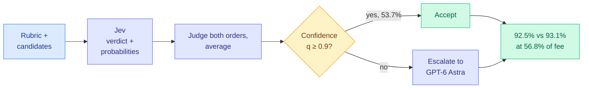
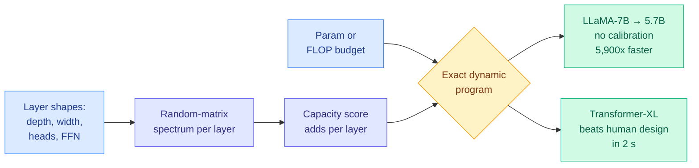
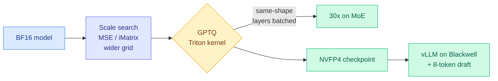
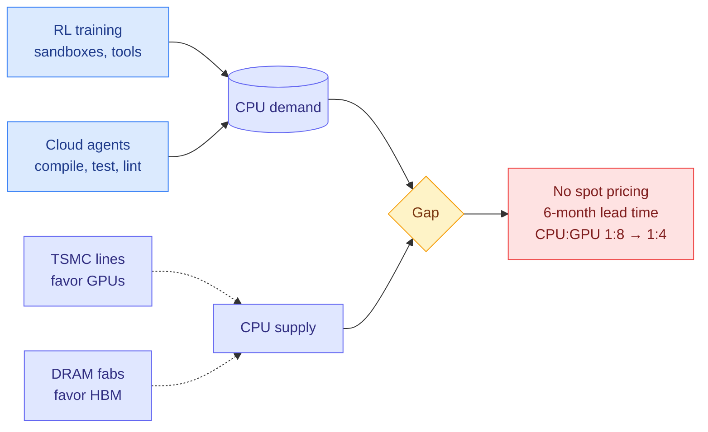
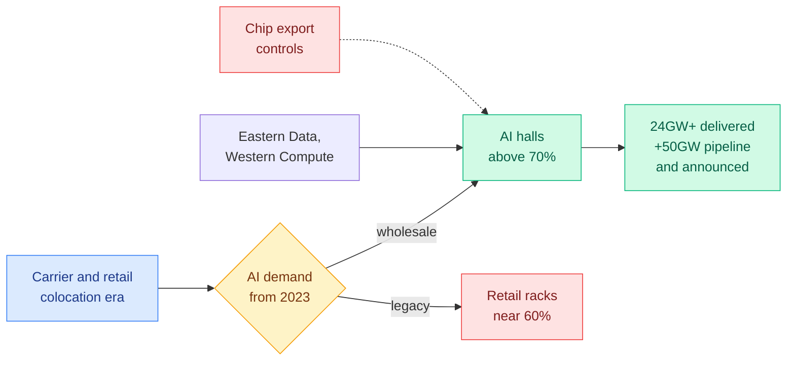
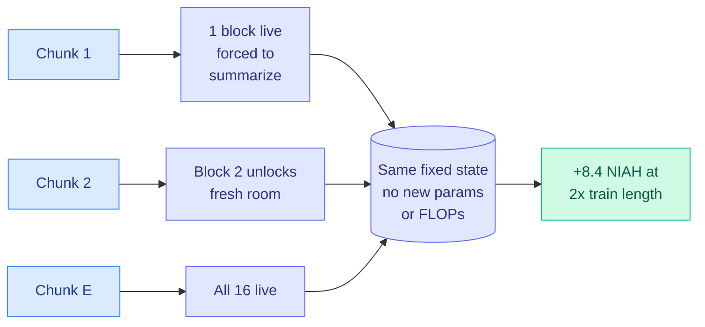
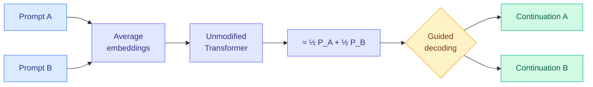
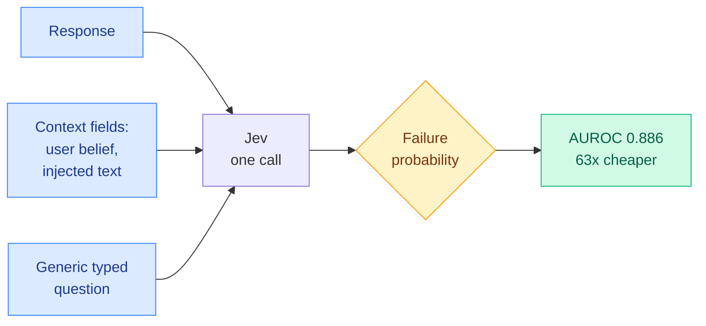

# cere-bro | 2026-09-25

> The day's cost savings come from allocation, not new models. A cheap judge answers when it is confident and escalates when it is not, and keeps 99% of frontier accuracy for about half the fee. A pruning score picks a 5.7B model out of LLaMA-7B from the architecture spec alone, with no calibration data. The quantization pass itself got 15 to 30 times faster. Meanwhile the hardware bill keeps growing: CPUs are now as hard to rent as GPUs, because agents and RL training run their tools on them.

🎯 Today's 5 for you

<ol>
<li>Read<strong>JEV-as-a-Judge.</strong> A CMU routing result framed as an evaluation paper. A decision model judges first, and uncertain cases escalate to GPT-6. You keep 92.5% vs 93.1% accuracy at 56.8% of the fee. Read it for the failure: confidence stops working on well-written wrong answers. <a href="https://arxiv.org/abs/2609.26550">Paper</a> · <a href="../../ai-routing/2026-09-25-jev-as-a-judge-confidence-cascade.md">Wiki summary</a>.</li>
<li>Read<strong>Neural Spectral Capacity.</strong> A closed-form capacity score computed from layer shapes alone, with no weights and no data. An exact solver prunes LLaMA-7B to 5.7B with no calibration set, 5,900x faster than the best training-free baseline. It is a new pruning family with almost no upvotes. <a href="https://arxiv.org/abs/2609.23087">Paper</a> · <a href="../../inference-efficiency/2026-09-25-neural-spectral-capacity-calibration-free-pruning.md">Wiki summary</a>.</li>
<li>Read<strong>The CPU shortage.</strong> CPU spot pricing has vanished, server orders take six months, and the CPU-to-GPU ratio has gone from 1:8 to 1:4. The cause is agents and RL training running their tools on CPUs, so harness efficiency now shows up as a hardware cost. <a href="https://newsletter.pragmaticengineer.com/p/the-pulse-a-new-trend-of-cpu-shortages">Post</a> · <a href="../../hardware/2026-09-25-cpu-shortage-agents-and-rl.md">Wiki summary</a>.</li>
<li>Skim<strong>LLM Compressor v0.14.0.</strong> GPTQ rewritten as a Triton kernel: 15x faster, and 30x on MoE models where layers share a shape. The observers also find better NVFP4 scales. Red Hat pairs a GLM-5.3 NVFP4 checkpoint with a speculator. Skim the release notes. <a href="https://github.com/vllm-project/llm-compressor/releases/tag/0.14.0">Release</a> · <a href="../../inference-efficiency/2026-09-25-llm-compressor-v0-14-triton-gptq.md">Wiki summary</a>.</li>
<li>Skim<strong>SemiAnalysis China Datacenter Model.</strong> China has 24GW+ of datacenter capacity, more than EMEA. BAT capex doubled to $20B a quarter with negative free cash flow at all three. The limit is chips, not buildings. <a href="https://newsletter.semianalysis.com/p/the-chinese-ai-infrastructure-boom">Post</a> · <a href="../../hardware/2026-09-25-semianalysis-china-datacenter-model.md">Wiki summary</a>. Skip the superposition paper's "two outputs per pass" framing for now. It has not been benchmarked against plain batching.</li>
</ol>

---

## TL;DR

- **JEV-as-a-Judge**: a cheap decision model judges first, and unsure cases go to GPT-6. It keeps 99% of the accuracy for about half the cost.
- **Neural Spectral Capacity**: score an architecture from its layer shapes alone. It prunes LLaMA-7B to 5.7B with no calibration data.
- **LLM Compressor v0.14**: the standard quantization pass is now 15 to 30 times faster. Requantizing a model becomes cheap enough to do often.
- **CPU shortage**: agents and RL training run their tools on CPUs. Cloud CPU spot pricing is gone and server orders take six months.
- **Proteus**: open a fixed memory to the context one block at a time. It adds 8.4 retrieval points at long range, at no extra cost.
- **Anthropic signs $11.6B with Akamai**: its compute commitments reach $517B in 11 months.

---

## Deep Dives

### JEV-as-a-Judge: Accept When Confident, Escalate When Unsure

> Decision-model confidence turns out to be a usable routing signal. It sends half the judging traffic to a model costing 0.36% as much, and it fails exactly where the wrong answer is better written.

**Source:** X home feed ([@askalphaxiv](https://x.com/askalphaxiv/status/2103368968014848400)), #13 on alphaxiv trending
**Links:** [Paper](https://arxiv.org/abs/2609.26550) · [Wiki summary](../../ai-routing/2026-09-25-jev-as-a-judge-confidence-cascade.md)

**What is it about?**
LLM-as-a-judge means using a strong model to grade other models' answers. It is expensive at scale. A CMU team tested TypeSafe's Jev, a decision model (a model that returns a typed choice plus probabilities in one forward pass, with no generated text). They compared it against sixteen generative and reward-model judges, with blinded human adjudication.

**What problem does it solve?**
Until now, the cost question and the trust question were studied separately. Cheap judges were benchmarked on accuracy. Nobody asked whether a cheap judge's own confidence tells you when to stop trusting it. This paper measures accuracy, confidence and fee together.

**What's the core novelty?**
The routing rule is simple. Take q, the largest probability Jev assigns to any label. Above a threshold, accept Jev's verdict. Below it, pay for GPT-6. For pairwise comparisons, Jev judges both orderings, and the two sets of probabilities are aligned and averaged before gating. That also cancels position bias. The threshold is fit on 96 pilot pairs and then frozen for a 510-pair held-out test.

**Key takeaways**
- On ordinary preference (RewardBench), Jev scores 92.2% against GPT-6 Astra's 93.5%, at 0.36% of the fee.
- The gap opens where judging means checking a derivation (JudgeBench: 78.6% vs 93.1%) or resisting a better-written wrong answer (RM-Bench hard pairs: 74.8% vs 94.6%).
- At τ = 0.9 the cascade accepts 53.7% of pairs and scores 92.5% against 93.1%, paying 56.8% of GPT-6's fee.
- The threshold does not transfer. A frozen policy with a different fallback accepts 81% of pairs but loses 2.35 points.

**Gaps in the study**
The style-adversarial RM-Bench pairs are exactly where Jev's confidence stops identifying errors. So the gate fails on the failure mode that matters most. Fees are list prices, Jev is proprietary, and the headline rests on 510 held-out pairs.

**Industrial implication**
This is the cascade pattern the wiki's [routing concept page](../../ai-routing/llm-routing.md) has been circling for two weeks, now with a held-out number. Anyone running LLM judges on every eval item can cut that bill roughly in half this quarter. They need to validate the threshold on their own traffic and add a length or style check to the gate.

→ [Full summary](../../ai-routing/2026-09-25-jev-as-a-judge-confidence-cascade.md)

---

### Neural Spectral Capacity: Measuring and Designing Architectures from Network Specification Alone

> You can pick the best 5.7B pruned model out of LLaMA-7B without loading a single weight or seeing a single token of data.

**Source:** HuggingFace
**Links:** [Paper](https://arxiv.org/abs/2609.23087) · [Wiki summary](../../inference-efficiency/2026-09-25-neural-spectral-capacity-calibration-free-pruning.md)

**What is it about?**
Parameter count and FLOPs measure how big a network is. They do not measure how well its capacity is spread across depth, width, heads and feed-forward size. Two designs with the same parameter count get the same score and behave differently. Neural Spectral Capacity (NSC) is a single number built from the singular values of each weight matrix.

**What problem does it solve?**
Architecture design and structured pruning (removing whole heads, channels or layers) are both decisions about allocating capacity under a budget. Current pruners need calibration data or activation statistics to make them. Training-free architecture proxies need black-box search. Neither gives a guarantee.

**What's the core novelty?**
At standard random initialization, the Marchenko-Pastur law (the known singular-value distribution of a random matrix) gives each weight matrix's spectrum from its shape alone. So NSC is computable from the spec, with no model instantiated. Because it adds up layer by layer, an exact dynamic program finds the global maximum under a budget in seconds on a CPU.

**Key takeaways**
- On FlexiBERT pairs whose parameter counts differ by under 10%, NSC ranks true performance at Kendall τ = 0.505. Parameter count collapses to 0.082.
- It finds a Transformer-XL architecture on WikiText-103 that beats the human-designed baseline, in 2 seconds.
- It prunes LLaMA-7B to the best 5.7B model across eight commonsense tasks, with no calibration data, about 5,900x faster than the strongest training-free proxy.

**Gaps in the study**
NSC scores capacity at random initialization, which is what an allocation *could* hold, not what training used. The abstract does not compare against activation-aware pruners such as Wanda or SparseGPT at equal size, or say whether recovery fine-tuning was needed. LLaMA-7B is an old target, and only commonsense tasks are reported.

**Industrial implication**
If it holds on modern models, NSC becomes the budget-setting step before any pruning pass. It would decide how much each layer keeps before an activation-aware method decides which weights. The obvious test is MoE and hybrid models, where the open question is how many experts to keep and what attention-to-linear ratio to use. [GeoPair (09-24)](../../inference-efficiency/2026-09-24-geopair-cross-layer-factorization.md) also framed compression as capacity allocation, but used trained weights to share structure across layers. NSC does the allocation step with no weights at all.

→ [Full summary](../../inference-efficiency/2026-09-25-neural-spectral-capacity-calibration-free-pruning.md)

---

### LLM Compressor v0.14.0: GPTQ in Triton, and NVFP4 stacked with a speculator

> Nobody changed a model, and the cost of quantizing one fell by an order of magnitude.

**Source:** X home feed ([@RedHat_AI](https://x.com/RedHat_AI/status/2102804405905175020))
**Links:** [Release notes](https://github.com/vllm-project/llm-compressor/releases/tag/0.14.0) · [GLM-5.3-NVFP4](https://huggingface.co/RedHatAI/GLM-5.3-NVFP4) · [Wiki summary](../../inference-efficiency/2026-09-25-llm-compressor-v0-14-triton-gptq.md)

**What is it about?**
LLM Compressor is the vLLM project's quantization toolkit. GPTQ is its standard post-training quantization method. It rounds weights to low precision one layer at a time and uses a Hessian estimate (a second-order map of how much each weight matters to the loss) to push the rounding error onto weights it has not rounded yet.

**What problem does it solve?**
GPTQ is accurate and slow. For large MoE models (mixture-of-experts, where each token passes through a few of many expert sub-networks), a quantization run is a real job. That makes teams quantize once per release and live with it.

**What's the core novelty?**
A Triton GPTQ kernel, about 15x faster end to end. Layers with the same shape are batched together, which reaches about 30x on MoE models where one expert shape repeats hundreds of times. Hessian offloading was removed, and a wider grid search in the scale observers finds better per-block scales for NVFP4 (NVIDIA's 4-bit floating-point format for Blackwell).

**Key takeaways**
- About 15x end-to-end GPTQ speedup, up to 30x on MoE, and 1.5x to 2x even on the old eager path.
- The expanded MSE and iMatrix observers beat GPTQ for NVFP4 on internal benchmarks, with a 10x faster Triton search kernel.
- REAP expert pruning now runs distributed, and model-free PTQ adds KV-cache quantization support.
- Red Hat's GLM-5.3-NVFP4 recovers 95%+ accuracy and ships with an 8-token speculator for vLLM. The 4-bit weights cut bytes per token and the speculator cuts sequential steps, so the two gains compound.

**Gaps in the study**
All speedups are the project's own numbers. The NVFP4 quality claim is "internal benchmarks." There is no end-task accuracy comparison between the new kernel and the old path.

**Industrial implication**
[Disaggregated Quantization (09-24)](../../inference-efficiency/2026-09-24-disaggregated-quantization-prefill-decode.md) argued that prefill and decode each want their own quantized checkpoint. It raised 1-bit decoders by 32 to 35 points on MMLU-Pro. The obvious objection was the cost of producing and managing two checkpoints per model. A 15x to 30x cheaper quantization pass removes half of that objection. Expect per-phase and per-workload checkpoints to appear on HuggingFace next to standard quants.

→ [Full summary](../../inference-efficiency/2026-09-25-llm-compressor-v0-14-triton-gptq.md)

---

### The Pulse: a new trend of CPU shortages

> The RL and agent boom created a second hardware shortage, and this one is in the CPUs.

**Source:** The Pragmatic Engineer (Gmail starred)
**Links:** [Post](https://newsletter.pragmaticengineer.com/p/the-pulse-a-new-trend-of-cpu-shortages) · [Wiki summary](../../hardware/2026-09-25-cpu-shortage-agents-and-rl.md)

**What is it about?**
Gergely Orosz reports from a dinner of CTOs and infrastructure leads, plus interviews with turbopuffer's CEO, an inference-provider VP, and Anthropic's Claude Platform engineering lead. Cloud CPUs have become hard to buy.

**What problem does it solve?**
Until now, the wiki's compute-scarcity story was about GPUs and HBM (the stacked high-bandwidth memory on a GPU package). This essay names the mechanism behind a CPU shortage. It is not consumer demand. It is AI workloads that run ordinary software.

**What's the core novelty?**
The demand side is two AI workloads. RL training has to execute the tools the model is learning to use, such as search, code execution and tests. Agents now run on cloud instances, not laptops, and compile, test and lint there. The supply side is squeezed twice. TSMC gives its lines to GPUs, and DRAM makers give wafers to HBM, which CPU servers indirectly need.

**Key takeaways**
- CPU spot pricing, once up to 90% off list, has effectively disappeared. Some reservations are refused.
- Server orders take about six months instead of one to two weeks, at 10% to 20% higher prices.
- The datacenter CPU-to-GPU ratio moved from 1:8 to about 1:4 and could reach 1:1.
- A large inference provider says it is at the limit of both GPU and CPU capacity its clouds will sell, even at the longest leases.

**Gaps in the study**
It is interview-based, with no provider-level numbers or regional breakdown. Paid readers saw it two weeks ago.

**Industrial implication**
Agent harness efficiency now has a hardware price. Every full test run, idle sandbox and redundant tool call competes with RL training for the same scarce CPUs. That makes selective test running, cached builds and stale-tool-output pruning cost levers in the same class as KV-cache compression. There is also a tension with the 09-24 offload papers. Memory Attention and LM-CXD both move bytes from HBM onto host DRAM or flash, and host DRAM is the other thing in short supply.

→ [Full summary](../../hardware/2026-09-25-cpu-shortage-agents-and-rl.md)

---

### SemiAnalysis: The Chinese AI Infrastructure Boom

> "China is empty" was half right. Legacy retail racks sit near 60% full, while the AI halls refill above 70% as fast as they are built.

**Source:** SemiAnalysis (RSS)
**Links:** [Post](https://newsletter.semianalysis.com/p/the-chinese-ai-infrastructure-boom) · [Wiki summary](../../hardware/2026-09-25-semianalysis-china-datacenter-model.md)

**What is it about?**
SemiAnalysis extends its building-level datacenter model to China, covering 1,000+ facilities across 60+ operators. It is a free preview of a paid product.

**What problem does it solve?**
Published estimates of China's datacenter capacity differed by 15x. The biggest tenant, ByteDance, files no public accounts, and most primary sources are in Chinese. So the market fell back on "China is big" and "China is empty."

**What's the core novelty?**
Bottom-up tracking finds a two-speed market. Overbuilt legacy retail capacity coexists with an AI capacity shortage. That explains how high vacancy and hyperscale AI demand can both be true.

**Key takeaways**
- China has over 24GW, against the US at 56GW, APAC ex-China at ~15GW and EMEA at ~14GW (2026 year end). Another ~20GW is dated pipeline and ~30GW announced.
- BAT (Alibaba, Tencent, Baidu) capex hit $20B in 2Q26, more than double year on year. All three posted negative free cash flow for the first time.
- ByteDance occupies about a fifth of delivered capacity and rents nearly all of it.
- 100MW facilities are routinely delivered in under 12 months. The 15th Five-Year Plan's grid spending rises another 40%, to over ¥5T ($746B).

**Gaps in the study**
The per-tenant detail, AI-specific capacity and accelerator counts are behind the paywall. Gigawatts of IT power say nothing about how much of it holds current-generation chips.

**Industrial implication**
China and the West have opposite bottlenecks. [ClusterMAX 3.0 (09-24)](../../hardware/2026-09-24-semianalysis-clustermax-3.md) opened with "GPU supply has gone to zero" for Western clouds, which have chips but not enough power or buildings. China has abundant power and buildings but limited chips. That makes efficiency work on the chips China can buy a direct capacity lever there. It is part of why GLM 5.3 and Kimi K3 keep arriving as quantization targets.

→ [Full summary](../../hardware/2026-09-25-semianalysis-china-datacenter-model.md)

---

### Proteus: Incremental Memory Activation for Long-Context Sequence Modeling

> A fixed-size memory works better if it doesn't hand you the whole notebook on page one.

**Source:** X home feed ([@reza_byt](https://x.com/reza_byt/status/2103163045866262650)), NeurIPS 2026
**Links:** [Paper](https://arxiv.org/abs/2608.16844) · [Author thread](https://rezabyt.github.io/threads/proteus_thread.html) · [Wiki summary](../../llms-foundation-models/2026-09-25-proteus-incremental-memory-activation.md)

**What is it about?**
Linear-time attention models (Titans, Comba, SWLA, Hope-Attention) replace the transformer's growing KV cache (the stored keys and values of every past token) with a fixed-size recurrent state. That is why they scale. The state also fills up, which is why they lose at long range.

**What problem does it solve?**
Every model in this family exposes its whole state from the first token. Early tokens spread across capacity they do not need. Later tokens arrive to a full state and can only overwrite.

**What's the core novelty?**
Split the memory into 16 blocks and unlock one more every N/16 tokens. Locked blocks are neither read nor written. The state never grows. Only the live fraction changes, on a fixed schedule.

**Key takeaways**
- No extra parameters or compute. It drops into four different architectures unchanged.
- +0.37 to +1.05 average accuracy on language modeling and commonsense tasks.
- Up to +8.4 needle-in-a-haystack points at twice the training context length.
- The ablation shows a sweet spot. Perplexity improves up to 16 blocks and gets worse at 32, where the early bottleneck is too tight.

**Gaps in the study**
The schedule assumes you roughly know the sequence length in advance. Gains at short context are under a point. No frontier-scale result is shown.

**Industrial implication**
Proteus is a cousin of [Memory Attention (09-24)](../../llms-foundation-models/2026-09-24-memory-attention-token-indexed-values.md), which replaced the value projection with a per-token lookup table. Both argue the default design wastes capacity it never needed. It contrasts with [ARM (09-23)](../../ai-routing/2026-09-23-arm-routed-memory-attention.md), where a learned router decides which memory slot each piece of context writes to. Proteus schedules by position with no learning at all. For hybrid-model builders using Gated DeltaNet-style layers, it is a free experiment on the next training run.

→ [Full summary](../../llms-foundation-models/2026-09-25-proteus-incremental-memory-activation.md)

---

### Your Transformer Can Hold Two Thoughts at Once

> Average two unrelated prompts' embeddings, and an unmodified LLM predicts roughly the average of what it would say to each.

**Source:** HuggingFace (#2 of the day)
**Links:** [Paper](https://arxiv.org/abs/2609.29845) · [Wiki summary](../../llms-foundation-models/2026-09-25-superposition-linearity-two-thoughts.md)

**What is it about?**
The authors mix two independent text streams by averaging their token embeddings position by position. They find the model's next-token distribution comes out close to the average of the two separate distributions. They call it the Superposition Linearity Hypothesis.

**What problem does it solve?**
Earlier multiplexing work (DataMUX, MIMONets) needed purpose-built encoders and decoders to pack several inputs into one pass. This asks whether ordinary pretrained models already do it.

**What's the core novelty?**
The property looks architectural, not learned. It is present early and *weakens* as pretraining continues. A light fine-tune restores it, and a guided decoder separates the mixture into two coherent continuations from one forward pass.

**Key takeaways**
- Linearity holds at the whole input-to-output level, extending earlier findings that individual layer transitions are nearly affine.
- Pretraining erodes it, and cheap fine-tuning buys it back.
- Two continuations from one pass is demonstrated, not benchmarked for throughput.

**Gaps in the study**
It covers two streams only. There is no throughput comparison against plain batching, which is nearly free on a GPU at small batch sizes.

**Industrial implication**
The saving that would matter is not FLOPs but KV cache. If two superposed streams could share one cache during memory-bound long-context decoding, that would be a real serving result. The paper does not test it, so treat this as interpretability for now.

→ [Full summary](../../llms-foundation-models/2026-09-25-superposition-linearity-two-thoughts.md)

---

### Just Ask Jev: a zero-shot detector of alignment failures

> One generic question to a decision model detects ten kinds of alignment failure at a median AUROC of 0.886, for 63x less than an LLM judge.

**Source:** HuggingFace
**Links:** [Paper](https://arxiv.org/abs/2609.29429) · [Code](https://github.com/sumleo/RLCDAlignBench) · [Wiki summary](../../responsible-ai/2026-09-25-just-ask-jev-alignment-detector.md)

**What is it about?**
The paper introduces a benchmark, RLCDAlignBench. It tests Jev as a screen for ten alignment failures, from sycophancy and prompt injection to reward hacking and power seeking, across 44 benchmarks and five target models.

**What problem does it solve?**
Generative judges spend a full decoding pass per criterion. Classifiers like Llama Guard score one fixed label per call. Continuous monitoring of every production response has been too expensive.

**What's the core novelty?**
Many failures are relational. Sycophancy is only visible against the user's stated belief, and injection only against the injected text. So the authors vary what Jev is shown separately from what it is asked.

**Key takeaways**
- A single generic question reaches a median AUROC of 0.886 zero-shot and beats supervised baselines on most benchmarks.
- Question wording barely matters. Which context fields are shown matters a lot.
- It matches the reference scorer's agreement with human labels and surfaces label errors in existing benchmarks.

**Gaps in the study**
Context helps "mostly through fields that encode the label," so part of the score comes from reading an answer key. Human labels cover only two of 44 benchmarks.

**Industrial implication**
Two independent groups reached the same result in one day. This paper and JEV-as-a-Judge both find decision models are competent, cheap first-pass evaluators. The same cascade logic applies: screen everything cheaply and escalate the uncertain tail.

→ [Full summary](../../responsible-ai/2026-09-25-just-ask-jev-alignment-detector.md)

---

## Industry Pulse

- **Meta's Muse gives every user a free cloud computer running Ubuntu Linux**, with a "Sentinel" process watching sensitive actions. It passed 500,000 users in week one ([The Decoder](https://the-decoder.com/metas-muse-agent-gives-every-user-a-full-cloud-computer-running-ubuntu-linux/)). That is CPU demand, per today's shortage essay.
- **Microsoft relaunches Copilot as a super-app** with Home, Code and an always-on "Autopilot" agent built on OpenClaw ([The Information](https://www.theinformation.com/briefings/microsoft-launches-revamped-copilot-super-app-muse-competitor)).
- **Copilot's Autopilot and Code move to usage-based billing**, stepping further away from flat-rate AI subsidies ([The Decoder](https://the-decoder.com/microsoft-gives-copilot-another-makeover-adding-an-autopilot-agent-and-usage-based-billing/)).
- **OpenAI launches ChatGPT Pro Max**, a higher tier above Pro, per TLDR AI's headline ([TLDR AI](https://tldr.tech/ai/2026-09-25)).
- **Google tests "Call for Me,"** where Gemini phones businesses on a user's behalf ([The Decoder](https://the-decoder.com/googles-call-for-me-lets-gemini-phone-businesses-for-you/)).
- **The White House asks OpenAI and Anthropic to hold new models back from the UK AI Safety Institute** until US agencies review them first ([The Decoder](https://the-decoder.com/white-house-tells-openai-and-anthropic-to-let-u-s-review-new-models-before-sharing-them-with-british-testers/)).
- **A federal appeals court sides 2-1 with the Pentagon** over its labeling of Anthropic as a supply-chain risk ([The Information](https://www.theinformation.com/briefings/federal-court-sides-pentagon-anthropic-dispute)).
- **Xi Jinping calls for US-China cooperation against AI misuse** at his White House summit with Trump ([The Information](https://www.theinformation.com/briefings/chinese-leader-xi-calls-u-s-china-cooperation-prevent-ai-abuse)).
- **AI oversight is getting expensive.** The NSA spends billions testing models, mostly on compute, and AI billing codes added nearly $1B to US healthcare costs ([The Decoder](https://the-decoder.com/intelligence-doesnt-come-cheap-as-ai-drives-up-costs-for-the-nsa-hospitals-and-insurers/)).
- **Anthropic's wet lab reports a first result.** 949 Claude agents ran for 21.5 hours over 1.94B protein clusters on 215.6M tokens and found a new enzyme-system family ([@rohanpaul_ai](https://x.com/rohanpaul_ai/status/2102832068157984990)).
- **Ginkgo's "Mike Versus the Machines" contest** pits a Stanford cell-free protein expert against unreleased OpenAI agents, and the setup got messy ([The Information](https://www.theinformation.com/articles/inside-drama-behind-biology-contest-pits-openai-agents-humans)).
- **Tesla's Optimus now builds several hundred units a week**, targeting 1,000+ by year end, but hands and suppliers are the bottlenecks ([The Information](https://www.theinformation.com/articles/teslas-optimus-hits-snags-hands-suppliers-scale-up-begins)).
- **DHH says he hasn't typed code by hand since March** and calls AI coding "the biggest thing that has happened in the history of computing" ([The Decoder](https://the-decoder.com/ruby-on-rails-creator-dhh-says-hes-done-writing-code-by-hand/)).
- **Ridge Security and Google CodeMender publish a find, fix, re-attack loop** that took high-severity findings from eight to zero over four rounds ([Ken Huang](https://kenhuangus.substack.com/p/close-the-loop-find-fix-and-prove)).
- **The Information argues Meta's AI rally won't last.** The stock is up 27% since Muse launched on Sept. 8 ([The Information](https://www.theinformation.com/articles/metas-moment-ai-sun-last)).

**Funding, valuations, and compute deals**

- **Anthropic signs a seven-year, $11.6B cloud deal with Akamai**, with a warrant for up to 5% of Akamai. Its compute deals total $517B in 11 months ([The Decoder](https://the-decoder.com/anthropic-signs-11-6-billion-cloud-deal-with-akamai-pushing-its-compute-spending-past-500-billion-in-under-a-year/)).
- **DensityAI, a year-old chip startup from ex-Tesla Dojo leaders, nears a $10B valuation** on hundreds of millions raised, with a conditional AWS purchase agreement ([The Information](https://www.theinformation.com/articles/startup-founded-ex-tesla-dojo-leaders-nears-10-billion-valuation)).
- **DeepSeek passes $1B in annual recurring revenue**, per TLDR AI's headline ([TLDR AI](https://tldr.tech/ai/2026-09-25)).
- **Baseten hires Figma's former CMO Sheila Vashee** as the inference startup keeps growing ([The Information](https://www.theinformation.com/briefings/exclusive-figma-exec-joins-ai-inference-startup-baseten)).
- **BAT capex doubles to $20B in 2Q26**, and all three post negative free cash flow for the first time ([SemiAnalysis](https://newsletter.semianalysis.com/p/the-chinese-ai-infrastructure-boom)).

**Hardware and semiconductors**

- **China's datacenter fleet tops 24GW**, larger than EMEA, with ByteDance renting a fifth of it ([SemiAnalysis](https://newsletter.semianalysis.com/p/the-chinese-ai-infrastructure-boom)). See the Deep Dive above.
- **Cloud CPUs are now scarce.** Spot pricing is gone, server lead times are six months, and the CPU-to-GPU ratio is 1:4 ([Pragmatic Engineer](https://newsletter.pragmaticengineer.com/p/the-pulse-a-new-trend-of-cpu-shortages)). See the Deep Dive above.

---

## Global View

**The cheap-first-pass cascade now has held-out evidence, and pricing is moving to the unit that makes it pay.** On 09-21 the [routing concept page](../../ai-routing/llm-routing.md) concluded that price was never the binding constraint on routing and calibration was. The crudest policy, sending everything to the cheap model, already captured most of the saving, so the only thing a router adds is knowing when not to trust the cheap path. Today JEV-as-a-Judge puts a number on that: confidence gating keeps 99% of frontier accuracy for 57% of the fee. Just Ask Jev gets a 63x cheaper alignment screen from the same model. The 09-24 CLM-8B release showed the same model *hurting* as an ungated best-of-N selector, below the pass@1 baseline, so the escalation path is doing the work. On the industry side, Microsoft moved Copilot's agent tiers to usage-based billing today, and a widely shared pricing paper, "The End of the Seat," argues per-seat pricing cannot survive agents. Metered billing is what makes a 43% judging saving show up on a customer's invoice. Research built the cascade before the billing unit existed to reward it, and the billing unit is now arriving.

**Every processor in the stack is now scarce, and the offload papers assumed one wasn't.** ClusterMAX 3.0 (09-24), SemiAnalysis's GPU cloud rating, opened with "GPU supply has gone to zero." Today the Pragmatic Engineer reports the same for CPUs. The named consumers are RL environments and cloud agents. Meta's Muse just gave 500,000 users a cloud Linux machine each, and Anthropic signed another $11.6B in compute. The same week's efficiency research, Memory Attention (values as a lookup table in CPU memory) and LM-CXD (prefix cache on CXL flash), moves bytes off HBM onto host DRAM and flash on the premise that host memory is the cheap tier. But the CPU shortage essay says DRAM is squeezed by the same HBM wafer shift, so the cheap tier is getting expensive too. China inverts the constraint, with 24GW of buildings and not enough chips. In both markets the scarce resource is whatever the efficiency paper did not optimize.

**Capacity allocation, not capacity, is the week's research object.** Neural Spectral Capacity allocates parameters across layers from the spec alone. Proteus rations a fixed memory over time. [GeoPair (09-24)](../../inference-efficiency/2026-09-24-geopair-cross-layer-factorization.md) shared factorized structure across layers. Memory Attention (09-24) moved values from compute into a table. That is four results in two days that change *where* existing capacity sits rather than adding any, which crosses the three-paper threshold for a pattern. Industry is shipping the same thing on the tooling side. LLM Compressor's 15x to 30x faster GPTQ and Red Hat's NVFP4-plus-speculator checkpoint make re-allocating precision cheap, and the targets are the Chinese open-weight models (GLM 5.3, Kimi K3) that SemiAnalysis says run on an infrastructure base far larger than assumed.

---

## Looking Ahead

- **An open, post-hoc-calibrated decision model reproduces the JEV-as-a-Judge cascade within 60 days.** The cascade needs only a trustworthy confidence, and AnyJev's temperature-scaling tier and S1 Bench's 0.046-ECE calibrated variants suggest open models can supply one. **Signal, by 2026-11-24:** a paper or repo reporting a cascade with an open first-pass judge that keeps at least 98% of a frontier judge's accuracy at 60% or less of its fee on RewardBench or JudgeBench. If none appears, Jev's moat is calibration, not the interface.
- **Neural Spectral Capacity gets tested on an MoE or hybrid model within 90 days.** Its layer-additive score should extend to expert counts and attention-to-linear ratios. **Signal, by 2026-12-24:** any paper using NSC to prune a model of 30B+ parameters, or to choose an MoE expert count, and landing within 2 points of an activation-aware pruner such as Wanda or SparseGPT at equal size. Within 2 points means spec-only pruning is production-viable. More than 5 points means it only sets budgets.
- **A hyperscaler names CPU capacity as a constraint on its Q3 earnings call within 45 days.** The Pragmatic Engineer's sources describe six-month server lead times and refused reservations. **Signal, by 2026-11-10:** explicit mention of general-purpose CPU or CPU-instance capacity limits, not only GPUs, in AWS, Azure or Google Cloud Q3 commentary, or a published price increase on standard CPU instances. If none mentions it, the shortage is concentrated in AI-heavy tenants rather than being market-wide.

**Rising authors from Kurate.** The same three co-authors crossed the threshold for a sixth report: **Siyuan Li**, **Xinxin Song** and **Tingxiong Xiao**, each at score 21.2 with four top-10 appearances across weeks 36 to 39. Their papers are *CARE: Contrastive Anchor-based Rubric Evolution* ([2609.00892](https://arxiv.org/abs/2609.00892)) and *Anchoring What Matters* ([2609.18057](https://arxiv.org/abs/2609.18057)). These are still two papers carried across unscored weeks. **Signal, 60 days:** a third distinct paper from this group. No X handles found, so no `ai_handles` addition is proposed.

**LLM-rated underrated from Kurate.** *CAVEAT: Towards Robust Computer-Use Agents in Incentive-Misaligned Environments* ([2609.27273](https://arxiv.org/abs/2609.27273), cs.AI #4, AI rating 7.0) is in Kurate's top 5 and absent from HuggingFace. It targets computer-use agents operating in environments whose incentives conflict with the user's, which is Meta Muse's and Copilot Autopilot's exact deployment shape. **Signal, 60 days:** a computer-use agent release citing an incentive-misalignment robustness eval. Treat the rank lightly. Kurate's three-LLM tournament **failed for a tenth straight week**: all 40 entries sit at `score=1200` with a 0.0% win rate. **No paper appears in both today's HuggingFace list and the Kurate top 20.** KV-COBRA, ARM and Complex KDA are held over and were covered on 09-23.

**Note on today's sources.** This is a backfill. HuggingFace and RSS for 09-25 were farmed after the fact. All eight Reddit subreddits returned zero posts, the public X scrape and bookmarks feed captured nothing, and LinkedIn returned no posts. **Social signal comes from the ranked X home feed**, 246 unique posts across six non-empty captures. Starred Gmail carried the Pragmatic Engineer, Ken Huang's Ridge Security paper, AI Weekly and Towards Data Science. VentureBeat's RSS feed is still blocked.
