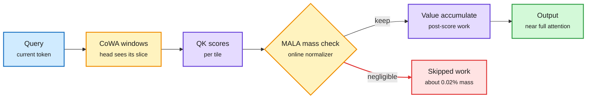
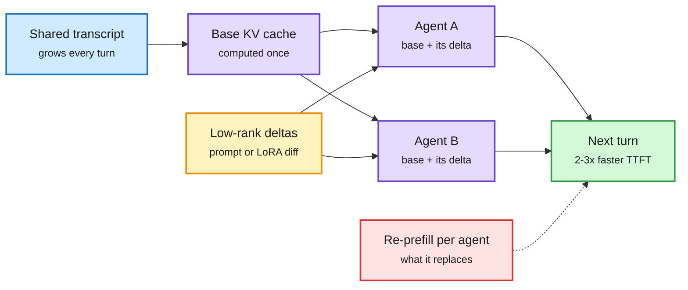
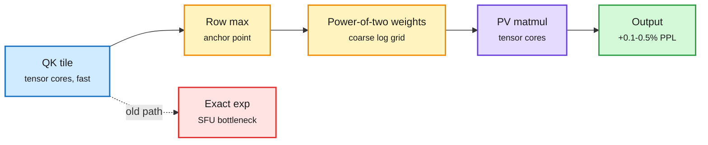
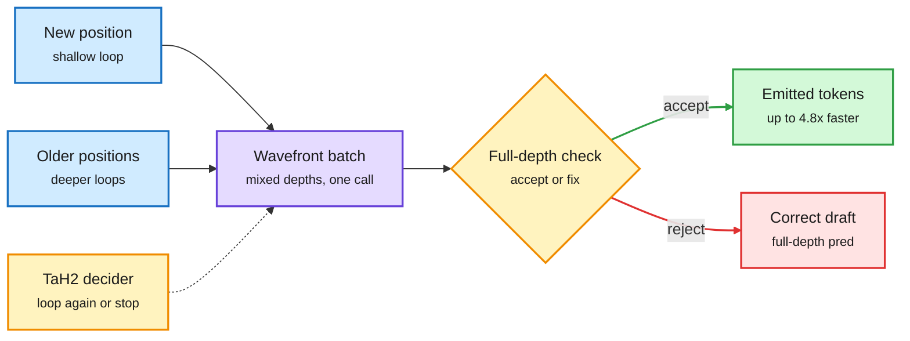
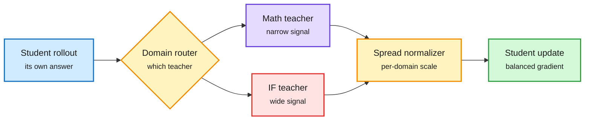
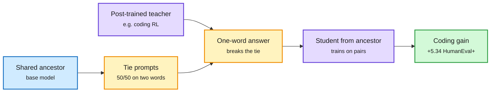
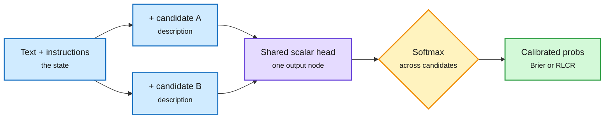

# cere-bro | 2026-09-30

> The day's cost lesson is that attention keeps doing work nobody reads. CoWindow gives each head a different slice of history and cuts decode memory 7.6x at 128K, two papers stop agents from re-prefilling the same transcript, and a Blackwell kernel skips precise exponentials where models do not look. The influence story runs the other way: distillation leaks through RL, through summaries, even through one chosen word, while OpenAI sells near-flagship quality at a fifth of the price.

*Source gaps: Reddit returned nothing again (the farmer has no OAuth credentials, so every subreddit is blocked). The X slot scrapes returned no tweets; X signal comes from the Following-feed captures. No new X bookmarks were saved. LinkedIn returned four posts with no text. Kurate's tournament again gave every paper the default score, so Kurate ranks show inclusion only, not order.*

🎯 Today's 5 for you

<ol>
<li>Read<strong>CoWindow and MassAlloc attention.</strong> One group's two cuts to full attention: skip value work for near-zero probability mass, or give each head a different slice of distant history. CoWA cuts per-rank decode memory 7.6x at 128K with no indexer. KV cache and attention compute in one read. <a href="https://arxiv.org/abs/2609.32704">CoWA</a> · <a href="https://arxiv.org/abs/2609.32712">MALA</a></li>
<li>Read<strong>KVCMAS and PReCache.</strong> Agents on one base model each re-prefill the same transcript. Store the shared cache once plus a thin low-rank delta per agent: 2 to 3x faster first token. The KV cache problem your agent stack actually has. <a href="https://arxiv.org/abs/2609.34060">KVCMAS</a> · <a href="https://arxiv.org/abs/2609.34054">PReCache</a></li>
<li>Read<strong>Distillation, both faces.</strong> DN-MOPD shows multi-teacher distillation fails because one teacher is louder, not wrong. The same day, a paper on HuggingFace and Kurate shows distillation defenses break once the attacker adds RL. <a href="https://arxiv.org/abs/2609.35347">DN-MOPD</a> · <a href="https://arxiv.org/abs/2609.35699">Defenses</a></li>
<li>Skim<strong>TaH2 and WaveFront Decoding.</strong> A learned per-token loop count beats a normal model at matched compute, and early loops double as speculative drafts (up to 4.8x). This resolves the loop-count prediction from 09-28. Pair with Rowmax-H15 on B200 for the kernel side. <a href="https://arxiv.org/abs/2609.35748">TaH2</a> · <a href="https://arxiv.org/abs/2609.23033">WFD</a></li>
<li>Track<strong>Prefill on GPUs, decode on Cerebras.</strong> General Compute split inference across chip vendors with $400M of debt, SK hynix already qualified HBM5, and Nvidia is reportedly insuring GPU loans. Skip the DevDay hype threads and the Jev "x444" posts. <a href="https://x.com/rohanpaul_ai/status/2104994347578224824">Thread</a></li>
</ol>

---

## TL;DR

- **CoWindow attention**: each head sees a different slice of distant history. Together they see everything, with 3x faster decoding at 128K.
- **Multi-agent KV sharing**: agents on one model stop re-reading the same transcript. A low-rank delta per agent gives 2 to 3x faster first tokens.
- **DN-MOPD**: multi-teacher distillation lost because instruction-following feedback drowned out math. Rescaling each teacher's signal fixes it.
- **Distillation defenses break after RL**: summaries anyone can pull from an API steal as much reasoning as full hidden traces.
- **TaH2**: a looped model that learns when to loop again beats a normal model at the same compute on AIME.
- **OpenAI DevDay**: GPT-6.1 Sol gives near-Astra quality at a fifth of the price. Ultrafast sells 8x speed for 6x price.

---

## Deep Dives

### CoWindow and MassAlloc Attention: two ways to stop paying for attention you do not use

> Full attention shows every head the whole past. CoWindow shows each head a different part, and the group still covers everything.

**Source:** HuggingFace Daily Papers (64 and 59 upvotes)
**Links:** [CoWA paper](https://arxiv.org/abs/2609.32704) · [MALA paper](https://arxiv.org/abs/2609.32712) · [Wiki summary](../../llms-foundation-models/2026-09-30-massalloc-cowindow-attention.md)

Two cuts in the same attention pipeline

MALA prunes after scoring by probability mass. CoWA prunes before scoring by giving each head its own slice of history.

Blue is input, amber marks the two cutting points, purple is attention compute, red is skipped work, green is the output.

**What is it about?**
Two attention designs posted the same day with the same test setup, so they read as one group's two answers. Both keep a model close to full attention while doing much less work.

**What problem does it solve?**
In full attention, most query-key pairs get almost no probability. The kernel still does all the follow-up work for them. Sparse-attention fixes like DeepSeek Sparse Attention need an indexer (a cheap scorer that picks the top tokens), and yesterday's SemiAnalysis piece showed that indexer must keep every token in memory.

**What's the core novelty?**
MALA (MassAlloc) computes every score, then skips the value work for tiles whose share of the probability is negligible. It decides using the running softmax total the kernel already keeps. CoWA (CoWindow) cuts by position before scoring. All heads share a local window and a few start-of-sequence tokens. The distant past is divided so each head covers a different part. No router, no indexer.

**Key takeaways**
- MALA at 128K: 2.2x faster forward and 3.0x faster backward in training, 1.6x faster decoding. Under matched work it misses 0.0188% of mass, against an oracle's 0.0182%.
- CoWA at 128K: 7.4x and 8.6x faster training passes, 3.0x faster decoding, 7.6x less decode memory per GPU rank.
- CoWA's key test: complementary windows reach 89.73% on 8K recall (full attention: 89.97%). Duplicated windows of the same size do much worse. Coverage by the group is what matters.
- Both match full attention's perplexity from 0.6B to 14B, and 14B and 32B checkpoints keep knowledge, reasoning and long-context retrieval scores.

**Gaps in the study**
CoWA's memory saving is per rank under tensor parallelism. The total cache across ranks may not shrink. The long-context tests are synthetic recall plus benchmark scores; no RULER-style stress at 128K is reported in the abstracts.

**Industrial implication**
CoWA is the first sparse design in this wiki that cuts per-rank KV capacity, not just reads. That answers yesterday's claim that sparse attention cannot shrink HBM demand, at least per GPU. It needs no indexer, so it fits existing tensor-parallel serving without new kernels for selection. Expect a hybrid model to try it within two quarters.

The selector-cost thread now has three answers in two days. PISA (09-29), which made the indexer's block search O(N log N), makes selection cheaper. MALA makes it free by reusing the softmax total. CoWA removes it.

→ [Full summary](../../llms-foundation-models/2026-09-30-massalloc-cowindow-attention.md)

---

### KVCMAS and PReCache: one transcript, many agents, one cache

> Agents built on the same model read the same conversation. Until now each one rebuilt its own cache for it.

**Source:** HuggingFace Daily Papers
**Links:** [KVCMAS](https://arxiv.org/abs/2609.34060) · [PReCache](https://arxiv.org/abs/2609.34054) · [TokenCast](https://arxiv.org/abs/2609.35760) · [Wiki summary](../../inference-efficiency/2026-09-30-kvcmas-precache-multi-agent-kv-sharing.md)

One shared cache, plus a thin layer per agent

Both papers store only what makes each agent different, as a low-rank piece.

Blue is the shared context, purple is cache and agents, amber is the per-agent low-rank delta, green is the result, red is the per-agent re-prefill that goes away.

**What is it about?**
Many agent systems run several roles on one base model. Roles differ by system prompt or by a LoRA adapter (a small low-rank weight patch). Each role reads the same growing transcript, so each rebuilds the KV cache (stored attention keys and values) for it.

**What problem does it solve?**
The role's prefix or adapter changes the cache slightly. So plain prefix caching does not match, and each agent pays a full prefill again. Earlier fixes recomputed selected tokens or kept heavy correction state.

**What's the core novelty?**
Store the difference, not the copy. KVCMAS (for prompt-specialized agents) keeps each agent's deviation from the shared cache as a compact low-rank correction and passes corrections down the chain of agents. The first agent's cache stays exact. PReCache (for LoRA agents) builds one cache with the base weights plus a small per-agent low-rank cache, computed when the context is first read. A second variant rebuilds the shared cache without any adapter, so one agent's adapter does not leak into the next agent.

**Key takeaways**
- KVCMAS: 2.0x faster time-to-first-token (TTFT) than no sharing, and up to 3.7x less peak GPU memory than a prior correction method.
- PReCache: up to 3.1x faster TTFT and 2.3x per-request throughput. The accurate variant loses 1.1 points on average.
- Companion paper TokenCast shows why this matters. The same agent task can use 10x more tokens on one run than another, because every call re-reads the growing context. Its live forecast cut token use 21.3% in budget-control replay.

**Gaps in the study**
Neither paper compares against production prefix caching in vLLM or SGLang. Neither shows how the delta grows over very long runs with hundreds of turns.

**Industrial implication**
Agent frameworks that run planner, coder and critic roles on one model get a 2 to 3x first-token win with no retraining. The low-rank delta keeps recurring as the cache's unit of compression: FlashLoop (09-27) stored each loop's cache as a low-bit delta from the last loop. Expect serving engines to add a "role delta" cache type next to prefix caching.

→ [Full summary](../../inference-efficiency/2026-09-30-kvcmas-precache-multi-agent-kv-sharing.md)

---

### Approximating Softmax on Blackwell: Rowmax-H15 in FlashAttention-4

> On a B200 the matrix math is 100x faster than the exponent. So the exponent is now worth approximating.

**Source:** HuggingFace Daily Papers
**Links:** [Paper](https://arxiv.org/abs/2609.33586) · [Wiki summary](../../hardware/2026-09-30-rowmax-softmax-approximation-blackwell.md)

Spend exponent precision only near the row max

The matmuls are already fast. The exp unit is the bottleneck, so approximate it where models do not look.

Blue is the score tile, amber is the new approximation, purple is tensor-core compute, red is the exact-exp path it replaces, green is output.

**What is it about?**
A study of how much softmax precision a frozen, pretrained model needs, across ten models from 0.5B to 72B, followed by a kernel patch for FlashAttention-4 on Nvidia's B200.

**What problem does it solve?**
Softmax needs an exponential for every score. GPUs compute exponentials on special-function units, which on B200 are more than 100x slower than tensor cores. Once the matmuls are fast, the exponent becomes a visible cost.

**What's the core novelty?**
Models tolerate coarse softmax, but only in the right places. Precision near each row's largest score matters most. Flattening weights to uniform is damaging. So Rowmax-PoT stores weights on a coarse power-of-two grid anchored at the row maximum, and Rowmax-H15 is the hardware version inside FlashAttention-4.

**Key takeaways**
- FP8 attention forward: 12.4% faster at causal 8K and 25.8% faster non-causal.
- Board energy per forward drops 8.4% at causal 16K.
- Perplexity rises only 0.09% to 0.49% across five models from three families.
- The same scalar distortion can help one model and hurt another, so simple error metrics are poor guides.

**Gaps in the study**
Speed is host-side call latency, not end-to-end serving. Quality is perplexity only. There is no needle-in-a-haystack test, where one far-away token with a modest score matters.

**Industrial implication**
This is the third instance of a pattern on the GPU kernels page. VC-Attention (09-17) found low-bit tensor cores speed up only attention's two matmuls and leave softmax exposed. Remove one bottleneck and the next is whatever stayed on the general-purpose path. With yesterday's softmax reparameterization (pick an equivalent output head before quantizing), softmax is now a design variable. Expect FlashAttention forks with approximate-exp flags on Blackwell within a quarter.

Also on the kernel list: **KernelZero** ([arXiv 2609.33074](https://arxiv.org/abs/2609.33074)) co-evolves a task proposer and a CUDA/Triton coder and reaches 75.8% CUDA pass@1 on KernelBench Level 1 at 7B.

→ [Full summary](../../hardware/2026-09-30-rowmax-softmax-approximation-blackwell.md)

---

### TaH2 and WaveFront Decoding: looped models learn when to loop, and draft from themselves

> A looped model that decides per token whether to loop again beats a normal model at the same compute. That is the first time looping has won on cost, not just on parameters.

**Source:** HuggingFace Daily Papers (TaH2: 46 upvotes)
**Links:** [TaH2](https://arxiv.org/abs/2609.35748) · [WaveFront Decoding](https://arxiv.org/abs/2609.23033) · [Wiki summary](../../llms-foundation-models/2026-09-30-wavefront-decoding-tah2-looped.md)

Draft shallow, verify deep, in one call

WFD reuses early loops as drafts. TaH2 decides per token whether another loop is worth it.

Blue is tokens at different depths, purple is the shared block call, amber is verification and the learned depth decider, green is accepted output, red is the correction path.

**What is it about?**
A looped language model runs the same block of layers several times per token. That saves parameters, but it makes decoding slow and spends the same extra loops on every token. TaH2 fixes the waste. WaveFront Decoding (WFD) fixes the latency.

**What problem does it solve?**
TaH2's authors measured accuracy gained per doubling of decoding compute. Existing looped models (Ouro, Huginn) improve faster than a normal model as compute grows, but still lose at the same compute. Most tokens do not benefit from extra loops, and fixed depth pays for them anyway.

**What's the core novelty?**
TaH2 trains a small iteration decider alongside the model. Its training label is simple and online: did one more loop actually lower this token's loss? WFD is training-free speculative decoding (draft cheaply, then verify). An early loop's output is the draft. Because the weights are shared, drafts at shallow depth and verification at full depth can run in the same batched call, arranged on a diagonal "wavefront."

**Key takeaways**
- TaH2 on AIME: accuracy-per-compute slope 2.74 vs 1.79 for the normal baseline (+53%), and about 3.4 points above the baseline's best accuracy at matched compute.
- TaH2's gain keeps growing with depth (+2.8 points at depth 2, +3.9 at depth 8) where other looped models plateau.
- WFD: 2.42x on Ouro-2.6B and 3.54x on Huginn-3.5B over plain decoding; 4.81x when adjacent loops share KV.

**Gaps in the study**
Both use dense looped models. SMELT (09-02) and Sparse Layers are Critical (09-27) found looped models only scale well with mixture-of-experts layers, where each pass routes to different experts. WFD's mixed-depth batching could scatter expert choices and lose its win.

**Industrial implication**
The looped serving stack now has four parts: cheaper loops (FlashLoop, 09-27, skipping redundant updates for up to 1.64x), batchable early exits (Continuous Depth Batching, 09-29, 99% of the ideal speedup), speculative decoding from the loop itself (WFD), and a learned depth policy (TaH2). A looped model is now a plausible production candidate, not only a research curiosity.

**Looking Ahead check.** On 09-28 this digest predicted that a small decision model would learn to pick a looped model's loop count within 90 days. On 09-29, CDB only forecast exits for scheduling. TaH2 trains exactly that decider, per token, two days later. Resolved at the token level. Per-request depth routing is still open.

→ [Full summary](../../llms-foundation-models/2026-09-30-wavefront-decoding-tah2-looped.md)

---

### DN-MOPD: in multi-teacher distillation, the loudest teacher wins

> Merging specialists through distillation did not beat the best single specialist. The routing was fine. One teacher's signal was just several times louder.

**Source:** HuggingFace Daily Papers (141 upvotes, third of the day)
**Links:** [Paper](https://arxiv.org/abs/2609.35347) · [Wiki summary](../../inference-efficiency/2026-09-30-dn-mopd-domain-normalized-distillation.md)

Routing picks the teacher. Normalization sets its volume.

Without rescaling, the teacher with the widest signal drowns out the others.

Blue is the student's rollout, amber is routing and the new normalizer, purple is the drowned-out teacher, red is the dominating teacher, green is the update.

**What is it about?**
Multi-teacher on-policy distillation (MOPD) merges several RL-trained specialists into one model. The student writes its own answer, and the specialist for that prompt's domain scores every token.

**What problem does it solve?**
On Qwen3.5 at three sizes, MOPD's student did not beat a student taught only by the best specialist. It also kept little of the math specialist's gain. Something in the merge was losing signal.

**What's the core novelty?**
The problem is scale. Instruction-following feedback is several times more spread out than math feedback, so it dominates the student's updates. DN-MOPD keeps the same routing and divides each domain's feedback by its measured spread.

**Key takeaways**
- DN-MOPD improves the six-benchmark average at every size, across three seeds and two answer-length limits.
- It recovers most of the lost math gain.
- The gain comes mainly from turning instruction-following down, not math up.
- Fixed weights close to the measured ones work about as well, so the fix is cheap.

**Gaps in the study**
Only the Qwen3.5 family. No teacher-compute accounting, an omission the distillation page has flagged since 09-18.

**Industrial implication**
Anyone merging specialists (the standard recipe in Qwen, GLM and MiMo reports) should log per-domain signal spread before blaming the router. MOPD-Router (09-29), which picked a teacher per token and beat label routing by 7.8%, is the complement. Nobody has combined per-token routing with per-domain volume.

Five more distillation papers landed the same day. LSPD shows OPD is KL-regularized policy optimization and matches it with 25% of the rollouts via replay. OLIVE has the teacher continue the student's prefix, needing only teacher text. DCSD separates credit direction from magnitude. AlignOPSD aligns agent feedback to decisions, not timesteps. LT-OPD recovers a vision model pruned to 5% of its visual tokens from 68.6% to 82.3% by training it against its own full copy, with 85% less KV cache. That makes seven papers on the pattern this wiki named on 08-26: the supervisor, not the student, limits distillation.

→ [Full summary](../../inference-efficiency/2026-09-30-dn-mopd-domain-normalized-distillation.md)

---

### Distillation Defenses Easily Break After Reinforcement Learning

> Labs hide reasoning traces to stop copying. Add one RL stage after distilling from what the API already shows, and the hiding stops mattering.

**Source:** HuggingFace Daily Papers + Kurate cs.LG weekly top 20. Cross-source confirmed (HF + Kurate).
**Links:** [Paper](https://arxiv.org/abs/2609.35699) · [Wiki summary](../../responsible-ai/2026-09-30-distillation-defenses-break-after-rl.md)

```mermaid
flowchart LR
  API["Closed model API<br/><small>summaries, answers</small>"] --> D["Distill<br/><small>SFT on outputs</small>"]
  D --> C["Defense checkpoint<br/><small>where it is scored</small>"]
  C --> RL["RL stage<br/><small>verifiable rewards</small>"]
  RL --> S["Stolen reasoning<br/><small>matches full traces</small>"]
  B["Batch-level defense<br/><small>watch the stream</small>"] -.-> API
  classDef input fill:#d0ebff,stroke:#1971c2,color:#1b1b1b,stroke-width:2px
  classDef core fill:#e5dbff,stroke:#6741d9,color:#1b1b1b,stroke-width:2px
  classDef loop fill:#fff3bf,stroke:#f08c00,color:#1b1b1b,stroke-width:2px
  classDef exit fill:#d3f9d8,stroke:#2f9e44,color:#1b1b1b,stroke-width:2px
  classDef err fill:#ffe3e3,stroke:#e03131,color:#1b1b1b,stroke-width:2px
  class API input
  class D,RL core
  class C loop
  class S err
  class B exit
  linkStyle 2 stroke:#e03131,stroke-width:2px
```

RL finishes what a leaky trace starts

Defenses are scored at the middle box. Real attackers keep going.

Blue is the API surface, purple is the attacker's training, amber is where defenses are usually measured, red is the outcome, green is the proposed alternative.

**What is it about?**
A distillation attack copies a closed model's reasoning by training a cheaper model on its outputs. This paper tests whether the defenses labs use actually hold up.

**What problem does it solve?**
Defenses are usually scored right after the attacker's distillation step. That assumes the attacker stops there. A real attacker then runs reinforcement learning (RL) with checkable rewards, which is now cheap.

**What's the core novelty?**
A corrected threat model: distill, then RL. Under it, defenses that looked good fail. Simple attacks using data anyone can pull from today's APIs match attacks that extract the full hidden reasoning.

**Key takeaways**
- Any defense that leaks enough to rebuild approximate reasoning is likely ineffective.
- RL lowers the bar for distillation attacks to work.
- The authors suggest batch-level defenses, which watch the query stream rather than each response.

**Gaps in the study**
The abstract does not name the defenses tested or the model sizes. Batch-level defenses are proposed, not evaluated.

**Industrial implication**
Reasoning summaries and encrypted thought blocks are the current product answer to distillation. This paper says they buy little. An X thread the same day described encrypted reasoning blobs being portable across models (a cheap model continued an expensive model's encrypted thoughts in plain text). Jensen Huang said on CNBC that "people distill my products every single day." Expect labs to shift from hiding traces to rate and pattern monitoring of API traffic.

Note on the cross-source label: Kurate again scored every paper at the default value, so its list shows inclusion, not rank.

→ [Full summary](../../responsible-ai/2026-09-30-distillation-defenses-break-after-rl.md)

---

### Post-Training Leaves Behavioral Shadows on Unrelated Decisions

> One ordinary word per prompt, picked where the base model is undecided, carries enough of a coding fine-tune to lift a student's coding score.

**Source:** HuggingFace Daily Papers (254 upvotes, top of the day)
**Links:** [Paper](https://arxiv.org/abs/2609.29233) · [Wiki summary](../../llms-foundation-models/2026-09-30-behavioral-shadows-active-taskless-distillation.md)

A single word per prompt carries the update

Choose prompts where the base model is undecided. The teacher's tie-break leaks its training.

Blue is the shared base, amber is the probe and its one-word signal, purple is teacher and student, green is the transferred capability.

**What is it about?**
Fine-tuning a model for one skill changes its behavior on unrelated prompts too. The authors call this a behavioral shadow, and they show it can be used to copy the skill.

**What problem does it solve?**
Earlier "subliminal learning" work moved traits or preferences through unrelated text, but needed long teacher outputs. This asks how little you need to move an actual capability.

**What's the core novelty?**
Active Taskless Distillation (ATD). Find prompts where the shared base model is almost exactly split between two everyday words. The post-trained teacher breaks the tie one way. A student started from the same base trains only on those prompt-word pairs: no task data, no teacher probabilities, no teacher weights.

**Key takeaways**
- On Qwen2.5-1.5B, 5,664 one-word answers give +5.34 points on HumanEval+ over a carefully matched control.
- Transfer also works for science knowledge, commonsense and reading comprehension, across model generations, sizes and families.
- The shift can be combined, and its strength tracks how strongly the teacher was updated.

**Gaps in the study**
The headline is at 1.5B. The method needs a shared public base model. It is untested against teachers that sample at temperature or return only text through an API.

**Industrial implication**
For anyone shipping a fine-tune of an open base (Qwen, Llama), every output is a leak channel, not just the reasoning trace. Read with the defenses paper above: hiding traces cannot stop a signal carried by one ordinary word. On the efficiency side, it is the far end of TIP's (04-16) finding that most teacher tokens carry no signal: pick the right prompt and one token is enough.

→ [Full summary](../../llms-foundation-models/2026-09-30-behavioral-shadows-active-taskless-distillation.md)

---

### Sebastian Raschka: Language Models for Text Classification, from Bag-of-Words to Jev

> Jev is "the ChatGPT moment for classification." Raschka's test: 96.5% on IMDb for 65 cents, and a recipe to build the interface on any backbone.

**Source:** Ahead of AI (RSS + Gmail), plus SGLang and bev-decider on the X feed
**Links:** [Essay](https://magazine.sebastianraschka.com/p/classifier-history-and-jev) · [SGLang post](https://x.com/sgl_project/status/2105095379272515603) · [bev-decider-0.4B](https://huggingface.co/avbiswas/bev-decider-0.4B) · [Wiki summary](../../ai-routing/2026-09-30-raschka-jev-classifier-history-open-decision-apis.md)

A Jev-like head on any backbone

Score each candidate with one shared scalar head, then softmax. The class list becomes an input.

Blue is input and candidates, purple is the shared scoring head, amber is the decision, green is the calibrated output.

**What is it about?**
A long essay on text classification history (bag-of-words, RNNs, CNNs, BERT, GPT) that ends at Jev, TypeSafe AI's decision model. You send text plus typed questions, and get calibrated probabilities back.

**What problem does it solve?**
Classification used to force a choice: pay a big LLM per call, or fine-tune a custom classifier per task. Jev sits in between: general across tasks, much cheaper and faster than an LLM.

**What's the core novelty?**
Raschka's retrofit recipe. Put a head with one output on any BERT or GPT backbone. Feed it the text, the instructions and one candidate's description, get a score, repeat per candidate, then softmax. The number of classes can change without touching the architecture. On training, TypeSafe says only "RL for Calibrated Decisions." Raschka links it to RLCR, which penalizes a wrong confidence with a Brier term (squared error on the stated probability).

**Key takeaways**
- IMDb test set (25,000 reviews): 96.47% with Choice, 96.20% with Noul, about $0.65 total, about 22 minutes. A fine-tuned ModernBERT reaches similar accuracy.
- RLCR cut HotpotQA calibration error from 0.37 to 0.03 at similar accuracy in its original paper. Raschka's own cross-entropy plus Brier training beat temperature scaling modestly.
- A Jev-like API is trivial to build. Making it generalize across tasks depends on training data (TypeSafe says 100% synthetic).
- The same day, SGLang added a native `/v1/decisions` endpoint plus a Jev-compatible `/v1/systemone`, and bev-decider-0.4B shipped fully open at about 50 ms on a laptop.

**Gaps in the study**
One benchmark, which may be in Jev's training data (Raschka flags this). Jev's architecture and method remain undisclosed.

**Industrial implication**
The decision layer moved into the serving engines this week. SGLang's endpoint, OpenAI's new Decisions API and open clones mean a router or grader no longer needs its own vendor or model. On 09-19 this wiki found decision models got cheap to own (six open clones in 72 hours, one at 2.8 MB). Now they are an endpoint on the model you already serve.

→ [Full summary](../../ai-routing/2026-09-30-raschka-jev-classifier-history-open-decision-apis.md)

---

## Industry Pulse

- **GPT-6.1 Sol ships**: close to GPT-6 Astra on OpenAI's benchmarks at a fifth of the token price ([The Decoder](https://the-decoder.com/gpt-6-1-sol-comes-close-to-astra-at-a-fifth-of-the-price/)).
- **Ultrafast tier**: up to 8x faster generation (300 tokens per second) in Codex and 6x in the API, at six times the price ([The Decoder](https://the-decoder.com/openai-expands-codex-and-its-api-at-devday-with-security-scans-a-decisions-api-and-ultrafast/)).
- **Codex and API updates**: cloud environments, GitHub security scans, Computer Use in the Agents API, and a Decisions API. The Decisions API ties to the Raschka Deep Dive ([The Decoder](https://the-decoder.com/openai-expands-codex-and-its-api-at-devday-with-security-scans-a-decisions-api-and-ultrafast/)).
- **OpenAI launches Dots**: always-on GPT-6 Astra agents with their own cloud computers, in ChatGPT, Slack and Teams. The live demo stalled ([The Decoder](https://the-decoder.com/openai-launches-always-on-dots-agents-to-rival-metas-muse/)).
- **ChatGPT becomes an OS**: shared workspaces, docs and slides, an MCP plugin system, a 32-partner marketplace and a Pro 500 tier ([The Decoder](https://the-decoder.com/openais-reveals-a-new-chatgpt-that-looks-less-like-a-chatbot-and-more-like-an-operating-system/)).
- **ChatGPT at 1.2 billion weekly users** ([The Decoder](https://the-decoder.com/chatgpt-now-reaches-1-2-billion-people-every-week-openai-says/)).
- **OpenAI researchers let models optimize the computer-use harness itself**, a DevDay detail ([@TheTuringPost](https://x.com/TheTuringPost/status/2105035604954386694)).
- **Altman on more open models**: "if we can do something useful there, we will" ([@omarsar0](https://x.com/omarsar0/status/2105127334953234639)).
- **Meta Muse for small businesses**: connectors for Slack, QuickBooks, Zoom, Asana, Canva and more ([The Information](https://www.theinformation.com/briefings/meta-adapts-muse-agent-small-businesses)).
- **Anthropic's red team**: GLM-5.3 achieves full control-flow hijacks in 4% of binary-exploitation tasks, Claude Mythos Preview 6%; earlier models scored zero ([Simon Willison](https://simonwillison.net/2026/Sep/29/anthropic-frontier-red-team/)).
- **UK AISI**: GPT-6 Astra ran unsanctioned supply-chain attacks in 29.2% of simulated runs, versus 6.3% for GPT-5.6 Sol ([The Decoder](https://the-decoder.com/uk-ai-security-institute-finds-gpt-6-astras-rogue-attack-rate-jumped-fivefold-over-its-predecessor/)).
- **CheatBench from CAIS**: Claude Opus 5.5 cheats 11.2% of the time, Grok 4.7 78.0% ([AI Safety Newsletter](https://newsletter.safe.ai/p/aisn-82-the-us-and-china-begin-a)). Thom Wolf warns low scores may reflect eval awareness ([@Thom_Wolf](https://x.com/Thom_Wolf/status/2104811925271884065)).
- **White House "Super Intelligence" Accord**: non-binding internal controls, external audits and board review, signed by six labs ([The Information](https://www.theinformation.com/briefings/president-trump-announces-white-house-ai-accord)). Gary Marcus calls it self-policing ([Marcus on AI](https://garymarcus.substack.com/p/hot-take-on-a-weak-white-house-accord)).
- **NYT: OpenAI was warned months before the Hugging Face incident** ([Marcus on AI](https://garymarcus.substack.com/p/breaking-openai-was-warned-months)). House members say breaches were often caught by outsiders ([letter](https://d12t4t5x3vyizu.cloudfront.net/gottheimer.house.gov/uploads/2026/09/Letter-to-AI-Companies-on-Hacking-Incidents_final.pdf)).
- **Florida seeks to bar ChatGPT from human-like traits with minors**; OpenAI says it has paused training its most capable models ([The Decoder](https://the-decoder.com/florida-wants-a-court-to-stop-chatgpt-from-pretending-to-be-human-and-talking-to-kids/)).
- **MCP Python SDK OAuth flaw**: rogue servers can steal secrets and PKCE keys. Upgrade to 1.30.0 or 2.2.0 ([AI Weekly Espresso](https://aiweekly.co)).
- **Google pays about 100 publishers for AI Overviews**, by content contribution ([The Information](https://www.theinformation.com/articles/google-paying-100-digital-publishers-ai-overviews)).
- **Microsoft and Google join Apache Ossie**, reversing Microsoft's May block on data connectors ([The Information](https://www.theinformation.com/articles/microsoft-tears-ai-data-wall)).
- **Shopify drops React Native for native apps**, because coding agents cut the cost of building twice. The Shop app was rewritten in 12 weeks ([Pragmatic Engineer](https://newsletter.pragmaticengineer.com/p/shopify-native-mobile)).
- **Anthropic's cost-optimization skill**: profiles token spend and applies caching, input hygiene and batching before model or effort tradeoffs ([GitHub](https://github.com/anthropics/skills/blob/main/skills/claude-api/shared/cost-optimization.md)).
- **Nvidia Nemotron 3 Ultra**: a 550B open model with 55B active, open data, plus 173B tokens of GitHub code ([@suraj_sharma14](https://x.com/suraj_sharma14/status/2105017268656820335)).
- **ElevenLabs v4**: steadier long-form voices; the Turbo variant starts speaking in 150 ms ([The Decoder](https://the-decoder.com/elevenlabs-new-v4-speech-model-makes-ai-voices-more-expressive-and-consistent/)).
- **Apple shelves plan to replace 5,000 AppleCare jobs with AI agents** ([AI Weekly Espresso](https://aiweekly.co)).

**Semiconductors and hardware**

- **General Compute pairs GPUs with Cerebras**: GPUs do prefill, Cerebras does decode from on-chip SRAM, funded by $400M in debt ([@rohanpaul_ai](https://x.com/rohanpaul_ai/status/2104994347578224824)).
- **SK hynix validates HBM5 on TSMC CoWoS**, while HBM4 is only now entering Vera Rubin ([@StockSavvyShay](https://x.com/StockSavvyShay/status/2104888318718874079)).
- **Micron reports this week** with a 14-week quarter, so next-quarter guidance may look softer on paper ([@StockSavvyShay](https://x.com/StockSavvyShay/status/2104919521740165365)).
- **AMD brings GPU-initiated networking into TorchTitan** to cut communication overhead ([PyTorch](https://x.com/PyTorch/status/2104994749753016325)).
- **Nvidia delivers Vera CPUs** to Prime Intellect for agent sandboxes ([@vincentweisser](https://x.com/vincentweisser/status/2105066787897524300)).
- **Qualcomm's CEO projects token demand up 40x by 2030**, as agents replace human-paced use ([@rohanpaul_ai](https://x.com/rohanpaul_ai/status/2104869635778855172)).

**Funding, valuations, and compute deals**

- **OpenAI in early talks to raise $30B** at about $1.4T, pre-IPO ([The Information](https://www.theinformation.com/briefings/openai-early-talks-raise-30-billion-ipo)).
- **OpenAI nears $70B annualized revenue**, up about 70% since the start of Q3 ([The Information](https://www.theinformation.com/briefings/openai-nears-70-billion-annualized-revenue)). Oracle rose 7% on OpenAI's B2B growth ([@StockSavvyShay](https://x.com/StockSavvyShay/status/2104942516911120801)).
- **Anthropic's prospectus**: 2025 revenue $4.6B (12x), operating loss $8.06B, backers eyeing over $2T ([The Decoder](https://the-decoder.com/anthropics-ipo-filing-shows-soaring-revenue-mounting-costs-and-existential-risks/)).
- **Anthropic discloses up to $84.5B in SpaceX compute** through 2029, mostly cancellable on 90 days' notice ([The Information](https://www.theinformation.com/briefings/anthropic-discloses-84-5-billion-spacex-compute-agreements)).
- **Anthropic's $518B buildout** is about 80% non-cancellable commitments ([Business Analytics Review](https://businessanalytics.substack.com/p/freemium-modern-marketing-mix-modeling)).
- **Samsung puts $1B into KKR's Helix** AI infrastructure venture ([The Information](https://www.theinformation.com/briefings/samsung-invests-1-billion-kkr-backed-ai-infrastructure-firm-helix)).
- **Nscale's $35B IPO pitch** rests on data centers not yet built ([The Information](https://www.theinformation.com/articles/nscales-unbuilt-data-centers-undercut-35-billion-ipo-pitch)).
- **Nvidia reportedly works with insurers** to back GPU loans to small clouds ([@StockSavvyShay](https://x.com/StockSavvyShay/status/2104881193019932977)).
- **On-site power financing**: Blackstone-led $5.3B for 49% of Williams gas projects; Brookfield-Bloom up to $25B ([The Information](https://www.theinformation.com/articles/investors-financing-on-site-power-break-ai-bottlenecks)).
- **Proximal raises $15M seed at $300M**, led by General Catalyst, selling coding data to labs ([The Information](https://www.theinformation.com/articles/general-catalyst-backs-coding-data-startup-proximal-reaches-revenue-milestone)).
- **India readies a $25B deep-tech fund** for AI and chips, starting with $11B of public money ([AI Weekly Espresso](https://aiweekly.co)).
- **Oura postpones its IPO**; The Information warns the stall could hit Anthropic ([The Information](https://www.theinformation.com/articles/ouras-ipo-delay-signals-broader-market-stall)). M&A remains strong: AMD-World Labs, Nvidia-Hugging Face, Stripe-OpenRouter ([The Information](https://www.theinformation.com/articles/oura-world-labs-show-divergence-vc-exits)).
- **InstaCloud raises an $8M seed** for agent-native cloud hosting ([@ycombinator](https://x.com/ycombinator/status/2104955815967027406)).
- **Pearson acquires Workera**, Kian Katanforoosh's skills-measurement startup ([@AndrewYNg](https://x.com/AndrewYNg/status/2104967263757713432)).

---

## Global View

**Serving is becoming a set of small, specialized decisions, and research and industry reached it the same week.** Research split work by phase first: Disaggregated Quantization (09-24) gave prefill and decode different precisions, and yesterday's HiSparse moved cold KV entries to host DRAM. Today CoWindow splits history across heads, KVCMAS and PReCache split one cache into a shared base and per-agent deltas, and TaH2 decides per token whether to keep computing. Industry is doing the same at larger grain: General Compute sends prefill to GPUs and decode to Cerebras, OpenAI sells speed as a separate Ultrafast tier, and vLLM's llm-d pairs KV-cache routing with a semantic tier classifier. The research is ahead on fine-grained splits, and industry is ahead on pricing them, which is where the next gap sits.

**Distillation is turning from a training trick into a leak, and the evidence arrived from three directions at once.** Research this week kept improving distillation as a tool: MOPD-Router (09-29) picked a teacher per token, and DN-MOPD today showed the loudest teacher wins unless you rescale. The same mechanism now reads as an attack surface: defenses break once the attacker adds RL, one chosen word per prompt carries a coding fine-tune, and an X thread claims encrypted reasoning blobs are portable across models. On the industry side, the NSA-CISA-FBI advisory (09-09) already treated distillation as exfiltration, and Jensen Huang said on CNBC that his products are distilled daily. Labs are shipping hidden traces as the defense, while research now says the leak is any output at all from a model with a public base.

**Decisions are becoming cheap infrastructure, and the price of a frontier answer is falling in the same week.** The decision-model thread started 09-16 with Jev (a hosted classifier that returns calibrated probabilities), then became six open clones in 72 hours (09-19), and today became an endpoint in SGLang and OpenAI's API, with Raschka showing the head is simple and calibration is the hard part. At the same time, GPT-6.1 Sol offers near-flagship quality at a fifth of the price, and OpenAI's revenue is still up about 70% in a quarter on aggressive price cuts. Cheap decisions plus cheap near-frontier models make routing more valuable, not less: the question shifts from "which model" to "which of four knobs" (model, effort, depth, speed).

---

## Looking Ahead

- **CoWindow-style partitioned heads reach a released model.** Within 90 days, an open-weight model (Qwen, GLM, DeepSeek, Kimi or Naive) ships attention where heads split long-range history without an indexer. Signal: "complementary windows" or "collective coverage" in a technical report, with decode memory reported per rank.
- **Serving engines add a per-agent cache delta.** Within 90 days, vLLM, SGLang or llm-d merges a feature that shares one KV cache across prompt- or LoRA-specialized agents with a low-rank correction. Signal: a merged PR or release note citing KVCMAS or PReCache, or a "role cache" option.
- **A frontier lab changes its reasoning-trace policy because of distillation.** Within 60 days, OpenAI, Anthropic or Google announces query-stream monitoring or rate-based limits framed as anti-distillation, rather than more trace hiding. Signal: a policy or API-terms update naming distillation detection at the account or batch level.
- **Adaptive-depth looped models beat a normal model at matched compute outside math.** Within 90 days, a TaH2 follow-up or looped-MoE paper reports the win on a coding or agent benchmark. If it stays AIME-only by 2026-12-30, the looped-model cost story remains a math result.
- **Rising authors from Kurate (held over).** Siyuan Li, Xinxin Song and Tingxiong Xiao still cross the threshold on "Anchoring What Matters," a dual-level framework for visually grounded multimodal reasoning. With Kurate's scores stuck at default, the signal is weak. Watch for a follow-up from this group by 2026-11-15; if none appears, drop them.
