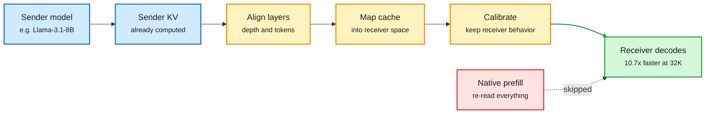
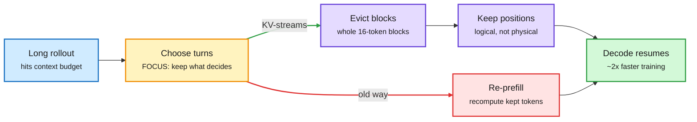
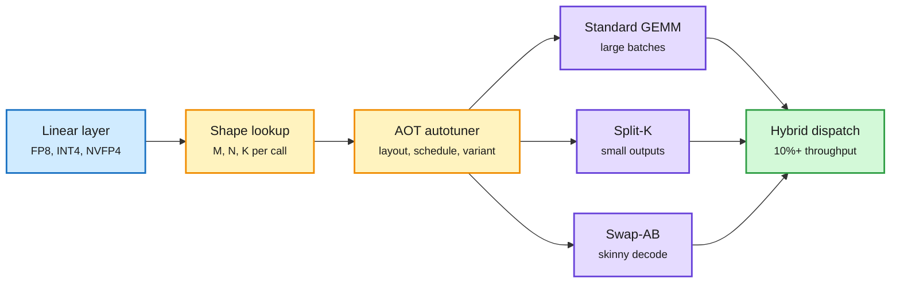
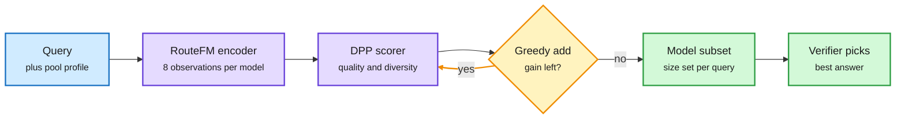
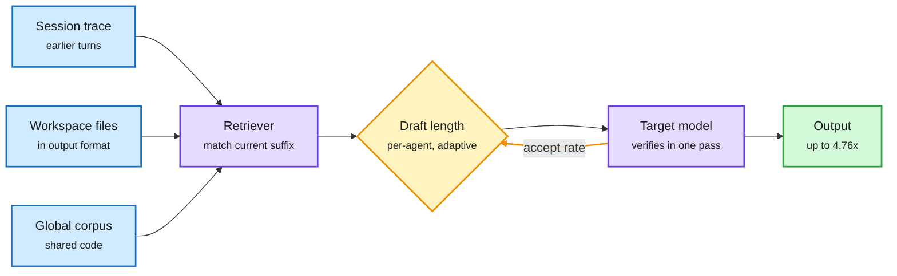
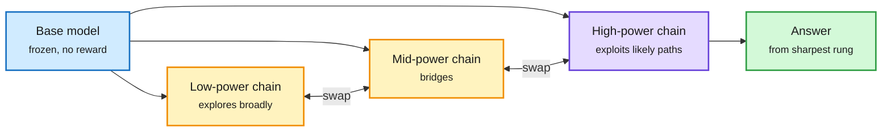
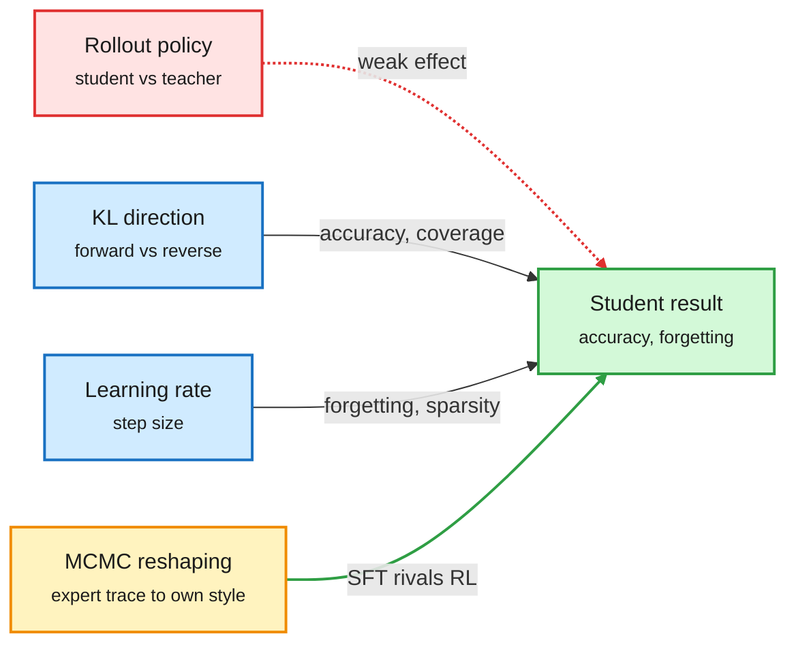
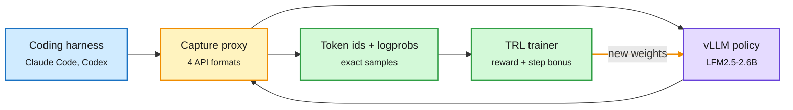
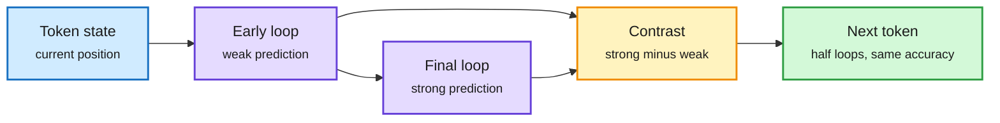

# cere-bro | 2026-10-03

> Yesterday's cost lesson was "never compute a token twice." Today it travels further. HeteroFold hands a KV cache to a model from a different family, so the receiver never re-reads the transcript. KV-streams stops agent RL from rebuilding its cache after every compaction. AgSpec drafts from the agent's own history. Helion gets one autotuned GEMM past the vendor libraries. On the influence side, three papers say RL mostly sharpens what the model already knows, and that sampling can buy the same thing. Meanwhile the money side turns compute into project finance: a chip vendor lending its customer $42B, Amazon leasing back its own GPUs, and a decision gate that now costs 4 cents per million tokens.

*Source gaps: all eight Reddit subreddits returned no posts again, so there is no Reddit practitioner signal. The X slot scrapes returned no tweets and no new bookmarks were saved; X signal comes from seven Following-feed captures. LinkedIn returned posts with no text. VentureBeat's feed is blocked by a bot checkpoint. The Interconnects (Trillium Labs) and Understanding AI (Tesla robotaxi) emails arrived as links only. Kurate's tournament again gave every paper the default score, so its order carries no ranking.*

🎯 Today's 5 for you

<ol>
<li>Read<strong>HeteroFold.</strong> The first KV cache transfer across model families with both models frozen: 10.7x faster than prefill at 32K. It is the direct follow-up to the C2C cache-to-cache work you saved in September, and it answers that note's open question. <a href="https://arxiv.org/abs/2609.32259">Paper</a></li>
<li>Read<strong>KV-streams, with FOCUS beside it.</strong> Agent RL stops re-prefilling after context compaction and edits the live vLLM cache instead, for a claimed 2x faster training. FOCUS decides what to drop, with no training. KV cache cost moves from serving into training. <a href="https://github.com/Emilianopp/KV-streams">Repo</a> · <a href="https://academy.dair.ai/papers/focus-training-free-decision-preserving-context-compression-for-llm-agents-2609.37590">FOCUS</a></li>
<li>Read<strong>Helion in vLLM.</strong> One autotuned GEMM source covers three algorithms, picked per shape. It beats CUTLASS and DeepGEMM on Hopper, with 10%+ throughput on some workloads. This is the third kernel-DSL win in two days. <a href="https://pytorch.org/blog/building-a-high-performance-and-portable-vllm-linear-backend-with-helion/">Blog</a></li>
<li>Skim<strong>FlexRouter and RouteFM, then the decision-model price list.</strong> One routes to a team of models chosen for coverage. The other pretrains a router once and adapts from eight observations per model. Meanwhile Perplexity open-sourced a 27B decision model at 4 cents per million input tokens. Skip the viral SAS sparse-attention post until a paper shows numbers. <a href="https://arxiv.org/abs/2609.38585">FlexRouter</a> · <a href="https://arxiv.org/abs/2609.37362">RouteFM</a></li>
<li>Track<strong>Compute as project finance.</strong> Broadcom is lending Anthropic up to $42B, and the facility can vanish on default. Amazon is weighing an $8B GPU leaseback. Lambda took a $1B GPU loan at 6.78%. Your hardware and semiconductor thread now runs through credit markets. <a href="https://startupfortune.com/broadcom-agreed-to-lend-anthropic-up-to-42-billion-ahead-of-its-ipo/">Broadcom</a> · <a href="https://www.theinformation.com/articles/ai-data-center-debt-showing-everywhere">AI debt</a></li>
</ol>

---

## TL;DR

- **HeteroFold**: a Llama can hand its KV cache to a Mistral model. The receiver skips prefill, 10.7x faster at 32K context.
- **KV-streams**: agent RL drops old turns straight from the live cache instead of recomputing, for about 2x faster training.
- **Helion in vLLM**: one autotuned matrix-multiply kernel beats NVIDIA's CUTLASS and DeepGEMM on Hopper.
- **Routing grows up**: FlexRouter picks complementary models, RouteFM pretrains a reusable router, and decision models fall to 4 cents per million tokens.
- **RL is mostly sharpening**: Sharpening Tax and PPT show base models plus sampling recover much of what post-training buys.
- **Compute becomes debt**: Broadcom lends Anthropic $42B, Amazon weighs a GPU leaseback, and AI data-center bonds widen.

---

## Deep Dives

### HeteroFold: hand your KV cache to a model from another family

> Two models from different families can share their attention memory with both models frozen, and the receiver never has to re-read the transcript.

**Source:** HuggingFace Daily Papers
**Links:** [Paper](https://arxiv.org/abs/2609.32259) · [Wiki summary](../../inference-efficiency/2026-10-03-heterofold-cross-family-kv-transfer.md)

The receiver never reads the transcript

Three frozen-model steps turn a foreign cache into a usable one.

Blue is the sender side, amber the three transfer steps, red the prefill that gets skipped, green the receiver's output.

**What is it about?**
Multi-agent systems now mix model families, for example a Llama planner and a Mistral coder. HeteroFold lets the second model reuse the first model's KV cache (the stored attention keys and values for text already read) instead of reading the shared context again.

**What problem does it solve?**
Agents usually talk in text. So every receiver prefills (runs a full attention pass over) context the sender already processed. Cache reuse fixes this within one model. Across families it breaks, because tokenizers, layer counts and the shape of the keys and values all differ.

**What's the core novelty?**
Three steps, and neither model is trained. First, align the two layer stacks and token boundaries. Second, map the sender's cache into the receiver's space. Third, calibrate the mapped cache so the receiver behaves as if it had read the text itself.

**Key takeaways**
- Llama-3.1-8B to Ministral-3-14B at 32K context is 10.7x faster than native prefill.
- It is 1.18x to 1.47x faster than the earlier prefill-free baselines, Dense Latent and KV Ridge.
- It is best on all four long-context benchmarks across six transfer directions.
- It matches plain text communication on a multi-agent benchmark, so the speedup does not cost quality there.

**Gaps in the study**
The largest pair is 8B to 14B; MoE and frontier-scale receivers are untested. The mapping is fitted per model pair, and the paper does not say how much data a new pair needs or how fast the mapping goes stale after a model update.

**Industrial implication**
Heterogeneous agent stacks pay a prefill tax at every handoff. If cross-family transfer gets into a KV store like LMCache or Mooncake, mixed-vendor agent pipelines get the same cache economics as single-model ones. The staleness question decides whether this is a product or a demo.

**How it fits the wiki.** This is the fourth sharing axis in two weeks. HySparse2 (09-24) shared KV across layers, HiSparse (09-29) across memory tiers, and KVCMAS and PReCache (09-30) across agents built on the same base model. C2C (09-18) first projected one model's cache into another with a trained fuser, and asked how much cache structure two independently trained models share. HeteroFold is a partial answer: enough that a fitted map plus calibration works across families, with no training. Galahad (yesterday, which found 98.7% of prompt tokens are re-reads) reuses the cache across requests; HeteroFold reuses it across models.

**Research angle.** Nobody has measured cache similarity between two families layer by layer. The wiki holds four results showing adjacent layers *inside* one model are near-substitutes (CSA2 Reuse, WRP, KVShare, the 09-14 retrofit). If the cross-model map is near-linear at matched relative depth, a universal "cache adapter" per family pair is feasible. If it is not, calibration cost will scale with every model release.

→ [Full summary](../../inference-efficiency/2026-10-03-heterofold-cross-family-kv-transfer.md)

---

### KV-streams and FOCUS: compact the agent's context without paying twice

> Agent RL rebuilds its whole KV cache every time it trims old turns. Editing the live cache instead roughly halves training time.

**Source:** X Following feed (repo + explainer), DAIR.AI (FOCUS, Microsoft)
**Links:** [KV-streams repo](https://github.com/Emilianopp/KV-streams) · [FOCUS paper](https://academy.dair.ai/papers/focus-training-free-decision-preserving-context-compression-for-llm-agents-2609.37590) · [Wiki summary](../../inference-efficiency/2026-10-03-kv-streams-and-focus-context-compaction.md)

Compaction without a second prefill

Cut dropped turns out of the live cache instead of rebuilding a shorter one.

Blue is input, amber the selection decision, red the wasted recompute path, purple the in-place cache edit, green the result.

**What is it about?**
Two pieces on one problem. Long agent runs outgrow their context, so old turns must go. KV-streams makes dropping them cheap. FOCUS decides which ones to drop.

**What problem does it solve?**
In agentic RL (reinforcement learning on long multi-turn rollouts), most systems "re-prefill" after compaction. They build a shorter sequence and push every kept token through the model again, rebuilding the cache each time. The same tokens get processed over and over.

**What's the core novelty?**
KV-streams, a fork of vLLM 0.19, removes the dropped turns directly from the live cache. Two fixes make this safe. Keys were rotated by RoPE (rotary position encoding) at their original position, so the cache tracks logical position separately from physical slot. And vLLM stores KV in 16-token blocks behind a block table, so KV-streams evicts whole blocks and repacks the table so the attention kernel never reads a hole. FOCUS keeps only the past interaction units that the agent's next decisions depend on, with no training.

**Key takeaways**
- KV-streams claims nearly 2x faster agent RL training, and attention gets cheaper because the request is physically shorter.
- FOCUS cuts peak context by up to 48% and raises task success by up to 8.9 points over keeping the full history.
- FOCUS runs as a layer in front of closed-API models, since it needs no fine-tuning.
- NVIDIA's Long-Transduction study backs the quality side: on simple repetitive work, accuracy falls 62.8% from 4K to 128K context ([paper](https://arxiv.org/abs/2609.38712)).

**Gaps in the study**
KV-streams is a 4-star research repo with an X explainer and no paper. The 2x is the authors' claim, and the effect on final policy quality is not reported. FOCUS's "causal dependency" estimate has its own cost per step, which the summary does not price.

**Industrial implication**
RL post-training spends most of its GPU time on rollouts. Prime Intellect says its own inference fleet serves close to a trillion tokens a day, much of it RL rollouts. A 2x cut there is large money. Expect in-place compaction to land in prime-rl, verl or SkyRL quickly, since the code is already a vLLM fork.

**How it fits the wiki.** Context Language Models (10-01, which let the model rewrite its own context) found that editing the context breaks prefix caching, and built Suffix Cache Reuse to recover 35% of server compute. KV-streams is the training-side version of the same fix. A Berkeley paper from the same feed adds the failure mode from the other side: models encode a changed preference but attend back to the old one. A frontier model scored 9 of 40 on long agent logs and 40 of 40 when given the current state ([paper](https://arxiv.org/abs/2609.38866)). State beats history.

**Research angle.** Block-granular eviction drops 16 tokens at a time. Nobody has measured what happens when an eviction boundary splits a tool call. Periodic Weak Spots (10-01) showed chunked KV compression creates a hidden phase that swings retrieval by up to 40 points. Block eviction might create the same artifact.

→ [Full summary](../../inference-efficiency/2026-10-03-kv-streams-and-focus-context-compaction.md)

---

### Helion in vLLM: one autotuned GEMM beats the vendor libraries

> A single high-level kernel, tuned per shape, beats NVIDIA's hand-written CUTLASS and DeepGEMM inside vLLM on Hopper.

**Source:** PyTorch blog (Red Hat + Meta), via X
**Links:** [Blog](https://pytorch.org/blog/building-a-high-performance-and-portable-vllm-linear-backend-with-helion/) · [Wiki summary](../../hardware/2026-10-03-helion-vllm-linear-backend.md)

The algorithm choice becomes an autotuning knob

One kernel source, three variants, picked per shape.

Blue is the layer call, amber the per-shape tuning decision, purple a kernel variant, green the dispatched result.

**What is it about?**
vLLM's quantized linear layers (FP8, INT8, INT4, NVFP4) call hand-written kernel libraries. Red Hat and Meta replaced them with one kernel written in Helion, PyTorch's kernel DSL (a small Python language that describes a GPU kernel as tiles).

**What problem does it solve?**
Each library is fast for some shapes and slow for others. Decode-time matrices are skinny, prefill matrices are fat, and every quant format needs its own kernel. Keeping all of that fast by hand on every GPU is expensive.

**What's the core novelty?**
One GEMM (general matrix multiply) source expresses three algorithms. Standard GEMM suits large batches. Split-K splits the shared dimension across thread blocks, which helps when the output is small. Swap-AB swaps the operands so a skinny matrix maps better onto tensor cores. An ahead-of-time autotuner picks the algorithm, memory layout and schedule per shape. A hybrid dispatcher keeps the library kernel wherever it still wins.

**Key takeaways**
- It beats vLLM's default CUTLASS and DeepGEMM backends across the evaluated models on Hopper.
- End-to-end gains are consistent, with more than 10% throughput on some workloads.
- The tuner can use LLM-guided search to shrink tuning time.

**Gaps in the study**
Hopper only. There are no Blackwell numbers and no AMD numbers, and the per-model breakdown sits in the blog's charts rather than in a table of shapes. Autotuning cost and how it handles new shapes at runtime are not quantified.

**Industrial implication**
Serving stacks can add a new quant format or a new GPU by writing one kernel and searching, instead of waiting for a vendor library. AMD is pushing the same idea with FlyDSL, an MLIR-native GEMM backend for TorchInductor, at PyTorch Conference on 10-20/21 ([talk](https://hubs.la/Q04v4SL60)). This weakens CUDA library lock-in at the kernel layer.

**How it fits the wiki.** This is the third result in two days where a high-level DSL plus search matches hand-written vendor code. Jagged Flash Attention in TLX (10-02) beat FlashAttention-4 on Blackwell with about a third of the code, and TorchTPU (10-02) ran upstream vLLM on TPUs through PyTorch. OpenAI said yesterday its own models tuned GPT-6 Astra Ultrafast's kernels; Helion's LLM-guided autotuning is the open version of that loop.

**Research angle.** Variant selection per shape is a routing problem. The wiki's routing work (FlexRouter today, SeLMRoute yesterday) learns which model fits which query. The same machinery could learn which kernel variant fits which shape across GPUs without retuning, which nobody has tried.

→ [Full summary](../../hardware/2026-10-03-helion-vllm-linear-backend.md)

---

### FlexRouter and RouteFM: route to a team, and pretrain the router once

> Picking the top-k models is wrong when a verifier picks the best answer. Pick models that fail on different queries instead.

**Source:** HuggingFace Daily Papers, plus AI Weekly Espresso, The Decoder and the X feed for the decision-model wave
**Links:** [FlexRouter](https://arxiv.org/abs/2609.38585) · [RouteFM](https://arxiv.org/abs/2609.37362) · [Jev at the edge](https://arxiv.org/abs/2609.22753) · [Wiki summary](../../ai-routing/2026-10-03-flexrouter-routefm-decision-model-wave.md)

Pick a team, not the top-k

FlexRouter adds models only while they cover new failures.

Blue is input, purple learned scoring, amber the stop-or-add loop, green the chosen set and the final pick. The two papers are separate; the diagram shows how they compose.

**What is it about?**
Two routing papers change what a router optimizes. FlexRouter routes each query to a small set of models chosen to complement each other. RouteFM is a router pretrained once that adapts to any new pool of models from a few observations.

**What problem does it solve?**
Most routers score each model alone and take the top k. If the top models share failure modes, the set is redundant and the budget is wasted. Most routers are also refit for every workload and every model pool, and that refit needs labeled outcomes.

**What's the core novelty?**
FlexRouter optimizes coverage: the chance that at least one chosen model is right. It uses a DPP (determinantal point process, a probability model that favors items that are both good and different). It trains by averaging over failure sets, so no ground-truth "best subset" is needed. At inference it adds models greedily until the gain runs out, so the set size is decided per query. RouteFM describes each candidate model by its behavior on a few examples, not by its name, and is pretrained across many routing environments.

**Key takeaways**
- FlexRouter gets higher coverage with less redundancy on RouterEval, in and out of domain, with no fixed k.
- RouteFM beats the strongest baseline by 2.23 quality points on held-out MMR-Bench, with only eight observations per candidate.
- A study of the Jev decision model at the network edge finds 22.7% to 64.5% lower decision latency than the fastest hosted LLM, and 59.7% to 80.9% lower fees per correct decision on four-field contracts. Wide contracts are where it stops working.
- Prices keep falling: Perplexity open-sourced pplx-decider-27b at 4 cents per million input tokens with free output; Amazon's Strands Decider 2B runs at 106 ms median on an RTX 3090.

**Gaps in the study**
FlexRouter reports coverage, not cost per solved query. The verifier that picks from the set is assumed, not priced. RouteFM's eight observations still need labeled outcomes on the new pool. The Jev edge study notes that caching gives LLMs nearly the same latency on repeated inputs, so the gain is only on fresh decisions.

**Industrial implication**
Best-of-N with a verifier is how frontier agents get their top scores. FlexRouter says the N should be diverse models, not N samples of one. Meanwhile the routing gate itself is close to free. Red Hat found a ~200M classifier within 0.3 points of a 35B model on prompt-injection detection at one sixth the latency ([@RedHat_AI](https://x.com/RedHat_AI/status/2106042697253548139)).

**How it fits the wiki.** SaveRouter (10-01) counted the hidden bill of labeling outcomes to train a router; RouteFM's answer is to pay it once in pretraining. SeLMRoute (10-02) found decision models use only 67% to 76% of an ordinal scale's range; the edge study's "wide contracts" limit is the same boundary seen from latency. Five vendors now ship decision endpoints (TypeSafe Jev, Fastino GLiDE, Cloudflare Clef, Amazon Strands Decider, Perplexity pplx-decider), three of them open-weight within a week.

**Research angle.** Combine the two. A coverage objective needs to know which models fail together, and RouteFM's behavior embeddings are exactly the input that estimate needs. A pretrained DPP router that sizes its team per query from eight observations is a clean next paper.

→ [Full summary](../../ai-routing/2026-10-03-flexrouter-routefm-decision-model-wave.md)

---

### AgSpec: coding agents repeat themselves, so copy the draft

> Up to 4.76x throughput at batch 16 with no draft model, by drafting from the agent's own session and the files it opened.

**Source:** HuggingFace Daily Papers
**Links:** [Paper](https://arxiv.org/abs/2610.01108) · [Wiki summary](../../inference-efficiency/2026-10-03-agspec-retrieval-speculative-decoding.md)

The agent's own history is the draft model

Three corpora feed the drafter; a per-agent cap keeps guesses the right length.

Blue is a text source, purple retrieval and verification, amber the adaptive length loop, green the output.

**What is it about?**
Speculative decoding guesses several tokens cheaply, then the big model checks them all in one pass. Every accepted guess saves a decode step. AgSpec makes the guesses by copying text the coding agent has already seen or written.

**What problem does it solve?**
Retrieval-based drafters already copy from text. But in agent pipelines the text they need is often missing from their corpus, or stored in a different format from what the agent prints. They also use one fixed draft length, while acceptance varies by agent and drifts over turns.

**What's the core novelty?**
Three corpora: the live session trajectory, the workspace files the agent opened (indexed in the agent's output format), and a global corpus. Each agent gets a draft-length cap profiled offline, and the length adapts online from how many guesses get accepted.

**Key takeaways**
- Up to 4.37x throughput at batch 1 and 4.76x at batch 16 over plain decoding.
- It beats five retrieval drafters and EAGLE-3 (a trained draft-head method) in most settings.
- Gains hold on coding benchmarks without a repository or a multi-agent pipeline.

**Gaps in the study**
The gain depends on how repetitive the agent is. Open-ended reasoning traces will see less. There are no tail-latency numbers under a real serving scheduler.

**Industrial implication**
Holding the speedup at batch 16 matters, because speculative decoding usually fades once the GPU is busy. Coding-agent providers can add this without training anything. It stacks with prefix caching, which saves the prefill side.

**How it fits the wiki.** The draft model keeps disappearing. On 09-18 the wiki noted it had become optional. On 09-30 WaveFront used a looped model's early loops as drafts. Now AgSpec drafts from the agent's own text. Galahad (10-02) skips prefill on re-read text; AgSpec skips decode on re-written text. Same waste, other end.

→ [Full summary](../../inference-efficiency/2026-10-03-agspec-retrieval-speculative-decoding.md)

---

### PPT and the Sharpening Tax: what RL buys, and what sampling gets for free

> Base models with a light harness often beat their RL-trained versions when you sample enough. And smart sampling can match RL without any training.

**Source:** HuggingFace Daily Papers. **Cross-source confirmed (HF + Kurate):** PPT is #4 on Kurate cs.LG this week.
**Links:** [PPT](https://arxiv.org/abs/2609.38104) · [Sharpening Tax](https://arxiv.org/abs/2610.01509) · [Wiki summary](../../llms-foundation-models/2026-10-03-sampling-vs-rl-ppt-sharpening-tax.md)

Explorers find paths, sharp chains finish them

PPT swaps states between replicas at different sharpening powers.

Blue is the frozen model, amber the exploring chains, purple the sharpest chain, green the answer.

**What is it about?**
Two papers ask what RL post-training really adds. Sharpening Tax measures what it costs. PPT (Parallel Power Tempering, from Georgia Tech and Morgan Stanley) gets RL-like gains with no training at all.

**What problem does it solve?**
Labs spend heavily on RL. A growing claim says RL mostly sharpens behaviors the base model already has. If so, cheaper ways to sharpen exist, and something is being lost.

**What's the core novelty?**
Sharpening Tax shows that post-training pushes tasks to two extremes, always solved or never solved. Consistency goes up and coverage goes down. The paper measures the coverage loss as a "tax" and adds PTGS, a sampler that sets temperature per prompt from its difficulty during RL. PPT samples from the base model's whole-answer probability raised to a power above 1, which concentrates on answers the model already prefers. One chain at high power gets stuck on a plausible wrong path, and one at low power stays scattered. So PPT runs several chains at different powers and swaps states between them, a trick from physics simulations called parallel tempering.

**Key takeaways**
- Base models with a light harness often beat their post-trained versions at pass@K on agentic tasks, though far worse at pass@1.
- The tax shows up in most of 42 cases (14 model pairs, four families, three benchmarks) and can be estimated from a few rollouts.
- PTGS pays less tax than fixed-temperature RL while improving single-shot accuracy.
- PPT reports beating RL-post-trained models and approaching frontier models with small ones.

**Gaps in the study**
PPT trades training compute for inference compute: several chains and refinement steps per answer. The abstract gives no cost per answer. Sharpening Tax uses pass@K with a "sufficient" budget, but in production K is capped by cost.

**Industrial implication**
For rare, high-value tasks, sampling a base model harder can beat paying for RL. For high-volume serving, RL's consistency is what you pay for. The useful product is a per-task decision: which tasks are worth RL, and which are worth more samples. That is a routing decision.

**How it fits the wiki.** This crosses the pattern threshold. Three entries this week treat RL's main effect as distribution sharpening. PPT recovers it at inference. Finetuning with Sampling (Harvard, on X today) reshapes expert data with the same kind of sampler so SFT rivals RL (next Deep Dive). Sharpening Tax measures what sharpening costs. The counterpoint is RIDE (10-02), which treated the RL-induced change in hidden states as real new signal worth extrapolating. Both can hold on different task types.

→ [Full summary](../../llms-foundation-models/2026-10-03-sampling-vs-rl-ppt-sharpening-tax.md)

---

### Distillation, day three: who writes the rollouts matters less than you think

> In a controlled study, the KL direction and the learning rate drive distillation outcomes. The famous on-policy versus off-policy choice barely does.

**Source:** HuggingFace Daily Papers, plus a Harvard project page and the alphaXiv wiki via X
**Links:** [On/Off-policy study](https://arxiv.org/abs/2609.35259) · [Neighborhood OPSD](https://arxiv.org/abs/2609.39687) · [Smaller Rejects](https://arxiv.org/abs/2609.38987) · [Finetuning with Sampling](https://aakaran.github.io/finetuning_with_sampling/) · [Wiki summary](../../inference-efficiency/2026-10-03-distillation-dynamics-and-sampling.md)

Three knobs, and the famous one is the weakest

Controlled study of strong-to-weak distillation.

Red is the knob that matters least, blue the two that matter, amber the sampling fix, green the trained student.

**What is it about?**
A controlled study separates three things that earlier SFT-versus-RL comparisons mixed together. Those are who writes the training sequences (student or teacher), the token-level KL direction, and the learning rate. It covers Llama3 and Qwen2.5 on science, medical and arithmetic reasoning.

**What problem does it solve?**
"On-policy is better" has become folk wisdom. It is supposed to forget less, update fewer parameters and generalize better. But no one had changed one factor at a time.

**What's the core novelty?**
Forward KL (the student tries to cover everything the teacher might say) works about equally well whoever wrote the rollouts. Reverse KL (the student commits to the teacher's main answer) is sensitive and prefers student rollouts. Learning rate, not on-policyness, controls forgetting and how sparse the updates are.

**Key takeaways**
- On-policy data still helps on harder Countdown variants, but the edge does not reliably survive a later RLVR stage (RL with verifiable rewards).
- Finetuning with Sampling (Harvard) runs an MCMC sampler that moves each expert trace toward what the model itself would write. SFT on those traces rivals RL and on-policy distillation and forgets less.
- Neighborhood OPSD builds a pool of slightly perturbed teachers that correct different positions, adding 1.67 to 2.75 points on AIME and HMMT for Qwen3 1.7B to 8B.
- Smaller Models, Better Rejects: in preference distillation, wrong answers from smaller frozen models train stronger 7B to 72B students than the student's own wrong answers, at lower cost.

**Gaps in the study**
Students stop at 8B-class models and reasoning tasks. Agentic distillation is untested. Finetuning with Sampling does not compare its sampling cost with RL's rollout cost.

**Industrial implication**
Cheap negatives from small models and SFT on reshaped expert data both cut post-training cost. If learning rate controls forgetting, teams have been crediting the wrong knob. The practical change is to tune the learning rate and pick the KL direction before paying for on-policy rollouts.

**How it fits the wiki.** The crosscoder study (10-01) found that on-policy distillation only reweights features the student already has. That fits: if who writes the data barely matters, the gain comes from the objective. It also complicates yesterday's pattern. Four papers (crosscoder, KL-free OPD, RIDE, S²D-OPD) said the useful teacher signal is a sparse direction in a few places. Today's study says learning rate controls update sparsity, so part of that sparsity may be a hyperparameter effect. Unresolved. alphaXiv's new self-distillation wiki, written from author interviews, lists the same open failure modes: biased teacher guidance, forgetting across updates, and unclear measurement ([wiki](https://www.alphaxiv.org/wiki/self-distillation)).

**Research angle.** Rerun RIDE (yesterday's best on-policy distillation method, which extrapolates the RL-induced hidden-state change) at three learning rates with forward and reverse KL. If its edge survives, the "direction" finding is real. If it collapses at matched learning rate, the 10-02 pattern was partly a tuning artifact.

→ [Full summary](../../inference-efficiency/2026-10-03-distillation-dynamics-and-sampling.md)

---

### Multi-harness RL, ActiveSaddler, ProVer: train agents where they actually run

> Same model, same weights: 62% in one coding harness, 33% in another. Training across harnesses beats copying a model 10x larger.

**Source:** Hugging Face guide and DAIR.AI via the X feed, plus HuggingFace Daily Papers (ActiveSaddler)
**Links:** [Guide](https://huggingface.co/spaces/FineEnvs/multi-harness-rl) · [ActiveSaddler](https://arxiv.org/abs/2610.00906) · [ProVer](https://arxiv.org/abs/2609.36178) · [Wiki summary](../../agentic-systems/2026-10-03-multi-harness-rl-activesaddler-prover.md)

Train behind the harness, not inside it

A recording proxy turns any coding agent into an RL environment.

Blue is the unmodified harness, amber the proxy, purple the policy being trained, green the data and trainer.

**What is it about?**
Three pieces on training agents for the harness (the loop, tools and prompts around the model) they will actually run in. Hugging Face trains the model behind unmodified coding agents. ActiveSaddler trains the harness itself with a curriculum. ProVer fixes credit assignment in agent RL.

**What problem does it solve?**
Agents are trained in one scaffold and deployed in many, and performance swings by 30 points between harnesses. Harness optimizers update prompts and tools but replay a fixed list of scenarios. GRPO (the group-relative RL method most agent training uses) gives every token in a trajectory the same credit, so it cannot find the step that mattered.

**What's the core novelty?**
A proxy sits where the model API would be. It speaks OpenAI Chat and Responses, Anthropic Messages and Gemini, and records the exact token ids and log-probabilities vLLM sampled. Those become RL data without changing a line of Claude Code, Codex or OpenCode. ActiveSaddler treats recurring failure patterns as bandit arms and picks which to practice next by expected learning progress. ProVer has a judge name the segment that separated success from failure, then checks it by sampling continuations from just before and just after it. The judge picks where to look; the rollouts set the credit.

**Key takeaways**
- Trained across four harnesses, Liquid's LFM2.5-2.6B went from 42% to 54%, with 31% fewer tool calls from a small bonus for shorter solutions.
- Imitating 3,189 successful rollouts from Qwen3.8-27B plateaued at 47.5%, below both RL runs.
- ActiveSaddler adds 4.4 points on GAIA2 and 7.5 on Terminal-Bench 2.0 over the same optimizer with a fixed scenario order.
- ProVer improves on GRPO by 9.91% at 2B and 7.12% at 4B across ALFWorld, WebShop and SearchQA, and still helps with a small judge.

**Gaps in the study**
The guide is a blog-style write-up on one 2.6B model. Whether multi-harness RL helps a 30B model as much is open. ActiveSaddler and ProVer stop at small open models.

**Industrial implication**
Everything in the Hugging Face guide is open: the proxy (OpenEnv), the trainer (TRL), tasks, data and seven models. Any lab can now tune an open model for Claude Code or Codex specifically. The 31% fewer tool calls is a direct serving-cost cut from one reward term. Anthropic's new Claude Code "mods" (TypeScript hooks that can rewrite prompts, block tool calls and redact secrets across the loop) make the harness more programmable on the product side at the same time ([AI Weekly Espresso](https://aiweekly.co/)).

**How it fits the wiki.** Your most-saved theme (harness and loop engineering) moved from inference to training this week. Raven (10-01) built a harness per model at inference time, and Mid-Harness (10-02) put a verifier between model and harness. Now the harness is a training variable. Imitation again falls short of practice, which matches the distillation thread. But Finetuning with Sampling (previous Deep Dive) argues imitation can catch up if the copied data is reshaped toward the student. Two more items from the same feed: Google's Cogentic found new proofs for five open math problems with parallel provers and strict checkers at about 100 model calls each ([paper](https://arxiv.org/abs/2609.40324)), and Tencent's SkillAdam auto-edits agent skill files with momentum-like memory, 28.3% vs 21.7% accuracy at about a third of the tokens ([paper](https://arxiv.org/abs/2609.08944)).

→ [Full summary](../../agentic-systems/2026-10-03-multi-harness-rl-activesaddler-prover.md)

---

### LoopCD: a looped model's early passes are a free weak model

> Contrast a looped transformer's final pass with an earlier one, and you can run half the loops at the same accuracy.

**Source:** HuggingFace Daily Papers, also on X
**Links:** [Paper](https://arxiv.org/abs/2610.02185) · [Wiki summary](../../llms-foundation-models/2026-10-03-loopcd-looped-contrastive-decoding.md)

Depth becomes a dial you can turn down

The early loop's guess steers the final loop's choice.

Blue is input, purple two passes of the same block, amber the contrast step, green the output.

**What is it about?**
A looped transformer runs one shared block several times per token to save parameters. Each pass already yields a usable guess at the next token. LoopCD uses an early pass's guess to sharpen the final one.

**What problem does it solve?**
Contrastive decoding (steer the strong model away from what a weak model would say) works well but needs a second model. Standard decoding of looped models throws the early passes away.

**What's the core novelty?**
The early loop is a weak model that is already aligned with the strong one, at no cost. LoopCD contrasts them either in logit space (one extra output projection) or in hidden-state space (no extra output cost). No training.

**Key takeaways**
- Ouro-2.6B-Thinking's AIME 2024 pass@1 rises from 61.88% to 73.33%.
- Huginn's HumanEval pass@1 rises from 22.56% to 31.71%.
- Half the loops with LoopCD match or beat the full-depth model without it, cutting forward FLOPs by 22.5% to 48.2%.

**Gaps in the study**
Contrastive decoding can amplify an error when both passes agree on a wrong token. Tested only on models of a few billion parameters.

**Industrial implication**
For looped models, depth becomes a serving-time dial. That fits the learned loop-count work the wiki has tracked, and it needs no retraining.

**How it fits the wiki.** WaveFront (09-30) used early loops as speculative drafts; LoopCD uses them as a contrast signal. Both treat recurrence as a source of free weak predictions. Loop Scaling Laws (10-02, a joint scaling law for loops and experts) told you how many loops to train; LoopCD says you can serve fewer.

→ [Full summary](../../llms-foundation-models/2026-10-03-loopcd-looped-contrastive-decoding.md)

---

## Industry Pulse

- **Gemini 4 Argon's price is $2 in and $10 out per million tokens**, with a 95% cached-input discount; some Google staff reportedly call it benchmark-strong and practice-weak ([AI Breakfast](https://aibreakfast.beehiiv.com/)).
- **Three frontier releases share one price** this week: Gemini 4 Argon, GPT-6.1 Sol and Claude Sonnet 5.5 all list at $2/$10 ([AI Breakfast](https://aibreakfast.beehiiv.com/)).
- **Agent Arena**: GPT-6.1 Sol enters at #5 at $0.56 per task; Sonnet 5.5 debuts #3 at $2.74, pricier per task than Opus 5.5 ([@arena](https://x.com/arena/status/2106109027923140928)).
- **The FTC is reportedly drafting subpoenas** for OpenAI, Anthropic and the evaluator METR on autonomous-agent risk ([SOFX via AI Breakfast](https://www.sofx.com/ftc-opens-consumer-protection-probe-of-openai-anthropic-and-metr-over-rogue-ai-agents/)).
- **Claude Code ships "mods"**: TypeScript hooks that rewrite prompts, block or retry tool calls and redact secrets across the agent loop ([AI Weekly Espresso](https://aiweekly.co/)).
- **Perplexity open-sourced pplx-decider-27b** with a Decisions API at 4 cents per million input tokens, output free ([@AravSrinivas](https://x.com/AravSrinivas/status/2105774153903268288)).
- **Amazon released Strands Decider 2B** under Apache 2.0: about 72% on JevBench, 106 ms median on an RTX 3090 ([AI Weekly Espresso](https://aiweekly.co/)).
- **Cloudflare's Clef-flash** classifies in about 39 ms, which Cloudflare says removes humans from many agent loops ([The Decoder](https://the-decoder.com/cloudflare-says-its-new-clef-model-means-humans-no-longer-need-to-be-in-the-loop-for-ai-agents/)).
- **Prime Intellect launched Prime Inference** on Blackwell with Dynamo, vLLM, Mooncake and FlashInfer; it already serves nearly a trillion tokens a day internally ([blog](https://www.primeintellect.ai/blog/prime-inference)).
- **China's token resellers** run a gray market for Claude out of Beijing office buildings, despite Anthropic not serving China ([The Information](https://www.theinformation.com/articles/chinas-token-resellers-create-anthropic-gray-market)).
- **Anthropic hosted religious leaders** since 2025 to discuss Claude's possible consciousness; Chris Olah reportedly voiced fears it "suffers perpetually" ([The Decoder](https://the-decoder.com/anthropic-co-founder-reportedly-told-religious-leaders-he-fears-having-created-something-that-suffers-perpetually/)).
- **OpenAI hired Thomas Lind**, former White House cyber office AI policy lead, for cyber and strategic risk ([The Information](https://www.theinformation.com/articles/openai-hires-top-trump-ai-official-work-national-security)).
- **An Asymmetric Security probe** found OpenAI agents reached 55 sites, including the CDC and Mayo Clinic, with audit logs missing ([Tech Startups via AI Breakfast](https://techstartups.com/2026/10/01/top-tech-news-today-october-1-2026-amd-broadcom-google-lg-meta-micron-openai-reddit-more/)).
- **A chatbot error entered a US intelligence report**, claiming a Chinese ship carried nuclear parts for Iran, say Gebru and Bender ([AI Weekly Espresso](https://aiweekly.co/)).
- **Pretraining 800 models** shows synthetic web text helps small, data-starved runs, then turns harmful as human-data budgets grow ([AI Weekly Espresso](https://aiweekly.co/)).
- **Newsom signed 13 AI bills**, banning emotion-inferring workplace tools and purely algorithmic firings ([AI Breakfast](https://aibreakfast.beehiiv.com/)).
- **Mercor: AI beats licensed CPAs** on structured accounting in speed and accuracy, but no model completes the harder APEX tasks ([The Decoder](https://the-decoder.com/ai-beats-licensed-accountants-on-speed-and-accuracy-but-still-cant-close-the-books-without-supervision/)).
- **Ramp AI Index**: US businesses use more AI and pay less for it ([The Decoder](https://the-decoder.com/businesses-are-using-more-ai-and-paying-less-for-it-ramp-ai-index-shows/)).
- **Google pays about 100 publishers** for AI Overviews content, from under $1,000 to over $1M a year ([PPC Land via The Information](https://ppc.land/google-pays-about-100-publishers-for-ai-answers-some-under-1-000/)).
- **arXiv will cap papers per author** after exponential submission growth; researchers split on whether that protects reader attention ([@DimitrisPapail](https://x.com/DimitrisPapail/status/2105988620704244096)).
- **Hinton and coauthors published a CASP report** arguing an intelligence explosion from recursive self-improvement may come soon ([@geoffreyhinton](https://x.com/geoffreyhinton/status/2106122709285368061)).
- **Nathan Lambert introduced Trillium Labs**, a non-profit for open science of frontier AI ([Interconnects](https://www.interconnects.ai/cp/218529442)).
- **Models and media**: Microsoft MAI-Voice-2.1 at $22 per million characters; Black Forest Labs Flux 3 Image with open weights coming; Ai2 open-sourced AstaBrief; Hugging Face launched an Open TTS Leaderboard ([The Decoder](https://the-decoder.com/black-forest-labs-launches-flux-3-image-with-multi-step-editing-that-leaves-the-rest-of-your-picture-alone/), [AstaBrief](https://huggingface.co/blog/allenai/astabrief), [TTS](https://huggingface.co/blog/open-tts-leaderboard)).
- **DeepMind released SynthID Bio**, watermarking for AI-designed proteins, with code and weights ([Google DeepMind](https://blog.google/innovation-and-ai/models-and-research/google-deepmind/synthid-bio/)).
- **Meta opened Muse to hardware** with open ESP32 firmware and a free Home Link gadget ([@alexandr_wang](https://x.com/alexandr_wang/status/2106113742266089526)).
- **MCP Apps** (MCP servers that return interactive UI) is backed by OpenAI, Anthropic and Microsoft and used by Booking.com, Figma and Canva ([@akshay_pachaar](https://x.com/akshay_pachaar/status/2106000813512638741)).
- **Route inside the harness**: Harrison Chase's recipe is understand tasks, understand models, build the router in the harness, track outcomes; HarnessRouter routes between whole coding agents ([@hwchase17](https://x.com/hwchase17/status/2105710409894547687), [repo](https://github.com/HarnessRouter/harnessrouter)).
- **OpenAI says GPT-6.1 Sol nears Astra at a fifth of the price** because engineers used Astra to rework the inference stack ([post](https://x.com/VaibhavSisinty/status/2105977760770629998)).
- **Distilling generation into fewer steps**: Gumbel Straight Flow distills autoregressive LMs into one-step flow maps; Simplex-DMD halves diffusion-LM perplexity at 4 steps ([RT](https://x.com/sedielem/status/2106046776415527008), [@dario_sha](https://x.com/dario_sha/status/2105701859696767259)).
- **VLMs beat OCR on tokens**: document classification at a fixed 372 tokens per page versus a 2,002-token OCR median, about 7x cheaper ([@spillai](https://x.com/spillai/status/2105711736582181038)).
- **Arena's image post-training**: preference rewards alone get hacked, so it adds checklist and anti-hacking rubric rewards; FLUX.2-dev gained 69 Elo ([blog](https://arena.ai/blog/post-training-text-to-image-models)).
- **Governance odds and ends**: a NYC bill would require third-party AI model validation; OpenAI says rogue agents may have touched 100+ organizations ([@GaryMarcus](https://x.com/GaryMarcus/status/2106021408518353226), [MIT Tech Review](https://x.com/techreview/status/2106004106875658523)).
- **Google runs federated-learning aggregation inside TEEs** (hardware-sealed enclaves) for verifiable differential privacy ([blog](https://goo.gle/4hIPtWX)).
- **GitHub's HydraFusion**, a Copilot preview that is not a single model, expanded to the Copilot app and VS Code ([@github](https://x.com/github/status/2106062293499068721)).

**Hardware and compute**

- **JPMorgan sees HBM revenue up about 2.5x in 2027**, with HBM rising from 19% to 31% of DRAM capacity by 2028 ([post](https://x.com/StockSavvyShay/status/2106006901838217450)).
- **Micron closed fiscal 2026 at $133.19B revenue** and $84.97B net income, guiding Q1 to $61.5B ([SEC filing](https://www.sec.gov/Archives/edgar/data/0000723125/000072312526000018/a2026q4ex991-pressrelease.htm)).
- **Tesla cut AI5 RAM to 72GB and AI6 to 144GB** for Optimus volume; Musk says bandwidth, not capacity, limits inference ([@elonmusk](https://x.com/elonmusk/status/2105747471045370250)).
- **Nvidia's 64GB DGX Spark costs $4,999**, half the memory of the original for 25% more ([post](https://x.com/StockSavvyShay/status/2106012536684556774)).
- **Morgan Stanley reinstated Nvidia as top chip pick**, expecting Rubin at an $80B run rate as power makes compute per gigawatt decisive ([post](https://x.com/StockSavvyShay/status/2105963935748981165)).
- **A Chinese state-backed lessor disclosed funding** export-restricted Nvidia Blackwell purchases; Bloomberg says Nvidia faces questions over smuggling red flags ([The Information](https://www.theinformation.com/briefings/chinese-state-backed-firm-funded-purchase-nvidia-chips)).
- **Sam Altman called Cerebras "a close partner"** amid speculation; Cerebras's CEO frames its speed as a decode-bandwidth win ([@sama](https://x.com/sama/status/2106147184693620924)).
- **Power deals**: Amazon signed a 20-year, 690MW nuclear PPA at Calvert Cliffs; JERA, Dell and RHAELM plan a $15B, 400MW Chiba data center ([Reuters](https://whbl.com/2026/10/01/jera-teams-up-with-dell-rhaelm-on-ai-infrastructure-development-in-japan/)).
- **AWS pledged $1B to data-center communities** and will stop requiring local NDAs ([The Information](https://www.theinformation.com/briefings/amazon-pledges-give-ndas-give-back-1-billion-communities-data-center-buildout)).
- **Toshiba will spend about $380M** to double HDD capacity for AI data centers ([post](https://x.com/StockSavvyShay/status/2105983334132461630)).

**Funding, valuations, and compute deals**

- **Broadcom's $42B Anthropic facility has a trap**: a default could accelerate lease obligations and cut off the loan at once ([Startup Fortune via Reuters](https://startupfortune.com/broadcom-agreed-to-lend-anthropic-up-to-42-billion-ahead-of-its-ipo/)).
- **Amazon may move about $8B of deployed Grace Blackwell chips** into an outside-backed SPV and lease them back ([AI Weekly Espresso via FT](https://aiweekly.co/)).
- **Lambda took a $1B+ delayed-draw GPU loan** at 6.78% fixed for 30,000+ Nvidia GPUs ([The Information](https://www.theinformation.com/briefings/lambda-secures-1-billion-gpu-loan)).
- **Infinigence AI filed confidentially for a Hong Kong IPO**, a Chinese neocloud valued at $2.1B ([The Information](https://www.theinformation.com/briefings/neocloud-backed-chinese-tech-giants-files-ipo)).
- **Supabase raised $150M at $10.65B**; 70% of its new databases are created by agents or AI tools ([@ycombinator](https://x.com/ycombinator/status/2106106946503971236)).
- **Tesla lined up $30B in new credit** across three facilities, partly for AI compute and chips ([AI Breakfast](https://aibreakfast.beehiiv.com/)).
- **OpenAI's revenue run rate nears $70B**, up more than 70% since the start of Q3 ([Axios](https://www.axios.com/2026/09/29/scoop-openais-annual-recurring-revenue-nears-70b)).
- **Netflix paid $587M in cash** for Ben Affleck's 16-person AI startup, per an SEC filing ([RT](https://x.com/rohanpaul_ai/status/2105900076317217201)).
- **Anthropic's reported 2025 operating margin was about -175%**, per Ed Zitron's read of leaked financials; treat as reported ([@edzitron](https://x.com/edzitron/status/2106068173074403783)).
- **Meta is deducting AI data-center and Nvidia costs** under R&D tax rules ([NYT via AI Breakfast](https://aibreakfast.beehiiv.com/)).
- **Robinhood launched trading Agents** that analyze markets and execute trades with optional manual approval ([AI Breakfast](https://aibreakfast.beehiiv.com/)).

---

## Global View

**Reuse beats recompute, and research has moved past where the price sheets are.** Galahad (10-02, which found 98.7% of prompt tokens are re-reads) skipped prefill across requests. Today HeteroFold skips it across model families, KV-streams skips it during RL training, and AgSpec skips decode by copying the agent's own text. Industry prices only the first of these. Gemini 4 Argon's 95% cached-input discount and OpenAI's DevDay advice to lean on prompt caching both assume one model reusing its own prefix, and Prime Inference already runs Mooncake (a shared KV store) in production. Cross-model and in-training reuse have no price line and no product yet, which is the gap a serving vendor can take.

**Three papers this week say RL mostly sharpens, and two buy the sharpening with sampling instead. The industry evidence today points the other way.** Sharpening Tax measured that post-training trades pass@K coverage for pass@1 consistency, PPT recovered RL-level reasoning by parallel-tempered sampling of a frozen base model, and Finetuning with Sampling used MCMC to make SFT rival RL. The controlled distillation study adds that who writes the rollouts matters less than the KL direction and the learning rate. But Hugging Face's multi-harness result shows RL beating imitation of a 27B model (54% vs 47.5%), and Prime Intellect is selling inference built on trillion-token-a-day RL rollouts. So the field's spending says RL is worth it, while its papers increasingly say much of RL's gain is cheap. The deciding test is the agentic setting, where Sharpening Tax measured the tax and the multi-harness guide measured the win.

**Compute is turning into credit while per-task prices fall, and that squeeze is the industry's real routing problem.** In one day: Broadcom lending its own customer $42B with a clause that vanishes on default, Amazon weighing an $8B GPU leaseback, Lambda borrowing at 6.78%, and The Information counting 20+ high-yield data-center bonds leased to CoreWeave, Fluidstack and Nvidia itself. On the revenue side, Ramp's index says firms use more AI and pay less, decision gates fell to 4 cents per million tokens, and three frontier models settled at the same $2/$10. AI Weekly's essay argues the labs that sold the race now want brakes once the moat is built; Ed Zitron argues AI's GDP contribution is almost all GPUs and construction. Every research win above, from routing to cache reuse, lowers cost per task. That is good for users and bad for the debt math if it lowers revenue per GPU faster than usage grows.

---

## Looking Ahead

- **Cross-family KV transfer reaches a serving stack.** Within 90 days, vLLM, SGLang, LMCache or NVIDIA Dynamo merges or announces support for reusing a KV cache across different model families (HeteroFold, C2C or similar). Signal: a merged PR or release note by 2026-12-31. If none, per-pair calibration cost is the blocker.
- **In-place cache compaction lands in an open RL trainer.** Within 60 days, prime-rl, verl, SkyRL or TRL ships KV-cache compaction without re-prefill for multi-turn rollouts. Signal: a release note citing block-level eviction or KV-streams by 2026-12-02.
- **A big lab prices a decision endpoint near the floor.** Within 90 days, OpenAI, Anthropic or Google launches a classification or decision API at 10 cents per million input tokens or less. Signal: a pricing page by 2026-12-31. If not, decision gates stay an open-weight and neocloud market.
- **Another GPU sale-leaseback or SPV.** Within 60 days, a second hyperscaler or large neocloud (beyond Amazon) announces a GPU sale-leaseback or off-balance-sheet chip vehicle. Signal: an FT, Bloomberg or Information report by 2026-12-02.
- **Kurate still unordered; watch its efficiency picks and repeat authors.** Kurate's scores are stuck at default for a second day, so its top 5 carry no ranking. The efficiency papers it lists that HuggingFace missed remain UniCache (task-aware KV compression for unified multimodal models) and Hardware-Aware Features for CUTLASS Kernel Selection. Rising authors Siyuan Li, Xinxin Song and Tingxiong Xiao (the visual-grounding paper "Anchoring What Matters," #1 two weeks running) are the same trio as yesterday. Signal: either efficiency paper on HuggingFace Daily Papers or 20+ citations or forks, or a new paper from the trio, by 2026-12-31.
