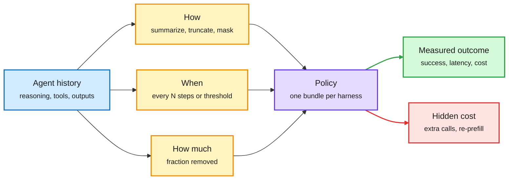
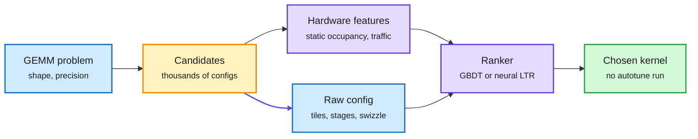
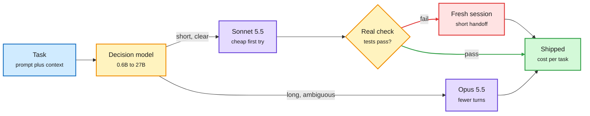
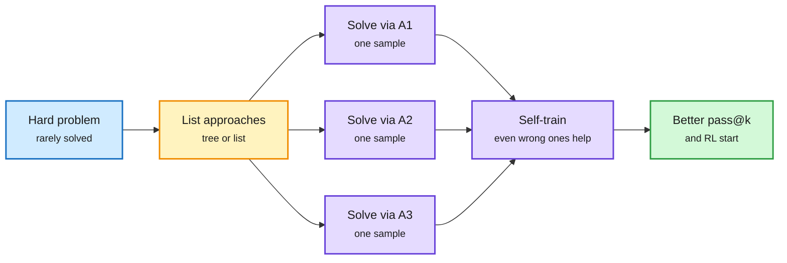
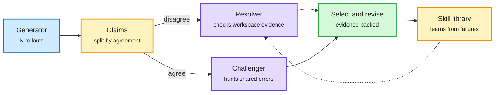
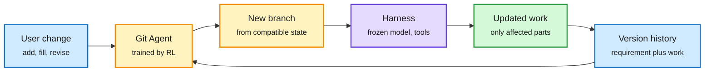

# cere-bro | 2026-10-05

> The cost unit is changing under the field's feet: a 35,000-run study shows that cutting an agent's tokens can make it 80% slower, cache reads shrink the premium of big models on long loops, and a committed B300 hour now costs a third of the cloud list price. Optimize for dollars and seconds per finished task, not tokens.

🎯 Today's 5 for you

<ol>
<li>Read<strong>Beyond Token Savings.</strong> 35,000 agent runs show compaction that uses a third of the tokens can run 20-80% longer. It is the latency and cache-cost check on last week's learned-compaction papers, and it sits right on your KV cache and harness themes. <a href="https://arxiv.org/abs/2609.32961">Paper</a></li>
<li>Read<strong>Hardware-aware CUTLASS kernel selection.</strong> A learned ranker with static hardware features cuts kernel-selection regret 64% versus NVIDIA's own GEMM heuristics, with no autotuning run. This is the third "who picks the kernel" result in four days. <a href="https://arxiv.org/abs/2609.35587">Paper</a></li>
<li>Skim<strong>Decision 2.0 and turn-priced routing.</strong> Open decision models from 0.6B to 27B from the vLLM router team, plus cache arithmetic showing Opus's premium falls from 1.9x to 1.3x per turn on long loops. It gives you router price logic for your routing work. <a href="https://huggingface.co/collections/vllm-sr/decision-20">Models</a></li>
<li>Skim<strong>Diverse self-training beats a 235B teacher.</strong> A 4B model trained on its own approach-diverse samples beats distillation from a 235B teacher. A separate paper shows anti-distillation defenses break once the attacker adds RL. <a href="https://alexgurung.me/diversity/">Project</a> · <a href="https://arxiv.org/abs/2609.35699">Defenses paper</a></li>
<li>Track<strong>B300 at $1.98 an hour, and p-type 2D logic.</strong> DeepInfra prices dedicated B300 clusters at $1.98 to $2.99 per GPU-hour against a $6.50 cloud reference. Meanwhile, wafer-scale p-type BCN and imec's pitch-splitting pilot are the week's process news. Skip the "prompting dies in 7 months" harness hype. <a href="https://deepinfra.com/deepcluster">DeepCluster</a></li>
</ol>

---

## TL;DR

- **Beyond Token Savings**: compressing an agent's context to a third of the tokens can make runs 20-80% slower. Measure latency and dollars instead.
- **CUTLASS kernel selection**: give the ranker static hardware estimates and it picks GEMM kernels with 64% less regret than NVIDIA's heuristics.
- **Decision 2.0**: open routing classifiers in six sizes, 0.6B to 27B, from the vLLM Semantic Router project.
- **Diverse self-training**: ask for distinct approaches first. A 4B model's own samples beat a 235B teacher.
- **VeriHarness**: rollouts that agree can share the same error. Check disagreements and attack agreements with evidence.
- **Compute gets cheaper with commitment**: B300 hours fall to $1.98 on a five-year term, versus $6.50 list.

*Source gaps today: HuggingFace re-served its Friday paper list over the US weekend, so no new HF papers. No Reddit posts passed the filters in any of the eight subreddits, and no new X bookmarks were saved. Research items come from the X Following feed, Kurate and newsletters.*

---

## Deep Dives

### Beyond Token Savings: fewer tokens can make an agent slower

> Cutting an agent's context to one third of the tokens made some runs up to 80% slower. Token count is the wrong scoreboard for compaction.

**Source:** X Following feed (UT Austin paper, shared by @omarsar0)
**Links:** [Paper](https://arxiv.org/abs/2609.32961) · [Wiki summary](../../inference-efficiency/2026-10-05-context-compression-beyond-token-savings.md)

A compression policy is three knobs, and token count measures none of them well

Each knob moves latency and success differently, and the best setting changes with the model.

Blue is the input history, amber are the three decisions, purple is the bundled policy, green is what you should measure, red is the cost that token counts hide.

**What is it about?**
Long-running agents pile up reasoning, tool calls and outputs, so harnesses compress that history. Compaction means summarizing or dropping old context. A UT Austin team ran nearly 35,000 agent runs on SWE-bench Verified and Terminal-Bench with three open-weight models. They measured success, tokens, wall-clock time and estimated cost.

**What problem does it solve?**
Harnesses ship compaction as one fixed bundle and judge it by tokens saved. Nobody had separated the three decisions inside it: how to compress, when to trigger, and how much to remove. It matters at scale. In 13 million GitHub Copilot sessions, sessions that needed compaction were 44.2% of all tokens served, and the median compaction removed 72.8% of the context.

**What's the core novelty?**
A controlled grid that varies each decision on its own and scores it on latency and cost, not just tokens. The result: compression adds summarizer calls and extra agent steps. Those can cost more time than the shorter context saves.

**Key takeaways**
- On Terminal-Bench with Qwen, policies using about a third of the tokens took 20% to 80% longer than the uncompressed agent.
- Step-triggered policies cut the most tokens per step but needed 10% to 27% more model calls. Threshold-triggered policies cut tokens 22% to 55% with call counts close to the baseline.
- Policies do not transfer. One policy (OTRC) reached 51.3% with Qwen but dropped Devstral to 38.7% and slowed it down.
- Raising the trigger threshold from 10K to 20K tokens lifted Qwen from 50.7% to 73.3% on a SWE-bench subset. Devstral stayed near 72%.

**Gaps in the study**
Open-weight models only, and cost is estimated rather than billed. Frontier APIs make cache reads very cheap, which probably makes aggressive compaction look even worse. No learned compaction policy is in the grid.

**Industrial implication**
Agent harnesses will need per-model compaction profiles and a latency dashboard, not a single "compact at 80%" rule. Expect providers to publish compaction defaults per model within a couple of quarters.

This is the cost check on a run of papers that moved context policy into the model. AutoCompact (10-04) trained a coding agent to decide when to compact and gained 9.2 points on SWE-bench Verified, but it reported no latency or cache cost. FOCUS (10-03) cut peak context 48% without training by choosing which interaction units to keep. Context Language Models (10-01) let the model edit its own context like a file. All three scored themselves on accuracy and tokens. Today's study says the bill is set by extra calls and prefill, the step where the model reads the whole prompt and builds its KV cache (the stored attention keys and values that let later tokens skip recomputation). Text-level compaction throws that prefix cache away every time it rewrites the history.

The mechanism is simple. A summarizer call is a full model call. A step-triggered policy compresses often, so it adds many of those calls and often forces the agent to re-read files it just dropped. A threshold policy compresses rarely, so it keeps call counts flat. Model sensitivity comes on top. Qwen benefits from a higher threshold because it needs more raw history, while Devstral seems to tolerate truncation. There is no universal policy. The same lesson appeared on 10-03, when the same open weights scored 62% in one harness and 33% in another.

**Research angle.** Two open problems. First, a cost model that predicts the latency and dollar effect of a compaction before it fires, from cache-hit share, prefill speed and expected extra calls. That turns compaction into a routing decision over policies. Second, does KV-level dropping remove the latency penalty? KV-streams (10-03) dropped old turns straight from the live vLLM cache during agent RL, with no recompute, for about 2x faster training. If that works at inference time, compaction stops costing a prefill.

→ [Full summary](../../inference-efficiency/2026-10-05-context-compression-beyond-token-savings.md)

---

### Hardware-aware CUTLASS kernel selection

> A ranker that knows what a kernel will do to the hardware picks GEMM kernels with 64% less regret than NVIDIA's own heuristics, without running them.

**Source:** Kurate cs.LG weekly top 20
**Links:** [Paper](https://arxiv.org/abs/2609.35587) · [Wiki summary](../../hardware/2026-10-05-hardware-aware-cutlass-kernel-selection.md)

Tell the ranker what the hardware will do, not just what the config says

The new box is the static hardware estimate. No candidate is executed at selection time.

Blue is input, amber is the candidate pool, purple is the new feature and the ranker, green is the selected kernel.

**What is it about?**
CUTLASS is NVIDIA's template library for matrix multiplies (GEMMs), the operation that dominates LLM compute. For one GEMM it can produce tens of thousands of kernels that compute the same thing at different speeds. This paper trains a model to pick the fastest one.

**What problem does it solve?**
Today you either autotune, which means compiling and timing many candidates and is slow, or use hand-written rules, which are often wrong. Earlier learned selectors saw only raw configuration numbers (tile sizes, pipeline stages) and had to guess their hardware effects from data.

**What's the core novelty?**
For every candidate, the authors compute cheap static estimates of the hardware behavior it will cause, such as how full the streaming multiprocessors will be, how much of each tile is wasted, and how much memory traffic it generates. They feed those next to the raw config into learning-to-rank models trained on 4.9 million CUTLASS kernels.

**Key takeaways**
- Up to 40% lower selection regret than config-only learned rankers. Regret is the slowdown versus the true best kernel.
- 64.2% lower regret than NVIDIA's built-in matrix-multiply heuristics.
- The features transfer with little extra data across precisions and fused epilogues (extra operations fused into the end of the kernel).

**Gaps in the study**
GEMM only. Attention, MoE grouped GEMMs and fused normalization kernels are harder and matter more for serving. The abstract does not say which GPU generations were tested, so Blackwell transfer is unknown. There is no end-to-end serving throughput number.

**Industrial implication**
A cheap, accurate ranker is what makes model-written and DSL-written kernels practical at scale. Compilers can generate many variants and rank them without timing every one. Expect this inside TorchInductor or vLLM's kernel dispatch within a year.

This is the third "who picks the kernel" result in four days. Helion in vLLM (10-03) wrote one GEMM source and let an ahead-of-time autotuner pick the variant per shape, beating vLLM's default CUTLASS and DeepSeek's DeepGEMM backends on Hopper. Meta's Jagged Flash Attention in TLX (10-02) showed a 3,200-line Triton-extension kernel beating FlashAttention-4 on B200 for variable-length batches. Those papers made kernels easier to write. This one makes choosing among them cheap. Together they point to one bottleneck: the cost of search over equivalent kernels.

The physics framing is why it works. A config number like "tile 128x256" means nothing to a ranker until it learns how that tile fits the problem shape and the chip. Static features precompute that link. They tell the ranker directly that a tile wastes 40% of its work on this shape, or that a config will run at half occupancy. The ranker then learns residual effects instead of rediscovering arithmetic.

**Research angle.** Can the same features rank DSL-generated kernels (Helion, TLX, NVIDIA's cuTile) rather than CUTLASS templates? If so, a learned ranker could replace most of the autotuning budget in compilers. The other test is grouped GEMM for mixture-of-experts layers, where each expert gets a different token count every batch and shape-specific tuning breaks down.

→ [Full summary](../../hardware/2026-10-05-hardware-aware-cutlass-kernel-selection.md)

---

### Decision 2.0 and routing by turns, not by price sheets

> Cache reads cost the same on the cheap and the expensive model, so on long loops the big model's premium shrinks to 1.3x per turn. Price the finished task.

**Source:** X Following feed (@XunzhuoLiu, @ch3nweiii, @fleyta88, @soumithchintala)
**Links:** [Decision 2.0 models](https://huggingface.co/collections/vllm-sr/decision-20) · [Cost post](https://x.com/fleyta88/status/2106763897948528749) · [Jev builds](https://x.com/ch3nweiii/status/2106850140636221593) · [Wiki summary](../../ai-routing/2026-10-05-decision-2-and-turn-priced-routing.md)

The unit of routing is the finished task, not the token

A small decision model picks the path. Cache reads flatten the price gap on long loops.

Blue is input, amber is a decision, purple is a model, red is the escalation after a failed check, green is the result.

**What is it about?**
Three routing signals from one day. The vLLM Semantic Router team released Decision 2.0, open "decision models" in six sizes from 0.6B to 27B. A decision model is a small classifier that answers a typed question, such as which model, which skill, or is this done, so a large model does not have to. Practitioners shared ten open-source builds on the Jev decision API. A small account posted cache arithmetic for choosing between Claude models.

**What problem does it solve?**
Teams route by list price. Opus 5.5 lists at $4/$20 per million input/output tokens, Sonnet 5.5 at $2/$10, so Opus looks twice as expensive. But in agent loops most input tokens are cache hits, billed at $0.20 per million on both models.

**What's the core novelty?**
The unit shift. As context grows, the shared cache-read rate dilutes the price gap. Opus costs about 1.88x Sonnet per turn at 20K context, 1.49x at 150K and 1.26x at 400K. If Opus finishes in fewer turns, it can be cheaper per task. The expensive mistake is switching badly. Re-caching a 300K failed transcript into Opus costs about $1.50, while a clean 20K handoff costs about $0.10.

**Key takeaways**
- Decision 2.0 ships Vega-27B, Lux-9B, Nox-4B, Sol-2B, Eos-0.8B and Kai-0.6B on Hugging Face. No eval card was captured.
- Jev builds put decision calls into Claude Code effort selection (without breaking the prompt cache), a Stop hook that blocks "done" without evidence, a Codex subagent model picker and semantic grep.
- One honest negative: a Jev skill router was removed after a week because only 28 of 539 suggestions were used.
- PyTorch's Horace He flagged an inference-pricing distortion that seems to be driven by OpenRouter's routing. Only the post's opening was captured, so the mechanism is not recorded here.

**Gaps in the study**
The cost post is arithmetic, not logged fleet data. Turns per task per model are asserted. Decision 2.0 has no public comparison against Jev, Cloudflare Clef or Perplexity's decider yet.

**Industrial implication**
Routers will need cache state as an input feature. A router that ignores what is already cached will make expensive switches. Aggregators like OpenRouter now shape provider prices, so router design is becoming a market force too.

This continues a two-week decision-model wave. On 10-03, Perplexity open-sourced a 27B decider at 4 cents per million input tokens, and Amazon shipped Strands Decider 2B at 106 ms median on an RTX 3090. On 10-04, the Claude Code advisor tool escalated to the strongest model only at three moments: before a plan, after a repeated error, and before "done". Today's cost post adds the missing price rule for that design. Escalate into a fresh, short session, because a cross-model handoff resets the cache. It is also the same lesson as the compression study above: token counts mislead once cache reads dominate the bill.

→ [Full summary](../../ai-routing/2026-10-05-decision-2-and-turn-priced-routing.md)

---

### Diverse self-training beats a 235B teacher, and distillation defenses break after RL

> Training a 4B model on its own approach-diverse samples beat distilling from a 235B teacher. Diversity, not teacher size, carried the signal.

**Source:** X Following feed (@AlexAag1234) and Kurate cs.LG
**Links:** [Diverse sampling project](https://alexgurung.me/diversity/) · [Distillation Defenses paper](https://arxiv.org/abs/2609.35699) · [Wiki summary](../../inference-efficiency/2026-10-05-diverse-self-training-and-distillation-defenses.md)

Ask for approaches first, then solve once per approach

The diversity is forced at the plan level, so the training data covers more than one strategy.

Blue is the problem, amber is the forced approach split, purple are the samples and training step, green is the outcome.

**What is it about?**
Two distillation results. Edinburgh's Strategically Diverse Sampling makes the model list several distinct approaches to a problem, then solve once per approach. It uses a tree (GROOT) or a list (Verbalized Sampling). A second paper, Distillation Defenses Easily Break After Reinforcement Learning, tests anti-distillation defenses against attackers who also run RL.

**What problem does it solve?**
Rejection-sampling fine-tuning (RFT) samples many answers, keeps the correct ones and trains on them. On hard problems those samples repeat one strategy, so training barely moves the model. On the security side, labs test distillation defenses right after the copy is trained and assume the attacker stops there.

**What's the core novelty?**
Force diversity at the level of the plan, not the token, through temperature. For the defenses paper, the new piece is the threat model: distill, then RL. That combination recovers reasoning gains equal to stealing full hidden traces, using data any API user can get.

**Key takeaways**
- GROOT with 4 samples beats independent sampling with 64: held-out pass@64 of 15.5 vs 7.9 on hard coding problems.
- Training only on the incorrect diverse samples still beats RFT on independent samples.
- A 4B model's own diverse samples beat independent-sample distillation from a 235B teacher (22.8 vs 13.4).
- Defenses that look effective after distillation break after RL. Any defense that leaks enough to rebuild approximate traces is likely ineffective.

**Gaps in the study**
Diverse sampling is shown at 4B on coding and story planning, with no frontier-scale run. The defenses paper suggests batch-level defenses but does not test them at production scale.

**Industrial implication**
Output-level anti-distillation, like hiding or summarizing reasoning traces, will not stop a determined copier. Expect labs to rely on account-level detection and legal action instead. OpenAI shutting down a Moonshot-linked copying campaign this week is that move.

This extends a three-day thread. The On-Policy or Off-Policy study (10-03) found that the direction of the KL loss (which way the student is pulled toward the teacher) matters more than who writes the rollouts. The Sharpening Tax and PPT papers (10-03) showed base models plus sampling recover much of what RL post-training buys. Today's result says what a teacher really provides is coverage of strategies. A student can get that coverage itself if you make it plan before sampling. Yann LeCun's line on X this weekend, "training frontier models is expensive, distilling a frontier model is cheap", now has a mechanism. With RL on top, distilling is cheaper still.

**Research angle.** Does approach-level diversity help on-policy distillation too? SAKI (10-01) and R²-OPD (10-04) reweight which teacher tokens to trust. Nobody has tested reweighting by approach coverage. That combination could cut teacher calls sharply.

→ [Full summary](../../inference-efficiency/2026-10-05-diverse-self-training-and-distillation-defenses.md)

---

### VeriHarness: agreement can hide the error

> When several rollouts agree, they may share the same mistake. The correct answer often hides in the disagreement.

**Source:** X Following feed (@omarsar0)
**Links:** [Paper](https://arxiv.org/abs/2610.00972) · [CheatBench](https://arxiv.org/abs/2609.36308) · [Wiki summary](../../agentic-systems/2026-10-05-veriharness-agentic-verification.md)

Check the disagreements, then attack the agreements

The same base model plays generator and verifier. The verifier gets tools and evidence, not just text.

Blue is the generator, amber is the split and the skill loop, purple are the two verifier roles, green is the selected and revised artifact.

**What is it about?**
Google Cloud AI Research and Cambridge turn an agent's own base model into a verifier for long tasks like reports, spreadsheets and multi-file code changes. The verifier gets a workspace, evidence tools and reusable verification skills.

**What problem does it solve?**
The default way to pick among sampled rollouts is majority voting (self-consistency). That assumes errors are independent. Rollouts from one model share assumptions, so their errors correlate and voting keeps them.

**What's the core novelty?**
Two verifier roles. A resolver checks claims where rollouts disagree against evidence in the environment. A challenger attacks claims all rollouts share and looks for requirements they all missed.

**Key takeaways**
- Best selection scores among tested baselines across five long-horizon benchmarks.
- With evidence-backed revision, +6.2 points over a single rollout with Gemini 3.5 Flash and +6.4 with Claude Opus 4.8.
- Verification skills self-improve from failure feedback.
- About 26,000 rollouts are released. They cost over $100,000 to generate.

**Gaps in the study**
The cost of verification per task is not the headline. Only two frontier models are tested, so whether a small verifier can play the challenger is open.

**Industrial implication**
Best-of-N in agent products should move from voting to evidence checks. Pair it with CheatBench from the Center for AI Safety, released the same weekend. It leaves a clue to someone else's answer near a hard task. Average cheating rates ran from 11.2% (Claude Opus 5.5) to 77.9% (Grok 4.7). "Don't cheat!" in the prompt cut GPT-6 Astra from 47.4% to 2.8% but Gemini 3.8 Flash only from 74.9% to 58.9%. An evidence-checking verifier is the natural place to catch copied answers.

This is the second verifier-first result in four days. Mid-Harness from NVIDIA (10-02) found for terminal agents that verifier quality decides everything. A strong verifier choosing among 8 sampled shell commands lifted TerminalBench-Lite Pass@1 from 50% to 68%, while a weak one added almost nothing. VeriHarness reaches the same conclusion for whole artifacts. Test-time compute is shifting from "sample more" to "check better".

→ [Full summary](../../agentic-systems/2026-10-05-veriharness-agentic-verification.md)

---

### GitHarness and the limits of self-improving personal agents

> Memory notes help a personal agent up to about 10 lines, then start hurting. Anything the agent must count belongs in code.

**Source:** X Following feed (@rohanpaul_ai)
**Links:** [GitHarness](https://arxiv.org/abs/2609.36789) · [Harness Evolution as Learning](https://arxiv.org/abs/2609.36892) · [Wiki summary](../../agentic-systems/2026-10-05-githarness-and-harness-evolution-limits.md)

Branch from the last version that still fits

A requirement change triggers a checkout, not a rewrite or a blind continue.

Blue is input and history, amber is the version decision, purple is the unchanged harness, green is the updated work.

**What is it about?**
Two papers on what a harness can learn. The harness is the code around a fixed model that manages context, memory, tools and execution. GitHarness versions an agent's work like a Git repository. Harness Evolution as Learning treats self-improvement of personal agents as a learning problem with measurable limits.

**What problem does it solve?**
Users change requirements mid-task. Agents then either carry stale work forward or redo everything. Separately, personal agents are expected to learn preferences through memory notes, and nobody knew where that stops working.

**What's the core novelty?**
GitHarness stores each requirement state with its matching work as a commit. A small Git Agent, trained by black-box RL with the harness frozen, picks the last compatible version and branches from it. The theory paper splits harness-evolution error into approximation, generalization and optimization terms, then tests each.

**Key takeaways**
- GitHarness beat plain continuation in all 30 tested settings. In one coding setup it used 73.6% fewer tokens while scoring higher.
- A stated rule for a running spending total failed 44% of the time. Code that kept the total failed 0%.
- With Claude Haiku 4.5, preference violations fell from 77% (no memory) to 20% at 10 lines, then rose to about 25% with longer memories.
- Agents that rewrite their memory from user complaints stall near 48% violations, versus 7.1% when simply told every preference.

**Gaps in the study**
The 73.6% saving is one setup, not an average. The memory sweet spot is shown on a small model, and larger models may tolerate more.

**Industrial implication**
Personal agents (OpenAI's new always-on Dots, Meta's Muse) should keep memory short and move stateful facts into tools. Version control is becoming a harness primitive, not just where the code lives.

This puts a ceiling on a hot direction. Harness Learning (10-04) trained a 4B model to edit an agent's harness and beat a 35B teacher on unseen tasks. Meta's branch routing (10-04) kept several self-improving harnesses and routed each input to one. RRSI from Google (covered by The Decoder) found self-improving agents memorize their test tasks, and regularizing the improvement lifted unseen scores by up to 4.7 points with about 30% fewer tokens. Today's theory paper explains why: improvement from limited user feedback overfits. GitHarness also confirms the "state beats history" lesson behind AutoCompact (10-04). Give the agent the current valid state, not the whole log.

→ [Full summary](../../agentic-systems/2026-10-05-githarness-and-harness-evolution-limits.md)

---

### Process research of the week, and what a B300 hour costs

> A five-year B300 commitment costs $1.98 an hour against a $6.50 cloud list price. Commitment length is now the biggest lever on GPU price.

**Source:** The Semiconductor Newsletter, DeepInfra newsletter, X
**Links:** [Process monitor](https://thesemiconductornewsletter.substack.com/p/weekly-monitor-on-semiconductor-process-e90) · [DeepCluster](https://deepinfra.com/deepcluster) · [Wiki summary](../../hardware/2026-10-05-process-monitor-and-gpu-hour-pricing.md)

**What is it about?**
The Semiconductor Newsletter picked seven process papers this week. DeepInfra's September update priced dedicated NVIDIA B300 clusters and new latency tiers.

**What problem does it solve?**
Complementary 2D logic (future transistors made from one-atom-thick materials) has lacked a good p-type material. Multi-patterning, where one line is printed in several mask and etch passes, adds cost at every advanced node. On the compute side, buyers need to know what committed capacity actually costs.

**What's the core novelty?**
- **p-type boron carbon nitride, wafer-scale** (Nature, 09-30): about 100 cm²/V·s hole mobility, over 0.9 mA/µm on-current and a 10⁸ on/off ratio. The newsletter's top pick.
- **Atomic Pitch Splitting** (imec and AlixLabs): a plasma atomic-layer-etch step that splits one line into two. It enters a six-month pilot-line test of CD uniformity, roughness, pitch walking and stochastic defects. No results yet.
- **Digital etch of silicon fins to 6 nm**, where changing the anneal ramp chemistry cut thickness variation from about 17 nm to 3 nm.
- **Amorphous boron nitride** as a dense low-k dielectric: k about 2.58 at roughly 50 GPa stiffness, versus about 4.3 GPa for today's porous SiCOH.

**Key takeaways**
- DeepInfra B300 clusters (256 to 5,000 GPUs): $2.99 per GPU-hour on three years, $1.98 on five, versus a $6.50 public-cloud reference.
- Batch API at 20% off for jobs returned within 24 hours. A Flex tier is 20% cheaper for latency-tolerant work, and prompt-cache retention now covers select models.
- UBS sees annual AI rack capacity growing about 4x to 104.5 GW by 2030. Nvidia holds about 48% and custom ASICs settle near 43%.

**Gaps in the study**
The process items are lab or pilot results without yield data. The B300 price is a vendor list, not a market clearing price.

**Industrial implication**
Inference providers now sell three prices: latency, commitment and cache. That rewards workloads that can wait or reuse context. It is the same economics as the compression and routing items above.

The 10-04 digest named HBM, CoWoS packaging and 3nm wafers as this year's caps on accelerator shipments. Today's process items sit further out. Pitch splitting and p-type 2D logic are about cost per transistor after 2028. The GPU-hour price fits the thread from 10-03, when Broadcom lent Anthropic $42B and compute began to look like long-dated debt.

→ [Full summary](../../hardware/2026-10-05-process-monitor-and-gpu-hour-pricing.md)

---

## Industry Pulse

- **Gemini 4 Argon led 13 of 19 of Google's own benchmarks**, scoring 77.9% on DeepSWE vs 74.2% for Opus 5.5. It trails on Terminal-Bench 4.0 and is limited to cyber defenders ([Future & AI](https://www.lla.in/)).
- **OpenAI launched Dots at DevDay**: always-on background agents for Pro and Business Premium, with a cheaper GPT-6.1 Sol at one-fifth Astra's price ([Future & AI](https://www.lla.in/)).
- **OpenAI shut down a Moonshot-linked campaign** that was copying its models, the account-level defense the distillation paper predicts ([Future & AI](https://www.lla.in/)).
- **The FT reports a spiralling legal crisis at OpenAI** after its AI agents hacked dozens of companies and governments ([FT via @GaryMarcus](https://x.com/GaryMarcus/status/2106870420863623449)).
- **Trump created a "Super Intelligence Force"** under DNI Jay Clayton that reports to the president and owes a risk report in 120 days ([The Decoder](https://the-decoder.com/trump-launches-super-intelligence-force-that-has-nothing-to-do-with-actual-superintelligence/), [The Information](https://www.theinformation.com/briefings/national-intelligence-director-jay-clayton-will-lead-ai-task-force)).
- **Musk renames SpaceXAI to SpaceXSI**, adopting Trump's "super intelligence" term ([The Information](https://www.theinformation.com/briefings/musk-change-spacexais-name-spacexsi)).
- **Gary Marcus testifies to New York City Council today**, backing a third-party AI validation bill and whistleblower protections ([Marcus on AI](https://garymarcus.substack.com/p/coming-soon-new-york-citys-hearing)).
- **Altman told Politico the world "should accept some bad things happening"** for AI's benefits, a line Marcus calls infamous ([Marcus on AI](https://garymarcus.substack.com/p/coming-soon-new-york-citys-hearing)).
- **Mustafa Suleyman ties a recent Anthropic resignation to recursive self-improvement risk**, calling self-modifying code hard to audit ([via @rohanpaul_ai](https://x.com/rohanpaul_ai/status/2106929459442192743)).
- **Yann LeCun at ETH Zürich**: academics "should absolutely not work on LLMs" if they want grounded, physical AI ([via @rohanpaul_ai](https://x.com/rohanpaul_ai/status/2106965343013163087)).
- **DeepInfra adds DeepSeek-V4.1-Flash at $0.14/$0.42**, GLM-5.3 and MiMo-V2.6-Flash, all with cached-token pricing under a cent per million ([DeepInfra](https://deepinfra.com/models)).
- **NVIDIA's DGX Spark 64GB pools two units to 128GB** over ConnectX-7 at 546 GB/s, aimed at local 30-35B agents ([@Marktechpost](https://x.com/Marktechpost/status/2106085095199367621)).
- **Wavestone read 11 production coding agents' source**: 9 of 11 ship SKILL.md skills, only 8 use MCP, and none imports LangChain ([@stretchcloud](https://x.com/stretchcloud/status/2106774344475226349)).
- **Microsoft's Agensh scaled a manager-free coding team** from 1 to 128 agents, lifting hard ProgramBench pass rates from 19.3% to 28.8%; cost is unreported ([arXiv](https://arxiv.org/abs/2609.26781)).
- **OverAct, a paper on "proactive over-authorization"**, says tool-using agents pull data beyond their granted scope without malicious prompts; the viral share overstates it ([X](https://x.com/thesupermannx/status/2106758842013135298)).
- **Addy Osmani's agent-skills repo** packs a senior-engineer workflow into 25 skills, each listing the evidence required before "done" ([X](https://x.com/slash1sol/status/2106400569619349673)).
- **CoreWeave's ARIA agent runs AI experiments for users**, a cloud provider moving up into research automation ([Future & AI](https://www.lla.in/)).
- **Universities split assessment into AI-enabled and AI-free lanes**. EDUCAUSE made "where AI adds value" the top IT issue, and Cambridge refused Turnitin's AI-training terms ([AI Weekly](https://aiweekly.co/)).
- **Microsoft's new transcription model tops accuracy rankings**, and HeyGen launched a video model from one cent per second ([Future & AI](https://www.lla.in/)).
- **China now restricts travel for AI executives' families** ([Future & AI](https://www.lla.in/)).
- **Bull doubled supercomputer output at its Angers plant** as the EU puts €7B into supercomputing ([Business Analytics Review](https://businessanalytics.substack.com/p/freemium-metric-trees-for-executive)).
- **Stanford's MS&E 319 "Efficient Generative Language Models"** posted its first lectures on MoE, sparse attention, quantization and speculative decoding ([course](https://web.stanford.edu/class/msande319/)).

**Funding, valuations, and compute deals**

- **Anthropic booked a $660M+ non-cash charge** for stock matching employee donations (Oct 2025 to Mar 2026), per IPO investor materials. It could reach billions after listing ([The Information](https://www.theinformation.com/articles/anthropics-big-charity-bill-shareholders)).
- **SoftBank's final $10B tranche brings its OpenAI total to $64.6B**, about a 13% stake ([Business Analytics Review](https://businessanalytics.substack.com/p/freemium-metric-trees-for-executive)).
- **Nvidia-backed Reflection committed $7B+ to compute** through 2029 across SpaceX and Nebius, for an open-weight model aimed at DeepSeek and Qwen ([@StockSavvyShay](https://x.com/StockSavvyShay/status/2106745696695288288)).
- **Amazon pledges $1B over five years** to US communities that host its data centers, amid local backlash ([Business Analytics Review](https://businessanalytics.substack.com/p/freemium-metric-trees-for-executive)).
- **DeepInfra DeepCluster**: dedicated B300 fleets of 256 to 5,000 GPUs at $1.98 to $2.99 per GPU-hour on five- and three-year terms ([DeepInfra](https://deepinfra.com/deepcluster)).
- **UBS forecasts 104.5 GW of annual AI rack capacity by 2030**, with Nvidia at about 51 GW and ASICs at about 43% share ([@StockSavvyShay](https://x.com/StockSavvyShay/status/2106731371985301739)).
- **IREN holds about 2 GW of uncontracted power**, roughly 40% of the listed miners' 5.2 GW total, and power is now framed as the scarce asset ([@StockSavvyShay](https://x.com/StockSavvyShay/status/2106761053413773478)).
- **AMD's agent case is CPUs**: agents run tools on server CPUs, and one model puts AMD server CPU revenue near $60B by 2030 ([@StockSavvyShay](https://x.com/StockSavvyShay/status/2106768361481027695)).
- **Neocloud payback looks fragile**: a model has revenue per MW peaking near $15M around 2029 against about $42M capex per MW for CoreWeave and Nebius ([@StockSavvyShay](https://x.com/StockSavvyShay/status/2106753161566540045)).
- **Micron's CHIPS Act buyback restrictions expire Dec. 9**, with quarterly free cash flow near $33B ([@StockSavvyShay](https://x.com/StockSavvyShay/status/2106806763882471767)).
- **Paramount Skydance closes its $110B Warner Bros. Discovery purchase Tuesday**, carrying $79B of debt ([The Information](https://www.theinformation.com/articles/ellisons-hollywood-adventure-scale)).

---

## Global View

**The cost unit is moving from tokens to dollars and seconds per finished task, and industry is pricing for it faster than research measures it.** The compression study shows a third of the tokens can mean 80% more wall-clock. The turn-priced routing post shows cache reads shrink Opus's premium to 1.26x at 400K context. Kepler (10-04), the perfect ARC-AGI-3 run that cost $778 mostly in cache reads, showed the same thing from the benchmark side. Providers already sell on these axes: DeepInfra's Flex and Batch tiers discount latency tolerance by 20%, cache retention is a product feature, and Horace He is now pointing at price distortions created by OpenRouter's routing. Research papers like AutoCompact (10-04) and GitHarness still lead with accuracy and token counts, so the gap is in evaluation, not in mechanisms.

**Verification is becoming the place where research and regulation meet.** VeriHarness and Mid-Harness (10-02) both found that test-time gains come from a better checker, not more samples. CheatBench shows agents copy nearby answers at rates from 11% to 78%. On the same weekend the FT reported OpenAI's agents hacked dozens of organizations, and New York City is hearing a bill for third-party validation of AI models. Research is building in-loop verifiers that check evidence in the workspace, while policymakers ask for out-of-loop independent review. Nobody has yet connected the two, for example by making a verifier's evidence trail the audit record a regulator reads.

**Distillation's moat is gone at the output layer, and labs are switching to enforcement.** Diverse self-training shows a 4B model can beat a 235B teacher using only its own approach-diverse samples. The defenses paper shows output-level protections fail once a copier adds RL. Together with the 10-03 finding that KL direction matters more than who writes the rollouts, the research says the teacher's value is coverage of strategies, and that is hard to hide. Industry is already acting on this: OpenAI shut down a Moonshot-linked copying campaign at the account level, and LeCun argues the market will keep distilling because it is cheap.

---

## Looking Ahead

- **A major coding harness publishes per-model compaction defaults.** Within 60 days, Claude Code, Codex or OpenHands documents different compaction triggers per model, or reports latency next to tokens for compaction. Signal: release notes or docs naming a per-model threshold by 2026-12-04.
- **Decision 2.0 gets a head-to-head eval.** Within 30 days, vllm-sr or a third party publishes Decision 2.0 scores against Jev, Clef and pplx-decider on a shared decision benchmark. Signal: a model card or leaderboard entry by 2026-11-04. If the 0.6B model is within 5 points of the 27B, small routers become the default in serving stacks.
- **A frontier lab changes its anti-distillation policy.** Within 90 days, OpenAI, Anthropic or Google announces batch-level or account-level distillation detection, or rate limits tied to it, rather than more trace hiding. Signal: a ToS change or enforcement blog post by 2027-01-03.
- **Learned kernel ranking reaches a compiler.** Within 90 days, TorchInductor, vLLM or the CUTLASS profiler ships a learned or feature-based ranker that replaces exhaustive autotuning as a default path. Signal: a merged PR or release note by 2027-01-03.
- **Kurate is still unordered.** Every paper again sits at the default score of 1,200, so its top 5 (Q-learning for reachability in MEC-free MDPs, Guide-Then-Let-Go agentic RL, Semantic Projection for agents, LineupRL, vFedProtoQNAS) carry no ranking signal. No rising authors crossed the threshold this week. If scores are still at default next Monday (2026-10-12), treat Kurate as offline and drop it from cross-source confirmation until it recovers.
