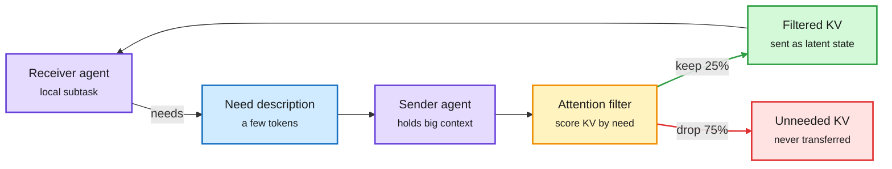
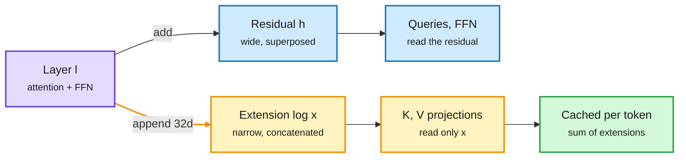
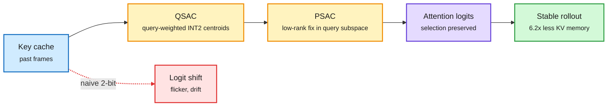
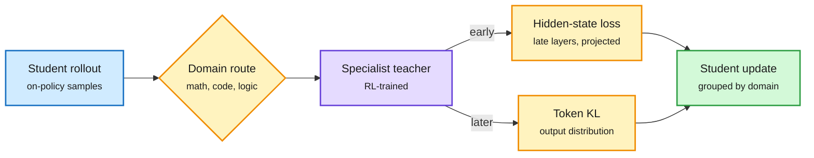
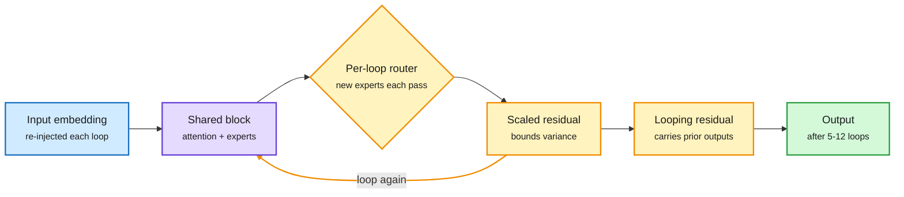
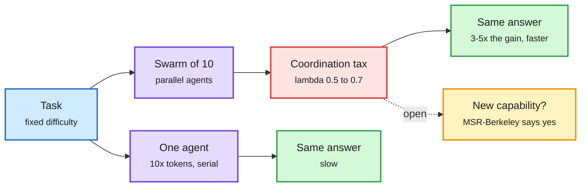
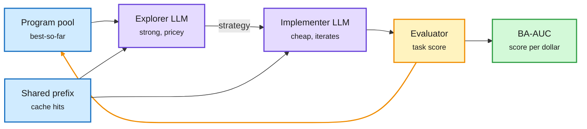

# cere-bro | 2026-10-06

> Today's cost story is about memory that never needed to exist. One agent sends another only the quarter of its KV cache that was asked for. A Transformer keeps a 104x smaller attention cache. A 2-bit cache keeps its accuracy by protecting what attention selects, not every value. On the business side, the same squeeze shows up as rationing: subscriptions take 40% of Anthropic's compute for 10% of its revenue, and Microsoft and Meta are cutting their own Claude bills.

🎯 Today's 5 for you

<ol>
<li>Read<strong>CacheBack.</strong> Agents swap KV caches instead of text, and the receiver first says what it needs. That cuts the transferred state by 75%, adds 14.7 accuracy points and makes tasks 3.2x faster. It is cross-agent KV cache work, and it prices the communication cost of swarms. <a href="https://arxiv.org/abs/2609.32046">Paper</a></li>
<li>Read<strong>The Extender.</strong> Keys and values read a thin 32-dim log instead of the wide residual stream, so the persistent attention cache is 104x smaller than MHA. It matches short-context accuracy and wins on RULER at 924M. This is a KV cache architecture result. <a href="https://arxiv.org/abs/2609.32759">Paper</a></li>
<li>Skim<strong>QuantWM, plus FP4 experts in production.</strong> At 2 bits, Key errors are smaller than Value errors yet do more damage, because they change which past tokens attention picks. Red Hat separately shipped a 125B MoE with only the experts in FP4. Both are quantization. <a href="https://arxiv.org/abs/2609.26425">Paper</a> · <a href="https://huggingface.co/RedHatAI/Qwen3.8-Flash-Next-NVFP4">Checkpoint</a></li>
<li>Skim<strong>Multi-teacher distillation, and BF16 hides the update.</strong> Latent-MOPD merges specialist teachers through hidden states and tokens. A companion study finds 97% of FP32 master weights move while only 7-11% of BF16 weights do. Read it before you trust any "sparse update" claim. <a href="https://arxiv.org/abs/2610.02381">Latent-MOPD</a> · <a href="https://arxiv.org/abs/2610.02179">Diagnostics</a></li>
<li>Track<strong>What a token really costs.</strong> SemiAnalysis's plan-meter experiments find Anthropic's mid-tier plan gives about 5x OpenAI's value. Microsoft cut projected internal Claude spend by a third. Watch this for compute economics and routing demand. Skip the "DeepGEMM saves 98% of tokens" thread: it is a GEMM kernel library, not a token saver. <a href="https://newsletter.semianalysis.com/p/anthropic-subscriptions-offer-5x">SemiAnalysis</a></li>
</ol>

---

## TL;DR

- **CacheBack**: agents ask before they receive. Sending only the KV slice the receiver needs cuts state 75% and latency 3.2x.
- **The Extender**: a Transformer whose keys and values read a tiny shared log. Attention memory is 104x smaller at equal accuracy.
- **QuantWM**: in 2-bit KV caches, Key errors move attention to the wrong past tokens. Protect the selection and get 6.2x compression.
- **Latent-MOPD**: one student absorbs several specialist teachers through hidden states and tokens, and beats the best single teacher on most benchmarks.
- **SemiAnalysis on subscriptions**: plans are 10% of Anthropic revenue but over 40% of its compute. Microsoft and Meta are cutting Claude use.
- **Swarm scaling**: ten times more agents gives about 3-5x the gain of ten times more tokens. Swarms mostly buy speed.

*Source gaps today: no Reddit post passed the filters in any of the eight subreddits, no new X bookmarks were saved, the curated-retweet scrape was empty, and YouTube and LinkedIn returned no usable items. Kurate's weekly lists are posted but not yet scored, so no Kurate ranking signal is used today. VentureBeat's RSS feed returned HTML instead of RSS.*

---

## Deep Dives

### CacheBack: the receiver asks first, and three quarters of the cache never moves

> When agents swap KV caches instead of text, the fix for the memory blowup is to let the receiver say what it needs before anything is sent.

**Source:** HuggingFace
**Links:** [Paper](https://arxiv.org/abs/2609.32046) · [Wiki summary](../../inference-efficiency/2026-10-06-cacheback-receiver-conditioned-kv-communication.md)

The receiver asks first, so the sender ships a quarter of its cache

The only new step is the small "what I need" message going the other way.

Purple are the agents, blue is the need message, amber is the attention filter, green is what crosses the wire, red is what stays behind.

**What is it about?**
Multi-agent systems split a large context across several agents that then talk to each other. One newer way to talk is "latent communication": instead of writing a text message, an agent hands over its KV cache (the stored attention keys and values for everything it has read). CacheBack makes that handover small. The receiving agent sends a short description of what it needs. The sender scores its cached positions by how much they attend to that description and ships only the top slice.

**What problem does it solve?**
Text messages are compact, but they have to be generated, which takes time, and they can leave out evidence the receiver needed. Full KV transfer keeps everything, but its size grows with each agent's context and again with the number of agents. It quickly overflows GPU memory and context windows. Until now you had to pick one of these two costs.

**What's the core novelty?**
Receiver conditioning. The sender does not guess what matters. The receiver tells it, and the sender's own attention weights do the filtering. The method needs no training, and it reuses scores the model already computes.

**Key takeaways**
- On FanOutQA with Qwen 3, CacheBack removes 75% of the state the receiver would otherwise get.
- Accuracy rises 14.7 points and median task-completion latency falls 3.2x compared with text messages.
- Gains hold across dense Transformers, Mamba-attention hybrids and sliding-window attention models.

**Gaps in the study**
One headline benchmark, and no long-horizon coding swarm. Sender and receiver must share a model family, because KV caches are not portable across architectures without a learned mapping like HeteroFold (10-03, which translated caches between model families). There are no serving numbers for transfer bandwidth or batching.

**Industrial implication**
This is the third step on a ladder the wiki has been tracking. KVCMAS and PReCache (09-30) stored one shared cache for agents built on the same base model. CacheBack now decides what crosses the boundary between agents at all. Agent frameworks that run many copies of one open model, such as vLLM-based swarm harnesses, could ship receiver-conditioned transfer within two quarters. It also answers part of the swarm tax discussed below: coordination is expensive partly because agents over-share.

→ [Full summary](../../inference-efficiency/2026-10-06-cacheback-receiver-conditioned-kv-communication.md)

---

### The Extender: keys and values read a thin log, and the cache shrinks 104x

> Give every layer a tiny append-only channel, let only keys and values read it, and the per-token attention cache collapses while long-context accuracy goes up.

**Source:** HuggingFace
**Links:** [Paper](https://arxiv.org/abs/2609.32759) · [Wiki summary](../../llms-foundation-models/2026-10-06-extender-log-structured-transformer.md)

Keys and values read a thin log, not the wide residual

Only the small appended channel has to be cached per token.

Purple is the layer, blue is the usual residual path, amber is the new append-only channel, green is what the cache stores.

**What is it about?**
In a standard Transformer, layers pass information forward through one wide vector, the residual stream, where every layer adds its update. The Extender adds a second channel. Each layer still adds to the residual, but it also appends a small 32-number extension to a growing list. Queries and the feed-forward block read the residual as before. The key and value projections of every layer read only the appended list.

**What problem does it solve?**
The KV cache stores keys and values for every past token in every layer, so its size scales with layers times model width. That memory, not compute, limits long context and batch size. Today's fixes either compress each layer's cache (MLA, DeepSeek's low-rank latent KV) or share caches across layers after training.

**What's the core novelty?**
The appended list already holds everything any layer's keys and values need. So you cache the list once, not a full K and V per layer. The per-token footprint drops from 2 x layers x width to the sum of the small extensions.

**Key takeaways**
- At width 1664 and 924M parameters, persistent attention memory is 104x smaller than multi-head attention.
- Short-context (CORE) accuracy matches the Transformer from 199M to 924M.
- Long-context (RULER) accuracy is higher than the Transformer at 924M.
- The savings grow with model width.

**Gaps in the study**
The largest model is 924M, and the baseline is MHA, not GQA (grouped-query attention, which already shares keys and values across heads and would shrink the 104x). Attention compute is unchanged, and there are no throughput or kernel numbers.

**Industrial implication**
If the result holds at 7B and above, this is a cleaner path than retrofitting cross-layer sharing. The cache saving is designed in, not bolted on. Expect a GQA-matched replication within 90 days. If the gap stays above 10x, it becomes a serious candidate for long-context agent models where the prefill-to-decode ratio is around 320:1 (SemiAnalysis's Claude Code trace figure from August).

→ [Full summary](../../llms-foundation-models/2026-10-06-extender-log-structured-transformer.md)

---

### QuantWM: at 2 bits, protect what attention selects

> Quantized Keys have smaller errors than quantized Values but cause more damage, because they change which past tokens a query attends to.

**Source:** HuggingFace, plus Red Hat AI and AI Weekly Espresso for the production side
**Links:** [Paper](https://arxiv.org/abs/2609.26425) · [Wiki summary](../../inference-efficiency/2026-10-06-quantwm-2bit-kv-world-models.md) · [NVFP4 checkpoint](https://huggingface.co/RedHatAI/Qwen3.8-Flash-Next-NVFP4)

Protect what the query selects, not the raw Key values

Small Key errors flip which past tokens get attended. The fix targets that selection.

Blue is the cache, amber are the two corrections, purple is attention, green is the result, red is what naive 2-bit does.

**What is it about?**
Video world models generate long interactive videos and keep a KV cache of past frames to stay consistent. QuantWM compresses that cache to 2 bits without retraining.

**What problem does it solve?**
Existing 2-bit KV methods look nearly lossless on the VBench video benchmark. In world models they still cause flicker and visual drift. Average scores hide the failure.

**What's the core novelty?**
A diagnosis, then two fixes. A quantized Key nudges the attention score (logit) for every query that reads it. In video, that is enough to change which past spatial-temporal tokens a query selects. So the method protects selection. QSAC picks INT2 Key centroids weighted by how sensitive past queries were to each channel. PSAC then corrects the leftover Key error along the few directions queries actually use, with a cheap low-rank projection.

**Key takeaways**
- Tested on five world models: LingBot-World-v2, HY-World 1.5, Matrix-Game-2, Longcat-Video and Causal-Forcing.
- Up to 6.2x KV cache compression with better quality and temporal consistency than prior 2-bit methods.
- On the production side, Red Hat AI released an NVFP4 (NVIDIA's 4-bit float format) checkpoint of the 125B MoE Qwen3.8-Flash-Next with only the experts in FP4. Attention, embeddings and the router stay in BF16.
- The Strata engine claims the same model runs on a 12GB gaming GPU with 32GB of RAM by parking experts in host memory, at 100-140 tokens per second on an RTX 3090. These are the project's own numbers.

**Gaps in the study**
World models only. Nobody has tested whether query-weighted centroids help 2-bit KV in LLMs. The extra overhead is described as "limited" but not measured as latency.

**Industrial implication**
This is the third 2-bit KV recipe in a week. PrismQuant (10-01) aligned its rotation with the quantizer's grid. WUSH-KV (10-02) fitted rotations to calibration data. QuantWM changes the target from "reconstruct the value" to "keep the same tokens selected." Precision is now being spent by role: FP4 for rarely used experts, BF16 for the shared path, and selection-aware 2-bit for Keys. That split is likely to become standard in vLLM and SGLang quantization configs.

→ [Full summary](../../inference-efficiency/2026-10-06-quantwm-2bit-kv-world-models.md)

---

### Multi-teacher distillation: two channels per teacher, and BF16 hides the update

> One student can absorb several specialists through their hidden states as well as their outputs. A companion study shows the weights you inspect in BF16 hide most of what changed.

**Source:** HuggingFace (two papers)
**Links:** [Latent-MOPD](https://arxiv.org/abs/2610.02381) · [From Gradients to Capabilities](https://arxiv.org/abs/2610.02179) · [Wiki summary](../../inference-efficiency/2026-10-06-multi-teacher-opd-latent-mopd-and-diagnostics.md)

Two channels per teacher, one student

Each prompt goes to its specialist, which supervises both hidden states and tokens.

Blue is the student's own sample, amber are routing and the two loss channels, purple is the teacher, green is the merged update.

**What is it about?**
On-policy distillation (OPD) trains a student on answers it writes itself, with a teacher grading every token. The multi-teacher version merges several RL-trained specialists (math, code, logic) into one student. Latent-MOPD adds a second channel: the student also matches the right teacher's late-layer hidden states. A companion paper from UIUC, Princeton and Westlake studies what these teacher signals actually do to the weights.

**What problem does it solve?**
Strong specialists do not automatically give a strong merged student. Token-level signals carry only what the teacher predicts, not how it computed it. Nobody had traced how different teacher signals turn into parameter changes.

**What's the core novelty?**
Latent-MOPD picks late-layer targets based on the teacher-student relationship, bridges different hidden widths with a shared projection, and groups updates by domain. Supervision moves from hidden states to tokens over training. The diagnostic paper measures gradients, Adam updates and weight changes side by side.

**Key takeaways**
- Latent-MOPD beats token-only, representation-only and uniform-averaging baselines on all nine benchmarks. The student, at the same size as each teacher, beats the best single teacher on most of them.
- Mixing teacher domains inside one update collapses the representation-only control. Grouping by domain is required.
- Adam's first moment makes different teachers' updates 0.83 cosine-similar even when their raw gradients differ.
- About 97% of FP32 master weights move, but only 7-11% of BF16 weights change. Rounding hides the rest.

**Gaps in the study**
Latent-MOPD needs white-box teachers, so it does not work with API-only teachers. The diagnostics run at 1.7B and 3B only.

**Industrial implication**
The BF16 finding is the one to remember. Earlier wiki entries (10-02 and 10-03) argued the distillation signal "lives in a few places," partly from sparse weight changes. Some of that sparsity may be a rounding artifact. Any lab using update sparsity to pick which weights to train or merge should measure in FP32. Latent-MOPD is the practical recipe for consolidating domain experts into one serving model, which cuts the number of models a router has to choose between.

→ [Full summary](../../inference-efficiency/2026-10-06-multi-teacher-opd-latent-mopd-and-diagnostics.md)

---

### LOOM: looping a mixture-of-experts model past two passes

> Looped MoE models stop improving after two loops because the router keeps choosing the same experts. Give each loop its own router and it scales to 9-12 loops.

**Source:** HuggingFace
**Links:** [Paper](https://arxiv.org/abs/2610.01153) · [Code](https://github.com/hed-ucas/LOOM) · [Wiki summary](../../llms-foundation-models/2026-10-06-loom-looped-moe-beyond-twice.md)

Each loop must add new computation and keep the state stable

Per-loop routers fix expert collapse. Scaled residuals and re-injection fix drift.

Blue is the input, purple is the shared block, amber are the loop controls, green is the result.

**What is it about?**
A looped Transformer runs the same blocks several times, getting more depth without more parameters. LOOM is a recipe for doing this with MoE models (mixture-of-experts, where each token goes through only a few specialist sub-networks).

**What problem does it solve?**
Prior looped-MoE work settled on two loops because more loops gave little or even hurt. LOOM names two causes. The hidden state's variance grows every loop, so it drifts. And routers keep picking the same experts each loop, so extra loops repeat the same computation.

**What's the core novelty?**
One rule: each loop must add new computation while the state stays stable. Residual updates are scaled to bound variance, and the input embedding is re-injected every loop. Each loop gets its own router, and a "looping residual" carries earlier loop outputs forward.

**Key takeaways**
- Stable scaling to 9-12 loops from 100M to 1.7B parameters.
- At near-equal FLOPs, a 700M model is best at 5 loops: perplexity 18.36 to 16.54, zero-shot accuracy 38.84% to 39.53%.
- Without FLOP matching, 1.7B on 60B tokens peaks at 9 loops: perplexity 9.62 to 7.77, zero-shot 42.4% to 47.7%.

**Gaps in the study**
The FLOP-matched gain is small (+0.7 points at 700M). The headline 1.7B gain spends more compute. There are no latency or per-loop KV cache numbers.

**Industrial implication**
This is the fourth looped-MoE paper in five days, after Loop Scaling Laws (10-02, a joint law for loops and sparsity), LoopCD (10-03, early loops as a free contrastive signal) and Foil (10-04). It directly contradicts Foil. Foil shared routers across passes and argued for a flatter expert pool. LOOM says shared routers collapse. Until someone runs both recipes at matched compute, treat router tying as an open design choice. Production adoption still waits on the latency question, since loops run in sequence.

→ [Full summary](../../llms-foundation-models/2026-10-06-loom-looped-moe-beyond-twice.md)

---

### SemiAnalysis: what an AI subscription is worth, and who is cutting back

> Subscriptions are 10% of Anthropic's revenue but can use over 40% of its inference compute. Its biggest corporate customers are now rationing Claude.

**Source:** SemiAnalysis (essay), The Information, The Decoder, AI Weekly Espresso
**Links:** [SemiAnalysis](https://newsletter.semianalysis.com/p/anthropic-subscriptions-offer-5x) · [The Information](https://www.theinformation.com/articles/meta-microsoft-work-wean-staff-anthropics-claude) · [The Decoder](https://the-decoder.com/meta-and-microsoft-pull-back-from-claude-as-anthropic-transforms-from-partner-into-competitor/) · [Wiki summary](../../ai-industry/2026-10-06-subscription-economics-and-claude-pullback.md)

**What is it about?**
SemiAnalysis measured what each AI subscription is worth in API prices. Plans show a usage meter, not a token price. So they ran experiments that use one token type at a time (input, cache write, cache read, output) and watched how far the meter moved. That gives each plan's hidden per-token rates.

**What problem does it solve?**
"A $200 plan" means nothing on its own. The plan's internal credit rates differ from API price ratios, so value depends on the plan, the model and the workload together. Labs also change these rates quietly.

**What's the core novelty?**
A daily-refreshed measurement of the hidden price list. Along the way they caught a provider running a silent A/B test that gave one account about 20% lower limits.

**Key takeaways**
- At Anthropic, subscriptions are about 10% of revenue but can use over 40% of inference compute, lowering blended revenue per MW by about $36M.
- At the mid-tier "daily driver" models (Opus 5.5 vs GPT-6.1 Sol), Anthropic's plan gives about 5x the API-equivalent value. At the top tier (Fable 5.1 vs GPT-6 Astra) the plans are close, but Fable is capped at half the plan.
- OpenAI halved its $200 plan's token allowance (old buyers keep it until October 29). The new $500 plan gives only 21% more Astra than the old $200 plan. Its headline is Ultrafast, up to 8x faster and 8x the burn.
- Microsoft cut projected internal Claude spend, once on track for over $1B, by more than a third. Its cloud division cut per-employee monthly Claude budgets from $100,000 to $10,000. Meta halved Claude Code users to 30,000.

**Gaps in the study**
The full dashboard is paywalled. Value assumes SemiAnalysis's own agentic token mix, and cache-read-heavy workloads change the ranking most.

**Industrial implication**
Cheap plans are a compute allocation decision, not just marketing. For the reader's work, the signal is demand for routing. When Microsoft caps Claude at $10,000 per employee and GPT-6's price range spans 100x (Luna at $0.10 per million input tokens up to Astra at $50 per million output), sending each call to the cheapest adequate model becomes a budget line. The Melius upgrade of Microsoft on a "secure wrapper that routes models" thesis says the sell side sees it too.

→ [Full summary](../../ai-industry/2026-10-06-subscription-economics-and-claude-pullback.md)

---

### Swarm scaling: more agents mostly buy speed

> Ten times more agents gives about 3-5x the gain of ten times more tokens on one agent. That is close to how human teams scale.

**Source:** Understanding AI (essay), Import AI 475 on Toby Ord's "Swarm Scaling"
**Links:** [Understanding AI](https://www.understandingai.org/p/why-agent-swarms-could-be-the-next) · [Import AI](https://importai.substack.com/p/import-ai-475-swarm-scaling-google) · [Wiki summary](../../agentic-systems/2026-10-06-swarm-scaling-speed-not-capability.md)

A swarm trades extra tokens for less waiting

Total spend rises and time to answer falls. Whether capability rises is the open question.

Blue is the task, purple are the two setups, red is the coordination cost, green is the outcome, amber is the unresolved claim.

**What is it about?**
OpenAI now trains models alongside other agents, with tools to message each other, and used 10,000 agents on a Navier-Stokes problem. Two essays ask whether this is a new scaling law.

**What problem does it solve?**
"Swarm" results get reported without cost. Nobody had a simple way to compare N agents against one agent given N times the tokens.

**What's the core novelty?**
Toby Ord borrows the economists' "stepping on toes" parameter λ (how parallelizable a task is). With λ at 1, adding agents is free. Below 1, each extra agent adds less. He estimates λ at 0.5 to 0.7 for GPT-5.6 Sol swarms.

**Key takeaways**
- A 4-agent swarm needed about 2x the total tokens for the same result, but half the tokens per agent. In parallel, that is about half the wall-clock time.
- The Claude Opus 5.5 system card found most multi-agent gain comes from going from 1 to 10 agents.
- Noam Brown credits under 10% of the Navier-Stokes result to the swarm. The model did the work.
- The counterpoint is a Microsoft Research and UC Berkeley paper (09-17) where teams beat solo agents with ample time, and one task was only solvable by a team.

**Gaps in the study**
No matched-spend comparison at frontier scale exists. OpenAI did not run the 1,000-agent ablation because it was too expensive.

**Industrial implication**
For cost work, a swarm is a latency product sold at a token premium. Price it that way. The three efficiency results today point the same direction. CacheBack cuts the communication part of the tax. FrugalEvo (below) beat ~$50 multi-agent search systems for under $2. Agensh (09-28, Microsoft's 1,024-agent harness) still owes a cost-per-point number. Ord adds one safety note: a λ this high makes a research-speedup feedback loop more plausible, not less.

→ [Full summary](../../agentic-systems/2026-10-06-swarm-scaling-speed-not-capability.md)

---

### Harness search goes cheap: FrugalEvo, SelfSearch, CorpusMap

> A Codex-level harness for $4.03, and a state-of-the-art circle packing for $0.55. Search over scaffolds is now priced in dollars, not iterations.

**Source:** HuggingFace (FrugalEvo), X Following feed (SelfSearch via @omarsar0, CorpusMap via @dair_ai)
**Links:** [FrugalEvo](https://arxiv.org/abs/2610.03675) · [SelfSearch](https://arxiv.org/abs/2609.37968) · [CorpusMap](https://arxiv.org/abs/2609.37226) · [Wiki: FrugalEvo](../../agentic-systems/2026-10-06-frugalevo-cost-aware-program-evolution.md) · [Wiki: harness papers](../../agentic-systems/2026-10-06-harness-search-and-agentic-search-papers.md)

Expensive model plans, cheap model types, the cache does the rest

FrugalEvo arranges prompts so most of each step is a cache read.

Blue are the pool and cached prefix, purple are the two models, amber is the evaluate-and-loop step, green is the cost-aware metric.

**What is it about?**
Three papers that make search over agent scaffolds and programs cheap. FrugalEvo is AlphaEvolve-style program evolution scored per dollar. SelfSearch lets a coding agent rewrite its own harness (the loop, tools and prompts around the model). CorpusMap pre-builds an entity map so search agents stop re-reading documents.

**What problem does it solve?**
Evolution and harness search were judged by gains after a fixed number of steps, which ignores cost. Benchmark-driven harness search is expensive and overfits to the benchmark.

**What's the core novelty?**
FrugalEvo splits work between a strong explorer and a cheap implementer. It lays out prompts so steps share long prefixes and hit the prompt cache, and it scores runs by BA-AUC (area under the best-score curve over cumulative spend). SelfSearch uses records of earlier self-edits instead of a reward. CorpusMap links each recurring entity to every document that mentions it, offline and without LLM calls.

**Key takeaways**
- FrugalEvo matches or beats OpenEvolve, ShinkaEvolve, AdaEvolve and EvoX on 10 tasks and wins BA-AUC on 9. Its circle-packing record costs $1.68 with GPT-5.6 Terra and Luna, or $0.55 with GLM-5.3, against about $50 for multi-agent systems.
- SelfSearch finds a harness where DeepSeek V4 Flash solves 82.0% of Terminal-Bench 2.1, matching Codex, for $4.03 of search. One evolved agent also cut execution cost 38.5% on SWE-bench Multilingual.
- CorpusMap raises answer quality 6.4-11.7 points with 34-57% fewer input tokens across 7 models. It beats a Karpathy-style LLM wiki as a navigation layer.
- Two more from the feed: a Wavestone teardown finds all 11 major coding agents share one seven-part harness ([paper](https://arxiv.org/abs/2609.00006)). A Harvard-MIT study finds "plan ahead" prompts make agents play auctions worse, while simpler interfaces help ([paper](https://arxiv.org/abs/2609.36365)).

**Gaps in the study**
FrugalEvo's tasks have cheap evaluators, and the picture changes when evaluation dominates cost. SelfSearch's $4.03 headline is one setting out of six.

**Industrial implication**
Harness engineering is the reader's most-saved theme, and it is turning into an optimization problem with a price tag. ActiveSaddler (10-03, Microsoft's method that picks which failures to tune on) cut harness-tuning spend from $1,360 to $298. SelfSearch now gets to Codex level for $4. Hugging Face also turned Claude Code, Codex and other harnesses into RL environments this week. Expect "cost to reach X% on Terminal-Bench" to become a reported metric.

→ [Full summary](../../agentic-systems/2026-10-06-frugalevo-cost-aware-program-evolution.md)

---

### Also in the efficiency pile

> Six smaller results, one line each, and the only paper that appeared on both HuggingFace and Kurate.

**Source:** HuggingFace and Kurate
**Links:** [Wiki summary](../../inference-efficiency/2026-10-06-efficiency-shorts.md)

- **Tail-Influence Sampling** ([paper](https://arxiv.org/abs/2609.38096)), on both HuggingFace and Kurate cs.LG, though Kurate has not scored this week yet. It spends a fixed evaluation budget where it most affects a policy's worst-case outcomes. Error falls 76% versus full rollouts on CliffWalking and 2.4-3.4x on FinQA agent reviews.
- **Triadic linear attention** ([paper](https://arxiv.org/abs/2609.36529)) writes key x second key x value into a 3D state. That gives E times the memory for two extra projections and better long-context recall in Gated DeltaNet.
- **Shorter chains of thought** ([paper](https://arxiv.org/abs/2610.03509)): length-pressure training lowers faithfulness, mostly through inconsistency, but monitorability survives. You can cut reasoning tokens and still catch what moved the answer.
- **OPSFT** ([paper](https://arxiv.org/abs/2609.36659)) constrains cheap SFT to the update direction found by a few on-policy steps, carrying over on-policy generalization.
- **Pivot-SD** ([paper](https://arxiv.org/abs/2610.03665)) trains diffusion LMs only on the few high-information commitments, using 200 questions. It is the TIP idea (04-16, most distillation tokens carry no signal) applied to diffusion.
- **KeyRec** ([paper](https://arxiv.org/abs/2609.32182)) keeps a bounded video memory with a router splitting the readout budget. It is best in 13 of 15 settings at 10% of the visual tokens.

---

## Industry Pulse

- **Microsoft cut projected internal Claude spend by over a third**, from a $1B+ pace, and Meta halved Claude Code users to 30,000 ([The Information](https://www.theinformation.com/articles/meta-microsoft-work-wean-staff-anthropics-claude), [The Decoder](https://the-decoder.com/meta-and-microsoft-pull-back-from-claude-as-anthropic-transforms-from-partner-into-competitor/)).
- **OpenAI launched a $500 Pro plan with "Astra Ultrafast"** at up to 8x speed and halved the $200 plan's allowance after October 29 ([SemiAnalysis](https://newsletter.semianalysis.com/p/anthropic-subscriptions-offer-5x)).
- **OpenAI will test visual ads during ChatGPT image generation** in the US this month, citing 1.2B weekly users ([OpenAI](https://openai.com/index/new-chatgpt-ads-format-and-measurement/)).
- **OpenAI will watermark ChatGPT text in the EU** but lets API users opt out. Detection falls from 95% to 17% when a quarter of words change ([The Decoder](https://the-decoder.com/openai-will-watermark-chatgpt-text-in-the-eu-but-makes-it-optional-for-api-users-worldwide/)).
- **Nvidia is rethinking its AI Compute Partnership**, which gives GPU clouds credit support in exchange for a cut of rental revenue ([The Information](https://www.theinformation.com/briefings/nvidia-rethinking-revenue-sharing-deals-cloud-firms)).
- **US hyperscalers still need Chinese datacenter suppliers** for batteries, cooling and optical transceivers, because US vendors have long lead times ([The Information](https://www.theinformation.com/articles/google-amazon-microsoft-need-chinese-data-center-suppliers)).
- **NVIDIA's 128GB DGX Spark rose to $6,950** from $3,999 at launch, and a 64GB model arrives at $4,999 ([StorageReview](https://www.storagereview.com/news/nvidia-dgx-spark-64gb-october-23-4999-two-units-cluster-to-128gb)). This ties to today's quantization theme.
- **Toshiba will spend about ¥60B to double AI datacenter hard-drive output** by fiscal 2027 to fill the memory gap ([Nikkei Asia](https://asia.nikkei.com/business/electronics/toshiba-to-double-hard-disk-drive-supply-to-fill-ai-chip-memory-gap)).
- **OpenAI and Synopsys are co-developing GPT-Synopsys** for chip-design workflows ([The Stack](https://www.thestack.technology/synopsys-openai-chip-design-model/)).
- **Red Hat AI shipped an NVFP4 Qwen3.8-Flash-Next** with FP4 experts and BF16 everywhere else, ready for vLLM ([Hugging Face](https://huggingface.co/RedHatAI/Qwen3.8-Flash-Next-NVFP4)).
- **vLLM 0.30 generalized adaptive speculative verification** to any draft method, including Eagle and DFlash, through an online acceptance estimator ([Red Hat AI](https://x.com/RedHat_AI/status/2107107063876723051)).
- **Reka's Rho-1** is a 19B omni-model handling text, images, video and robot actions in one context, trained on 320 H100s ([The Decoder](https://the-decoder.com/reka-ais-omni-model-rho-1-handles-text-images-video-and-robot-control-in-a-single-model/)).
- **Aleph Alpha released Kolibri**, a 78B German-English MoE with about 3B active parameters, trained on 768 B200s under Apache 2.0 ([The Decoder](https://the-decoder.com/aleph-alpha-releases-kolibri-an-open-weight-model-that-makes-the-case-for-european-ai-sovereignty/)).
- **Reflection AI announced Beam**, its first open-weight model, still in evaluation ([The Information](https://www.theinformation.com/briefings/reflection-ai-announces-first-open-source-model-beam)).
- **DeepSeek V4.1 Flash cut the US-China model gap to about 3%** on LiveBench (81.1 vs Anthropic's 83.4), down from 9% in May ([Bloomberg](https://www.bloomberg.com/news/articles/2026-10-04/us-lead-in-ai-over-china-narrows-after-deepseek-gains-bi-says)).
- **Beijing "transfer stations" resell Claude at 70-90% off** through overseas accounts, sometimes passing off Qwen output as Claude ([AI Weekly Espresso](https://aiweekly.co)).
- **Anthropic moved Cowork's VM to the cloud**, one sandbox per session, so work continues after the laptop closes ([Simon Willison](https://simonwillison.net/2026/Oct/5/felix-rieseberg/)).
- **TSMC may help run Musk's Terafab fabs in Texas**, per a report Musk called "just discussions" ([X](https://x.com/StockSavvyShay/status/2107079160577626227)).
- **Qualcomm will pay Huawei under a patent deal for the first time**, covering 5G, AI, 3D stacking and near-packaged optics ([X](https://x.com/StockSavvyShay/status/2107059720528027890)).
- **PyTorch's accelerator working group** shipped a cross-repo CI relay and the OpenReg reference backend to make non-NVIDIA chips cheaper to support ([PyTorch](https://bit.ly/4hpHZsY)).
- **NVIDIA open-sourced 391 signed agent skills** with benchmarks for CUDA, Jetson, RAG and robotics under Apache 2.0 ([X](https://x.com/Arindam_1729/status/2106753709455687926)).
- **Hugging Face turned Claude Code, Codex and other harnesses into RL environments** without modifying them ([X](https://x.com/huggingface/status/2107123500599460122)).
- **Agent evals move to checking end state.** Microsoft's ThinkingBox grades database changes, and Era by Eon generates whole simulated companies across Salesforce, Zendesk and Jira ([HF blog](https://huggingface.co/blog/microsoft/thinkingbox), [X](https://x.com/omarsar0/status/2107144368326934732)).
- **Cohere launched North 2** with reusable agents, multi-agent orchestration and cross-session memory ([Cohere](https://cohere.com/blog/introducing-north-2)).
- **Deepgram Flux TTS** keeps voice state through interruptions, with first audio under 200 ms ([X](https://x.com/_avichawla/status/2107009822738854255)).
- **Meta published six math papers written with Muse Spark**, five answering open problems ([Meta AI](https://research.meta.ai/blog/solving-open-research-problems-together)).
- **NYC City Council held an AI-risk hearing.** A draft bill would require outside validation and a shutdown capability, with a $25K fine per unvalidated sale ([Gary Marcus](https://garymarcus.substack.com/p/coming-soon-new-york-citys-hearing), [X](https://x.com/rohanpaul_ai/status/2107150709942849837)).
- **Trump's "Super Intelligence Force" under DNI Jay Clayton** has 120 days to report, with an anti-overregulation charter. FTC chair Ferguson is a vice chair ([AI Breakfast](https://techcrunch.com/2026/10/04/trump-unveils-his-new-super-intelligence-force/)).
- **Polls turned against speed.** Quinnipiac found 77% of Americans want AI slowed or stopped until proven safe, and CSAIP found 61% call voluntary industry commitments "not enough" ([The Decoder](https://the-decoder.com/most-americans-want-ai-development-to-slow-down-or-stop-entirely-new-poll-finds/), [Import AI](https://importai.substack.com/p/import-ai-475-swarm-scaling-google)).
- **Apollo's Marius Hobbhahn says embedded safety evaluators need real access**, not just promises from labs ([The Information](https://www.theinformation.com/articles/wrong-ai-safety-testing-fix)).
- **SciUniverse benchmarks AI in automated labs.** Claude Fable 5.1 leads with a 45.3% pass rate at $40.61 per task across 92 tasks ([Import AI](https://importai.substack.com/p/import-ai-475-swarm-scaling-google)).
- **Google DeepMind's SynthID Bio watermarks designed proteins** without hurting wet-lab hit rates or binding affinity ([Import AI](https://importai.substack.com/p/import-ai-475-swarm-scaling-google)).
- **Anthropic's charity match cost over $660M** in non-cash expense in six months, and employees gave $540M in 2025 ([The Information](https://www.theinformation.com/articles/anthropics-big-charity-bill-shareholders), [The Decoder](https://the-decoder.com/anthropic-is-quietly-becoming-americas-biggest-corporate-donor-ahead-of-its-mega-ipo/)).

**Funding, valuations, and compute deals**

- **DayOne Data Centers filed for a Nasdaq IPO** despite several postponed listings in recent weeks ([The Information](https://www.theinformation.com/briefings/dayone-data-centers-files-nasdaq-ipo-amid-market-uncertainty)).
- **Firmus (Nvidia-backed) reserved about half its A$5.5B ASX IPO** for existing holders including Blackstone ([Bloomberg](https://www.bloomberg.com/news/articles/2026-10-05/firmus-said-to-plan-allocating-half-of-ipo-to-existing-investors)).
- **Ex-Groq engineers sued Groq's board** over the $20B "non-exclusive" Nvidia deal, alleging common shareholders were short-changed. The DoJ is probing the deal ([AI Weekly Espresso](https://aiweekly.co)).
- **Schneider Electric is near a $20B+ deal to buy PTC** ([Bloomberg](https://www.bloomberg.com/news/articles/2026-10-04/schneider-said-to-near-deal-to-buy-ptc-for-more-than-20-billion)).
- **Anthropic committed $100M** to train 10,000 "Frontier Deployed Engineers" by end of 2027 ([Anthropic](https://www.anthropic.com/news/claude-frontier-academy)).
- **TeraWulf doubled contracted power at one site to 1 GW.** Its Anthropic lease implies about $2.4B a year of revenue at that scale ([X](https://x.com/StockSavvyShay/status/2107085050416439411)).
- **BMO initiated Vertiv at Outperform.** About 85% of its revenue is datacenter, with ~$3.5M of content per MW ([X](https://x.com/StockSavvyShay/status/2107167581228683310)).
- **Higgsfield ranks fifth on a16z's consumer AI revenue leaderboard** ([X](https://x.com/omarsar0/status/2107156911611084818)).
- **The OpenAI Foundation gave $50M** in unrestricted grants to 163 nonprofits ([OpenAI Foundation](https://openaifoundation.org/news/2026-people-first-ai-fund-grantees)).

---

## Global View

**Memory is being saved at the boundary, not inside the layer.** For two weeks the KV cache page has been climbing a sharing ladder: cross-layer (HySparse2, 09-24), cross-tier (HiSparse, 09-29, which spilled cache to host memory and still hit), cross-agent (KVCMAS, 09-30, one shared transcript cache plus small per-agent deltas) and cross-family (HeteroFold, 10-03). Today adds two rungs. CacheBack shrinks what crosses an agent boundary, and the Extender makes all layers share one thin source by design. Industry is meeting this from the hardware side: the 128GB DGX Spark rose 74% in price, Strata parks experts in host RAM, and Red Hat puts only experts in FP4. When memory is the scarce input, the research that wins removes stored state rather than compressing the arithmetic.

**Swarms are an inference-scaling product, and the cost data now exists to price them.** Ord's λ of 0.5-0.7 (each extra agent adds progressively less) and the Opus 5.5 system card's "most gain from 1 to 10 agents" give the first numbers behind claims like Agensh's 1,024-agent pandoc result (09-28). That result reported no cost per point. FrugalEvo beat ~$50 multi-agent search for under $2, and SelfSearch reached Codex level for $4.03, so the cheap end of the curve is moving faster than the swarm end. On the industry side, OpenAI's $500 Ultrafast tier sells speed at 8x burn, the same trade a swarm makes. Labs are monetizing wall-clock time while research shows it is mostly what parallelism buys.

**The router is becoming a procurement decision.** The 10-05 digest showed cache reads shrinking Opus's premium from 1.9x to 1.3x per turn on long loops. Today SemiAnalysis shows plan meters price cache reads very differently from APIs, and subscriptions consume 40% of Anthropic compute for 10% of revenue. Microsoft and Meta are rationing Claude and steering staff to in-house models, and Beijing resellers sell it at 70-90% off. Routing research (decision models from vLLM-SR, Clef, OpenAI's Decisions API, all within a week) is arriving just as the biggest buyers start enforcing per-seat budgets. The gap is evaluation: no router paper yet reports savings against a real enterprise budget cap.

---

## Looking Ahead

- **Receiver-conditioned KV transfer reaches a serving stack within 90 days.** Signal: a vLLM, SGLang or LMCache PR or RFC that transfers filtered KV between agent instances by 2027-01-05. If none appears, latent communication stays a paper idea.
- **The Extender gets a GQA-matched replication at 3B or more within 90 days.** Signal: a paper or repo reporting the memory ratio against GQA, not MHA. If the ratio stays above 10x with equal RULER accuracy, expect it in an open long-context model in 2027.
- **The looped-MoE router contradiction gets a head-to-head within 60 days.** Signal: a paper comparing LOOM's per-loop routers against Foil's shared routers at matched compute by 2026-12-05.
- **Another large customer publicly caps frontier-model spend within 30 days.** Signal: a report of a Fortune 100 company (beyond Microsoft and Meta) setting per-seat limits or moving to in-house routing by 2026-11-05. That would confirm routing as a budget line, not a research topic.
- **Rising authors from Kurate:** none crossed the threshold this week, and the tournament has not scored the new lists yet, so there are no underrated-paper flags today.
