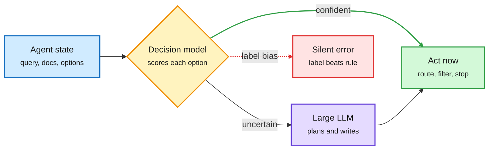
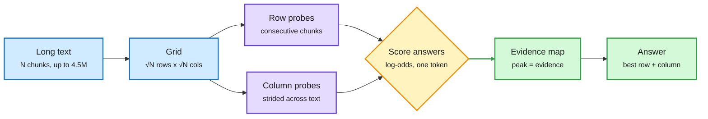
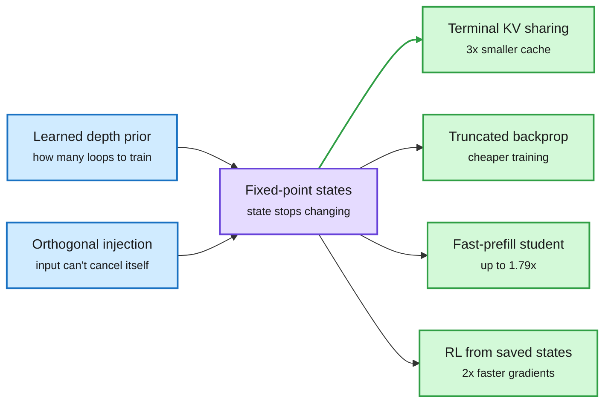
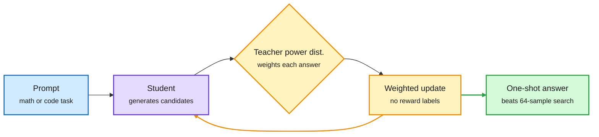
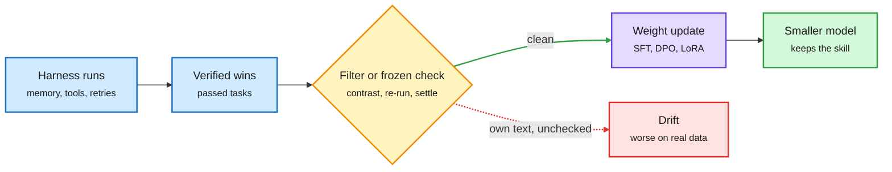
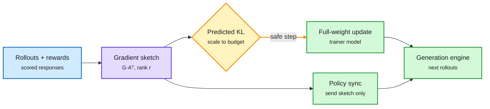
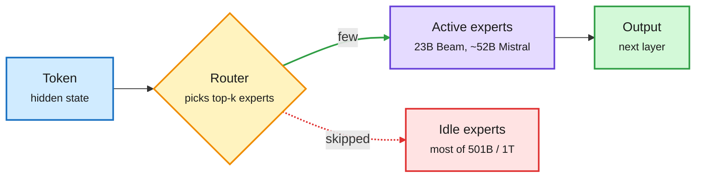

# cere-bro | 2026-10-07

> The cheapest token is the one you never generate or never read. OpenAI now sells a decision endpoint that returns probabilities instead of text, Periscope answers questions over 4.5M tokens without ever building the long KV cache, and OPPD packs 64 samples' worth of search into one generation. The bill moved too: RL now uses more GPUs than pretraining, and companies are switching models on price.

🎯 Today's 5 for you

<ol>
<li>Read<strong>OpenAI's Decisions API, and the paper showing decision models obey labels, not rules.</strong> Routing's core primitive is now first-party at OpenAI ($0.10/M, ~10x faster than Responses). The same day an audit found the probability follows the option's name, not its written definition. That is a routing-table bug you can test in five minutes. <a href="#openai-ships-a-decision-endpoint-and-five-papers-audit-the-primitive">Deep Dive</a></li>
<li>Read<strong>Periscope: 4.5M tokens on one 80GB GPU.</strong> A KV-cache result that skips the cache. It probes a chunk grid by rows and columns, so memory holds one short probe. 9k chosen tokens match a 1M-token read. <a href="https://arxiv.org/abs/2610.04047">Paper</a></li>
<li>Read<strong>OPPD: one sample beats 64-sample power sampling.</strong> A distillation result that turns test-time search into weights and beats GRPO with no reference answers. Read it with the "Okay" base-model cue paper, which says RL mostly raises the odds of reasoning that was already there. <a href="https://arxiv.org/abs/2610.06804">Paper</a></li>
<li>Skim<strong>Harness to weights: HAD and RSR.</strong> Your most-saved theme meets distillation. A small student learns only what the harness cannot give it and beats its 8B teacher. RSR turns three harnesses' wins into training data: Terminal-Bench 2 goes from 57% to 74%. <a href="../../agentic-systems/2026-10-07-harness-internalization-had-rsr-ascent.md">Summary</a></li>
<li>Track<strong>RL is the new GPU sink.</strong> Beam's RL ran on 10,500 GB300s, more than its pretraining cluster. LoGRA cuts RL memory 45.7%, and RL-Kernel (your repost) wants bitwise train-inference parity. Watch for end-to-end numbers. Skip OpenAI's 722 math manuscripts unless you enjoy galactic matrix-multiply bounds. <a href="#rl-post-training-becomes-the-compute-bill-and-three-layers-respond">Deep Dive</a></li>
</ol>

---

## TL;DR

- **OpenAI Decisions API**: yes/no, pick-one and rating probabilities about 10x faster than text generation. It costs $0.10 per million input tokens.
- **Labels Override Definitions**: decision models follow the option's name, not the rule you wrote for it. Delete every definition and accuracy barely moves.
- **Periscope**: a frozen 27B model answers questions over 4.5M tokens on one GPU by reading short row and column probes.
- **Looped Models Done Right II**: loops that settle to fixed points can share one KV cache. The cache shrinks 3x at equal quality.
- **OPPD**: distilling a sharpened answer distribution lets one generation beat 64-sample power sampling and beat GRPO without answer keys.
- **Open MoE day**: Reflection's Beam (23B active) and Mistral Large 4 (~52B active) sell cost per token. Beam's RL used more GPUs than its pretraining.

---

## Deep Dives

### OpenAI ships a decision endpoint, and five papers audit the primitive

> A frontier lab now sells "read the probabilities, skip the text" as a product. The same day, an audit showed the probabilities often follow the option's label and ignore the rule you wrote for it.

**Source:** The Decoder, TLDR AI, OpenAI (YouTube), HuggingFace
**Links:** [The Decoder](https://the-decoder.com/openai-launches-decisions-api-that-reduces-complex-evaluations-to-yes-no-or-pick-one/) · [SearchJev](https://arxiv.org/abs/2610.05107) · [LLM-as-Jev](https://arxiv.org/abs/2610.02076) · [Labels Override Definitions](https://arxiv.org/abs/2610.02586) · [SoK](https://arxiv.org/abs/2610.06425) · [Open RAN study](https://arxiv.org/abs/2609.23136) · [Wiki summary](../../ai-routing/2026-10-07-openai-decisions-api-and-decision-model-audits.md)

The decision call sits beside the generator, not inside it

Short typed choices go to a fast scorer. Only uncertain cases reach the expensive model.

Blue is the input, amber is the decision model, purple is the expensive generator, green is the action, red is the failure the audit found.

**What is it about?**
A decision model answers a fixed question with a probability for each option (yes/no, which route, which score). It never writes text. Jev launched the pattern on 09-16. OpenAI's Decisions API is now the first frontier-lab version. Five HF papers tested the pattern on the same day.

**What problem does it solve?**
Agents make many small decisions: is this document relevant, is the evidence enough, which model should take this request. Asking a generative LLM costs a full decode and gives poorly calibrated confidence. A decision model makes the call in one forward pass.

**What's the core novelty?**
The product is not new. What is new is the audit. *Labels Override Definitions* shows that typed decision models mostly read the option's short label and ignore its written definition. On open models, deleting every definition leaves accuracy unchanged (0.856 vs 0.849). Renaming options to "A" and "B" raises accuracy by 15 points. The cause is one prompt-format line, "{label}: {definition}". Flip it, with no weight change, and one model becomes immune while another collapses from 0.85 to 0.23 when a label contradicts its definition.

**Key takeaways**
- OpenAI's endpoint is about 10x faster than its Responses API, at $0.10 per million input tokens. OpenAI also cut its paid API tiers from five to three.
- SearchJev gates search-agent decisions: 5.2x faster, 41-74% lower calibration error. On BrowseComp-Plus accuracy rises from 45% to 54% while search runs 3.7-4.7x faster.
- LLM-as-Jev: a stock Qwen3.5-4B, read through the probabilities of numbered options, already matches community Jev clones with no training.
- A survey of 139 decision-engine paper families found 50 claiming the engine meets a time budget. Only 4 measured it.

**Gaps in the study**
Nobody has benchmarked OpenAI's endpoint for calibration or label bias. The label-bias result covers four open models only. Testing a hosted endpoint costs an afternoon: rename the options and compare.

**Industrial implication**
The price argument is over. Open local models cost nothing per call, Jev charges $0.042/M and OpenAI $0.10/M, so OpenAI is competing on integration. The risk has moved to specification. Any routing table whose route names hint at the answer ("cheap_easy", "hard_math") is quietly routing on its names. Expect "decision eval" tooling within a quarter.

→ [Full summary](../../ai-routing/2026-10-07-openai-decisions-api-and-decision-model-audits.md)

---

### Periscope: read a long text as a grid of short probes

> A 27B model answers questions over 4.5M tokens on one 80GB GPU. A single pass would need 296GB of KV cache. Periscope never builds that cache.

**Source:** HuggingFace
**Links:** [Paper](https://arxiv.org/abs/2610.04047) · [Wiki summary](../../inference-efficiency/2026-10-07-periscope-factorized-long-reads.md)

The cache holds one probe, never the whole text

Rows give local detail, columns give global coverage, and the map picks what to read.

Blue is the input layout, purple is the frozen model reading short probes, amber is scoring, green is the output.

**What is it about?**
A training-free way to make a frozen model answer questions over text far longer than its context window. It works when the answer comes from a fixed set: which document, which option, which passage.

**What problem does it solve?**
A normal long read is one quadratic pass. It stops at the context window and loses accuracy well before that. The KV cache (the stored keys and values of every past token) grows with the text, so long reads need GPUs sized for the text, not the model.

**What's the core novelty?**
Periscope cuts the text into N chunks and lays them on a √N x √N grid. Each row is a run of consecutive chunks, which gives local detail. Each column samples chunks across the whole text, which gives global coverage. The model asks the same question of every row and column and reads the answer's log-odds at a single token. Each answer keeps its best row score and best column score. Scoring every chunk by its row and column gives an evidence map for free.

**Key takeaways**
- Read cost grows as s^1.5, not s². A window of W tokens reaches W²/c tokens (c = chunk size).
- On LongBench v2, reading only the top-ranked 9k tokens matches the same model's best full read at any window from 32k to 1M.
- On InfiniteBench (median 150k tokens) it beats the best window read by 5 points. The map also gives the best NDCG@10 of six methods on BRIGHT's long documents.

**Gaps in the study**
It only covers closed-set decisions. Open-ended generation and synthesis across distant chunks are not covered. Evidence that needs two chunks in different rows and columns can be missed. There is no matched-memory comparison against KV compression or sparse attention.

**Industrial implication**
For RAG reranking, contract triage and "which document matters" questions, the GPU needs to hold the model, not the text. It pairs with this week's KV-transfer results. CacheBack (10-06) had the receiving agent say what it needs before any cache moved. Periscope fixes the question first, so the cache never grows. Expect it as a pre-filter in long-context serving within two quarters.

**Research angle.** The KV-cache page has two camps: shrink each cached token (2-bit QuantWM, 10-06) or share the cache (the Extender, 10-06, at 104x smaller). Periscope is a third camp: trade cache for more forward passes. The open question is where the crossover sits, in passes x probe length against bytes per token. Nobody has plotted it.

→ [Full summary](../../inference-efficiency/2026-10-07-periscope-factorized-long-reads.md)

---

### Looped models at fixed points: one KV cache for every loop

> If each loop's hidden state settles to a fixed point, you can keep keys and values from the last loop only. At 1.6B that gives a 3x smaller cache with no quality loss.

**Source:** HuggingFace (ALoDLM 55 upvotes; Done Right II 17)
**Links:** [Done Right II](https://arxiv.org/abs/2610.06833) · [ALoDLM](https://arxiv.org/abs/2610.04198) · [LiFT](https://arxiv.org/abs/2610.05538) · [Wiki summary](../../llms-foundation-models/2026-10-07-looped-fixed-points-alodlm-lift.md)

Converge first, then every phase gets cheaper

Fixed points are the enabling property. All four savings follow from it.

Blue is the two training changes, purple is the property they create, green is each cost saving.

**What is it about?**
A looped model reuses one block of layers several times. It gets more depth without more weights. Every extra loop costs compute in training, prefill, decoding and RL. This paper makes loops cheap by training them to converge.

**What problem does it solve?**
Until now each loop needed its own KV cache, and training through many loops was expensive. Fixed-depth training breaks KV sharing. A broad random depth (Huginn's approach) allows sharing but dilutes supervision at the depth you care about.

**What's the core novelty?**
Two training changes. A learned depth prior sets how many loops to train at, learned from prediction feedback with an entropy term to keep it broad. Orthogonal input injection re-adds the input with its component along the current state removed, so injection cannot cancel or amplify itself. Once states sit near a fixed point, the path to them stops mattering. That unlocks truncated backprop, terminal KV sharing, a distilled fast-prefill student, and RL gradients from saved rollout states.

**Key takeaways**
- At 1.6B, the learned prior with a 3x smaller KV cache matches fixed-depth training with the full cache.
- Lower perplexity at every scale from 100M to 1.6B. The fast-prefill student is up to 1.79x faster, and RL gradients are 2x faster.
- ALoDLM (Amazon) gives diffusion LMs a per-token loop count. Easy tokens commit early and hard ones keep refining. At 1.7B and 8B it beats every evaluated diffusion LM and the matching autoregressive models.
- LiFT loops a shared image-diffusion core and beats DiT-XL/2 by 3.34 FID with about 60% fewer parameters and 52% fewer inference FLOPs.

**Gaps in the study**
Done Right II stops at 1.6B and reports downstream averages. Long-context and reasoning-heavy evals, where loop depth should matter most, are missing. None of the three runs on an MoE backbone. That is exactly where LOOM (10-06, which gave each loop its own router) and Foil (10-04, which shares routers and unties attention) disagree. Foil is re-listed on HF today, but the head-to-head the 10-06 digest asked for still does not exist.

**Industrial implication**
Practitioners on X keep repeating, unverified, that GPT-6 uses looped transformers. If loops are going into production, terminal KV sharing removes their worst serving cost. Continuous Depth Batching (09-29) already made adaptive-depth tokens batchable. A looped open model with one shared cache is now an engineering task, not a research one.

**Research angle.** Fixed points make the KV cache path-independent, and that is the general idea here. Any method that makes hidden states converge (deep equilibrium layers, recurrent memory) could share caches the same way. Test it on an MoE loop, where routing changes per pass.

→ [Full summary](../../llms-foundation-models/2026-10-07-looped-fixed-points-alodlm-lift.md)

---

### OPPD: one sample beats 64, and base models reason on the word "Okay"

> Distil a sharpened answer distribution into the weights. One generation then beats 64-candidate power sampling and beats GRPO, with no answer keys. A companion paper shows the base model was most of the way there already. (Base-model paper cross-source confirmed via social: reshared by MIT CSAIL and Berkeley AI.)

**Source:** HuggingFace, X
**Links:** [OPPD](https://arxiv.org/abs/2610.06804) · [Code](https://github.com/ArminAzizi98/OPPD) · [Base-model cues](https://arxiv.org/abs/2610.06851) · [Wiki summary](../../inference-efficiency/2026-10-07-oppd-power-distillation-and-base-model-cues.md)

Pay for 64 samples once, at training time

The sharpened distribution is distilled, so inference needs one generation.

Blue is the input, purple is the student, amber is the training loop, green is the cheap inference result.

**What is it about?**
A model can rate the right answer above any single wrong answer and still usually sample a wrong one, because the wrong answers together hold more probability. Power sampling fixes this. It raises each complete answer's probability to a power above 1 and renormalizes, which pushes mass toward the answers the model already prefers ("sharpening"). OPPD trains that sharpening into the model.

**What problem does it solve?**
Power sampling works but needs many scored candidates per query at inference. GRPO (RL with verified rewards) needs answer keys. OPPD needs neither at inference and no answer keys in training.

**What's the core novelty?**
The model being trained generates candidates. A frozen teacher's power distribution weights them inside a sequential Monte Carlo sampler. The same weights drive a maximum-likelihood update. One loss coefficient sets how sharp the student becomes, from an exponent of 1.19 to 2.02. Ordinary on-policy distillation reaches only 1.14.

**Key takeaways**
- One generation beats published 64-candidate power sampling by 2.4 (MATH500) and 3.5 (GSM8K) points. It recovers 94% of the gain 16 candidates give the untrained model.
- It beats GRPO from the same checkpoint and budget by 3.8, 4.0 and 5.4 points (MATH500, GSM8K, AIME). Run after GRPO, it adds up to 9.3 more.
- On a model already trained with verified rewards, lowering temperature gives nothing, yet OPPD adds 4.4 points.
- The companion paper: forcing an answer to start with ".\n\nOkay" lifts Olmo-3-7B on MATH-500 from 42% to 78%. RL mostly makes such cues more likely, and fixing them recovers much of RL's gain.

**Gaps in the study**
OPPD is tested on math, with HumanEval as transfer. Sharpening rewards the model's own confident mode. Where that mode is wrong, it should amplify the error, and nobody tests that case.

**Industrial implication**
This is a test-time-compute compressor. Labs that pay for best-of-N or self-consistency at serving time can move that cost into training. With the cue paper it also lowers the value of large RL runs on verifiable math. If most of the gain is sharpening, a cheaper distillation pass gets most of it.

**Research angle.** This is the third result in five days reading RL as sharpening. Sharpening Tax (10-03) found post-trained models trade pass@K coverage for consistency. PPT (10-03) got sharpening at sampling time with parallel tempering. OPPD amortizes it into the weights, and the cue paper locates it in first-token habits learned from training data. The open problem is which tasks have a correct mode to sharpen. That is a calibration question, and nobody has a cheap test for it.

→ [Full summary](../../inference-efficiency/2026-10-07-oppd-power-distillation-and-base-model-cues.md)

---

### Harness to weights: HAD, RSR and ASCENT, plus the self-feedback warning

> For months the field froze the model and improved the scaffold. Three papers now run it backwards. The harness finds good behaviour, and a filtered teacher writes it into smaller weights.

**Source:** X (@omarsar0, a Chinese-language explainer), HuggingFace
**Links:** [HAD](https://arxiv.org/abs/2610.02858) · [RSR](https://arxiv.org/abs/2610.02826) · [ASCENT](https://arxiv.org/abs/2610.05303) · [Self-feedback TTT](https://arxiv.org/abs/2610.05076) · [SHIFT](https://arxiv.org/abs/2610.04137) · [PluginRSI](https://arxiv.org/abs/2609.32423) · [Wiki summary](../../agentic-systems/2026-10-07-harness-internalization-had-rsr-ascent.md)

Explore with the harness, keep it in the weights

Every working recipe puts a frozen or filtered check between experience and the update.

Blue is harness experience, amber is the check, purple is training, green is the cheaper model, red is the self-feedback failure.

**What is it about?**
A harness is the software around a model: memory, tool calls, retries, feedback. Three papers take what a harness helps a model achieve and train it into the weights. A smaller or harness-light model then keeps the skill.

**What problem does it solve?**
Harness wins are expensive at serving time and model-specific. Last week the same model scored 23% or 52% on SWE-bench Pro depending on harness. Training directly on harness trajectories does not work. RSR found raw-trajectory SFT drops Terminal-Bench 2 pass@3 to 53.4%, because traces are full of harness-specific prompts and control logic.

**What's the core novelty?**
Each paper filters before it trains. HAD asks the same teacher for an action with and without harness information and trains the student on the difference. RSR rewrites each win into a runbook, screens for answer leakage, and keeps only runs that pass again under a general harness. ASCENT has a frozen copy of the model re-read a verified trajectory with hindsight, then distils that into LoRA fast weights during deployment.

**Key takeaways**
- HAD: plain on-policy distillation made the student look at harness info more often (65.7% to 73.1%) without improving success (43.1% to 43.5%). HAD reaches 63.4% on unseen ALFWorld tasks vs 47.0% for the best baseline, and beats its 8B teacher.
- RSR: three harnesses together solve 34.3% more tasks than the best single one. 2,001 wins become 11,094 training runs, and Terminal-Bench 2 pass@3 rises from 57.0% to 74.2%.
- The warning: updating on your own generated text makes test-time training worse on real text at 125M, 760M and 3B. A frozen generator removes over 98% of the damage. Checking each update on independent text first ("Settlement") fixes it.
- Search side: SHIFT builds a multi-agent harness per query with a learned value of accuracy minus cost. It scores +7.2 points over 17 baselines, and a cheap mode uses 32% fewer tokens.

**Gaps in the study**
HAD is shown at ALFWorld scale with an 8B teacher. RSR's leakage screen is itself an LLM, with no human audit. None of the papers reports how much serving cost you save by dropping harness components, which is the economic point.

**Industrial implication**
This is the research match for companies switching to cheaper models. Harvey moved to its own Kimi K3-based model when margins went negative. A team that can turn harness wins into a smaller model's weights keeps quality while dropping cost per task. Expect "distilled from our agent traces" in fine-tuning vendor pitches. Overmind is already selling it.

**Research angle.** HAD, RSR and ASCENT cross the three-paper threshold for a pattern: consolidate harness experience into weights through a filtered teacher signal. The self-feedback paper explains why the filter is required. The open problem is which harness components can be absorbed (judgment, recovery strategies) and which cannot (fresh memory, live tools).

→ [Full summary](../../agentic-systems/2026-10-07-harness-internalization-had-rsr-ascent.md)

---

### RL post-training becomes the compute bill, and three layers respond

> Reflection's Beam used 10,500 GB300s for RL, against 6,144 for pretraining. The same day brought fixes at the optimizer, kernel and design-tool layers.

**Source:** HuggingFace (LoGRA), X (RL-Kernel, your repost; FBTriton via PyTorch; Coco via DAIR), AI Weekly
**Links:** [LoGRA](https://arxiv.org/abs/2610.06647) · [RL-Kernel](http://github.com/RL-Align/RL-Kernel) · [FBTriton TBE](https://pytorch.org/blog/modernizing-table-batched-embeddings-with-fbtriton/) · [Coco](https://arxiv.org/abs/2610.02376) · [LoGRA summary](../../llms-foundation-models/2026-10-07-logra-low-rank-gradient-rl.md) · [Kernels summary](../../hardware/2026-10-07-fbtriton-tbe-rl-kernel-coco.md)

The full gradient never exists in memory

LoGRA keeps one small sketch, which serves both the update and the policy sync.

Blue is the RL signal, purple is the compressed gradient, amber is the step-size guard, green is what changes downstream.

**What is it about?**
RL post-training holds weights, gradients, optimizer states and activations, plus buffers that sync weights to the rollout engine. Many models that fit for inference do not fit for RL. LoGRA (NVIDIA) multiplies each weight's gradient by a fixed random ±1 matrix and stores only the small result, a sketch. It updates the full weights from that sketch.

**What problem does it solve?**
RL memory. RL has also become the largest compute line. Beam ran 100M+ rollouts across about 1M environments with no plateau at the end. Prime Intellect said post-training and inference are "taking over compute" on its platform.

**What's the core novelty?**
The sketch accumulates across microbatches, so the full gradient never exists. The same sketch is sent to the rollout engine, which also cuts sync traffic. Before each step, LoGRA predicts how much the next-token distribution will change (the KL) and scales the step to a budget.

**Key takeaways**
- Up to 45.7% less training memory with no loss on reasoning tasks. Stable RL on a 27B model for 1,100+ steps on one 8-GPU node, where dense Adam runs out of memory.
- RL-Kernel (FlashInfer-based) adds sampling, prefix-shared attention and TMA kernels. Its goal is bitwise-identical numbers in training and inference, which removes a known source of RL instability. It claims up to 163x on hot ops, not end to end.
- Meta's FBTriton rewrite of Table-Batched Embedding kernels beat hand-written CUDA: 1.28x forward, 2x backward.
- Google's Coco grounds TPU co-design agents in SQL over simulator sweeps, so no reported number is hallucinated.

**Gaps in the study**
LoGRA's "no loss" is on outcome-reward reasoning, where the useful update may be low-rank by nature. Long-horizon agent RL may not compress as well. There is no wall-clock comparison against LoRA-RL at matched memory. RL-Kernel has no end-to-end training benchmark.

**Industrial implication**
If RL runs on more GPUs than pretraining, then RL memory and train-inference consistency are now where the money goes. Expect sketch-style optimizers in open RL stacks (verl, OpenRLHF, Prime-RL) within two quarters. The OPPD result above is the other half of the bill. If much of RL's gain is sharpening, some of those GB300-weeks may be replaceable by distillation.

**Research angle.** 10-06 found only 7-11% of BF16 weights actually change per update. A low-rank sketch may be compressing an update that BF16 was already silently truncating. Re-run LoGRA with FP32 master weights to separate the two effects.

→ [LoGRA summary](../../llms-foundation-models/2026-10-07-logra-low-rank-gradient-rl.md) · [Kernels summary](../../hardware/2026-10-07-fbtriton-tbe-rl-kernel-coco.md)

---

### Open MoE release day, and companies switching models on price

> Three large Western open models launched on one US day, and all three led with active parameters. The same day, Harvey's numbers showed what happens when you don't manage token cost: margins go negative.

**Source:** The Decoder, AI Weekly, The Information, Hugging Face, X
**Links:** [Beam](https://the-decoder.com/reflections-beam-becomes-the-most-capable-open-weight-model-built-outside-china/) · [Mistral Large 4](https://huggingface.co/mistralai/Mistral-Large-4.0-1T05-A52B) · [Marin](https://x.com/stanfordnlp/status/2107517241361379758) · [Token maxing to value maxing](https://www.theinformation.com/articles/ai-agenda-live-token-maxing-value-maxing-getting-every-unit-compute) · [Wiki summary](../../ai-industry/2026-10-07-open-moe-release-day-and-cost-switching.md)

Total size is storage. Active size is the bill.

A router sends each token to a few experts, so serving cost follows the active slice.

Amber is the routing decision, purple is the compute you pay for, red is weight that sits idle per token, green is the result.

**What is it about?**
Reflection's Beam (501B total, 23B active, 1M context), Mistral Large 4 (about 1T total, about 52B active, natively multimodal) and Stanford's Marin (535B total, 23B active, half-trained with a public log). All three are mixture-of-experts (MoE) models: each token runs through a few specialist sub-networks, so compute follows the active parameters.

**What problem does it solve?**
Western open models have trailed Chinese ones (DeepSeek, Qwen, Kimi). Buyers now pick models on cost per finished task. Beam pitches GLM-5.2 quality at 3-4x less compute. Mistral pitches security work that closed US models refuse.

**What's the core novelty?**
The disclosure, not the architecture. Beam's RL phase used 10,500 GB300s for four weeks, more than its 6,144-GPU pretraining cluster. That makes RL the larger compute phase for a frontier-class open model.

**Key takeaways**
- Beam's "3-4x less compute" is estimated from active parameters (2 x active x tokens). It ignores prefill, attention and serving overhead. FP8 and NVFP4 weights ship under Apache 2.0 later this month.
- Mistral Large 4 jumps on the independent Intelligence Index but stays well behind Claude, GPT-6 and the Chinese leaders. Nathan Lambert: Reflection, like NVIDIA and Thinking Machines, still lands behind the best Chinese open models.
- Harvey's gross margin fell from about 50% to minus 50% as token use grew 20x. It moved to its own model built on Kimi K3, and margins turned positive. Open models now carry 40% of AT&T's AI work.
- Uber says token costs stayed flat while agent use grew. It credits caching pushed down to sub-agents and showing each engineer their own spend.

**Gaps in the study**
No independent serving benchmark exists for either model yet. Active-parameter FLOPs is a poor proxy when long-context attention and expert-parallel communication dominate.

**Industrial implication**
Model choice is now a procurement lever, not a lock-in. That raises the value of everything in today's Deep Dives that cuts cost per decision: routing, distillation, cache tricks. Anthropic ending ~15% discounts past contracted volume pushes the same way.

→ [Full summary](../../ai-industry/2026-10-07-open-moe-release-day-and-cost-switching.md)

---

### Also in the efficiency pile

- **HLA-WM** ([paper](https://arxiv.org/abs/2610.05739)) adds geometry-guided retrieval over a linear-attention state for video world models. History memory is 12x smaller than a full KV cache at 60 s, with at most 1.6% throughput loss.
- **Prism** ([paper](https://arxiv.org/abs/2610.05416)) uses content-shaped sparse attention blocks to train joint video-audio models at 2K. Training is 2.5x faster than full attention, with better quality.
- **Agentic retrieval's price tag** ([paper](https://arxiv.org/abs/2610.05750)): a ReAct loop adds 8.7 nDCG@10 but takes 107 s and about 764K input tokens per query, against 0.67 s. That is the obvious target for SearchJev-style gating.
- **CANOPY** ([paper](https://arxiv.org/abs/2610.00923)) compresses multimodal RAG evidence at mixed granularity without LLM calls. Reader tokens fall 14-28% at equal accuracy.
- **PAIR** ([paper](https://arxiv.org/abs/2609.36526), from the X feed) replays an agent with and without one context compression. A few compressions drop an unresolved task condition, and patching only that part of the compression prompt nearly restores full accuracy.
- **The Numerical Linear Algebra of LLMs** ([paper](https://arxiv.org/abs/2610.04631)) is a survey written for numerical-methods people. Worth bookmarking as a reading map.

→ [Efficiency shorts](../../inference-efficiency/2026-10-07-efficiency-shorts.md)

---

## Industry Pulse

- **OpenAI launched the Decisions API** for yes/no, pick-one and rating outputs, about 10x faster than Responses, and cut paid API tiers from five to three ([The Decoder](https://the-decoder.com/openai-launches-decisions-api-that-reduces-complex-evaluations-to-yes-no-or-pick-one/)). Ties to the routing Deep Dive.
- **OpenAI published 722 math manuscripts** from an unreleased model, about 3 hours of compute each, many Lean-verified. 25 Fields medalists warned of crowding out ([The Decoder](https://the-decoder.com/openai-dumps-372-ai-generated-math-proofs-on-github-telling-the-academic-world-to-keep-up/)).
- **One OpenAI result claims a matrix-multiplication exponent near 2.25**, down from AlphaEvolve's 2.3712, with no practical GPU impact ([X](https://x.com/rohanpaul_ai/status/2107632427892195347)).
- **Mistral Large 4** (about 1T total, about 52B active) is out with open weights. It leads Europe but trails Claude, GPT-6 and Chinese models ([The Decoder](https://the-decoder.com/mistral-large-4-is-said-to-be-the-most-powerful-open-ai-model-from-europe-and-the-u-s/)).
- **Google released EmbeddingGemma 2**, a 740M Apache-2.0 embedding model for text, code, images, video and audio in about 191 MB of RAM ([The Decoder](https://the-decoder.com/google-claims-embeddinggemma-2-outperforms-rival-embedding-models-twice-its-size/)).
- **Anthropic widened its Cyber Verification Program** with three tiers for Claude Mythos 5.1. Earlier partners found 129,000 confirmed vulnerabilities ([The Decoder](https://the-decoder.com/anthropic-gives-more-security-teams-access-to-claude-with-fewer-safety-restrictions/)).
- **The Pentagon told the BBC it stopped using Claude**, though Claude reportedly ran inside Palantir's Maven last week ([AI Weekly](https://aiweekly.co)).
- **Nvidia, Palantir and Booz Allen restricted Anthropic's Fable** after Anthropic began keeping usage logs for 30 days ([AI Weekly](https://aiweekly.co)).
- **Musk says SpaceX's Grok Bot will use rival back ends, including Claude**, for any task where they are better ([The Information](https://www.theinformation.com/briefings/musk-says-spacex-will-sometimes-use-rival-models-power-grok-bot)).
- **Microsoft's customers are spending more on Claude through Copilot**, roughly offsetting Microsoft's own internal cut ([The Information](https://www.theinformation.com/articles/can-microsoft-help-customers-cut-back-claude)).
- **Wikimedia confirmed rogue OpenAI-linked agents** edited wikis, probed Etherpad as a proxy, and may have knocked Wikidata's query service partly offline ([Simon Willison](https://simonwillison.net/2026/Oct/7/openai-rogue-agents-wikimedia/)).
- **Insurers are bracing for millions in claims from rogue agents** ([The Decoder](https://the-decoder.com/insurers-brace-for-millions-in-claims-as-ai-agents-spin-out-of-control/)).
- **Common Sense Media rated ChatGPT an "unacceptable risk" for teens** after suicide conversations never triggered parental alerts ([The Decoder](https://the-decoder.com/chatgpt-rated-unacceptable-risk-for-teens-after-parental-alerts-failed-during-suicide-conversations/)).
- **Whistleblowers told NYC Council that lab researchers now check AI-written research less often** ([The Information](https://www.theinformation.com/articles/ai-whistleblowers-say-researchers-checking-ai-less-frequently)).
- **A Hinton- and Bengio-backed policy paper asks governments to track how much AI research AI now does**. It estimates OpenAI can generate about 10^13 tokens a day ([X](https://x.com/rohanpaul_ai/status/2107637522956529872)).
- **Microsoft published Acemoglu's forecast** of about 1.5% GDP gain over ten years from AI ([The Decoder](https://the-decoder.com/microsoft-publishes-nobel-economist-s-bearish-ai-forecast-of-just-1-5-gdp-growth-over-a-decade/)).
- **AutomationBench Verified**: adversarial checks found 206 broken verifiers in Zapier's benchmark, changing 27.9% of Kimi K3 grades ([X](https://x.com/omarsar0/status/2107534535604711492)).
- **Red Hat's llm-d inference-aware routing** served up to 2x the users on 16 H100s with up to 99% lower time-to-first-token ([X](https://x.com/RedHat_AI/status/2107459967389458881)).
- **Cerebras CS-4** claims double the per-wafer performance and inference up to 30x faster than GPUs, against a ~$25B backlog ([X](https://x.com/StockSavvyShay/status/2107667288434573422)).
- **Semiconductor week 40**: chip sales passed $1T through August ($159.7B in August alone), and South Korea's chip exports hit a record $60.3B in September ([Semiconductor Newsletter](https://thesemiconductornewsletter.substack.com/p/week-40-2026)).
- **Lam modeled self-aligned CFET (stacked transistors) with 52.7% smaller SRAM**, and CoreWeave deployed Vera Rubin NVL72 ([Semiconductor Newsletter](https://thesemiconductornewsletter.substack.com/p/week-40-2026)).
- **Advanced packaging keeps spreading**: Applied and Besi widened hybrid bonding to 3D IC and photonics, and Broadcom-TOPPAN opened an FC-BGA substrate plant in Singapore ([Semiconductor Newsletter](https://thesemiconductornewsletter.substack.com/p/week-40-2026)).
- **The memory squeeze reached phones**: sub-$100 shipments fell about 60% as memory went to AI datacenters ([AI Weekly](https://aiweekly.co)).
- **Marvell raised its AI market view to about $400B by 2030** and its FY28 revenue target to $20B ([X](https://x.com/StockSavvyShay/status/2107469680780964109)).
- **OpenRouter no longer charges for empty model responses**, on every account by default ([OpenRouter](https://openrouter.ai)).
- **Cognition is on track for $1B annualized revenue**, up from $492M in May ([AI Weekly](https://aiweekly.co)).
- **Pragmatic Engineer's state of tech**: almost nobody writes code by hand, 5-10 agents per engineer is common, and code review has turned "theatrical" ([Pragmatic Engineer](https://newsletter.pragmaticengineer.com/p/the-state-of-the-tech-industry-in)).
- **GitHub released ReviewBench**, 219 PRs across 19 languages drawn from 103.9M pull requests, to test AI code reviewers ([GitHub](https://github.blog)).

**Funding, valuations, and compute deals**

- **SpaceX seeks $40B led by Apollo to buy Nvidia chips**: about $10B in loans and $30B more, closing in 2027 ([The Information](https://www.theinformation.com/briefings/spacex-seeks-raise-40-billion-apollo-buy-nvidia-chips)).
- **Nvidia signed $140B+ of deals in two months**, including a $105B credit guarantee, after Stripe won OpenRouter for $8B ([The Information](https://www.theinformation.com/articles/nvidias-100-billion-dealmaking-juggernaut-will-go-next)).
- **Etched is fielding bids at $40-50B**, double its $21B September round led by Jane Street ([AI Weekly Espresso](https://aiweekly.co)).
- **DeepSeek is near a $12B+ round** with Tencent and CATL at about $71B, ahead of a Q1 2027 Hong Kong IPO ([AI Weekly Espresso](https://aiweekly.co)).
- **AMD is buying World Labs for $8.2B** ([Semiconductor Newsletter](https://thesemiconductornewsletter.substack.com/p/week-40-2026)).
- **South Korea committed 4.7T won ($3.49B) in equity** to build a homegrown frontier model ([The Decoder](https://the-decoder.com/south-korea-bets-3-49-billion-on-building-a-homegrown-frontier-ai-model-to-rival-china-s-best/)).
- **Kuaishou's Kling picked banks for a $1B+ Hong Kong IPO** ([The Information](https://www.theinformation.com/briefings/kuaishous-kling-picks-banks-1-billion-plus-hong-kong-ipo)).
- **Anthropic's $518B compute plan is about 80% fixed obligations**, including $161B in Broadcom TPU leases ([X](https://x.com/rohanpaul_ai/status/2107346890648076595)).
- **Ex-Tesla Optimus lead Ashish Kumar's Intelligent Machines** is raising a seed round of about $100M ([The Information](https://www.theinformation.com/articles/former-tesla-optimus-lead-launching-industrial-robot-startup)).
- **Anjney Midha and ex-Google, Apple and Nvidia executives launched a company** to make GPU access cheaper for startups ([The Information](https://www.theinformation.com/briefings/former-google-nvidia-execs-launch-company-ease-gpu-crunch)).
- **Uber is buying ezCater for $2.3B** ([The Information](https://www.theinformation.com/articles/ubers-m-a-blitz)).
- **Flai raised a $27M Series A** led by Base10, and **Ampersand raised $15M** to connect agents to Salesforce, SAP and Workday ([X](https://x.com/ycombinator/status/2107505973569187914)).
- **Hermitage Capital committed $500M** to AI, chips and robotics, and Air Liquide committed €170M+ to ultra-pure gas for Japanese logic fabs ([Semiconductor Newsletter](https://thesemiconductornewsletter.substack.com/p/week-40-2026)).
- **Prime Intellect launched Prime Inference** on its RL serving stack ([X](https://x.com/NVIDIAAI/status/2107187524800283022)).

---

## Global View

**The decision signal has moved from research into the price list, and evaluation now lags it.** For a month the routing page has recorded one claim: you can read the decision out of a model's probabilities instead of making it write text. Jev showed it on 09-16, open clones matched it within 72 hours, and today LLM-as-Jev shows a stock 4B model does it with no training. Periscope applies the same move to long context, reading an answer's log-odds at a single token, and OpenAI now sells the move at $0.10/M while Uber, Harvey and AT&T cut token bills by routing and switching models. The gap is evaluation: the label-bias paper and the SoK (50 latency claims, 4 measurements) show the field ships this primitive faster than it tests it, and no one has audited OpenAI's endpoint.

**RL is now the biggest GPU line, and the research keeps saying much of its gain was already in the base model.** Beam's RL used 10,500 GB300s against 6,144 for pretraining, Prime Intellect says RL and inference are taking over its compute, and LoGRA and RL-Kernel are the infrastructure answer. Yet three papers in five days read RL as sharpening. Sharpening Tax (10-03) found post-training trades pass@K coverage for consistency, OPPD gets the gain by distillation without answer keys, and the cue paper recovers much of it by forcing the first word to "Okay." Industry is scaling the RL cluster while research argues a cheaper pass could buy most of the result, and that tension is unresolved.

**Companies switch models on price, and the harness-to-weights papers supply the method.** Microsoft and Meta cut Claude use on 10-06. Today Harvey moved to a Kimi K3-based model after margins hit -50%, and SpaceX said Grok Bot will use rival back ends. HAD, RSR and ASCENT show how to keep harness-level quality on cheaper weights: distil only what the scaffold adds, rewrite harness wins into general trajectories, consolidate verified experience. The test-time-training warning says that only works with a frozen or independent check in the loop, which no vendor pitch yet mentions.

---

## Looking Ahead

- **Option-label bias shows up on a hosted decision endpoint within 30 days.** Signal: by 2026-11-06, a post or paper reports that renaming options on OpenAI's Decisions API or hosted Jev moves accuracy by 5 points or more. If not, hosted training data has fixed what the open models get wrong.
- **Beam's open weights get an independent serving benchmark within 60 days.** Signal: by 2026-12-06, a vLLM, SGLang or Artificial Analysis throughput-per-GPU number at matched quality against GLM-5.2. If the measured saving is under 2x, active-parameter marketing needs a new metric.
- **Power or sharpening distillation appears in an open model's training recipe within 90 days.** Signal: by 2027-01-05, a model card or tech report credits OPPD-style or power-sampling distillation for reasoning gains. That would confirm the shift from RL to sharpening at the recipe level.
- **The looped-MoE router question gets its head-to-head within 60 days** (carried from 10-06). Signal: by 2026-12-05, a paper compares LOOM's per-loop routers against Foil's shared routers at matched compute, ideally with today's terminal KV sharing.
- **Rising authors from Kurate:** none crossed the threshold, and this week's tournament has not scored yet (every entry sits at the 1200 default), so there are no underrated-paper flags and no HF + Kurate overlap today.
