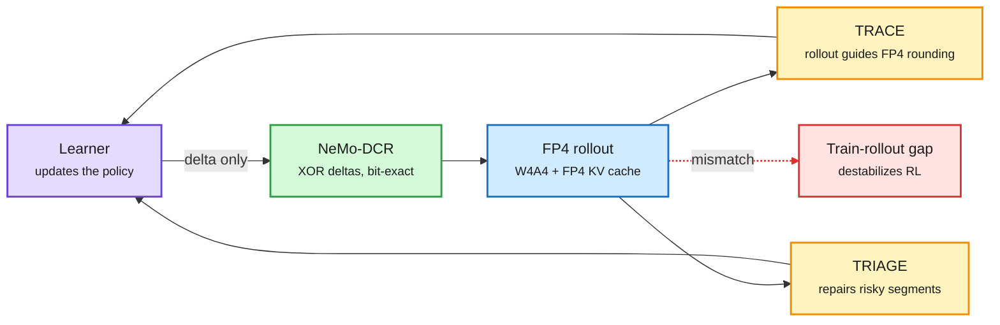
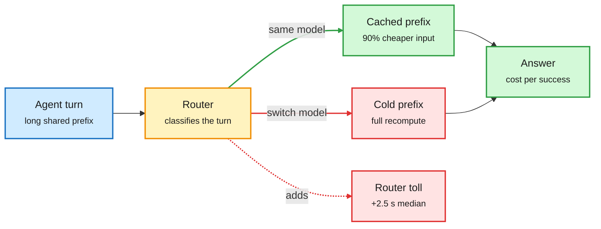
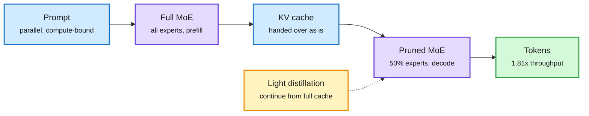
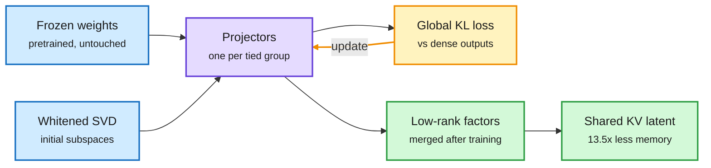
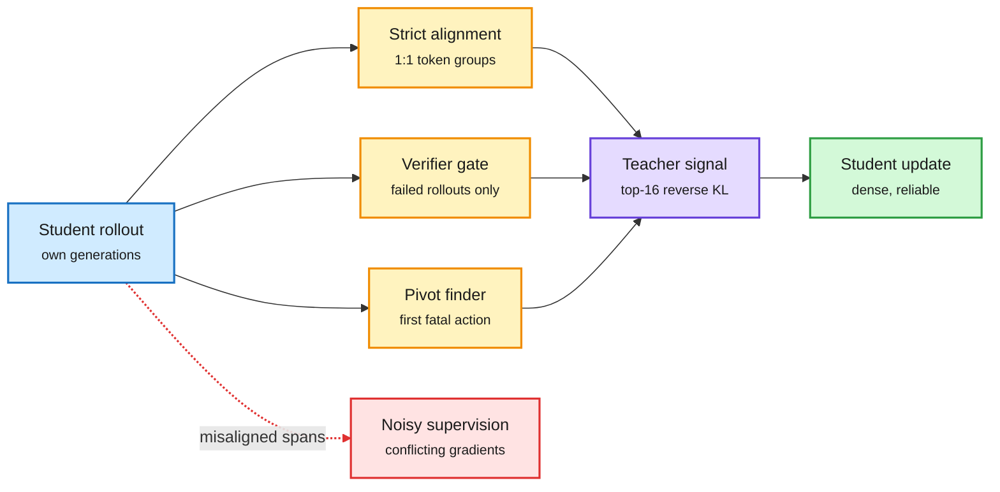
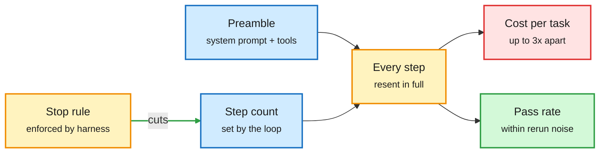
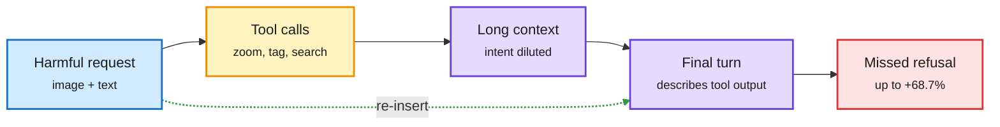

# cere-bro | 2026-10-08

> The cost story today is about where the bill hides. It hides in the precision of RL rollouts, in the prefix cache a router throws away when it switches models, and in the harness preamble an agent resends at every step. The per-token price is no longer the number that matters.

🎯 Today's 5 for you

<ol>
<li>Read<strong>FP4 RL: TRACE, TRIAGE and NeMo-DCR.</strong> Three papers cut the RL bill at three stages. FP4 rollout including the KV cache at BF16 quality (up to 5.4x faster), and a 1T-parameter weight refit that drops from 87.5 minutes to 150 seconds. This is quantization meeting the new GPU sink. <a href="#fp4-reinforcement-learning-three-cuts-to-the-rl-bill">Deep Dive</a></li>
<li>Read<strong>The first independent router benchmark comes back negative.</strong> LMArena found Jev Router picks good models, yet costs 38% more and runs 1.7x slower than just calling DeepSeek V4.1 Flash. Read it with the prefix-cache argument and Microsoft's on-device 3-bit routing. <a href="#routing-gets-graded-a-good-chooser-that-still-loses-on-cost">Deep Dive</a></li>
<li>Read<strong>SlimWise and LSP: two compression results with KV-cache payoffs.</strong> Prune MoE experts only for decode and reuse the full model's cache (1.81x). Learn low-rank cuts globally and get a shared KV latent for free (13.5x less memory at 128K). <a href="#slimwise-prune-experts-only-where-decode-is-starved">Deep Dive</a></li>
<li>Skim<strong>Distillation: less teacher, more reliable teacher.</strong> The day's top paper finds full-coverage cross-tokenizer distillation hurts, and a top-16 slice at aligned positions is enough. NVIDIA's PivotOPD fixes one early agent mistake and lifts replayed success from 8% to 59%. <a href="#on-policy-distillation-supervise-less-but-where-it-is-reliable">Deep Dive</a></li>
<li>Track<strong>What a harness buys: tokens, mostly.</strong> This is your most-saved theme, now with a controlled study. Swapping harnesses moves scores no more than a rerun does, but it moves cost per task by up to 3x. Skip the math-drop culture war and GPT-6's Intelligent UI. <a href="#what-a-harness-buys-the-bill-not-the-score">Deep Dive</a></li>
</ol>

---

## TL;DR

- **TRACE and TRIAGE**: RL rollouts run in 4-bit floats, KV cache included, at full-precision quality. Rollout gets up to 5.4x faster.
- **NeMo-DCR**: only about 1% of weights change per RL step. Shipping just those changes moves a 1T model in 150 seconds instead of 87.5 minutes.
- **Jev Router on Agent Arena**: it picks smart models but costs 38% more than calling DeepSeek V4.1 Flash directly.
- **SlimWise**: prune half the MoE experts only during decode. Decode throughput rises 1.81x with little accuracy loss.
- **Harness study**: the same model in three coding harnesses scores about the same. Cost per task differs by up to 3x.
- **Claude Haiku 5.5**: priced like GPT-6 Luna under 100K tokens. A new tokenizer quietly uses about 25% more tokens.

---

## Deep Dives

### FP4 reinforcement learning: three cuts to the RL bill

> RL can run its rollouts in 4-bit floats, KV cache included, if the trainer learns to round the way the rollout engine does.

**Source:** HuggingFace (TRACE was the day's #2 paper)
**Links:** [TRACE](https://arxiv.org/abs/2610.07767) · [TRIAGE](https://arxiv.org/abs/2610.07043) · [NeMo-DCR](https://arxiv.org/abs/2610.08430) · [Wiki summary](../../inference-efficiency/2026-10-08-fp4-rl-trace-triage-nemo-dcr.md)

Three cuts to the RL bill, one per stage

Rollout precision, objective repair and weight shipping are separate costs. Each paper owns one.

Purple is the learner, blue the cheap rollout engine, amber the two mismatch fixes, green the transfer saving, red the failure they all fight.

**What is it about?**
RL post-training spends most of its time generating rollouts (the model's practice answers). Running those rollouts in FP4 (4-bit floating point, natively supported on Blackwell GPUs) is much faster. The catch is that the learner and the rollout engine then hold two slightly different copies of the policy. Three papers attack the cost from three angles.

**What problem does it solve?**
Until now, FP4 RL methods tuned the trainer's quantization and the rollout's quantization separately. The gap between the two copies grew and destabilized training. Earlier phase-aware work, like Mix-Quant (05-21, which ran prefill in FP4 but kept decode in BF16 because decode errors compound), avoided low precision in decode entirely. Separately, disaggregated RL must ship new weights to rollout clusters after every step, and a full 1T checkpoint takes 87.5 minutes between AWS regions.

**What's the core novelty?**
TRACE lets the rollout side's rounding outcomes guide how the trainer rounds its own FP4 weights. It targets the gap directly instead of each side's error. TRIAGE keeps native NVFP4 (Nvidia's 4-bit format) on both sides. It finds that damage starts in a few response segments where negative-advantage tokens have a negative mismatch, and it repairs only those segments. NeMo-DCR sends only changed weights as XOR masks and loads them through the serving runtime's own loader. Receivers end up with the same bits as a full transfer.

**Key takeaways**
- TRACE: FP4 weights, activations and KV cache in rollout on four large MoE models, at RL quality comparable to BF16. Up to 5.4x rollout speedup.
- TRIAGE: 2.3x rollout throughput over BF16, with full-precision scores on five math benchmarks for Qwen3-4B and Qwen3-30B-A3B.
- NeMo-DCR: 12-40x faster refits at 3-5% change rates. A 1T refit at 3% takes 150 seconds.
- The sign of the mismatch matters more than its size. This echoes the 09-16 quantization entry that found compression error has a direction.

**Gaps in the study**
TRACE and TRIAGE are never compared with each other, or with a bitwise-parity baseline like yesterday's RL-Kernel (an open kernel library that aims for identical numbers in training and inference). TRIAGE covers math only, at 4B and 30B-A3B. NeMo-DCR's 1% sparsity is measured in BF16 training, and FP4 training may change it.

**Industrial implication**
Yesterday's digest noted that Reflection's Beam spent more GPUs on RL (10,500 GB300s) than on pretraining. These papers are the first direct attack on that bill at the precision level. Expect NVFP4 rollout to show up in open RL frameworks within a couple of quarters. Delta refits matter most to labs that run training and rollout in different regions. Research angle: no one has yet tested whether a direction-aware fix like TRIAGE works for agentic RL, where rollouts are long and multi-turn and mismatch has more steps in which to compound.

→ [Full summary](../../inference-efficiency/2026-10-08-fp4-rl-trace-triage-nemo-dcr.md)

### Routing gets graded: a good chooser that still loses on cost

> The first independent test of a commercial router found it picks good models and still costs 38% more than skipping it.

**Source:** LMArena on X, GitHub, Microsoft via The Information, Simon Willison, SambaNova (cross-source)
**Links:** [Arena thread](https://x.com/arena/status/2107961555363213482) · [Latency detail](https://x.com/arena/status/2107961562858492338) · [Microsoft on-device](https://www.theinformation.com/briefings/microsoft-debuts-new-windows-pcs-features-powered-on-device-ai) · [Haiku 5.5 pricing](https://simonwillison.net/2026/Oct/7/claude-haiku-5-5/) · [Wiki summary](../../ai-routing/2026-10-08-routing-graded-jev-router-local-routing.md)

A router pays a toll before it saves anything

Classification latency and lost prefix cache are paid on every call. Savings only arrive on the hard tail.

Amber is the routing decision, green the cheap path, red the two costs a router adds.

**What is it about?**
LMArena ran TypeSafe's Jev Router (a router built on the Jev decision models this wiki has tracked since 09-16) over more than 4,700 real agentic sessions on Agent Arena. On the same day, Microsoft and GitHub moved routing onto the user's own PC, and Anthropic repriced its cheapest model.

**What problem does it solve?**
Routing has been sold on one idea: send easy requests to cheap models and save money. Until now, nobody had measured a commercial router against simply calling the best cheap model on real agent traffic. Yesterday's audit of decision models (10-07, which found they follow an option's label rather than its written definition) checked the chooser. Today checks the system.

**What's the core novelty?**
A system-level verdict. The router chooses well: 4 of its 5 most-used models sit on the cost-quality frontier, and its steerability (+10%) nearly matches Claude Opus 5.5 High. But the end-to-end bill is worse. Akshay Pachaar's explainer names the mechanism. Every classification adds latency, and switching models mid-session throws away the prefix cache (the stored attention state for a prompt's shared opening). SambaNova's MiniMax M3 numbers show what that cache is worth: cached input is 90% cheaper and time-to-first-token falls 35-88%.

**Key takeaways**
- For similar success to DeepSeek V4.1 Flash (Max), Jev Router costs 38% more. Median latency is 6.18 s vs 3.64 s, and P90 is 30.6 s vs 14.3 s.
- Microsoft will route routine Copilot coding from Claude Haiku 4.5 to its own MAI-Code-1.1-Flash (137B total, 6.8B active, 3-bit, 256K context). It runs on Nvidia RTX Spark PCs at no inference charge. GitHub announced local-model routing under Project HydraFusion.
- Claude Haiku 5.5 costs $0.10/$0.50 per million tokens up to 100K, matching GPT-6 Luna, and 5x more above that. Its new tokenizer uses about 1.25x the tokens of Haiku 4.5, a hidden price rise.
- Decision models keep shrinking. Liquid AI opened d1-3B and d1-omni-600M. Unsloth trains a 0.8B decision model in 4GB of VRAM (20.7% to 74.3% accuracy).

**Gaps in the study**
One router on one platform, with no breakdown by task type. Arena did not test session-pinned routing, which is the obvious fix. Microsoft's claim that 3-bit loses nothing is self-reported on two benchmarks.

**Industrial implication**
Routing that stays inside one model family and follows the cache has shown wins: Red Hat's llm-d (10-07) served 2x the users with up to 99% lower time-to-first-token. Routing across vendors has now been measured once, and it lost. Products will drift toward session-level escalation, the pattern of the Claude Code advisor (10-04, which escalates on a failure or a plan boundary rather than per query). Device routing is a different trade. It moves inference cost onto the customer's hardware. Research angle: a router objective that prices cache loss explicitly (expected cache-hit value minus switching gain) is missing from every routing paper this wiki has logged.

→ [Full summary](../../ai-routing/2026-10-08-routing-graded-jev-router-local-routing.md)

### SlimWise: prune experts only where decode is starved

> Keep every expert for prefill, drop half for decode, and let the slim model read the full model's cache.

**Source:** HuggingFace
**Links:** [Paper](https://arxiv.org/abs/2609.34117) · [Stepped MoE](https://arxiv.org/abs/2610.07348) · [Agentic expert selection](https://arxiv.org/abs/2610.07332) · [Wiki summary](../../inference-efficiency/2026-10-08-slimwise-phase-decoupled-expert-pruning.md)

Prune where memory is the bottleneck, not where compute is

Prefill keeps every expert. Only the bandwidth-bound decode phase gets the slim model.

Blue is data and cache, purple the two model variants, amber the repair step, green the result.

**What is it about?**
In an MoE model (mixture-of-experts, where each token uses only a few expert sub-networks), one token touches few experts. A batch of decode tokens, though, touches almost all of them. So decode spends its time loading expert weights from memory. SlimWise serves prefill with the full model and decode with a pruned one.

**What problem does it solve?**
Expert pruning cuts weight traffic, but past methods pruned prefill too. Prefill is compute-bound, so pruning it lost quality and bought little speed.

**What's the core novelty?**
A training-free KV-cache handoff. The pruned decoder reads the cache that the full model wrote during prefill, with no conversion. A cheap distillation step then trains a small set of decoder parameters to continue from full-model caches.

**Key takeaways**
- Up to 1.81x decode throughput at 50% expert pruning on Qwen3.6-35B-A3B in vLLM, with minimal accuracy loss.
- Works with both disaggregated prefill-decode serving and colocated serving.
- Benchmark accuracy can hide pruning-induced changes in output length. Measure tokens per answer, not just accuracy.
- Two companion papers: Stepped MoE serves 1B to 4B active parameters from one file, and agentic RL that aligns expert routing to agent operations (read, update) gains more than 10 points.

**Gaps in the study**
No end-to-end cost per request that includes the distillation step. Only two MoE backbones.

**Industrial implication**
This is the third phase-aware compression result in the wiki. Mix-Quant (05-21) and Disaggregated Quantization (09-24) used low precision for prefill. SlimWise reverses the logic for pruning: slim the memory-bound phase. In disaggregated serving, the decode pool could run a different, smaller expert set from the prefill pool. Research angle: pick the pruned expert set per request from prefill's own routing statistics, so decode keeps the experts this prompt actually used.

→ [Full summary](../../inference-efficiency/2026-10-08-slimwise-phase-decoupled-expert-pruning.md)

### LSP: learn which subspace to throw away, and get a latent KV cache

> Low-rank compression fails at high ratios because each layer cuts alone. Train every cut against the model's output and the collapse goes away.

**Source:** HuggingFace (authors include Yann LeCun and Ravid Shwartz-Ziv)
**Links:** [Paper](https://arxiv.org/abs/2609.40127) · [Wiki summary](../../inference-efficiency/2026-10-08-lsp-learnable-subspace-projections.md)

One global objective decides every layer's cut

Projector training is the only new step. What ships is a standard low-rank model with a latent KV cache.

Blue is what you start with, purple the learned projectors, amber the global training loop, green what ships.

**What is it about?**
Low-rank compression replaces a large weight matrix with two thin ones. The result stays dense, so it runs fast on ordinary GPUs. LSP (Learnable Subspace Projections) changes how you decide what to cut.

**What problem does it solve?**
Existing methods choose each layer's cut with a local rule, such as activation energy or reconstruction error. Those rules ignore how errors travel to the output. At high compression the errors stack up with depth, and the model collapses.

**What's the core novelty?**
Each layer gets an orthogonal projector. All projectors are trained together against the dense model's output distribution while the weights stay frozen. Ranks go where they cost the least output KL per parameter saved. Layers that read the same input share one projector. In attention, that means the cache stores one narrow latent per token instead of full keys and values, much like MLA (DeepSeek's compressed-latent attention).

**Key takeaways**
- At 70% compression, Llama-2-7B keeps 10.9 WikiText-2 perplexity and 42.2% mean zero-shot accuracy. The strongest baseline gets 13.3 and 36.0%.
- Decoding is up to 1.6x faster than dense at small batch sizes.
- Weights plus KV cache shrink 13.5x at 128K context, against at most 6.5x for untied factorizations.
- The lead over baselines grows as compression rises.

**Gaps in the study**
The largest LLM tested is Llama-2-7B, which is old. There are no MoE or 70B+ results and no large-batch serving numbers. The training cost is not compared with plain SVD followed by a short LoRA recovery.

**Industrial implication**
This fills the gap the wiki flagged for XMerge and ACE (09-08, depth-pruning results that reported no wall-clock), because it reports real decode speed and memory. Weight compression and KV compression usually come from separate tools. Here one procedure yields both. Research angle: apply the tied-projector trick to a GQA model (grouped-query attention, where heads share keys and values) and check whether the latent still beats GQA's own sharing.

→ [Full summary](../../inference-efficiency/2026-10-08-lsp-learnable-subspace-projections.md)

### On-policy distillation: supervise less, but where it is reliable

> Covering every token with teacher signal made students worse. A top-16 vocabulary slice at cleanly aligned positions was enough.

**Source:** HuggingFace (the day's #1 paper, 159 upvotes) and NVIDIA on X
**Links:** [Cross-tokenizer OPD](https://arxiv.org/abs/2610.08448) · [DiffGate](https://arxiv.org/abs/2610.04596) · [PivotOPD](https://research.nvidia.com/labs/lpr/pivotopd) · [OPD before RL](https://arxiv.org/abs/2610.02781) · [Wiki summary](../../inference-efficiency/2026-10-08-opd-supervision-reliability-cluster.md)

The teacher speaks only where its signal is trustworthy

Each paper adds a gate in front of the teacher. None adds more teacher.

Amber gates decide where the purple teacher speaks. Red is the signal the papers learned to drop.

**What is it about?**
OPD (on-policy distillation) has the student write its own answers while a teacher scores every token. Four papers ask where that teacher signal actually helps.

**What problem does it solve?**
When teacher and student use different tokenizers, their tokens do not line up. The usual answer has been to widen alignment coverage. BLD (04-17), for example, moved both models to bytes so every token could be compared. Separately, OPD gives dense guidance that ignores whether the answer was right, and in multi-turn agents it fails to fix early mistakes that doom the rest of the episode.

**What's the core novelty?**
The cross-tokenizer paper shows that strict one-to-one alignments already cover most student tokens. Reverse KL on a student-chosen top-16 slice of the shared vocabulary matches full-vocabulary OPD. Adding supervision on misaligned spans lowers accuracy, because those gradients point against the strict ones and grow over training. DiffGate applies the teacher only to failed rollouts, scaled by difficulty. PivotOPD finds the single early "pivotal" mistake, steers the student away from it, and teaches recovery after it.

**Key takeaways**
- Full alignment coverage reduced accuracy. The paper's own framing: "prioritize supervision reliability" over coverage.
- PivotOPD: 59% of failed ALFWorld rollouts contain one pivotal mistake, at a median of turn 8-12 of 30. Fixing that turn lifts replayed success from 8% to 59%. Standard OPD never samples the recovery action, which sits below 1% probability.
- DiffGate beats GRPO (group-relative RL) on code pass@8 by up to 5.7 points for 0.6B and 1.7B students.
- A rubric-aware teacher before rubric RL reduces reward hacking compared with SFT followed by RL.

**Gaps in the study**
The cross-tokenizer result covers three model pairs, on math and code only. DiffGate's students are under 2B. PivotOPD needs an oracle or a strong teacher to locate pivots, and it does not report that cost.

**Industrial implication**
This is the third same-day paper gating the teacher by reliability, so the pattern is settled. It follows TIP (04-16, which found only about 10% of teacher tokens carry signal) and OPPD (10-07, which distilled a sharpened answer distribution so one sample beat 64). Cheaper distillation follows: fewer teacher logits to compute, store and ship. Research angle: no one has tested whether the top-16 restriction holds when teacher and student are from different families with very different vocabularies, such as a code model teaching a chat model.

→ [Full summary](../../inference-efficiency/2026-10-08-opd-supervision-reliability-cluster.md)

### What a harness buys: the bill, not the score

> Swapping the coding harness changes results about as much as rerunning it. It changes cost per task by up to 3x.

**Source:** DAIR.AI on X, HuggingFace, MIT via X
**Links:** [Harness study](https://arxiv.org/abs/2610.04433) · [Judged Useless, Queried Anyway](https://arxiv.org/abs/2610.06191) · [JAZ](https://arxiv.org/abs/2609.26891) · [HERMES](https://arxiv.org/abs/2610.07832) · [Wiki summary](../../agentic-systems/2026-10-08-harness-buys-tokens-and-stopping-rules.md)

The harness writes the bill at step one

Preamble size times step count sets cost. Score differences sit inside rerun noise.

Blue are the two cost drivers, amber the loop and the one lever that works, red the cost, green the score that barely moves.

**What is it about?**
A harness is everything wrapped around a model to make it an agent: the system prompt, the tools and context handling. This study held the model fixed and swapped three production harnesses (Claude Code, mini-SWE-agent, OpenCode) on SWE-bench Verified. It reran identical setups to measure noise.

**What problem does it solve?**
Vendors advertise pass-rate gains from harness changes, and leaderboards mix harnesses freely. Nobody had measured how much the harness moves the score once run-to-run noise is accounted for.

**What's the core novelty?**
A noise floor. On 447 tasks, the heaviest and lightest harnesses land within 5 points. On a 45-task hard set, a harness swap flips 13% of tasks, exactly as many as a rerun. The one effect above noise is a loss: OpenCode trails by up to 9 points, half of it from runs its output cap cut short. Cost is where harnesses differ. The system prompt and tool schemas are resent at every step, multiplied by the step count.

**Key takeaways**
- Cost per task varies up to 3x with the same model, tasks and prices.
- 45 tasks detect a 13-point gap only half the time. 447 tasks resolve about 5 points.
- A companion paper finds agents call a dead tool's results useless 97-100% of the time, yet keep querying it. Prompts do not fix this. Only a harness-enforced rule (answer after five useless results) makes stopping follow evidence.
- MIT's JAZ passes the agent's own prompt and history as Python variables. A plain loop then beats Letta on memory (69.9% vs 61.8%) and ACE on self-improvement (74.2% vs 69.9%) at under half the cost.

**Gaps in the study**
SWE-bench Verified only, with two models on the large pool. Terminal and web tasks may show bigger harness effects.

**Industrial implication**
This puts the harness-search wins from 10-06 under pressure. SelfSearch found a Codex-level harness for $4.03, and SHIFT claimed +7.2 points. Gains of that size need hundreds of tasks and reruns before they are believable. The practical lever is plain: trim the preamble and cap the steps. That backs Garry Tan's 10-06 claim that lab harnesses are built to burn tokens, now with a measured mechanism. On the training side, Salesforce's CLIFT ([paper](https://arxiv.org/abs/2610.06829)) turns frontier-judge feedback into a reusable bank of self-check questions. A 31B Gemma-4 web agent reaches 74.6% on WebArena Infinity with no judge at deployment.

→ [Full summary](../../agentic-systems/2026-10-08-harness-buys-tokens-and-stopping-rules.md)

### Tools make multimodal models worse at refusing

> Every multimodal model tested refused harmful requests less often once it could call tools.

**Source:** NVIDIA (NeurIPS 2026) via X, HuggingFace
**Links:** [Paper](https://arxiv.org/abs/2610.03938) · [SafeActBench](https://arxiv.org/abs/2610.07753) · [Wiki summary](../../responsible-ai/2026-10-08-tool-use-erodes-refusal-and-evidence.md)

The safety decision gets buried under tool output

Restating the request at the end is a cheap partial fix. Plain-chat evals miss the problem.

Blue is the request, amber the tool loop, purple the diluted context, red the failure. The green dashed arrow is the fix.

**What is it about?**
Agentic multimodal models call tools such as zoom and tagging. This paper compares how often they refuse harmful requests with and without tools.

**What problem does it solve?**
Safety evals mostly run in plain chat. Nobody had checked whether the agent setting changes refusal behavior.

**What's the core novelty?**
Over 100,000 responses across MM-SafetyBench, HoliSafe and VLSBench show that refusal failures rise with tools for every model tested. The paper names two causes. Tool outputs bury the harmful intent ("context dilution"). The final turn also spends itself describing tool results instead of making the safety call.

**Key takeaways**
- Refusal failures rise by up to 68.7% relative, 17.7% on average. Claude Opus 4.6 goes from 13.6% to 18.1%.
- Putting the original request and image back just before the final answer restores part of the loss.
- SafeActBench (656 cases) finds the action-side twin: agents judge actions well statically but act before the required evidence exists.

**Gaps in the study**
The mitigation is partial and untested against adaptive attackers.

**Industrial implication**
This has the same shape as the KV quantization result of 09-26, which found low-bit caches strip refusals while perplexity barely moves. Safety is fragile to context changes that capability metrics cannot see. Teams should run safety evals in the agent configuration they actually ship.

→ [Full summary](../../responsible-ai/2026-10-08-tool-use-erodes-refusal-and-evidence.md)

### Also in the efficiency pile

- **UNREAL** ([paper](https://arxiv.org/abs/2610.08463)) builds retrieval queries from a frozen LLM's own hidden states and adds under 500K parameters. It beats retriever-reranker stacks on a 21M-chunk index, and at 128K it filters distractors so NoLiMa goes from 1.0% to 24.8%. It is the same "select first, then read" idea as yesterday's Periscope.
- **HLA** ([paper](https://arxiv.org/abs/2610.05842)) lets each query choose which past chunk updates a linear-attention state applies. It adds up to +5.6 on LongBench-V2, and the gains grow with length.
- **Hybrid-attention layer order** ([paper](https://arxiv.org/abs/2609.35378)): cross-lingual alignment spikes at the first full-attention layer, and putting full attention first learned up to 2.5x faster in multilingual distillation.
- **DeCoPrune** ([paper](https://arxiv.org/abs/2609.39096)) keeps the video-diffusion tokens that were hard to denoise and drops 85% of historical KV, for 4x faster continuation.
- **Speculative tool execution** ([paper](https://arxiv.org/abs/2610.07641)) predicts a voice agent's tool calls from partial speech and runs them early. Median time-to-first-audio falls from 5.79 s to 4.60 s.
- **Fixed input embeddings** ([paper](https://arxiv.org/abs/2610.04002)): 1.7B models with frozen 16-bit token codes instead of a learned embedding table still reach 52.4% HellaSwag.
- **Looped transformers, a field guide** ([AlphaSignal](https://alphasignal.ai/news/looped-transformers-three-different-machines)): Nanbeige4.2-3B runs 22 layers twice, so budget it as 44 layer applications and a 2x KV cache. An independent 140M test of the viral Recurrent Looped Transformer lost to a plain transformer at about 20x the GPU-hours.
- **Meta open-sourced Rebalancer** ([blog](https://engineering.fb.com/2026/09/21/open-source/rebalancer-generic-high-performance-library-assignment-problems/)), its assignment solver for hardware, task and traffic placement. It solves about 40M problems a day, with a P99 of 12 s at 265K objects.

---

## Industry Pulse

- **Anthropic launched Claude Haiku 5.5** at $0.10/$0.50 per million tokens up to 100K. OSWorld jumps from 15.7% to 72.4% ([The Decoder](https://the-decoder.com/claude-haiku-5-5-arrives-with-massive-price-cuts-proving-the-ai-pricing-arms-race-is-far-from-over/)).
- **Haiku 5.5's new tokenizer uses about 1.25x more tokens**, and its price rises 5x above 100K tokens ([Simon Willison](https://simonwillison.net/2026/Oct/7/claude-haiku-5-5/)). Ties to the routing Deep Dive.
- **Anthropic halved Sonnet 5.5 cache-read prices** and added monthly API credits for Max ($100-$200) and Team (up to $500) plans ([Simon Willison](https://simonwillison.net/2026/Oct/7/claude-haiku-5-5/)).
- **Haiku 5.5 is GA in GitHub Copilot**, where GitHub says it matched Sonnet 5 on many coding tasks with fewer tokens ([GitHub](https://github.blog/changelog/2026-10-07-claude-haiku-5-5-in-github-copilot/)).
- **Microsoft moves routine Copilot coding to on-device MAI-Code-1.1-Flash**, a 3-bit 137B MoE on Nvidia RTX Spark PCs ([The Information](https://www.theinformation.com/briefings/microsoft-debuts-new-windows-pcs-features-powered-on-device-ai), [X](https://x.com/rohanpaul_ai/status/2107914219408736463)).
- **Microsoft showed DeepSeek V4 Flash (284B) at 1.6 bits** in about 60GB on a 128GB Surface Laptop Ultra ([X](https://x.com/rohanpaul_ai/status/2107976531918323717)).
- **Microsoft Execution Containers are GA on Windows 11**, restricting which files and networks an agent may touch ([X](https://x.com/rohanpaul_ai/status/2107914219408736463)).
- **GitHub announced local-model routing for Copilot** under Project HydraFusion, and local sandboxing is now GA ([GitHub on X](https://x.com/github/status/2107896916595884177), [changelog](https://github.blog/changelog/2026-10-07-local-sandboxing-for-gitHub-copilot-now-generally-available)).
- **LMArena: Jev Router costs 38% more** than DeepSeek V4.1 Flash at similar agent performance ([Arena](https://x.com/arena/status/2107961555363213482)).
- **OpenAI rolled GPT-6 with Intelligent UI to all ChatGPT users**. Answers can start while the model is still thinking, cutting waits 44% ([The Decoder](https://the-decoder.com/chatgpt-with-gpt-6-ditches-mostly-text-output-for-interactive-ui-with-charts-buttons-and-mini-apps/)).
- **OpenAI previewed ChatGPT for Teens** with protections on by default and a College Planner ([OpenAI](https://openai.com/index/teens-learn-and-plan/)).
- **Liquid AI released Open d1**, open-weight multimodal decision models at 3B and 600M for edge devices ([Hugging Face](https://huggingface.co/blog/LiquidAI/open-d1)).
- **SambaNova added prompt caching for MiniMax M3**: cached input costs $0.06 per million tokens, and time-to-first-token falls 35-88% ([SambaNova](https://bit.ly/4emDQ71)).
- **NVIDIA released CUDA 13.4** ([NVIDIA AI](https://x.com/NVIDIAAI/status/2107895725162119499)).
- **Scale AI open-sourced AgentEnv**, the framework behind all its RL environments ([X](https://x.com/omarsar0/status/2107874375227601082)).
- **Musk says most Grok Bot requests will go to a fast Grok 4.8**, with frontier models reserved for hard asks ([X](https://x.com/elonmusk/status/2107894231922876510)). Same routing pattern as the Deep Dive.
- **Qwen 3.8 Flash Next (125B) at 100 tokens/s on one RTX 4090** reached #6 on Hacker News ([HN](https://news.ycombinator.com/item?id=49953495)).
- **MiMo 2.6 Flash ran split across an RTX 6000 and an M5 laptop** over 10 GbE at about 40 tokens/s ([X](https://x.com/huggingface/status/2107891092762890588)).
- **Mem0's Jev-Mem makes agent memory decisions with a scorer, not a generating LLM**, tested on one model and one benchmark ([Mem0](https://x.com/mem0ai/status/2107873474517889201)).
- **Perplexity released pplx-embed-v2-late**, 0.6B and 9B late-interaction embedding models for text and images ([X](https://x.com/stanfordnlp/status/2107886986401075202)).
- **XPU Grasshopper, a chip "co-designed with AI,"** launched with a YC retweet but no published specs ([YC](https://x.com/ycombinator/status/2107890049534849433)).
- **Meta's Muse agent is reportedly coming to Windows**, beside Copilot ([X](https://x.com/StockSavvyShay/status/2107888998362513447)).
- **Brainbase and Stripe launched agent purchases**, and Satya Nadella says insurers will price agent liability ([Brainbase](https://x.com/harjtaggar/status/2107894073441046645), [Nadella](https://x.com/rohanpaul_ai/status/2107999198255944031)).
- **FT: shopping agents chasing better deposit rates could cost US banks $500B** ([X](https://x.com/rohanpaul_ai/status/2107962255711359066)).
- **Nanbeige4.2-3B**, an Apache-2.0 looped model, kept about 75% of standard token efficiency after 28T tokens ([AlphaSignal](https://alphasignal.ai/news/looped-transformers-three-different-machines)).
- **Anthropic's Responsible Scaling Officer is now Sam McCandlish**, replacing Jared Kaplan ([X](https://x.com/Miles_Brundage/status/2108006750687564286)).
- **Sen. Cantwell proposed mandatory independent auditing** before model release, plus NIST risk standards ([X](https://x.com/Miles_Brundage/status/2107901794793984404)).
- **The Association for Human Mathematics urged mathematicians to stop working with OpenAI** after its 722-manuscript release ([AHM](https://www.ahmath.org/statements)).
- **A new paper argues Lean-verified auto-formalization can still misstate the proved theorem** ([paper](https://arxiv.org/abs/2610.08144)).
- **The Information asks "where is all the automation?"** TypeSafe's Diogo Almeida says RLHF-tuned LLMs excel at assistance but fail unattended ([The Information](https://www.theinformation.com/articles/ais-simmering-question-where-f-automation)).
- **Agents favor brands**: 10 of 12 models prefer Booking.com, and agents assume Walmart is cheaper when prices are missing ([X](https://x.com/rohanpaul_ai/status/2107735642004414771)).
- **Paul Graham says Amazon banning agents** is the first real opening for an Amazon competitor ([X](https://x.com/ycombinator/status/2108052921338466702)).
- **Amazon laid off hundreds in its Stores division** ([The Information](https://www.theinformation.com/briefings/amazon-lays-hundreds-stores-division)).
- **Google says 180 billion images and videos now carry SynthID watermarks** ([The Decoder](https://the-decoder.com/google-says-180-billion-images-and-videos-now-carry-synthid-watermarks-as-detector-goes-public/)).

**Funding, valuations, and compute deals**

- **Biohub leads a $1.8B initiative** with Meta, Google DeepMind, Isomorphic Labs and the DOE to model cell behavior ([The Decoder](https://the-decoder.com/zuckerbergs-biohub-leads-a-1-8-billion-push-to-build-ai-models-that-predict-cell-behavior/)).
- **Sriram Krishnan is raising a ~$500M growth-stage AI fund** as sole GP ([The Information](https://www.theinformation.com/articles/ex-trump-ai-adviser-sriram-krishnan-targets-raising-500-million-venture-fund)).
- **Nous Research raised a Series B** for Hermes Agent and a mobile app, per the WSJ ([Nous](https://nousresearch.com/a-note-on-our-fundraise)).
- **Mecka raised a $60M Series B led by Sequoia** to build a robotics training dataset ([X](https://x.com/rohanpaul_ai/status/2107894323811672152)).
- **SambaNova completed a first close of $1B at an $11B valuation** ([SambaNova](https://bit.ly/4emDQ71)).
- **Cognition is now valued at $48B**, per The Information ([The Information](https://www.theinformation.com/articles/ais-simmering-question-where-f-automation)).
- **Rosenblatt initiated Nebius at Buy**, noting about 250 MW active against 3.5 GW contracted ([X](https://x.com/StockSavvyShay/status/2107945557235032339)).
- **National Compute put hundreds of MI355X and B300 nodes online**, subsidized for .edu and .gov users ([X](https://x.com/ycombinator/status/2107886721501409301)).
- **An analyst projects SanDisk data-center revenue rising ~30x by 2028** on agent KV cache moving to SSDs ([X](https://x.com/StockSavvyShay/status/2107879684944130201)).
- **IonQ reached the final stage of DARPA's Quantum Benchmarking Initiative**, worth up to $300M ([X](https://x.com/StockSavvyShay/status/2107953265166180817)).
- **The US Treasury issued its first outbound-investment fine** ($200K, Plug and Play's parent) over China tech deals ([The Information](https://www.theinformation.com/briefings/u-s-treasury-issues-first-fine-outbound-investments-chinas-tech-sector)).

*Source gaps this window: no Reddit post passed the filters in any of the eight subreddits, no new X bookmarks were saved, the LinkedIn capture was empty, and the VentureBeat feed returned nothing. Gmail carried only three newsletters. This week's Kurate tournament has not scored yet.*

---

## Global View

**Per-token price is now the wrong number, and research and industry discovered that on the same day.** The harness study shows the same model costs up to 3x more per task depending on how big a preamble the harness resends each step. Arena showed a router that chooses well still costs 38% more once its latency and lost prefix cache are counted. Haiku 5.5 matched GPT-6 Luna's list price while its tokenizer quietly adds about 25% more tokens. Industry is already moving: at The Information's AI Agenda panel this week, Nebius described a shift from "token maxing" to "value maxing" (dollars per completed outcome), and Uber credited per-sub-agent caching for flat token costs. That lines up with Beyond Token Savings (10-05, which found context compaction at a third of the tokens can run slower). The metric that survives is cost per successful task with cache state included.

**The RL bill is getting the treatment inference got two years ago.** Yesterday's digest recorded Beam spending more GPUs on RL than on pretraining, and LoGRA (10-07) cut RL memory 45.7% with gradient sketches. Today adds FP4 rollouts (TRACE, TRIAGE) and delta weight shipping (NeMo-DCR), the same precision-plus-data-movement playbook inference used. There is a real tension with RL-Kernel (10-07), which argued training and inference must match bit for bit. TRACE and TRIAGE accept a 4-bit gap and manage its direction instead, and nobody has run the two approaches head to head. On the industry side, Nebius's 3.5 GW contracted against 250 MW active and Nvidia's CUDA 13.4 cadence say the hardware supply assumes these savings will arrive.

**Selectivity is the common move across distillation, compression and routing, and the product version is "run it on the customer's machine".** Three papers gate the teacher by reliability (cross-tokenizer OPD, DiffGate, PivotOPD). SlimWise slims only the memory-bound decode phase. UNREAL and Periscope (10-07, which read 4.5M tokens through short row and column probes) select evidence before attention ever runs. Microsoft applied the same principle commercially. Routine Copilot work goes to a 3-bit on-device model at no inference charge, and DeepSeek V4 Flash at 1.6 bits fits on a laptop. Research supplies the low-bit and selective tools, and industry uses them to move inference cost off its own books and onto customer hardware.

---

## Looking Ahead

- **A second independent router benchmark lands within 60 days, and cross-vendor routing again fails to beat its best single model on cost per success.** Signal: by 2026-12-07, Arena, Artificial Analysis or a paper publishes cost-per-success for a commercial router. If any beats its best single model by 15% or more at equal success, today's result was about Jev Router, not routing.
- **FP4 rollout ships in an open RL framework within 90 days.** Signal: by 2027-01-06, release notes for verl, NeMo-RL, OpenRLHF or slime list NVFP4 or FP4 rollout with a mismatch-control option. That would confirm TRACE and TRIAGE as recipe, not one-offs.
- **Haiku 5.5's tokenizer tax shows up in a per-task benchmark within 30 days.** Signal: by 2026-11-07, a cost-per-task comparison on an agent benchmark shows Haiku 5.5 costing at least 1.2x GPT-6 Luna at equal list price.
- **A major agent leaderboard starts reporting rerun variance within 90 days.** Signal: by 2027-01-06, SWE-bench, Terminal-Bench or Agent Arena publishes confidence intervals or rerun counts next to harness scores.
- **Rising authors from Kurate:** none crossed the threshold this week. The tournament has not scored, so there are no underrated-paper flags. The one HF and Kurate overlap is Rationale-Guided Policy Optimization ([paper](https://arxiv.org/abs/2610.07342)), and its conviction is weak until scores land.
