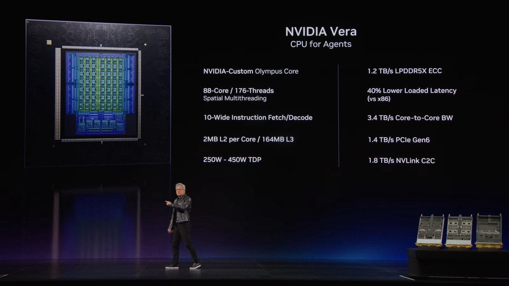
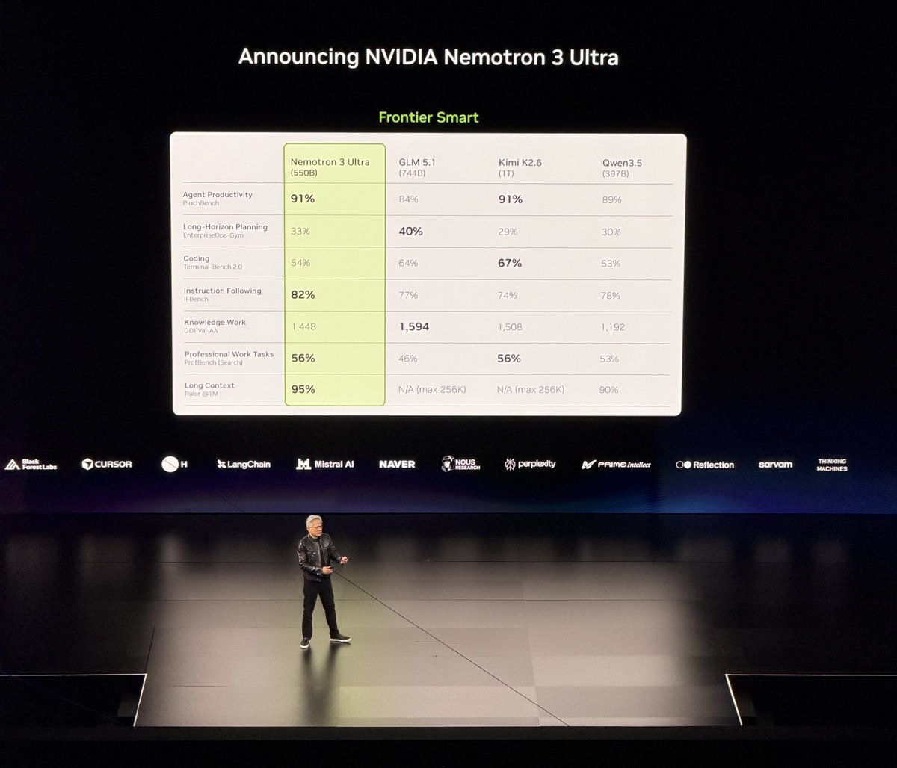

# NVIDIA GTC Taipei 2026: RTX Spark, Vera CPU, Nemotron 3 Ultra

At GTC Taipei (keynote by Jensen Huang, announced 2026-05-31 into 2026-06-01), NVIDIA pushed its agentic stack down onto the consumer desktop. The headline is not a single chip but a posture: a personal AI agent box (RTX Spark), a server CPU purpose-built for agent orchestration (Vera), and a 550B open model (Nemotron 3 Ultra) to run on top. RTX Spark puts 1 petaflop of FP4 (4-bit floating point) AI compute and 128 GB of unified memory on a desk, which makes large-context local agents viable without a datacenter. Vera is framed as a "CPU for Agents," with design choices that target the branchy, memory-latency-bound, many-small-context workload of agent orchestration rather than raw throughput compute. Nemotron 3 Ultra is the model story: a 550B model that ties or beats much larger frontier models on several agentic and long-context benchmarks.

*RTX Spark: Blackwell RTX GPU at 1 PFLOP FP4, 20-core Grace CPU (co-designed with MediaTek), 128 GB unified memory at 600 GB/s NVLink C2C, full NVIDIA stack (CUDA, TensorRT, NVFP4, RTX Ray Tracing, DLSS, Reflex, G-SYNC).*

## Key points

- **RTX Spark is the first Windows PC purpose-built for personal AI agents.** It is an NVIDIA plus Microsoft collaboration: native Windows experience for personal agents, new Windows security primitives, and NVIDIA OpenShell to run agents securely on the primary device. The shipping demo runs the Nous Research Hermes agent harness, with OpenShell wiring Hermes into Microsoft's security primitives.
- **128 GB unified memory at 600 GB/s is the consumer story that matters.** Unified memory means the GPU and CPU share one pool, so a local agent can hold a large context and large model weights without the host-to-device copy tax. This is what makes local long-context agents practical, not the FP4 flops alone.
- **NVIDIA Vera is a CPU designed for agents, not throughput.** Specs: NVIDIA-custom Olympus core; 88 cores / 176 threads with spatial multithreading; 10-wide instruction fetch and decode; 2 MB L2 per core and 164 MB L3; 250W to 450W TDP; 1.2 TB/s LPDDR5X ECC memory; 40% lower loaded latency vs x86; 3.4 TB/s core-to-core bandwidth; 1.4 TB/s PCIe Gen6; 1.8 TB/s NVLink C2C.
- **Vera's design reads as a latency play.** Huge L3, spatial multithreading, and very high core-to-core bandwidth all attack the same problem: agent orchestration is many small concurrent contexts that hand work to each other and stall on memory, not a few large matmuls. The "40% lower loaded latency vs x86" claim is the headline metric for that workload.
- **Nemotron 3 Ultra is 550B, branded "Frontier Smart," and punches above its weight.** Versus GLM 5.1 (744B), Kimi K2.6 (1T), and Qwen3.5 (397B): Agent Productivity (PinchBench) 91% (ties Kimi for top); Long-Horizon Planning (EnterpriseOps-Gym) 33% (GLM wins at 40%); Coding (Terminal-Bench 2.0) 54% (Kimi best at 67%); Instruction Following (IFBench) 82% (best); Knowledge Work (GDPVal-AA) 1,448 (GLM best at 1,594); Professional Work Tasks (ProfBench Search) 56% (ties Kimi); Long Context (Ruler at 1M) 95% (best, where GLM and Kimi are N/A beyond 256K and Qwen sits at 90%).
- **The 1M-token Ruler win is the standout.** Nemotron 3 Ultra is the only model in the table reported at 1M context, and it holds 95% there. For a long-context and agent-orchestration story, that is the most strategically aligned number on the slide.
- **Partner logos signal an open-agent ecosystem.** Black Forest Labs, Cursor, H, LangChain, Mistral AI, NAVER, Nous Research, Perplexity, Prime Intellect, Reflection, Sarvam, Thinking Machines.
- Separately, Scobleizer relayed a new Nemotron model described as "5x faster, 30% cheaper," consistent with the efficiency framing but not in the official benchmark table.

*Vera "CPU for Agents": 88 cores / 176 threads with spatial multithreading, 164 MB L3, 1.2 TB/s LPDDR5X, 3.4 TB/s core-to-core, 1.8 TB/s NVLink C2C, 40% lower loaded latency vs x86.*

*Nemotron 3 Ultra (550B) benchmark table vs GLM 5.1, Kimi K2.6, Qwen3.5. Wins on instruction following and 1M-token long context; trades blows elsewhere against much larger models.*

## How it relates to prior wiki pages

- **800VDC datacenter power work (2026-05-26)** argued the binding constraint for frontier compute is moving to power delivery and density. RTX Spark is the other end of that same stick: instead of denser datacenters, push a slice of the agentic stack onto the desk where the power budget is a wall socket. Both are NVIDIA betting that "where does the agent run" is now a hardware-placement question, not just a model question.
- **Blackwell SOL ExecBench (2026-05-28, doubleai)** measured how close real Blackwell deployments get to speed-of-light utilization. RTX Spark and Vera are the consumer and orchestration faces of the same Blackwell generation. The Vera latency claims are exactly the kind of number ExecBench-style methodology should be pointed at next.
- **The energy-to-token position paper (2026-05-14)** framed efficiency as joules per token rather than flops. Vera's "40% lower loaded latency" and the Scobleizer "30% cheaper" relay both belong in that frame: for agent workloads the cost driver is latency-bound idle time and memory traffic, not peak compute.
- **LongLive-2.0's NVFP4 KV cache on Blackwell (tracked in kv-cache.md)** used NVFP4 (the same 4-bit floating point format) to shrink the attention memory store on Blackwell for streaming video. NVFP4 now appears in BOTH the consumer agent stack (RTX Spark's listed stack) and the LongLive video stack. That convergence is worth naming: NVFP4 is becoming NVIDIA's default low-precision currency across consumer, video, and KV-cache compression, not a niche datacenter mode.

## Links

- Keynote source: [NVIDIA on X/Nitter](https://nitter.net/nvidia/status/2061313530914312674#m)
- Newsroom: [NVIDIA + Microsoft: Windows PCs for agents, RTX Spark](https://nvidianews.nvidia.com/news/nvidia-microsoft-windows-pcs-agents-rtx-spark)
- Related concept page: [GPU kernels](gpu-kernels.md)
- Related concept page: [KV cache](../inference-efficiency/kv-cache.md)

Raw source: [raw/twitter/2026-06-01-afternoon.md](../../raw/twitter/2026-06-01-afternoon.md)
