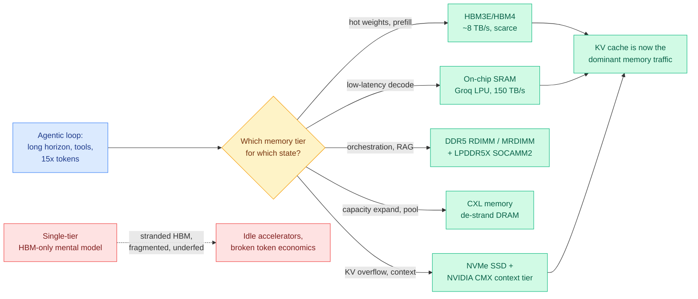

# Memory Technology for Agentic AI Workloads (Ken Huang)

**Source:** RSS · Ken Huang / DistributedApps.ai · [Memory Technology for Agentic AI Workloads: Technical and Business Outlook](https://kenhuangus.substack.com/p/memory-technology-for-agentic-ai)
**Raw:** [raw/rss/2026-06-07-agentic-ai-memory-technology-for-agentic-ai-workloads-technical-an.md](../../raw/rss/2026-06-07-agentic-ai-memory-technology-for-agentic-ai-workloads-technical-an.md)

## TL;DR

A systems-and-business survey arguing that in 2026 the decisive AI-infrastructure question is no longer FLOPS but memory: where the weights, activations, KV cache, retrieval data, tool state, and user context live, and how fast they move. The thesis is that agentic workloads break the single-tier memory model because agents reason over long horizons, hold cross-turn memory, call tools, and run multiple inference passes, so they touch every tier from on-chip SRAM through HBM, GDDR, DDR/LPDDR, CXL, and SSD context storage. Two facts anchor the piece: NVIDIA says agentic systems consume up to **15x more tokens** than traditional AI apps, and a 2026 UC Berkeley report restates that as context grows, the dominant memory traffic shifts **from weights to KV cache**, making KV-cache management a hardware problem, not just a software one. The business half: the memory shortage is structural (Micron cites a ~3:1 HBM-to-DDR5 wafer trade ratio), and broad relief is unlikely before 2028-2029, with top-end HBM allocation-driven into 2030.

## Key points

- **Agentic AI is a memory problem, not a compute problem.** Five shifts: token volume rises ~15x; long context moves the bottleneck from weights to KV cache; latency matters more than peak throughput (agents are interactive); memory becomes a revenue lever (token/s, time-to-first-token, tokens/watt, served context length); and agents pull DDR/LPDDR/CXL/SSD into the AI memory stack via tool calls, vector retrieval, and persistent conversation memory.
- **KV cache is the named bottleneck.** As context grows, generation is memory-bandwidth-bound and the traffic shifts from model weights to KV cache. This is why PagedAttention, KV-cache quantization, prefix sharing, context offload, and AI-native storage are now infrastructure topics. Micron's 256GB SOCAMM2 LPDDR module (one-third the power and footprint of RDIMM) claims **>2.3x better time-to-first-token** for long-context inference when used for KV-cache offload.
- **The SRAM-first counter-bet.** Groq-style LPUs keep hot inference state in hundreds of MB of on-chip SRAM (NVIDIA's Groq 3 LPX: 500MB SRAM/LPU, 150 TB/s SRAM bandwidth, 40 PB/s per 256-LPU rack) to attack latency and jitter, trading capacity for determinism. Attractive for decode-dominant, low-latency, interactive (i.e. agentic) inference; weak for HBM-heavy training and large prefill.
- **NVIDIA CMX / BlueField-4 makes storage part of the inference loop.** An AI-native, pod-level context tier for ephemeral KV cache, with KV-aware placement and reuse over Spectrum-X + Dynamo. SSDs are no longer just for datasets and checkpoints; they are an active KV tier.
- **The shortage is structural.** ~3:1 HBM-to-DDR5 wafer trade ratio (rising with each HBM generation), advanced-packaging bottleneck, suppliers chasing HBM margin, and multi-year fab lead times. Relief comes in waves: 2026 tight/allocation-driven, 2027 selective, 2028-2029 broader, top-end HBM allocation-driven into 2030.

## How this relates to prior wiki knowledge

- **The hardware floor under the wiki's compute-scarcity thread.** The wiki has tracked compute scarcity from the demand side ([CLEAR](../inference-efficiency/2026-06-05-clear-shadow-price-reasoning-budget.md), 06-05, ration a fixed inference-token budget by marginal utility) and from the macro side (the NVIDIA/SK hynix HBM-shortage-to-2031 datapoint in the 06-06 digest). This piece is the tier-by-tier mechanism: *why* HBM is the binding constraint, and which cheaper tiers (LPDDR SOCAMM2, CXL, SSD context) the industry is reaching for to relieve it. The recurring wiki lever — "do more perception/reasoning per watt and per byte" — is exactly the SOCAMM2 and SEAOTTER story.
- **Validates the KV-cache research program directly.** Every KV-cache paper the wiki has summarized — [VideoMLA](../inference-efficiency/2026-06-01-statekv-linear-video-vlm.md)-style low-rank latent caches, [VASE](../inference-efficiency/2026-06-03-vase-value-aware-stochastic-kv-eviction.md) (value-aware eviction), LongAttnComp (context compression) — is a software answer to the hardware fact this piece names: KV cache, not weights, is the dominant memory traffic at long context. The [kv-cache](../inference-efficiency/kv-cache.md) concept page's eviction/quantization/offload work is precisely what makes the cheaper memory tiers viable.
- **Parametric internalization as a memory-tier escape.** The [parametric context internalization](../inference-efficiency/parametric-context-internalization.md) line (Code2LoRA, Video2LoRA, 06-06) is the most aggressive form of "stop paying for context as KV cache" — bake context into weights so it never enters the cache at all. This piece frames why that matters economically.

## Research / industrial angle

The load-bearing forward claim is the timing of relief (2028-2029 broad, 2030 for top-end HBM), which sets a five-year window where serving stacks *must* ration and tier memory rather than assume HBM abundance. The most actionable systems direction is KV-aware tiering: deciding per-request which KV blocks live in HBM vs LPDDR/CXL/SSD, the hardware counterpart to CLEAR's per-query compute rationing. Processing-in-memory (Samsung HBM-PIM) and compute-in-memory (ReRAM/PCM/analog MAC) are flagged as the longer-term escape from the data-movement wall, but gated by analog precision, endurance, and compiler maturity.

→ Concept page: [memory-hierarchy](memory-hierarchy.md) · related: [kv-cache](../inference-efficiency/kv-cache.md)
