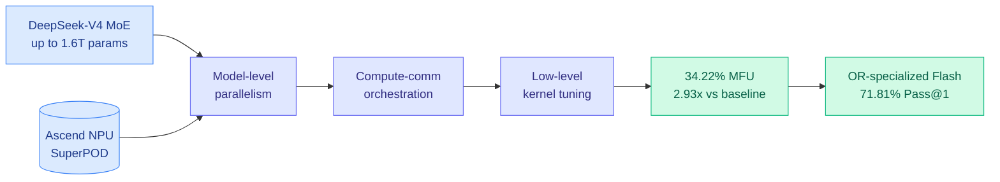

# SLAI T-Rex: Full-Parameter Post-training of DeepSeek-V4 on Ascend SuperPOD

**TL;DR.** A team at the Shenzhen Loop Area Institute post-trained the trillion-parameter DeepSeek-V4 family (including the 1.6T DeepSeek-V4-Pro) end-to-end on Huawei's Ascend NPU SuperPOD, not NVIDIA GPUs. Their hierarchical optimization stack (parallelism + compute-communication overlap + kernel tuning) reaches 34.22% Model FLOPs Utilization, a 2.93x improvement over the open-source baseline recipe, while staying stable. On top of it they built a domain workflow for Operations Research (OR) that beats GPT-5.4-Mini by 3.98 points on zero-shot Pass@1. This is a proof that frontier-scale post-training runs on sovereign, non-NVIDIA silicon.

## What it is

Full-parameter post-training of trillion-parameter MoE models is a systems nightmare: severe memory pressure, non-overlapped communication, and inefficient kernels. Almost every large-scale training system is built for GPU clusters. SLAI T-Rex is an end-to-end optimization practice on Huawei's Ascend NPU SuperPOD instead, using the DeepSeek-V4 family as the target workload. The framework spans three layers: model-level parallelism, computation-communication orchestration (hiding communication behind compute), and low-level kernel execution tuned for the Ascend architecture.

## Key findings

- **34.22% MFU on Ascend**, a 2.93x lift over the open-source baseline recipe, while maintaining training stability at 1.6T-parameter scale.
- Built a CPT + SFT workflow for Operations Research: 10K solver-verified SFT samples across four task categories and three problem representations.
- The OR-specialized DeepSeek-V4-Flash hits **71.81% zero-shot Pass@1**, beating GPT-5.4-Mini by 3.98 points and the base Flash model by 11.27 points.
- Positioned explicitly as "Part I" of a training-platform technical report series.

## Why it matters (relation to prior wiki)

This is the hardware-sovereignty counterpart to the compute themes the wiki has tracked all July. Yesterday's [Vera Rubin dive](2026-07-22-nvidia-vera-rubin-gigascale-ramp.md) showed NVIDIA leading on tokens-per-megawatt through rack co-design; the [Meta infra piece](2026-07-22-semianalysis-meta-infra-culture-reset.md) showed what happens without co-design discipline. SLAI T-Rex is a third data point: a Chinese lab demonstrating that full-parameter post-training of a frontier MoE is feasible on domestic Ascend silicon, closing the "you must have NVIDIA" gap that underwrites US export-control leverage. The 34.22% MFU is still well below the 40-50% frontier GPU clusters reach, so Ascend buys sovereignty at an efficiency cost, but the direction is what matters.

**Gaps.** MFU is reported for one workload family on one hardware generation; no power or $/token numbers, so the true efficiency gap versus a GPU baseline is unquantified. The OR gains are domain-specific and do not speak to general reasoning.

- Source: [arXiv 2607.20145](https://arxiv.org/abs/2607.20145) · [HuggingFace](https://huggingface.co/papers/2607.20145)
- Raw: `raw/huggingface/2026-07-23-slai-t-rex-full-parameter-post-training-of-the-deepseek-v4-f.md`
- Related: [Vera Rubin gigascale](2026-07-22-nvidia-vera-rubin-gigascale-ramp.md) · [Meta infra culture reset](2026-07-22-semianalysis-meta-infra-culture-reset.md)
