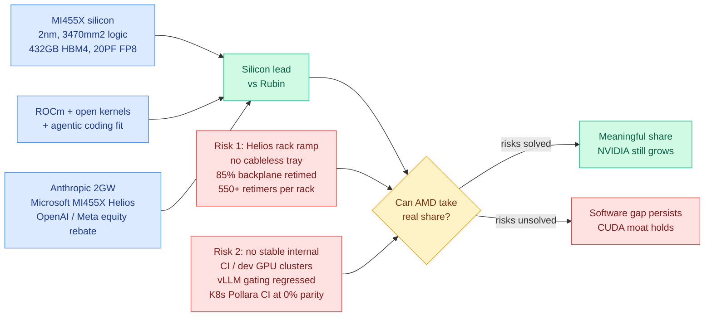

# SemiAnalysis: Can AMD Break the CUDA Moat? (Advancing AI 2026)

**TL;DR.** SemiAnalysis upgrades its AMD call for the third time, from "0% chance" (first ROCm article) to "non-zero" (AMD 2.0) to "a great chance of success," conditional on two specific risks. The silicon is no longer the argument: MI455X is the most advanced datacenter chip in a fab, first to 2nm, 5.5x reticle CoWoS-L, 3,470mm² of logic in package, 432GB of HBM4 against Rubin's 288GB, 20 PF FP8 against Rubin's 17.5. The two things that could still sink it are a Helios rack production ramp choked by a cableless-design gap and weak SerDes (up to 85% of the backplane needs retiming, 550+ Broadcom retimers per rack), and, more damningly, AMD's chronic inability to give its own software engineers stable GPU clusters for CI. Anthropic has committed to 2GW of AMD chips; Microsoft is back after skipping two generations.

## The silicon argument, which AMD wins

AMD is the first company shipping 2nm datacenter silicon, with both the MI455 compute tiles and the Venice CPU on TSMC N2 while every competing accelerator sits on N3. The MI455 package is the largest CoWoS-L module shipping at 5.5x reticle size, and AMD remains the only vendor using TSMC SoIC-X hybrid bonding, which lets it stack in the z dimension as well as x and y. Total logic silicon in package: 3,470mm², more than anything else shipping.

The layout is eight N2 XCDs hybrid-bonded on top of two reticle-sized base dies holding SRAM, HBM controllers, and the compute fabric. The departure from the MI300 family is two separate I/O dies carrying all off-package PHYs. They are physically identical, with each supporting 72 flexible lanes that speak 212G UALoE, 64G Infinity Fabric, PCIe Gen 6, 128G UALink, or xGMI4 depending on configuration, which is a deliberate bet on the open UALink consortium rather than a proprietary scale-up fabric.

The package size buys 12 stacks of HBM4 for 432GB per package, against 8 stacks and 288GB for both NVIDIA and Google.

SemiAnalysis is careful to deflate the headline number. 20 PF FP8 versus Rubin's 17.5 PF is a **mild** lead given how much more silicon AMD spent to get it, and it reflects a persistent deficit in GPU microarchitecture design rather than a win. Specifically, MI455X lacks the 3-bit LUT tensor cores Rubin's SM107 has, which reduce relative HBM bandwidth pressure. AMD is spending silicon to compensate for microarchitecture. Separately, the MI455 (gfx1250) instruction set is characterized as a clone of Hopper SM90's ISA.

## The two risks, which are the actual story

**Risk 1 is mechanical.** Helios, AMD's first rack-scale system, is ramping slowly because it does not use a cableless tray design, which Rubin Oberon is now adopting. AMD's weak SerDes means up to 85% of the backplane needs retiming, requiring over 550 Broadcom ethernet retimers per rack, and the rack is hitting backplane reliability problems in production ramp.

**Risk 2 is organizational, and SemiAnalysis writes it as an open letter to Lisa Su, Mark Papermaster, Sharon Zhou, Anush Elangovan, and Vamsi Boppana.** AMD engineers' chief complaint is that they cannot get stable GPU clusters for internal software development or for automated-testing CI. The concrete evidence:

- Kubernetes Inferencing Pollara NIC CI sits at **0% parity** with NVIDIA's ConnectX nightly CI. Kubernetes is the layer most of the world's inference deployments run on. It is not that AMD engineers do not want to add it; they are blocked on internal CI capacity.
- vLLM gating test progress **regressed this week** because AMD leadership pulled clusters away from the internal vLLM team during a capacity crunch. The team had been on track for 90% gating parity with CUDA by Advancing AI 2026. Gating tests are the ones that block merges, so gating parity is the metric that matters; non-gating pass rate is the number SemiAnalysis says AMD leadership shows to non-technical audiences.
- The MI455X open-source vLLM and SGLang nightly CI target for Advancing AI 2026 was missed and has slipped to October 2026, with an attempt to pull it back to August or September.
- Even with 2,000 more MI355X coming online this month and 6,000 MI325X/MI355X later this year, internal capacity remains **more than an order of magnitude below** NVIDIA's stable long-term internal development clusters.

The agentic-coding twist is the sharpest observation in the piece. Previously each human engineer needed a couple of nodes for distributed-inference software development. Now each *agent* needs GPUs to test against, one human runs dozens of agents, and each agent can spawn dozens of sub-agents. Agentic coding does not reduce AMD's GPU-capacity problem, it multiplies it. And because MI455 (gfx1250) is a completely different ISA from MI355 (gfx950) with different codepaths and kernels, both generations need testing, which multiplies it again.

## The commercial picture

Anthropic has publicly committed to deploying **2GW of AMD chips**, and SemiAnalysis cites Anthropic Head of Compute Tom Brown using Claude with `/goal` over a weekend to bring up Anthropic's internal inference stack on AMD hardware. The argument SemiAnalysis draws from that: because AMD's compiler and most of its kernels are open source, AMD is structurally better positioned for the agentic-coding era than a closed stack would be.

Microsoft dropped AMD after MI300X in 2023 over unreliable Samsung HBM and poor software quality, skipping both MI325X and MI355X. It has now committed to MI455X Helios, which SemiAnalysis believes is primarily for OpenAI as the Azure end customer. AMD is also announcing a Cerebras partnership for prefill-decode disaggregation targeting ultra-fast interactive inference, structurally similar to the NVIDIA-Groq arrangement.

The economics are the most striking line: AMD is giving Meta and OpenAI close to a **105% equity rebate discount** through stock-option financial engineering, fully triggered when AMD stock reaches $600 and the customer buys enough compute. SemiAnalysis's read is that Helios performance per TCO is strong enough that, combined with the rebate, cost per million tokens is "practically negative."

One organizational note that deserves more attention than it will get: most of AMD's best inference engineers are in Shanghai. The MoRI collective library, the UMBP KV-cache offloading team, and the disaggregated forward-deployed engineering team are all primarily Shanghai-based. A significant portion of the ROCm stack is built in China.

## Why it matters (relation to prior wiki)

This is the direct sequel to [SemiAnalysis on Meta's infra culture reset (07-22)](2026-07-22-semianalysis-meta-infra-culture-reset.md), which reported Meta planning a half-strength MI450 and framed that fork as the test of AMD's GenAI credibility. The [07-22 digest](../daily-digest/2026-07/2026-07-22.md) predicted the MI450 fork would resolve within 60 days and decide whether AMD gets Rubin-competitive GenAI volume. This piece does not resolve that specific fork, but it changes the frame: the binding constraint SemiAnalysis now names is not chip variant selection, it is CI cluster capacity. Meta's half-chip decision and AMD's vLLM gating regression are the same underlying disease seen from the customer side and the vendor side.

It contrasts sharply with [NVIDIA's Vera Rubin gigascale ramp (07-22)](2026-07-22-nvidia-vera-rubin-gigascale-ramp.md), which reported a 10x tokens-per-megawatt claim built on tight hardware-software co-design. AMD's answer is more silicon; NVIDIA's is better microarchitecture plus a stack that has been co-tuned for a decade. The MI455X-lacks-3-bit-LUT-tensor-cores detail is exactly that difference made concrete: NVIDIA is buying HBM bandwidth relief with datapath design, AMD is buying it with 432GB of HBM4.

It also sits under the sovereignty thread that [SLAI T-Rex (07-23)](2026-07-23-slai-t-rex-deepseek-v4-ascend.md) opened, where a Chinese lab post-trained a 1.6-trillion-parameter DeepSeek-V4 on Huawei Ascend at 34% FLOPs utilization. Both stories are about the same question from opposite directions: how much of NVIDIA's lead is silicon and how much is the software stack around it. T-Rex says a non-NVIDIA accelerator can carry a frontier training run if you write the systems layer yourself. This piece says AMD's silicon has been competitive for a while and the stack is still what is missing. The revealing overlap is that both answers route through China: Ascend is Huawei's, and most of AMD's inference-critical software is written in Shanghai.

## Gaps and caveats

Everything here is SemiAnalysis's read, with a stated conflict of interest in both directions: they are AMD's self-described #1 bug reporter and they meet regularly with AMD leadership, which gives them unusual visibility and also makes the piece partly an advocacy document. The 105% equity rebate and "practically negative cost per million tokens" claim is reconstructed from financial engineering, not disclosed terms. The article is part 1 of 3 (silicon and rack here, software stack next, economics third), so the TCO argument is asserted rather than shown.

- Source: [SemiAnalysis](https://newsletter.semianalysis.com/p/can-amd-break-the-cuda-moat-amd-advancing) (Bryan Shan, 2026-07-25)
- Raw: `raw/rss/2026-07-25-semianalysis-can-amd-break-the-cuda-moat-amd-advancing-ai-2026.md`, `raw/gmail/2026-07-25-starred.md`
- Related: [Meta infra culture reset](2026-07-22-semianalysis-meta-infra-culture-reset.md) · [NVIDIA Vera Rubin ramp](2026-07-22-nvidia-vera-rubin-gigascale-ramp.md) · [SLAI T-Rex on Ascend](2026-07-23-slai-t-rex-deepseek-v4-ascend.md) · [memory-hierarchy](memory-hierarchy.md) · [gpu-kernels](gpu-kernels.md)
