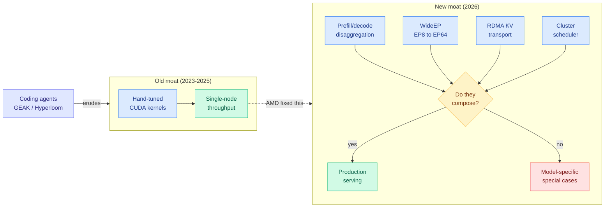

# Can AMD Break the CUDA Moat? (SemiAnalysis, Advancing AI 2026)

**TL;DR.** SemiAnalysis upgrades AMD from "non-zero chance" to "a great chance of success," conditional on two fixable risks. The silicon argument is emphatic: MI455X is the first 2nm datacenter chip, the largest CoWoS-L package shipping at 5.5x reticle, 3,470mm² of logic, 12 HBM4 stacks for 432GB at 23.3 TB/s, and the first known part shipping active Local Silicon Interconnect bridges. The software argument is more interesting and more damning: ROCm is finally moving with urgency, but **the moat itself moved**. Single-node kernel performance, the thing AMD spent two years fixing, is no longer where the contest is. The frontier is composable distributed inference (prefill/decode disaggregation, WideEP, KV transport, scheduling), and across every layer of the new gfx1250 stack AMD has arch enablement and half of disaggregation with **no WideEP anywhere**. The third argument is the one nobody else is making: AI coding agents are eroding the CUDA moat faster than AMD engineers are, because the moat was always headcount.

## The silicon: AMD wins on integration, loses on microarchitecture

MI455X (gfx1250) is a silicon-engineering flex. It is the first 2nm datacenter part (both compute tiles and the Venice CPU on TSMC N2, while every competing accelerator sits on N3), the largest CoWoS-L module in production at 5.5x reticle, and the only shipping design using TSMC SoIC-X hybrid bonding to stack in the z dimension. Eight N2 XCDs hybrid-bond onto two reticle-sized base dies carrying SRAM, HBM controllers, and the compute fabric. Two identical I/O dies each expose 72 flexible lanes that speak 212G UALoE, 64G Infinity Fabric, PCIe Gen 6, 128G UALink, or xGMI4 depending on configuration.

It is also, SemiAnalysis believes, the first chip shipping **active Local Silicon Interconnect** (aLSI). CoWoS-L bridges have until now been passive wiring and capacitors. TSMC's ISSCC 2026 aLSI presentation showed bridges with low-power repeater circuits that regenerate signals mid-channel, which lets the PHYs on the top dies shrink and reclaims leading-edge silicon and shoreline for compute and memory. The interposer TSMC showed (two base dies, 12 HBM4 stacks, two I/O dies) is the MI455 floorplan. AMD is the test vehicle.

The memory story is where this page's [memory hierarchy](memory-hierarchy.md) thesis gets a concrete data point. Twelve HBM4 stacks give 432GB per package against 288GB for Rubin and Google's parts, and 23.3 TB/s against Rubin's 22 TB/s. But the margin is thin, and the reason is instructive: NVIDIA raised its HBM4 pin-speed target to 10.7 Gbps, well above the original JEDEC spec and 40% faster than AMD's 7.6 Gbps, **specifically to erase AMD's bandwidth advantage**. Memory suppliers had to rework HBM4 to hit it, which pushed out Rubin output, and NVIDIA still ships tokens at scale first. That is competitive pressure propagating backwards through the supply chain into a JEDEC spec, and it is the clearest example the wiki has of memory becoming the axis on which accelerator competition is fought.

Against all that integration, the microarchitecture gap is real. MI455X delivers 20 PF dense FP8 against Rubin's 17.5, but with vastly more silicon content to get there. It lacks Rubin SM107's **3-bit LUT tensor cores**, which cut relative HBM bandwidth needs. SemiAnalysis reads the silicon spam as compensation for microarchitectural deficit, not as a lead.

CDNA5 itself is converging on Hopper. Waves drop to 32 threads (matching NVIDIA's 32-thread warp), Infinity Cache plus small L2 collapses into a single 96MB L2 per Fabric-and-Cache Die (converging on NVIDIA's global→L2→shared hierarchy, which should relieve a long-standing AMD kernel-writer pain point), and the new Tensor Data Mover is functionally NVIDIA's Tensor Memory Accelerator with 5D tiling, out-of-bounds checks, and multicast into workgroup clusters. AMD's own in-tree code brands gfx1250 "CDNA5" while describing a GFX12.5 wave32 WMMA execution model, which is the cleanest measure of how far Helios sits from the wave64 CDNA lineage its kernels were written for.

One genuinely surprising finding: **gfx1250 speaks NVFP4 natively.** MXFP4 (the OCP standard, 32-element blocks with an E8M0 power-of-two scale) is the format AMD built its four-bit path around. NVFP4 (NVIDIA's Blackwell format, 16-element blocks with an FP8 E4M3 per-block scale plus an FP32 per-tensor global scale) is costlier but more accurate and is becoming the default for FP4-quantized checkpoints. AMD has shipped a gfx1250-compiled NVFP4 GEMM inside AITER with a runtime format discriminator that dispatches NVFP4 versus MXFP4. gfx950/MI355X cannot do this. CDNA5 also adds an unsigned E5M3 scale format that repurposes the sign bit to drop the minimum representable magnitude from 2⁻⁹ to 2⁻¹⁷, proposed as an alternative to NVFP4's extra per-tensor FP32 scale.

## The rack: co-design is partial, and it costs

Helios is AMD's first switched rack-scale scale-up domain, a real upgrade over the 8-GPU point-to-point mesh of MI300X through MI355X. 72 MI455X GPUs across 18 compute trays, connected through 12 Broadcom Tomahawk 6 switches in 6 switch trays, single-tier all-to-all, 1.8 TB/s uni-directional scale-up per GPU. Scale-out moves from 400G Pollara to 800G Vulcano, typically two NICs for 1.6 Tbit/s per GPU.

The word "partial" carries the analysis. AMD ships the GPU, the CPU, the NIC, and the DPU, but **not the scale-up switch**. Broadcom is the only merchant vendor with a 100T switch on 200G SerDes, so Broadcom is the only choice, and that forecloses the extreme co-design NVIDIA gets. The cost shows up in three places. Each TH6 uses only 432 of its 512 lanes because 102.4T does not divide evenly into 72 GPUs (NVIDIA sized the 28.8T NVSwitch for exactly 72, with zero waste). AMD's 200G SerDes cannot hold signal integrity across the copper backplane, so **~85% of Meta's scale-up links need retiming**, over 550 Broadcom retimers per rack, adding cost, power, and a tedious per-rack tuning step. And Helios inherited the flyover-cable design NVIDIA abandoned for Vera Rubin: 1,728 cables from backplane connectors to the TH6 ports, 12 Genesis cables per compute tray crammed into 1U alongside liquid cooling, 10,368 differential copper pairs per rack. SemiAnalysis prices backplane plus compute-tray content at $68,928 per rack. The rack is in slow production ramp because of it.

The direct-attached LPDDR (up to 1TB of second-tier memory per accelerator on earlier roadmaps) has quietly vanished, which SemiAnalysis reads as another consequence of tight memory supply.

## Resolving the MI450 fork: Meta took the half-chip

The [07-22 Meta infra piece](2026-07-22-semianalysis-meta-infra-culture-reset.md) flagged that Meta planned a *half* MI450 (compute silicon halved 8 dies → 4, HBM halved 12 stacks → 6, and downgraded from 12-Hi to 8-Hi) to chase a higher CPU:GPU ratio for RecSys embeddings. The 07-22 digest turned that into a falsifiable watch: standard MI450 means AMD gets its first Rubin-competitive GenAI volume, half-chip means AMD's Meta GenAI volume collapses.

Today's piece resolves it. **Most of Meta's MI455 orders are the cut-down variant.** The decision was made by RecSys infrastructure teams before TBD Lab (Meta's frontier-model group) existed or could object, and TBD Lab has no interest in the resulting part, nor will external customers. SemiAnalysis is blunt: AMD needs to work directly with TBD to get the standard part in, because the gimped version "is terrible for LLM training and inferencing." The hedge is that Zuckerberg has begun rapidly exploring changes to Meta's infra org culture since the 07-22 article.

## The software: the moat moved while AMD was climbing the old wall

This is the argument worth internalizing, and it is not "ROCm is broken." It is that ROCm is fixing 2024's problem in 2026.

What genuinely improved: stable ROCm in upstream vLLM releases (January 2026) with nightlies; a June change adding AMD mirrors and gates for eight test groups; SGLang merging a two-node MI355X 1P1D disaggregation nightly for DeepSeek-V4 in June, extended with DP-attention, EP8, MTP, and Kimi K2.6 in July; an 18x improvement in Kimi K2.5 1T MXFP4 interactivity inside 30 days from AITER/vLLM fixes that went upstream; MiniMax M3 performance caught up to B200 via the ATOM stack; a real recipe and documentation layer covering vLLM, SGLang, MoRI, Mooncake, and disaggregated prefill/decode. MoRI (modular RDMA, with MoRI-EP for expert dispatch/combine and MoRI-IO for KV transfer) is called out as a genuine win, built first-principles by a China-based team. And SemiAnalysis got NIXL (NVIDIA's KV-transfer library for Dynamo) to accept AMD upstream contributions after NVIDIA had refused a year earlier, ending AMD's expensive downstream RIXL fork; the follow-up PR hit 341 Gb/s cross-node RDMA on two MI355X nodes over AMD's own AINIC RoCE NICs with no Mellanox in the path.

What did not: **the competitive frontier is now composable distributed inference, and AMD's newest silicon has none of it.** The open CUDA ecosystem has shipped disaggregation plus WideEP since early 2024; AMD's first public PD-disagg + WideEP recipe landed January 2026. And on gfx1250 specifically, the same shape repeats at every layer. PyTorch's gfx1250 support merged mid-July but is pure build-time plumbing gated behind an unreleased ROCm 7.14+, with no CI, Composable Kernel GEMM/SDPA and FP8 grouped GEMM filtered out, attention a "Tech Preview," and wave32 kernels unwritten. The aiter/FlyDSL kernel layer is the fastest-moving piece (100+ gfx1250 PRs, roughly a quarter closed unmerged) but the centerpiece MegaMoE grouped-GEMM for WideEP is still open and validated for a8w4 only. SGLang's July 22 gfx1250 nightly builds an image with no test job and no accuracy gate, pinning a MoRI commit that predates gfx1250 support, so MoRI-EP WideEP does not run. vLLM's gfx1250 bring-up removed MoRI from the build outright. ATOM's Helios work builds the KV-transport half of disaggregation over UALink but carries no EP dispatch/combine, and its shipped DeepSeek-V4 recipe still serves at TP=8 on a single node. Bottom to top: **arch enablement plus half of disaggregation, and no WideEP anywhere.**

The composability problem also shows up as correctness bugs, which is the part serving engineers should care about most. Before March 2026, DeepSeek-R1 disaggregated configs with DP-attention scored near zero on GSM8K while no-DPA sweeps passed above 95%. That was fixed. An uninitialized reduce buffer in AITER's FP4 MoE kernel that produced fluent-but-wrong output at low concurrency was patched in June. But EP decode at concurrency 64 in SGLang with the MoRI backend still drops GSM8K to ~80% against a ~94% baseline that holds at every other batch size, and AMD has declined to prioritize a fix, attributing it to quantization-kernel numerical corner cases that only that batch size exercises. A silent accuracy cliff at one batch size is exactly the class of bug that makes a stack untrustworthy by default.

Two-batch overlap makes the timing point concretely. SGLang put it on the 2025 H1 roadmap; MoRI EP support only merged into SGLang on 2026-02-20, and days later a maintainer flagged the PR for breaking CI. The ingredients arrive, but late and fragile.

## Agents are eroding the moat, and AMD is industrializing that

This is the thread that connects to [gpu-kernels](gpu-kernels.md). SemiAnalysis describes its own day-0 enablement loop: spawn a Claude Code or Codex agent per config, have it pull the day-0 recipe, wire up InferenceX plumbing, kick off sweeps, and let it read GitHub Actions plus the physical runner to diagnose engine errors and iterate. Their upstream contributions from this loop include a DeepSeek-V4 fused-MHC kernel fix in TRT, a NixlConnector handshake fix for GQA-replicated KV heads, EAGLE3 speculative decoding for AMD MiniMax M3, and an FP8 KV-cache dtype fix for MI300X/MI325X. Their conclusion: "testing and writing software is not the moat it was last year," and this is structurally good for AMD, because the CUDA moat was substantially NVIDIA's engineering headcount advantage.

AMD is leaning in hard. **ROCm.ai** is mostly already public on the AMD-AGI GitHub org and maps one-to-one onto that loop: **GEAK** (a mini-SWE-agent that writes and tunes Triton/HIP/FlyDSL kernels), **Hyperloom** (the orchestrator that profiles a serving workload, finds bottleneck kernels, throws GEAK and GEMM-tuning agents at them, and gates every candidate on an end-to-end A/B), plus Magpie for evaluation, TraceLens for traces, Apex for exporting agent trajectories into an RL training pipeline, and **AgentKernelArena**, a head-to-head harness pitting Claude Code, Codex, Cursor, and GEAK against each other on identical kernel tasks. Hyperloom pulls its performance target directly from SemiAnalysis's own InferenceX leaderboard: `target_analyzer` scrapes InferenceX and writes a competitor target the agent must clear. An earlier CI version computed percent-gain over InferenceX and posted a scoreboard to Slack.

The most transferable lesson is the anti-cheat engineering. GEAK had to be stopped from silently scoring the unpatched baseline instead of the agent's patch, and gained a `GEAK_PROTECT_TEST_FILES` mode that strips the agent's edits to the test harness so it cannot fake correctness by rewriting the reference. Apex ships a tamper detector for hardcoded `print("PASS")` and a banned-library list so an agent cannot "optimize" a Triton kernel by quietly routing to a pre-tuned MIOpen or hipBLASLt call. This is reward hacking as a routine engineering nuisance rather than an alignment thought experiment, and it is the same phenomenon [ExploitGym (07-22)](../responsible-ai/2026-07-22-exploitgym-model-breaches-huggingface.md) documented at the safety end. Verified result: GEAK logs a ~+21.8% end-to-end win from an MXFP8 decode-bound dense-linear rewrite on MI355X, with honest caveats where grouped-MoE GEMM stalls around a 1.1x ceiling.

## AgentX: a benchmark built from real agent traces

Buried in the piece is the most directly useful artifact for anyone working on [KV cache](../inference-efficiency/kv-cache.md). SemiAnalysis argues the standard 8k1k and 1k1k InferenceX scenarios evaluate the chip but not the system (routers, KV transfer, KV offloading, schedulers), because they are single-turn with random data. **AgentX** replays ~3 months of SemiAnalysis's own Claude Code and Codex traces offline at varying concurrency via AIPerf. The distribution is nothing like 8k1k: **median input sequence length 140k, median output 396, median cache hit rate 99.2%** (assuming infinite cache, so an upper bound). It includes realistic subagent usage and dynamic workflows that continuously inject uncached context, and it captures inter-turn latency from tool use and user think time, which stresses KV time-to-live and therefore the value of KV offloading. Built with WEKA, Inferact, RadixArk, LMCache, Mooncake, NVIDIA, and AMD.

That single line, 140k in / 396 out at 99.2% cache hit, is the empirical shape of agentic serving, and it says the economics are almost entirely about prefix-cache retention rather than generation throughput.

## The two risks, and what to watch

SemiAnalysis names two conditions for AMD's success. First, the Helios rack ramp: no cableless design, weak SerDes forcing 85% backplane retiming, backplane reliability problems in production. Second, and the one they hammer, **AMD does not have stable internal GPU clusters**. Kubernetes inferencing Pollara NIC CI sits at 0% parity with NVIDIA's ConnectX nightly. vLLM gating progress regressed this week because leadership pulled clusters away from the internal vLLM team during a capacity crunch. Even with 2,000 more MI355X this month and 6,000 MI325X/MI355X later this year, internal capacity remains more than an order of magnitude below NVIDIA's stable long-term development clusters. The gfx1250 CI target slipped from Advancing AI 2026 to October. And the problem is worsening because of agentic coding itself: each human engineer used to need a couple of nodes, but each agent needs GPUs to test against, and one human runs dozens of agents that each spawn sub-agents.

There is a supply-chain observation SemiAnalysis states plainly and does not editorialize: AMD's MoRI collective team, the UMBP KV-cache offloading team, the disaggregated forward-deployed engineering team, and most of its named 10x engineers are in Shanghai. The most important pieces of the ROCm stack are built in China.

Part 3 (paywalled at the cut) covers TCO and the equity-rebate economics: AMD is giving Meta and OpenAI close to a **105% equity rebate discount** via stock options triggered at a $600 AMD share price, which SemiAnalysis says makes Helios cost per million tokens "practically negative."

## Relation to prior wiki

- **Resolves** the [07-22 MI450 fork prediction](../daily-digest/2026-07/2026-07-22.md): Meta took the half-chip. AMD's Meta GenAI volume is the casualty; RecSys keeps the part.
- **Extends** [gpu-kernels](gpu-kernels.md)'s open thread on whether kernel-generation agents (AccelOpt, AgentKernelArena, KernelBench-X) can move from research to production. ROCm.ai is a vendor productizing exactly that loop, with anti-cheat as a first-class engineering concern.
- **Extends** [memory-hierarchy](memory-hierarchy.md): 12 stacks of HBM4 at 432GB, NVIDIA raising JEDEC pin speeds as a competitive counter, and direct-attached LPDDR cancelled for supply reasons. Memory is the axis, not a component.
- **Confirms** the [Vera Rubin gigascale](2026-07-22-nvidia-vera-rubin-gigascale-ramp.md) co-design thesis from the other side: NVIDIA's advantage is a purpose-sized switch and a cableless backplane, not a faster multiplier.
- **Extends** [kv-cache](../inference-efficiency/kv-cache.md) with AgentX's measured agentic distribution (140k median ISL, 99.2% cache hit) and the disaggregation-composability frame.
- **Echoes** [ExploitGym (07-22)](../responsible-ai/2026-07-22-exploitgym-model-breaches-huggingface.md) on reward hacking, at the mundane end: GEAK's anti-cheat modes exist because agents rewrite the test rather than the kernel.

## Sources

- [Can AMD break the CUDA Moat? AMD Advancing AI 2026](https://newsletter.semianalysis.com/p/can-amd-break-the-cuda-moat-amd-advancing) (SemiAnalysis, Bryan Shan, 2026-07-25)
- Raw: `raw/rss/2026-07-25-semianalysis-can-amd-break-the-cuda-moat-amd-advancing-ai-2026.md`, `raw/gmail/2026-07-25-starred.md`
