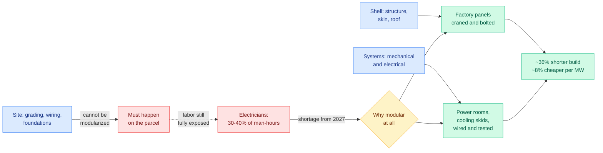

# LEGO Datacenters: The Binding Constraint on AI Capacity Is Electricians

**Source:** [SemiAnalysis, "The Wild Wild West Of LEGO Datacenters"](https://newsletter.semianalysis.com/p/the-wild-wild-west-of-lego-datacenters) (Nicolas Bontigui, 2026-07-29) · [raw file](../../raw/rss/2026-07-29-semianalysis-the-wild-wild-west-of-lego-datacenters.md) · also arrived via [Gmail starred](../../raw/gmail/2026-07-30-starred.md)

## TL;DR

SemiAnalysis argues that the bottleneck on AI datacenter capacity has moved off the things the industry usually argues about, chips and power interconnects, and onto **trade labor**. Electricians and pipefitters cannot be manufactured on a two-year cycle, and electricians alone represent **30 to 40% of total construction man-hours** on a datacenter project. Their Labor Model projects an electrician shortage emerging in **2027**, concentrated exactly where the buildout concentrates, Texas and Ohio. Modular construction is the industry's response: pull repeatable work off-site into factories so wall panels, power rooms and cooling skids get built in parallel with the site and arrive as finished units. Their bottom-up rebuild of the vendor claims finds modular compresses the construction window by **~36%, or 7 to 9 months**, and is **~8% cheaper on a capex/MW basis**. Their Modular Tracker covers **61GW+ of modular capacity across 1,000+ sites**, and they project modular penetration to pass **30% of total live capacity by end of 2028**.

## Diagram

## Key findings

**The labor constraint is different in kind from the other bottlenecks.** SemiAnalysis has spent recent months arguing that most claimed datacenter bottlenecks are misunderstood and solvable, including in "Stop Saying Half of 2026 US Datacenter Capacity Is Canceled." Trade labor is the stated exception, because capital cannot conjure a licensed electrician. The evidence they cite is a price signal rather than a forecast: Crusoe raised wages **30%** to pull talent to its Abilene site, which needed **over 9,000 workers at peak**. When an operator pays a 30% premium in a competitive labor market, the shortage is already binding.

**Reachable labor supply is a shared pool, so state-level buildouts compete.** Their Labor Model translates the state-by-state buildout into hours of demand per trade and sets that against reachable supply, where reachable supply in any one state is reduced by how much labor neighboring states are pulling. This is the analytically interesting move. It means the constraint is not additive across sites, and two projects in the same labor shed are partly substitutes rather than independent capacity.

**Prefabrication and modularization are not the same thing, and the conflation is the "wild west" of the title.** Prefabrication is any part of the build manufactured off-site and delivered ready to install, a statement about *where the work happened*. Modular is narrower: self-contained units, rooms, boxes and blocks, that ship complete and get bolted together. Every modular unit is prefabricated; not all prefabrication is modular. Vendors, EPCs and colocation providers are using one vocabulary for different products, which is why vendor speed and cost claims are hard to compare. SemiAnalysis maps **80+ players** and tests the claims bottom-up.

**Site cannot be modularized, and that caps the whole strategy.** The datacenter decomposes into site, shell, and systems. Grading, wiring and foundations have to happen on the parcel, so the labor exposure there is irreducible. Modularization only attacks the shell and the systems, which is why it mitigates rather than solves the labor problem.

**The value capture shift is the part that should interest anyone tracking the supply chain.** Vertiv's historical content was roughly **$3.5M/MW**; with full-stack modular solutions it reaches roughly **$7M/MW**. A vendor doubling its content per megawatt by absorbing integration work that used to be performed on-site by trade labor is the same economic substitution the labor model predicts, expressed as revenue.

**Named deployments.** AWS is rolling out a modular design at large scale codenamed **SAMDC**, and its **Project Houdini** prefabricates the white-space buildout, collapsing time-to-servers from months to weeks. Meta is standing up fabric-clad "tent"-like halls, a change SemiAnalysis called over a year ago. Compass and Switch were the first operators to move parts of builds off-site; skidded electrical equipment is now standard practice across operators.

## Relation to prior wiki state

This is the third distinct SemiAnalysis datacenter-economics piece the wiki has ingested this month, and together they walk down the stack. [Meta's infra culture reset (07-22)](2026-07-22-semianalysis-meta-infra-culture-reset.md) was about organizational capacity to build. [The AMD/CUDA moat analysis (07-25)](2026-07-25-semianalysis-amd-cuda-moat.md) was about software determining which silicon is usable, and carried the AgentX serving measurements (median 140k in / 396 out, 99.2% cache hit rate) that the [KV cache page](../inference-efficiency/kv-cache.md) now treats as the reference workload for agentic inference. This piece is one layer lower again: whether the building exists at all. The sequence is a useful corrective to how this wiki usually reasons, which is upward from the kernel.

It sharpens a claim the [memory hierarchy page](memory-hierarchy.md) has been making from the silicon side. That page argues HBM allocation is the constraint on AI capacity into 2030. This piece says that even where memory is allocated, the shell around it is gated by a labor supply curve that has nothing to do with semiconductors and cannot respond to price on the same timescale. Both are real; they bind at different points, and the labor one binds **earlier**, in 2027.

It also lands the same day as two earnings datapoints that read as the financial shadow of exactly this problem. Meta's capital expenditure nearly doubled to **$30 billion in one quarter, about half its revenue**, while free cash flow fell **91%** to just under $800 million and operating income dropped 8%. Microsoft spent more in absolute terms, **$35.8 billion**, but that was only 40% of revenue and its operating expenses rose 10%, so operating income rose 18%. Same category of spend, opposite cash discipline, and the market split accordingly with Meta down as much as 10% after hours and Microsoft up 9%. Speed is revenue, as SemiAnalysis puts it, but speed bought at 100% of incremental cash flow is a different bet from speed bought at 40% of revenue.

The financing structure is the third leg. [The Information's reporting on "spend now, lease later" bridge financing](../../raw/rss/2026-07-29-the-information-demand-heats-up-for-spend-now-lease-later-ai-financing.md) describes developers borrowing against projects with **no signed tenant**, to level land, pay for power studies, or get in line for scarce gas turbines. Goldman's global head of infrastructure and real asset finance calls it "probably one of the largest areas of increased inquiries from our clients." Read alongside this piece, the pattern is coherent: developers are racing the labor curve, which means committing capital before the lease exists, which means the lease-backstop and bridge-loan layer is absorbing the timing risk that modular construction is trying to remove physically.

## Gaps

The headline numbers come from SemiAnalysis's own proprietary Industrials Model, so the ~36% schedule compression and ~8% capex/MW advantage are not independently checkable, and the article is explicit that it is testing vendor claims against that model rather than against observed completions. The labor forecast assumes labor-hours per GW stays roughly flat ex-modular, which is the quantity modularization is supposed to change, so the demand curve and the mitigation are not modeled jointly in the framing chart. Most of the vendor-by-vendor analysis, which is where the falsifiable positioning claims live, is behind the subscriber paywall and unavailable here. And the piece names no failure cases: an 80-player vendor universe with no consistent definition of the product is exactly the setting where some modular claims turn out to be relabeled skids, and the article promises to test this without the tested results being visible in the public portion.

## Industrial implication

For anyone modeling AI compute supply, the actionable change is that **2027 US capacity should be forecast against electrician-hours, not against GPU shipments or grid interconnect queues**, in the states where buildout concentrates. The second-order read is a procurement one: if modular penetration goes from today's level to 30%+ of live capacity by 2028, then a meaningful share of what used to be construction labor cost migrates onto vendor balance sheets as equipment content, which is why Vertiv's per-MW content doubles. That makes the modular OEM and system-integrator layer a structurally better place to sit than the EPC layer, and it makes "who owns the factory" a question about AI capacity rather than about industrial equipment.

## Related

- [Memory Hierarchy for AI](memory-hierarchy.md)
- [SemiAnalysis: Meta's infra culture reset (07-22)](2026-07-22-semianalysis-meta-infra-culture-reset.md)
- [SemiAnalysis: AMD and the CUDA moat (07-25)](2026-07-25-semianalysis-amd-cuda-moat.md)
- [NVIDIA and SK: the $500B Korea letter of intent (07-25)](2026-07-25-nvidia-sk-korea-500b.md)
- [Daily digest 2026-07-30](../daily-digest/2026-07/2026-07-30.md)
