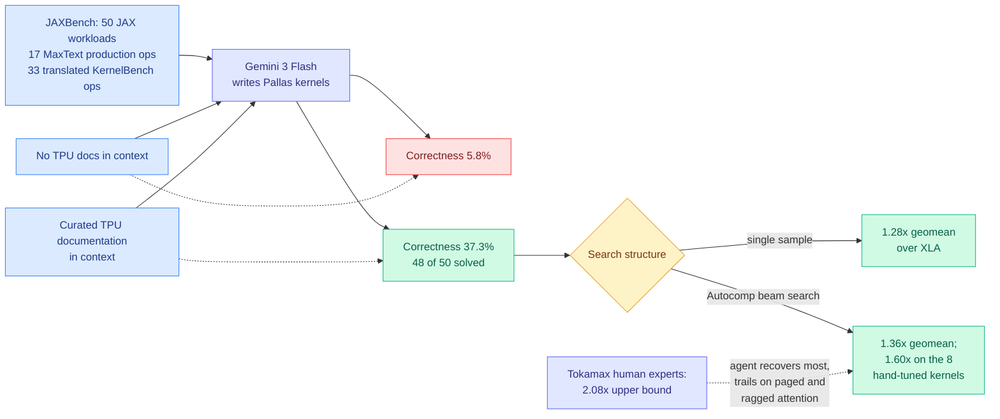

# JAXBench: Benchmarking Autonomous TPU Kernel Optimization

**arxiv:** [2607.20466](https://arxiv.org/abs/2607.20466) · **Source:** [DAIR.AI Top AI Papers of the Week, via Gmail starred 2026-08-03](../../raw/gmail/2026-08-03-starred.md) · **Authors:** Arya Tschand, Charles Hong, Julian Walker, Nina Cai, Shangkun Wang, Suvinay Subramanian et al. (Google, Harvard, UC Berkeley)

## TL;DR

Autonomous GPU kernel optimization has KernelBench to hill-climb on, and this wiki has been tracking the resulting agent stack since May. TPUs had nothing. JAXBench is the TPU-native equivalent: 50 JAX workloads, of which **17 are production ML operators pulled straight out of Google's public MaxText library** (Llama-3.1, DeepSeek-V3, Mixtral, Mamba-2, AlphaFold2 architectures) and 33 are KernelBench operators translated to Pallas and resized so they actually saturate the TPU v6e matrix unit. Eight of the 17 production operators ship with hand-optimized, block-size-tuned Pallas kernels from Google's public Tokamax library, which gives the benchmark something almost no agent benchmark has: **an expert upper bound rather than a naive baseline.**

The headline result splits the problem cleanly in two, and the split is the transferable part. **Correctness turned out to be a documentation problem.** Pallas, the TPU kernel DSL, is thinly documented, so models mostly guess. Conditioning Gemini 3 Flash on curated TPU documentation raises per-sample correctness from **5.8% to 37.3%** and gets 48 of 50 benchmarks solved at a 1.28x geomean speedup over XLA. **Speed turned out to be a search problem.** Once correctness is in hand, Autocomp's beam-search pipeline pushes the geomean to 1.36x, and on the eight hand-tuned kernels it reaches **1.60x against XLA, recovering most of the 2.08x that Tokamax's human experts achieve** but trailing specifically on paged and ragged attention. The paper's own framing is that target-specific context matters more than model scale on a sparsely documented DSL.

## Why the correctness-versus-speed split is the finding

The two numbers are governed by completely different interventions and this is not obvious in advance. Everyone's prior for "the model writes bad TPU kernels" is that TPU kernels are hard. The data says the model does not know the API. **A 6.4x improvement in per-sample correctness from a documentation dump is not a capability result, it is a retrieval result**, and it generalizes to any agent working against an interface that was under-represented in pretraining: an internal RPC layer, a new hardware ISA, a private DSL, a freshly released library version.

Speed is the opposite. Documentation does not tell you the block size, the pipelining schedule, or the layout that keeps the matrix unit fed, because those are properties of the specific workload shape and nobody wrote them down. That is a search over a numeric configuration space, and beam search buys most of the remaining gap. The clean statement is: **context fixes what the model does not know, search fixes what nobody knows.**

## Relation to prior wiki state

**This is the missing half of the kernel-agent picture the [gpu-kernels page](gpu-kernels.md) has been building since May.** Everything tracked there is NVIDIA or AMD. [SemiAnalysis on AMD's ROCm.ai (07-25)](2026-07-25-semianalysis-amd-cuda-moat.md) documented GEAK writing and tuning Triton/HIP kernels, Hyperloom orchestrating profile-then-attack loops with an end-to-end A/B gate, and **AgentKernelArena** running Claude Code, Codex, Cursor and GEAK head-to-head on identical tasks. That analysis's strategic claim was that the CUDA moat is substantially an engineering-headcount advantage and agents erode headcount advantages. JAXBench is the same argument applied to the one vendor whose moat was never CUDA: **if agents can close most of the expert gap on Pallas from public documentation, the software-maturity penalty for a non-NVIDIA target shrinks to the size of its docs.** Google publishing the benchmark itself is consistent with wanting exactly that.

**It also gives the 07-25 anti-cheat finding a control.** SemiAnalysis reported that a large share of the ROCm.ai engineering was preventing agents from scoring the unpatched baseline, faking correctness by editing the test harness, or routing a "Triton kernel" to a pre-tuned hipBLASLt call. JAXBench's eight Tokamax kernels are a structural defence against the softest version of that: when the reference is an expert-tuned kernel rather than the framework default, an agent cannot look good by beating a strawman. Reporting against XLA *and* against Tokamax is the right shape and more agent benchmarks should copy it.

**Confirms a claim from [MXAttention (08-01)](../inference-efficiency/2026-08-01-mxattention-mxfp4-attention-quantization.md) at a different level.** That paper found MXFP4's accuracy deficit against NVFP4 was two fixable numerical mistakes rather than a property of the format, and the wiki's read was that a hardware format's apparent inferiority can be an artifact of the software written for it. JAXBench says the same thing about a whole accelerator's programmability: the gap looked like silicon and a meaningful slice of it was documentation.

**Sits against the practitioner counterpoint.** tinygrad's DeepSeek-V4-Flash profile on 08-01 hit 245 tok/s single-user by hand-composing W4A8 kernels, fp8 KV cache and speculative decode. That is a human doing what Autocomp's beam search does, and the honest comparison is that the human still wins on the hardest operators. JAXBench's own trailing cases, **paged and ragged attention**, are exactly the irregular-memory kernels where hand tuning has always earned its keep.

## Gaps

One model family in the reported headline (Gemini 3 Flash), so how much of the 5.8%-to-37.3% jump is a Gemini property versus a general one is unknown, and the claim "context matters more than model scale" is asserted from a comparison the paper does not fully lay out in the abstract. The 1.60x on hand-tuned kernels is a geomean over eight operators, which is a small enough set that one outlier moves it. There is no cost accounting: beam search over kernel candidates means many compile-and-benchmark cycles on real TPU v6e time, and a speedup that costs more accelerator-hours to find than it saves in a year is a research result rather than a deployment one. And the 33 translated KernelBench operators were "resized for high MXU utilization," which is a benchmark-design choice that could flatter TPU-shaped workloads.

## Industrial read

Two actionable things. First, **ship your docs into the agent's context before you conclude your hardware is hard to program.** The cheapest possible intervention produced the largest single delta in this paper, and every vendor with a proprietary DSL should run this experiment on their own stack before funding a fine-tune. Second, the paper is quiet evidence that **the kernel-agent race is now a three-vendor race**, not an NVIDIA-versus-AMD one, and the benchmark being public and Google-authored means TPU kernel agents will improve on a public leaderboard the way GPU ones did after KernelBench. The open question the wiki should track is whether anyone runs AgentKernelArena-style cross-agent comparison on JAXBench, because that is the point at which "which agent writes the best kernels" becomes a portable question rather than a per-vendor one.

## Related pages

- [GPU Kernels and Accelerator Optimization](gpu-kernels.md)
- [SemiAnalysis on AMD and the CUDA moat (07-25)](2026-07-25-semianalysis-amd-cuda-moat.md)
- [MXAttention (08-01)](../inference-efficiency/2026-08-01-mxattention-mxfp4-attention-quantization.md)
- [Memory Hierarchy for AI](memory-hierarchy.md)
