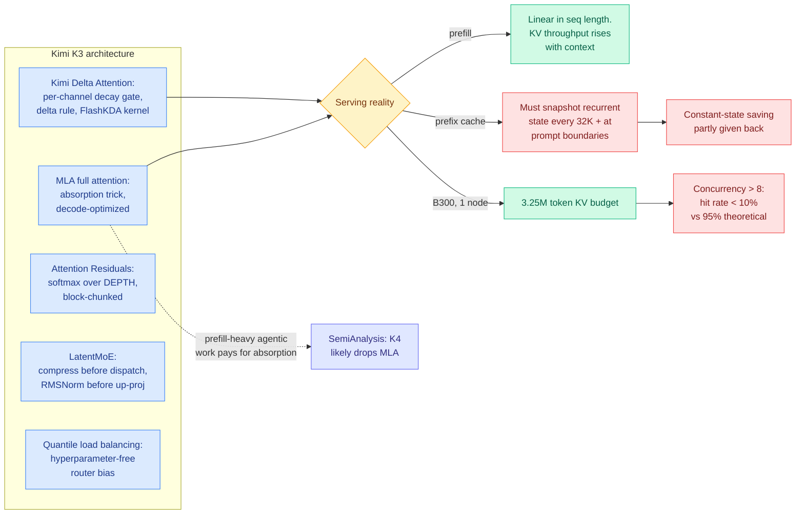

# SemiAnalysis on Kimi K3: the serving cost of every architecture choice

**TL;DR.** SemiAnalysis walked through the five unconventional techniques in Kimi K3 and priced each one at the kernel and cluster level rather than the benchmark level. The four claims worth carrying forward. (1) **Kimi Delta Attention** is a per-channel-gated delta rule whose custom kernel, FlashKDA, is linear in sequence length for prefill and constant for decode, and the piece derives the arithmetic intensity to prove it. (2) The KV cache saving from linear attention is **partly given back in production**, because prefix caching a recurrent state requires snapshotting it at intervals (vLLM every 32K tokens plus prompt boundaries), so serving-time memory grows with sequence length after all. (3) **Attention Residuals** replace the residual stream with softmax attention over the depth axis, giving each layer selective access to earlier layers, at 1.25x compute efficiency and only 4% pipeline-parallel overhead after cross-stage caching. (4) On real Claude Code traces, a B300 node holding Kimi K3 has a **3.25M token KV budget**, and above concurrency 8 the prefix cache thrashes so badly that hit rate falls below 10% against a theoretical 95%. Kimi K3 also keeps MLA as its full-attention layer, which SemiAnalysis reads as a decode-optimized choice that is wrong for agentic workloads, and predicts K4 will drop it.



## 1. Kimi Delta Attention and the FlashKDA kernel

The derivation chain is linear attention, then DeltaNet, then Gated DeltaNet, then KDA, and the piece frames each step as a change to an **online learning objective**.

Linear attention drops the softmax, which lets you reorder the operations so all past keys and values compress into one state matrix `S` instead of being read individually. Read `S` as an associative memory holding key-to-value associations; the update term is then literally the gradient of a retrieval loss with respect to `S`. The problem is that `S` grows without bound, old and new information blur together, and long-range recall lags softmax attention.

DeltaNet changes the loss to minimize the L2 norm of the value retrieval, which regularizes `S` and yields the delta rule. The term `S_{t-1} k_t - v_t` is the part of the current association that is *wrong*, so the update performs targeted removal rather than blind accumulation. Gated DeltaNet then adds an LSTM-style forget gate `alpha` on `S` so the model controls memory lifespan. **KDA expands `alpha` from a scalar into a diagonal matrix**, giving per-channel decay rates and, as a side effect, positional awareness. That last part matters more than it sounds: KDA is a strong enough position-aware operator that Kimi **removes RoPE from MLA entirely** and lets KDA carry position.

FlashKDA, which Moonshot open-sourced, splits into two kernels. K1 precomputes chunk-level tensors in parallel: cumulative decay, decayed and inverse-decayed keys and queries, the causal mask, and the `(I + L)^-1` inverse via Neumann factorization. K2 runs the chunk-level recurrence. The complexity result:

- **Prefill:** `12*C^3 + 8*C^2*D + 6*C*D^2` FLOPs per chunk of size C, which at sequence length T >> C is `O(T*D^2)`, linear. Memory traffic is `O(TC + TD + D^2)`, also linear.
- **Decode:** roughly `7*D^2` FLOPs and `8*D^2` bytes of traffic, dominated by reading and writing the FP32 recurrent state. **Constant in sequence length.**

## 2. KV throughput, and the claim that space complexity is the wrong metric

The sharpest analytical move in the piece is a refusal to score KV cache efficiency by cache size. The argument is that cache size is not a standalone property of a model, it is a consequence of the whole design: no open-weight model ships static KV compression, model-architecture inference efficiency affects cache efficiency, and the memory available for cache depends on the parallelism strategy (wide expert parallelism and tensor parallelism leave very different amounts of HBM free).

The proposed metric is **KV throughput: KV cache size divided by prefill time (time to first token), at a given sequence length.** It represents the minimum bandwidth needed to serve the model reliably under prefill-decode disaggregation, and because prefill time encapsulates architectural efficiency, the metric moves through memory-bound and compute-bound regimes as context grows. The reported pattern is that **hybrid linear attention's benefit becomes more pronounced as sequence length increases**, which is the useful directional claim.

It also doubles as a sizing tool for the memory hierarchy. KV cache lives in HBM first, spills to server DRAM, then spills to SSD, which the piece maps directly onto the register/cache/main-memory/disk hierarchy. Mooncake Store, the distributed KV pool, extends the analogy to coherency with write-through and write-back policies; write-through between DRAM and the distributed pool buys cross-node prefix sharing, avoids duplicating cache for tensor-parallel MLA, and gives redundancy when a node dies.

## 3. The prefix-cache problem for linear attention

This is the most important negative result in the piece and it is easy to miss.

At any token position KDA's recurrent state is fixed size, while standard attention's KV cache grows with position. That is the whole efficiency pitch. But inference engines find prefix cache hits by **matching the longest token prefix already cached**, and for a recurrent state you cannot reconstruct position *t* from a snapshot at position *t-k* without replaying. So to support arbitrary prefix matching you would have to cache the recurrent state at every token position, at which case memory grows with sequence length and the entire point of linear attention is gone.

Moonshot's fix is coarse-granularity snapshotting: **vLLM caches KDA state every 32K tokens**, plus at prompt boundaries, on the reasoning that agentic workloads start a new turn at the end of a prompt. The consequence, stated plainly by SemiAnalysis: *even though linear attentions like KDA greatly reduce KV cache memory consumption, realistically during serving they do not consume a constant amount of KV cache memory.*

## 4. Attention Residuals: softmax attention over depth

Kimi's second unconventional choice attacks the residual stream. The stated problem is that a residual connection gives every layer the *same* additive channel, so early layers dominate what the stream carries, information loss with depth is irreversible, and later layers have to increase output gain to influence a stream they cannot selectively read. Highway networks gate the flow but do not fix selective access.

Attention Residuals apply standard causal softmax attention with the **sequence dimension replaced by the depth dimension**. Each layer attends over the representations produced by previous layers. The query is not derived from the current token; it is a **learned parameter per layer**. So layer *l* asks a fixed question of every earlier layer's output and takes a weighted sum.

Naively this needs all previous layer outputs, which is `O(Ld)` communication for a model sharded across many GPUs. **Block Attention Residuals** cut that: split L layers into N blocks of S layers, attend over completed block outputs plus the current block's evolving partial sum, and communication drops to `O(Nd)`.

Reported effects: **1.25x compute efficiency** over standard residual connections, consistently lower validation loss with the gap widening during the decay phase, **bounded output magnitude** where standard residual networks grow with depth, and consistent gradient magnitude.

The systems work to make it trainable and servable is the part worth stealing:

- **Training.** Attention residuals need all N-1 prior block outputs, which is poison for pipeline parallelism. With cross-stage caching (store completed blocks on their rank, transfer only what is missing on subsequent virtual stages) communication drops from `O(C)` to `O(P)`, proportional to the virtual-stage count V, and the whole forward-backward pass overlaps compute and communication. Activation checkpointing eliminates inter-block chunk storage, so memory cost matches the standard architecture. **Net overhead: 4%.**
- **Inference.** Split into two phases that mirror prefill and decode. Phase 1 batches one query per layer against the completed block representations in parallel, returning outputs and softmax statistics for reuse. Phase 2 handles the evolving current block sequentially with online softmax, FlashAttention-style. IO footprint ends up close to a standard residual architecture.

## 5. LatentMoE and quantile load balancing

**LatentMoE** compresses routed tokens before the all-to-all dispatch and decompresses after aggregation, with an RMSNorm before the up-projection in Kimi K3's "Stable LatentMoE" variant to reduce scale sensitivity. The communication argument: volume is proportional to routed tokens `t`, active experts `K`, and expert input dimension `d`, inversely proportional to expert-parallel size `E`. Kimi K2 used 8 active experts at input dimension 7168; K3 halves the latent input dimension to **3584**, which lets active experts **double to 16 at unchanged communication volume**.

The piece then argues the more decision-relevant quantity is the communication-to-computation *ratio*, and derives it:

```
T_comm / T_comp = (P * F) / (6 * m * B) * (1 - 1/E)
```

where P is bytes communicated per activation element, F is per-GPU FFN throughput, m is expert intermediate dimension, B is per-GPU network bandwidth. **The expert intermediate dimension `m` is the only model configuration term in it.** Raising m lowers the ratio, meaning a larger fraction of communication can be hidden behind computation. SemiAnalysis reads this as the reason Kimi raised expert intermediate dimension to 3072, and the same reason DeepSeek V4 Pro, MiniMax M3, MiMo V2.5 Pro and Inkling all did something similar: as hardware FLOPs rise and expert weights get quantized harder, F grows, so m must grow to keep the ratio down.

**Quantile balancing (QB)**, from a February 2026 Jianlin Su blog post, is a hyperparameter-free auxiliary-loss-free load balancer. Standard aux-free balancing nudges router biases by a small coefficient. QB instead solves for the bias directly from the distribution of router scores relative to the routing cutoff. For each token the cutoff is the (k+1)-th highest biased router score; for each expert, QB sorts the margins between its score and every token's cutoff and sets the bias so exactly `q = mk/n` margins sit above threshold. Since `q/m = k/n`, that is the `(1 - k/n)` quantile of the margin, hence the name. Bias updates shrink naturally as the router balances, with no coefficient to tune.

## 6. Serving numbers on real agentic traces

The benchmark methodology deserves adoption independent of the results. InferenceX replays **an hour of recorded internal Claude Code traces** at steady state rather than running synthetic fixed-shape prompts. The trace statistics are the useful artifact: **median 142K input tokens per turn, median 444 output tokens per turn, median 65 turns per session.** Short outputs per turn are characteristic of agentic harnesses where the agent calls tools constantly and even edits are tool calls. SemiAnalysis explicitly frames this as a step up from their previous 8k1k/1k1k benchmark because it exercises prefix cache and DRAM offload behaviour that fixed-shape prompts cannot.

Findings:

- All OpenRouter providers floor at **$3 per million input tokens and $15 per million output** as of 30 July.
- Both NVIDIA and AMD had **day-0 vLLM recipes** with DRAM offload and DSpark speculative decoding. Bring-up was easier than DeepSeek V4 because Moonshot shipped images and a speculative-decoder model alongside the weights.
- **The model does not fit on a single B200 node.** Pipeline parallelism was required, and **DSpark speculative decoding does not work with pipeline parallelism**, so the B200 path loses speculative decoding entirely.
- **B300 fits on one node.** After weights, HBM holds **3.25M tokens** of KV. Throughput rises with batch size until concurrency exceeds **8**, which corresponds to that budget being exhausted, at which point **the cache thrashes and hit rate collapses below 10% against a theoretical 95%.**

## How this relates to prior wiki pages

**It complicates the strongest claim on the [kv-cache](../inference-efficiency/kv-cache.md) page.** The [local coding model report (07-30)](../inference-efficiency/2026-07-30-local-model-kv-cache-economics.md) measured NVIDIA's Nemotron Cascade 2 holding a 262K context with under 2 GB of KV cache against roughly 40 GB for dense Devstral Small 2, a ~20x architectural gap, and concluded that the largest available win is chosen at model-selection time rather than won by software cache management. SemiAnalysis does not contradict the measurement but adds the production caveat that report could not see: **the constant-state property is a property of the forward pass, not of a serving system with prefix caching.** Snapshotting every 32K tokens reintroduces growth with sequence length. The 20x number is real for a single-session local run and optimistic for a multi-tenant server with prefix reuse, which is the deployment the datacenter cares about.

It also gives that page a metric it has been missing. Every result on the page is scored in cache bytes or in tokens read. **KV throughput (cache size over prefill time) is the first proposed metric that prices architecture and cache size together**, and it is the natural unit for the offload hierarchy the [agentic AI memory hierarchy survey (06-07)](2026-06-07-agentic-ai-memory-hierarchy.md) described, where dominant memory traffic shifts from weights to KV cache as context grows.

**It supplies the production half of the [attention-mechanisms](../llms-foundation-models/attention-mechanisms.md) hybrid-convergence thread.** That page recorded the convergence as an architectural fact across [Nemotron 3 Ultra and Ling/Ring-2.6 (06-16)](../llms-foundation-models/2026-06-16-nemotron-3-ultra-moe-hybrid-mamba.md), then the mechanism study [Rethinking Efficient Attention (06-17)](../inference-efficiency/2026-06-17-rethinking-efficient-attention-hybrid.md), which found retrieval lives in the full-attention layers while efficient layers shape the optimization trajectory. SemiAnalysis adds the systems consequence and one genuine surprise: **Kimi K3 keeps MLA as its full-attention layer while every other frontier open-weight model moved to GQA-based sparse attention** (GLM 5.2's DeepSeek Sparse Attention, DeepSeek V4's Compressed Sparse Attention, MiniMax M3's MiniMax Sparse Attention, MiMo V3's HySparse). The reason is a workload bet: MLA's absorption trick cuts decode compute at the cost of extra prefill compute, which is right for decode-dominant reasoning and wrong for prefill-dominant agentic work. SemiAnalysis predicts K4 drops it. Given that their own trace data shows **142K input tokens against 444 output tokens per turn**, a 320:1 prefill-to-decode ratio, that prediction looks well supported by their own measurements.

**Block Attention Residuals now have two independent adopters in different modalities.** The attention-mechanisms page recorded [SANA-Video 2.0 (07-24)](../inference-efficiency/2026-07-24-sana-video-hybrid-linear-attention.md) (NVIDIA and MIT, Song Han) porting the LLM hybrid recipe to a video diffusion transformer trained from scratch, using Block Attention Residuals to route anchor summaries forward and lift deep-layer effective rank by roughly 12%. Kimi K3 uses the same mechanism in a frontier language model for a reported 1.25x compute efficiency. Two labs, two modalities, one mechanism, converging on the same claim: **the residual stream is a bottleneck and depth-axis attention is the fix.** That crosses this wiki's threshold for a real architectural trend rather than one lab's idiosyncrasy, and it is the second time in two months that a technique appeared in video and language nearly simultaneously.

**The MoE communication formula is the analytical companion to the routing measurement work.** [Beyond Geometric Complementarity (07-31)](../ai-routing/2026-07-31-coherent-overlap-moe-routing.md) found that expert subspaces overlap substantially, contradicting the geometric-complementarity story, while routes still beat matched alternatives in every one of 39 factorial cells, and concluded that pruning decisions made by representational similarity are invalid. That paper says nothing about *why* a given expert count and dimension were chosen. SemiAnalysis supplies it: the active-expert count and latent dimension are set by a **communication budget**, and the expert intermediate dimension is set by the communication-to-computation ratio. So MoE shape is a network-topology decision that the interpretability literature has been reading as a representational one.

**On the practitioner-numbers thread, the cache-thrashing result is the one to remember.** The concurrency-8 cliff, where prefix cache hit rate falls from a theoretical 95% to under 10% because the 3.25M token budget is exhausted, is a sharper version of the same shape as [TokenPilot (06-16)](../inference-efficiency/2026-06-16-tokenpilot-cache-efficient-agent-context.md)'s finding that any context edit mutating the prefix triggers full prefill recompute. Both say the same thing: **agentic serving economics are dominated by whether the prefix cache holds, and the failure is a cliff rather than a slope.**

## Gaps and cautions

The Attention Residuals section is the weakest-sourced part of the piece; several numbers (1.25x compute efficiency, 4% pipeline overhead, bounded output magnitude) are attributed to Kimi's own report and the Attention Residuals paper rather than independently measured, and the article's prose in that section is visibly rougher than the rest. The 1.25x is a compute-efficiency claim with no stated baseline configuration. The B300 concurrency-8 cliff is one model on one node shape with one trace corpus, and the trace corpus is SemiAnalysis's own internal Claude Code usage, which is a specific harness with a specific tool-call pattern, so the 142K/444/65 trace statistics should not be treated as universal agentic workload parameters. No comparison is offered between KDA and the GQA-based sparse attention mechanisms the piece lists as the competition, which is the comparison the MLA-versus-GQA argument actually needs. And the pricing floor of $3/$15 per million tokens is a 30 July snapshot in the middle of an active price war, with [DeepSeek V4 Flash reportedly discounting 99%](https://www.axios.com/2026/08/01/deepseek-model-cheap-ai-price-war) days later.

## Links

- Article: [SemiAnalysis, Kimi K3, The Manos, The Mythos, The Legendos](https://newsletter.semianalysis.com/p/kimi-k3-the-manos-the-mythos-the)
- FlashKDA: [github.com/MoonshotAI/FlashKDA](https://github.com/MoonshotAI/FlashKDA)
- Background: [Kimi Linear (arXiv 2510.26692)](https://arxiv.org/abs/2510.26692) · [DeltaNet Explained, Songlin Yang](https://sustcsonglin.github.io/blog/2024/deltanet-1/)
- Raw sources: [raw/rss/2026-08-03-semianalysis-kimi-k3](../../raw/rss/2026-08-03-semianalysis-kimi-k3-the-manos-the-mythos-the-legendos.md) · [raw/gmail/2026-08-04-starred.md](../../raw/gmail/2026-08-04-starred.md)
- Related: [kv-cache](../inference-efficiency/kv-cache.md) · [attention-mechanisms](../llms-foundation-models/attention-mechanisms.md) · [memory-hierarchy](memory-hierarchy.md) · [gpu-kernels](gpu-kernels.md) · [Raven](../ai-routing/2026-08-04-raven-sparse-memory-routing.md)
