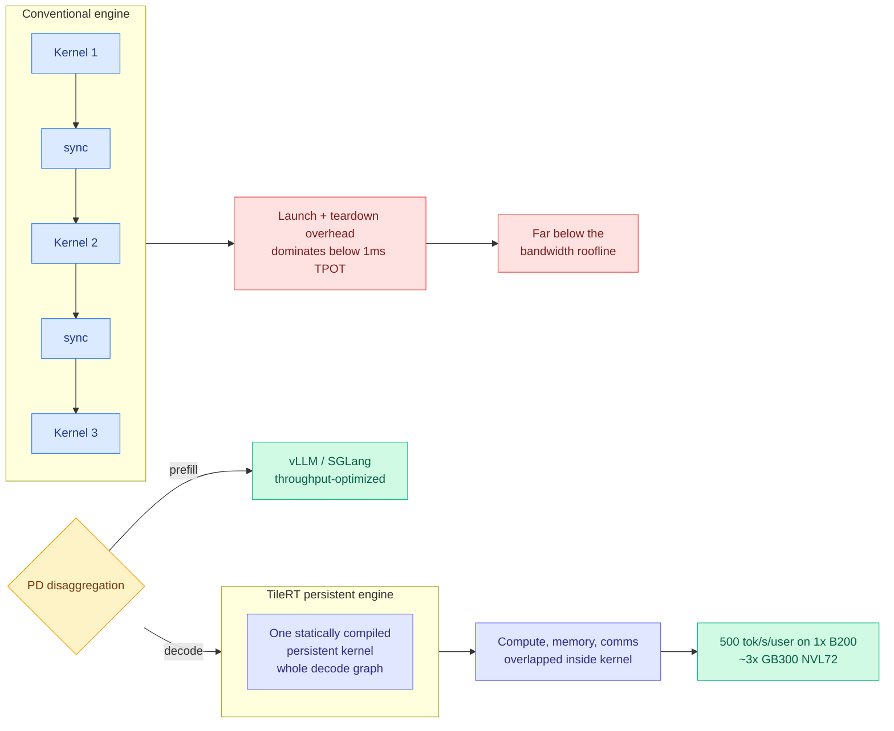

# TileRT: Compiling the Whole Decode Graph into One Persistent Kernel

**Source:** SemiAnalysis, "Ultra-High Interactivity on NVIDIA GPUs? TileRT InferenceX" · [post](https://newsletter.semianalysis.com/p/ultra-high-interactivity-on-nvidia)
**Raw:** [raw/rss/2026-08-10-semianalysis-ultra-high-interactivity-on-nvidia-gpus---tilert-infere.md](../../raw/rss/2026-08-10-semianalysis-ultra-high-interactivity-on-nvidia-gpus---tilert-infere.md) · also in [raw/gmail/2026-08-11-starred.md](../../raw/gmail/2026-08-11-starred.md)
**Date:** 2026-08-11 (published 2026-08-10)

## TL;DR

At batch size 1, an 8-GPU HGX B200 server has 64 TB/s of aggregate HBM bandwidth, and GLM-5 at NVFP4 needs only about 21 GB of active-parameter traffic per generated token. The bandwidth roofline therefore permits roughly **3,047 tokens/s/user** without speculative decoding. Real GPUs come nowhere near that. SemiAnalysis's argument is that the gap is **latency, not bandwidth**: the traditional GPU programming model launches and synchronizes many individual kernels, and that setup and teardown overhead dominates once time-per-output-token approaches the sub-millisecond range, even with CUDA graphs. Compounding it, HBM bandwidth rises roughly 2 to 3x per GPU generation while **memory latency has not improved at all**. TileRT's answer is to statically compile the entire decode graph into a **single persistent kernel**, maximizing overlap across compute, memory loads and stores, and communication. Measured on the InferenceX GLM5 FP8 744B benchmark on one B200 decode server: up to **500 tokens/s/user, about 3x faster than a GB300 NVL72 running conventional inference engines**, and up to 2x better interactivity at iso-cost-per-output-token. Already in production at Xiaomi (MiMo V2.5 Pro UltraSpeed) and ZAI (GLM 5.1 HighSpeed).

## The argument, in order

**1. Interactivity is now a product with a price, not a nice-to-have.** Premium "fast modes" prove users pay more for lower latency, which means higher gross margin on the same tokens. That is why frontier labs including OpenAI are evaluating purpose-built inference silicon (Cerebras, NVIDIA Groq LPUs) that trades batched throughput for ultra-high interactivity. Full-duplex voice is the forcing function: GPT-Live listens and speaks simultaneously, so response delay is immediately perceptible.

**2. The throughput-versus-interactivity curve is the real design space.** Interactivity (tokens/s/user, the inverse of time per output token) decides whether a response feels snappy. Throughput (tokens/s/GPU) decides cost per token. Batching buys the second at the cost of the first. SemiAnalysis's framing: a bus amortizes cost across passengers but makes each wait at shared stops.

**3. GPUs are good at the throughput end and structurally bad at the interactivity end, for a reason that is not bandwidth.** Kernel launch and synchronization overheads are invisible at conventional serving speeds and dominant at sub-millisecond TPOT. This is the load-bearing claim, and it reframes "GPUs cannot do low latency" from a hardware fact into a **software fact**.

**4. Therefore the fix can be software.** TileRT statically compiles the whole decode graph into one persistent kernel, removing the launch boundaries entirely and letting compute, memory movement and collective communication overlap inside a single launch. It comes from the same maintainer organization as the TileLang DSL.

**5. It composes with, rather than replaces, the existing stack.** Under prefill-decode disaggregation, TileRT handles latency-sensitive decode while vLLM and SGLang keep serving throughput-optimized prefill.

**6. The open commercial question SemiAnalysis raises is whether this eats the specialist chips' addressable market.** If a software layer on standard GPUs closes most of the interactivity gap, the case for Cerebras, Sambanova and NVIDIA's own Groq-derived LPU line narrows to the residual.

## How this relates to prior wiki pages

**It gives [gpu-kernels.md](gpu-kernels.md) its cleanest statement yet of the "the wall is not FLOPs" thesis, and moves the wall again.** This wiki has repeatedly logged that memory bandwidth rather than compute is the binding constraint, from [dMoE (06-01)](../inference-efficiency/2026-06-01-dmoe-block-level-moe-diffusion-llm.md)'s block-coherent expert routing to the whole KV compression literature. TileRT says that at the interactivity frontier the binding constraint is neither: it is **fixed per-kernel overhead plus flat memory latency**, and the fact that bandwidth improves 2 to 3x per generation while latency improves 0x means this gap widens with every new GPU. That is a genuinely new axis for this page.

**It is the direct latency-side complement to [OasisKV (08-11)](../inference-efficiency/2026-08-11-oasiskv-lookahead-sparse-prefetching.md), published the same day.** OasisKV attacks HBM *capacity* so a node can admit more concurrent requests; TileRT attacks decode *latency* so each request finishes faster. They pull in opposite directions on the throughput-interactivity curve and both ship as changes to the serving stack rather than the model. A stack that ran both would be choosing a point on the curve per request, which is precisely the per-request deadline expressiveness [kv-cache.md](../inference-efficiency/kv-cache.md) flagged as missing from vLLM and SGLang after [AAPT (08-04)](../agentic-systems/2026-08-04-aapt-anticipatory-policy-trees.md) showed GUI agents scoring 0.00 when decode misses a deadline.

**It quietly validates the AAPT reading of latency as a correctness axis.** AAPT found that for agents acting inside contested time windows, decode latency is not a cost but a step function on success. TileRT's 3x interactivity improvement is exactly the lever that moves such an agent from the failing side of the deadline to the passing side, without changing the policy at all.

**It sharpens the InferenceX methodology thread.** This wiki has used InferenceX numbers since [07-25](2026-07-25-semianalysis-amd-cuda-moat.md), including the AgentX scenario built from replayed Claude Code traces. The benchmark now has committed submissions from NVIDIA (Vera Rubin), Google (TPUv7) and AMD (MI455X UALoE72), which makes it the closest thing the field has to a neutral inference scoreboard.

## Gaps

- **Static compilation is the whole trick and also the whole limitation.** A single statically compiled persistent kernel is compiled for a shape. Variable batch composition, dynamic sequence lengths, and MoE expert selection that changes per token are all sources of shape variance, and the article does not report how much recompilation or specialization the production deployments needed.
- **The 500 tok/s/user figure is a decode-only, single-server number on one model at FP8.** Comparing it to a GB300 NVL72 running conventional engines is a comparison of software stacks as much as of hardware, which is the point, but it is not a like-for-like hardware result.
- **No accuracy accounting.** Interactivity work usually leans on speculative decoding and quantization, both of which have accuracy costs this wiki has priced elsewhere. The article's benchmarks are throughput and latency.
- **Composability with the tiering direction is unexplored.** If TileRT's persistent kernel assumes its working set is HBM-resident, an OasisKV-style prefetch from host memory is exactly the kind of unpredictable stall a fully overlapped static schedule handles worst.

## Industrial implication

The near-term effect is on procurement narratives rather than on silicon. Every argument for buying a specialist low-latency accelerator rests on the claim that GPUs cannot reach sub-millisecond TPOT. TileRT reframes that as a compiler problem with an existence proof and two production deployments. Expect NVIDIA to absorb persistent-kernel decode into TensorRT-LLM, expect the LPU and wafer-scale vendors to re-anchor their pitch on power per token rather than raw interactivity, and expect "fast mode" tiers to spread now that a 2x interactivity gain at iso-cost is demonstrably available in software.

## Related

- [gpu-kernels.md](gpu-kernels.md) concept page
- [memory-hierarchy.md](memory-hierarchy.md) concept page
- [OasisKV (08-11)](../inference-efficiency/2026-08-11-oasiskv-lookahead-sparse-prefetching.md)
- [SemiAnalysis AMD / AgentX (07-25)](2026-07-25-semianalysis-amd-cuda-moat.md), [Kimi K3 architecture primer (08-04)](../llms-foundation-models/2026-08-04-semianalysis-kimi-k3-architecture-primer.md)
