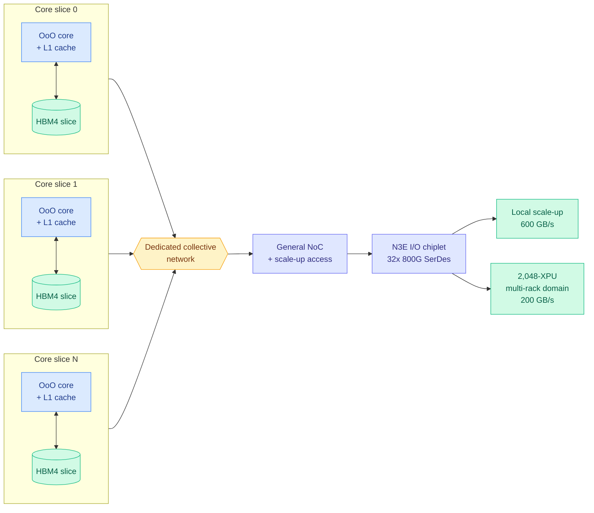

# OpenAI Jalapeño: a first-generation inference ASIC that beats Rubin on tokens per megawatt

**Source:** [SemiAnalysis, "OpenAI Jalapeño: Better Than Nvidia Blackwell"](https://newsletter.semianalysis.com/p/openai-jalapeno-better-than-nvidia) (2026-08-25) · [raw](../../raw/rss/2026-08-25-semianalysis-openai-jalape-o-better-than-nvidia-blackwell.md) · also in [starred Gmail](../../raw/gmail/2026-08-26-starred.md)
**Corroborating:** [The Information briefing](https://www.theinformation.com/briefings/openai-says-jalapeno-ai-chip-better-nvidias-blackwell) · [The Information analysis](https://www.theinformation.com/articles/openais-jalapeno-might-sicken-nvidia) · [OpenAI's own results post](https://openai.com/index/jalapeno-first-results/)

---

## TL;DR

OpenAI built an LLM-inference ASIC with Broadcom, taped out the CoWoS design in November 2025, and nine months later it beats every Nvidia, AMD and Google chip SemiAnalysis has benchmarked on tokens per second per megawatt. It does this **without speculative decoding, without multi-token prediction, and without prefill/decode disaggregation** — three techniques its competitors' published numbers all use. The architectural bet is not more FLOPs. It is the near-total elimination of KV-cache and weight movement, plus the elimination of fixed per-operation latencies, achieved by slicing cores and HBM into locally-paired units and giving each core an out-of-order pipeline with an L1 cache. First-generation ASICs are normally uncompetitive; this one is not, and SemiAnalysis's read is that hardware/software co-design by a frontier lab is the reason.

---

## Architecture

The load-bearing idea is the **slice**. On a GPU, a memory access traverses a deep hierarchy (global → L2 → shared → registers) and the resulting latency has to be amortized or hidden by giving each core more work, which is why GPUs need large batches and well-shaped matrices to approach their roofline. Jalapeño instead pairs each core slice with its own slice of HBM and gives it a low-latency local view of that slice only. Cross-slice synchronization is pushed onto a dedicated high-bandwidth collective network, which is affordable precisely because careful placement of weights and KV entries means the only traffic that must cross slices is known, structured communication such as tensor-parallel reduction, and that can be overlapped with compute.

The second divergence is at the core. Every other major accelerator (TPU, Trainium, GPUs) uses a software-managed scratchpad plus asynchronous DMA. Jalapeño uses an **out-of-order core with a real L1 cache**. The argument is the same one: barrier latency and launch latency are fixed overheads that other designs must hide behind more work per core, and removing them lets the chip approach peak bandwidth and FLOPs even at batch size 1. The cost is that performance now depends on good prefetching, which is harder to reason about statically.

---

## Key findings

- **Perf/W leadership without the usual tricks.** Jalapeño beats Blackwell on perf/W across almost all scenarios, and its single-token-prediction output-token throughput per megawatt exceeds Vera Rubin's *multi-token-prediction* results published by NVIDIA and CoreWeave in July. On DeepSeek R1 it exceeds **700 tokens/sec/user at concurrency 1**; GPT-OSS runs at roughly **1,400 tok/s/user**. On Kimi K2.5 (the base of Cursor Composer 2.5) it reaches nearly 700 tok/s/user and **more than 9x the next-best chip at 100 tok/s/user**. On GPT-OSS its iso-interactivity throughput per MW is nearly double GB200's best point and more than **50x GB200 at concurrency 1**.
- **Fewer FLOPs, better FLOPs-per-watt.** The B0 stepping now in the fab delivers **13.4 PFLOPs of MXFP4** on a single reticle-sized N3P compute die at **700W**, against Rubin's 17.5 PFLOPs of dense NVFP4 on a similar die, same node, at 900–1,150W. B0 is ~25% better perf/W than the A0 silicon all the published results were measured on. Jalapeño has the highest HBM bandwidth per watt and the highest FLOPs per watt of any accelerator SemiAnalysis compares.
- **HBM4 early, and faster HBM4 than Nvidia's.** 15.4 TB/s per package, implying 10 Gbps pin speeds against the 9.6 Gbps Nvidia is getting in Rubin. Likely Samsung supply. Jalapeño beats the established TPU and Trainium programs to HBM4.
- **A deliberate refusal to disaggregate prefill and decode.** Draft model and main model share the same chips and fabric. The stated reason is that the input / cache-write / cache-read / output token mix has shifted materially across the knowledge, reasoning and agentic model eras, so committing a fixed ratio of prefill silicon to decode silicon up front ages badly. A homogeneous pool that is merely good at everything beats a heterogeneous pool tuned for last year's mix.
- **Timeline as the real headline.** Tape-out November 2025, three months of bring-up on real silicon, industry-leading results at nine months, from a team starting at zero on the software stack. Rubin's CoWoS tape-out was a month *earlier* and the only public numbers are CoreWeave engineering samples. SemiAnalysis's conclusion: "The CUDA moat is potentially dead."
- **Models writing the chip and its kernels.** AI-assisted design cut SIMD area 8% and matrix-engine area 10%. Kernels are hand-written near-assembly (some ~3,000 lines) in **Gluon**, OpenAI's Triton-based kernel language whose distinguishing abstraction is *Linear Layouts*, a layout algebra enabling provably correct layout conversions and optimal memory swizzling. The internal serving engine is called Teacup. OpenAI had no MLA kernel implementation at all until it benchmarked DeepSeek, and **Codex wrote the working MLA kernels with no intervention from the kernel engineering team**.

---

## Gaps and caveats, stated plainly

SemiAnalysis flags four, and they matter more than the headline:

1. **All numbers come from OpenAI.** SemiAnalysis watched InferenceX runs in the lab but did not run the full suite independently.
2. **The workload is 8k1k single-turn.** No AgentX runs exist. Long-context multi-turn work stresses routers, prefix caches, cache management and offload infrastructure — exactly the components a homogeneous no-disaggregation design has the most to prove on. This is the single most important missing measurement.
3. **Blackwell is the wrong comparison.** SemiAnalysis says so itself: Jalapeño uses HBM4 and competes with Rubin, which is shipping now while Jalapeño has engineering samples. A custom inference chip beating a two-generation-old general-purpose GPU is expected.
4. **On perf/TCO, Rubin and Jalapeño are level** — and Rubin's number already includes speculative decoding, worth a 3–5x cost-per-token reduction, while Jalapeño's does not. Some of Jalapeño's TCO edge is simply Broadcom's margin replacing Nvidia's.

Production ramps gradually through 2027 with most output scheduled for late next year.

---

## Relation to prior wiki pages

**This is the first hardware result that makes [compute-economics](compute-economics.md)'s power-limited framing an architectural constraint rather than a market observation.** That page recorded, from the 08-13 sources, that Blackwell-generation capacity cleared auctions at 15% above record and that neolabs were being priced out. Jalapeño reframes the same scarcity one layer down: OpenAI states it is limited by **datacenter power, not budget or floorspace**, so tokens per megawatt is the objective function. SemiAnalysis's reduction is worth keeping — a watt is a joule per second, so tok/s/MW is just tokens per joule. Jensen Huang said the same thing at Computex 2026 ("if you have 1 gigawatt of power, then throughput per watt is revenue") and NVIDIA repeated it at Hot Chips 2026 ("the data center is power limited today"). Buyer and seller now agree on the denominator.

**It confirms and extends [gpu-kernels](gpu-kernels.md)'s agent-written-kernel thread with a much stronger instance.** That page tracked AccelOpt (04-20), an LLM agent optimizing AWS Trainium kernels that raised peak throughput utilization from 49% to 61% while matching Claude Sonnet 4 at 26x lower cost, and left open problem 1 asking whether FP4 kernel technique transfers across vendors' differing FP4 implementations. Jalapeño is the industrial escalation: Codex bringing up DeepSeek R1, Kimi K2.5 and GPT-OSS on a brand-new ISA in three months, including MLA kernels the human kernel team never touched. AccelOpt improved kernels on a mature stack; Codex created the stack. SemiAnalysis draws the consequence explicitly: if this holds, "the industry's obsession over programming models and perfect, universal compilers" is invalidated by frontier models, because you no longer need a great compiler if you can afford to have a model write a near-optimal kernel per shape.

**The slice design is a KV-cache result wearing hardware clothes.** [kv-cache](../inference-efficiency/kv-cache.md) has tracked a long software program of reducing KV movement (eviction policies, compression, layout). Jalapeño's stated primary design goal is "eliminating memory movement of KVCache and weights," addressed in silicon by co-locating cache with compute. The wiki has recorded software techniques fighting a memory hierarchy that Jalapeño simply declines to build.

**It is also the sharpest counterexample yet to [compute-economics](compute-economics.md)'s CUDA-durability thread.** That page records Jensen Huang's argument that CUDA continuity → versatility → fungibility → utilization → nine-year fleet life → financeability, and lists as open problem 4 "whether nine-year fleet life survives an architecture break." Jalapeño is not an architecture break inside CUDA; it is an exit from it, accomplished in 16 months from team-hiring to tape-out because the software burden that used to make that exit prohibitive is now partly borne by a model. Meta and Microsoft have been trying longer and have less, which is SemiAnalysis's own caution against reading this as a pure cost story.

---

## Research angle

Three open questions this leaves, in descending order of how much they matter:

1. **Does slice-local memory survive agentic workloads?** The whole design assumes cross-slice traffic is known and structured. Long-context multi-turn agent serving is dominated by prefix-cache hits, cache reads and offload, which is traffic whose locality is a function of the *request mix*, not the model graph. If prefix reuse patterns force unstructured cross-slice reads, the collective network becomes the bottleneck the memory hierarchy used to be. AgentX numbers would settle this and do not exist.
2. **How much of the win is the architecture and how much is the absence of speculative decoding on the baseline side?** Jalapeño's numbers are STP-only. When speculative decoding lands, its own numbers improve 3–5x on cost per token — but so does the comparison's interpretation, because the current chart compares an untuned general design against competitors' best-tuned configs. Both directions of that adjustment are unpublished.
3. **Is out-of-order-plus-L1 actually the right call, or is it the right call only when a model writes the prefetch?** The design trades static reasoning-about-performance for dynamic hardware behavior, and pays for it with prefetch sensitivity. SemiAnalysis's own answer is that Codex in a good harness with detailed tracing finds the optimal prefetching per shape. That makes the hardware decision *contingent on the code-generation capability*, which is a genuinely new kind of architectural dependency and nobody has characterized what happens when the model gets it wrong.

---

## Related pages

- [Compute economics](compute-economics.md)
- [GPU kernels](gpu-kernels.md)
- [Memory hierarchy](memory-hierarchy.md)
- [KV cache](../inference-efficiency/kv-cache.md)
