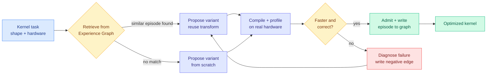

# Beyond Scaling: Self-Evolving LLM Agents for Hardware Kernel Optimization

**Source:** Kurate cs.LG board (#5 this week), [arXiv 2608.25570](http://arxiv.org/abs/2608.25570) · Siyuan Chen, Runlin Hou, Shenxiu Wu, Yansong Sun, Junming Cao et al. · published 2026-08-26
**Raw:** [raw/kurate/2026-08-28-cs-lg.md](../../raw/kurate/2026-08-28-cs-lg.md)
**Not on HuggingFace today.** Surfaced only through the Kurate arXiv board.

---

## TL;DR

Writing a fast GPU kernel is the most expensive kind of expert labour in the AI stack: hardware-specific, undocumented, and gone the moment the engineer leaves. This paper argues the way to automate it is not a bigger model doing a wider search, but an agent that **accumulates its own optimization experience in a graph and retrieves from it**. Two components: an experience-driven workflow (propose, compile, profile, diagnose, revise) and an **Experience Graph Memory** that stores past optimization episodes as linked nodes so a later kernel problem can retrieve the transformation that worked on a structurally similar one. The title is the thesis: scaling the model is the wrong lever, scaling the *memory of what worked* is the right one.

---

## What it does

The workflow is a closed loop against a real compiler and a real profiler, which is the only honest reward signal in this domain: a kernel either compiles, produces correct numerics, and runs faster, or it does not. There is no proxy score to game. On top of that loop sits the graph memory, which is where the paper differs from a plain iterative agent. An episode is not stored as a flat (slow, fast) text pair but as a node with typed edges to related episodes, so retrieval can follow structure (same memory-access pattern, same fusion opportunity, same hardware tier) rather than embedding similarity over source text.

## How this relates to prior wiki pages

**This is the direct successor to AccelOpt (04-20), and it upgrades exactly the component that page flagged as an open problem.** [AccelOpt](../inference-efficiency/2026-04-20-accelopt-gpu-kernel-optimization.md) was the wiki's first self-improving kernel agent: it kept a flat memory of slow-fast kernel pairs from past iterations and used them as few-shot examples, raising peak throughput utilization on AWS Trainium from 49% to 61%, and matching Claude Sonnet 4 using open models at 26x lower cost. The [gpu-kernels concept page](gpu-kernels.md) recorded open problem 2 as **"AccelOpt memory curation: optimal policy for which slow-fast pairs to retain, summarize, or discard as memory grows, analogy to KV cache eviction."** An experience *graph* with typed edges is a concrete answer to that: you do not decide what to evict, you decide what to link, and retrieval prunes itself by following the edges that matter for the current kernel.

**It is also the fourth arrival at the same structural idea from a completely different subfield.** [Recuris (08-26)](../agentic-systems/2026-08-26-recuris-experiential-working-memory.md) split agent memory into verified Working Memory and Experiential Memory retrieved *by* that working state, and improved 35 of 37 model-benchmark pairs on long-horizon tasks. [CaSKG (08-28)](../agentic-systems/2026-08-28-caskg-counterfactual-causal-skill-graphs.md), on today's HuggingFace list, calibrates the *edges* of a skill graph with counterfactual probes before retrieval because unreliable edges are what make graph retrieval fail. [Meta-Harness (08-25)](../agentic-systems/2026-08-25-meta-harness-code-space-optimization.md) got failure attribution by brute-force grepping up to 10M tokens of raw trace. Four systems, four domains, one claim: **an agent that improves over time needs structured, retrievable, attributable experience, and the structure of the memory is the design problem, not the model.**

**The counter-reading, and it should be taken seriously.** [Prime Agent (08-25)](../agentic-systems/2026-08-25-prime-agent-self-improving-rlm-harness.md) already reports matching or beating popular harnesses on GPU-kernel generation among its four task families, without a domain-specific kernel memory. So "does a kernel-specific experience graph beat a general strong harness on kernel work" is an open comparison, and neither paper runs it.

## Gaps

The Kurate entry carries the abstract-level claim without per-kernel numbers, so the size of the win over AccelOpt's flat memory is not yet checkable from this source. More importantly the paper is in the same position as every harness-optimization result on the [agent-harness-engineering](../agentic-systems/agent-harness-engineering.md) page: **the search cost is unpublished.** Compiling and profiling every proposed variant on real hardware is the expensive part, and an experience graph is only worth building if retrieval reduces the number of compile-profile cycles enough to pay for itself. That is a measurable quantity and it is not reported here.

Second gap: hardware generality. AccelOpt was Trainium-specific because the [gpu-kernels page](gpu-kernels.md) records that kernel corpora do not transfer across ISAs (AMD's gfx1250 wave32 kernels are largely unwritten precisely because the wave64 CDNA corpus does not carry forward). Whether an experience graph built on one accelerator retrieves usefully for another is the question that decides if this is a tool or a per-vendor artifact.

## Industrial implication

This lands the same week the industry shipped the production version of the same idea. At Hot Chips 2026, OpenAI said its **Sol and Astra models helped design the Jalapeño inference chip** and that Codex wrote working MLA kernels unaided; Google's TPU team credited DeepMind with making **TPU v8 6% more power efficient and 6% more powerful**; and the chip-design startup Agentrys raised $25M with a CEO who ran Nvidia's design-automation effort for a decade saying chip design will be done by "very powerful agentic systems ... nearly from start to finish." Research is proposing the memory architecture for kernel agents at the moment three silicon vendors have already put kernel and design agents in the critical path of shipping parts. See [AI-designed silicon at Hot Chips 2026](2026-08-28-ai-designed-silicon-hot-chips.md).

## Related

- [gpu-kernels](gpu-kernels.md) (concept)
- [AccelOpt (04-20)](../inference-efficiency/2026-04-20-accelopt-gpu-kernel-optimization.md)
- [Recuris (08-26)](../agentic-systems/2026-08-26-recuris-experiential-working-memory.md)
- [CaSKG (08-28)](../agentic-systems/2026-08-28-caskg-counterfactual-causal-skill-graphs.md)
- [AI-designed silicon at Hot Chips 2026 (08-28)](2026-08-28-ai-designed-silicon-hot-chips.md)
