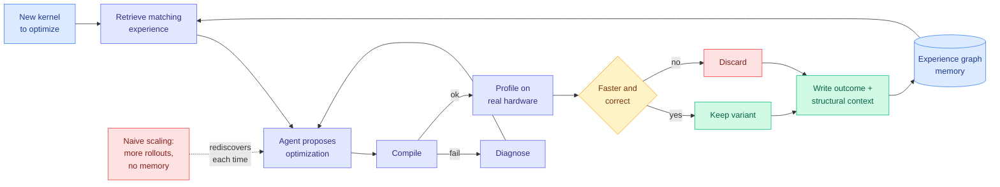

# Beyond Scaling: Self-Evolving LLM Agents for Hardware Kernel Optimization

**Source:** [arXiv 2608.25570](https://arxiv.org/abs/2608.25570) · Kurate cs.LG **#4 this week**, ai_rating 6.0/10 · Siyuan Chen, Runlin Hou, Shenxiu Wu, Yansong Sun, Junming Cao et al.
**Raw:** [raw/kurate/2026-08-31-cs-lg.md](../../raw/kurate/2026-08-31-cs-lg.md)
**Date ingested:** 2026-08-31

## TL;DR

The kernel-writing agent is now a two-year-old research object with a consistent shape: put a model in a loop with a compiler and a profiler, let it propose kernel variants, keep what gets faster. This paper's argument is that the loop as usually built is **memoryless across tasks**, so an agent that spent a thousand rollouts learning that a particular tiling pattern wins on a particular memory access shape starts from zero on the next kernel. Its answer is an experience-driven workflow backed by an **experience graph memory**: the agent's optimization attempts, their measured outcomes, and the structural context they applied to are stored as a graph and retrieved when a new kernel presents a matching structure. The title's claim is the one to hold onto, and it is a cost claim: **scaling the search does not get you there, and accumulating structured experience does.** More rollouts on a fresh problem is the expensive way to rediscover what a prior run already established.

## Diagram

## Relation to prior wiki state

**This is the fourth distinct instance of the kernel-agent idea this page has recorded, and the first to make memory the variable.** The prior three all varied something else:

- [AccelOpt (04-20)](../inference-efficiency/2026-04-20-accelopt-gpu-kernel-optimization.md) varied the **cost of the agent**, raising AWS Trainium peak-throughput utilization from 49% to 61% while matching Claude Sonnet 4 at 26x lower cost.
- [JAXBench (08-03)](2026-08-03-jaxbench-tpu-kernel-optimization.md) varied the **context**, and split the problem cleanly: correctness is a documentation problem (conditioning Gemini 3 Flash on curated TPU docs raised per-sample correctness from 5.8% to 37.3%), speed is a search problem (Autocomp's beam search took geomean to 1.36x over XLA, and 1.60x on the eight expert-tuned Pallas kernels).
- [OpenAI's Jalapeño (08-26)](2026-08-26-openai-jalapeno-inference-asic.md) varied the **target**, bringing up DeepSeek R1, Kimi K2.5 and GPT-OSS on a brand-new ISA within three months of first silicon, with Codex writing the working MLA kernels unaided.

This paper varies **what carries over between runs**, which is the axis none of them touched. JAXBench in particular left the door open for it: its 6.4x correctness jump from a documentation dump was, in this wiki's reading, a retrieval result rather than a capability result. An experience graph is the same insight pushed one step further, retrieving from what the agent itself discovered rather than from what a vendor documented. **If retrieval was worth 6.4x on correctness from static docs, retrieval from accumulated profiling outcomes should be worth more, because the docs never contained the answer in the first place.**

**It also imports the agent-memory literature's central lesson into kernel work, apparently without knowing it.** [agent-memory](../agentic-systems/agent-memory.md) has recorded that memory volume is an interference problem, not only a storage problem: [ALTK-Evolve (08-12)](../agentic-systems/2026-08-12-altk-evolve-selective-context-delivery.md) got DeepSeek-V3.2 from 80.4% to 89.3% task-goal completion while cutting tokens per task from 634K to 263K, which means the baseline was paying for context that was *actively harmful*. And [Recuris (08-26)](../agentic-systems/2026-08-26-recuris-experiential-working-memory.md) found that skill retrieval keyed on instruction or full history degrades exactly as a task gets hard, and fixed it by keying retrieval on **verified** state instead. Kernel optimization is the friendliest possible domain for that fix, because the state is verified by construction: a profiler measurement is not a self-report. A kernel agent that keys its experience retrieval on measured hardware counters rather than on source-text similarity is the obvious next design and this paper does not appear to do it.

## Why it matters commercially

The wiki's compute-economics thread has been converging on a specific claim: [SemiAnalysis on the CUDA moat (07-25)](2026-07-25-semianalysis-amd-cuda-moat.md) argued the moat is substantially an engineering-headcount advantage that agents erode, and Jalapeño's ISA bring-up made that concrete enough that SemiAnalysis called the moat "potentially dead." Every one of those arguments prices the moat as *the cost of generating kernels for a new target*. An experience graph changes that price in a specific way: the first target is as expensive as before, and every subsequent one is cheaper, because structural experience about tiling, memory access patterns and occupancy is more portable across targets than any particular kernel is. **That converts the moat from a fixed cost into a decaying one**, which is a worse position for the incumbent than a merely lower fixed cost.

## Gaps

The Kurate entry carries the abstract-level claim and the paper is not on HuggingFace, so the numbers behind "beyond scaling" are not verified here; treat the mechanism as the contribution and the magnitude as unconfirmed until the full evaluation is read. Two things a reader should look for specifically: whether the experience graph is evaluated against a matched-compute baseline (more rollouts without memory), which is the only comparison that supports the title, and whether experience transfers **across hardware targets** or only across kernels on one target. The second is where the commercial argument above lives, and cross-target transfer is much harder to demonstrate than within-target transfer.

## Related pages

- [gpu-kernels](gpu-kernels.md)
- [compute-economics](compute-economics.md)
- [agent-memory](../agentic-systems/agent-memory.md)
- [self-evolving-agents](../agentic-systems/self-evolving-agents.md)
- [Daily digest 2026-08-31](../daily-digest/2026-08/2026-08-31.md)
