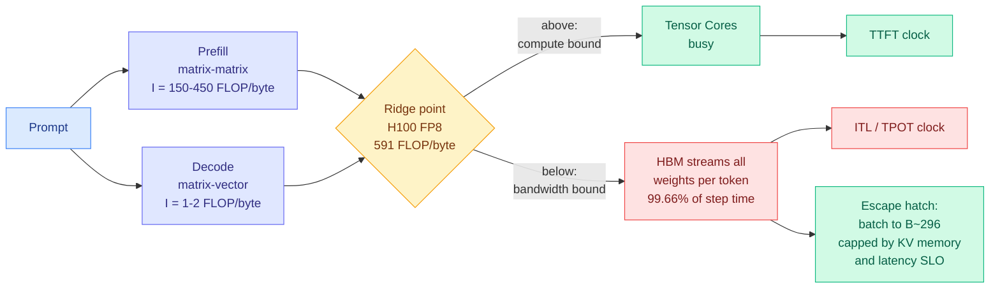

# The Physics of LLM Inference: Memory Walls, Arithmetic Intensity, and Compute Ceilings

**Source:** Ken Huang, *Agentic AI* (Substack), Chapter 1 of a 10-part series, 2026-08-31
**Link:** [kenhuangus.substack.com](https://kenhuangus.substack.com/p/the-physics-of-llm-inference-memory)
**Raw:** [raw/gmail/2026-09-01-starred.md](../../raw/gmail/2026-09-01-starred.md)

## TL;DR

If you size an LLM serving fleet from parameter count, you buy the wrong GPUs and then wonder why Tensor Cores idle while HBM (high-bandwidth memory, the GPU's main memory) runs flat out. This chapter derives the reason from the roofline model rather than from framework marketing. Autoregressive inference splits into two regimes with opposite hardware profiles. **Prefill** (processing the prompt) is dense matrix-matrix work at 150 to 450 FLOP per byte of operational intensity, which saturates Tensor Cores. **Decode** (generating one token at a time) degrades into matrix-vector work at roughly 1 to 2 FLOP per byte, and streams the entire weight tensor from HBM on every single step. On an H100 SXM5 in FP8, the ridge point where compute and bandwidth ceilings meet is about **591 FLOP/byte**, so single-stream decode delivers **under 0.3% of peak Tensor Core throughput**. That is not a software bug, it is the arithmetic of GEMV at scale.

## The load-bearing numbers

- **Roofline:** attainable throughput is `P = min(P_peak, I × BW_mem)`, with operational intensity `I` = total FLOPs divided by bytes moved across the memory bus. The ridge point `I_ridge = P_peak / BW_mem` is where the two ceilings meet.
- **H100 SXM5 FP8:** 1,979 TFLOPS peak against 3.35 TB/s HBM3 gives `I_ridge ≈ 591 FLOP/byte`. Decode at batch size 1 sits at `I ≈ 1.5`, so it runs at under 0.3% of peak.
- **The 70B decode timing proof.** A 70B model in FP8 is 70 GB of weights. Streaming them at 3.35 TB/s takes **20.9 ms**. The roughly 140 GFLOPs of arithmetic those weights enable takes **0.07 ms**. Memory is **99.66% of step time**. Any optimization that does not reduce **bytes moved per token** is fighting that ratio uphill.
- **Batching is the escape hatch, and it is capped.** With B independent decode streams sharing one weight load, intensity scales as `I(B) ≈ (2 / S_weight) × B`. For FP8 weights, hitting the H100 ridge would need **B ≈ 296** concurrent streams. Production never runs that hot, because KV cache memory and latency SLOs bind first.
- **Compute has scaled faster than HBM bandwidth across GPU generations**, which pushes the ridge rightward and makes batching *more* important over time, not less.
- **Latency taxonomy:** `TTFT = T_queue + T_prefix_lookup + T_prefill_compute + T_sample`; `ITL` (inter-token latency, also TPOT) is the gap between emissions; `T_E2E = TTFT + (M-1) × ITL_mean`. Interactive UIs need ITL under 30 to 50 ms; background agent workflows can relax to 80 to 120 ms and therefore run larger batches.

## How this relates to prior wiki pages

**It supplies the physical reason the wiki's entire efficiency corpus is shaped the way it is.** Every method on [kv-cache.md](../inference-efficiency/kv-cache.md), [knowledge-distillation.md](../inference-efficiency/knowledge-distillation.md), [model-pruning-sparsity.md](../inference-efficiency/model-pruning-sparsity.md) and [speculative-decoding.md](../inference-efficiency/speculative-decoding.md) is, under this frame, an attempt to reduce bytes moved per token or to raise effective batch size. The chapter states the criterion explicitly: quantization, batching, speculative decoding with acceptance, and KV compression all qualify; anything that only reduces FLOPs does not.

**It reframes today's cross-model KV sharing result as a larger win than it looks.** [Cross-model KV sharing (09-02)](../inference-efficiency/2026-09-02-cross-model-kv-sharing.md) reports Llama3.1-70B → Qwen2.5-7B handoff cutting latency from 899ms to 138ms. Read through the roofline: prefill is the **compute-bound** half of inference, the half that actually uses the Tensor Cores you paid for. Eliminating a redundant prefill therefore does not just save time, it frees the one phase where the accelerator is near its ceiling, and it does so without touching the memory-bound decode phase that dominates steady-state cost. The two results were written by unrelated authors and belong in the same paragraph.

**It prices the batching assumption that [Gambit (08-16)](../inference-efficiency/2026-08-16-gambit-thought-level-beam-search.md) exploits.** Gambit's premise is that in batched reasoning inference the binding constraint is not FLOPs but the KV cache held by N concurrent long traces, so it kills weak traces to fund branches off strong prefixes. This chapter is the derivation of why that premise holds: you need B in the hundreds to escape the memory wall, and KV memory is precisely what stops you getting there. Gambit is a policy for spending the scarce resource this chapter identifies.

**It adds a hardware-trend claim [memory-hierarchy.md](memory-hierarchy.md) should carry.** Compute scaling outrunning HBM bandwidth generation over generation means the ridge point moves right, so the batch size required to reach compute-bound decode **rises with every new accelerator**. That is a structural argument that KV-cache capacity work gets more valuable as hardware improves, not less, and it is the cleanest counter to the assumption that better GPUs make serving optimization a transitional concern.

## Gaps

The free preview stops at the roofline, the prefill/decode split, and the latency taxonomy. VRAM accounting, chunked prefill mechanics, continuous batching and PagedAttention, tensor-parallel interconnect costs, cluster sizing and the discrete-event simulator are behind the paywall, so the parts that would let someone check the ridge-point table for Blackwell-class parts against measured numbers are not verifiable from the public text. The figures referenced (roofline chart for H100 versus B200, the prefill/decode waterfall, the memory-hierarchy ladder, and Table 1.1 of frontier accelerator ridge points) are cited but not reproduced in the email body. Nothing here is novel physics; the value is that it is the correct frame stated cleanly, which most serving discussions skip.

## Related

- [memory-hierarchy](memory-hierarchy.md) — the ridge-point trend across GPU generations
- [compute-economics](compute-economics.md) — what the batching ceiling costs per served token
- [kv-cache](../inference-efficiency/kv-cache.md) — the resource that caps batch size before the ridge
- [Cross-model KV sharing (09-02)](../inference-efficiency/2026-09-02-cross-model-kv-sharing.md) — eliminating work in the compute-bound phase
