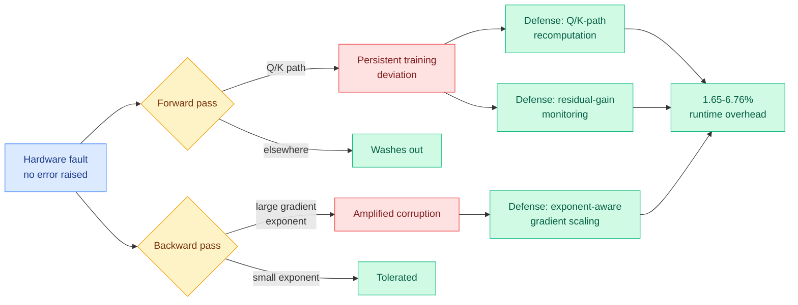

# TrainSDC: Characterizing and Mitigating Silent Data Corruption in LLM Training

**Source:** Kurate cs.LG leaderboard #20 (week of 2026-09-02), ai_rating 6.0/10, published 2026-08-31
**Paper:** [arXiv 2608.30769](https://arxiv.org/abs/2608.30769)
**Authors:** Zhipeng Xia, Haotian Xu, Siyu Yun, Liqi Lin, Hu Liu
**Raw:** [raw/kurate/2026-09-02-cs-lg.md](../../raw/kurate/2026-09-02-cs-lg.md)

## TL;DR

Silent data corruption (SDC) is a hardware fault that produces a wrong number without raising an error, so the training job keeps running on corrupted arithmetic. Existing protection treats all Transformer computations as equally vulnerable, because nobody had measured whether they are. This is the first systematic characterization of SDC vulnerability across the major computation interfaces of both the forward and backward passes, and it finds two **different** propagation mechanisms. Forward-pass vulnerability is strongly **location dependent**: faults on the **Q/K path** (the query and key projections that determine what attends to what) produce persistent training deviations, while faults elsewhere wash out. Backward-pass vulnerability is barely location dependent at all and is instead governed by the **distribution of gradient exponents**. TrainSDC turns each finding into a targeted defense: Q/K-path recomputation, residual-gain monitoring, and exponent-aware gradient scaling. On Llama 3.2-1B and Qwen3-0.6B it holds training behavior close to fault-free execution under both sparse and dense fault injection at **1.65% to 6.76% runtime overhead**.

## Why this is a hardware result, not a training result

At fleet scale, SDC is not hypothetical. It is the failure mode that makes a run diverge for no visible reason after thousands of GPU-hours, and the standard mitigations (full duplication, checksummed GEMMs, frequent checkpoint-and-compare) are expensive precisely because they are uniform. The contribution here is that uniformity is unnecessary, and the paper supplies the asymmetry that justifies non-uniform protection. Two consequences follow.

**The Q/K asymmetry is architecturally specific and actionable.** A fault in the query or key projection changes *which tokens attend to which*, and that decision propagates into every subsequent layer's inputs, so the corruption is structural rather than numerical. A fault in a value projection or a feed-forward matrix perturbs a magnitude that later normalization and residual mixing can absorb. That is a mechanism, not a correlation, and it means the protection budget should concentrate on a small, identifiable part of the network.

**The backward-pass finding inverts the design.** Because backward vulnerability tracks gradient **exponent distributions** rather than location, you cannot protect the backward pass by guarding specific matrices. You have to manage numerical range, which is why the defense is exponent-aware gradient scaling rather than recomputation. Forward and backward need structurally different countermeasures, and treating the pass as one thing is why uniform methods overpay.

## How this relates to prior wiki pages

**It is the first result in this wiki that prices training-time hardware reliability, and it fits the compute-economics thread from an angle that thread has not had.** [compute-economics.md](compute-economics.md) tracks the dollar cost of compute: neocloud pricing, contract length, counterparty risk. [SemiAnalysis's neocloud security work (08-31)](2026-08-31-semianalysis-neocloud-security.md) added counterparty *security* risk, testing neocloud security for ClusterMAX 3.0 and reporting no measurable change in CVE rates across the Nvidia driver, CUDA, PyTorch, Kubernetes and Docker. TrainSDC adds counterparty **silicon reliability**: a 1.65% to 6.76% overhead figure is the first number in this wiki for what it costs to not trust your accelerators' arithmetic. On a large pretraining run that is a real line item, and it should be part of the same procurement calculation as price per GPU-hour, because a vendor whose fleet needs the high end of that range is more expensive than its sticker price.

**It composes with the roofline picture in a way neither paper notes.** [The Physics of LLM Inference (09-02)](2026-09-02-physics-of-llm-inference-roofline.md) shows that compute has scaled faster than HBM bandwidth across generations. More aggressive low-precision formats are one of the main responses to that gap, and lower precision means fewer exponent bits, which is exactly the quantity TrainSDC identifies as governing backward-pass vulnerability. **The hardware trend that makes quantized training attractive is the same trend that makes gradient-exponent corruption more dangerous**, and that tension has no entry anywhere in this wiki yet.

**It also lands next to today's compression results as a third kind of "the standard instrument is uniform where the phenomenon is not."** [Functional Degeneracy (09-02)](../inference-efficiency/2026-09-02-functional-degeneracy-pruning.md) says unit-wise pruning criteria miss directional redundancy. TrainSDC says uniform fault protection misses locational vulnerability. Different subfields, same shape of error.

## Gaps

Llama 3.2-1B and Qwen3-0.6B are small, and SDC matters at the scale where runs cost millions, so the extrapolation from sub-1B to frontier scale is the whole question and it is untested here. Fault injection is a proxy for real silicon faults and the injection model shapes the conclusions; a fault distribution matched to observed field data would be a stronger basis. The overhead range of 1.65% to 6.76% is wide and the abstract does not say what moves it, which matters because the top of that range on a nine-figure training budget is a large number. And there is no accuracy or loss-curve figure quantifying "close to fault-free execution," so the residual deviation is unbounded from the abstract alone.

## Related

- [compute-economics](compute-economics.md) — reliability as a procurement term
- [memory-hierarchy](memory-hierarchy.md) — precision and exponent range
- [SemiAnalysis: neocloud security (08-31)](2026-08-31-semianalysis-neocloud-security.md) — the adjacent counterparty-risk result
- [The Physics of LLM Inference (09-02)](2026-09-02-physics-of-llm-inference-roofline.md) — the precision pressure that raises exponent risk
