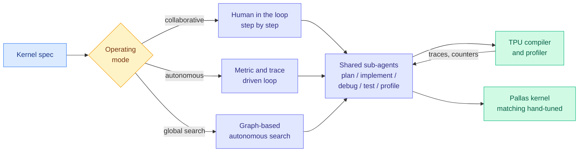

# MaxKernel: Agentic Kernel Generation for TPUs

**Source:** HuggingFace Daily Papers, 2026-09-07 · [arXiv 2609.04523](https://arxiv.org/abs/2609.04523) · [code](https://github.com/AI-Hypercomputer/accelerator-agents/tree/main/MaxKernel) · [raw](../../raw/huggingface/2026-09-07-maxkernel-agentic-kernel-generation-for-tpus.md) · alphaxiv overview consulted

**TL;DR.** Google, with one author from DeepMind, ships a multi-agent system that writes optimized TPU kernels in JAX/Pallas and open-sources it. The contribution is not one agent but **three operating points over the same pool of sub-agents**: a human-in-the-loop agent for collaborative step-by-step design, a fully autonomous metric-and-trace-driven optimization loop, and a graph-based autonomous search that scales the autonomous agent into global exploration of the design space. Underneath all three sits one shared set of specialists for planning, implementation, self-debugging, testing and hardware profiling. Evaluated on **JaxBench, 50 diverse TPU kernel tasks**, plus real workloads from state-of-the-art open models, it matches expert hand-tuned baselines.

## What it varies that the prior four did not

The [GPU kernels](gpu-kernels.md) page holds four kernel-agent results and reads them as a sequence in which each varied exactly one thing. MaxKernel is the fifth, and the axis is **autonomy level held against a fixed sub-agent pool**.

| Result | What it varied | Headline |
|---|---|---|
| [AccelOpt (04-20)](../inference-efficiency/2026-04-20-accelopt-gpu-kernel-optimization.md) | The cost of the agent | Trainium peak-throughput utilization 49% to 61%, matching Claude Sonnet 4 at 26x lower cost |
| [JAXBench (08-03)](2026-08-03-jaxbench-tpu-kernel-optimization.md) | The context | Curated TPU docs took Gemini 3 Flash from 5.8% to 37.3% per-sample correctness |
| [Jalapeño (08-26)](2026-08-26-openai-jalapeno-inference-asic.md) | The target | Three models up on a brand-new instruction set in three months, Codex writing MLA kernels unaided |
| [Beyond Scaling (08-31)](2026-08-31-self-evolving-kernel-optimization-agents.md) | Cross-task memory | An experience graph over past attempts beats more rollouts |
| **MaxKernel (09-07)** | **Autonomy level** | **One sub-agent pool, three operating points, matching hand-tuned baselines on 50 TPU tasks** |

**The reason this matters is that it is the first to run the comparison rather than pick a point.** Every prior result argues that its chosen degree of automation is the right one. MaxKernel builds all three on shared machinery, which is the only setup in which the question "how much autonomy does kernel optimization actually want" can be answered rather than assumed.

**It is also the second result on the same benchmark, which the page needed.** JAXBench arrived on 08-03 and this page read its 6.4x correctness jump as **a retrieval result, not a capability result**: curated documentation, not a better agent. A second system evaluated on JaxBench turns that benchmark from a single-paper artifact into a comparison point. The honest caveat is that MaxKernel comes from Google and targets Google's own accelerator with Google's own kernel DSL, so the vendor advantage in documentation and profiler access is exactly the variable JAXBench identified as decisive.

**The open-sourcing is the part with the largest downstream consequence, and it cuts against a moat argument this wiki has been tracking.** The [compute economics](compute-economics.md) thread has treated the CUDA software ecosystem as the durable part of NVIDIA's position, on the reasoning that alternative accelerators lose on kernel availability rather than on silicon. **Four of the five results in the table above are on non-NVIDIA targets** (Trainium, TPU, TPU, a new inference ASIC). If an open agentic system can produce hand-tuned-quality Pallas kernels on demand, the cost of standing up a competitive kernel library on a new accelerator falls from a multi-year staffing problem to a compute bill.

## Gaps

The abstract claims MaxKernel "matches expert hand-tuned baselines and delivers significant performance" without a single number in the abstract, which for a performance paper is a conspicuous omission and means the headline has to be taken on the benchmark's terms rather than verified from the summary. No cost accounting for the agent itself, which is the axis AccelOpt made central and which decides whether graph-based global search is affordable in practice. And the three paradigms are presented as complements without a stated decision rule for choosing between them, which is the finding the three-way design was uniquely positioned to produce.

## Related

- [GPU kernels and accelerator optimization](gpu-kernels.md) · [Compute economics](compute-economics.md) · [Self-evolving agents](../agentic-systems/self-evolving-agents.md)
- [Daily digest 2026-09-07](../daily-digest/2026-09/2026-09-07.md)
