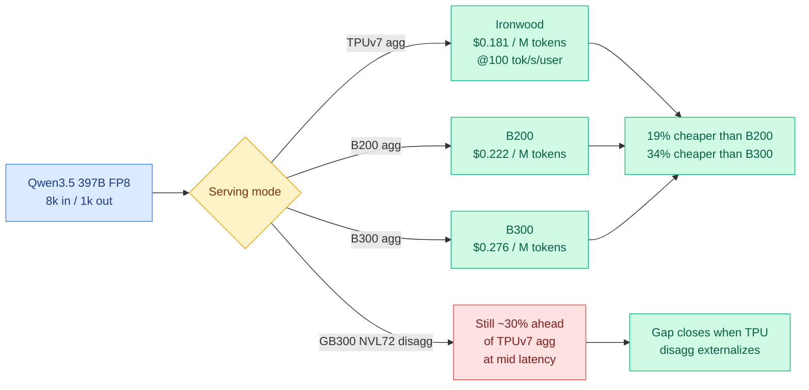

# TPU Inference Externalization: Ironwood vs Blackwell, and the Software That Decides It

**Source:** SemiAnalysis, [TPU Inference Externalization Full Steam Ahead - InferenceX](https://newsletter.semianalysis.com/p/tpu-inferencex-full-steam) · Alec Ibarra, 2026-09-07
**Raw:** `raw/rss/2026-09-07-semianalysis-tpu-inference-externalization-full-steam-ahead---infere.md`
**Date ingested:** 2026-09-08

---

## TL;DR

The first third-party inference benchmarks of Google's **TPUv7 Ironwood** are out, and Ironwood delivers **up to 50% better performance per dollar than B200 and 96% better than B300** on apples-to-apples FP8 aggregated serving. But the interesting half of the piece is not the benchmark. It is the roughly forty individual software optimizations that had to land first, and what they reveal: **the gap between TPU and GPU is now mostly a software gap, and the hardware advantage is contingent on tile geometry that model architects choose without knowing they are choosing it.** A head dimension of 64, free on an H100, caps attention matmuls at **25% MXU utilization** on Ironwood's 256x256 systolic array. Meanwhile Google is externalizing exactly the pieces this wiki has been calling the frontier: **speculative decoding, prefill-decode disaggregation, and tiered KV-cache offloading to DRAM and NVMe.**

---

## The cost picture

**The headline numbers, with their caveats attached:**

| Operating point | Ironwood | B200 | B300 |
|---|---|---|---|
| Cost / M tokens @ 100 tok/s/user | **$0.181** | $0.222 | $0.276 |
| Throughput @ 20 tok/s/user (tokens/s/chip) | **9,364** | 8,903 | 8,925 |
| Cost / M tokens @ 20s median e2e | **$0.098** | $0.106 | $0.132 |
| Mean TTFT @ concurrency 256 | 5.41s | 3.75s | **2.40s** |

At concurrency 256, Ironwood delivers **50.4% more tokens per dollar than B200 and 96.0% more than B300**, rising to **76.7% and 130.2%** on Google's internal TCO of $1.03/chip-hour. But that same datapoint carries a **5.41s TTFT against B300's 2.40s**, so the 96% figure is a high-throughput, high-latency operating point and not a general claim. SemiAnalysis says so explicitly, which is more honesty than most vendor benchmarks contain. B200 still wins a slice of the curve around 30s median response time.

**The comparison that is not yet apples-to-apples is the one that matters most.** Google has run prefill-decode disaggregation internally for Gemini for years, but the *external* stack has no optimized disagg path. So in disagg-vs-disagg, **GB200/GB300 NVL72 is currently ahead, by roughly 30% perf-per-dollar at mid latency against TPUv7 aggregated**. SemiAnalysis expects that to close within months. Also: **Ironwood has no native FP4.** On FP4 NVIDIA leads outright, and the FP8-vs-FP8 framing is chosen because FP4-vs-FP8 would be comparing across a quality difference. TPUv8i adds native FP4.

---

## Why this is a software story

Google is replacing the **TorchAX** path (write the model in PyTorch, translate ATen ops to JAX via `__torch_dispatch__`, let XLA compile) with **TorchTPU**, which uses PyTorch's `PrivateUse1` backend extension point to make TPU a native PyTorch device. You write `.to("tpu")`, the PyTorch dispatcher routes ATen ops to the TPU backend, TorchDynamo and AOTAutograd produce an FX graph, TorchTPU lowers it to StableHLO, and XLA emits the executable. Pallas kernels underneath are unchanged and still required. It goes open source around **mid-October at the PyTorch Conference**.

The point of the rewrite is ecosystem leverage rather than raw speed: vLLM and SGLang can reuse upstream model code, schedulers, continuous batching and feature logic instead of maintaining them across a PyTorch-to-JAX boundary. Inferact, RadixArk and Red Hat are all contributing. **The bet is that TPU lands on vLLM's day-0 support list, which today covers NVIDIA well and AMD passably.**

**The optimization list is the real content, and a few entries are directly useful to anyone tuning attention kernels on any accelerator:**

- **KV cache lane layout.** The TPU vector unit works on tiles 128 lanes wide, so anything narrower gets padded. The batched attention kernel packed keys and values along the head dimension, which for FP8 has a packing factor of four; a model with one KV head per device has only two things to pack, wasting half of every tile. Putting the page's *tokens* on the 128-lane axis and the head dimension on the sublane axis **doubled usable KV pages from 5,141 to 10,283**, lifted throughput **16.5%** at concurrency 128, and **cut median TTFT by 95%** because requests stopped queueing for KV space. It costs ~3% per-token latency at low concurrency. It also drops the head-dim requirement from a multiple of 128 to a multiple of 32.
- **Prefetch depth, found by accident.** The ragged-paged-attention v3 heuristic set the KV compute block equal to the KV fetch block at ~16k tokens, leaving almost no VMEM for the double-buffered prefetch. Splitting them (fetch 16k, compute 4k) raised decode throughput from **64.9k to 96.3k tokens/s, a 49% gain**, reproduced across four runs. The tuned-parameter table physically could not express the fix because it stored one block size per shape, so it shipped first as an environment variable.
- **Recurrent state allocation.** Qwen3.5 is hybrid: GQA layers grow a KV history, Gated DeltaNet layers hold a fixed-size recurrent state. Allocating roughly one state slot per active request instead of `num_blocks` slots per layer group **reclaimed about 76 GiB of HBM and expanded the attention block pool 71%**, for **18%** better output throughput. Storing that state in **BF16 while keeping arithmetic in FP32 inside VMEM** halved its footprint for a further **15%**.
- **Hybrid prefix caching, which is genuinely hard.** For prefix caching to work on a hybrid model, a cached prefix must retain both its KV blocks *and* the recurrent state at the prefix boundary, and that state is normally overwritten the instant the request continues. The fix gives GDN separate slots for reading a checkpoint and writing live state, derives state addresses from the same block table that locates KV blocks, and takes checkpoints at an aligned cache granularity so a saved state always lands on a KV block boundary. It requires a full checkpoint pool rather than the compact per-request allocation above, trading HBM for reuse.
- **Collectives moved to SparseCore.** Combining two all-gathers into one saved ~80 µs per layer, which across DeepSeek-V3's 58 such layers is **~4.64ms per forward pass**. Running ReduceScatter on SparseCore with double buffering gave **4.1-14.2%** higher throughput. But offloading is not always right: below a VMEM-derived threshold, small collectives are faster left on TensorCore.

---

## The part that should change how you pick hyperparameters

Every TPU generation through v5 used a 128x128 MXU (16,384 MACs/cycle). From v6e through Ironwood it is **256x256, 65,536 MACs/cycle, 4x the FLOPs**. The catch is that XLA pads any dimension smaller than the array's side length, and **every padded cell still burns a MAC multiplying by zero.**

The arithmetic is brutal and concrete:

- Llama 3 8B's attention head dimension of **128** is exactly half of 256, capping its two attention matmuls at **50% MXU utilization**.
- **gpt-oss ships a head dim of 64**, which caps them at **25%**, before anyone writes a line of kernel code.
- DeepSeek's MLA splits query/key into 128 + 64 = **192**, awkward against any power-of-two array and worse against a wide one.

On a GPU, matrix cores consume small tiles, so head dim 64 costs close to nothing on an H100 or B200 and buys a cheaper attention layer. SemiAnalysis's framing is that **GPU architecture let researchers optimize head dimensions for eval performance without paying an inference penalty, and TPUs turn that free choice into a tradeoff.** The consequence they draw is a hardware-adoption one: bring-up cost varies enormously across models and **correlates poorly with model popularity**, so sequencing externalization toward models whose shapes fall out cleanly is rational, and a model that fights the tile geometry needs new kernels before it reaches parity.

---

## Networking, and the KV cache moving on-chip

Ironwood keeps the **3D torus** (each chip wired to six neighbors, 4x4x4 = 64-chip cube per rack), with wraparound links that halve worst-case hop distance and a "twisted torus" Mobius-style wraparound that cuts average hops further. Optical Circuit Switches stitch cubes into a **9,216-chip superpod at 42.5 FP8 exaflops**, and let Google rewire around a dead link in seconds using mirrors instead of dispatching a technician. Ironwood itself breaks the MegaCore convention: **two independent compute dies per chip** joined by a die-to-die link rather than unified memory, exposed as two devices, with 2 TensorCores and 4 third-gen SparseCores, **~6x Trillium's HBM capacity**, and the first native FP8 hardware in the TPU line.

**TPUv8 splits training and inference into separate chips for the first time.** TPU 8t keeps the torus. **TPU 8i replaces it with "Boardfly,"** a flatter dragonfly-style high-radix fabric that **cuts network diameter by more than half, roughly 16 hops to about 7** at 1,024-1,152 chips. It carries **19.2 Tb/s of ICI bandwidth (double)** and **384 MB of on-chip SRAM (3x)**, sized, in SemiAnalysis's words, **specifically to hold the KV cache of reasoning and agentic models on-chip rather than round-tripping to HBM.**

That last sentence is the most important hardware claim in the piece for this wiki. **A vendor has now designed an SRAM budget around the KV cache as the primary resident object.**

---

## The roadmap is this wiki's open-problem list

Google's stated next steps read like the [KV cache page](../inference-efficiency/kv-cache.md)'s backlog:

- **Speculative decoding / MTP.** SemiAnalysis gives the clean explanation of why it works: decode is bandwidth bound, so you stream the entire model's weights out of HBM to emit one token, and that read costs nearly the same whether you verify one token or five. Speculation spends idle compute to amortize one expensive weight read across several tokens, losslessly.
- **Prefill-decode disaggregation**, via TPU support in `llm-d` and the open-sourcing of **TPU-Sync** (formerly TPU-raiden), Google's disaggregated KV-cache transfer library, which does zero-copy transfers by extracting native PJRTBuffer hardware descriptors.
- **Tiered KV-cache offloading.** TPU-Sync supports native DRAM offload, plus the industry-standard **Mooncake Store** including its DRAM P2P pooling, which aggregates every TPU host's KV storage into one logical pool so any TPU can read any other server's KV cache, and pools NVMe across servers on top of that.
- **AgentX**, an agentic-workload benchmark, because customers are asking. SemiAnalysis characterizes agentic serving by four properties: tens-to-hundreds of turns, long context from system prompts and tool definitions, **high prefix reuse tending toward a cached-input ratio of 1 as turn count grows**, and bursty sub-agent spawns with fresh contexts.

---

## How this relates to prior wiki pages

**It prices the memory wall that this wiki's inference-physics thread established.** The [09-02 roofline chapter](2026-09-02-physics-of-llm-inference-roofline.md) recorded Ken Huang's figure that on a 70B model **99.66% of every decode step is spent moving bytes**, which made "the only savings that count are the ones that move fewer bytes or skip the trip entirely" the organizing claim of the [memory hierarchy page](memory-hierarchy.md). Ironwood's advantage is exactly a bytes-per-dollar advantage rather than a FLOPs one: it loses on most of the raw-performance curve and wins on TCO. **TPU 8i's 384 MB of SRAM sized for the KV cache is the same claim expressed as silicon.**

**It is the industry half of today's KVMem result, and the convergence is same-day and uncoordinated.** [KVMem (09-08)](../inference-efficiency/2026-09-08-kvmem-kv-context-virtualization.md) pages an agent's overflowed KV state across GPU, host RAM and NVMe to virtualize a 1M-token workspace on a 24GB laptop GPU, beating summarize-and-discard compaction 43.8% → 48.4% on DeepSWE. Google is shipping the infrastructure layer for precisely that idea, on TPUs, through TPU-Sync and Mooncake pooling, on the same day, for datacenter scale. **Research and industry independently concluded that KV state belongs on a storage tier rather than being summarized away.** Neither references the other. That is as clean a research-industry alignment as this wiki has recorded.

**It contradicts, or at least complicates, the "harness-bound" verdict from 09-05.** That digest recorded Epoch AI ranking GPT-6 Astra first at 169 points while Artificial Analysis rated it no better than its predecessor, same model, two harnesses, opposite verdicts, and treated harness sensitivity as a measurement crisis. SemiAnalysis's forty optimizations are the same phenomenon at the kernel layer, but here it is **not** a crisis, because they publish the operating point, the concurrency, the sequence shape, and which side had disagg enabled. **The lesson is not that harness variance invalidates benchmarks. It is that harness variance invalidates benchmarks that hide their harness.** That is the discipline [Iris (09-07)](../agentic-systems/2026-09-07-iris-search-agents.md) brought to search agents by publishing both context-management columns.

**It gives the Anthropic compute story a unit-economics reason.** The Decoder reported the same day that Anthropic has signed [up to $517B in compute contracts in eleven months](https://the-decoder.com/anthropic-reportedly-signs-517-billion-in-compute-deals-after-dario-amodei-warned-rivals-about-reckless-risk/), against OpenAI's ~$750B plan through 2030. SemiAnalysis notes Anthropic is the **biggest TPU user, projected to surpass DeepMind's own usage by 2029**, with over a million TPUs committed (~400k purchased, ~600k rented through GCP). The [compute economics page](compute-economics.md) recorded on 09-04 that Anthropic's IPO investors are asking for **revenue per gigawatt of compute and margin per processed token**. A 19-34% cost-per-token advantage on the majority of your fleet is how you answer that question, and it is a strategic reason to be on TPUs that has nothing to do with GPU supply.

---

## Gaps

- **Single bring-up model.** Nearly every number is Qwen3.5-397B FP8. A few are DeepSeek-V3 microbenchmarks and one paged-attention result is Qwen3-32B, which SemiAnalysis correctly flags should not be mixed with the 397B results. Kimi K3, GLM5.3 and Gemma4 are future work.
- **8k/1k and 1k/8k only.** Agentic shapes, the workload where the prefix-reuse ratio tends to 1 and where this would matter most, are explicitly not benchmarked yet.
- **Disagg-vs-disagg is missing**, and it is the comparison a buyer would actually make. The current external TPU stack has no optimized disagg path, so the published comparison flatters TPU on some points and NVIDIA on others.
- **SemiAnalysis is not a neutral party to the stack.** They benchmark from their own fork, thank the Google team by name, and sell the TCO model the cost figures depend on. The engineering detail is checkable and the honesty about latency tradeoffs is real, but the TCO inputs are proprietary.
- **The GDN v3 kernel speedups (1.41x decode, 1.60x prefill, 2.14x mixed) are kernel-level only**, and the piece says so: they do not establish end-to-end serving gains.

---

## Related pages

- [Memory Hierarchy](memory-hierarchy.md)
- [Compute Economics](compute-economics.md)
- [GPU Kernels](gpu-kernels.md)
- [KV Cache](../inference-efficiency/kv-cache.md)
- [KVMem (09-08)](../inference-efficiency/2026-09-08-kvmem-kv-context-virtualization.md)
- [Daily digest 2026-09-08](../daily-digest/2026-09/2026-09-08.md)
