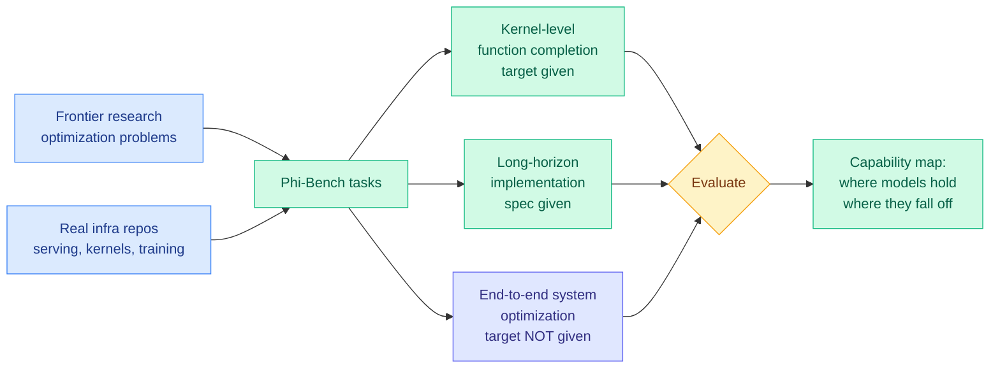

# Φ-Bench: can LLMs engineer the infrastructure that powers them?

**Source:** HuggingFace Daily Papers · [Paper](https://arxiv.org/abs/2609.10226) · [raw](../../raw/huggingface/2026-09-10-bench-can-large-language-models-engineer-the-infrastructure.md)

## TL;DR

Every existing benchmark for LLMs writing systems code hands the model a well-posed problem: here is a kernel, here is the target, optimize it. Φ-Bench asks the question one level up. It is a benchmark for **open-ended, long-horizon LLM infrastructure engineering**, derived from optimization problems studied in frontier research and grounded in real repositories, spanning the whole stack from localized kernel-level function completion up to end-to-end system optimization where nobody tells the model what to optimize. The result is a capability map of where frontier models actually are on the path to autonomous optimization of AI infrastructure, and the headline is that the gap is not in writing a kernel, it is in **deciding which kernel is worth writing.**

## What it measures

## Key findings

- **The benchmark's design claim is that prior work tested the wrong thing.** Existing evaluations use isolated kernels, predefined operators, or pre-specified optimization targets. All three remove the part of infrastructure engineering that is actually hard, which is open-ended target selection over a long horizon inside a real repository.
- **Coverage spans the stack, not a layer.** Tasks range from localized kernel-level completion through long-horizon implementation to end-to-end system optimization, so the benchmark reports *where along that gradient* a model stops being useful rather than a single pass rate.
- **Frontier models are evaluated and the paper frames the outcome as limitations on the path to autonomous optimization**, which is the honest reading: this is a benchmark paper establishing a gap, not a capability announcement.

## How this relates to prior wiki pages

**It is the measurement instrument that the recursive-self-improvement thread has been missing.** [NeoHorse-1 (09-09)](../ai-routing/2026-09-09-neohorse-1-routing-harness-rsi.md) pursued recursive self-improvement through agentic post-training with a routing harness, turning a router's own telemetry into a training curriculum. [SAEScientist-Bench (09-10)](../responsible-ai/2026-09-10-saescientist-bench-autonomous-interpretability.md), arriving the same day, argues that RSI research has automated the *training* pipeline while leaving post-hoc auditing unbuilt. Φ-Bench names a third missing pillar: **before a system can improve itself, it has to be able to improve its own substrate**, and nobody had measured that as a long-horizon open-ended task.

**It closes a loop this wiki has been narrating from the other end all year.** [gpu-kernels.md](gpu-kernels.md) has accumulated result after result where a human found a mechanical win (fusion, better tiling, a smarter eviction rule) that a model could plausibly have found by search. Φ-Bench is the first entry that asks whether the models can run that search themselves at repository scale, and pairs naturally with [Φ-Bench's sibling question in Meta's A-MLE](https://arxiv.org/abs/2609.08248), where an autonomous agent runs the ML iteration cycle across production ad-ranking models. **One benchmarks agents optimizing the infrastructure, the other reports agents optimizing the models running on it, and they appeared on the same day.**

**It gives the harness thread a hard test case.** [Co-Evolving Harnesses (09-10)](../agentic-systems/2026-09-10-co-evolving-harnesses-on-policy-correction.md) shows harness evolution lifts weak models on enterprise tasks with well-specified success criteria. Infrastructure optimization has no such criterion: "make the system faster" admits a thousand answers of wildly different value. Whether harness evolution transfers to targetless tasks is the obvious next experiment and neither paper runs it.

## Gaps

The abstract reports that experiments "reveal current capabilities and limitations" without surfacing the headline numbers, so the size of the gap is not yet quotable from the paper's front matter. Deriving tasks from frontier research optimization problems risks contamination, since the solutions to many of those problems are in the training data of every model tested, and the paper does not describe a decontamination protocol in the abstract. And for the end-to-end optimization tier the scoring function is the whole ballgame: if it rewards a measured speedup on a fixed workload, models will find workload-specific hacks, which is the same reward-hacking failure that [SWE-Bench Pro Verified (09-10)](../agentic-systems/2026-09-10-swe-bench-pro-verified.md) documented on coding agents this morning.

## Industrial implication

If a model can reliably do the kernel tier but not the end-to-end tier, the near-term deployment is exactly the shape that inference-optimization teams already use: humans pick the target, agents grind the implementation. That is cheap and safe and it is probably already happening inside every large serving org. **The tier worth watching is the targetless one**, because a model that can look at a serving stack and decide on its own that the win this quarter is cross-layer KV reuse rather than a better sampler is a model that compresses a whole class of senior engineering judgment. On a six-month horizon the concrete signal is whether any lab reports a production kernel or serving change that an agent both proposed and implemented, with the proposal step unprompted.

## Related

- [gpu-kernels](gpu-kernels.md) — the substrate being optimized
- [agent-benchmarks](../agentic-systems/agent-benchmarks.md) — benchmark reliability and reward hacking
- [NeoHorse-1 (09-09)](../ai-routing/2026-09-09-neohorse-1-routing-harness-rsi.md) — RSI via routing telemetry
- [compute-economics](compute-economics.md) — what an infra speedup is worth
