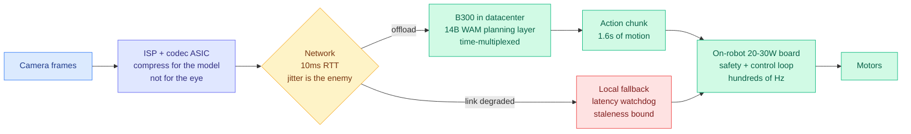

# Where Does a Robot Think: on-device versus datacenter inference

**Source:** SemiAnalysis, 2026-09-09 (arrived in starred Gmail and RSS on 09-10) · [Post](https://newsletter.semianalysis.com/p/where-does-a-robot-think-on-device) · [raw](../../raw/rss/2026-09-09-semianalysis-where-does-a-robot-think-on-device-vs-datacenter-infere.md)

## TL;DR

SemiAnalysis ran NVIDIA's DreamZero, a 14B world-action model and the current RoboArena leader, on a real B300 with the full optimization stack (CUDA graphs, DiT caching, NVFP4 quantization, on-GPU scheduling) and answered a question the robotics industry has been arguing without numbers: **should a robot's brain sit on the robot or in a datacenter?** The answer is a hybrid, and the crossover points are specific. One B300 time-multiplexes **7 robots** before p99 latency (1.16 s) breaches the 1.6 s motion budget. Below 7 robots per GPU, putting a chip in every machine uses less leading-edge silicon; above it, shared datacenter serving does. On DRAM the crossover is **5 robots per GPU**. The deeper point for this wiki is that robotics inverts the LLM design order: **with LLMs the hardware bends to the model, and in robotics the hardware is fixed and the model is designed to fit it**, so intelligence becomes something you ration against latency and unit economics.

## The architecture of the argument

## Key findings

**The embodiment problem is a design-order inversion.** For hyperscalers there is no hard latency requirement and a very high spending ceiling, so you train the biggest model you can and then figure out how to serve it. Robotics flips it: the manufacturer pays for compute on **every unit, upfront**, and a control loop that misses a deadline acts on a world that has already changed. So on-robot hardware is fixed first and model capability is capped by what runs on it in real time. This is why frontier robot models sit at 5 to 14B parameters (Physical Intelligence's π0.7 at 5B, NVIDIA's DreamZero at 14B) while frontier LLMs are into the trillions.

**Hierarchical models make offloading possible at all.** A hierarchical robot brain splits into a slow planning layer (perceives, reasons about space, plans, updates a few times a second, runs asynchronously) and a fast action layer (motor commands, hundreds of Hz). The planning layer can absorb a wireless round trip and its jitter because the action layer keeps executing the last plan while the next is in flight. **Planning goes to the datacenter, the control loop stays local.** Monolithic pixel-to-motor models cannot be split this way.

**Robot inference has the opposite roofline shape from LLM inference, and the shape decides the batching policy.** An LLM ingests a bursty prompt, emits a long generation, and grows a KV cache the whole time, which makes serving bandwidth-bound. A robot model is a metronome: a fresh frame compressed by dedicated ISP and codec hardware into tens to a few hundred tokens, a short action chunk out, forever. The consequence is a concrete serving rule the post states outright: **a video-generating world-action model like DreamZero is prefill-shaped and compute-bound at batch size 1, so batching buys nothing and you time-multiplex robots one at a time; a VLA like π0 or GR00T pushes a few hundred tokens through a small backbone and is memory-bandwidth-bound, so continuous batching amortizes weight reads and throughput scales nearly linearly.** Two robot fleets, two opposite serving stacks, decided by which side of the roofline the model lands on.

**Edge silicon is a generation behind and structurally will stay there.** Jetson Thor, the best-in-class robot brain, has roughly a tenth of a single B200's compute and a fourteenth of a B300's. DreamZero needed **two GB200s just to hit ~7 Hz**, about twenty times what a Thor can muster; on a Thor it would fall below 1 Hz. Power seals the argument: a Blackwell draws 1.2 to 1.4 kW and needs liquid cooling, while a humanoid stores about 2 kWh total and draws a few hundred watts moving, which is why its brain is a 40 to 130 W Thor. Offload and the robot only carries a 20 to 30 W perception-plus-radio board.

**The supply-chain argument is the part that generalizes beyond robotics.** Jetson is a sliver of NVIDIA's accelerator mix, earns mid-60s gross margin against mid-to-high-70s for datacenter Blackwell, and has lost its process insulation: Orin ran on Samsung SF8, Thor has closed onto TSMC N4 (the node Blackwell uses), and successors likely move to N3 alongside Rubin and N2 alongside Feynman. **Low-volume, lower-margin edge silicon now queues for the same leading-edge wafers as the entire AI accelerator roadmap, from the back.** Wafer volume itself is not the strain (a million 400mm² Jetsons in 2030 is about ten thousand wafers, a rounding error), so the real question is silicon efficiency per robot, which is what produces the 7-robots-per-GPU crossover.

**Memory is the tighter constraint and it collides with HBM.** Jetson DRAM has climbed every generation: Xavier 32 GB, AGX Orin 64 GB, Thor **128 GB of LPDDR5X**. Total DRAM wafer capacity grows, but most incremental capacity is absorbed by HBM for AI accelerators, leaving **commodity and LPDDR competing for a shrinking pool of non-HBM wafers**. On DRAM per robot, shared serving wins past 5 robots per GPU.

**The engineering bill for offloading is an imaging and radio problem, not a model problem.** Noise is the enemy of compression, so the upstream pipeline matters more than the codec: optics, low-light sensor performance, sensor SNR, thermals, and an ISP tuned for compression rather than for human viewing ("we care about good model outputs and a low bitrate, not necessarily beautiful images"). Add WebRTC-style real-time adaptation of ISP and bitrate, multiple transmit antennas (robotics needs uplink capacity where mobile chipsets historically optimized downlink), wide RF band support, and fast WiFi-to-5G handovers, because a typical handover temporarily eats the whole latency budget. **Jitter is the biggest enemy.** And you still need local fallbacks: latency watchdogs, heartbeat timeouts, staleness bounds on remote actions.

## How this relates to prior wiki pages

**It confirms [memory-hierarchy.md](memory-hierarchy.md)'s founding thesis from a completely different workload.** That page's organizing claim, derived from the roofline result that 99.66% of a 70B decode step is spent moving bytes, is that the binding constraint moved from FLOPs to memory. This post reports the **opposite** binding constraint for video-generating world models, which are FLOP-bound at batch 1, and that is not a contradiction but a refinement: **the memory wall is a property of the autoregressive decode shape, not of neural inference in general.** A workload that pushes thousands of video latents through a DiT in parallel is prefill-shaped forever, never enters the decode regime, and therefore never touches the wall. The page should record that the wall has a domain of validity.

**It stands in direct, unpriced tension with [DeepSeek V4.1 Flash (09-10)](../llms-foundation-models/2026-09-10-deepseek-v41-flash-architecture.md), which shipped the same day.** V4.1 Flash answers HBM scarcity by moving nearly half its parameters (a 196B Engram module) onto host LPDDR. This post says most incremental DRAM capacity is going to HBM and that LPDDR is already competing for a shrinking non-HBM pool, and concludes "the LPDDR is better off being allocated to Vera GPUs or wafers to HBM." **Two of the strongest efficiency moves recorded this week both route demand into LPDDR, and nobody has priced the collision.** If Engram-style architectures spread across labs at the same time robot fleets scale, the relief valve for HBM scarcity becomes the next scarcity.

**It gives [compute-economics.md](compute-economics.md) a crossover number instead of an argument.** The page has tracked the on-device-versus-cloud question as a qualitative bet, with Figure running Helix fully onboard, Physical Intelligence running π0.7 off-robot on a single H100, and NVIDIA's DreamZero needing two GB200s. This is the first entry with a measured p99 under a stated latency budget: **7 robots per B300 at 1.16 s p99 against a 1.6 s wall, zero missed chunks.** That converts the debate into a fleet-density threshold.

**It reframes what "routing" means at the fleet level for [llm-routing.md](../ai-routing/llm-routing.md).** Every routing mechanism on that page routes a request to a model. This routes **cognition to a location** under a hard deadline, with a degraded local fallback when the link drops. The control structure (watchdog, staleness bound, fallback policy) is the same shape as a router's confidence gate, and it is the first instance in this wiki where the fallback is triggered by network state rather than by model confidence.

## Gaps

The DreamZero run used a single denoising step to match the DreamZero-Flash setup **without Flash's retraining recipe, so task quality is explicitly unvalidated** — the 7-robot figure is a latency result, not a quality-at-latency result. The 10 ms RTT assumption puts the GPU on-prem next to the robots, which quietly excludes the actual cloud case and every deployment with poor connectivity. The TCO build-up excludes shared mechanical BOM, which is the right call for a marginal comparison but means the headline "one B300 server versus 56 Thors" is not a total-cost-of-a-robot number. And the crossovers are derived for one WAM on one node; a VLA fleet under continuous batching would produce a different and probably much higher robots-per-GPU figure, which the post notes but does not compute.

## Industrial implication

If the 7-robots-per-GPU crossover holds, robotics fleet architecture is decided by **density, not by philosophy**: pilot deployments with a handful of machines should put the brain on the robot, and any fleet past single digits per site should run planning from an on-prem GPU. That makes the robot company's hardest engineering problem its network and imaging stack rather than its model, which is a very different hiring plan from the one most humanoid startups are executing. For the semiconductor side the read is blunter: NVIDIA has margin and wafer-queue reasons not to ramp edge silicon, so **the edge will stay a generation behind on purpose**, and the offload architecture is not a temporary workaround until Jetson catches up. It is the equilibrium.

## Related

- [memory-hierarchy](memory-hierarchy.md) — the memory wall and its domain of validity
- [compute-economics](compute-economics.md) — serving cost per unit of intelligence
- [gpu-kernels](gpu-kernels.md) — CUDA graphs, DiT caching, NVFP4 as the optimization stack used here
- [DeepSeek V4.1 Flash (09-10)](../llms-foundation-models/2026-09-10-deepseek-v41-flash-architecture.md) — the competing claim on LPDDR
