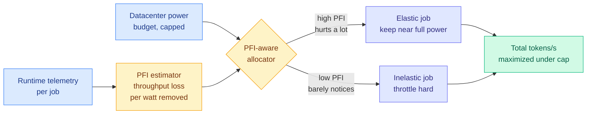

# Characterizing Job Power Elasticity for Power-Flexible AI Training

**Source:** arXiv [2609.11542](http://arxiv.org/abs/2609.11542) · Kurate cs.AI #9 (ai_rating 6.5/10), absent from HuggingFace
**Authors:** Philip Colangelo, Charles Dawson, Shayan Sengupta, Ayse Coskun, Varun Sivaram
**Raw:** [Kurate cs.AI leaderboard](../../raw/kurate/2026-09-12-cs-ai.md)

## TL;DR

If you cap a GPU's power draw, training gets slower. The question nobody had measured is *how much* slower, and whether the answer differs between jobs. It does, substantially. This paper runs 131 LLM training jobs on H200 hardware (plus 24 H200 validation runs and 34 matched H100 runs), defines a normalized metric called the **Power Flexibility Index (PFI)** for how much throughput a job loses per unit of power removed, and shows PFI is predictable at runtime from telemetry. Under a 30% power cut, allocating power by PFI instead of equally recovers about **1.5k tokens/s per job**, which is **63% of the gap** between naive equal-weight allocation and an oracle with perfect foresight.

## What is actually new here

Three things, in increasing order of how much they matter.

**A measurement.** Power elasticity of LLM training was assumed, not characterized. The sweep covers dense and mixture-of-experts models (where each token routes through a small subset of specialized sub-networks, so the arithmetic-to-memory ratio differs sharply from a dense model), pretraining and fine-tuning, up to 32 GPUs. The headline is variance: elasticity is **substantial but variable**, meaning a uniform power cap across a fleet is leaving throughput on the floor for no reason.

**A metric with a control interface.** PFI is deliberately built as a *control primitive*, normalized so it can carry an SLA. That is the difference between a characterization paper and an operations paper. A scheduler can read PFI and act on it.

**A predictor.** The metric is worthless operationally if you have to run a power sweep per job to get it. The paper identifies telemetry signals that predict PFI at runtime, which is what turns the whole thing into a live allocator rather than a profiling exercise.

The 63% number is the honest framing and deserves attention: this is not "PFI-aware allocation is optimal," it is "PFI-aware allocation captures most of what an oracle would get, using only signals you already have."

## How this relates to the rest of the wiki

**It is the measurement instrument for a thesis the [compute economics page](compute-economics.md) has held since 08-26 without one.** That entry recorded OpenAI's Jalapeño inference ASIC ([08-26](2026-08-26-openai-jalapeno-inference-asic.md)) stating that OpenAI is limited by **datacenter power, not budget and not floorspace**, so its objective function is tokens per second per megawatt, which reduces to **tokens per joule**, a physical efficiency rather than a price. Everything on that page since has been about the consequences of power being the binding constraint. This paper asks the next question: **given that power is scarce, how should you divide it**, and it answers with a number. Jalapeño optimizes tokens per joule by building different silicon. PFI optimizes tokens per joule by scheduling the silicon you already have. The second is available this quarter.

**It is the training-side counterpart to [Intelligence per Watt (09-11)](../ai-routing/2026-09-11-intelligence-per-watt-local-cloud-routing.md), which measured inference.** That paper priced routing decisions between local and cloud execution in joules rather than dollars. This one prices *training* throughput in watts. **Two papers in two days denominating AI work in energy rather than currency is the direction this wiki should now expect**, and the reason is structural: dollars are a lagging, negotiable, contract-dependent proxy, while joules are the thing actually running out.

**The grid framing is not decoration and it connects to [behind-the-meter power (09-10)](2026-09-10-behind-the-meter-power-datacenters.md).** Power-flexible training is what makes a datacenter a *dispatchable* grid participant rather than a fixed load. A facility that can shed 30% of draw at a known, bounded throughput cost is a facility that can sign a demand-response contract, which changes its interconnection queue position and its power price. The paper says this plainly: making these workloads flexible could "unlock additional power for AI growth, limit increases in electricity prices, and improve the utilization of existing grid infrastructure." **That is an argument that the bottleneck is partly self-inflicted**, which is a genuinely different claim from the prevailing one that the grid simply needs to be bigger.

## Gaps

Up to 32 GPUs is small. The regime everyone cares about is thousands of GPUs on a single job, where the binding constraint is collective-communication synchronization, and throttling one node stalls every other node at the next all-reduce. **Power elasticity at 32 GPUs may not survive contact with a large-scale synchronous training run**, and the paper does not claim it does. Second, all elasticity numbers are H200 and H100; Blackwell's power envelope and clock behavior differ enough that the curve should be re-measured rather than extrapolated. Third, the SLA framing is asserted rather than demonstrated: there is no experiment where a job with a deadline is throttled and the deadline is still met.

## Industrial implication

The near-term customer for this is not a frontier lab, it is a neocloud or a colocation operator selling capacity against a power cap it cannot raise. Those operators already oversubscribe power and already suffer when every tenant peaks at once. A per-job elasticity index gives them a defensible basis to offer a cheaper "interruptible power" training tier, priced below firm capacity, the same way spot instances are priced below reserved. That is a product, and given how tight the market described on the [compute economics page](compute-economics.md) has become, it is a product with immediate demand. Expect the first version of it to be crude, a static high-elasticity/low-elasticity tag rather than a live PFI estimate.

**Related:** [compute economics](compute-economics.md) · [OpenAI Jalapeño, tokens per joule (08-26)](2026-08-26-openai-jalapeno-inference-asic.md) · [behind-the-meter power (09-10)](2026-09-10-behind-the-meter-power-datacenters.md) · [Intelligence per Watt (09-11)](../ai-routing/2026-09-11-intelligence-per-watt-local-cloud-routing.md)
