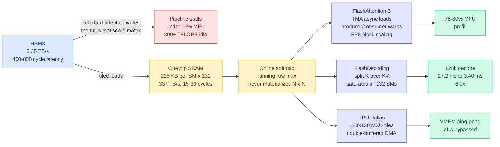

# Hardware-Aware Attention Kernels: FlashAttention-3, FlashDecoding, TPU Pallas (Ken Huang Chapter 5, 2026-09-12)

**Source:** [Chapter 5: Hardware-Aware Attention Kernels](https://kenhuangus.substack.com/p/chapter-5-hardware-aware-attention), Ken Huang / DistributedApps.ai, 2026-09-12. Chapter 5 of the 10-part series *The Physics & Engineering of Frontier LLM Inference*. Raw: [`raw/gmail/2026-09-13-starred.md`](../../raw/gmail/2026-09-13-starred.md), [`raw/rss/2026-09-12-agentic-ai-chapter-5-hardware-aware-attention-kernels-flashattenti.md`](../../raw/rss/2026-09-12-agentic-ai-chapter-5-hardware-aware-attention-kernels-flashattenti.md).

**TL;DR.** Textbook scaled dot-product attention on an H100 over a 16,000-token sequence achieves under 15% Model FLOPs Utilization, wasting more than 800 TFLOPS per GPU. The cause is not arithmetic, it is that the intermediate N x N score matrix gets written to high-bandwidth memory at 3.35 TB/s when the on-chip SRAM next to the tensor cores runs at over 33 TB/s. Chapter 5 is the production manual for the four techniques that close that gap: online softmax tiling, FlashAttention-3's Hopper-specific producer-consumer warp specialization, FlashDecoding's split-K fix for the decode occupancy collapse, and imperative TPU Pallas kernels that bypass the XLA graph compiler. The single most decision-relevant number in it: **FlashDecoding cuts 128k-context decode latency from 27.2 ms to 3.40 ms, an 8.0x speedup**, by fixing an occupancy problem rather than by doing less math.

---

---

## The arithmetic-intensity argument, stated properly

This is the part worth internalizing, because every other result on this page is downstream of it.

An H100 SXM5 delivers 989.5 TFLOPS of dense FP16/BF16 and nearly 2,000 TFLOPS of FP8 tensor-core throughput. A B200 raises that to 2.25 PFLOPS FP16 and 4.5 PFLOPS FP8. Against that, HBM3 moves 3.35 TB/s with 400 to 800 cycles of latency, while SRAM distributed as 228 KB of shared memory and L1 per SM across 132 SMs aggregates above 33 TB/s at 15 to 30 cycles. **The hardware saturation roofline is 295.4 FLOPs per byte.** The elementwise operators inside attention (softmax scaling, masking, exponentiation, normalization) have arithmetic intensity strictly below 1.0 FLOP/byte. So when standard attention materializes the N x N score matrix in HBM, it forces O(N²) bytes over the narrow bus at an intensity two and a half orders of magnitude below the roofline, and the tensor cores starve.

Everything called a "kernel optimization" in this chapter is the same move: **keep the intermediate inside SRAM and overlap the unavoidable movement with arithmetic.**

## The four techniques

**1. Online softmax tiling (Milakov-Gimelshein).** Computes exact running row maxima and normalizers in a single pass entirely in on-chip SRAM and registers, eliminating the O(N²) HBM materialization. IO complexity compresses from O(N²) to O(N²d²M⁻¹ + Nd), where M is SRAM size. This is the mathematical precondition for everything below, and it is exact, not an approximation.

**2. FlashAttention-3 on Hopper.** Exploits the Tensor Memory Accelerator for zero-register global-to-shared transfers (`cp.async.bulk.tensor`), then **decouples producer warps from consumer warpgroups** so that memory movement and matrix arithmetic run as separate concurrent pipelines rather than alternating. Combined with asynchronous WGMMA instructions and FP8 E4M3 dynamic tile scaling, this reaches **75-80% MFU** on prefill.

**3. FlashDecoding and FlashDecoding++.** The decode-time problem is different in kind. At decode, query length collapses to 1, so the natural parallelization over queries disappears and most of the GPU's 132 SMs sit idle. Split-K partitions the KV cache across sequence splits so every SM gets work, with partial log-sum-exp workspaces reduced through a hierarchical tree. That is where the **8.0x** comes from: 27.2 ms to 3.40 ms at 128k context. **No approximation is involved.** The same FLOPs are performed, spread across hardware that was previously idle.

**4. TPU Pallas kernels (v5p, Trillium v6e).** Bypasses XLA's high-level graph compiler with imperative JAX kernels that control the 128x128 systolic MXU tiles and vector units directly via double-buffered DMA `BlockSpec`s and ping-pong VMEM scratchpads. The chapter ships a production JAX/Pallas listing alongside C++/CUDA/PTX for FA3 and OpenAI Triton for FlashDecoding.

**Stated frontier for 2026+:** microscaling formats (MXFP4, NVFP4), state-space hybrid kernel fusion (Mamba-2 / SSD plus attention), and hardware-assisted sparse verification engines.

---

## How this relates to prior wiki pages

**It is the mechanism layer under a claim the [compute economics page](compute-economics.md) has been making from the demand side.** That page has repeatedly recorded that decode is bandwidth-bound rather than compute-bound, most recently through [kimi-k3-in-c (09-12)](../inference-efficiency/2026-09-12-kimi-k3-in-c-nvme-expert-streaming.md), which ran a 2.78-trillion-parameter mixture-of-experts model on one CPU in 8.24 GB by streaming 93% of the weights off NVMe, and through Daniel Lemire's argument the same day that inference resembles streaming a video more than running a simulation. **Chapter 5 supplies the number that makes the argument non-rhetorical: 15% MFU on naive attention, and the gap between 3.35 TB/s and 33 TB/s that causes it.** The distance between those two bandwidths is the whole business case for every technique on this page.

**FlashDecoding's 8x is an occupancy result, and that distinguishes it from almost everything on the [quantization page](../inference-efficiency/quantization.md).** Every non-uniformity axis that page records (phase, layer, tile, token, block order, execution state, normalization position, and as of 09-12 depth) buys speed by *doing less work* at some acceptable quality cost. Split-K buys 8x by doing **exactly the same work on hardware that was idle**, at zero quality cost. When these compose, they compose multiplicatively and without a shared quality budget, which is a materially better composition story than the "are the axes additive or redundant" open problem that page flags. Nobody publishes the joint measurement.

**The Pallas half continues the TPU thread this page opened in August.** [JAXBench (08-03)](2026-08-03-jaxbench-tpu-kernel-optimization.md) and [MaxKernel (09-07)](2026-09-07-maxkernel-agentic-tpu-kernels.md) both found that agentic kernel generation on TPUs is bottlenecked by the compiler abstraction rather than by the model's coding ability. Chapter 5 describes what the humans do instead: drop below XLA entirely, manage VMEM by hand. **That is the search space those agents need access to and mostly do not have**, and it is the sharpest available statement of why TPU kernel agents underperform GPU kernel agents in this wiki's records.

**It also constrains the 08-28 "AI designs the silicon" thread.** This page records OpenAI claiming Codex wrote working MLA kernels unaided for Jalapeño. Chapter 5 is the standard those kernels have to be judged against: warp specialization, TMA descriptors, FP8 block scaling. "Codex wrote a working kernel" and "Codex wrote a kernel at 78% MFU" are different claims, and no published artifact distinguishes them.

## Gaps

The full empirical matrix (throughput, MFU, latency across H100, H200, B200, TPU v5p and Trillium from 4k to 1M context) sits behind the paywall, so the numbers quoted here are the free preview's headline figures and cannot be independently checked against the decision matrix they come from. The chapter is a **synthesis of published frontier work** rather than new measurement, and it does not state which figures are its own benchmarks and which are reproduced from the original FlashAttention-3 and FlashDecoding papers. That distinction matters for the 8.0x in particular.

## Industrial implication

Nothing in this chapter is speculative and none of it is new research. That is the point: the gap between 15% MFU and 78% MFU is available today to any team willing to stop calling `torch.nn.functional.scaled_dot_product_attention` and start caring which kernel it dispatches to. The commercial consequence is that **serving-cost differences between providers are increasingly kernel-quality differences rather than hardware differences**, since everyone buys the same H100s and B200s. Over the next two quarters, the teams that cannot hire warp-specialization expertise will buy it through vLLM, SGLang and TensorRT-LLM defaults, which makes those projects' kernel dispatch tables a quietly enormous amount of leverage over the industry's aggregate inference bill.

## Related pages

- [GPU kernels](gpu-kernels.md)
- [Memory hierarchy](memory-hierarchy.md)
- [Compute economics](compute-economics.md)
- [Quantization](../inference-efficiency/quantization.md), which carries Chapter 4 of the same series
- [Prefix-stable KV caching (09-13)](../inference-efficiency/2026-09-13-prefix-stable-kv-caching-claude-md.md), the same author on not paying this cost at all
