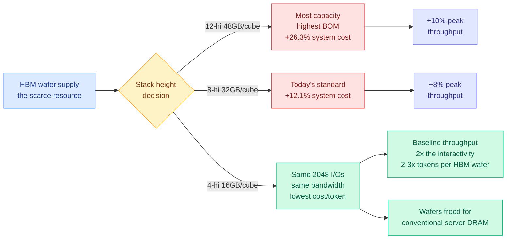

# Long Live the Short King: Why 4-hi HBM Wins (SemiAnalysis)

**Source:** SemiAnalysis, 2026-09-13. [Post](https://newsletter.semianalysis.com/p/long-live-the-short-king-why-4-hi) · Raw: [RSS](../../raw/rss/2026-09-13-semianalysis-long-live-the-short-king-why-4-hi-hbm-wins.md) and [Gmail starred](../../raw/gmail/2026-09-14-starred.md)
**Date:** 2026-09-14 (published 09-13)

## TL;DR

For four generations the rule in AI accelerators was "more HBM per chip, every time." That rule just broke, and SemiAnalysis argues it is going to break much harder than the market expects. Nvidia's Rubin Ultra ships **192GB of HBM per GPU, down from 288GB on standard Rubin and Blackwell Ultra**, moving the industry to 8-hi stacks as standard when a year ago everyone was planning for 16-hi and beyond. SemiAnalysis's claim is that 8-hi is a waypoint, not a destination: for inference, **4-hi is the optimal stack height**, and frontier-lab hardware teams are the constituency pushing hardest for it in their own ASIC programs. The physical reason is that **bandwidth per HBM cube does not depend on stack height, but price does.** An HBM4/4E cube exposes 2,048 data I/Os regardless of how many dies are in it, and a single core die can drive at most 512 of them, so 4-hi is the *shortest* stack that harvests the full 2,048 and therefore the full bandwidth. Price, meanwhile, tracks gigabytes. Going shorter is close to a free lunch on dollars-per-unit-of-bandwidth. The deeper argument is that inference decode is bandwidth-bound while pretraining is capacity-bound, and pretraining's share of total compute has collapsed, so the industry's workload mix has tilted decisively toward the axis where short stacks win.

---

## The physical argument

An HBM4 or HBM4E cube provides 2,048 data I/Os. Those paths are split evenly across the core DRAM dies in the stack, and the maximum any single die can drive is 512. Four dies times 512 equals 2,048, so **4-hi is the lowest stack height that can access all the I/Os and therefore reach full nominal bandwidth**. Adding dies above four adds gigabytes and adds cost, and adds no bandwidth at all.

Cost to both supplier and customer is driven primarily by DRAM content per cube, which means gigabytes. Value to the customer, for the dominant workload, is bandwidth. Shortening the stack therefore improves dollars-per-unit-of-bandwidth almost without a tradeoff.

## Why the workload mix moved

SemiAnalysis splits AI compute into three buckets and assigns each an axis:

- **Pretraining** is capacity-sensitive. HBM holds weights, gradients and activations simultaneously.
- **Inference decode** is bandwidth-bound. Every generated token requires reading all active model parameters plus that user's KV cache out of memory.
- **Reinforcement learning / post-training** behaves like inference, bandwidth-tilted, but needs more capacity because it runs large batches.

The share of compute going to pretraining has shrunk sharply as token demand grew and post-training became the main scaling vector. **The majority of allocated compute is now bandwidth-sensitive rather than capacity-sensitive.** That is the structural change underneath the stack-height reversal.

Capacity is not irrelevant, it is *thresholded*. A serving system needs enough high-bandwidth memory to hold model weights plus resident KV cache, and past that point extra capacity has diminishing returns while carrying the same bill. SemiAnalysis names Cerebras and Groq as the illustration of the failure mode on the other side: enormous SRAM bandwidth, not enough capacity.

## The numbers that carry the argument

**Aggregate capacity has outrun model size.** In the Hopper era a single H100 HGX system gave 640GB of aggregate HBM, and Llama 3.1 405B weights ate 63% of it, which is why the H200's extra 61GB per GPU mattered so much. GB300 NVL72 delivers a **9x larger scale-up world plus doubled HBM per GPU, an 18x increase in aggregate HBM against the H200 HGX**, while the largest open model grew roughly 7x to Kimi K3's 2.8T parameters. One MXFP4 replica of Kimi K3 is 1,561GB, **under 8% of the roughly 21TB available on a GB300 NVL72**. Rubin Ultra goes to NVL576, another 8x on world size, which more than offsets the one-third cut in per-GPU capacity.

**The roofline.** An HBM4E stack at 13 Gbps across 2,048 pins gives 3,328 GB/s. With 32-Gb core dies that is 16GB, 32GB and 48GB per cube for 4-hi, 8-hi and 12-hi, and 128GB, 256GB and 384GB per GPU on Rubin Ultra. Serving Kimi K3 on NVL576, each GPU holds only 16.8GB of weights, 2.1GB per stack. At a minimum service level of **105 tokens/s/user, 12-hi buys no throughput over 8-hi. At 213 tokens/s/user, nothing above 4-hi buys anything.** On peak throughput, 8-hi is +8% over 4-hi and 12-hi is +10%.

**The cost comparison is where it stops being close.** Against a 4-hi Rubin Ultra NVL576 baseline, all-in system cost rises **12.1% for 8-hi and 26.3% for 12-hi**. An 8% throughput gain for a 12.1% cost increase and a 10% gain for a 26.3% increase both mean **higher cost per token**. 4-hi wins on the metric that actually gets optimized.

**And they ran it.** An InferenceX benchmark on Kimi K3 across 16 GB300 GPUs, disaggregated 8 prefill and 8 decode, artificially restricted to 85% HBM utilization instead of 92%. That is only 8% less HBM but it removes 20GB per GPU of KV budget: aggregate serving fell from 53GB to 34GB (-36%), disaggregated pairs from 44GB to 24GB (-44%). Throughput tracked the full-memory run closely **until concurrency passed roughly 70**, at which point KV occupancy hit 100% and throughput fell about 30% to preemption, reloading and queueing. The restricted profile did **over 10x the reads to DRAM-resident KV cache** at matched concurrency. The lesson SemiAnalysis draws is the one this wiki has been circling: **KV offload to second-tier DRAM absorbs most of a capacity cut, and it fails abruptly rather than gracefully when it runs out.**

## The honest counter-case, and their answer

The obvious objection is that a 5-year-lifespan server sized for today's models will be serving much larger ones later. SemiAnalysis models it: at 3x Kimi K3's size with KV scaling to match, **12-hi delivers 47% more tokens than 4-hi and 8-hi delivers 36%**, and at that model size 8-hi does beat its own cost premium below 180 tokens/s/user. Even there, 12-hi over 8-hi is never worth it anywhere on the curve.

Their three rebuttals are worth recording because two of them are architectural claims this wiki can check:

1. **Parameter scaling is no longer the main capability lever.** More RL and more inference-time reasoning have displaced it.
2. **Depth is replacing width.** They state it is "effectively confirmed" that **GPT-6 Astra uses looped transformers**, with speculation that Anthropic's largest models do too. A looped transformer reuses the same layers multiple times, buying effective depth without buying weights, and therefore without buying capacity.
3. **Hardware/software co-design runs backwards too.** If 4-hi accelerators become a large share of the installed base, researchers will build models that serve well on them. The frontier labs' own hardware teams are the loudest advocates, which is a statement about where they think their models are going.

## The resource-accounting frame

The closing argument reframes the whole thing. The industry already optimizes **tokens per watt** because power is scarce, and **tokens per dollar of TCO** because money is. SemiAnalysis adds **tokens per HBM wafer**, and on that metric the answer is immediate: since a 4-hi cube yields the same bandwidth as a 12-hi one, a wafer spent on 4-hi harvests **roughly triple the bandwidth of the same wafer spent on 12-hi**, double against 8-hi, and better still after packaging yield.

The second-order effect is the interesting one. Going 4-hi more than doubles harvestable cubes, which moves the bottleneck off HBM wafers and onto logic wafers, base dies, substrates, PCBs, integration capacity and power, all of which they judge able to ramp faster than DRAM. And whatever the AI supply chain cannot absorb **frees wafers for conventional DRAM**, where server DRAM per socket has been cut hard by HBM's cannibalization.

## How this relates to what the wiki already knows

**This is the first serious challenge to this wiki's HBM model, and it inverts the causality.** The [memory hierarchy page](memory-hierarchy.md) has tracked the HBM shortage almost entirely as demand exceeding supply, with the research community responding by demand reduction. Its [09-10 entry](memory-hierarchy.md) recorded three physical inputs binding at once and named memory's response as "quantize, relocate to LPDDR, share across layers," citing [DeepSeek V4.1 Flash (09-10)](../llms-foundation-models/2026-09-10-deepseek-v41-flash-architecture.md), which parks nearly half its parameters as Engram embeddings on host LPDDR5 and runs a mostly-4-bit backbone to reach a quarter of the prior generation's HBM. SemiAnalysis says the same shortage is about to be relieved from the *supply* side by a packaging decision, and that per-chip capacity was over-provisioned for the current workload mix in the first place. **Both can be true, and together they are stronger than either: the architectures are cutting capacity demand at exactly the moment the hardware is cutting capacity supply.** SemiAnalysis makes the link explicitly, noting that DeepSeek V4.1 Flash cuts active KV cache roughly 75% against v4 Flash and that at those levels a workload saturating HBM capacity becomes compute- and network-bound instead.

**It confirms the 09-12 NVMe-streaming result from the opposite direction.** [kimi-k3-in-c (09-12)](../inference-efficiency/2026-09-12-kimi-k3-in-c-nvme-expert-streaming.md) pushed the placement thesis to its extreme by streaming experts off NVMe. SemiAnalysis's restricted-HBM experiment is the production-grade version of the same bet and supplies its failure boundary: offload works, invisibly, until KV occupancy saturates, and then costs ~30% of throughput at once. **That discontinuity is the number the placement thread has been missing.**

**It resolves, partly, an open problem this page has carried since June.** The memory-hierarchy page lists "KV-aware tiering policies, deciding per-request which KV blocks live in HBM vs LPDDR/CXL/SSD" as not yet a shipped serving-stack feature. SemiAnalysis reports it as routine in AgentX benchmarking, where many workloads' Pareto-optimal results now come *with* KV offload above certain concurrencies. The policy is shipping; what is still missing is the per-request version.

**And it makes the looped-transformer thread load-bearing for hardware.** The [looped transformers page](../llms-foundation-models/looped-transformers.md) has tracked depth-recurrence as an architecture and a test-time-compute question. If GPT-6 Astra really is looped, then looping is now a **memory-procurement** argument: depth costs bandwidth and compute, width costs capacity, and a frontier lab choosing depth is choosing the axis on which short HBM stacks are fine. That is the first time an architecture choice on this wiki has had a direct read-through to a DRAM purchase order.

**The gap.** Everything quantitative here is SemiAnalysis's own roofline and their own benchmark, with the supplier-impact analysis behind a paywall. The 3x-larger-model sensitivity is a single scenario, not a sweep, and it is the scenario the whole 5-year-lifespan objection turns on. The "effectively confirmed" claim about GPT-6 Astra's looped architecture is unsourced in the free portion.

## Related pages

- [Memory hierarchy](memory-hierarchy.md)
- [Compute economics](compute-economics.md)
- [KV cache](../inference-efficiency/kv-cache.md)
- [Looped transformers](../llms-foundation-models/looped-transformers.md)
- [Quantization](../inference-efficiency/quantization.md)
