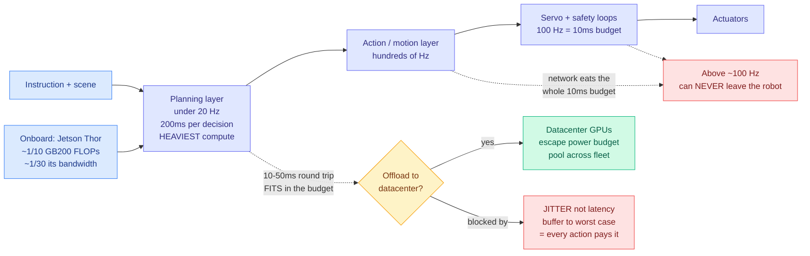

# A Brain Too Big to Carry: On-Device vs Datacenter Inference for Robots

**Source:** SemiAnalysis · [Essay](https://newsletter.semianalysis.com/p/a-brain-too-big-to-carry-on-device) · **Date:** 2026-09-15 (published 09-14)
**Raw:** [Gmail starred](../../raw/gmail/2026-09-15-starred.md)

## TL;DR

The best framing of an inference-placement problem this wiki has recorded, and it generalizes well past robotics.

**The inversion.** With LLMs, hardware bends to the model: pour in data and compute at training, then figure out how to serve what comes out. Robotics reverses this because of two constraints. **Time**: a robot runs real-time control loops and cannot miss a deadline, whereas a slow LLM still produces the same answer. If a robot is slow, the world changes and the action is obsolete before it executes. **Cost**: the manufacturer pays for the compute on every unit, up front, which at scale is billions and potentially trillions. So on-robot hardware is fixed and the model is designed to fit. **Frontier robot capability is capped by what runs on affordable real-time hardware, which makes intelligence something you ration against latency and unit economics.**

**The frequency argument is the load-bearing analysis.** A robot model has three layers. Planning at the top interprets instruction and scene. The action/motion layer turns that into short action sequences and poses. Servo and safety loops at the bottom estimate state, react to contact and slip, and command actuators. **Frequency decides what can leave the robot.** Action and servo layers run at hundreds of Hz: a 100 Hz loop must emit every 10ms, while a typical wireless round trip is 10 to 50ms and a well-engineered link is under 10ms. The network consumes the entire budget before the model computes anything, so **anything above roughly 100 Hz can never leave the robot.** Below about 20 Hz, where planning lives, a 5 Hz planner gets 200ms per decision and a 10-to-50ms round trip fits comfortably.

**And the real obstacle is jitter, not latency.** A fixed delay can be planned around: you know roughly how far everything moves in that window and plan ahead. Jitter is harder because commands arrive at irregular intervals and the robot never knows when the next update lands. You can buffer to the worst case, converting variable delay into predictable delay, but then every action pays the worst-case penalty. **Getting jitter under control is what actually unlocks offloading the planner.**

**Model sizes are set by constraints, not by scaling.** Generalist robot models sit in the billions: Physical Intelligence's π0 class around 3B, π0.7 at 5B, ByteDance GR-3 at 4B, Generalist around 10B, NVIDIA DreamZero at 14B. SemiAnalysis is careful that these counts mean less than LLM parameter counts: LLM labs pick size by optimizing quality against a training budget, robotics labs pick size by what their data supports and what fits on a Jetson or an H100 inside a latency budget. **Frontier models already outgrow the robot.** π0.7 runs on an off-robot H100; DreamZero needs two GB200s to run in real time. Jetson Thor, the best robot compute purchasable today, delivers about **1/10th the FLOPs of a GB200 and roughly 1/30th of its memory bandwidth.**

**The trend line is genuinely unsettled, and the counter-example is the interesting one.** Months after DreamZero, a 14B world-action model on a video-diffusion backbone needing two GB200s, NVIDIA's RoboTTT made the opposite bet: a **3B policy that continually updates its own weights with test-time training** instead of generating videos of the future, producing minutes of usable context small enough to run onboard. Same lab, opposite direction, months apart.

SemiAnalysis's own view: a cascade is inevitable, some robots fully onboard and others offloading part of cognition, but for generalist robots needing real intelligence **off-robot compute has the advantages**, escaping the robot's compute and power budget and pooling inference across a fleet.

**The supply chain closes the argument.** It is geared to datacenter silicon, not robot silicon, and ramping robot silicon is hard with front-end capacity and DRAM already tight. NVIDIA's own output is almost entirely datacenter: a long Hopper ramp through 2023-2024 handing off to Blackwell scaling sharply across 2025.

---

---

## How this relates to the rest of the wiki

**Strip the robot out and this is a general theory of inference placement, which is what makes it worth a page despite robotics sitting low in this reader's attention hierarchy.** The rule it derives is: **decompose the system by loop frequency, and the network round trip plus its jitter sets the boundary between what must be local and what can be remote.** That is directly transferable to [llm-routing](../ai-routing/llm-routing.md), which has always framed routing as a model-choice problem under a quality bar. This piece says the prior question is a **placement** problem under a latency-variance bar, and that the binding constraint is variance rather than mean. **No routing result in the wiki reports latency variance.** Every one reports cost and quality, some report mean latency. If the robotics people are right that jitter rather than latency is what forces a decision local, then the routing literature is measuring the wrong latency statistic.

**It is also the cleanest available statement of the thesis [compute-economics](compute-economics.md) has been assembling: capability is increasingly set by economics rather than by research.** "Intelligence becomes something you ration against latency and unit economics" is that page's argument in one sentence, and robotics is the extreme case because the cost is capex per unit rather than opex per token. The contrast with today's [Vera Rubin agentic-inference benchmark](2026-09-15-semianalysis-vera-rubin-agentic-inference.md) is instructive: there, cost improvements arrive by amortizing a rack across enormous shared traffic. Here, there is nothing to amortize across because the compute ships inside each robot. **Same publisher, same day, two opposite economics, and the piece's own conclusion is that robotics should therefore look more like the first case, which is what "pool inference across a fleet" means.**

**The RoboTTT counter-example connects to the test-time-training line on [self-evolving-agents](../agentic-systems/self-evolving-agents.md).** That page splits self-improvement into harness updates (scaffold rewritten, weights frozen) and weight updates (test-time training on task feedback), with the second lineage running through TTRL and the Discover line. **RoboTTT is that second lever adopted for a hardware reason rather than a capability one: continually updating a 3B policy's weights buys minutes of usable context without paying for a model big enough to hold it.** That reframes test-time training as a memory-compression technique, which is not how any paper on that page presents it, and it is a genuinely new angle worth tracking.

**Jetson Thor at ~1/30th of GB200 memory bandwidth belongs on [memory-hierarchy](memory-hierarchy.md).** The FLOPs gap is 10x and the bandwidth gap is 30x, so edge inference is *more* bandwidth-starved than datacenter inference, not less. Every KV-cache and quantization result in the wiki is tuned against datacenter ratios. The techniques that win at 1/30th the bandwidth are plausibly a different set, and nobody has published that comparison.

## Gaps

- The free portion stops before the networking sections it promises, so the jitter-mitigation argument is set up but not delivered.
- No numbers on what fleet-pooled inference actually saves. "Pool inference across a fleet" is asserted as an advantage with no utilization figure, and fleets of robots plausibly have correlated demand (everyone works during the day), which is the case where pooling helps least.
- Robot-model parameter counts are given without task-quality context, and the piece says itself that the counts mean less than LLM counts, which somewhat undercuts using them to argue a trend line.
- No treatment of the hybrid the conclusion implies: which specific planning sub-tasks offload well, and what the fallback is when the link drops mid-decision.

## Links

- [compute-economics](compute-economics.md) · [memory-hierarchy](memory-hierarchy.md) · [llm-routing](../ai-routing/llm-routing.md)
- [Vera Rubin NVL72 agentic inference (09-15)](2026-09-15-semianalysis-vera-rubin-agentic-inference.md)
- [Daily digest 2026-09-15](../daily-digest/2026-09/2026-09-15.md)
