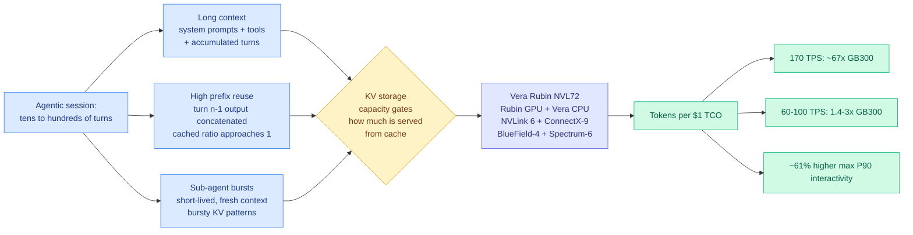

# Vera Rubin NVL72 Agentic Inference: 67x Better Performance per Dollar

**Source:** SemiAnalysis · [Essay](https://newsletter.semianalysis.com/p/vera-rubin-nvl72-agentic-inference) · **Date:** 2026-09-15 (published 09-14)
**Raw:** [Gmail starred](../../raw/gmail/2026-09-15-starred.md)

## TL;DR

SemiAnalysis published the first verified agentic-inference measurements for NVIDIA's Vera Rubin NVL72 rack, run on their AgentX benchmark, which replays real agentic traffic across a fleet of thousands of chips rather than generating synthetic prompts. The framing that matters is **tokens per dollar of total cost of ownership**, not tokens per second: the Y-axis is total tokens generated per $1 of all-in serving cost, which is the number an inference provider actually budgets against.

The headline is deliberately provocative and needs unpacking. At **170 tokens per second per user**, on an apples-to-apples TensorRT-LLM NVFP4 dense configuration, Vera Rubin NVL72 delivers roughly **67x the throughput per TCO dollar** of a GB300 running Dynamo TensorRT-LLM under owning-cost assumptions. That number is real but it is measured at the far right edge of the interactivity frontier, where GB300 is falling off a cliff and Rubin is not. The honest number is the one SemiAnalysis gives two sentences later: at **60 to 100 tokens per second**, where most providers actually serve, Rubin achieves **1.4x to 3x** the throughput per TCO dollar. It also reaches about **61% higher maximum P90 interactivity**, meaning it can serve a materially faster experience at all before quality of service collapses.

Two secondary points carry more weight than the headline. First, against Jensen Huang's own GTC 2026 claim of 3x performance per megawatt versus Blackwell on a 1-to-3-trillion-parameter model at ~200 TPS, the measured pre-release result is up to **7x better token throughput per megawatt**. SemiAnalysis notes NVIDIA did the same thing at GTC 2024, claiming GB200 NVL72 would be 30x Hopper when the measured figure came in at 98x. The vendor is sandbagging, and consistently. Second, on early pre-release software, Rubin already earns **over 2x more profit per gigawatt** than Blackwell, and the gap is expected to widen as kernel libraries mature, which means today's number is a floor.

---

---

## What an agentic workload is, in their definition

This is the load-bearing part of the piece, because it is what justifies a new benchmark at all. SemiAnalysis characterize agentic inference by four properties:

1. **Multi-turn.** Tens to hundreds of user-assistant interactions per session, against a handful in a chatbot.
2. **Long context.** System prompts, tool definitions and turn accumulation make context grow quickly.
3. **High prefix reuse.** Because conversation progresses linearly, turn *n* concatenates turn *n-1*'s output, so most context can be served from KV cache rather than recomputed. As *n* grows, the cached-to-uncached ratio tends toward 1. **They state explicitly that this depends on how much storage is available to hold KV tensors.**
4. **Sub-agent bursts.** A session spawns short-lived sub-agents with fresh context, producing bursty KV-cache allocation patterns.

Read that list as a hardware specification and the six-product co-design (Rubin GPU, Vera CPU, NVLink 6 Switch, ConnectX-9, BlueField-4, Spectrum-6) stops looking like marketing. Properties 3 and 4 together say the binding constraint on agentic serving is **KV cache capacity and the speed of moving KV tensors around**, not raw FLOPs. That is a memory-and-fabric problem.

## How this relates to the rest of the wiki

**This is the demand-side half of the argument [memory-hierarchy](memory-hierarchy.md) received the supply-side half of yesterday.** The 09-14 SemiAnalysis piece, [Long Live the Short King](2026-09-14-semianalysis-4hi-hbm-bandwidth-over-capacity.md), argued that an HBM4 cube exposes 2,048 data I/Os regardless of stack height while price tracks gigabytes, so 4-hi is the cheapest way to harvest full bandwidth and 12-hi costs 26.3% more system-wide for 10% more throughput. Today's piece is the same authors saying the workload that will define the next hardware generation is one whose cached-input ratio **tends toward 1** and whose serving quality is gated by how much KV you can hold. Those two claims are in tension and the tension is the interesting thing: **capacity is exactly what the agentic profile wants more of, and exactly what the 4-hi argument says you should stop paying for.** SemiAnalysis hold both positions in two days without reconciling them. The resolution is presumably that KV belongs in a hierarchy below HBM rather than in HBM, which is what the Mooncake line of work argues, but neither piece says so.

**It also puts a production number under the cliff [kv-cache](../inference-efficiency/kv-cache.md) recorded on 09-14.** That entry captured a Kimi K3 run where cutting the KV budget 36-44% tracked full-memory throughput invisibly until concurrency hit about 70, then lost ~30% at once when occupancy saturated, with 10x the DRAM reads. AgentX's sub-agent-burst property is a mechanism for hitting that cliff *unpredictably*: a session that spawns sub-agents allocates fresh KV in bursts, so occupancy is spiky rather than smooth. Every eviction and compression policy on the KV page assumes a smooth occupancy curve.

**For [compute-economics](compute-economics.md)**, the durable claim is the methodological one. SemiAnalysis is normalizing by all-in serving cost rather than by chip, and publishing the TCO model behind it (owning at hyperscaler volume, and rent on a three-year commit, from a monthly survey of 100+ GPU customers, neoclouds and hyperscalers). InferenceX now carries TPUv7, NVIDIA and AMD, with SambaNova and Trainium coming, and AMD has committed to collaborating on MI455X UALoE72. **A cross-vendor benchmark normalized by dollars is the first apparatus in this space that can answer "which chip for which workload" rather than "whose chip is fastest."** That is the same measurement discipline [llm-routing](../ai-routing/llm-routing.md) has demanded since [the AlphaSense study (08-14)](../ai-industry/2026-08-14-alphasense-token-price-vs-task-cost.md) showed per-token pricing ranks models backwards, now applied one layer down at the silicon.

## Gaps and cautions

- **The 67x is a frontier-edge number and should not be quoted bare.** It is measured at 170 TPS where the GB300 comparison point is collapsing. The 1.4x-to-3x figure at realistic interactivity is the one to plan against.
- SemiAnalysis thanks Jensen Huang, Ian Buck and NVIDIA's TensorRT-LLM team for helping bring up the software and verify the results. The benchmark is open source and widely reproduced, but the specific Rubin numbers were produced with vendor assistance on vendor pre-release software. That is disclosed and it is still a conflict worth holding.
- Only TensorRT-LLM is measured. vLLM and SGLang numbers on Rubin are promised in later articles, and the gap between vendor-optimal and community-stack performance is historically large.
- The rack is the production SKU at 2300W TDP with 1.5TB of CPU LPDDR5X per compute tray, which is **half** the Vera memory originally planned. Given that the workload profile the piece defines is KV-capacity-bound, halving host memory is a strange thing to publish alongside this benchmark without discussing the interaction.

## Links

- [memory-hierarchy](memory-hierarchy.md) · [compute-economics](compute-economics.md) · [kv-cache](../inference-efficiency/kv-cache.md)
- [4-hi HBM: bandwidth over capacity (09-14)](2026-09-14-semianalysis-4hi-hbm-bandwidth-over-capacity.md)
- [Daily digest 2026-09-15](../daily-digest/2026-09/2026-09-15.md)
