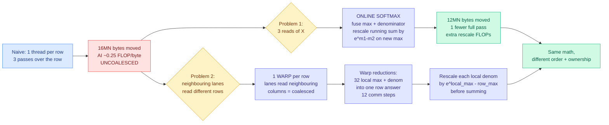

# Making Softmax Fast: a CUDA kernel worklog

**Date ingested:** 2026-09-16
**Source:** Anshuman Mishra, published 2026-09-11 · [worklog](https://heyyanshuman.com/posts/making_softmax_fast) · surfaced via X home feed ([@athletic_coder](https://x.com/athletic_coder))
**Raw:** [raw/twitter/feed/2026-09-16-afternoon-ranked.json](../../raw/twitter/feed/2026-09-16-afternoon-ranked.json)

## TL;DR

A step-by-step worklog that takes softmax, the operation that turns raw attention scores into a probability distribution, from the most naive CUDA kernel to a warp-per-row implementation, quantifying the cost at every step. The two moves that matter are **online softmax**, which fuses the max-finding pass and the denominator pass into one by rescaling the running sum whenever a new maximum appears, and **coalescing**, which switches from one thread per row to one warp per row so neighbouring lanes read neighbouring columns. Global memory traffic falls from **16MN bytes to 12MN bytes**, and the arithmetic intensity of the naive version is computed explicitly at roughly **0.25 FLOPs per byte**, which is the number that tells you this is a bandwidth problem before you write a line of code.

## The mechanism

## The online-softmax trick, stated plainly

Stable softmax subtracts the row maximum before exponentiating so the largest exponent is e^0 = 1 and nothing overflows. That seems to require knowing the maximum before you can start summing, which forces a separate pass. It does not. Suppose you have processed up to index i with running maximum m1 and running denominator L. You then meet a larger value m2. Every term already in L was computed relative to m1 and now needs to be relative to m2. Multiply the whole running sum by **e^(m1 - m2)** and every stored term is corrected at once, because e^a · e^b = e^(a+b). Then add 1 for the new maximum's own term, which is e^0. One multiplication repairs the entire history.

The same identity reappears at the warp level. Each of 32 lanes produces a local maximum and a local denominator over its slice of the row. Before those partial denominators can be summed, each is rescaled by **e^(local_max - row_max)** to put them on a common scale. **The rescaling factor is the same idea applied across space rather than across time.**

## Why this is worth a wiki page

**This is the mechanism underneath FlashAttention, written out at a level where you can check it.** The [gpu-kernels page](gpu-kernels.md) carries FlashAttention and its descendants as results, and online softmax is the piece that makes tiled attention possible at all: you cannot process attention in blocks unless you can combine partial softmax statistics from different blocks, and the e^(m_local - m_global) rescale is exactly how. Most treatments assert this. This one derives it in four lines.

**The arithmetic-intensity framing is the transferable habit.** Computing AI ≈ 0.25 FLOPs per byte before optimizing tells you that no amount of instruction-level cleverness will help and that every win must come from moving less data. That is the same reasoning that governs every result on the [memory hierarchy page](memory-hierarchy.md), and it is the reason the day's other GPU signal, the prefill-versus-decode distinction, has the shape it does: prefill has enough parallelism to move toward compute-bound, decode revisits weights for one token per sequence and is bandwidth-bound by construction.

**The author's own summary is the right takeaway and is unusually well put:** the mathematical definition of softmax never changed. What changed was the order in which its statistics are computed and which threads own the work. That was enough to remove a complete read of the input and recover efficient memory transactions. **Kernel optimization is a scheduling and ownership problem, not an arithmetic one**, and this is the cleanest small demonstration of it in the wiki.

## Relation to the agent-written-kernels thread

This landed in the feed the day after [the DeepSeek kernel engineer's essay (09-15)](2026-09-15-deepseek-kernel-engineer-rsi-essay.md), in which Shengyu Liu, whose code is in DeepSeek V4.1's main attention kernel, estimated six to twelve months until AI writes kernels better than he does, on the grounds that models now read CUDA, PTX and SASS directly and profile stalls per instruction. A human worklog like this one is precisely the artifact that estimate is about. **The reasoning chain here, notice low arithmetic intensity, identify redundant passes, find an algebraic identity that fuses them, then re-map ownership to fix coalescing, is four distinct insights, and only the last two are pattern-matchable from documentation.** Whether an agent generates the e^(m1-m2) rescale independently or retrieves it because online softmax is now in every textbook is the actual test, and nobody has run it that way.

## Gaps

- No measured wall-clock numbers or achieved-bandwidth percentages in the sections captured, only analytic byte counts. 16MN to 12MN is a 25% traffic reduction on paper; the realized speedup depends on cache behavior and is not reported here.
- The analysis assumes every pass reads from global memory, which is the worst case. Real L2 behavior on a modest N would make the naive version less bad than the model suggests.
- Warp-per-row is the right choice for moderate N. Very long rows need block-per-row with shared-memory reduction, which is outside this worklog's scope.
