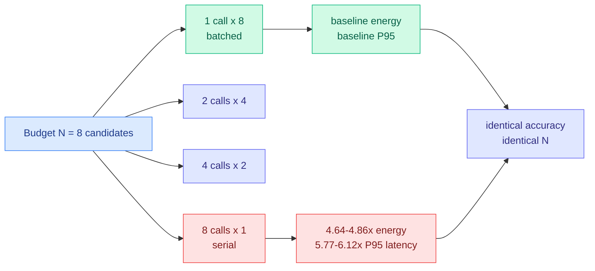

# Sample Count Is Not Enough: the same N costs five times as much depending on how you run it

**Source:** HuggingFace Daily Papers, 2026-09-18 · [arXiv 2609.19499](https://arxiv.org/abs/2609.19499) · [raw](../../raw/huggingface/2026-09-18-sample-count-is-not-enough-candidate-generation-strategy-sha.md)

## TL;DR

Test-time scaling papers describe their inference budget as **N**, the number of candidate responses generated. This paper points out that N says how many candidates were produced, not how they were executed, and then measures what that omission costs. Holding **N = 8** fixed and varying only the schedule (one call of eight candidates, versus two of four, four of two, or eight of one), the authors find that **eight serial calls consume 4.64 to 4.86 times the gross GPU-device energy and have 5.77 to 6.12 times the P95 latency of one batched call with eight candidates** on A100s. Same accuracy budget, same candidate count, five times the energy. The conclusion is a reporting standard: **evaluations should publish the generation schedule and GPU-level systems metrics, not just N and accuracy.**

## What they measured

The setup is deliberately boring, which is why it is persuasive. First they confirm the standard result that increasing N helps: from 1 to 8 candidates improves accuracy by **8.4 points for Phi-3-mini and 18.4 points for Qwen2.5-1.5B** on 500 GSM8K prompts. Then they hold N at 8 and change only the schedule, measuring latency, throughput, GPU-hours and **gross GPU-device energy**. The gap is the 4.64-to-4.86x energy figure above.

The pattern replicates across **three independently scheduled A100 nodes per model**, which rules out one noisy machine, and holds in short-output SciQ experiments on V100s, which rules out a quirk of long generations or of one GPU generation. The mechanism is not surprising once stated: a batched generation call amortizes weight loading and keeps the GPU's arithmetic units fed, while serial calls repeatedly pay fixed per-call overhead and run at low occupancy. **The finding is not that batching helps. It is that the field's standard way of reporting an inference budget makes a five-fold energy difference invisible.**

The practical rule they land on: **when candidates are independent and memory allows, fewer calls with larger batches are more efficient.** The two conditions are load-bearing. Sequential methods where candidate k+1 depends on candidate k cannot be batched this way, and a large batch needs the KV cache headroom to hold it.

## How this relates to prior wiki pages

**It supplies the systems denominator that [test-time-compute-allocation.md](../inference-efficiency/test-time-compute-allocation.md) has been missing for its whole history.** That page's 09-05 entry asked what to do with the saving, and its recurring difficulty is that "compute" in test-time-compute papers is an abstraction measured in tokens or candidate counts. **This paper shows the abstraction hides a 5x factor**, which means two methods reporting the same N can differ by more in energy than most of the methods on that page differ in accuracy. Any efficiency claim on that page that does not state its generation schedule is under-specified.

**It reframes a batching problem [llm-routing.md](../ai-routing/llm-routing.md) named on 09-14 and could not price.** That entry flagged routing-granularity-versus-batch-size as the missing number: routing fragments a request stream across models, and fragmentation shrinks batches. **This paper measures the cost of small batches directly, in energy, on a single model.** It is not the routing number, because it does not vary the model, but it establishes the order of magnitude of what fragmentation costs, and it is large. A router that improves accuracy by splitting traffic across four models is buying that accuracy partly with the batch efficiency it destroys, and nobody has been subtracting it.

**It composes with [When2Think (09-18)](../inference-efficiency/2026-09-18-when2think-difficulty-aware-length-control.md) rather than competing.** When2Think cuts tokens per instance by allocating reasoning depth to difficulty, reporting 27.9 percent fewer tokens at higher Pass@3 on AIME24. This paper cuts energy per fixed token budget by scheduling. **Orthogonal axes, multiplicative savings, and each paper is blind to the other's.**

**It strengthens [compute-economics.md](compute-economics.md)'s case that the reported unit of AI cost is systematically the wrong one.** The page has tracked the gap between per-token pricing and actual serving cost. This is the same gap appearing inside research evaluation rather than inside a bill.

## Gaps

Small models only, Phi-3-mini and Qwen2.5-1.5B, where per-call overhead is a larger share of total work than it would be on a 500B MoE. **The 5x factor should be expected to shrink at frontier scale** and the paper does not estimate how much. GSM8K and SciQ are both short-answer tasks. "Gross GPU-device energy" is board-level draw, which includes idle and does not isolate the compute, and the authors are right to call it gross but it flatters the batched case. No measurement on modern parts (H100, B200) where batching behaviour and memory headroom are different. And no treatment of the serving reality that a production system batches *across users*, so a single request's schedule is not actually the operator's choice.

## Industrial implication

Two concrete changes. First, **for evaluation: report the generation schedule alongside N.** A leaderboard entry claiming a method wins at N = 16 is not comparable to one at N = 16 run differently, and today nobody states which they did. This is a cheap fix to a real measurement problem and it should become a reviewer request.

Second, **for anyone buying inference on energy or carbon terms, the schedule is a first-class procurement variable.** A five-fold energy difference at identical accuracy is larger than most model-choice decisions, and it is currently made implicitly by whoever wrote the eval loop. The caveat that keeps it honest: in production, batching is the serving stack's job across concurrent users, so the lever mostly belongs to the platform team rather than the application team. **The place this bites hardest is offline evaluation and batch scoring jobs, where one team's loop really does decide the schedule, and where those jobs run continuously.**

## Related pages

- [compute-economics.md](compute-economics.md)
- [test-time-compute-allocation.md](../inference-efficiency/test-time-compute-allocation.md)
- [llm-routing.md](../ai-routing/llm-routing.md)
