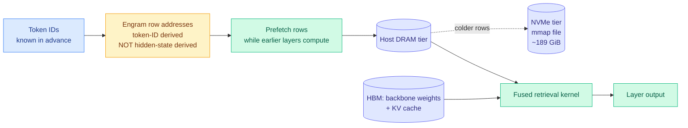

# SemiAnalysis on Engram offloading: the model that was designed to be paged out

**Source:** SemiAnalysis, 2026-09-18 · [Engrams Embedding Entendre: Codesign for Efficient DRAM/SSD Offloading](https://newsletter.semianalysis.com/p/engrams-embedding-entendre-codesign) · [raw](../../raw/gmail/2026-09-18-starred.md) · [raw RSS](../../raw/rss/2026-09-18-semianalysis-engrams-embedding-entendre-codesign-for-efficient-drams.md)

## TL;DR

SemiAnalysis replicated DeepSeek's Engram module, probed what it memorizes, ablated it, and benchmarked serving with the table offloaded off HBM. **Engram is a learned lookup table: recurring multi-token patterns retrieve a vector directly instead of being reconstructed through attention and feed-forward layers.** The systems property that makes it special is that **the addresses depend on token IDs, not on hidden states**, so the runtime knows which rows it will need before it computes anything and can prefetch them from host DRAM while earlier layers are still running. In the DeepSeek-V4.1-Flash configuration the Engram table is roughly **189 GiB**; SemiAnalysis replaced it with a memory-mapped file and served the model with the table on SSD. The framing that matters for the reader: **model architecture is now innovating specifically around the HBM constraint**, and this is the clearest worked example.

## The findings, in order of how much they change the picture

**1. Offloading can beat keeping it resident, even when you have the HBM.** The headline systems result is not "offload works when you are short on memory." It is that **even on high-capacity HBM parts, moving the Engram table to DRAM produces better performance across most of the pareto frontier than keeping it in HBM**. Freeing HBM buys larger batches and more concurrent sessions, and that throughput gain outweighs the added latency of a prefetched DRAM read. Recommendation systems have run this playbook for years: keep hot embedding rows in fast memory, back cold rows with SSD. It is arriving in LLM serving.

**2. What Engram memorizes is not what you would have chosen.** Probing the gate scores on DeepSeek-V4.1-Flash surfaces names, code fragments, relational phrasing, and boilerplate: licences, bibliography fragments, API scaffolding, website furniture. SemiAnalysis's reading is the honest one. **Learned memory optimizes the training objective, not a judgment about which facts deserve storage.** Boilerplate is a strong prediction shortcut, so it earns table capacity. The practical consequence is that the value of adding Engram capacity depends heavily on what survives data preparation, and the authors are careful to say the evaluation-corpus scan establishes neither training exposure nor how much capacity each category actually occupies.

**3. Gate scores do not tell you which rows are cache-hot, which breaks the obvious optimization.** The natural idea is to use the gate score to decide what to keep in fast memory and what to skip reading. It does not work, for a mechanical reason worth recording: **computing the gate requires the retrieved key, so you have already paid for the read by the time you know the gate is low.** Skipping reads would need a separate usefulness predictor that runs *before* retrieval. That is a clean, well-specified open problem.

**4. Removing Engram is not a clean ablation, because the experts reroute.** The original paper's inference-time ablation reported factual-knowledge benchmarks retaining only **29 to 44 percent** of performance while reading comprehension retained **81 to 93 percent**. SemiAnalysis's replication adds the part that changes the interpretation. Suppressing Engram worsens token likelihood across nearly every domain, **but GSM8K accuracy stays inside run-to-run variation**, so grade-school math apparently does not route through the memory at all. More interestingly, in a teacher-forced experiment on CRUXEval (a code-reasoning benchmark where the model predicts a Python function's output from its code and an input), removing Engram raised answer loss from 0.2848 to 0.3093 bits per token, and **forcing the ablated model to reuse the original Engram-on expert choices made it worse still, at 0.3375**. Rerouting is partially compensating. The conclusion is a direct strike against the tidy story: **there is no clean division where "memory stores facts and experts reason." Memory features and expert selection are entangled and co-adapted.**

**5. Prefill and decode do not depend on the memory equally.** Removing Engram during either phase alone reduced CRUXEval accuracy and increased generated tokens; removing it throughout was worst. **Keeping Engram for prefill yields more correct answers than keeping it for decode**, which SemiAnalysis attributes to the richer semantics available while reading. For a placement policy that is directly actionable: if you must degrade, degrade the decode-side path.

**6. Rubin Ultra was despec'd from 1024 GB to roughly 200 GB of HBM per chip.** This is stated in passing and it is the largest hardware fact in the piece. NVIDIA's roadmap changed, the HBM-per-chip number fell by a factor of five, and SemiAnalysis's framing is that architecture optimizations like Engram become more helpful precisely because of it.

## How this relates to prior wiki pages

**It delivers the exact measurement [the 09-10 V4.1-Flash page](../llms-foundation-models/2026-09-10-deepseek-v41-flash-architecture.md) named as its top gap.** That page's Gaps section asked for "wall-clock serving numbers for the Engram host-memory path under concurrency, which is the regime where a PCIe round trip to LPDDR either amortizes or does not." Eight days later, SemiAnalysis published serving benchmarks with the table offloaded across six NVIDIA SKUs plus MI355X. **It amortizes, and on most of the pareto it more than amortizes.** This is a clean gap-fill and it resolves in the architecture's favour.

**It extends [memory-hierarchy.md](memory-hierarchy.md)'s "compression has become placement" thesis from cache state to weights, with a mechanism for why it works here specifically.** The page has tracked KV state moving between HBM, host DRAM and NVMe. Engram moves *parameters*, and the reason it can is the property named above: **token-ID-derived addresses are knowable ahead of time, so the access is prefetchable in a way hidden-state-derived access is not.** That is the criterion that separates "offloadable by design" from "offloaded as a fallback," and this page did not have it stated before.

**It composes with, rather than duplicates, the [09-14 4-hi HBM analysis](2026-09-14-semianalysis-4hi-hbm-bandwidth-over-capacity.md).** That study found KV offload to second-tier DRAM absorbs a large capacity cut almost invisibly and then fails as a cliff past roughly 70 concurrent sessions. This one finds Engram offload is a net win across most of the pareto. **Both are the same underlying bet on the host DRAM tier, made twice in one model, and nobody has measured what happens when you make it twice at once.** If KV offload and Engram offload both target host DRAM, they contend for the same bandwidth, and the cliff from 09-14 should arrive earlier. That interaction is unmeasured and it is the most important missing experiment on this page.

**The Rubin Ultra despec sharpens the tension [the 09-10 page](../llms-foundation-models/2026-09-10-deepseek-v41-flash-architecture.md) flagged and could not price.** That page noted DeepSeek's answer to an HBM shortage is to consume more LPDDR, while [the same week's supply analysis](2026-09-10-robot-inference-on-device-vs-datacenter.md) found commodity and LPDDR supply already competing for a shrinking pool of non-HBM wafers. **A five-fold cut in HBM per chip on NVIDIA's flagship roadmap pushes far more of the industry down the same relief valve at once.** The second-order effect is still unpriced, and it now has a much larger first-order cause.

## Gaps

The Engram replication was at roughly 6E18 FLOPs per run on fineweb-edu, which is small enough that the U-shaped scaling reproduction is suggestive rather than settled at frontier scale. The serving benchmarks are InferenceX, SemiAnalysis's own harness, widely reproduced but still one harness. **No measurement of KV offload and Engram offload contending for host DRAM simultaneously.** No number for how much table capacity the boilerplate categories actually occupy, which the piece explicitly declines to claim. And the pre-retrieval usefulness predictor that would make gate-based skipping work does not exist.

## Industrial implication

Two things change. First, **"is this offloadable?" becomes an architecture review question, and it has a crisp test: are the addresses derivable from the input tokens or from the hidden state?** Token-derived means prefetchable means it can live on a cheaper tier. Hidden-state-derived means it cannot. Anyone designing a memory or retrieval module should now be asked this in design review, because it decides which memory tier the module is allowed to use for the rest of its life.

Second, **the Rubin Ultra despec makes architectural HBM reduction a procurement input rather than a research nicety.** If the next flagship carries a fifth of the HBM that was on the roadmap, then models that need less resident memory are not merely cheaper to serve, they are the only ones that fit. That is a strong tailwind for exactly the design direction [DeepSeek-V4.1-Flash](../inference-efficiency/2026-09-18-deepseek-v41-flash-kv-cache-compression.md) published the same day, and a strong headwind for anyone whose serving plan assumed HBM capacity would keep growing on schedule.

## Related pages

- [memory-hierarchy.md](memory-hierarchy.md)
- [compute-economics.md](compute-economics.md)
- [kv-cache.md](../inference-efficiency/kv-cache.md)
- [DeepSeek-V4.1-Flash KV cache compression (09-18)](../inference-efficiency/2026-09-18-deepseek-v41-flash-kv-cache-compression.md)
- [SemiAnalysis 4-hi HBM (09-14)](2026-09-14-semianalysis-4hi-hbm-bandwidth-over-capacity.md)
