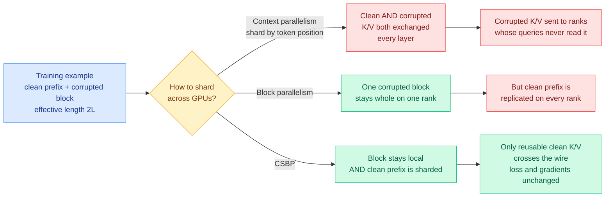

# CSBP: stop sharding by token position, start sharding by what the loss actually needs

**Date ingested:** 2026-09-19
**Source:** X home feed via [@StanfordAILab](https://x.com/StanfordAILab/status/2101020335000998089) and [@hangoo_kang](https://x.com/hangoo_kang/status/2101016630595891214) · Stanford Scaling Intelligence Lab
**Links:** [arXiv 2609.19242](https://arxiv.org/abs/2609.19242) · [alphaXiv overview](https://www.alphaxiv.org/abs/2609.19242) · [Turbo-dLLM code](https://github.com/ScalingIntelligence/Turbo-dLLM)
**Authors:** Tarun Suresh, Pranshu Chaturvedi, Hangoo Kang (equal), Parth Shroff, Ishan S. Khare, Hermann Kumbong, Azalia Mirhoseini (Stanford)
**Raw:** [raw/twitter/feed/2026-09-19-morning-ranked.json](../../raw/twitter/feed/2026-09-19-morning-ranked.json)

## TL;DR

Context parallelism is the standard way to train a transformer on a sequence too long for one GPU: cut the sequence into chunks by token position, give each GPU a chunk, and have the GPUs exchange key and value tensors at every layer so attention still sees the whole sequence. It is a good default for an ordinary autoregressive model. This paper shows it is the **wrong** default for block diffusion language models (BDLMs), the hybrid family that keeps autoregressive dependencies *between* blocks of tokens but denoises the tokens *inside* each block in parallel. A BDLM's training input is effectively **two sequences**, a clean one and a corrupted one, so a length-L example is processed as length 2L. Position-based sharding communicates the corrupted key/value tensors across every rank, even though a corrupted block is only ever attended to by queries from **that same block**. That traffic is pure waste. Block parallelism (BP) keeps each corrupted block's entire computation on one rank; context-sharded block parallelism (CSBP) additionally shards the shared clean prefix so it is not replicated. Reported: **1.46x faster than pure BP at 64K context on NemotronDiffusion 14B, 89.8 GiB of HBM instead of 110.7 GiB, and at 128K CSBP fits where pure BP runs out of memory.** Downstream, at equal GPU hours, CSBP-trained models score higher on SWE-bench Verified and Terminal-Bench Lite.

## The mechanism

The insight is a single sentence and it generalises past diffusion. **Communication should be organised around the structure of the loss, not around the shape of the tensor.** In a BDLM the loss is defined per target block. A corrupted target block attends to its own corrupted tokens and to the clean prefix that precedes it, and to nothing else. So there are two kinds of activation on the wire: the clean prefix, which every block needs and is therefore worth distributing and exchanging, and the corrupted block state, which exactly one rank needs and should never move. Conventional context parallelism cannot tell them apart because it partitions by position and the two kinds are interleaved by position.

BP fixes the second half: assign each corrupted block's entire computation to one rank, so corrupted K/V and its gradients stay local. But BP then has to hand every rank the full clean prefix, and at long context the prefix is the thing that grows. CSBP fixes that too by sharding the clean sequence across ranks in the ordinary context-parallel way while keeping the block-local property. The paper's four stated design requirements are worth recording because they are the checklist any replacement strategy has to pass: each corrupted block's computation stays on one rank, the shared clean context is distributed rather than replicated, **the original BDLM loss and parameter gradients are preserved exactly**, and the scheme composes with tensor, pipeline and expert parallelism.

## Key numbers

- **NemotronDiffusion 14B at 64K context:** CSBP is 1.46x faster than pure BP, using 89.8 GiB of HBM against 110.7 GiB.
- **At 128K context:** CSBP fits, pure BP runs out of memory. This is the more important of the two results, because it is a capability difference rather than a speed difference.
- **Block-size robustness:** from 128 to 1,024 tokens per block, speedup stays within 1.14 to 1.15x on NemotronDiffusion 14B and 1.33 to 1.44x on DiffusionGemma 26B-A4B. The gain does not depend on a lucky block size.
- **Workload speedups reported by the authors:** **7.59x** faster DFlash2 speculative-decoding drafter training, **1.61x** faster block-diffusion fine-tuning, **1.33x** faster autoregressive-to-block-diffusion adaptation.
- **Downstream:** at the same GPU hours, CSBP-trained models score higher on SWE-bench Verified and Terminal-Bench Lite. This is the number that matters commercially, because it converts a systems win into a quality win at fixed budget.

The 7.59x on drafter training is the one to sit with. A speculative-decoding drafter (the small model that proposes several tokens at once for a big model to check) is a pure serving-cost asset, and drafter training has been the friction that keeps speculative decoding from being retuned per deployment. Cutting that cost by nearly 8x makes per-workload drafters plausible rather than a research luxury.

## How this connects to what the wiki already knows

**This is the first entry on the [gpu-kernels page](gpu-kernels.md)'s subject matter where the optimisation is a communication *schedule* derived from the loss rather than a kernel.** The page's 2026-09-16 entry wrote out the derivation under FlashAttention, and its 2026-09-13 entry put a number on the gap between hand-written and compiled kernels. Both operate inside one device. CSBP operates between devices and gets its win by noticing that a tensor the system was faithfully transporting had no reader. That is a different class of waste and the page has not catalogued it.

**It also lands squarely on a claim this wiki has been building for a month: uniform treatment of non-uniform work is the dominant source of waste in modern ML systems.** The [quantization page](../inference-efficiency/quantization.md) organises itself around "uniform precision is the wrong default." [Sample Count Is Not Enough (09-18)](2026-09-18-sample-count-generation-schedule-energy.md) showed that the same candidate budget costs 4.64 to 4.86 times the GPU energy depending on whether you run it as eight serial calls or one batch of eight, so a uniform accounting of "N samples" hides a five-fold cost difference. CSBP is the communication-layer instance of the same claim: a uniform sharding rule moves bytes that nobody reads. **Three layers, same finding, and CSBP is the cleanest statement of it because the wasted work here is provably zero-value rather than merely suboptimal.**

**Third, it is a quiet argument that diffusion LLMs are now a serving-economics story rather than a modelling curiosity.** The wiki's prior diffusion entries, [SUMI (06-18)](../llms-foundation-models/2026-06-18-sumi-open-uniform-diffusion-llm.md) and [LLaDA-MoE v2 (08-05)](../llms-foundation-models/2026-08-05-llada-moe-v2-scaling-moe-diffusion-lms.md), argued about quality parity with autoregressive models. Nobody was building the training infrastructure. Turbo-dLLM is a library with typed configs, checkpointing and custom CUDA kernels, which is what a research direction looks like when somebody expects to run it in production. The same day, Google's Gemma account was promoting DiffusionGemma as a single-parallel-pass decision model against Jev, which is the inference-side version of the same bet.

## Gaps

The evaluation is on two model families, NemotronDiffusion 14B and DiffusionGemma 26B-A4B, and the headline memory result is at 64K to 128K. Nothing here shows the scaling behaviour past 256K, which is where the authors' own framing says the clean prefix dominates and CSBP should matter most. There is also no report of how CSBP composes with expert parallelism on the MoE backbone in practice, only the claim that it is designed to. And the downstream SWE-bench and Terminal-Bench claim is stated without the numbers, so "higher at equal GPU hours" is currently a direction rather than a magnitude.

## Related pages

- [gpu-kernels.md](gpu-kernels.md)
- [memory-hierarchy.md](memory-hierarchy.md)
- [Sample Count Is Not Enough (09-18)](2026-09-18-sample-count-generation-schedule-energy.md)
- [quantization.md](../inference-efficiency/quantization.md)
- [speculative-decoding.md](../inference-efficiency/speculative-decoding.md)
