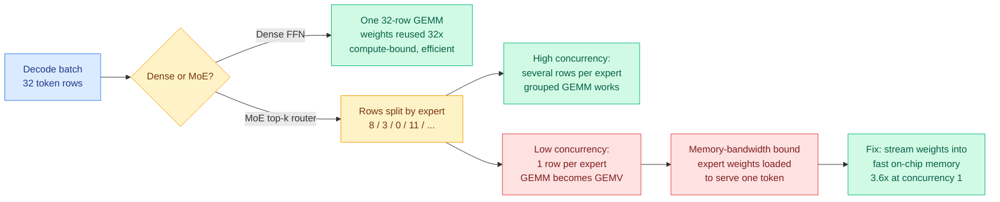

# MoE decode fragments the batch, and at low concurrency your matrix multiply becomes a vector multiply

**Date ingested:** 2026-09-19
**Source:** Two independent practitioner writeups landing the same day. [@_avichawla on X](https://x.com/_avichawla/status/2101047529496535177) (the production-reality thread, with the Ironwood TPU case study) and [Ken Huang, "Chapter 7: Serving Mega-MoE at Scale"](https://kenhuangus.substack.com/p/chapter-7-serving-mega-moe-at-scale) (Gmail starred, part 7 of a 10-part inference-engineering series).
**Raw:** [raw/twitter/feed/2026-09-19-morning-ranked.json](../../raw/twitter/feed/2026-09-19-morning-ranked.json) · [raw/gmail/2026-09-19-starred.md](../../raw/gmail/2026-09-19-starred.md)

## TL;DR

A mixture-of-experts layer (MoE, where a router sends each token through a small subset of specialised sub-networks) is sold as a compute saving: you hold 1.6 trillion parameters but only activate 37 billion per token. That is true of the FLOP count and false of the hardware utilisation, and the gap between the two is where most MoE serving cost lives. **Routing does not just reduce work, it shreds the batch.** A dense transformer sends all 32 rows of a decode batch through one weight matrix in one matrix multiply and reuses those weights 32 times. An MoE router splits those same 32 rows across dozens of experts with wildly unequal counts, so a single fat matrix multiply becomes many thin ones. At high concurrency that is manageable with grouped GEMM. At low concurrency it collapses: with three concurrent requests on Qwen-3.5-397B-A17B-FP8, each token picking ten experts from a pool of 512, engineers measured **only 5% expert overlap across requests**, meaning most expert batches contained exactly one row. At that point the operation is not a matrix multiply at all, it is a matrix-vector multiply, and the accelerator is spending its entire time budget streaming expert weights it will use once. A custom kernel that prefetched selected expert weights into the TPU's fast VMEM and executed the vector-shaped work directly gave a **3.6x faster MoE block at concurrency one**.

## The mechanism

The step-by-step is worth carrying because the failure is invisible in an architecture diagram. Take a top-1 router and 32 rows. Expert 1 gets 8 rows, expert 2 gets 3, expert 3 gets 0, expert 4 gets 11, the rest share 10. The engine must now group rows by expert, run each expert separately, apply the routing weights, then restore the original token order. With top-k routing the same token appears in several of those groups, so the row count grows even as the FLOP count falls. Grouped GEMM, which schedules several differently-sized expert multiplies in one launch, exists precisely to amortise the launch overhead, and it works well when each active expert receives several rows.

The regime where it stops working is ordinary autoregressive decoding at low load. Each active request contributes exactly one current token per model step. With one to three requests in flight, the experts those few tokens select barely overlap, so a pool of 512 experts with top-10 routing produces dozens of single-row expert batches. Grouped GEMM can fuse the launches but it cannot manufacture rows. **The correct response is not a better GEMM, it is to stop pretending the work is a GEMM**, which is what the Ironwood kernel did by prefetching the selected experts' weights into VMEM and running the GEMV-shaped operation directly. The generalisable rule the thread lands on: the right execution strategy is a function of the expert-batch *shape*, several rows per expert favours grouped GEMM, one row per expert favours hardware-specific weight streaming, and the architecture is identical in both cases.

## The other half: what a trillion-parameter MoE needs around it

Ken Huang's chapter covers the serving stack that the fragmentation problem sits inside, naming the current generation explicitly: DeepSeek-V4-Pro at 1.6T total and 37B active, Moonshot Kimi K3 at 2.8T, Alibaba Qwen 3.8-Max at 2.4T. The components he lists as load-bearing:

- **Auxiliary-loss-free bias routing.** Load balancing across experts done by adjusting a per-expert bias rather than by adding a balancing term to the loss, which avoids the quality tax that auxiliary losses impose.
- **4D parallelism (tensor x pipeline x expert x data).** Expert parallelism is the axis that generates the all-to-all traffic, and it is the axis the fragmentation problem interacts with, because scattering tokens to experts across nodes is a network operation as well as a scheduling one.
- **DualPipe bidirectional overlap.** DeepSeek's scheme for running computation GEMMs concurrently with the inter-node all-to-all phases, so the network time hides under the math time instead of adding to it.
- **100k+ GPU non-blocking Clos fabrics**, with xAI's Colossus and Spectrum-X adaptive routing as the reference build.
- **Bandwidth-proportional offloading for consumer hardware** (UC Berkeley's FreeToken), placing expert weights across heterogeneous PCIe and CPU bandwidth tiers for 35B to 753B models.

## How this connects to what the wiki already knows

**This supplies the missing half of a number the [routing page](../ai-routing/llm-routing.md) has been asking for since 09-14, and it comes from inside the model rather than across a model pool.** The page named routing-granularity-versus-batch-size as its missing quantity: a router that buys accuracy by splitting traffic across four models pays part of the bill in destroyed batch efficiency, and no router paper subtracts it. [Sample Count Is Not Enough (09-18)](2026-09-18-sample-count-generation-schedule-energy.md), which showed that eight serial single-candidate calls cost 4.64 to 4.86 times the GPU energy of one batched call of eight, established the order of magnitude for *external* fragmentation. **This establishes it for internal fragmentation, and the 3.6x figure means an MoE model is already paying a batch-fragmentation tax before any router touches it.** The two taxes compose, and nobody has added them up.

**It also puts a hard concurrency floor under the week's dominant efficiency story.** [DeepSeek-V4.1-Flash (09-18)](../inference-efficiency/2026-09-18-deepseek-v41-flash-kv-cache-compression.md) got its KV cache to 890 bytes per token, and the practitioner enthusiasm all week has been about running agents cheaply overnight, which is a **low-concurrency** pattern by construction: one person, one long autonomous session, a handful of requests in flight. That is exactly the regime where MoE decode degenerates to GEMV. **The cache compression is real and the per-token price is real, but the utilisation at one to three concurrent sessions is the number nobody in that conversation has quoted**, and this thread says it can be 3.6x off optimal without a hand-written kernel.

**Third, it reframes the offloading debate from 09-18 in a way neither side stated.** [SemiAnalysis's Engram piece](2026-09-18-semianalysis-engram-dram-ssd-offloading.md) argued that offloading a 189 GiB embedding table to host DRAM beats keeping it in HBM because the freed memory buys batch size. That argument is *entirely* a concurrency argument, and this thread supplies the mechanism for why batch size is worth so much in an MoE: below a few dozen concurrent requests the expert batches are too thin to use the hardware at all. **Freed HBM is not valuable because more sessions fit, it is valuable because more sessions is what makes the experts wide enough to be worth multiplying.**

## Gaps

Both sources are practitioner writeups rather than papers, and the single hard number, 3.6x at concurrency one on an Ironwood TPU configuration, is a second-hand report of someone else's optimisation with no public artifact. The crossover concurrency, the point at which grouped GEMM starts beating weight streaming, is named as the decision variable and never measured. The 5% expert-overlap figure is specific to one model's router (top-10 of 512) and would look very different at top-2 of 8. And Ken Huang's chapter is paywalled past the roadmap, so the parallelism and cost-engineering details are a table of contents rather than evidence.

## Related pages

- [gpu-kernels.md](gpu-kernels.md)
- [memory-hierarchy.md](memory-hierarchy.md)
- [compute-economics.md](compute-economics.md)
- [llm-routing.md](../ai-routing/llm-routing.md)
- [Colla-Q: minimax bit allocation across MoE experts (09-19)](../inference-efficiency/2026-09-19-colla-q-moe-quantization-minimax.md)
- [Sample Count Is Not Enough (09-18)](2026-09-18-sample-count-generation-schedule-energy.md)
