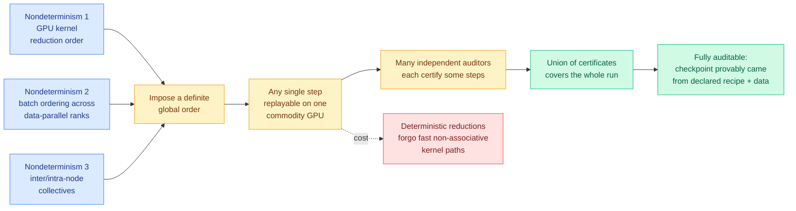

# OPEN-1B: making a distributed training run bitwise-replayable on one commodity GPU

**Date:** 2026-09-20
**Topic:** hardware
**Source:** Kurate cs.LG leaderboard #8 (ai_rating 7.0/10, the highest score on either board this week; absent from HuggingFace Daily Papers)
**Link:** [arXiv:2609.17380](http://arxiv.org/abs/2609.17380)
**Authors:** John Donaghy, Brian Wilcox, Oğuzhan Ersoy, Shikhar Rastogi, Adam St Arnaud et al.
**Raw:** `raw/kurate/2026-09-20-cs-lg.md`

---

## TL;DR

Open-weight models are not reproducible, and the reason is arithmetic rather than policy. Floating
point addition is not associative, so summing the same numbers in a different order gives a
different answer. Deep learning frameworks offer deterministic modes, but that determinism holds
only on the same hardware. The consequence is that **nobody can verify that a published checkpoint
was produced by the published recipe on the published data**, even when all three are released. That
gap is where undisclosed data, injected bias and backdoors live, and neither proof-of-learning nor
proof-of-training-data closes it.

This paper proposes a tier of transparency it calls **fully auditable**: every operation on every
sample during training is independently reproducible on heterogeneous commodity hardware with
bitwise certainty. It gets there by imposing a definite order on the three sources of training
nondeterminism: **GPU kernel reduction order**, **data batch ordering across a data-parallel
cluster**, and **inter-node and intra-node collective communication**. With those pinned, any single
step of a large distributed run can be replayed on one commodity GPU and checked against the
published trajectory.

Replaying an entire run on one machine is infeasible, so the paper pairs this with a **collective
verification scheme**: many independent auditors each certify individual steps, and their coverage
adds up to the whole run. They release Open-1B, a model trained under the regime, with its full
pretraining dataset and every intermediate checkpoint.

---

---

## Why this belongs on the hardware page rather than the safety page

The framing is governance but the mechanism is entirely kernel-level, and that is what makes it
interesting here. The three things the paper has to pin are the three things every performance
engineer deliberately leaves unpinned:

- **Reduction order inside a GPU kernel** is free to vary because letting the hardware schedule
  partial sums in whatever order the warps finish is faster than forcing a tree. Pinning it means
  giving up the fast path.
- **Batch ordering across data-parallel ranks** varies because ranks are allowed to consume from a
  shared stream opportunistically, which is what keeps stragglers from stalling the step.
- **Collective communication** (all-reduce and friends) varies because NCCL-style libraries pick
  their algorithm and their tree topology at runtime based on message size and interconnect
  conditions, which is most of how they stay fast.

So the paper is proposing a **compute-for-verifiability trade**, and it is the same shape as several
trades this wiki already tracks. [DeepSeek-V4.1-Flash's SWA Bounded Replay
(09-18)](../inference-efficiency/2026-09-18-deepseek-v41-flash-kv-cache-compression.md) declines to
store sliding-window KV state and regenerates it on demand, paying compute to save storage. This pays
throughput to buy an audit trail. The unit of the trade is different, the structure is not.

**The collective verification scheme is the part worth stealing.** Replaying a full pretraining run
is not something any single party will do, so the paper makes verification a coverage problem rather
than a reproduction problem: cheap per-step checks, distributed across many auditors, with the union
standing in for the whole. That is a sampling argument, and how strong the resulting guarantee is
depends entirely on whether an adversary can predict which steps go unchecked.

---

## Relation to prior wiki pages

**Fills a gap the [compute-economics page](compute-economics.md) has not addressed.** That page
tracks what training costs and who can afford it. It has no entry on what a training run *proves*.
As open-weight models take over the volume tier (see
[the open-weight token share inversion (09-20)](../ai-industry/2026-09-20-open-weight-token-share-inversion.md),
where open models reached 78.4% of gateway token volume), the question of whether a downloaded
checkpoint is what its card says becomes a procurement question rather than an academic one.

**It is the counterweight to this week's self-improvement thread.** [ScientistTwo
(09-20)](../agentic-systems/2026-09-20-scientisttwo-recursive-self-improvement.md) reports an agent
improving 86 of 107 human methods and using its own results as the next baseline. An automated
research loop that compounds on its own output makes provenance harder, not easier, because each
generation's claims rest on the previous generation's unverified artifacts. A bitwise audit tier is
the only proposal this week that addresses that.

**It is the strongest "LLM-rated underrated" signal of the week.** At ai_rating 7.0 it tops both
Kurate boards, and it does not appear in HuggingFace Daily Papers at all. HuggingFace ranks by
community upvotes, which reward papers that are fun to share; a paper about deterministic
all-reduce ordering is not that. The divergence is the signal.

---

## Gaps

The abstract does not state the throughput cost, and that number decides whether this is a tier
anyone will use. Forcing deterministic reductions and fixed collective topologies has a known price
and it is not small. A 1B model is also small enough that the determinism constraints may bind
differently than they would at frontier scale, where communication topology matters far more. And
the collective verification scheme's security argument is only as good as the unpredictability of
which steps get audited, which the abstract does not address.

---

## Related pages

- [GPU kernels](gpu-kernels.md)
- [Compute economics](compute-economics.md)
- [Memory hierarchy](memory-hierarchy.md)
- [Responsible AI](../responsible-ai/responsible-ai.md)
- [Scaling laws](../llms-foundation-models/scaling-laws.md)
