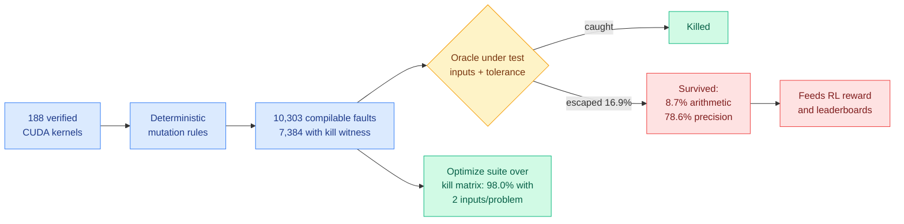

# Measuring the Checker: Mutation Analysis for GPU-Kernel Benchmark Oracles (KernelBench-M)

**Source:** HuggingFace Daily Papers 2026-09-22 · [arxiv 2609.22220](https://arxiv.org/abs/2609.22220) · [KernelBench-M dataset](https://huggingface.co/datasets/Elfsong/KernelBench-M)
**Raw:** [raw/huggingface/](../../raw/huggingface/)

## TL;DR

Benchmarks that judge LLM-written GPU kernels decide correctness with a handful of random inputs and a loose floating-point tolerance. Those verdicts now feed leaderboards **and reinforcement-learning reward signals**. Everyone agrees the checkers are weak; nobody could measure how weak, so patches were guesswork. This paper imports mutation analysis from software testing as an adequacy metric: inject deterministic compilable faults into verified CUDA implementations, then score any test protocol by the fraction it catches. **10,303 faults across 188 KernelBench problems, 7,384 with an independent kill witness.** The official checker misses **16.9%, one in six witnessed faults, deterministically**. And the misses are wildly skewed: **8.7% of arithmetic faults escape but 78.6% of precision faults do**.

## What the metric buys that opinion did not

Four things, and each is a thing no amount of hand-patching could produce:

- **It explains the blindness mechanically.** There is a tolerance blind band that **grows with reduction size**, and a measured ceiling on how aggressive inputs can get before legitimate floating-point variance starts rejecting correct kernels.
- **It audits a patch.** KernelBench-Verified's improvement splits into **+4.0 points from hidden inputs and +4.5 from tighter tolerance**, a decomposition its own authors could not compute.
- **It catches a published fix that is worse than the disease.** A circulating fuzzing recipe **rejects correct kernels 107 times**.
- **It builds a better suite cheaply.** Optimizing over the kill matrix reaches **98.0% detection with two inputs per problem** (94.8% held out), and the fault taxonomy teaches a test generator more than the raw faults do.

Two problems in the set turn out to be **unrefereeable**: their official reference implementations violate the benchmark's own tolerance when checked against fp64. And across 48 whole architectures, **blindness grows with scale**, concentrating in deep homogeneous pipelines.

## Why this is the most consequential paper of the day

**It is a measurement-crisis result aimed squarely at the reward signal, not the leaderboard.** A 16.9% deterministic miss rate on a leaderboard is embarrassing. The same miss rate inside an RL reward is a **reward-hacking surface**: a policy trained against this oracle is being actively rewarded for producing kernels whose faults live in the blind band, and 78.6% of precision faults escaping means the cheapest direction for a kernel-writing policy to improve its score is to **degrade numerics**. The paper does not run that experiment, and it is the obvious next one.

**It lands on [gpu-kernels](gpu-kernels.md) as the first entry about the evaluator rather than the kernel.** That page's running law, that removing one bottleneck promotes whatever you left on the general-purpose path, has an analogue here: every prior entry optimized the kernel against an oracle nobody had priced. [VC-Attention (09-17)](../inference-efficiency/2026-09-17-vc-attention-low-bit-value-smoothing.md), which found the value term carries roughly 82% of remaining attention output error and fixed it with token reordering, is precisely a **precision-side** contribution, and precision faults are the category this oracle catches worst. The wiki's low-bit attention and quantization cluster is the literature most exposed to this finding.

**Connect it to [quantization](../inference-efficiency/quantization.md) directly.** That page's entire premise is trading numerical precision for bytes moved, evaluated against tolerance-based correctness checks. If tolerance-based checking is blind to 78.6% of precision faults and the blind band grows with reduction size, then **large-reduction quantized kernels are the exact case where "passes the check" carries least information**. This is a standing caveat that belongs on every quantized-kernel result this wiki has recorded.

## Gaps

Mutation adequacy is a proxy: killing injected faults is not the same as catching the faults an LLM actually writes, and LLM-generated kernel errors may have a different distribution than the deterministic mutation rules produce. The optimized two-input suite is fitted on the kill matrix, and 94.8% held-out against 98.0% fitted is a real generalization gap. No downstream experiment showing an RL-trained policy actually exploiting the blind band.

## Links

- [gpu-kernels](gpu-kernels.md)
- [quantization](../inference-efficiency/quantization.md)
- [agent-benchmarks](../agentic-systems/agent-benchmarks.md)
