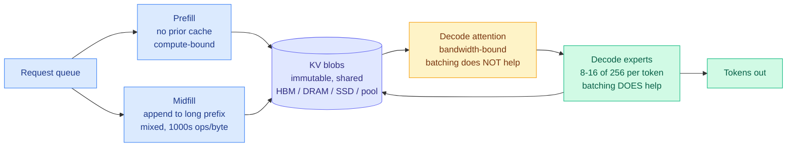

# SemiAnalysis: Computation and Data Movement for Inference

**Source:** SemiAnalysis, 2026-09-21 · [newsletter.semianalysis.com](https://newsletter.semianalysis.com/p/computation-and-data-movement-for)
**Raw:** [raw/rss/2026-09-21-semianalysis-computation-and-data-movement-for-inference.md](../../raw/rss/2026-09-21-semianalysis-computation-and-data-movement-for-inference.md) · also in [raw/gmail/2026-09-22-starred.md](../../raw/gmail/2026-09-22-starred.md)

## TL;DR

A full system-level account of what a mixture-of-experts serving cluster actually does, written as an argument that the usual two-phase framing is wrong. SemiAnalysis splits inference into **four** operating regimes, not two: prefill, **midfill**, decode attention, and decode experts. Midfill, appending new tokens to an already-large cached prefix, is the regime that agentic work actually lives in and the one nobody models separately. The piece then treats KV state as **immutable blobs in a shared object store** rather than as something attached to a machine, which is the architectural move that makes prefill, midfill and decode independently schedulable.

## The claims worth keeping

**Midfill is the missing regime, and agentic serving is mostly midfill.** Prefill starts from nothing and "rarely gets to 100,000 tokens," while midfill "is commonly beyond that." Midfill raises arithmetic intensity to thousands of operations per byte through shared weight and expert reuse, but must read tens of gigabytes of existing KV state. It is neither compute-bound nor memory-bound; it is both, in a ratio that depends on how long the conversation already is. Every capacity-versus-bandwidth argument this wiki has recorded was made about prefill or decode.

**Batching helps the two decode regimes by completely different amounts, and this is the sharpest technical point in the piece.** In decode *attention*, "each query brings its own context, so batching queries does not change the arithmetic intensity of attention." In decode *experts*, batching is the entire game: tokens selecting the same expert share one weight load even across unrelated users' requests. **Attention scales with users; experts amortize across them.** Treating decode as one workload gives away the structural advantage MoE offers.

**This is the real reason NVLink connects 72 GPUs.** With roughly 15,000 experts across all layers and 256 per layer, splitting one layer 72 ways leaves each GPU holding three or four experts, which lets a worker cycle the full expert bank fast. The cost is all-to-all traffic, and the piece is blunt that "the network may absorb more money and power than the experts they connect."

**The SRAM thought experiment is the forward-looking part.** If experts fit in SRAM, energy per byte loaded is up to **100x better than HBM**, and there is no longer a reason to wait for a batch to form at all: one token becomes as efficient as a queue of a hundred was. That would free instances from the synchronization that expert parallelism currently demands. The gotcha is the same one: a sub-microsecond expert turnaround floods a switch serving hundreds of nodes.

**The blob-store framing gives KV a discard-and-rebuild policy.** Because the underlying text is "orders of magnitude smaller than the expanded KV representation," a classifier can evict a KV blob and rebuild it from text later. HBM is explicitly reserved for "data in an active batch currently earning revenue."

## Relation to prior wiki knowledge

**It resolves the capacity-versus-bandwidth contradiction on [kv-cache](../inference-efficiency/kv-cache.md) the same way that page already did, and from the same publisher.** That page set [Long Live the Short King (09-14)](2026-09-14-semianalysis-4hi-hbm-bandwidth-over-capacity.md), which argued an HBM4 cube exposes 2,048 data I/Os regardless of stack height so you should stop paying for capacity, against [Vera Rubin NVL72 (09-15)](2026-09-15-semianalysis-vera-rubin-agentic-inference.md), which defined agentic work as the regime where the cached-input ratio tends to 1. The page resolved it via [Mooncake's tiered KV store (09-15)](../inference-efficiency/2026-09-15-disaggregated-serving-mooncake-distserve.md) and concluded that **KV capacity and KV bandwidth are separately purchasable**. SemiAnalysis now states that resolution as its own architecture: HBM for the hot active tier, DRAM for staging, SSD and the shared pool for everything else, with a reuse classifier deciding. **The wiki reached this three days before the publisher did, from the publisher's own contradictory pieces.**

**It supplies the serving-side counterpart to the compaction debate.** The [09-20 Looking Ahead](../daily-digest/2026-09/2026-09-20.md) predicted a compaction head-to-head and warned that delete-style filtering would look materially worse than token counts suggest **once KV cache hit rate is reported**. SemiAnalysis's AgentX traces show compactions happening as contexts approach the practical limit (250k for Opus 4.8, 1M for Fable), and states plainly that "after a compaction there will be many prior blobs which have been abandoned." That is the hit-rate cost made concrete: **compaction is a cache-invalidation event, and its token saving is measured on the wrong side of the ledger.**

**It reframes what a router is routing.** [llm-routing](../ai-routing/llm-routing.md) has treated routing as model selection. This piece describes an orchestrator choosing, per turn, which *regime pool* a request enters and which worker has a matching slot for its context length and service objective. **Regime routing is a larger cost lever than model routing in an agentic workload**, and no paper on this wiki prices it.

## Gaps

No dollar figures and no measured comparison between aggregated and disaggregated configurations, both promised for a later section. The SRAM-expert scenario is a projection from a simulator, not a measurement. And the AgentX traces are proprietary, so the compaction behavior described ("stalactites... some proprietary behavior in Anthropic models") is unverifiable from outside.

## Links

- [kv-cache](../inference-efficiency/kv-cache.md) · [memory-hierarchy](memory-hierarchy.md) · [compute-economics](compute-economics.md)
- [llm-routing](../ai-routing/llm-routing.md)
