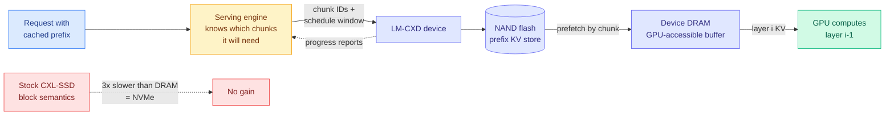

# LM-CXD: Bridging LLM Serving and CXL-SSDs with Chunk-Aware KV Cache Management

**Source:** arXiv [2609.26828](https://arxiv.org/abs/2609.26828) · surfaced via X home feed ([@MuzafferKal_](https://x.com/MuzafferKal_/status/2103029773253722274)), quietly high-signal off a small account
**Raw:** `raw/twitter/feed/2026-09-24-evening-ranked.json`

## TL;DR

Prefix caching (keeping the KV cache of shared prompt prefixes so repeat requests skip prefill) needs far more capacity than GPU memory or host DRAM can supply, so the natural home is NAND flash. The paper's first finding is that the block I/O path is the problem, not the NAND: CPU cache contention and host-DRAM staging cost almost as much even when the "storage" is DRAM. CXL-SSDs (flash exposed as byte-addressable memory over the CXL interconnect) should fix that, but a **stock CXL-SSD is about 3x slower than local DRAM and no faster than NVMe**, and generic prefetching barely helps. LM-CXD specializes the device for LLM serving: KV chunks become device-visible I/O units, the device reports NAND-to-DRAM progress to the serving engine, device DRAM becomes a GPU-accessible buffer, and layerwise KV movement is pipelined with GPU compute. Across five models it cuts average TTFT (time to first token) by **up to 4.03x** over a stock CXL-SSD and lands **within 1.5x of local DRAM**.

## Key claims

- Interface costs (CPU cache contention, host-DRAM staging) persist even with DRAM as the backing medium, so faster flash alone does not help.
- Stock CXL-SSD: ~3x slower than local DRAM, no better than NVMe, generic prefetch ineffective.
- LM-CXD: up to **2.6x** TTFT reduction with compute-asynchronous prefetching and **4.03x** with layerwise prefetching; **within 1.5x of local DRAM** on average across five models.
- The mechanism is closing a **semantic gap**: the engine knows which chunks will be consumed, the device controls placement, and neither told the other before.

## Relation to prior wiki pages

- **The hardware half of [KVMEM (09-23)](../inference-efficiency/2026-09-23-kvmem-paged-agent-memory.md)**, which paged an agent's KV state across GPU, RAM and NVMe in software. LM-CXD says the NVMe tier underperforms because of the block interface, and moves the paging logic into the device.
- **Confirms [Semiconductor Week 38 (09-23)](2026-09-23-semiconductor-week-38-hbf-pim-tiered-kv.md)**, where SK hynix put "tiered KV cache management" on a memory roadmap. This is the first paper on the wiki showing what that feature has to contain to matter: chunk awareness and engine-visible progress, not raw bandwidth.
- **Third SSD-offload result this week**, alongside [Disaggregated Quantization's ODP](../inference-efficiency/2026-09-24-disaggregated-quantization-prefill-decode.md) (prefill weights streamed from SSD) and [Memory Attention's CPU-offloaded value tables](../llms-foundation-models/2026-09-24-memory-attention-token-indexed-values.md). Flash is becoming a first-class inference tier.
- **The economic counterpart** is the 09-22 cache-read price cut ([price war](2026-09-23-price-war-cache-reads.md)): Opus 5.5 cache reads fell 60%. Cheaper cache reads only pay if the provider can hold more prefixes, and capacity is exactly what this attacks.

## Gaps

Requires a custom CXL-SSD, so this is a device proposal, not a drop-in. "Within 1.5x of DRAM" is an average over five models; tail latency under contention is not in the abstract. Throughput under many concurrent prefix hits, the regime that decides provider economics, is not reported.

## Research angle

The device needs to know which chunks the engine will consume. A decision model or learned predictor (see [the routing page](../ai-routing/llm-routing.md)) choosing which prefixes to prefetch is the obvious composition, and it turns cache prefetch into a routing problem.

**Related:** [memory-hierarchy](memory-hierarchy.md) · [kv-cache](../inference-efficiency/kv-cache.md) · [compute-economics](compute-economics.md)
