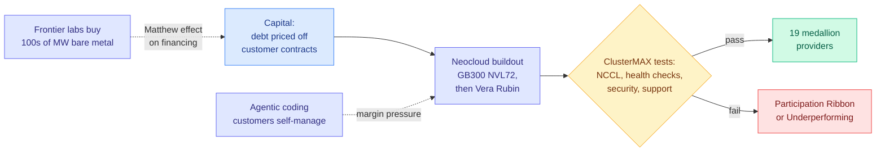

# SemiAnalysis ClusterMAX 3.0: the GPU cloud rating returns

**Source:** SemiAnalysis, 2026-09-23 ([post](https://newsletter.semianalysis.com/p/clustermax-30-the-industry-standard)), starred in Gmail 2026-09-24
**Raw:** `raw/rss/2026-09-23-semianalysis-clustermax-30-the-industry-standard-gpu-cloud-rating-sy.md`, `raw/gmail/2026-09-24-starred.md`

## TL;DR

SemiAnalysis's third hands-on rating of managed GPU clusters covers **77 tested providers** inside a market view of **323** (up from 209 in ClusterMAX 2.0), informed by over 200 end-user interviews and a 30,000-word appendix. Headline moves: **Nebius joins CoreWeave in Platinum**, Google Cloud joins Oracle in Gold, Azure drops to Silver, Crusoe to Bronze, Fluidstack to Unavailable, and only **19 neoclouds** worldwide earn a medallion. A new "Participation Ribbon" tier (15 providers) sits between Bronze and Underperforming. The opening line sets the market context: **"GPU supply has gone to zero."**

## Key claims (from the free portion)

- **GB300 NVL72 is the most-demanded system** and often the best perf per dollar despite higher prices. Failed nodes usually are **not auto-remediated**, because a node cannot be hot-swapped into an NVL72 rack; the common SLA shape is "NVL64+" (sell 64 GPUs of guaranteed capacity with spares). Nebius was the only tested provider that automatically returned a failed GB300 node to service, taking 8h40m.
- **Vera Rubin is an easier migration than Hopper to Blackwell was**, because the rack architecture carries over from Grace Blackwell.
- **Financing has a Matthew effect**: profitable frontier labs lock capacity cheaply; smaller labs get "fat prepays, worse prices" and trouble planning. Neoclouds borrow against creditworthy customer contracts (in the Anthropic TPU neocloud structure, Broadcom supports equipment financing and Google supports datacenter rent). Named facilities include Firmus **$10B**, QumulusAI **$500M** non-recourse, and a neocloud "with $35B in debt" facing rising cost of capital.
- **Agentic coding is compressing managed-cluster margins**: customers who use AI tools to run their own infrastructure are more willing to take bare metal.
- **Reliability failures are often software**, not hardware: an old kernel writeback bug that froze NUMA nodes when Slurm jobs tore down (later CVE-2026-64378), AWS Karpenter tearing down a B200 cluster 39 minutes early mid-job, Google's GB300 NCCL picking an unroutable link-local GID and hanging, Firmus exposing HBM as NUMA nodes so host overflow can swamp device memory.

## Relation to prior wiki pages

- **The supply side of the [09-22/23 price war](2026-09-23-price-war-cache-reads.md).** Anthropic and OpenAI cut token prices while SemiAnalysis reports zero spare GPU supply. Price cuts under a supply wall mean the labs are passing through efficiency gains, not excess capacity, which is why the cuts concentrated on cache reads.
- **Extends [SemiAnalysis's 09-22 inference data-movement essay](2026-09-22-semianalysis-inference-data-movement.md)** from the chip to the cluster: "if a cluster can't survive NCCL tests, it won't produce many tokens," measured as lost goodput in their InferenceX runs.
- **Links to [compute-economics](compute-economics.md)**: The Information's same-day report that CoreWeave's largest delayed-draw term loan ($8.5B) is roughly half floating-rate, now exposed to a Fed hike, is the financing risk this report describes from the operator side.
- **The agentic-coding margin point echoes [HarnessTax (09-22)](../agentic-systems/2026-09-22-harnesstax-cost-success-frontier.md)**: the same tools cutting software labor are cutting the managed-service premium on infrastructure.

## Gaps

The full podium, per-provider scores and trend sections are partly paywalled. Ratings are hands-on snapshots on short access windows (one provider was tested during another customer's burn-in).

**Related:** [compute-economics](compute-economics.md) · [memory-hierarchy](memory-hierarchy.md) · [gpu-kernels](gpu-kernels.md)
