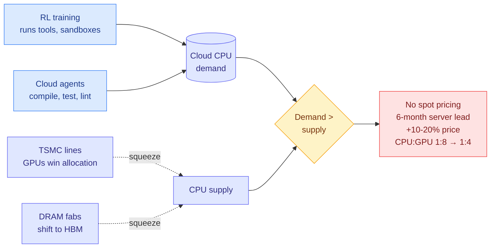

# The Pulse: a new trend of CPU shortages (Pragmatic Engineer)

**Source:** The Pragmatic Engineer, bonus free issue sent 2026-09-24 ([post](https://newsletter.pragmaticengineer.com/p/the-pulse-a-new-trend-of-cpu-shortages)), starred in Gmail 2026-09-25. Paid subscribers got it two weeks earlier.
**Raw:** `raw/gmail/2026-09-25-starred.md` (item 3)

## TL;DR

Gergely Orosz reports from a dinner of CTOs and infrastructure heads that **CPUs, not just GPUs, are now hard to buy in the cloud**. CPU spot pricing, which used to run up to 90% below list, has effectively vanished. Reservations need months of lead time and some are refused outright. The two named causes are workload shifts, not consumer demand. **RL training needs CPUs** to run the software the model is learning to use (search, code execution, test suites). **Agents run tools on CPUs**: compile, test, lint, all on cloud instances rather than a developer's laptop. Supply is squeezed from both sides. TSMC lines prefer GPUs over CPUs, and DRAM makers prefer HBM (the stacked memory on GPU packages) over the regular DRAM that CPU servers need. The datacenter CPU-to-GPU ratio has moved **from 1:8 to about 1:4 and could reach 1:1**. Server orders now take about six months instead of one to two weeks, at prices 10% to 20% higher.

## Key claims

- **turbopuffer (runs on CPUs across AWS, GCP, Azure):** "Getting CPUs is not easy anymore." Labs are "sucking up a lot of CPUs" for RL, and general-purpose agents push demand further. "It gets a lot worse before it gets better."
- **A VP at a large inference provider:** at the limit of both GPU and CPU capacity they can buy from cloud providers, willing to take the longest leases, and still told no more is available.
- **Anthropic's Claude Platform engineering lead (Katelyn Lesse):** three factory bottlenecks. GPUs compete with CPUs (and Apple, Qualcomm, Broadcom) for TSMC lines. HBM competes with DRAM for wafers at SK Hynix, Samsung and Micron. AMD has no fabs; Intel is pulling capacity from PC chips to make server chips while working through yield problems. Analysts expect CPU headroom to return before memory does, but "multiple quarters away."
- **Uber's agent-request growth chart** is offered as evidence that agent traffic is CPU traffic too. Ramp's cloud agent Inspect is cited as the pattern: agents run on dedicated cloud instances.
- **Operational advice:** capacity-plan CPUs up to 12 months ahead, audit which services are CPU-heavy and whether they need to be, and consolidate low-utilization services.

## How this relates to prior wiki pages

- **Extends [compute-economics](compute-economics.md)**, which recorded the CPU tightening on 09-10. This issue adds the mechanism and a number: the CPU-to-GPU ratio halving to 1:4.
- **Connects to [memory-hierarchy](memory-hierarchy.md)'s HBM-vs-DRAM thread.** The same wafer reallocation that made DRAM expensive for consumer devices now makes CPU servers expensive, because CPUs need DRAM.
- **Confirms [agent-training-environments](../agentic-systems/agent-training-environments.md)** as a hardware cost line. RL environments and sandboxes are the named CPU consumer, which puts a physical cost on every "scale RL environments" paper (for example CodeMidas on today's Kurate board).
- **Rhymes with the Memory Attention and LM-CXD results (09-24)**, which move bytes off HBM onto CPU DRAM or flash. If CPU servers and their DRAM are also scarce, offloading to host memory is not free capacity either.

## Gaps

Anecdotal and interview-based. No provider-level data, no regional breakdown, and the issue is two weeks old for paid readers.

## Research angle

Agent harness efficiency now has a hardware price. Every tool call that runs a full test suite, every sandbox that idles between turns, is CPU time that competes with RL training. Work that trims tool execution (selective test running, cached builds, stale-tool-output removal) is a cost-optimization lever in the same class as KV-cache compression, just on the other processor.
